Apatite trace elements
================
Pedro Leite
12-10-2020

## R markdown

We will use R markdown to display the results

``` r
library(ggplot2)
library(gridExtra)
library(yaml)
library(knitr)
knitr::opts_chunk$set(echo = FALSE)
knitr::opts_knit$set(root.dir= normalizePath('..'))
knitr::opts_chunk$set(error = FALSE)
```

## GitHub Documents

This is an R Markdown format used for publishing markdown documents to
GitHub. When you click the **Knit** button all R code chunks are run and
a markdown file (.md) suitable for publishing to GitHub is generated.

    ## 'data.frame':    131 obs. of  59 variables:
    ##  $ Sample_ID : Factor w/ 131 levels "B6_ap_1_1","B6_ap_1_2",..: 1 2 3 4 5 6 7 8 9 10 ...
    ##  $ Sample    : Factor w/ 11 levels "B6","BS07","FD20-7",..: 1 1 1 1 1 1 1 1 1 1 ...
    ##  $ Deposit   : Factor w/ 5 levels "Francisco deposit",..: 5 5 5 5 5 5 5 5 5 5 ...
    ##  $ Nature    : Factor w/ 3 levels "Barren, A-type",..: 2 2 2 2 2 2 2 2 2 2 ...
    ##  $ Zone      : Factor w/ 2 levels "Hydrothermal",..: 1 1 1 1 1 1 1 1 1 1 ...
    ##  $ Class     : Factor w/ 7 levels "Francisco deposit",..: 7 7 7 7 7 7 7 7 7 7 ...
    ##  $ CL        : Factor w/ 4 levels "CL-green","CL-grey",..: 1 1 1 1 1 1 1 1 1 1 ...
    ##  $ F_pct     : num  3.51 4.04 3.64 3.85 3.69 3.91 3.99 4.04 4.1 3.78 ...
    ##  $ Si_pct    : num  0.08 0.11 0.03 0.08 0.13 0.05 NA 0.03 0.02 0.02 ...
    ##  $ Mg_pct    : num  0.02 0.04 0.03 0.04 0.04 0.04 0.01 0.03 0.03 0.01 ...
    ##  $ Na_pct    : num  0.27 0.2 0.25 0.24 0.17 0.16 0.1 0.11 0.12 0.14 ...
    ##  $ Ca_pct    : num  37.8 37.7 37.6 37.2 37.5 ...
    ##  $ P_pct     : num  17.6 17.8 17.5 17.9 17.6 ...
    ##  $ Cl_pct    : num  0.1 0.1 0.15 0.19 0.17 0.2 0.06 0.16 0.11 0.11 ...
    ##  $ Fe_pct    : num  0.25 0.19 0.29 0.31 0.26 0.29 0.07 0.2 0.2 0.07 ...
    ##  $ Mn_pct    : num  0.84 1.02 1.09 1.17 1.03 1.13 0.65 1.03 0.84 0.64 ...
    ##  $ Ce_pct    : num  0.19 0.24 0.16 0.16 0.16 0.14 0.08 0.14 0.11 0.16 ...
    ##  $ La_pct    : num  0.06 0.06 0.05 0.07 0.04 0.06 NA 0.05 0.05 0.05 ...
    ##  $ Nd_pct    : num  0.08 0.11 0.11 0.11 0.12 0.08 0.06 0.08 0.07 0.08 ...
    ##  $ B_ppm     : num  NA NA 3.05 2 5 2.51 3.05 2.81 2.75 NA ...
    ##  $ Mg_ppm    : num  NA NA 389 668 393 ...
    ##  $ Si_ppm    : num  NA NA 2761 2536 2409 ...
    ##  $ P_ppm     : num  NA NA 157416 160435 140918 ...
    ##  $ Ca_ppm    : num  NA NA 375621 372543 375350 ...
    ##  $ Sc_ppm    : num  NA NA 3.84 2.85 2.77 1.6 0.32 1.83 1.67 NA ...
    ##  $ Ti_ppm    : num  NA NA 811 779 785 ...
    ##  $ V_ppm     : num  NA NA 5.31 4.43 8.59 3.97 0.33 3.09 3.48 NA ...
    ##  $ Mn_ppm    : num  NA NA 11560 11781 11679 ...
    ##  $ Fe_ppm    : num  NA NA 2344 2997 2267 ...
    ##  $ Ga_ppm    : num  NA NA 0.17 0.47 0.15 0.14 0.17 0.39 0.38 NA ...
    ##  $ Ge_ppm    : num  NA NA 83.6 92.6 97.2 ...
    ##  $ As_ppm    : num  NA NA 10.02 11.65 9.23 ...
    ##  $ Rb_ppm    : num  NA NA 0.73 0.22 0.52 0.2 0.22 0.53 0.7 NA ...
    ##  $ Sr_ppm    : num  NA NA 337 342 332 ...
    ##  $ Y_ppm     : num  NA NA 4576 4114 4127 ...
    ##  $ Zr_ppm    : num  NA NA 1.78 0.78 0.62 0.79 0.14 2.14 0.81 NA ...
    ##  $ Nb_ppm    : num  NA NA 0.09 1.52 0.07 0.08 0.07 0.08 0.27 NA ...
    ##  $ Ba_ppm    : num  NA NA 1.65 7.07 1.25 2.95 1.81 2.49 1.14 NA ...
    ##  $ La_ppm    : num  NA NA 585 630 644 ...
    ##  $ Ce_ppm    : num  NA NA 1765 1738 1943 ...
    ##  $ Pr_ppm    : num  NA NA 281 280 307 ...
    ##  $ Nd_ppm    : num  NA NA 1448 1475 1554 ...
    ##  $ Sm_ppm    : num  NA NA 521 500 561 ...
    ##  $ Eu_ppm    : num  NA NA 30.9 25.2 30.9 ...
    ##  $ Gd_ppm    : num  NA NA 618 569 595 ...
    ##  $ Tb_ppm    : num  NA NA 121 105 116 ...
    ##  $ Dy_ppm    : num  NA NA 823 688 734 ...
    ##  $ Ho_ppm    : num  NA NA 175 140 149 ...
    ##  $ Er_ppm    : num  NA NA 497 370 404 ...
    ##  $ Tm_ppm    : num  NA NA 74.5 54.6 58.9 ...
    ##  $ Yb_ppm    : num  NA NA 565 414 433 ...
    ##  $ Lu_ppm    : num  NA NA 72 55.1 57.5 ...
    ##  $ Hf_ppm    : num  NA NA 3.64 1.98 1.93 2.67 1.83 1.05 2.61 NA ...
    ##  $ Ta_ppm    : num  NA NA 0.15 0.12 0.34 0.08 0.22 0.23 0.13 NA ...
    ##  $ Pb_ppm    : num  NA NA 9.62 5.76 6.29 7.18 3.86 7.22 7.33 NA ...
    ##  $ Th232_ppm : num  NA NA 27.6 14.9 16.3 ...
    ##  $ U238_ppm  : num  NA NA 24.3 27.14 9.69 ...
    ##  $ X         : logi  NA NA NA NA NA NA ...
    ##  $ U238_ppm.1: num  NA NA 34.4 44.8 18 ...

    ##         Sample_ID Sample                     Deposit         Nature
    ## 1       B6_ap_1_1     B6                  X1 deposit   Hydrothermal
    ## 2       B6_ap_1_2     B6                  X1 deposit   Hydrothermal
    ## 3       B6_ap_2_1     B6                  X1 deposit   Hydrothermal
    ## 4       B6_ap_3_1     B6                  X1 deposit   Hydrothermal
    ## 5       B6_ap_3_2     B6                  X1 deposit   Hydrothermal
    ## 6       B6_ap_4_1     B6                  X1 deposit   Hydrothermal
    ## 7       B6_ap_5_1     B6                  X1 deposit   Hydrothermal
    ## 8       B6_ap_6_1     B6                  X1 deposit   Hydrothermal
    ## 9       B6_ap_6_2     B6                  X1 deposit   Hydrothermal
    ## 10      B6_ap_7_1     B6                  X1 deposit   Hydrothermal
    ## 11    PTO19_ap_22  PTO19           Francisco deposit        Igneous
    ## 12    GT-2_ap_1_1   GT-2           Pé Quente deposit        Igneous
    ## 13    GT-2_ap_1_2   GT-2           Pé Quente deposit        Igneous
    ## 14    GT-2_ap_1_3   GT-2           Pé Quente deposit        Igneous
    ## 15    GT-2_ap_2_1   GT-2           Pé Quente deposit        Igneous
    ## 16    GT-2_ap_2_2   GT-2           Pé Quente deposit        Igneous
    ## 17    GT-2_ap_3_1   GT-2           Pé Quente deposit        Igneous
    ## 18    GT-2_ap_3_2   GT-2           Pé Quente deposit        Igneous
    ## 19    GT-2_ap_4_1   GT-2           Pé Quente deposit        Igneous
    ## 20    GT-2_ap_4_2   GT-2           Pé Quente deposit        Igneous
    ## 21    GT-2_ap_4_4   GT-2           Pé Quente deposit        Igneous
    ## 22    GT-2_ap_5_1   GT-2           Pé Quente deposit        Igneous
    ## 23    GT-2_ap_6_1   GT-2           Pé Quente deposit        Igneous
    ## 24    GT-2_ap_6_2   GT-2           Pé Quente deposit        Igneous
    ## 25    GT-2_ap_6_3   GT-2           Pé Quente deposit        Igneous
    ## 26    GT-2_ap_7_1   GT-2           Pé Quente deposit        Igneous
    ## 27    GT-2_ap_7_2   GT-2           Pé Quente deposit        Igneous
    ## 28    GT-2_ap_8_1   GT-2           Pé Quente deposit        Igneous
    ## 29    GT-2_ap_8_2   GT-2           Pé Quente deposit        Igneous
    ## 30    GT-2_ap_9_1   GT-2           Pé Quente deposit        Igneous
    ## 31    GT-2_ap_9_2   GT-2           Pé Quente deposit        Igneous
    ## 32   PGD-1_ap_1_1  PGD-1           Francisco deposit        Igneous
    ## 33   PGD-1_ap_1_2  PGD-1           Francisco deposit        Igneous
    ## 34   PGD-1_ap_4_1  PGD-1           Francisco deposit        Igneous
    ## 35   PGD-1_ap_4_2  PGD-1           Francisco deposit        Igneous
    ## 36   PGD-1_ap_4_3  PGD-1           Francisco deposit        Igneous
    ## 37   PGD-1_ap_4_4  PGD-1           Francisco deposit        Igneous
    ## 38   PGD-1_ap_5_1  PGD-1           Francisco deposit        Igneous
    ## 39   PGD-1_ap_5_2  PGD-1           Francisco deposit        Igneous
    ## 40   PGD-1_ap_5_3  PGD-1           Francisco deposit        Igneous
    ## 41    RA69_ap_1_1   RA69           Pé Quente deposit   Hydrothermal
    ## 42    RA69_ap_1_2   RA69           Pé Quente deposit   Hydrothermal
    ## 43    RA69_ap_2_1   RA69           Pé Quente deposit   Hydrothermal
    ## 44    RA69_ap_2_2   RA69           Pé Quente deposit   Hydrothermal
    ## 45    RA69_ap_3_1   RA69           Pé Quente deposit   Hydrothermal
    ## 46    RA69_ap_3_2   RA69           Pé Quente deposit   Hydrothermal
    ## 47    RA69_ap_3_3   RA69           Pé Quente deposit   Hydrothermal
    ## 48    RA69_ap_4_1   RA69           Pé Quente deposit   Hydrothermal
    ## 49    RA69_ap_5_1   RA69           Pé Quente deposit   Hydrothermal
    ## 50    RA69_ap_5_2   RA69           Pé Quente deposit   Hydrothermal
    ## 51    RA69_ap_5_3   RA69           Pé Quente deposit   Hydrothermal
    ## 52    RA69_ap_7_1   RA69           Pé Quente deposit   Hydrothermal
    ## 53    RA69_ap_7_2   RA69           Pé Quente deposit   Hydrothermal
    ## 54    RA69_ap_7_3   RA69           Pé Quente deposit   Hydrothermal
    ## 55    RA69_ap_8_1   RA69           Pé Quente deposit   Hydrothermal
    ## 56    RA69_ap_8_2   RA69           Pé Quente deposit   Hydrothermal
    ## 57    RA69_ap_8_3   RA69           Pé Quente deposit   Hydrothermal
    ## 58    RA69_ap_9_1   RA69           Pé Quente deposit   Hydrothermal
    ## 59    RA69_ap_9_2   RA69           Pé Quente deposit   Hydrothermal
    ## 60    RA69_ap_9_3   RA69           Pé Quente deposit   Hydrothermal
    ## 61   RA69_ap_10_1   RA69           Pé Quente deposit   Hydrothermal
    ## 62    RA24_ap_1_1   RA24           Pé Quente deposit   Hydrothermal
    ## 63    RA24_ap_3_1   RA24           Pé Quente deposit   Hydrothermal
    ## 64    RA24_ap_4_1   RA24           Pé Quente deposit   Hydrothermal
    ## 65    RA24_ap_5_1   RA24           Pé Quente deposit   Hydrothermal
    ## 66    RA24_ap_5_2   RA24           Pé Quente deposit   Hydrothermal
    ## 67    SPQ1_ap_4_2   SPQ1           Pé Quente deposit   Hydrothermal
    ## 68   SPQ1_ap_10_1   SPQ1           Pé Quente deposit   Hydrothermal
    ## 69   SPQ1_ap_10_2   SPQ1           Pé Quente deposit   Hydrothermal
    ## 70   SPQ1_ap_10_3   SPQ1           Pé Quente deposit   Hydrothermal
    ## 71   SPQ1_ap_11_1   SPQ1           Pé Quente deposit   Hydrothermal
    ## 72   SPQ1_ap_11_2   SPQ1           Pé Quente deposit   Hydrothermal
    ## 73   SPQ1_ap_11_3   SPQ1           Pé Quente deposit   Hydrothermal
    ## 74   SPQ1_ap_11_4   SPQ1           Pé Quente deposit   Hydrothermal
    ## 75   SPQ1_ap_12_1   SPQ1           Pé Quente deposit   Hydrothermal
    ## 76    TP01_ap_1_1   TP01 Teles Pires Intrusive Suite Barren, A-type
    ## 77    TP01_ap_2_1   TP01 Teles Pires Intrusive Suite Barren, A-type
    ## 78    TP01_ap_2_2   TP01 Teles Pires Intrusive Suite Barren, A-type
    ## 79    TP01_ap_2_3   TP01 Teles Pires Intrusive Suite Barren, A-type
    ## 80    TP01_ap_2_4   TP01 Teles Pires Intrusive Suite Barren, A-type
    ## 81    TP01_ap_4_1   TP01 Teles Pires Intrusive Suite Barren, A-type
    ## 82    TP01_ap_4_3   TP01 Teles Pires Intrusive Suite Barren, A-type
    ## 83    TP01_ap_4_4   TP01 Teles Pires Intrusive Suite Barren, A-type
    ## 84    TP01_ap_4_5   TP01 Teles Pires Intrusive Suite Barren, A-type
    ## 85    TP01_ap_4_6   TP01 Teles Pires Intrusive Suite Barren, A-type
    ## 86    BS07_ap_1_1   BS07              Luizão deposit        Igneous
    ## 87    BS07_ap_1_2   BS07              Luizão deposit        Igneous
    ## 88    BS07_ap_2_1   BS07              Luizão deposit        Igneous
    ## 89    BS07_ap_6_1   BS07              Luizão deposit        Igneous
    ## 90    BS07_ap_6_2   BS07              Luizão deposit        Igneous
    ## 91    BS07_ap_7_1   BS07              Luizão deposit        Igneous
    ## 92    BS07_ap_7_2   BS07              Luizão deposit        Igneous
    ## 93    BS07_ap_7_3   BS07              Luizão deposit        Igneous
    ## 94    BS07_ap_7_4   BS07              Luizão deposit        Igneous
    ## 95    BS07_ap_7_5   BS07              Luizão deposit        Igneous
    ## 96    BS07_ap_7_6   BS07              Luizão deposit        Igneous
    ## 97    BS07_ap_8_1   BS07              Luizão deposit        Igneous
    ## 98   BS07_ap_10_1   BS07              Luizão deposit        Igneous
    ## 99   BS07_ap_10_2   BS07              Luizão deposit        Igneous
    ## 100  BS07_ap_10_3   BS07              Luizão deposit        Igneous
    ## 101  BS07_ap_10_4   BS07              Luizão deposit        Igneous
    ## 102  BS07_ap_10_5   BS07              Luizão deposit        Igneous
    ## 103    BS-07_ap_5   BS07              Luizão deposit        Igneous
    ## 104    BS-07_ap_7   BS07              Luizão deposit        Igneous
    ## 105    BS-07_ap_8   BS07              Luizão deposit        Igneous
    ## 106    BS-07_ap_9   BS07              Luizão deposit        Igneous
    ## 107   BS-07_ap_10   BS07              Luizão deposit        Igneous
    ## 108   BS-07_ap_11   BS07              Luizão deposit        Igneous
    ## 109   BS-07_ap_12   BS07              Luizão deposit        Igneous
    ## 110   BS-07_ap_13   BS07              Luizão deposit        Igneous
    ## 111   BS-07_ap_14   BS07              Luizão deposit        Igneous
    ## 112   BS-07_ap_15   BS07              Luizão deposit        Igneous
    ## 113   RA73_ap_1_1   RA73           Pé Quente deposit        Igneous
    ## 114   RA73_ap_1_2   RA73           Pé Quente deposit        Igneous
    ## 115   RA73_ap_2_1   RA73           Pé Quente deposit        Igneous
    ## 116   RA73_ap_3_1   RA73           Pé Quente deposit        Igneous
    ## 117   RA73_ap_3_2   RA73           Pé Quente deposit        Igneous
    ## 118   RA73_ap_4_1   RA73           Pé Quente deposit        Igneous
    ## 119   RA73_ap_5_1   RA73           Pé Quente deposit        Igneous
    ## 120   RA73_ap_5_2   RA73           Pé Quente deposit        Igneous
    ## 121   RA73_ap_5_3   RA73           Pé Quente deposit        Igneous
    ## 122   RA73_ap_5_4   RA73           Pé Quente deposit        Igneous
    ## 123   RA73_ap_7_1   RA73           Pé Quente deposit        Igneous
    ## 124   RA73_ap_7_2   RA73           Pé Quente deposit        Igneous
    ## 125   RA73_ap_7_3   RA73           Pé Quente deposit        Igneous
    ## 126 FD20-7_ap_2_1 FD20-7           Pé Quente deposit        Igneous
    ## 127 FD20-7_ap_3_1 FD20-7           Pé Quente deposit        Igneous
    ## 128 FD20-7_ap_3_2 FD20-7           Pé Quente deposit        Igneous
    ## 129 FD20-7_ap_3_3 FD20-7           Pé Quente deposit        Igneous
    ## 130 FD20-7_ap_4_1 FD20-7           Pé Quente deposit        Igneous
    ## 131 FD20-7_ap_5_1 FD20-7           Pé Quente deposit        Igneous
    ##             Zone                       Class        CL F_pct Si_pct Mg_pct
    ## 1   Hydrothermal                  X1 deposit  CL-green  3.51   0.08   0.02
    ## 2   Hydrothermal                  X1 deposit  CL-green  4.04   0.11   0.04
    ## 3   Hydrothermal                  X1 deposit  CL-green  3.64   0.03   0.03
    ## 4   Hydrothermal                  X1 deposit  CL-green  3.85   0.08   0.04
    ## 5   Hydrothermal                  X1 deposit  CL-green  3.69   0.13   0.04
    ## 6   Hydrothermal                  X1 deposit  CL-green  3.91   0.05   0.04
    ## 7   Hydrothermal                  X1 deposit  CL-green  3.99     NA   0.01
    ## 8   Hydrothermal                  X1 deposit  CL-green  4.04   0.03   0.03
    ## 9   Hydrothermal                  X1 deposit  CL-green  4.10   0.02   0.03
    ## 10  Hydrothermal                  X1 deposit  CL-green  3.78   0.02   0.01
    ## 11     Unaltered           Francisco deposit  CL-green  3.27   0.12   0.05
    ## 12     Unaltered  Pé Quente deposit (type 1) CL-yellow  2.57   0.10   0.00
    ## 13     Unaltered  Pé Quente deposit (type 1) CL-yellow  2.45   0.04   0.01
    ## 14     Unaltered  Pé Quente deposit (type 1) CL-yellow  2.74   0.07     NA
    ## 15     Unaltered  Pé Quente deposit (type 1) CL-yellow  2.69   0.09   0.01
    ## 16     Unaltered  Pé Quente deposit (type 1) CL-yellow  2.78   0.05     NA
    ## 17     Unaltered  Pé Quente deposit (type 1) CL-yellow  2.67   0.06   0.01
    ## 18     Unaltered  Pé Quente deposit (type 1) CL-yellow  2.92   0.08   0.00
    ## 19     Unaltered  Pé Quente deposit (type 1) CL-yellow  2.81   0.06   0.00
    ## 20     Unaltered  Pé Quente deposit (type 1) CL-yellow  2.72   0.08   0.00
    ## 21     Unaltered  Pé Quente deposit (type 1) CL-yellow  2.72   0.10   0.00
    ## 22     Unaltered  Pé Quente deposit (type 1) CL-yellow  2.72   0.04   0.00
    ## 23     Unaltered  Pé Quente deposit (type 1) CL-yellow  2.60   0.17   0.10
    ## 24     Unaltered  Pé Quente deposit (type 1) CL-yellow  2.90   0.06   0.01
    ## 25     Unaltered  Pé Quente deposit (type 1) CL-yellow  2.68   0.04     NA
    ## 26     Unaltered  Pé Quente deposit (type 1) CL-yellow  2.71   0.08   0.00
    ## 27     Unaltered  Pé Quente deposit (type 1) CL-yellow  2.67   0.08   0.00
    ## 28     Unaltered  Pé Quente deposit (type 1) CL-yellow  2.90   0.02   0.00
    ## 29     Unaltered  Pé Quente deposit (type 1) CL-yellow  2.90   0.06   0.01
    ## 30     Unaltered  Pé Quente deposit (type 1) CL-yellow  2.75   0.08   0.00
    ## 31     Unaltered  Pé Quente deposit (type 1) CL-yellow  2.88   0.06   0.01
    ## 32     Unaltered           Francisco deposit CL-yellow  3.67   0.00   0.00
    ## 33     Unaltered           Francisco deposit CL-yellow  3.69   0.03   0.00
    ## 34     Unaltered           Francisco deposit CL-yellow  3.64   0.17   0.01
    ## 35     Unaltered           Francisco deposit CL-yellow  3.72   0.10   0.01
    ## 36     Unaltered           Francisco deposit CL-yellow  4.16   0.07   0.00
    ## 37     Unaltered           Francisco deposit CL-yellow  3.74   0.06   0.00
    ## 38     Unaltered           Francisco deposit CL-yellow  3.60   0.38   0.00
    ## 39     Unaltered           Francisco deposit CL-yellow  3.60   0.06   0.01
    ## 40     Unaltered           Francisco deposit CL-yellow  3.73   0.30     NA
    ## 41  Hydrothermal  Pé Quente deposit (type 3)   CL-grey  3.55     NA   0.03
    ## 42  Hydrothermal  Pé Quente deposit (type 3)   CL-grey  3.48     NA   0.03
    ## 43  Hydrothermal  Pé Quente deposit (type 3)   CL-grey  3.63     NA   0.02
    ## 44  Hydrothermal  Pé Quente deposit (type 3)   CL-grey  4.03     NA   0.02
    ## 45  Hydrothermal  Pé Quente deposit (type 3)   CL-grey  3.95     NA   0.03
    ## 46  Hydrothermal  Pé Quente deposit (type 3)   CL-grey  3.79     NA   0.02
    ## 47  Hydrothermal  Pé Quente deposit (type 3)   CL-grey  3.31     NA   0.03
    ## 48  Hydrothermal  Pé Quente deposit (type 3)   CL-grey  4.04     NA   0.02
    ## 49  Hydrothermal  Pé Quente deposit (type 3)   CL-grey  3.56     NA   0.03
    ## 50  Hydrothermal  Pé Quente deposit (type 3)   CL-grey  3.66     NA   0.04
    ## 51  Hydrothermal  Pé Quente deposit (type 3)   CL-grey  3.71     NA   0.03
    ## 52  Hydrothermal  Pé Quente deposit (type 3)   CL-grey  3.97     NA   0.04
    ## 53  Hydrothermal  Pé Quente deposit (type 3)   CL-grey  3.84     NA   0.03
    ## 54  Hydrothermal  Pé Quente deposit (type 3)   CL-grey  3.97     NA   0.04
    ## 55  Hydrothermal  Pé Quente deposit (type 3)   CL-grey  3.82     NA   0.03
    ## 56  Hydrothermal  Pé Quente deposit (type 3)   CL-grey  4.09     NA   0.04
    ## 57  Hydrothermal  Pé Quente deposit (type 3)   CL-grey  3.92     NA   0.03
    ## 58  Hydrothermal  Pé Quente deposit (type 3)   CL-grey  3.19     NA   0.02
    ## 59  Hydrothermal  Pé Quente deposit (type 3)   CL-grey  3.67     NA   0.02
    ## 60  Hydrothermal  Pé Quente deposit (type 3)   CL-grey  3.60     NA   0.03
    ## 61  Hydrothermal  Pé Quente deposit (type 3)   CL-grey  3.70     NA   0.03
    ## 62  Hydrothermal  Pé Quente deposit (type 2)  CL-green  3.71     NA   0.01
    ## 63  Hydrothermal  Pé Quente deposit (type 2)  CL-green  3.78     NA   0.01
    ## 64  Hydrothermal  Pé Quente deposit (type 2)  CL-green  3.90     NA   0.01
    ## 65  Hydrothermal  Pé Quente deposit (type 2)  CL-green  4.08     NA   0.01
    ## 66  Hydrothermal  Pé Quente deposit (type 2)  CL-green  3.86     NA   0.04
    ## 67  Hydrothermal  Pé Quente deposit (type 3)   CL-grey    NA     NA     NA
    ## 68  Hydrothermal  Pé Quente deposit (type 3)   CL-grey  3.55     NA   0.05
    ## 69  Hydrothermal  Pé Quente deposit (type 3)   CL-grey  3.52     NA   0.33
    ## 70  Hydrothermal  Pé Quente deposit (type 3)   CL-grey  3.56     NA   0.00
    ## 71  Hydrothermal  Pé Quente deposit (type 3)   CL-grey  3.96     NA   0.00
    ## 72  Hydrothermal  Pé Quente deposit (type 3)   CL-grey  3.74     NA   0.00
    ## 73  Hydrothermal  Pé Quente deposit (type 3)   CL-grey  4.05     NA   0.00
    ## 74  Hydrothermal  Pé Quente deposit (type 3)   CL-grey  3.58     NA     NA
    ## 75  Hydrothermal  Pé Quente deposit (type 3)   CL-grey  3.56     NA   0.01
    ## 76     Unaltered Teles Pires Intrusive Suite CL-yellow  3.95     NA   0.00
    ## 77     Unaltered Teles Pires Intrusive Suite CL-yellow  3.71     NA   0.01
    ## 78     Unaltered Teles Pires Intrusive Suite CL-yellow  3.93     NA   0.01
    ## 79     Unaltered Teles Pires Intrusive Suite CL-yellow    NA     NA     NA
    ## 80     Unaltered Teles Pires Intrusive Suite CL-yellow  4.05     NA   0.00
    ## 81     Unaltered Teles Pires Intrusive Suite CL-yellow  3.91     NA     NA
    ## 82     Unaltered Teles Pires Intrusive Suite CL-yellow  4.05     NA   0.00
    ## 83     Unaltered Teles Pires Intrusive Suite CL-yellow  3.66     NA   0.01
    ## 84     Unaltered Teles Pires Intrusive Suite CL-yellow  4.42     NA   0.00
    ## 85     Unaltered Teles Pires Intrusive Suite CL-yellow  4.26     NA   0.01
    ## 86  Hydrothermal              Luizão deposit CL-purple  3.33   0.25   0.00
    ## 87  Hydrothermal              Luizão deposit CL-purple  3.48   0.03     NA
    ## 88  Hydrothermal              Luizão deposit CL-purple  3.87   0.15     NA
    ## 89  Hydrothermal              Luizão deposit CL-purple  4.13   0.27   0.00
    ## 90  Hydrothermal              Luizão deposit CL-purple  4.51   0.05   0.00
    ## 91  Hydrothermal              Luizão deposit CL-purple  4.00   0.10   0.00
    ## 92  Hydrothermal              Luizão deposit CL-purple  4.03   0.09     NA
    ## 93  Hydrothermal              Luizão deposit CL-purple  3.75   0.06   0.00
    ## 94  Hydrothermal              Luizão deposit CL-purple  4.08   0.12     NA
    ## 95  Hydrothermal              Luizão deposit CL-purple  4.25   0.10   0.01
    ## 96  Hydrothermal              Luizão deposit CL-purple  4.06   0.16     NA
    ## 97  Hydrothermal              Luizão deposit CL-purple  3.61   0.36   0.02
    ## 98  Hydrothermal              Luizão deposit CL-purple  3.63   0.07   0.01
    ## 99  Hydrothermal              Luizão deposit CL-purple  3.82   0.08   0.00
    ## 100 Hydrothermal              Luizão deposit CL-purple  3.90   0.04   0.00
    ## 101 Hydrothermal              Luizão deposit CL-purple  4.12   0.05   0.00
    ## 102 Hydrothermal              Luizão deposit CL-purple  3.84   0.12   0.00
    ## 103 Hydrothermal              Luizão deposit CL-purple    NA     NA     NA
    ## 104 Hydrothermal              Luizão deposit CL-purple    NA     NA     NA
    ## 105 Hydrothermal              Luizão deposit CL-purple    NA     NA     NA
    ## 106 Hydrothermal              Luizão deposit CL-purple    NA     NA     NA
    ## 107 Hydrothermal              Luizão deposit CL-purple    NA     NA     NA
    ## 108 Hydrothermal              Luizão deposit CL-purple    NA     NA     NA
    ## 109 Hydrothermal              Luizão deposit CL-purple    NA     NA     NA
    ## 110 Hydrothermal              Luizão deposit CL-purple    NA     NA     NA
    ## 111 Hydrothermal              Luizão deposit CL-purple    NA     NA     NA
    ## 112 Hydrothermal              Luizão deposit CL-purple    NA     NA     NA
    ## 113    Unaltered  Pé Quente deposit (type 1) CL-yellow  3.32   0.08   0.00
    ## 114    Unaltered  Pé Quente deposit (type 1) CL-yellow  3.51   0.02     NA
    ## 115    Unaltered  Pé Quente deposit (type 1) CL-yellow  3.72   0.09   0.00
    ## 116    Unaltered  Pé Quente deposit (type 1) CL-yellow  3.56   0.06   0.00
    ## 117    Unaltered  Pé Quente deposit (type 1) CL-yellow  3.54   0.08   0.00
    ## 118    Unaltered  Pé Quente deposit (type 1) CL-yellow  3.66   0.08   0.00
    ## 119    Unaltered  Pé Quente deposit (type 1) CL-yellow  3.44   0.07   0.01
    ## 120    Unaltered  Pé Quente deposit (type 1) CL-yellow  3.60   0.01   0.00
    ## 121    Unaltered  Pé Quente deposit (type 1) CL-yellow  3.58   0.09     NA
    ## 122    Unaltered  Pé Quente deposit (type 1) CL-yellow  3.67   0.04   0.00
    ## 123    Unaltered  Pé Quente deposit (type 1) CL-yellow  3.40   0.04   0.00
    ## 124    Unaltered  Pé Quente deposit (type 1) CL-yellow  3.52   0.03     NA
    ## 125    Unaltered  Pé Quente deposit (type 1) CL-yellow  3.30   0.05     NA
    ## 126    Unaltered  Pé Quente deposit (type 1) CL-yellow  3.74   0.03   0.00
    ## 127    Unaltered  Pé Quente deposit (type 1) CL-yellow  3.47   0.05   0.01
    ## 128    Unaltered  Pé Quente deposit (type 1) CL-yellow  4.06   0.01     NA
    ## 129    Unaltered  Pé Quente deposit (type 1) CL-yellow  3.72   0.04   0.00
    ## 130    Unaltered  Pé Quente deposit (type 1) CL-yellow  3.91   0.02   0.00
    ## 131    Unaltered  Pé Quente deposit (type 1) CL-yellow  3.76   0.07   0.01
    ##     Na_pct Ca_pct P_pct Cl_pct Fe_pct Mn_pct Ce_pct La_pct Nd_pct  B_ppm
    ## 1     0.27  37.76 17.56   0.10   0.25   0.84   0.19   0.06   0.08     NA
    ## 2     0.20  37.68 17.82   0.10   0.19   1.02   0.24   0.06   0.11     NA
    ## 3     0.25  37.57 17.49   0.15   0.29   1.09   0.16   0.05   0.11   3.05
    ## 4     0.24  37.25 17.88   0.19   0.31   1.17   0.16   0.07   0.11   2.00
    ## 5     0.17  37.53 17.56   0.17   0.26   1.03   0.16   0.04   0.12   5.00
    ## 6     0.16  37.60 17.67   0.20   0.29   1.13   0.14   0.06   0.08   2.51
    ## 7     0.10  38.86 18.21   0.06   0.07   0.65   0.08     NA   0.06   3.05
    ## 8     0.11  37.97 17.92   0.16   0.20   1.03   0.14   0.05   0.08   2.81
    ## 9     0.12  38.33 17.77   0.11   0.20   0.84   0.11   0.05   0.07   2.75
    ## 10    0.14  38.48 18.10   0.11   0.07   0.64   0.16   0.05   0.08     NA
    ## 11    0.15  38.50 17.79   0.18   0.16   0.09   0.40   0.18   0.18     NA
    ## 12    0.11  39.40 17.73   0.69   0.04   0.09   0.12   0.00   0.04     NA
    ## 13    0.07  39.50 18.03   0.72   0.07   0.07   0.05   0.04   0.03     NA
    ## 14    0.07  39.66 18.02   0.52   0.02   0.07   0.09     NA   0.04     NA
    ## 15    0.12  39.76 17.83   0.64   0.04   0.10   0.08   0.05   0.02     NA
    ## 16    0.05  39.73 18.02   0.50   0.06   0.09   0.06   0.08   0.07     NA
    ## 17    0.06  39.88 18.04   0.20   0.02   0.08   0.11   0.02   0.04   3.40
    ## 18    0.05  40.10 18.11   0.26   0.09   0.07   0.06   0.01   0.03   2.94
    ## 19    0.06  39.87 18.25   0.25   0.04   0.06   0.07   0.05   0.04  54.00
    ## 20    0.08  39.99 17.80   0.29   0.02   0.06   0.07   0.02   0.08   5.05
    ## 21    0.06  39.66 18.08   0.24   0.04   0.07   0.12   0.01   0.04   3.85
    ## 22    0.02  39.87 18.10   0.22   0.01   0.06   0.11     NA   0.02   7.66
    ## 23    0.05  39.64 18.07   0.19   0.16   0.07   0.07     NA   0.03   7.88
    ## 24    0.07  39.98 18.00   0.18   0.03   0.06   0.08   0.06   0.01   8.65
    ## 25    0.06  39.85 17.98   0.22   0.04   0.06   0.13   0.09   0.06   2.62
    ## 26    0.08  39.93 17.82   0.22   0.04   0.06   0.07   0.00     NA  14.30
    ## 27    0.09  39.47 18.04   0.21   0.12   0.06   0.16   0.06   0.08  11.98
    ## 28    0.02  40.08 18.31   0.17   0.05   0.08   0.13   0.02   0.05   2.92
    ## 29    0.04  39.86 18.00   0.14   0.02   0.08   0.04     NA   0.02  12.19
    ## 30    0.08  39.79 18.21   0.27   0.03   0.07   0.06   0.04   0.05     NA
    ## 31    0.04  40.04 18.29   0.19   0.07   0.07   0.09   0.04   0.05     NA
    ## 32    0.01  40.19 18.27   0.02   0.04   0.06   0.06     NA     NA   3.23
    ## 33    0.01  40.21 18.40   0.02   0.14   0.05   0.04   0.04     NA   5.45
    ## 34    0.01  39.80 17.98   0.04   0.15   0.10   0.34   0.10   0.04   4.26
    ## 35    0.02  40.03 18.13   0.04   0.21   0.10   0.14   0.03   0.03   5.24
    ## 36    0.01  40.10 18.02   0.02   0.19   0.06   0.04   0.01   0.01   4.38
    ## 37    0.01  39.91 18.18   0.03   0.15   0.08   0.05   0.06   0.01  12.36
    ## 38      NA  38.99 17.42   0.04   0.05   0.07   0.66   0.28   0.12   2.31
    ## 39    0.02  40.06 18.34   0.03   0.13   0.08   0.07     NA   0.02   3.04
    ## 40      NA  39.35 17.72   0.04   0.11   0.08   0.46   0.20   0.11   5.24
    ## 41      NA  38.71 17.76   0.24   0.08   0.16   0.45   0.19   0.13     NA
    ## 42      NA  38.39 17.56   0.22   0.11   0.15   0.48   0.19   0.14   3.02
    ## 43      NA  38.28 17.85   0.23   0.08   0.13   0.46   0.17   0.12   1.53
    ## 44      NA  38.17 17.55   0.19   0.10   0.12   0.54   0.16   0.20   1.38
    ## 45      NA  37.50 17.11   0.25   0.46   0.14   0.74   0.30   0.33   1.66
    ## 46      NA  38.47 17.47   0.19   0.25   0.14   0.41   0.21   0.16   1.38
    ## 47      NA  38.04 17.32   0.20   0.91   0.13   0.58   0.25   0.13     NA
    ## 48      NA  38.36 17.69   0.23   0.09   0.15   0.38   0.18   0.15     NA
    ## 49      NA  38.63 17.62   0.24   0.28   0.16   0.44   0.17   0.18     NA
    ## 50      NA  38.33 17.54   0.20   0.37   0.12   0.54   0.23   0.23     NA
    ## 51      NA  38.65 17.55   0.22   0.12   0.16   0.43   0.19   0.19     NA
    ## 52      NA  38.09 17.59   0.14   0.12   0.15   0.50   0.21   0.13     NA
    ## 53      NA  38.67 17.52   0.23   0.09   0.15   0.43   0.20   0.16     NA
    ## 54      NA  38.60 17.75   0.14   0.11   0.15   0.44   0.19   0.16     NA
    ## 55      NA  38.54 17.82   0.16   0.09   0.14   0.47   0.14   0.19     NA
    ## 56      NA  38.60 17.77   0.21   0.16   0.14   0.50   0.15   0.19     NA
    ## 57      NA  38.51 17.48   0.24   0.27   0.15   0.44   0.17   0.16     NA
    ## 58      NA  38.12 17.65   0.24   0.13   0.13   0.34   0.17   0.18     NA
    ## 59      NA  38.59 17.74   0.16   0.15   0.16   0.42   0.14   0.19     NA
    ## 60      NA  38.68 17.58   0.24   0.11   0.16   0.48   0.25   0.18     NA
    ## 61      NA  38.50 17.71   0.21   0.13   0.16   0.50   0.20   0.23   3.07
    ## 62      NA  39.44 18.22   0.02   0.17   0.09     NA   0.02     NA   1.94
    ## 63      NA  39.44 17.93   0.01   0.07   0.06   0.03   0.02   0.06   2.69
    ## 64      NA  39.64 18.29   0.01   0.12   0.07   0.01     NA   0.02     NA
    ## 65      NA  39.18 17.81   0.01   0.21   0.09   0.06   0.01   0.02     NA
    ## 66      NA  39.41 18.09   0.01   0.40   0.07   0.04     NA   0.01     NA
    ## 67      NA     NA    NA     NA     NA     NA     NA     NA     NA  58.10
    ## 68      NA  38.70 17.78   0.01   0.26   0.05   0.45   0.21   0.05     NA
    ## 69      NA  38.11 17.66   0.01   0.81   0.06   0.22   0.11   0.10     NA
    ## 70      NA  39.09 17.95   0.01   0.08   0.04   0.41   0.21   0.05     NA
    ## 71      NA  39.76 18.15   0.00   0.03   0.04   0.20   0.11   0.06   6.46
    ## 72      NA  39.74 17.92   0.01   0.05   0.04   0.23   0.11     NA   7.52
    ## 73      NA  39.67 17.88   0.00   0.13   0.03   0.27   0.18   0.02  10.71
    ## 74      NA  39.63 18.09     NA   0.06   0.03   0.22   0.12   0.02   7.46
    ## 75      NA  39.79 18.18     NA   0.03   0.03   0.23   0.10   0.00     NA
    ## 76      NA  38.87 17.68   0.00   0.53   0.12   0.24   0.07   0.12  19.77
    ## 77      NA  39.04 18.01   0.00   0.15   0.10   0.48   0.13   0.11   2.88
    ## 78      NA  39.08 17.84   0.01   0.31   0.10   0.43   0.18   0.13   7.14
    ## 79      NA     NA    NA     NA     NA     NA     NA     NA     NA   4.56
    ## 80      NA  39.32 17.72   0.01   0.09   0.12   0.33   0.15   0.15   2.99
    ## 81      NA  39.10 17.84   0.02   0.10   0.09   0.40   0.21   0.09   2.74
    ## 82      NA  39.11 17.92   0.00   0.09   0.10   0.30   0.12   0.10   2.40
    ## 83      NA  39.21 17.94   0.00   0.19   0.08   0.26   0.10   0.10     NA
    ## 84      NA  39.14 17.84   0.00   0.39   0.11   0.40   0.16   0.11   5.68
    ## 85      NA  38.77 17.97   0.01   0.44   0.12   0.32   0.15   0.08  15.94
    ## 86      NA  38.63 17.29   0.04   0.04   0.04   0.34   0.22   0.06     NA
    ## 87    0.02  39.40 17.73   0.03   0.10   0.04   0.06   0.01     NA     NA
    ## 88    0.04  39.33 17.65   0.04   0.14   0.04   0.20   0.08   0.11     NA
    ## 89    0.01  38.81 17.47   0.02   0.02   0.05   0.38   0.22   0.09     NA
    ## 90    0.04  39.26 17.75   0.01   0.23   0.02   0.09   0.06   0.08     NA
    ## 91    0.01  39.11 17.60   0.02   0.06   0.04   0.12   0.08   0.06     NA
    ## 92    0.01  39.07 17.66   0.04   0.05   0.04   0.13   0.05   0.04     NA
    ## 93    0.01  39.40 17.59   0.03   0.05   0.05   0.05   0.04   0.04     NA
    ## 94      NA  39.23 17.59   0.03   0.12   0.02   0.13     NA   0.04     NA
    ## 95    0.01  38.99 17.66   0.00   0.38   0.04   0.10   0.06   0.06     NA
    ## 96    0.01  39.16 17.65   0.04   0.08   0.05   0.23   0.08   0.05     NA
    ## 97    0.04  39.31 17.06   0.04   0.11   0.03   0.12   0.09   0.07     NA
    ## 98    0.04  39.77 17.80   0.05   0.04   0.07   0.14   0.03     NA     NA
    ## 99    0.02  39.34 17.81   0.05   0.02   0.07   0.12     NA   0.05     NA
    ## 100   0.02  39.78 17.95   0.03   0.04   0.06   0.09   0.08   0.04     NA
    ## 101   0.01  39.53 18.28   0.02   0.06   0.04   0.05   0.04   0.05     NA
    ## 102   0.02  39.63 17.85   0.03   0.11   0.05   0.11   0.03   0.07     NA
    ## 103     NA     NA    NA     NA     NA     NA     NA     NA     NA   2.65
    ## 104     NA     NA    NA     NA     NA     NA     NA     NA     NA  69.53
    ## 105     NA     NA    NA     NA     NA     NA     NA     NA     NA     NA
    ## 106     NA     NA    NA     NA     NA     NA     NA     NA     NA   5.36
    ## 107     NA     NA    NA     NA     NA     NA     NA     NA     NA     NA
    ## 108     NA     NA    NA     NA     NA     NA     NA     NA     NA     NA
    ## 109     NA     NA    NA     NA     NA     NA     NA     NA     NA   5.85
    ## 110     NA     NA    NA     NA     NA     NA     NA     NA     NA 128.59
    ## 111     NA     NA    NA     NA     NA     NA     NA     NA     NA   8.85
    ## 112     NA     NA    NA     NA     NA     NA     NA     NA     NA   4.57
    ## 113   0.09  39.20 17.96   0.05   0.05   0.03   0.16   0.08   0.07   6.89
    ## 114   0.05  39.37 18.02   0.06   0.18   0.07   0.11   0.04   0.03  32.15
    ## 115   0.12  39.12 17.80   0.05   0.20   0.06   0.09   0.05   0.04     NA
    ## 116   0.01  39.40 17.91   0.05   0.02   0.05   0.09   0.02   0.07   5.33
    ## 117   0.09  39.44 17.84   0.04   0.26   0.06     NA     NA   0.03  53.42
    ## 118   0.10  39.72 17.50   0.10   0.12   0.05     NA     NA     NA   4.42
    ## 119   0.06  39.43 18.03   0.06   0.07   0.06   0.02     NA   0.02     NA
    ## 120   0.00  39.49 18.14   0.03   0.13   0.07   0.05     NA   0.02   6.86
    ## 121   0.09  39.68 17.80   0.05   0.11   0.08   0.02   0.03   0.06     NA
    ## 122   0.03  39.52 17.89   0.05   0.06   0.06   0.03   0.03   0.03  14.12
    ## 123   0.01  39.75 18.02   0.05   0.07   0.05     NA   0.02   0.05  71.43
    ## 124   0.04  39.76 18.47   0.04   0.17   0.06   0.02     NA   0.01     NA
    ## 125   0.06  39.68 18.08   0.04   0.03   0.06   0.04   0.00   0.04     NA
    ## 126   0.04  39.55 18.15   0.01   0.18   0.08   0.09   0.06   0.05     NA
    ## 127   0.11  39.54 17.83   0.02   0.08   0.07   0.11   0.03   0.00   2.31
    ## 128   0.02  39.51 18.19   0.01   0.02   0.10   0.11   0.02   0.02   5.13
    ## 129   0.04  39.27 18.12   0.01   0.06   0.09   0.08   0.01   0.01   4.95
    ## 130   0.02  39.89 18.15   0.01   0.03   0.07   0.06   0.03   0.03   4.83
    ## 131   0.08  39.67 17.79   0.01   0.02   0.08   0.06     NA   0.01     NA
    ##        Mg_ppm     Si_ppm     P_ppm   Ca_ppm Sc_ppm    Ti_ppm   V_ppm
    ## 1          NA         NA        NA       NA     NA        NA      NA
    ## 2          NA         NA        NA       NA     NA        NA      NA
    ## 3      389.43    2760.73 157416.05 375620.8   3.84    811.01    5.31
    ## 4      667.72    2535.87 160435.22 372542.9   2.85    778.63    4.43
    ## 5      392.63    2408.72 140917.86 375350.2   2.77    784.73    8.59
    ## 6      394.77    2372.73 135010.08 375997.1   1.60    781.76    3.97
    ## 7      128.71    2743.58 128547.80 388643.7   0.32    789.94    0.33
    ## 8      379.68    2845.04 118958.40 379732.8   1.83    759.34    3.09
    ## 9      301.59    2878.25 107340.56 383277.0   1.67    750.51    3.48
    ## 10         NA         NA        NA       NA     NA        NA      NA
    ## 11         NA         NA        NA       NA     NA        NA      NA
    ## 12         NA         NA        NA       NA     NA        NA      NA
    ## 13         NA         NA        NA       NA     NA        NA      NA
    ## 14         NA         NA        NA       NA     NA        NA      NA
    ## 15         NA         NA        NA       NA     NA        NA      NA
    ## 16         NA         NA        NA       NA     NA        NA      NA
    ## 17     330.56    5176.25 215900.72 398848.9   0.34    841.09    5.73
    ## 18     290.46    9248.60 212790.47 400965.2   0.31    783.81    9.90
    ## 19   10210.59  176472.27 103741.28 398665.2   2.58    860.98   21.60
    ## 20    2293.89   11240.29 133812.38 399885.9   1.39    937.24   24.63
    ## 21    3249.27   55775.70 135494.41 396557.6   0.40    781.69    7.20
    ## 22     231.18    5479.52 191660.67 398667.4   0.49    788.95   12.77
    ## 23     258.32    1528.26 189655.98 396422.5   0.77    788.88   23.60
    ## 24     231.52    2016.66 187166.73 399803.8   0.28    845.84   24.79
    ## 25     190.73    5386.71 174627.45 398529.4   0.28    805.14   24.94
    ## 26      68.91   16540.48 164079.42 399253.4   0.58    779.63   10.47
    ## 27     686.58    3197.20 149266.53 394661.5   1.23   2210.80   19.13
    ## 28      76.59    2096.00 156325.14 400762.9   0.80    826.02    9.94
    ## 29     142.29    2084.46 149085.39 398649.5   0.26    788.43    8.70
    ## 30         NA         NA        NA       NA     NA        NA      NA
    ## 31         NA         NA        NA       NA     NA        NA      NA
    ## 32     121.56    2453.62 169808.63 401891.2   0.29    782.09    2.52
    ## 33     200.11    4892.36 156769.95 402075.7   4.26   1157.41    8.19
    ## 34     107.56    4431.76 158315.27 397966.8   1.08    800.87    3.20
    ## 35      69.72    4733.77 162958.28 400293.2   1.30    804.85   14.24
    ## 36      95.81    4575.17 165096.31 401035.1   1.12    916.18    7.30
    ## 37      17.10    5181.65 158711.11 399097.5   3.76    805.27   14.75
    ## 38     239.33    9047.22 155019.80 389912.2   5.86    782.59    0.26
    ## 39      59.35    2545.45 166252.06 400602.7   2.31    813.82   12.82
    ## 40    1633.19    4932.53 163670.42 393524.2   6.13    806.25    3.03
    ## 41         NA         NA        NA       NA     NA        NA      NA
    ## 42     346.97    3504.36 165866.48 383907.9   0.73    799.15    3.85
    ## 43     306.95    1679.42 153885.98 382759.5   0.19    771.82    3.57
    ## 44     602.77   15077.54 141049.14 381657.4   0.20    746.10    3.35
    ## 45     352.44    5258.07 154954.22 375028.5   0.27    912.77   11.21
    ## 46     277.52    8227.27 151338.41 384727.1   0.25    794.05   10.09
    ## 47         NA         NA        NA       NA     NA        NA      NA
    ## 48         NA         NA        NA       NA     NA        NA      NA
    ## 49         NA         NA        NA       NA     NA        NA      NA
    ## 50         NA         NA        NA       NA     NA        NA      NA
    ## 51         NA         NA        NA       NA     NA        NA      NA
    ## 52         NA         NA        NA       NA     NA        NA      NA
    ## 53         NA         NA        NA       NA     NA        NA      NA
    ## 54         NA         NA        NA       NA     NA        NA      NA
    ## 55         NA         NA        NA       NA     NA        NA      NA
    ## 56         NA         NA        NA       NA     NA        NA      NA
    ## 57         NA         NA        NA       NA     NA        NA      NA
    ## 58         NA         NA        NA       NA     NA        NA      NA
    ## 59         NA         NA        NA       NA     NA        NA      NA
    ## 60         NA         NA        NA       NA     NA        NA      NA
    ## 61     932.44   28226.15 138611.80 384962.2   0.29    796.40    4.41
    ## 62     223.29    7561.66 137701.00 394350.5   2.26    808.64    3.54
    ## 63     315.08   10836.29 128828.65 394412.0   0.95    778.61   12.64
    ## 64         NA         NA        NA       NA     NA        NA      NA
    ## 65         NA         NA        NA       NA     NA        NA      NA
    ## 66         NA         NA        NA       NA     NA        NA      NA
    ## 67   15430.14  228709.92 106837.91 397853.4  13.08    873.97    9.46
    ## 68         NA         NA        NA       NA     NA        NA      NA
    ## 69         NA         NA        NA       NA     NA        NA      NA
    ## 70         NA         NA        NA       NA     NA        NA      NA
    ## 71    6117.28   93201.05 104092.01 397586.8   1.80    754.13    0.75
    ## 72       9.83   17781.27 179741.81 397385.2   0.72    826.41   40.42
    ## 73    2932.85   45140.50 144306.70 396740.6   0.88    842.11   30.65
    ## 74      41.68   32906.31 166906.73 396281.0   1.18    788.80   36.12
    ## 75         NA         NA        NA       NA     NA        NA      NA
    ## 76    9673.03   65060.10 291240.13 388741.6   3.28    779.38   23.68
    ## 77     134.06    1890.56 262645.25 390365.3   0.31    782.10   13.95
    ## 78      46.40    3868.45 228621.86 390754.2   0.27    765.63    9.79
    ## 79     458.49  275452.69    122.38 390559.8  45.20 198589.36  658.19
    ## 80     106.53    6740.49 186595.78 393234.2   0.29    771.02    5.19
    ## 81     248.79    7588.50 170508.72 390974.2   0.31    799.18    0.33
    ## 82     266.44    5520.74 144359.05 391064.3   1.13   1280.66    1.70
    ## 83         NA         NA        NA       NA     NA        NA      NA
    ## 84     319.60    4291.36 140481.89 391381.7   0.60    893.08    2.01
    ## 85     103.53   16384.03 129860.38 387707.4   2.00    775.05    7.11
    ## 86         NA         NA        NA       NA     NA        NA      NA
    ## 87         NA         NA        NA       NA     NA        NA      NA
    ## 88         NA         NA        NA       NA     NA        NA      NA
    ## 89         NA         NA        NA       NA     NA        NA      NA
    ## 90         NA         NA        NA       NA     NA        NA      NA
    ## 91         NA         NA        NA       NA     NA        NA      NA
    ## 92         NA         NA        NA       NA     NA        NA      NA
    ## 93         NA         NA        NA       NA     NA        NA      NA
    ## 94         NA         NA        NA       NA     NA        NA      NA
    ## 95         NA         NA        NA       NA     NA        NA      NA
    ## 96         NA         NA        NA       NA     NA        NA      NA
    ## 97         NA         NA        NA       NA     NA        NA      NA
    ## 98         NA         NA        NA       NA     NA        NA      NA
    ## 99         NA         NA        NA       NA     NA        NA      NA
    ## 100        NA         NA        NA       NA     NA        NA      NA
    ## 101        NA         NA        NA       NA     NA        NA      NA
    ## 102        NA         NA        NA       NA     NA        NA      NA
    ## 103    703.70   10354.35 107910.41 392800.3   0.33    744.54   11.63
    ## 104    996.32  430239.66    119.50 392800.3  47.84   2950.83  635.43
    ## 105        NA         NA        NA       NA     NA        NA      NA
    ## 106    309.42   12817.85 112377.75 392800.3   0.38    748.60   20.88
    ## 107        NA         NA        NA       NA     NA        NA      NA
    ## 108        NA         NA        NA       NA     NA        NA      NA
    ## 109    677.98    7905.94 114858.08 392800.3   0.37    717.44   13.56
    ## 110 121100.70 2173581.50    866.60 392800.3   9.45   1128.25    7.69
    ## 111     38.19    2912.93 122727.68 392800.3   0.33    790.33    4.64
    ## 112    110.88    3738.04 120813.44 392800.3   0.40    840.27    6.47
    ## 113   7601.19   92017.18 113710.01 391991.8   0.71    880.47   11.51
    ## 114  87376.36 1306066.25  54951.73 393724.3   3.96   1299.73   12.18
    ## 115        NA         NA        NA       NA     NA        NA      NA
    ## 116    818.60    5583.57 138675.30 394002.3   0.31    829.31    6.30
    ## 117  87130.60  929642.06  59291.42 394429.0  69.79   1477.82  142.85
    ## 118    330.75    9795.02 144478.52 397225.6   0.49    794.14   11.60
    ## 119        NA         NA        NA       NA     NA        NA      NA
    ## 120   8760.37  136472.63 120394.48 394912.2   0.80    811.77    6.50
    ## 121        NA         NA        NA       NA     NA        NA      NA
    ## 122   3895.30   66507.02 157414.36 395237.4   1.30    766.09    7.76
    ## 123 183513.36 2429481.50   1201.50 397493.7  14.53   1831.62   15.09
    ## 124        NA         NA        NA       NA     NA        NA      NA
    ## 125        NA         NA        NA       NA     NA        NA      NA
    ## 126        NA         NA        NA       NA     NA        NA      NA
    ## 127    804.13    2463.83 248241.19 395387.7   0.29    825.41    5.65
    ## 128    157.73    2434.08 224436.25 395069.6   0.29    830.16    4.59
    ## 129     27.78    2681.95 212362.50 392711.1   0.32    849.39   10.36
    ## 130   2855.67  309023.28    142.34 395708.1  32.36 300480.09 1211.60
    ## 131        NA         NA        NA       NA     NA        NA      NA
    ##       Mn_ppm    Fe_ppm Ga_ppm Ge_ppm As_ppm Rb_ppm  Sr_ppm   Y_ppm Zr_ppm
    ## 1         NA        NA     NA     NA     NA     NA      NA      NA     NA
    ## 2         NA        NA     NA     NA     NA     NA      NA      NA     NA
    ## 3   11560.24   2344.03   0.17  83.56  10.02   0.73  337.41 4575.82   1.78
    ## 4   11781.36   2996.92   0.47  92.60  11.65   0.22  341.56 4114.00   0.78
    ## 5   11678.81   2267.10   0.15  97.25   9.23   0.52  331.81 4127.08   0.62
    ## 6   10798.30   1968.65   0.14  71.18   4.31   0.20  316.82 2640.91   0.79
    ## 7    6217.99   1179.15   0.17  39.41   6.44   0.22  314.51 1959.79   0.14
    ## 8   10220.28   2565.02   0.39  87.28   7.95   0.53  337.71 2383.66   2.14
    ## 9    7473.14   2235.72   0.38  56.55   5.71   0.70  317.10 2899.93   0.81
    ## 10        NA        NA     NA     NA     NA     NA      NA      NA     NA
    ## 11        NA        NA     NA     NA     NA     NA      NA      NA     NA
    ## 12        NA        NA     NA     NA     NA     NA      NA      NA     NA
    ## 13        NA        NA     NA     NA     NA     NA      NA      NA     NA
    ## 14        NA        NA     NA     NA     NA     NA      NA      NA     NA
    ## 15        NA        NA     NA     NA     NA     NA      NA      NA     NA
    ## 16        NA        NA     NA     NA     NA     NA      NA      NA     NA
    ## 17    729.42    944.41   0.16 118.37  20.29   0.21  294.76  599.52   2.58
    ## 18    652.75    565.16   0.12  45.89  19.50   0.41  303.29  417.08   2.25
    ## 19    742.65   2999.59   7.21  60.26   9.24   3.89  373.50  323.04  33.20
    ## 20    726.71   3866.90   0.69  56.11  16.16   1.30  302.77  318.54   2.34
    ## 21    703.79    643.04   1.69  71.64  10.45   2.88  314.22  458.93  13.77
    ## 22    639.71    674.87   0.38  39.61  29.41   0.14  308.32  477.74   1.95
    ## 23    691.24    822.79   0.37  38.58   8.10   0.12  463.63  221.18   2.72
    ## 24    707.53    801.44   0.27  46.56   4.18   0.60  482.39  268.39   3.99
    ## 25    714.91    498.63   0.37  59.13   7.24   0.19  413.24  353.72   4.68
    ## 26    546.78    647.62   0.27  38.26  14.23   3.69  370.74  402.00   1.98
    ## 27    503.32    765.34   0.90  42.11  17.93   0.28  349.85  451.05   8.15
    ## 28    682.30    496.38   0.35  29.57  31.19   0.15  325.74  279.85   0.55
    ## 29    649.88    411.05   0.16  25.64  14.09   0.16  283.45  518.79   1.18
    ## 30        NA        NA     NA     NA     NA     NA      NA      NA     NA
    ## 31        NA        NA     NA     NA     NA     NA      NA      NA     NA
    ## 32    551.07    304.42   0.18  10.16  22.76   0.20  215.58   81.95   0.50
    ## 33    732.25    676.58   0.53  30.25  23.24   0.40  208.54  163.19   0.23
    ## 34    923.74    538.06   0.24  68.62   7.03   0.33  229.08  292.38   0.62
    ## 35    871.68    543.82   0.25  63.90  30.15   0.32  221.59  271.31   0.25
    ## 36    837.05   1927.32   0.51  63.51  15.43   5.00  215.65  349.56   1.94
    ## 37    637.72    361.72   0.31  41.21  28.93   0.46  223.43  270.72   0.38
    ## 38   1049.00    601.42   0.76 343.28  14.09   0.21  194.10 2392.82   6.75
    ## 39    767.11   1019.03   0.11  83.46  10.97   0.20  215.37  498.23   0.50
    ## 40    929.93   3786.75   2.86 222.58  14.32   7.20  213.32 1317.55   3.07
    ## 41        NA        NA     NA     NA     NA     NA      NA      NA     NA
    ## 42   1593.91   2728.27   0.50 273.20  18.16   0.12  294.98 1604.73   1.40
    ## 43   2241.73   1358.87   0.42 277.97  11.60   0.40  298.53 1690.33   0.90
    ## 44   1344.42   1126.90   0.89 230.35  15.52   1.49  367.83 1369.51   3.93
    ## 45   1597.43   4323.31   0.89 366.73  20.35   7.40  316.84 2277.01   3.24
    ## 46   1607.35   1131.02   0.79 246.72  11.58   2.77  314.60 1557.28   5.03
    ## 47        NA        NA     NA     NA     NA     NA      NA      NA     NA
    ## 48        NA        NA     NA     NA     NA     NA      NA      NA     NA
    ## 49        NA        NA     NA     NA     NA     NA      NA      NA     NA
    ## 50        NA        NA     NA     NA     NA     NA      NA      NA     NA
    ## 51        NA        NA     NA     NA     NA     NA      NA      NA     NA
    ## 52        NA        NA     NA     NA     NA     NA      NA      NA     NA
    ## 53        NA        NA     NA     NA     NA     NA      NA      NA     NA
    ## 54        NA        NA     NA     NA     NA     NA      NA      NA     NA
    ## 55        NA        NA     NA     NA     NA     NA      NA      NA     NA
    ## 56        NA        NA     NA     NA     NA     NA      NA      NA     NA
    ## 57        NA        NA     NA     NA     NA     NA      NA      NA     NA
    ## 58        NA        NA     NA     NA     NA     NA      NA      NA     NA
    ## 59        NA        NA     NA     NA     NA     NA      NA      NA     NA
    ## 60        NA        NA     NA     NA     NA     NA      NA      NA     NA
    ## 61   1561.67   1111.93   0.99 243.78  11.89   1.14  310.45 1548.83   6.42
    ## 62    685.17   1124.24   1.07  24.01   4.59   0.16  188.09 3131.39   1.91
    ## 63    652.35    455.55   0.12  52.24   7.48   0.49  171.06 4671.68   1.91
    ## 64        NA        NA     NA     NA     NA     NA      NA      NA     NA
    ## 65        NA        NA     NA     NA     NA     NA      NA      NA     NA
    ## 66        NA        NA     NA     NA     NA     NA      NA      NA     NA
    ## 67    399.40    889.35  11.41  66.43  32.75   7.73  276.83  435.52  37.57
    ## 68        NA        NA     NA     NA     NA     NA      NA      NA     NA
    ## 69        NA        NA     NA     NA     NA     NA      NA      NA     NA
    ## 70        NA        NA     NA     NA     NA     NA      NA      NA     NA
    ## 71    355.89   1306.17   4.78 137.63   2.97   3.82  413.68 1077.06  31.61
    ## 72    537.58    420.15   0.22 167.40   5.57   2.30  270.97  566.83   0.27
    ## 73    525.59   1435.09   1.74 140.78   4.11   0.44  243.80  385.04  10.25
    ## 74    452.00    424.79   0.74 169.62   5.19   0.88  276.29  856.36   0.55
    ## 75        NA        NA     NA     NA     NA     NA      NA      NA     NA
    ## 76   4198.32  46958.63  34.18 218.52  15.32  38.68  120.01 3744.09   4.29
    ## 77   1118.38   1910.91   0.14 267.54  11.44   0.39   94.40 1797.00   0.63
    ## 78   1060.53   1165.64   0.10 238.53  12.22   0.48   82.08 1790.54   0.35
    ## 79    960.40  29171.52  12.83  40.97   2.03   1.30   14.52  242.99   4.04
    ## 80   1010.74   1077.18   0.28 212.19   8.10   0.92  115.75 1856.39   0.68
    ## 81   1110.40   1084.02   0.17 272.46  12.73   1.77   81.38 2030.52   3.06
    ## 82   1014.51   1290.26   0.93 195.87  11.60   2.12  176.43 2249.78   1.04
    ## 83        NA        NA     NA     NA     NA     NA      NA      NA     NA
    ## 84   1283.43   2390.93   1.53 192.19   5.39   6.91   79.22 2118.74   0.61
    ## 85   1129.54   1221.27   0.79 200.89  14.89   2.42   70.69 2011.13   1.21
    ## 86        NA        NA     NA     NA     NA     NA      NA      NA     NA
    ## 87        NA        NA     NA     NA     NA     NA      NA      NA     NA
    ## 88        NA        NA     NA     NA     NA     NA      NA      NA     NA
    ## 89        NA        NA     NA     NA     NA     NA      NA      NA     NA
    ## 90        NA        NA     NA     NA     NA     NA      NA      NA     NA
    ## 91        NA        NA     NA     NA     NA     NA      NA      NA     NA
    ## 92        NA        NA     NA     NA     NA     NA      NA      NA     NA
    ## 93        NA        NA     NA     NA     NA     NA      NA      NA     NA
    ## 94        NA        NA     NA     NA     NA     NA      NA      NA     NA
    ## 95        NA        NA     NA     NA     NA     NA      NA      NA     NA
    ## 96        NA        NA     NA     NA     NA     NA      NA      NA     NA
    ## 97        NA        NA     NA     NA     NA     NA      NA      NA     NA
    ## 98        NA        NA     NA     NA     NA     NA      NA      NA     NA
    ## 99        NA        NA     NA     NA     NA     NA      NA      NA     NA
    ## 100       NA        NA     NA     NA     NA     NA      NA      NA     NA
    ## 101       NA        NA     NA     NA     NA     NA      NA      NA     NA
    ## 102       NA        NA     NA     NA     NA     NA      NA      NA     NA
    ## 103   460.87   1310.73   0.87  68.96  20.75   2.30  312.69  374.58   1.84
    ## 104  4250.03 207768.86 185.21  11.18  14.32   6.73 3665.31   77.79   0.60
    ## 105       NA        NA     NA     NA     NA     NA      NA      NA     NA
    ## 106   433.88   1262.28   0.16  53.36  55.19   0.32  320.04  343.87   1.24
    ## 107       NA        NA     NA     NA     NA     NA      NA      NA     NA
    ## 108       NA        NA     NA     NA     NA     NA      NA      NA     NA
    ## 109   566.55   2323.48   0.81  49.88  46.09   4.30  290.41  297.92   0.17
    ## 110   106.68   4654.56  22.48  13.16  27.69 225.81  421.79   22.20 173.07
    ## 111   526.06    459.18   0.19  45.81  19.50   0.20  335.24  247.45   0.12
    ## 112   317.88    550.43   0.20  31.93 573.08   0.35  356.75  265.68   1.18
    ## 113   500.95    578.07   0.78  62.63   7.48   2.53  767.69  248.64  13.81
    ## 114   310.46   2572.42  10.09  28.30  12.79  21.70  555.80  102.25 110.32
    ## 115       NA        NA     NA     NA     NA     NA      NA      NA     NA
    ## 116   604.62    529.60   0.16  39.01   6.37   0.17  498.93  304.18   1.51
    ## 117  4362.03  75790.38  28.45  17.35  17.70  17.22  351.55  106.94  95.60
    ## 118   552.62    456.90   0.14  21.51   5.92   0.89  501.32  213.16   2.71
    ## 119       NA        NA     NA     NA     NA     NA      NA      NA     NA
    ## 120   525.14    814.84   1.93  25.15   2.93   3.66  369.41  193.31   7.48
    ## 121       NA        NA     NA     NA     NA     NA      NA      NA     NA
    ## 122   517.95    421.70   0.80  14.48   5.58   0.82  464.19  195.90  10.09
    ## 123    96.86   2189.44  23.29  36.35  21.39  53.86  207.78    9.08 200.02
    ## 124       NA        NA     NA     NA     NA     NA      NA      NA     NA
    ## 125       NA        NA     NA     NA     NA     NA      NA      NA     NA
    ## 126       NA        NA     NA     NA     NA     NA      NA      NA     NA
    ## 127   922.70    362.93   0.16  53.02   1.18   0.20  870.95  246.19   1.52
    ## 128   867.11    392.46   0.18  27.02   9.59   0.23  309.50  123.51   0.36
    ## 129   841.44    260.16   0.18  46.56   1.30   0.16  751.91  174.99   0.97
    ## 130  3197.26  22565.72  12.83  74.49   3.74   0.96   78.56  148.86 344.50
    ## 131       NA        NA     NA     NA     NA     NA      NA      NA     NA
    ##     Nb_ppm Ba_ppm  La_ppm  Ce_ppm Pr_ppm  Nd_ppm Sm_ppm Eu_ppm Gd_ppm
    ## 1       NA     NA      NA      NA     NA      NA     NA     NA     NA
    ## 2       NA     NA      NA      NA     NA      NA     NA     NA     NA
    ## 3     0.09   1.65  584.79 1764.89 280.54 1447.90 520.88  30.88 617.64
    ## 4     1.52   7.07  629.90 1738.15 279.93 1474.68 500.44  25.22 569.32
    ## 5     0.07   1.25  643.51 1943.36 306.56 1553.59 560.69  30.88 595.10
    ## 6     0.08   2.95  450.25 1354.91 216.14 1110.59 356.73  29.33 379.58
    ## 7     0.07   1.81  192.04  717.34 120.83  636.80 269.28  19.67 333.37
    ## 8     0.08   2.49  524.20 1480.48 230.83 1087.63 357.97  32.37 353.96
    ## 9     0.27   1.14  346.03 1096.51 180.94  943.15 384.37  27.41 413.84
    ## 10      NA     NA      NA      NA     NA      NA     NA     NA     NA
    ## 11      NA     NA      NA      NA     NA      NA     NA     NA     NA
    ## 12      NA     NA      NA      NA     NA      NA     NA     NA     NA
    ## 13      NA     NA      NA      NA     NA      NA     NA     NA     NA
    ## 14      NA     NA      NA      NA     NA      NA     NA     NA     NA
    ## 15      NA     NA      NA      NA     NA      NA     NA     NA     NA
    ## 16      NA     NA      NA      NA     NA      NA     NA     NA     NA
    ## 17    0.05   1.28  727.33 1775.42 231.04 1110.85 204.22  28.93 181.85
    ## 18    0.06   6.15  265.49  713.06 108.03  558.68 136.66  17.71 127.37
    ## 19    0.54 163.19  338.90  874.45 116.13  574.70 116.00  15.41 103.84
    ## 20    0.23   1.82  436.19 1020.48 137.10  675.83 146.81  14.89 118.06
    ## 21    0.11  67.70  441.02 1302.10 184.49  893.25 188.80  28.36 158.49
    ## 22    0.05   3.30  190.48  632.69 101.42  541.04 121.02  18.91 128.05
    ## 23    0.04   0.84  289.12  607.61  78.66  349.91  68.00  17.02  56.42
    ## 24    0.06   2.89  335.93  745.65  94.05  409.06  85.95  23.69  77.28
    ## 25    0.05   3.08  425.41  962.50 129.16  571.46 118.84  24.10 101.89
    ## 26    0.12  16.18  195.73  643.53 104.44  531.66 132.25  15.62 109.07
    ## 27    2.51  14.50  195.28  664.84 119.19  572.24 141.55  19.12 132.63
    ## 28    0.16   2.49  195.82  448.10  63.33  318.37  76.39   8.46  81.52
    ## 29    0.23   2.16  107.11  429.14  77.97  432.33 125.48  23.45 122.14
    ## 30      NA     NA      NA      NA     NA      NA     NA     NA     NA
    ## 31      NA     NA      NA      NA     NA      NA     NA     NA     NA
    ## 32    0.08   1.25  100.39  181.97  20.41   85.50  15.45   3.32  17.67
    ## 33    0.47   2.84  280.59  478.47  46.61  185.11  22.08   7.24  34.74
    ## 34    0.13   2.07  605.93 1131.26 116.77  441.32  65.68  14.32  73.45
    ## 35    0.12   2.38  578.32 1002.79  99.42  385.59  57.24  14.57  52.58
    ## 36    0.15   2.87  640.70 1162.39 123.64  507.66  94.22  12.18  85.26
    ## 37    0.16   2.57  479.41  793.67  76.34  326.86  46.06   7.01  62.15
    ## 38    0.10  19.32 2556.23 5736.55 708.07 2921.79 509.72  77.26 473.65
    ## 39    0.07   4.38  810.31 1450.00 156.56  626.13 101.61  19.65 102.92
    ## 40    0.18   3.26 1965.77 3725.06 418.65 1706.83 283.05  49.53 273.19
    ## 41      NA     NA      NA      NA     NA      NA     NA     NA     NA
    ## 42    0.08  13.13 2024.61 5322.26 650.91 2849.23 541.20  34.75 443.91
    ## 43    0.05   6.30 2143.61 5506.47 683.44 3133.69 600.62  41.52 510.37
    ## 44    0.05  16.53 1541.55 3947.81 470.22 2237.84 410.07  31.83 345.34
    ## 45    0.38   9.58 2502.31 6135.40 794.01 3759.44 709.41  45.93 563.01
    ## 46    0.06  26.92 1798.56 4401.04 563.42 2646.92 487.57  36.02 401.81
    ## 47      NA     NA      NA      NA     NA      NA     NA     NA     NA
    ## 48      NA     NA      NA      NA     NA      NA     NA     NA     NA
    ## 49      NA     NA      NA      NA     NA      NA     NA     NA     NA
    ## 50      NA     NA      NA      NA     NA      NA     NA     NA     NA
    ## 51      NA     NA      NA      NA     NA      NA     NA     NA     NA
    ## 52      NA     NA      NA      NA     NA      NA     NA     NA     NA
    ## 53      NA     NA      NA      NA     NA      NA     NA     NA     NA
    ## 54      NA     NA      NA      NA     NA      NA     NA     NA     NA
    ## 55      NA     NA      NA      NA     NA      NA     NA     NA     NA
    ## 56      NA     NA      NA      NA     NA      NA     NA     NA     NA
    ## 57      NA     NA      NA      NA     NA      NA     NA     NA     NA
    ## 58      NA     NA      NA      NA     NA      NA     NA     NA     NA
    ## 59      NA     NA      NA      NA     NA      NA     NA     NA     NA
    ## 60      NA     NA      NA      NA     NA      NA     NA     NA     NA
    ## 61    0.07  27.64 1775.73 4470.75 596.92 2909.71 534.81  39.30 471.87
    ## 62    0.05   8.69  172.24  399.64  67.96  497.90 275.43  26.88 461.74
    ## 63    0.12   1.19  300.03  970.27 181.97 1241.13 611.57  32.96 819.51
    ## 64      NA     NA      NA      NA     NA      NA     NA     NA     NA
    ## 65      NA     NA      NA      NA     NA      NA     NA     NA     NA
    ## 66      NA     NA      NA      NA     NA      NA     NA     NA     NA
    ## 67    2.22 202.48  834.95 2098.57 187.63  730.47 100.33  17.45 113.20
    ## 68      NA     NA      NA      NA     NA      NA     NA     NA     NA
    ## 69      NA     NA      NA      NA     NA      NA     NA     NA     NA
    ## 70      NA     NA      NA      NA     NA      NA     NA     NA     NA
    ## 71    0.14 101.34  917.57 2429.26 327.41 1478.86 235.31  23.39 126.33
    ## 72    0.33   2.89 1551.13 3479.73 303.95 1139.58 185.22  16.63 130.95
    ## 73    0.06  59.33  899.79 1718.82 168.93  673.96  81.18  12.15  79.82
    ## 74    0.43   5.91 1465.69 3384.11 381.08 1592.53 199.00  31.92 156.69
    ## 75      NA     NA      NA      NA     NA      NA     NA     NA     NA
    ## 76    0.26 331.53 1154.91 3418.95 529.95 2659.10 634.91  20.93 612.02
    ## 77    0.05   3.25 1876.31 4263.09 511.28 2332.98 429.90   7.04 377.68
    ## 78    0.05   1.03 1819.45 4013.00 508.03 2261.98 431.95   6.82 376.22
    ## 79   69.83   9.33    4.41    4.64   1.21    3.74   2.38   0.28   1.90
    ## 80    0.05   4.65 1451.34 3481.11 444.91 1982.93 403.88   6.28 375.89
    ## 81    0.06   2.64 2028.42 4525.21 568.37 2497.01 487.00   7.68 414.57
    ## 82    6.34   9.55 1441.50 3429.69 482.88 2239.38 488.56   9.22 444.83
    ## 83      NA     NA      NA      NA     NA      NA     NA     NA     NA
    ## 84    2.78  19.16 1354.63 3300.66 414.54 2062.45 430.40   6.39 409.08
    ## 85    0.21   4.94 1529.44 3462.96 460.32 2026.93 423.51   6.91 372.62
    ## 86      NA     NA      NA      NA     NA      NA     NA     NA     NA
    ## 87      NA     NA      NA      NA     NA      NA     NA     NA     NA
    ## 88      NA     NA      NA      NA     NA      NA     NA     NA     NA
    ## 89      NA     NA      NA      NA     NA      NA     NA     NA     NA
    ## 90      NA     NA      NA      NA     NA      NA     NA     NA     NA
    ## 91      NA     NA      NA      NA     NA      NA     NA     NA     NA
    ## 92      NA     NA      NA      NA     NA      NA     NA     NA     NA
    ## 93      NA     NA      NA      NA     NA      NA     NA     NA     NA
    ## 94      NA     NA      NA      NA     NA      NA     NA     NA     NA
    ## 95      NA     NA      NA      NA     NA      NA     NA     NA     NA
    ## 96      NA     NA      NA      NA     NA      NA     NA     NA     NA
    ## 97      NA     NA      NA      NA     NA      NA     NA     NA     NA
    ## 98      NA     NA      NA      NA     NA      NA     NA     NA     NA
    ## 99      NA     NA      NA      NA     NA      NA     NA     NA     NA
    ## 100     NA     NA      NA      NA     NA      NA     NA     NA     NA
    ## 101     NA     NA      NA      NA     NA      NA     NA     NA     NA
    ## 102     NA     NA      NA      NA     NA      NA     NA     NA     NA
    ## 103   0.10  11.08  551.29 1235.15 153.50  679.18 132.81  17.40 110.67
    ## 104   0.22  13.60   39.75   82.14   8.80   31.37  20.51   6.15  14.61
    ## 105     NA     NA      NA      NA     NA      NA     NA     NA     NA
    ## 106   0.13   3.06  374.51  981.72 136.89  609.35 116.18  11.75 101.43
    ## 107     NA     NA      NA      NA     NA      NA     NA     NA     NA
    ## 108     NA     NA      NA      NA     NA      NA     NA     NA     NA
    ## 109   0.15  10.84  313.31  945.53 130.60  703.33 109.62   9.16  91.57
    ## 110   2.51 867.17    9.78   36.04   2.99   34.69  45.87   6.25  39.24
    ## 111   0.08   5.77  404.98  873.05 109.86  492.16  72.51  11.06  73.10
    ## 112   0.13   2.00  208.37  560.34  79.25  407.53  75.76  12.04  62.45
    ## 113   0.20  32.59  437.49 1104.91 159.57  799.34 136.93  22.02  95.46
    ## 114   2.97 419.04  275.71  609.65  75.36  336.89  98.12  10.44  31.29
    ## 115     NA     NA      NA      NA     NA      NA     NA     NA     NA
    ## 116   0.05   3.95  230.73  646.01  94.50  484.61 101.72  19.39  82.67
    ## 117   4.03 381.86   83.68  164.93  28.81  134.43  28.34   7.18  12.01
    ## 118   0.10   6.57  149.79  408.75  57.77  289.74  60.17  14.44  50.55
    ## 119     NA     NA      NA      NA     NA      NA     NA     NA     NA
    ## 120   0.14  25.21  137.54  337.68  43.37  251.00  48.58  11.11  43.43
    ## 121     NA     NA      NA      NA     NA      NA     NA     NA     NA
    ## 122   0.41  14.64  179.75  484.58  66.16  325.09  78.78  13.83  47.26
    ## 123   9.74 796.17   11.67   25.12   4.36   31.62  22.77   7.61  15.01
    ## 124     NA     NA      NA      NA     NA      NA     NA     NA     NA
    ## 125     NA     NA      NA      NA     NA      NA     NA     NA     NA
    ## 126     NA     NA      NA      NA     NA      NA     NA     NA     NA
    ## 127   0.06  15.67  296.43  869.43 132.57  747.45 146.71  23.41  89.45
    ## 128   0.07   1.21  244.38  544.11  66.29  292.84  36.78   7.96  26.02
    ## 129   0.08   1.60  348.11  866.66 119.79  645.60 125.94  18.86  79.36
    ## 130 635.42  44.95  457.39  859.56  92.84  400.84  51.14  64.93  41.21
    ## 131     NA     NA      NA      NA     NA      NA     NA     NA     NA
    ##     Tb_ppm Dy_ppm Ho_ppm Er_ppm Tm_ppm Yb_ppm Lu_ppm Hf_ppm Ta_ppm Pb_ppm
    ## 1       NA     NA     NA     NA     NA     NA     NA     NA     NA     NA
    ## 2       NA     NA     NA     NA     NA     NA     NA     NA     NA     NA
    ## 3   120.87 822.52 175.38 496.77  74.46 565.48  72.04   3.64   0.15   9.62
    ## 4   104.57 688.16 140.09 369.85  54.65 414.16  55.09   1.98   0.12   5.76
    ## 5   115.74 734.29 149.09 403.60  58.86 433.23  57.49   1.93   0.34   6.29
    ## 6    70.33 444.27  87.18 249.06  39.81 306.22  41.45   2.67   0.08   7.18
    ## 7    62.48 414.16  75.08 182.04  26.75 160.20  21.27   1.83   0.22   3.86
    ## 8    65.96 389.81  75.07 200.04  30.39 235.98  32.87   1.05   0.23   7.22
    ## 9    81.47 509.48 102.57 290.71  40.51 290.98  39.89   2.61   0.13   7.33
    ## 10      NA     NA     NA     NA     NA     NA     NA     NA     NA     NA
    ## 11      NA     NA     NA     NA     NA     NA     NA     NA     NA     NA
    ## 12      NA     NA     NA     NA     NA     NA     NA     NA     NA     NA
    ## 13      NA     NA     NA     NA     NA     NA     NA     NA     NA     NA
    ## 14      NA     NA     NA     NA     NA     NA     NA     NA     NA     NA
    ## 15      NA     NA     NA     NA     NA     NA     NA     NA     NA     NA
    ## 16      NA     NA     NA     NA     NA     NA     NA     NA     NA     NA
    ## 17   22.86 120.84  22.15  55.10   7.04  41.53   5.53   1.04   0.11   5.47
    ## 18   16.82  93.89  18.09  41.59   4.97  28.03   3.88   1.01   0.11   3.50
    ## 19   11.88  65.49  13.65  33.25   5.27  20.80   3.70   5.76   0.71   6.45
    ## 20   16.31  70.13  14.19  36.92   3.75  21.30   3.55   0.92   0.08   4.47
    ## 21   19.34 103.34  19.63  45.84   5.21  31.62   3.32   1.05   0.20   4.10
    ## 22   17.39  85.92  19.85  46.45   6.18  37.78   4.81   0.41   0.07   4.64
    ## 23    7.49  37.89   7.17  17.78   2.34  13.08   1.82   0.45   0.08   3.64
    ## 24    9.72  51.24   9.17  26.45   2.73  19.28   2.38   0.61   0.09   4.05
    ## 25   13.51  67.63  13.27  34.55   3.87  23.18   3.04   0.59   0.10   3.28
    ## 26   14.33  79.81  17.50  41.35   5.01  26.57   4.23   2.17   0.17   4.02
    ## 27   15.92  87.84  18.86  45.60   5.16  31.07   4.22   0.84   0.11   4.36
    ## 28   10.28  52.63  10.19  26.92   2.59  19.43   3.01   0.68   0.07   4.58
    ## 29   19.20 103.14  20.63  51.40   6.02  41.17   5.60   0.79   0.14   2.46
    ## 30      NA     NA     NA     NA     NA     NA     NA     NA     NA     NA
    ## 31      NA     NA     NA     NA     NA     NA     NA     NA     NA     NA
    ## 32    2.61  11.51   2.32   8.01   0.83   5.26   1.49   0.76   0.08   3.21
    ## 33    3.86  25.73   4.79  13.22   1.94  15.69   2.01   0.81   0.17   5.38
    ## 34    8.81  42.03   9.32  24.43   3.66  26.13   3.85   1.18   0.14   8.87
    ## 35    7.02  45.36  10.58  26.18   2.98  22.41   4.83   0.79   0.18   8.65
    ## 36   10.10  51.58  11.21  29.32   3.21  31.12   4.26   1.10   0.16  10.98
    ## 37    7.24  34.76   8.96  21.52   2.08  23.60   4.61   1.49   0.18   7.85
    ## 38   68.24 385.90  81.92 220.31  32.19 212.19  34.30   1.82   0.17  34.08
    ## 39   13.46  77.09  15.49  48.05   6.48  43.75   8.63   0.66   0.09  14.57
    ## 40   35.25 197.96  38.71 122.79  16.03 110.67  19.78   1.42   0.15  75.45
    ## 41      NA     NA     NA     NA     NA     NA     NA     NA     NA     NA
    ## 42   56.20 324.66  60.52 137.00  15.78  80.50  11.64   0.40   0.22   8.88
    ## 43   67.86 369.12  64.34 148.45  17.71 106.19  11.14   1.25   0.07   5.94
    ## 44   46.34 258.90  46.43 111.07  11.83  70.11   9.04   0.48   0.05   5.07
    ## 45   78.98 424.27  77.01 197.16  22.01 134.71  14.03   1.77   0.24  14.19
    ## 46   56.50 303.25  56.89 139.52  15.90  88.22  11.27   0.90   0.11   7.18
    ## 47      NA     NA     NA     NA     NA     NA     NA     NA     NA     NA
    ## 48      NA     NA     NA     NA     NA     NA     NA     NA     NA     NA
    ## 49      NA     NA     NA     NA     NA     NA     NA     NA     NA     NA
    ## 50      NA     NA     NA     NA     NA     NA     NA     NA     NA     NA
    ## 51      NA     NA     NA     NA     NA     NA     NA     NA     NA     NA
    ## 52      NA     NA     NA     NA     NA     NA     NA     NA     NA     NA
    ## 53      NA     NA     NA     NA     NA     NA     NA     NA     NA     NA
    ## 54      NA     NA     NA     NA     NA     NA     NA     NA     NA     NA
    ## 55      NA     NA     NA     NA     NA     NA     NA     NA     NA     NA
    ## 56      NA     NA     NA     NA     NA     NA     NA     NA     NA     NA
    ## 57      NA     NA     NA     NA     NA     NA     NA     NA     NA     NA
    ## 58      NA     NA     NA     NA     NA     NA     NA     NA     NA     NA
    ## 59      NA     NA     NA     NA     NA     NA     NA     NA     NA     NA
    ## 60      NA     NA     NA     NA     NA     NA     NA     NA     NA     NA
    ## 61   61.19 353.03  62.16 136.48  15.43  90.99  10.80   0.94   0.23   6.99
    ## 62   84.28 512.68 106.33 282.31  38.74 257.72  36.20   3.85   0.23  19.83
    ## 63  153.50 893.88 179.33 471.53  59.30 398.72  54.24   3.43   0.11  80.06
    ## 64      NA     NA     NA     NA     NA     NA     NA     NA     NA     NA
    ## 65      NA     NA     NA     NA     NA     NA     NA     NA     NA     NA
    ## 66      NA     NA     NA     NA     NA     NA     NA     NA     NA     NA
    ## 67    9.35  52.40  15.59  50.23   3.72  40.29   2.95  42.94   2.69   7.92
    ## 68      NA     NA     NA     NA     NA     NA     NA     NA     NA     NA
    ## 69      NA     NA     NA     NA     NA     NA     NA     NA     NA     NA
    ## 70      NA     NA     NA     NA     NA     NA     NA     NA     NA     NA
    ## 71   18.94 110.10  28.28  95.70  16.96  85.20  12.60   2.56   0.21  17.51
    ## 72   12.07  68.98  17.19  39.95   5.47  74.82   7.82   1.03   0.40   5.10
    ## 73   10.72  38.72   8.03  21.61   3.24  22.93   5.24   0.74   0.50  26.71
    ## 74   24.50 121.72  30.81  73.48  11.02  63.86  16.18   1.20   0.52   8.37
    ## 75      NA     NA     NA     NA     NA     NA     NA     NA     NA     NA
    ## 76  101.82 570.69 128.43 364.30  50.85 363.18  54.62   3.60   0.46  47.83
    ## 77   56.67 292.49  60.72 145.45  18.34  94.32  11.61   0.67   0.16   4.94
    ## 78   57.89 312.77  64.93 163.38  18.21 109.34  13.82   1.71   0.24   6.25
    ## 79    1.10  12.54   4.12  20.89   4.00  45.16   8.05   0.86   2.65  35.45
    ## 80   55.66 309.67  63.53 159.59  20.77 118.31  15.14   2.53   0.07   7.88
    ## 81   63.28 363.22  70.82 171.67  20.09 123.66  14.38   0.60   0.09   7.93
    ## 82   68.63 385.28  81.39 210.32  27.41 166.53  22.53   1.32   0.21   8.16
    ## 83      NA     NA     NA     NA     NA     NA     NA     NA     NA     NA
    ## 84   61.74 355.64  73.70 181.53  22.41 133.24  17.28   1.16   0.60   7.68
    ## 85   58.72 346.36  66.59 175.33  21.08 126.90  13.97   2.82   0.38   6.20
    ## 86      NA     NA     NA     NA     NA     NA     NA     NA     NA     NA
    ## 87      NA     NA     NA     NA     NA     NA     NA     NA     NA     NA
    ## 88      NA     NA     NA     NA     NA     NA     NA     NA     NA     NA
    ## 89      NA     NA     NA     NA     NA     NA     NA     NA     NA     NA
    ## 90      NA     NA     NA     NA     NA     NA     NA     NA     NA     NA
    ## 91      NA     NA     NA     NA     NA     NA     NA     NA     NA     NA
    ## 92      NA     NA     NA     NA     NA     NA     NA     NA     NA     NA
    ## 93      NA     NA     NA     NA     NA     NA     NA     NA     NA     NA
    ## 94      NA     NA     NA     NA     NA     NA     NA     NA     NA     NA
    ## 95      NA     NA     NA     NA     NA     NA     NA     NA     NA     NA
    ## 96      NA     NA     NA     NA     NA     NA     NA     NA     NA     NA
    ## 97      NA     NA     NA     NA     NA     NA     NA     NA     NA     NA
    ## 98      NA     NA     NA     NA     NA     NA     NA     NA     NA     NA
    ## 99      NA     NA     NA     NA     NA     NA     NA     NA     NA     NA
    ## 100     NA     NA     NA     NA     NA     NA     NA     NA     NA     NA
    ## 101     NA     NA     NA     NA     NA     NA     NA     NA     NA     NA
    ## 102     NA     NA     NA     NA     NA     NA     NA     NA     NA     NA
    ## 103  13.48  66.63  15.76  37.00   5.14  37.14   4.88   0.90   0.09  17.65
    ## 104   2.65  21.22   3.21   5.03   0.38   2.85   0.38   2.02   0.50  39.02
    ## 105     NA     NA     NA     NA     NA     NA     NA     NA     NA     NA
    ## 106  11.77  65.15  13.68  36.37   4.32  21.55   3.18   1.10   0.13  10.47
    ## 107     NA     NA     NA     NA     NA     NA     NA     NA     NA     NA
    ## 108     NA     NA     NA     NA     NA     NA     NA     NA     NA     NA
    ## 109  11.59  64.27  12.43  26.72   4.26  29.30   2.51   1.77   0.23   6.30
    ## 110   4.27  16.31   3.96  11.88   3.16  23.91   5.20  22.42   4.14  30.70
    ## 111   8.64  49.50  10.61  27.36   4.60  15.15   2.51   0.98   0.14   7.75
    ## 112   7.99  40.37   8.70  25.92   2.68  15.54   2.61   1.42   0.21  13.42
    ## 113  11.41  50.57   9.15  22.46   2.00  16.24   1.59   1.98   0.20   4.00
    ## 114   7.76  18.59   5.76  12.12   1.24  10.07   4.27   8.82   0.72   6.84
    ## 115     NA     NA     NA     NA     NA     NA     NA     NA     NA     NA
    ## 116  11.07  54.72  10.10  27.80   3.41  23.89   4.35   0.64   0.09   3.09
    ## 117   5.43  24.54   5.00   9.49   2.33  14.48   2.03  16.24   2.23  20.59
    ## 118   6.83  35.43   6.98  20.37   2.58  17.50   3.85   1.17   0.14   6.10
    ## 119     NA     NA     NA     NA     NA     NA     NA     NA     NA     NA
    ## 120   5.33  33.06   6.00  18.59   2.21  25.26   1.64   2.44   0.32   3.34
    ## 121     NA     NA     NA     NA     NA     NA     NA     NA     NA     NA
    ## 122   6.00  31.54   6.66  13.59   2.67  13.21   1.39   2.84   0.43   4.79
    ## 123   2.08   6.07   2.48   6.26   3.17  14.28   3.15  14.44   3.05   4.31
    ## 124     NA     NA     NA     NA     NA     NA     NA     NA     NA     NA
    ## 125     NA     NA     NA     NA     NA     NA     NA     NA     NA     NA
    ## 126     NA     NA     NA     NA     NA     NA     NA     NA     NA     NA
    ## 127  11.17  47.46   9.70  20.73   2.27  11.87   1.39   2.07   0.09   3.27
    ## 128   2.91  17.75   3.49   9.46   1.41  14.67   2.83   0.89   0.07   5.17
    ## 129   9.41  44.72   7.46  20.05   1.75  11.90   2.27   0.88   0.23   3.84
    ## 130   4.61  20.40   3.54  12.40   1.99  20.92   4.69  59.08   3.86  67.37
    ## 131     NA     NA     NA     NA     NA     NA     NA     NA     NA     NA
    ##     Th232_ppm U238_ppm  X U238_ppm.1
    ## 1          NA       NA NA         NA
    ## 2          NA       NA NA         NA
    ## 3       27.59    24.30 NA      34.39
    ## 4       14.95    27.14 NA      44.80
    ## 5       16.34     9.69 NA      17.98
    ## 6       12.09    12.34 NA       6.30
    ## 7        2.40    14.22 NA       9.17
    ## 8       10.76    10.18 NA      12.08
    ## 9       16.01    23.42 NA      30.90
    ## 10         NA       NA NA         NA
    ## 11         NA       NA NA         NA
    ## 12         NA       NA NA         NA
    ## 13         NA       NA NA         NA
    ## 14         NA       NA NA         NA
    ## 15         NA       NA NA         NA
    ## 16         NA       NA NA         NA
    ## 17      14.98     2.96 NA       2.65
    ## 18       6.27     1.67 NA       4.01
    ## 19      14.89     2.46 NA         NA
    ## 20       9.57     3.41 NA         NA
    ## 21      11.28     3.07 NA         NA
    ## 22      11.77     5.71 NA       9.92
    ## 23       2.49     0.87 NA       3.36
    ## 24       3.43     0.98 NA         NA
    ## 25       4.27     1.30 NA         NA
    ## 26       5.57     2.25 NA       6.05
    ## 27       9.37     2.99 NA         NA
    ## 28      13.14     8.32 NA       3.72
    ## 29       2.89     1.68 NA         NA
    ## 30         NA       NA NA         NA
    ## 31         NA       NA NA         NA
    ## 32       1.55     4.09 NA       8.45
    ## 33      12.97    16.06 NA      20.87
    ## 34      36.01    24.61 NA      25.13
    ## 35      36.00    42.51 NA      25.28
    ## 36      40.25    28.15 NA      13.86
    ## 37      32.15    38.18 NA      21.44
    ## 38     193.03    80.22 NA      71.22
    ## 39      46.00    43.89 NA      41.64
    ## 40     393.81   157.17 NA     134.59
    ## 41         NA       NA NA         NA
    ## 42       8.84     1.48 NA       4.80
    ## 43       7.49     1.10 NA         NA
    ## 44       7.58     1.21 NA       4.40
    ## 45      29.32     4.16 NA         NA
    ## 46      14.66     1.72 NA       4.25
    ## 47         NA       NA NA         NA
    ## 48         NA       NA NA         NA
    ## 49         NA       NA NA         NA
    ## 50         NA       NA NA         NA
    ## 51         NA       NA NA         NA
    ## 52         NA       NA NA         NA
    ## 53         NA       NA NA         NA
    ## 54         NA       NA NA         NA
    ## 55         NA       NA NA         NA
    ## 56         NA       NA NA         NA
    ## 57         NA       NA NA         NA
    ## 58         NA       NA NA         NA
    ## 59         NA       NA NA         NA
    ## 60         NA       NA NA         NA
    ## 61      10.28     1.56 NA       6.39
    ## 62      44.35     9.61 NA      10.42
    ## 63      96.19    12.25 NA      34.40
    ## 64         NA       NA NA         NA
    ## 65         NA       NA NA         NA
    ## 66         NA       NA NA         NA
    ## 67       8.99     1.11 NA         NA
    ## 68         NA       NA NA         NA
    ## 69         NA       NA NA         NA
    ## 70         NA       NA NA         NA
    ## 71      49.47     7.86 NA      13.67
    ## 72      17.17     2.76 NA         NA
    ## 73      10.45     1.25 NA         NA
    ## 74      42.45     3.69 NA      59.05
    ## 75         NA       NA NA         NA
    ## 76      63.06    14.58 NA       8.73
    ## 77       6.09     0.87 NA         NA
    ## 78       5.56     1.25 NA         NA
    ## 79       0.51    14.30 NA       4.22
    ## 80      12.59     1.70 NA       2.94
    ## 81      11.00     1.81 NA       2.35
    ## 82      18.46     4.79 NA       8.82
    ## 83         NA       NA NA         NA
    ## 84       6.06     1.42 NA         NA
    ## 85       5.76     1.45 NA         NA
    ## 86         NA       NA NA         NA
    ## 87         NA       NA NA         NA
    ## 88         NA       NA NA         NA
    ## 89         NA       NA NA         NA
    ## 90         NA       NA NA         NA
    ## 91         NA       NA NA         NA
    ## 92         NA       NA NA         NA
    ## 93         NA       NA NA         NA
    ## 94         NA       NA NA         NA
    ## 95         NA       NA NA         NA
    ## 96         NA       NA NA         NA
    ## 97         NA       NA NA         NA
    ## 98         NA       NA NA         NA
    ## 99         NA       NA NA         NA
    ## 100        NA       NA NA         NA
    ## 101        NA       NA NA         NA
    ## 102        NA       NA NA         NA
    ## 103     29.57    49.78 NA      75.48
    ## 104      0.21     7.52 NA      28.27
    ## 105        NA       NA NA         NA
    ## 106     26.99    44.51 NA     103.04
    ## 107        NA       NA NA         NA
    ## 108        NA       NA NA         NA
    ## 109     20.79    26.52 NA      36.27
    ## 110      1.44     2.90 NA         NA
    ## 111      4.92    17.69 NA      26.04
    ## 112     23.79    29.46 NA      43.68
    ## 113      4.53     1.30 NA       6.23
    ## 114      3.95     2.72 NA      37.40
    ## 115        NA       NA NA         NA
    ## 116      7.34     3.40 NA         NA
    ## 117      2.58     1.72 NA         NA
    ## 118      5.34     3.40 NA      17.01
    ## 119        NA       NA NA         NA
    ## 120      9.49    15.06 NA      68.21
    ## 121        NA       NA NA         NA
    ## 122      2.76     1.59 NA         NA
    ## 123      0.81       NA NA         NA
    ## 124        NA       NA NA         NA
    ## 125        NA       NA NA         NA
    ## 126        NA       NA NA         NA
    ## 127      1.97     0.93 NA         NA
    ## 128     10.02    14.53 NA         NA
    ## 129      3.30     1.28 NA         NA
    ## 130    286.58   194.78 NA         NA
    ## 131        NA       NA NA         NA

## Multielemental boxplots

These diagrams are incredibly useful when analysing multiple elements
from multiple sources as we did, and may be useful for other kinds of
geochemical analysis.

However, before exhibiting those, we need to correct some of the
boxplots in which a few outliers inhibit us from seeing the right scales
of elemental concentrations in them. Otherwise, we would not visualise
the proportions between each boxplot, and would not be able to evaluate
them.

In our case, the elements would be Mg, Sr, Ba, Pb, Ti, V and As. They
were selected by trial-and-error, once the multielemental boxplots were
made and the incongruencies were visually detected.

The code for deleting the outliers from the elemental features
    follows:

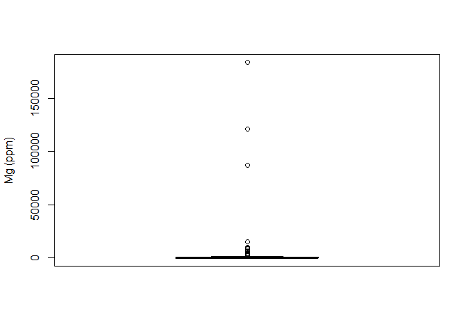<!-- -->

    ## [1] "Mg outliers:"

    ##  [1]  10210.59   2293.89   3249.27  15430.14   6117.28   2932.85   9673.03
    ##  [8] 121100.70   7601.19  87376.36  87130.60   8760.37   3895.30 183513.36
    ## [15]   2855.67

    ## Warning: Removed 61 rows containing non-finite values (stat_boxplot).

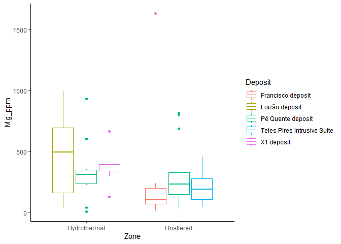<!-- -->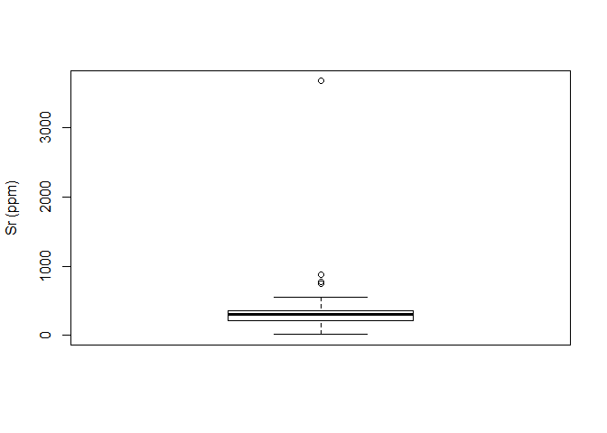<!-- -->

    ## [1] "Sr outliers:"

    ## [1] 3665.31  767.69  870.95  751.91

    ## Warning: Removed 61 rows containing non-finite values (stat_boxplot).

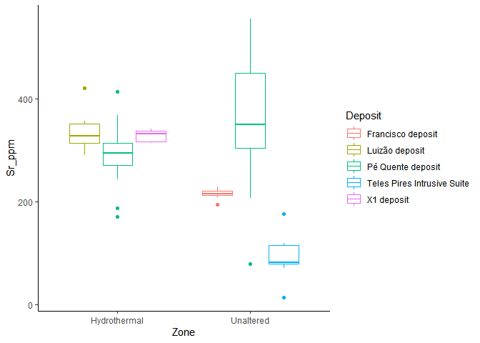<!-- -->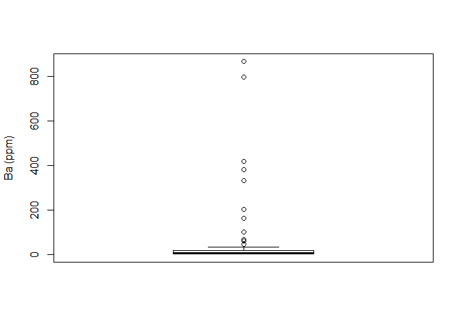<!-- -->

    ## [1] "Ba outliers:"

    ##  [1] 163.19  67.70 202.48 101.34  59.33 331.53 867.17 419.04 381.86 796.17
    ## [11]  44.95

    ## Warning: Removed 61 rows containing non-finite values (stat_boxplot).

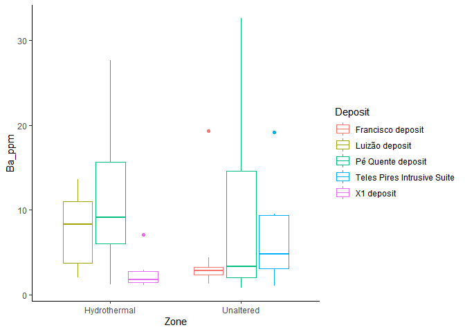<!-- -->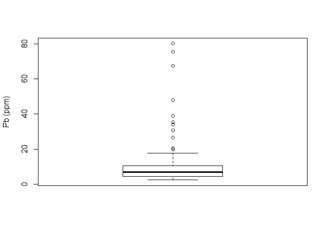<!-- -->

    ## [1] "Pb outliers:"

    ##  [1] 34.08 75.45 19.83 80.06 26.71 47.83 35.45 39.02 30.70 20.59 67.37

    ## Warning: Removed 61 rows containing non-finite values (stat_boxplot).

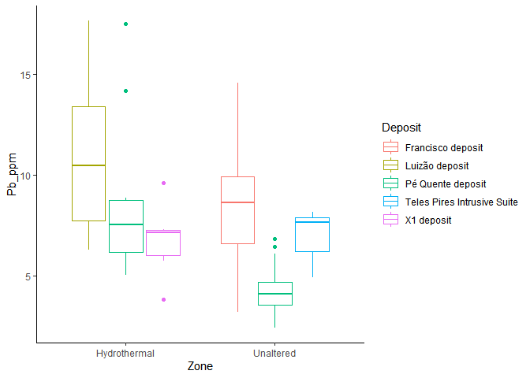<!-- -->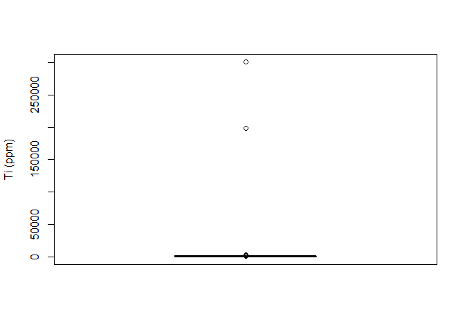<!-- -->

    ## [1] "Ti outliers:"

    ##  [1]   2210.80   1157.41 198589.36   1280.66   2950.83   1128.25   1299.73
    ##  [8]   1477.82   1831.62 300480.09

    ## Warning: Removed 61 rows containing non-finite values (stat_boxplot).

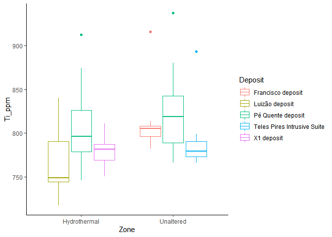<!-- -->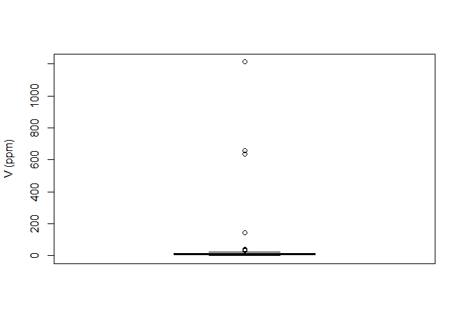<!-- -->

    ## [1] "V outliers:"

    ## [1]   40.42   30.65   36.12  658.19  635.43  142.85 1211.60

    ## Warning: Removed 61 rows containing non-finite values (stat_boxplot).

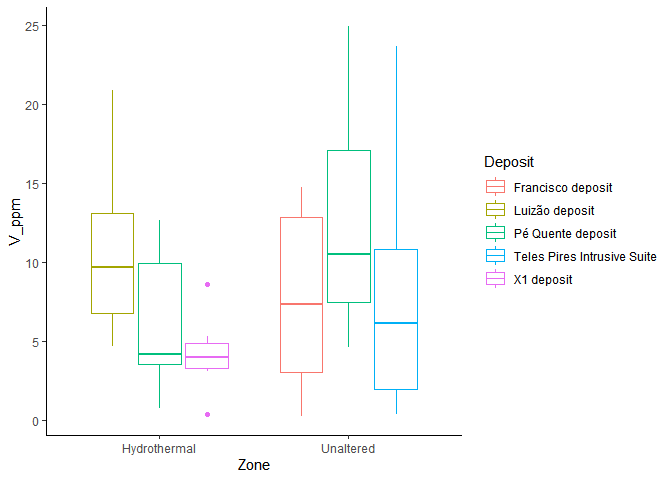<!-- -->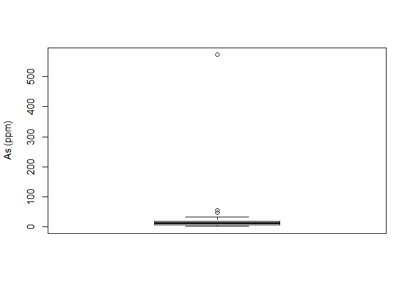<!-- -->

    ## [1] "As outliers:"

    ## [1]  55.19  46.09 573.08

    ## Warning: Removed 61 rows containing non-finite values (stat_boxplot).

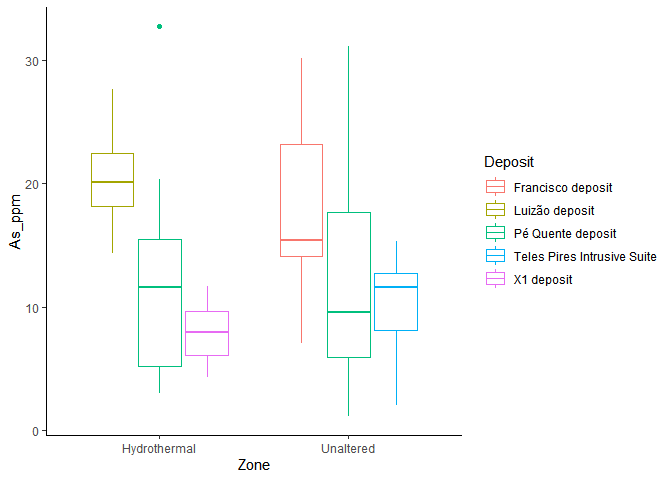<!-- -->

    ## Warning: Removed 61 rows containing non-finite values (stat_boxplot).

<!-- -->

Besides that, we would prefer to agglutinate Light Rare Earth Elements
(LREE) into a singular feature, since they display similar patterns and
might exhibit a better response if they are summed up together.

Once the corrections are made, we visualise the multielements boxplots
via:

    ## Warning: Removed 12 rows containing non-finite values (stat_boxplot).

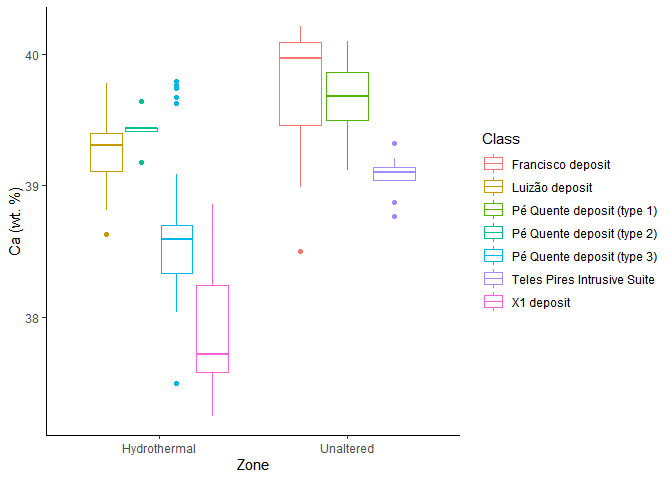<!-- -->

    ## Warning: Removed 12 rows containing non-finite values (stat_boxplot).

<!-- -->

    ## Warning: Removed 14 rows containing non-finite values (stat_boxplot).

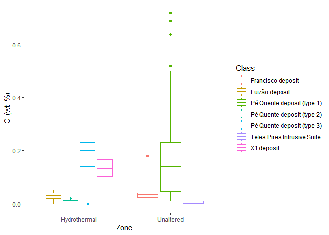<!-- -->

    ## Warning: Removed 12 rows containing non-finite values (stat_boxplot).

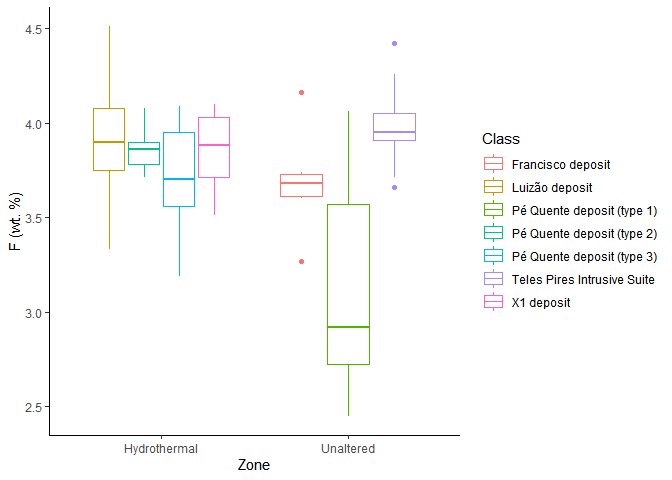<!-- -->

    ## Warning: Removed 56 rows containing non-finite values (stat_boxplot).

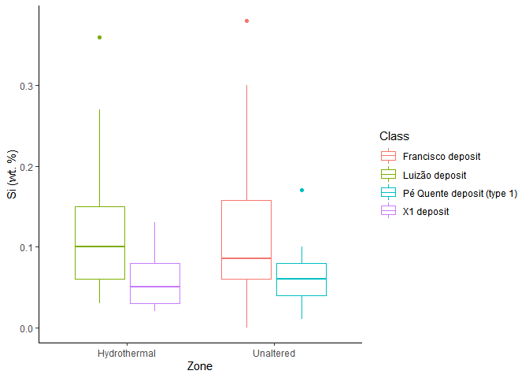<!-- -->

    ## Warning: Removed 61 rows containing non-finite values (stat_boxplot).

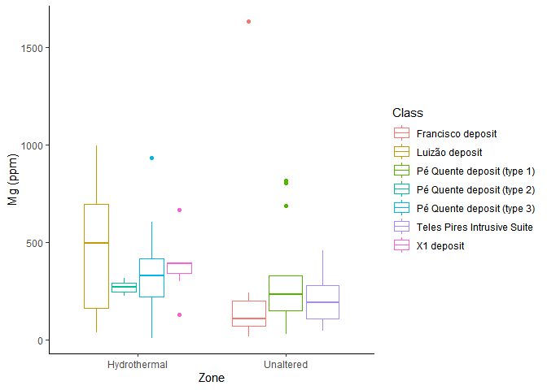<!-- -->

    ## Warning: Removed 61 rows containing non-finite values (stat_boxplot).

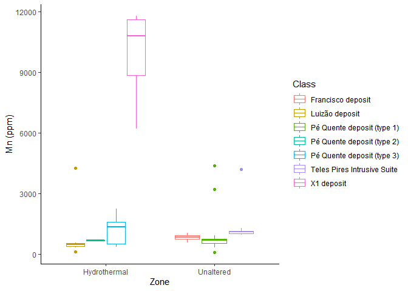<!-- -->

    ## Warning: Removed 61 rows containing non-finite values (stat_boxplot).

<!-- -->

    ## Warning: Removed 61 rows containing non-finite values (stat_boxplot).

<!-- -->

    ## Warning: Removed 61 rows containing non-finite values (stat_boxplot).

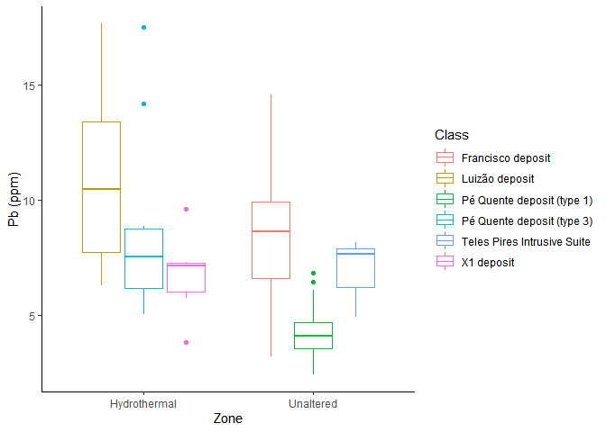<!-- -->

    ## Warning: Removed 61 rows containing non-finite values (stat_boxplot).

<!-- -->

    ## Warning: Removed 61 rows containing non-finite values (stat_boxplot).

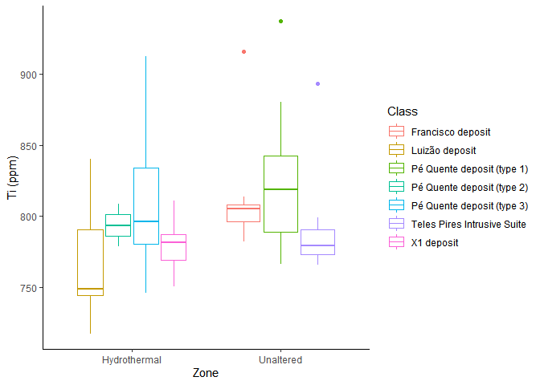<!-- -->

    ## Warning: Removed 12 rows containing non-finite values (stat_boxplot).

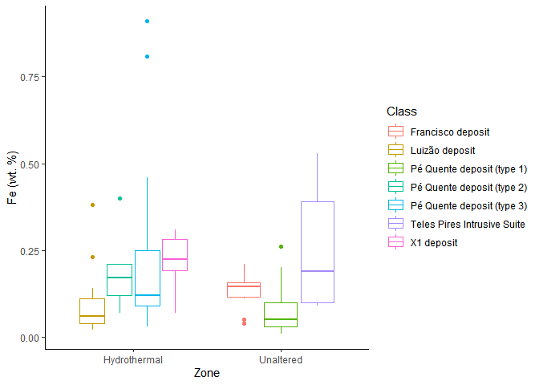<!-- -->

    ## Warning: Removed 61 rows containing non-finite values (stat_boxplot).

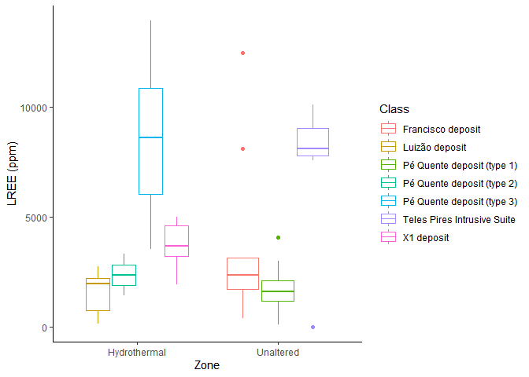<!-- -->

    ## Warning: Removed 61 rows containing non-finite values (stat_boxplot).

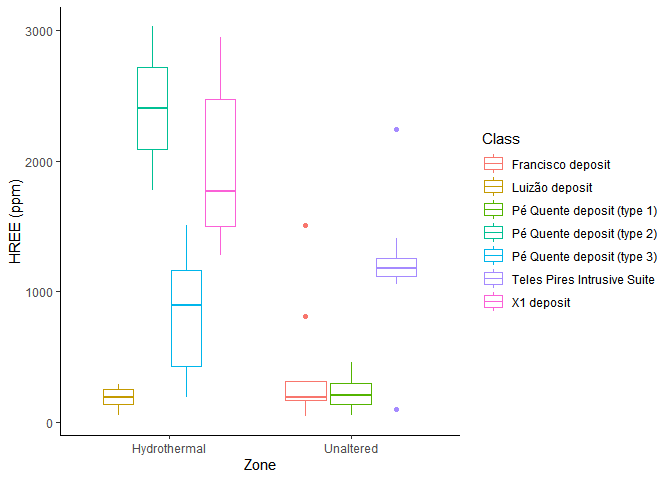<!-- -->

    ## Warning: Removed 61 rows containing non-finite values (stat_boxplot).

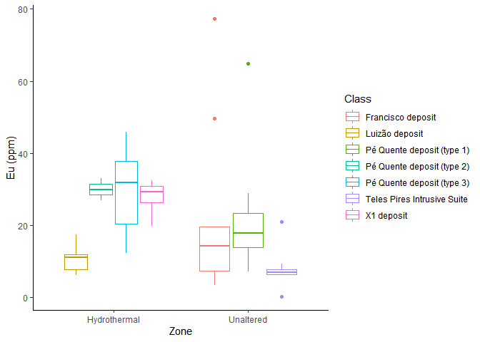<!-- -->

    ## Warning: Removed 61 rows containing non-finite values (stat_boxplot).

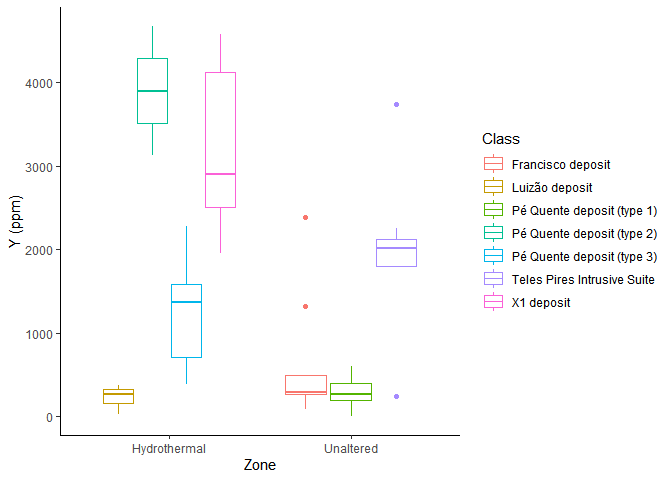<!-- -->

    ## Warning: Removed 61 rows containing non-finite values (stat_boxplot).

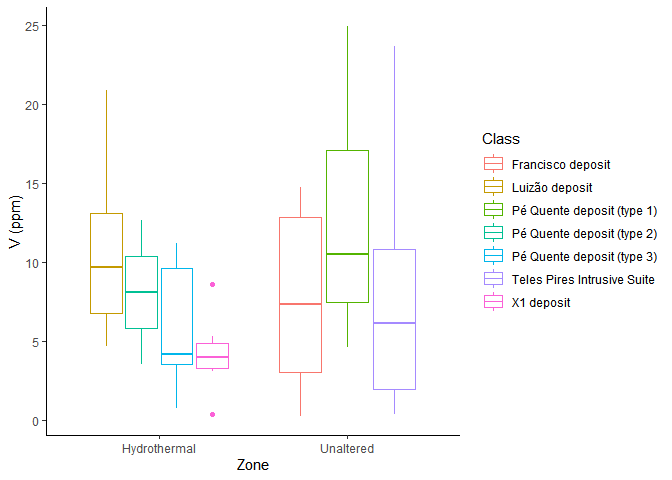<!-- -->

    ## Warning: Removed 61 rows containing non-finite values (stat_boxplot).

<!-- -->

    ## Warning: Removed 61 rows containing non-finite values (stat_boxplot).

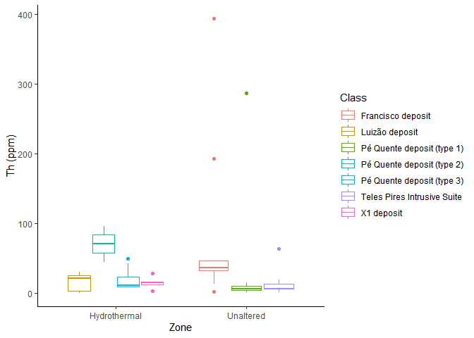<!-- -->

    ## Warning: Removed 86 rows containing non-finite values (stat_boxplot).

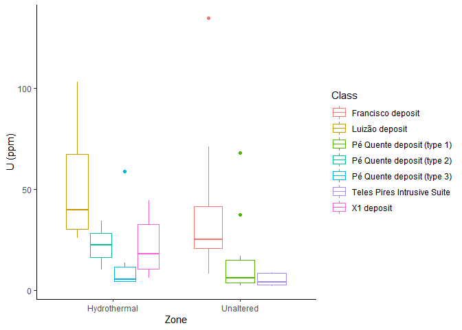<!-- -->

    ## Warning: Removed 61 rows containing non-finite values (stat_boxplot).

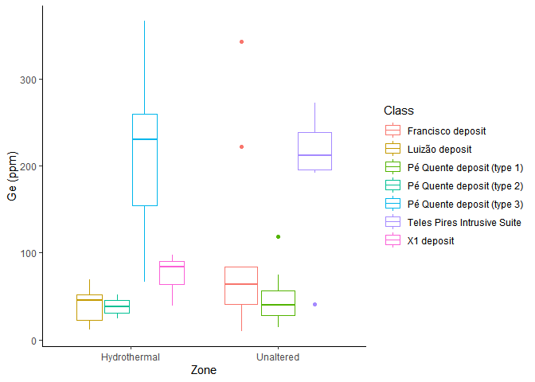<!-- -->
