Apatite trace elements
================
Pedro Leite
12-10-2020

## R markdown

We will use R markdown to display the results

``` r
library(ggplot2)
  theme_set(theme_classic())
library(formattable)
library(knitr)
  knitr::opts_chunk$set(echo = FALSE)
  knitr::opts_knit$set(root.dir= normalizePath('..'))
  knitr::opts_chunk$set(error = FALSE)
```

## GitHub Documents

This is an R Markdown format used for publishing markdown documents to
GitHub. When you click the **Knit** button all R code chunks are run and
a markdown file (.md) suitable for publishing to GitHub is generated.

<table class="table table-condensed">

<thead>

<tr>

<th style="text-align:right;">

Sample\_ID

</th>

<th style="text-align:right;">

Sample

</th>

<th style="text-align:right;">

Deposit

</th>

<th style="text-align:right;">

Nature

</th>

<th style="text-align:right;">

Zone

</th>

<th style="text-align:right;">

Class

</th>

<th style="text-align:right;">

CL

</th>

<th style="text-align:right;">

F\_pct

</th>

<th style="text-align:right;">

Si\_pct

</th>

<th style="text-align:right;">

Mg\_pct

</th>

<th style="text-align:right;">

Na\_pct

</th>

<th style="text-align:right;">

Ca\_pct

</th>

<th style="text-align:right;">

P\_pct

</th>

<th style="text-align:right;">

Cl\_pct

</th>

<th style="text-align:right;">

Fe\_pct

</th>

<th style="text-align:right;">

Mn\_pct

</th>

<th style="text-align:right;">

Ce\_pct

</th>

<th style="text-align:right;">

La\_pct

</th>

<th style="text-align:right;">

Nd\_pct

</th>

<th style="text-align:right;">

B\_ppm

</th>

<th style="text-align:right;">

Mg\_ppm

</th>

<th style="text-align:right;">

Si\_ppm

</th>

<th style="text-align:right;">

P\_ppm

</th>

<th style="text-align:right;">

Ca\_ppm

</th>

<th style="text-align:right;">

Sc\_ppm

</th>

<th style="text-align:right;">

Ti\_ppm

</th>

<th style="text-align:right;">

V\_ppm

</th>

<th style="text-align:right;">

Mn\_ppm

</th>

<th style="text-align:right;">

Fe\_ppm

</th>

<th style="text-align:right;">

Ga\_ppm

</th>

<th style="text-align:right;">

Ge\_ppm

</th>

<th style="text-align:right;">

As\_ppm

</th>

<th style="text-align:right;">

Rb\_ppm

</th>

<th style="text-align:right;">

Sr\_ppm

</th>

<th style="text-align:right;">

Y\_ppm

</th>

<th style="text-align:right;">

Zr\_ppm

</th>

<th style="text-align:right;">

Nb\_ppm

</th>

<th style="text-align:right;">

Ba\_ppm

</th>

<th style="text-align:right;">

La\_ppm

</th>

<th style="text-align:right;">

Ce\_ppm

</th>

<th style="text-align:right;">

Pr\_ppm

</th>

<th style="text-align:right;">

Nd\_ppm

</th>

<th style="text-align:right;">

Sm\_ppm

</th>

<th style="text-align:right;">

Eu\_ppm

</th>

<th style="text-align:right;">

Gd\_ppm

</th>

<th style="text-align:right;">

Tb\_ppm

</th>

<th style="text-align:right;">

Dy\_ppm

</th>

<th style="text-align:right;">

Ho\_ppm

</th>

<th style="text-align:right;">

Er\_ppm

</th>

<th style="text-align:right;">

Tm\_ppm

</th>

<th style="text-align:right;">

Yb\_ppm

</th>

<th style="text-align:right;">

Lu\_ppm

</th>

<th style="text-align:right;">

Hf\_ppm

</th>

<th style="text-align:right;">

Ta\_ppm

</th>

<th style="text-align:right;">

Pb\_ppm

</th>

<th style="text-align:right;">

Th232\_ppm

</th>

<th style="text-align:right;">

U238\_ppm

</th>

<th style="text-align:right;">

X

</th>

<th style="text-align:right;">

U238\_ppm.1

</th>

</tr>

</thead>

<tbody>

<tr>

<td style="text-align:right;">

B6\_ap\_1\_1

</td>

<td style="text-align:right;">

B6

</td>

<td style="text-align:right;">

X1 deposit

</td>

<td style="text-align:right;">

Hydrothermal

</td>

<td style="text-align:right;">

Hydrothermal

</td>

<td style="text-align:right;">

X1 deposit

</td>

<td style="text-align:right;">

CL-green

</td>

<td style="text-align:right;">

3.51

</td>

<td style="text-align:right;">

0.08

</td>

<td style="text-align:right;">

0.02

</td>

<td style="text-align:right;">

0.27

</td>

<td style="text-align:right;">

37.76

</td>

<td style="text-align:right;">

17.56

</td>

<td style="text-align:right;">

0.10

</td>

<td style="text-align:right;">

0.25

</td>

<td style="text-align:right;">

0.84

</td>

<td style="text-align:right;">

0.19

</td>

<td style="text-align:right;">

0.06

</td>

<td style="text-align:right;">

0.08

</td>

<td style="text-align:right;">

NA

</td>

<td style="text-align:right;">

NA

</td>

<td style="text-align:right;">

NA

</td>

<td style="text-align:right;">

NA

</td>

<td style="text-align:right;">

NA

</td>

<td style="text-align:right;">

NA

</td>

<td style="text-align:right;">

NA

</td>

<td style="text-align:right;">

NA

</td>

<td style="text-align:right;">

NA

</td>

<td style="text-align:right;">

NA

</td>

<td style="text-align:right;">

NA

</td>

<td style="text-align:right;">

NA

</td>

<td style="text-align:right;">

NA

</td>

<td style="text-align:right;">

NA

</td>

<td style="text-align:right;">

NA

</td>

<td style="text-align:right;">

NA

</td>

<td style="text-align:right;">

NA

</td>

<td style="text-align:right;">

NA

</td>

<td style="text-align:right;">

NA

</td>

<td style="text-align:right;">

NA

</td>

<td style="text-align:right;">

NA

</td>

<td style="text-align:right;">

NA

</td>

<td style="text-align:right;">

NA

</td>

<td style="text-align:right;">

NA

</td>

<td style="text-align:right;">

NA

</td>

<td style="text-align:right;">

NA

</td>

<td style="text-align:right;">

NA

</td>

<td style="text-align:right;">

NA

</td>

<td style="text-align:right;">

NA

</td>

<td style="text-align:right;">

NA

</td>

<td style="text-align:right;">

NA

</td>

<td style="text-align:right;">

NA

</td>

<td style="text-align:right;">

NA

</td>

<td style="text-align:right;">

NA

</td>

<td style="text-align:right;">

NA

</td>

<td style="text-align:right;">

NA

</td>

<td style="text-align:right;">

NA

</td>

<td style="text-align:right;">

NA

</td>

<td style="text-align:right;">

NA

</td>

<td style="text-align:right;">

NA

</td>

</tr>

<tr>

<td style="text-align:right;">

B6\_ap\_1\_2

</td>

<td style="text-align:right;">

B6

</td>

<td style="text-align:right;">

X1 deposit

</td>

<td style="text-align:right;">

Hydrothermal

</td>

<td style="text-align:right;">

Hydrothermal

</td>

<td style="text-align:right;">

X1 deposit

</td>

<td style="text-align:right;">

CL-green

</td>

<td style="text-align:right;">

4.04

</td>

<td style="text-align:right;">

0.11

</td>

<td style="text-align:right;">

0.04

</td>

<td style="text-align:right;">

0.20

</td>

<td style="text-align:right;">

37.68

</td>

<td style="text-align:right;">

17.82

</td>

<td style="text-align:right;">

0.10

</td>

<td style="text-align:right;">

0.19

</td>

<td style="text-align:right;">

1.02

</td>

<td style="text-align:right;">

0.24

</td>

<td style="text-align:right;">

0.06

</td>

<td style="text-align:right;">

0.11

</td>

<td style="text-align:right;">

NA

</td>

<td style="text-align:right;">

NA

</td>

<td style="text-align:right;">

NA

</td>

<td style="text-align:right;">

NA

</td>

<td style="text-align:right;">

NA

</td>

<td style="text-align:right;">

NA

</td>

<td style="text-align:right;">

NA

</td>

<td style="text-align:right;">

NA

</td>

<td style="text-align:right;">

NA

</td>

<td style="text-align:right;">

NA

</td>

<td style="text-align:right;">

NA

</td>

<td style="text-align:right;">

NA

</td>

<td style="text-align:right;">

NA

</td>

<td style="text-align:right;">

NA

</td>

<td style="text-align:right;">

NA

</td>

<td style="text-align:right;">

NA

</td>

<td style="text-align:right;">

NA

</td>

<td style="text-align:right;">

NA

</td>

<td style="text-align:right;">

NA

</td>

<td style="text-align:right;">

NA

</td>

<td style="text-align:right;">

NA

</td>

<td style="text-align:right;">

NA

</td>

<td style="text-align:right;">

NA

</td>

<td style="text-align:right;">

NA

</td>

<td style="text-align:right;">

NA

</td>

<td style="text-align:right;">

NA

</td>

<td style="text-align:right;">

NA

</td>

<td style="text-align:right;">

NA

</td>

<td style="text-align:right;">

NA

</td>

<td style="text-align:right;">

NA

</td>

<td style="text-align:right;">

NA

</td>

<td style="text-align:right;">

NA

</td>

<td style="text-align:right;">

NA

</td>

<td style="text-align:right;">

NA

</td>

<td style="text-align:right;">

NA

</td>

<td style="text-align:right;">

NA

</td>

<td style="text-align:right;">

NA

</td>

<td style="text-align:right;">

NA

</td>

<td style="text-align:right;">

NA

</td>

<td style="text-align:right;">

NA

</td>

</tr>

<tr>

<td style="text-align:right;">

B6\_ap\_2\_1

</td>

<td style="text-align:right;">

B6

</td>

<td style="text-align:right;">

X1 deposit

</td>

<td style="text-align:right;">

Hydrothermal

</td>

<td style="text-align:right;">

Hydrothermal

</td>

<td style="text-align:right;">

X1 deposit

</td>

<td style="text-align:right;">

CL-green

</td>

<td style="text-align:right;">

3.64

</td>

<td style="text-align:right;">

0.03

</td>

<td style="text-align:right;">

0.03

</td>

<td style="text-align:right;">

0.25

</td>

<td style="text-align:right;">

37.57

</td>

<td style="text-align:right;">

17.49

</td>

<td style="text-align:right;">

0.15

</td>

<td style="text-align:right;">

0.29

</td>

<td style="text-align:right;">

1.09

</td>

<td style="text-align:right;">

0.16

</td>

<td style="text-align:right;">

0.05

</td>

<td style="text-align:right;">

0.11

</td>

<td style="text-align:right;">

3.05

</td>

<td style="text-align:right;">

389.43

</td>

<td style="text-align:right;">

2760.73

</td>

<td style="text-align:right;">

157416.05

</td>

<td style="text-align:right;">

375620.8

</td>

<td style="text-align:right;">

3.84

</td>

<td style="text-align:right;">

811.01

</td>

<td style="text-align:right;">

5.31

</td>

<td style="text-align:right;">

11560.24

</td>

<td style="text-align:right;">

2344.03

</td>

<td style="text-align:right;">

0.17

</td>

<td style="text-align:right;">

83.56

</td>

<td style="text-align:right;">

10.02

</td>

<td style="text-align:right;">

0.73

</td>

<td style="text-align:right;">

337.41

</td>

<td style="text-align:right;">

4575.82

</td>

<td style="text-align:right;">

1.78

</td>

<td style="text-align:right;">

0.09

</td>

<td style="text-align:right;">

1.65

</td>

<td style="text-align:right;">

584.79

</td>

<td style="text-align:right;">

1764.89

</td>

<td style="text-align:right;">

280.54

</td>

<td style="text-align:right;">

1447.90

</td>

<td style="text-align:right;">

520.88

</td>

<td style="text-align:right;">

30.88

</td>

<td style="text-align:right;">

617.64

</td>

<td style="text-align:right;">

120.87

</td>

<td style="text-align:right;">

822.52

</td>

<td style="text-align:right;">

175.38

</td>

<td style="text-align:right;">

496.77

</td>

<td style="text-align:right;">

74.46

</td>

<td style="text-align:right;">

565.48

</td>

<td style="text-align:right;">

72.04

</td>

<td style="text-align:right;">

3.64

</td>

<td style="text-align:right;">

0.15

</td>

<td style="text-align:right;">

9.62

</td>

<td style="text-align:right;">

27.59

</td>

<td style="text-align:right;">

24.30

</td>

<td style="text-align:right;">

NA

</td>

<td style="text-align:right;">

34.39

</td>

</tr>

<tr>

<td style="text-align:right;">

B6\_ap\_3\_1

</td>

<td style="text-align:right;">

B6

</td>

<td style="text-align:right;">

X1 deposit

</td>

<td style="text-align:right;">

Hydrothermal

</td>

<td style="text-align:right;">

Hydrothermal

</td>

<td style="text-align:right;">

X1 deposit

</td>

<td style="text-align:right;">

CL-green

</td>

<td style="text-align:right;">

3.85

</td>

<td style="text-align:right;">

0.08

</td>

<td style="text-align:right;">

0.04

</td>

<td style="text-align:right;">

0.24

</td>

<td style="text-align:right;">

37.25

</td>

<td style="text-align:right;">

17.88

</td>

<td style="text-align:right;">

0.19

</td>

<td style="text-align:right;">

0.31

</td>

<td style="text-align:right;">

1.17

</td>

<td style="text-align:right;">

0.16

</td>

<td style="text-align:right;">

0.07

</td>

<td style="text-align:right;">

0.11

</td>

<td style="text-align:right;">

2.00

</td>

<td style="text-align:right;">

667.72

</td>

<td style="text-align:right;">

2535.87

</td>

<td style="text-align:right;">

160435.22

</td>

<td style="text-align:right;">

372542.9

</td>

<td style="text-align:right;">

2.85

</td>

<td style="text-align:right;">

778.63

</td>

<td style="text-align:right;">

4.43

</td>

<td style="text-align:right;">

11781.36

</td>

<td style="text-align:right;">

2996.92

</td>

<td style="text-align:right;">

0.47

</td>

<td style="text-align:right;">

92.60

</td>

<td style="text-align:right;">

11.65

</td>

<td style="text-align:right;">

0.22

</td>

<td style="text-align:right;">

341.56

</td>

<td style="text-align:right;">

4114.00

</td>

<td style="text-align:right;">

0.78

</td>

<td style="text-align:right;">

1.52

</td>

<td style="text-align:right;">

7.07

</td>

<td style="text-align:right;">

629.90

</td>

<td style="text-align:right;">

1738.15

</td>

<td style="text-align:right;">

279.93

</td>

<td style="text-align:right;">

1474.68

</td>

<td style="text-align:right;">

500.44

</td>

<td style="text-align:right;">

25.22

</td>

<td style="text-align:right;">

569.32

</td>

<td style="text-align:right;">

104.57

</td>

<td style="text-align:right;">

688.16

</td>

<td style="text-align:right;">

140.09

</td>

<td style="text-align:right;">

369.85

</td>

<td style="text-align:right;">

54.65

</td>

<td style="text-align:right;">

414.16

</td>

<td style="text-align:right;">

55.09

</td>

<td style="text-align:right;">

1.98

</td>

<td style="text-align:right;">

0.12

</td>

<td style="text-align:right;">

5.76

</td>

<td style="text-align:right;">

14.95

</td>

<td style="text-align:right;">

27.14

</td>

<td style="text-align:right;">

NA

</td>

<td style="text-align:right;">

44.80

</td>

</tr>

<tr>

<td style="text-align:right;">

B6\_ap\_3\_2

</td>

<td style="text-align:right;">

B6

</td>

<td style="text-align:right;">

X1 deposit

</td>

<td style="text-align:right;">

Hydrothermal

</td>

<td style="text-align:right;">

Hydrothermal

</td>

<td style="text-align:right;">

X1 deposit

</td>

<td style="text-align:right;">

CL-green

</td>

<td style="text-align:right;">

3.69

</td>

<td style="text-align:right;">

0.13

</td>

<td style="text-align:right;">

0.04

</td>

<td style="text-align:right;">

0.17

</td>

<td style="text-align:right;">

37.53

</td>

<td style="text-align:right;">

17.56

</td>

<td style="text-align:right;">

0.17

</td>

<td style="text-align:right;">

0.26

</td>

<td style="text-align:right;">

1.03

</td>

<td style="text-align:right;">

0.16

</td>

<td style="text-align:right;">

0.04

</td>

<td style="text-align:right;">

0.12

</td>

<td style="text-align:right;">

5.00

</td>

<td style="text-align:right;">

392.63

</td>

<td style="text-align:right;">

2408.72

</td>

<td style="text-align:right;">

140917.86

</td>

<td style="text-align:right;">

375350.2

</td>

<td style="text-align:right;">

2.77

</td>

<td style="text-align:right;">

784.73

</td>

<td style="text-align:right;">

8.59

</td>

<td style="text-align:right;">

11678.81

</td>

<td style="text-align:right;">

2267.10

</td>

<td style="text-align:right;">

0.15

</td>

<td style="text-align:right;">

97.25

</td>

<td style="text-align:right;">

9.23

</td>

<td style="text-align:right;">

0.52

</td>

<td style="text-align:right;">

331.81

</td>

<td style="text-align:right;">

4127.08

</td>

<td style="text-align:right;">

0.62

</td>

<td style="text-align:right;">

0.07

</td>

<td style="text-align:right;">

1.25

</td>

<td style="text-align:right;">

643.51

</td>

<td style="text-align:right;">

1943.36

</td>

<td style="text-align:right;">

306.56

</td>

<td style="text-align:right;">

1553.59

</td>

<td style="text-align:right;">

560.69

</td>

<td style="text-align:right;">

30.88

</td>

<td style="text-align:right;">

595.10

</td>

<td style="text-align:right;">

115.74

</td>

<td style="text-align:right;">

734.29

</td>

<td style="text-align:right;">

149.09

</td>

<td style="text-align:right;">

403.60

</td>

<td style="text-align:right;">

58.86

</td>

<td style="text-align:right;">

433.23

</td>

<td style="text-align:right;">

57.49

</td>

<td style="text-align:right;">

1.93

</td>

<td style="text-align:right;">

0.34

</td>

<td style="text-align:right;">

6.29

</td>

<td style="text-align:right;">

16.34

</td>

<td style="text-align:right;">

9.69

</td>

<td style="text-align:right;">

NA

</td>

<td style="text-align:right;">

17.98

</td>

</tr>

<tr>

<td style="text-align:right;">

B6\_ap\_4\_1

</td>

<td style="text-align:right;">

B6

</td>

<td style="text-align:right;">

X1 deposit

</td>

<td style="text-align:right;">

Hydrothermal

</td>

<td style="text-align:right;">

Hydrothermal

</td>

<td style="text-align:right;">

X1 deposit

</td>

<td style="text-align:right;">

CL-green

</td>

<td style="text-align:right;">

3.91

</td>

<td style="text-align:right;">

0.05

</td>

<td style="text-align:right;">

0.04

</td>

<td style="text-align:right;">

0.16

</td>

<td style="text-align:right;">

37.60

</td>

<td style="text-align:right;">

17.67

</td>

<td style="text-align:right;">

0.20

</td>

<td style="text-align:right;">

0.29

</td>

<td style="text-align:right;">

1.13

</td>

<td style="text-align:right;">

0.14

</td>

<td style="text-align:right;">

0.06

</td>

<td style="text-align:right;">

0.08

</td>

<td style="text-align:right;">

2.51

</td>

<td style="text-align:right;">

394.77

</td>

<td style="text-align:right;">

2372.73

</td>

<td style="text-align:right;">

135010.08

</td>

<td style="text-align:right;">

375997.1

</td>

<td style="text-align:right;">

1.60

</td>

<td style="text-align:right;">

781.76

</td>

<td style="text-align:right;">

3.97

</td>

<td style="text-align:right;">

10798.30

</td>

<td style="text-align:right;">

1968.65

</td>

<td style="text-align:right;">

0.14

</td>

<td style="text-align:right;">

71.18

</td>

<td style="text-align:right;">

4.31

</td>

<td style="text-align:right;">

0.20

</td>

<td style="text-align:right;">

316.82

</td>

<td style="text-align:right;">

2640.91

</td>

<td style="text-align:right;">

0.79

</td>

<td style="text-align:right;">

0.08

</td>

<td style="text-align:right;">

2.95

</td>

<td style="text-align:right;">

450.25

</td>

<td style="text-align:right;">

1354.91

</td>

<td style="text-align:right;">

216.14

</td>

<td style="text-align:right;">

1110.59

</td>

<td style="text-align:right;">

356.73

</td>

<td style="text-align:right;">

29.33

</td>

<td style="text-align:right;">

379.58

</td>

<td style="text-align:right;">

70.33

</td>

<td style="text-align:right;">

444.27

</td>

<td style="text-align:right;">

87.18

</td>

<td style="text-align:right;">

249.06

</td>

<td style="text-align:right;">

39.81

</td>

<td style="text-align:right;">

306.22

</td>

<td style="text-align:right;">

41.45

</td>

<td style="text-align:right;">

2.67

</td>

<td style="text-align:right;">

0.08

</td>

<td style="text-align:right;">

7.18

</td>

<td style="text-align:right;">

12.09

</td>

<td style="text-align:right;">

12.34

</td>

<td style="text-align:right;">

NA

</td>

<td style="text-align:right;">

6.30

</td>

</tr>

<tr>

<td style="text-align:right;">

B6\_ap\_5\_1

</td>

<td style="text-align:right;">

B6

</td>

<td style="text-align:right;">

X1 deposit

</td>

<td style="text-align:right;">

Hydrothermal

</td>

<td style="text-align:right;">

Hydrothermal

</td>

<td style="text-align:right;">

X1 deposit

</td>

<td style="text-align:right;">

CL-green

</td>

<td style="text-align:right;">

3.99

</td>

<td style="text-align:right;">

NA

</td>

<td style="text-align:right;">

0.01

</td>

<td style="text-align:right;">

0.10

</td>

<td style="text-align:right;">

38.86

</td>

<td style="text-align:right;">

18.21

</td>

<td style="text-align:right;">

0.06

</td>

<td style="text-align:right;">

0.07

</td>

<td style="text-align:right;">

0.65

</td>

<td style="text-align:right;">

0.08

</td>

<td style="text-align:right;">

NA

</td>

<td style="text-align:right;">

0.06

</td>

<td style="text-align:right;">

3.05

</td>

<td style="text-align:right;">

128.71

</td>

<td style="text-align:right;">

2743.58

</td>

<td style="text-align:right;">

128547.80

</td>

<td style="text-align:right;">

388643.7

</td>

<td style="text-align:right;">

0.32

</td>

<td style="text-align:right;">

789.94

</td>

<td style="text-align:right;">

0.33

</td>

<td style="text-align:right;">

6217.99

</td>

<td style="text-align:right;">

1179.15

</td>

<td style="text-align:right;">

0.17

</td>

<td style="text-align:right;">

39.41

</td>

<td style="text-align:right;">

6.44

</td>

<td style="text-align:right;">

0.22

</td>

<td style="text-align:right;">

314.51

</td>

<td style="text-align:right;">

1959.79

</td>

<td style="text-align:right;">

0.14

</td>

<td style="text-align:right;">

0.07

</td>

<td style="text-align:right;">

1.81

</td>

<td style="text-align:right;">

192.04

</td>

<td style="text-align:right;">

717.34

</td>

<td style="text-align:right;">

120.83

</td>

<td style="text-align:right;">

636.80

</td>

<td style="text-align:right;">

269.28

</td>

<td style="text-align:right;">

19.67

</td>

<td style="text-align:right;">

333.37

</td>

<td style="text-align:right;">

62.48

</td>

<td style="text-align:right;">

414.16

</td>

<td style="text-align:right;">

75.08

</td>

<td style="text-align:right;">

182.04

</td>

<td style="text-align:right;">

26.75

</td>

<td style="text-align:right;">

160.20

</td>

<td style="text-align:right;">

21.27

</td>

<td style="text-align:right;">

1.83

</td>

<td style="text-align:right;">

0.22

</td>

<td style="text-align:right;">

3.86

</td>

<td style="text-align:right;">

2.40

</td>

<td style="text-align:right;">

14.22

</td>

<td style="text-align:right;">

NA

</td>

<td style="text-align:right;">

9.17

</td>

</tr>

<tr>

<td style="text-align:right;">

B6\_ap\_6\_1

</td>

<td style="text-align:right;">

B6

</td>

<td style="text-align:right;">

X1 deposit

</td>

<td style="text-align:right;">

Hydrothermal

</td>

<td style="text-align:right;">

Hydrothermal

</td>

<td style="text-align:right;">

X1 deposit

</td>

<td style="text-align:right;">

CL-green

</td>

<td style="text-align:right;">

4.04

</td>

<td style="text-align:right;">

0.03

</td>

<td style="text-align:right;">

0.03

</td>

<td style="text-align:right;">

0.11

</td>

<td style="text-align:right;">

37.97

</td>

<td style="text-align:right;">

17.92

</td>

<td style="text-align:right;">

0.16

</td>

<td style="text-align:right;">

0.20

</td>

<td style="text-align:right;">

1.03

</td>

<td style="text-align:right;">

0.14

</td>

<td style="text-align:right;">

0.05

</td>

<td style="text-align:right;">

0.08

</td>

<td style="text-align:right;">

2.81

</td>

<td style="text-align:right;">

379.68

</td>

<td style="text-align:right;">

2845.04

</td>

<td style="text-align:right;">

118958.40

</td>

<td style="text-align:right;">

379732.8

</td>

<td style="text-align:right;">

1.83

</td>

<td style="text-align:right;">

759.34

</td>

<td style="text-align:right;">

3.09

</td>

<td style="text-align:right;">

10220.28

</td>

<td style="text-align:right;">

2565.02

</td>

<td style="text-align:right;">

0.39

</td>

<td style="text-align:right;">

87.28

</td>

<td style="text-align:right;">

7.95

</td>

<td style="text-align:right;">

0.53

</td>

<td style="text-align:right;">

337.71

</td>

<td style="text-align:right;">

2383.66

</td>

<td style="text-align:right;">

2.14

</td>

<td style="text-align:right;">

0.08

</td>

<td style="text-align:right;">

2.49

</td>

<td style="text-align:right;">

524.20

</td>

<td style="text-align:right;">

1480.48

</td>

<td style="text-align:right;">

230.83

</td>

<td style="text-align:right;">

1087.63

</td>

<td style="text-align:right;">

357.97

</td>

<td style="text-align:right;">

32.37

</td>

<td style="text-align:right;">

353.96

</td>

<td style="text-align:right;">

65.96

</td>

<td style="text-align:right;">

389.81

</td>

<td style="text-align:right;">

75.07

</td>

<td style="text-align:right;">

200.04

</td>

<td style="text-align:right;">

30.39

</td>

<td style="text-align:right;">

235.98

</td>

<td style="text-align:right;">

32.87

</td>

<td style="text-align:right;">

1.05

</td>

<td style="text-align:right;">

0.23

</td>

<td style="text-align:right;">

7.22

</td>

<td style="text-align:right;">

10.76

</td>

<td style="text-align:right;">

10.18

</td>

<td style="text-align:right;">

NA

</td>

<td style="text-align:right;">

12.08

</td>

</tr>

<tr>

<td style="text-align:right;">

B6\_ap\_6\_2

</td>

<td style="text-align:right;">

B6

</td>

<td style="text-align:right;">

X1 deposit

</td>

<td style="text-align:right;">

Hydrothermal

</td>

<td style="text-align:right;">

Hydrothermal

</td>

<td style="text-align:right;">

X1 deposit

</td>

<td style="text-align:right;">

CL-green

</td>

<td style="text-align:right;">

4.10

</td>

<td style="text-align:right;">

0.02

</td>

<td style="text-align:right;">

0.03

</td>

<td style="text-align:right;">

0.12

</td>

<td style="text-align:right;">

38.33

</td>

<td style="text-align:right;">

17.77

</td>

<td style="text-align:right;">

0.11

</td>

<td style="text-align:right;">

0.20

</td>

<td style="text-align:right;">

0.84

</td>

<td style="text-align:right;">

0.11

</td>

<td style="text-align:right;">

0.05

</td>

<td style="text-align:right;">

0.07

</td>

<td style="text-align:right;">

2.75

</td>

<td style="text-align:right;">

301.59

</td>

<td style="text-align:right;">

2878.25

</td>

<td style="text-align:right;">

107340.56

</td>

<td style="text-align:right;">

383277.0

</td>

<td style="text-align:right;">

1.67

</td>

<td style="text-align:right;">

750.51

</td>

<td style="text-align:right;">

3.48

</td>

<td style="text-align:right;">

7473.14

</td>

<td style="text-align:right;">

2235.72

</td>

<td style="text-align:right;">

0.38

</td>

<td style="text-align:right;">

56.55

</td>

<td style="text-align:right;">

5.71

</td>

<td style="text-align:right;">

0.70

</td>

<td style="text-align:right;">

317.10

</td>

<td style="text-align:right;">

2899.93

</td>

<td style="text-align:right;">

0.81

</td>

<td style="text-align:right;">

0.27

</td>

<td style="text-align:right;">

1.14

</td>

<td style="text-align:right;">

346.03

</td>

<td style="text-align:right;">

1096.51

</td>

<td style="text-align:right;">

180.94

</td>

<td style="text-align:right;">

943.15

</td>

<td style="text-align:right;">

384.37

</td>

<td style="text-align:right;">

27.41

</td>

<td style="text-align:right;">

413.84

</td>

<td style="text-align:right;">

81.47

</td>

<td style="text-align:right;">

509.48

</td>

<td style="text-align:right;">

102.57

</td>

<td style="text-align:right;">

290.71

</td>

<td style="text-align:right;">

40.51

</td>

<td style="text-align:right;">

290.98

</td>

<td style="text-align:right;">

39.89

</td>

<td style="text-align:right;">

2.61

</td>

<td style="text-align:right;">

0.13

</td>

<td style="text-align:right;">

7.33

</td>

<td style="text-align:right;">

16.01

</td>

<td style="text-align:right;">

23.42

</td>

<td style="text-align:right;">

NA

</td>

<td style="text-align:right;">

30.90

</td>

</tr>

<tr>

<td style="text-align:right;">

B6\_ap\_7\_1

</td>

<td style="text-align:right;">

B6

</td>

<td style="text-align:right;">

X1 deposit

</td>

<td style="text-align:right;">

Hydrothermal

</td>

<td style="text-align:right;">

Hydrothermal

</td>

<td style="text-align:right;">

X1 deposit

</td>

<td style="text-align:right;">

CL-green

</td>

<td style="text-align:right;">

3.78

</td>

<td style="text-align:right;">

0.02

</td>

<td style="text-align:right;">

0.01

</td>

<td style="text-align:right;">

0.14

</td>

<td style="text-align:right;">

38.48

</td>

<td style="text-align:right;">

18.10

</td>

<td style="text-align:right;">

0.11

</td>

<td style="text-align:right;">

0.07

</td>

<td style="text-align:right;">

0.64

</td>

<td style="text-align:right;">

0.16

</td>

<td style="text-align:right;">

0.05

</td>

<td style="text-align:right;">

0.08

</td>

<td style="text-align:right;">

NA

</td>

<td style="text-align:right;">

NA

</td>

<td style="text-align:right;">

NA

</td>

<td style="text-align:right;">

NA

</td>

<td style="text-align:right;">

NA

</td>

<td style="text-align:right;">

NA

</td>

<td style="text-align:right;">

NA

</td>

<td style="text-align:right;">

NA

</td>

<td style="text-align:right;">

NA

</td>

<td style="text-align:right;">

NA

</td>

<td style="text-align:right;">

NA

</td>

<td style="text-align:right;">

NA

</td>

<td style="text-align:right;">

NA

</td>

<td style="text-align:right;">

NA

</td>

<td style="text-align:right;">

NA

</td>

<td style="text-align:right;">

NA

</td>

<td style="text-align:right;">

NA

</td>

<td style="text-align:right;">

NA

</td>

<td style="text-align:right;">

NA

</td>

<td style="text-align:right;">

NA

</td>

<td style="text-align:right;">

NA

</td>

<td style="text-align:right;">

NA

</td>

<td style="text-align:right;">

NA

</td>

<td style="text-align:right;">

NA

</td>

<td style="text-align:right;">

NA

</td>

<td style="text-align:right;">

NA

</td>

<td style="text-align:right;">

NA

</td>

<td style="text-align:right;">

NA

</td>

<td style="text-align:right;">

NA

</td>

<td style="text-align:right;">

NA

</td>

<td style="text-align:right;">

NA

</td>

<td style="text-align:right;">

NA

</td>

<td style="text-align:right;">

NA

</td>

<td style="text-align:right;">

NA

</td>

<td style="text-align:right;">

NA

</td>

<td style="text-align:right;">

NA

</td>

<td style="text-align:right;">

NA

</td>

<td style="text-align:right;">

NA

</td>

<td style="text-align:right;">

NA

</td>

<td style="text-align:right;">

NA

</td>

</tr>

<tr>

<td style="text-align:right;">

PTO19\_ap\_22

</td>

<td style="text-align:right;">

PTO19

</td>

<td style="text-align:right;">

Francisco deposit

</td>

<td style="text-align:right;">

Igneous

</td>

<td style="text-align:right;">

Unaltered

</td>

<td style="text-align:right;">

Francisco deposit

</td>

<td style="text-align:right;">

CL-green

</td>

<td style="text-align:right;">

3.27

</td>

<td style="text-align:right;">

0.12

</td>

<td style="text-align:right;">

0.05

</td>

<td style="text-align:right;">

0.15

</td>

<td style="text-align:right;">

38.50

</td>

<td style="text-align:right;">

17.79

</td>

<td style="text-align:right;">

0.18

</td>

<td style="text-align:right;">

0.16

</td>

<td style="text-align:right;">

0.09

</td>

<td style="text-align:right;">

0.40

</td>

<td style="text-align:right;">

0.18

</td>

<td style="text-align:right;">

0.18

</td>

<td style="text-align:right;">

NA

</td>

<td style="text-align:right;">

NA

</td>

<td style="text-align:right;">

NA

</td>

<td style="text-align:right;">

NA

</td>

<td style="text-align:right;">

NA

</td>

<td style="text-align:right;">

NA

</td>

<td style="text-align:right;">

NA

</td>

<td style="text-align:right;">

NA

</td>

<td style="text-align:right;">

NA

</td>

<td style="text-align:right;">

NA

</td>

<td style="text-align:right;">

NA

</td>

<td style="text-align:right;">

NA

</td>

<td style="text-align:right;">

NA

</td>

<td style="text-align:right;">

NA

</td>

<td style="text-align:right;">

NA

</td>

<td style="text-align:right;">

NA

</td>

<td style="text-align:right;">

NA

</td>

<td style="text-align:right;">

NA

</td>

<td style="text-align:right;">

NA

</td>

<td style="text-align:right;">

NA

</td>

<td style="text-align:right;">

NA

</td>

<td style="text-align:right;">

NA

</td>

<td style="text-align:right;">

NA

</td>

<td style="text-align:right;">

NA

</td>

<td style="text-align:right;">

NA

</td>

<td style="text-align:right;">

NA

</td>

<td style="text-align:right;">

NA

</td>

<td style="text-align:right;">

NA

</td>

<td style="text-align:right;">

NA

</td>

<td style="text-align:right;">

NA

</td>

<td style="text-align:right;">

NA

</td>

<td style="text-align:right;">

NA

</td>

<td style="text-align:right;">

NA

</td>

<td style="text-align:right;">

NA

</td>

<td style="text-align:right;">

NA

</td>

<td style="text-align:right;">

NA

</td>

<td style="text-align:right;">

NA

</td>

<td style="text-align:right;">

NA

</td>

<td style="text-align:right;">

NA

</td>

<td style="text-align:right;">

NA

</td>

</tr>

<tr>

<td style="text-align:right;">

GT-2\_ap\_1\_1

</td>

<td style="text-align:right;">

GT-2

</td>

<td style="text-align:right;">

Pé Quente deposit

</td>

<td style="text-align:right;">

Igneous

</td>

<td style="text-align:right;">

Unaltered

</td>

<td style="text-align:right;">

Pé Quente deposit (type 1)

</td>

<td style="text-align:right;">

CL-yellow

</td>

<td style="text-align:right;">

2.57

</td>

<td style="text-align:right;">

0.10

</td>

<td style="text-align:right;">

0.00

</td>

<td style="text-align:right;">

0.11

</td>

<td style="text-align:right;">

39.40

</td>

<td style="text-align:right;">

17.73

</td>

<td style="text-align:right;">

0.69

</td>

<td style="text-align:right;">

0.04

</td>

<td style="text-align:right;">

0.09

</td>

<td style="text-align:right;">

0.12

</td>

<td style="text-align:right;">

0.00

</td>

<td style="text-align:right;">

0.04

</td>

<td style="text-align:right;">

NA

</td>

<td style="text-align:right;">

NA

</td>

<td style="text-align:right;">

NA

</td>

<td style="text-align:right;">

NA

</td>

<td style="text-align:right;">

NA

</td>

<td style="text-align:right;">

NA

</td>

<td style="text-align:right;">

NA

</td>

<td style="text-align:right;">

NA

</td>

<td style="text-align:right;">

NA

</td>

<td style="text-align:right;">

NA

</td>

<td style="text-align:right;">

NA

</td>

<td style="text-align:right;">

NA

</td>

<td style="text-align:right;">

NA

</td>

<td style="text-align:right;">

NA

</td>

<td style="text-align:right;">

NA

</td>

<td style="text-align:right;">

NA

</td>

<td style="text-align:right;">

NA

</td>

<td style="text-align:right;">

NA

</td>

<td style="text-align:right;">

NA

</td>

<td style="text-align:right;">

NA

</td>

<td style="text-align:right;">

NA

</td>

<td style="text-align:right;">

NA

</td>

<td style="text-align:right;">

NA

</td>

<td style="text-align:right;">

NA

</td>

<td style="text-align:right;">

NA

</td>

<td style="text-align:right;">

NA

</td>

<td style="text-align:right;">

NA

</td>

<td style="text-align:right;">

NA

</td>

<td style="text-align:right;">

NA

</td>

<td style="text-align:right;">

NA

</td>

<td style="text-align:right;">

NA

</td>

<td style="text-align:right;">

NA

</td>

<td style="text-align:right;">

NA

</td>

<td style="text-align:right;">

NA

</td>

<td style="text-align:right;">

NA

</td>

<td style="text-align:right;">

NA

</td>

<td style="text-align:right;">

NA

</td>

<td style="text-align:right;">

NA

</td>

<td style="text-align:right;">

NA

</td>

<td style="text-align:right;">

NA

</td>

</tr>

<tr>

<td style="text-align:right;">

GT-2\_ap\_1\_2

</td>

<td style="text-align:right;">

GT-2

</td>

<td style="text-align:right;">

Pé Quente deposit

</td>

<td style="text-align:right;">

Igneous

</td>

<td style="text-align:right;">

Unaltered

</td>

<td style="text-align:right;">

Pé Quente deposit (type 1)

</td>

<td style="text-align:right;">

CL-yellow

</td>

<td style="text-align:right;">

2.45

</td>

<td style="text-align:right;">

0.04

</td>

<td style="text-align:right;">

0.01

</td>

<td style="text-align:right;">

0.07

</td>

<td style="text-align:right;">

39.50

</td>

<td style="text-align:right;">

18.03

</td>

<td style="text-align:right;">

0.72

</td>

<td style="text-align:right;">

0.07

</td>

<td style="text-align:right;">

0.07

</td>

<td style="text-align:right;">

0.05

</td>

<td style="text-align:right;">

0.04

</td>

<td style="text-align:right;">

0.03

</td>

<td style="text-align:right;">

NA

</td>

<td style="text-align:right;">

NA

</td>

<td style="text-align:right;">

NA

</td>

<td style="text-align:right;">

NA

</td>

<td style="text-align:right;">

NA

</td>

<td style="text-align:right;">

NA

</td>

<td style="text-align:right;">

NA

</td>

<td style="text-align:right;">

NA

</td>

<td style="text-align:right;">

NA

</td>

<td style="text-align:right;">

NA

</td>

<td style="text-align:right;">

NA

</td>

<td style="text-align:right;">

NA

</td>

<td style="text-align:right;">

NA

</td>

<td style="text-align:right;">

NA

</td>

<td style="text-align:right;">

NA

</td>

<td style="text-align:right;">

NA

</td>

<td style="text-align:right;">

NA

</td>

<td style="text-align:right;">

NA

</td>

<td style="text-align:right;">

NA

</td>

<td style="text-align:right;">

NA

</td>

<td style="text-align:right;">

NA

</td>

<td style="text-align:right;">

NA

</td>

<td style="text-align:right;">

NA

</td>

<td style="text-align:right;">

NA

</td>

<td style="text-align:right;">

NA

</td>

<td style="text-align:right;">

NA

</td>

<td style="text-align:right;">

NA

</td>

<td style="text-align:right;">

NA

</td>

<td style="text-align:right;">

NA

</td>

<td style="text-align:right;">

NA

</td>

<td style="text-align:right;">

NA

</td>

<td style="text-align:right;">

NA

</td>

<td style="text-align:right;">

NA

</td>

<td style="text-align:right;">

NA

</td>

<td style="text-align:right;">

NA

</td>

<td style="text-align:right;">

NA

</td>

<td style="text-align:right;">

NA

</td>

<td style="text-align:right;">

NA

</td>

<td style="text-align:right;">

NA

</td>

<td style="text-align:right;">

NA

</td>

</tr>

<tr>

<td style="text-align:right;">

GT-2\_ap\_1\_3

</td>

<td style="text-align:right;">

GT-2

</td>

<td style="text-align:right;">

Pé Quente deposit

</td>

<td style="text-align:right;">

Igneous

</td>

<td style="text-align:right;">

Unaltered

</td>

<td style="text-align:right;">

Pé Quente deposit (type 1)

</td>

<td style="text-align:right;">

CL-yellow

</td>

<td style="text-align:right;">

2.74

</td>

<td style="text-align:right;">

0.07

</td>

<td style="text-align:right;">

NA

</td>

<td style="text-align:right;">

0.07

</td>

<td style="text-align:right;">

39.66

</td>

<td style="text-align:right;">

18.02

</td>

<td style="text-align:right;">

0.52

</td>

<td style="text-align:right;">

0.02

</td>

<td style="text-align:right;">

0.07

</td>

<td style="text-align:right;">

0.09

</td>

<td style="text-align:right;">

NA

</td>

<td style="text-align:right;">

0.04

</td>

<td style="text-align:right;">

NA

</td>

<td style="text-align:right;">

NA

</td>

<td style="text-align:right;">

NA

</td>

<td style="text-align:right;">

NA

</td>

<td style="text-align:right;">

NA

</td>

<td style="text-align:right;">

NA

</td>

<td style="text-align:right;">

NA

</td>

<td style="text-align:right;">

NA

</td>

<td style="text-align:right;">

NA

</td>

<td style="text-align:right;">

NA

</td>

<td style="text-align:right;">

NA

</td>

<td style="text-align:right;">

NA

</td>

<td style="text-align:right;">

NA

</td>

<td style="text-align:right;">

NA

</td>

<td style="text-align:right;">

NA

</td>

<td style="text-align:right;">

NA

</td>

<td style="text-align:right;">

NA

</td>

<td style="text-align:right;">

NA

</td>

<td style="text-align:right;">

NA

</td>

<td style="text-align:right;">

NA

</td>

<td style="text-align:right;">

NA

</td>

<td style="text-align:right;">

NA

</td>

<td style="text-align:right;">

NA

</td>

<td style="text-align:right;">

NA

</td>

<td style="text-align:right;">

NA

</td>

<td style="text-align:right;">

NA

</td>

<td style="text-align:right;">

NA

</td>

<td style="text-align:right;">

NA

</td>

<td style="text-align:right;">

NA

</td>

<td style="text-align:right;">

NA

</td>

<td style="text-align:right;">

NA

</td>

<td style="text-align:right;">

NA

</td>

<td style="text-align:right;">

NA

</td>

<td style="text-align:right;">

NA

</td>

<td style="text-align:right;">

NA

</td>

<td style="text-align:right;">

NA

</td>

<td style="text-align:right;">

NA

</td>

<td style="text-align:right;">

NA

</td>

<td style="text-align:right;">

NA

</td>

<td style="text-align:right;">

NA

</td>

</tr>

<tr>

<td style="text-align:right;">

GT-2\_ap\_2\_1

</td>

<td style="text-align:right;">

GT-2

</td>

<td style="text-align:right;">

Pé Quente deposit

</td>

<td style="text-align:right;">

Igneous

</td>

<td style="text-align:right;">

Unaltered

</td>

<td style="text-align:right;">

Pé Quente deposit (type 1)

</td>

<td style="text-align:right;">

CL-yellow

</td>

<td style="text-align:right;">

2.69

</td>

<td style="text-align:right;">

0.09

</td>

<td style="text-align:right;">

0.01

</td>

<td style="text-align:right;">

0.12

</td>

<td style="text-align:right;">

39.76

</td>

<td style="text-align:right;">

17.83

</td>

<td style="text-align:right;">

0.64

</td>

<td style="text-align:right;">

0.04

</td>

<td style="text-align:right;">

0.10

</td>

<td style="text-align:right;">

0.08

</td>

<td style="text-align:right;">

0.05

</td>

<td style="text-align:right;">

0.02

</td>

<td style="text-align:right;">

NA

</td>

<td style="text-align:right;">

NA

</td>

<td style="text-align:right;">

NA

</td>

<td style="text-align:right;">

NA

</td>

<td style="text-align:right;">

NA

</td>

<td style="text-align:right;">

NA

</td>

<td style="text-align:right;">

NA

</td>

<td style="text-align:right;">

NA

</td>

<td style="text-align:right;">

NA

</td>

<td style="text-align:right;">

NA

</td>

<td style="text-align:right;">

NA

</td>

<td style="text-align:right;">

NA

</td>

<td style="text-align:right;">

NA

</td>

<td style="text-align:right;">

NA

</td>

<td style="text-align:right;">

NA

</td>

<td style="text-align:right;">

NA

</td>

<td style="text-align:right;">

NA

</td>

<td style="text-align:right;">

NA

</td>

<td style="text-align:right;">

NA

</td>

<td style="text-align:right;">

NA

</td>

<td style="text-align:right;">

NA

</td>

<td style="text-align:right;">

NA

</td>

<td style="text-align:right;">

NA

</td>

<td style="text-align:right;">

NA

</td>

<td style="text-align:right;">

NA

</td>

<td style="text-align:right;">

NA

</td>

<td style="text-align:right;">

NA

</td>

<td style="text-align:right;">

NA

</td>

<td style="text-align:right;">

NA

</td>

<td style="text-align:right;">

NA

</td>

<td style="text-align:right;">

NA

</td>

<td style="text-align:right;">

NA

</td>

<td style="text-align:right;">

NA

</td>

<td style="text-align:right;">

NA

</td>

<td style="text-align:right;">

NA

</td>

<td style="text-align:right;">

NA

</td>

<td style="text-align:right;">

NA

</td>

<td style="text-align:right;">

NA

</td>

<td style="text-align:right;">

NA

</td>

<td style="text-align:right;">

NA

</td>

</tr>

<tr>

<td style="text-align:right;">

GT-2\_ap\_2\_2

</td>

<td style="text-align:right;">

GT-2

</td>

<td style="text-align:right;">

Pé Quente deposit

</td>

<td style="text-align:right;">

Igneous

</td>

<td style="text-align:right;">

Unaltered

</td>

<td style="text-align:right;">

Pé Quente deposit (type 1)

</td>

<td style="text-align:right;">

CL-yellow

</td>

<td style="text-align:right;">

2.78

</td>

<td style="text-align:right;">

0.05

</td>

<td style="text-align:right;">

NA

</td>

<td style="text-align:right;">

0.05

</td>

<td style="text-align:right;">

39.73

</td>

<td style="text-align:right;">

18.02

</td>

<td style="text-align:right;">

0.50

</td>

<td style="text-align:right;">

0.06

</td>

<td style="text-align:right;">

0.09

</td>

<td style="text-align:right;">

0.06

</td>

<td style="text-align:right;">

0.08

</td>

<td style="text-align:right;">

0.07

</td>

<td style="text-align:right;">

NA

</td>

<td style="text-align:right;">

NA

</td>

<td style="text-align:right;">

NA

</td>

<td style="text-align:right;">

NA

</td>

<td style="text-align:right;">

NA

</td>

<td style="text-align:right;">

NA

</td>

<td style="text-align:right;">

NA

</td>

<td style="text-align:right;">

NA

</td>

<td style="text-align:right;">

NA

</td>

<td style="text-align:right;">

NA

</td>

<td style="text-align:right;">

NA

</td>

<td style="text-align:right;">

NA

</td>

<td style="text-align:right;">

NA

</td>

<td style="text-align:right;">

NA

</td>

<td style="text-align:right;">

NA

</td>

<td style="text-align:right;">

NA

</td>

<td style="text-align:right;">

NA

</td>

<td style="text-align:right;">

NA

</td>

<td style="text-align:right;">

NA

</td>

<td style="text-align:right;">

NA

</td>

<td style="text-align:right;">

NA

</td>

<td style="text-align:right;">

NA

</td>

<td style="text-align:right;">

NA

</td>

<td style="text-align:right;">

NA

</td>

<td style="text-align:right;">

NA

</td>

<td style="text-align:right;">

NA

</td>

<td style="text-align:right;">

NA

</td>

<td style="text-align:right;">

NA

</td>

<td style="text-align:right;">

NA

</td>

<td style="text-align:right;">

NA

</td>

<td style="text-align:right;">

NA

</td>

<td style="text-align:right;">

NA

</td>

<td style="text-align:right;">

NA

</td>

<td style="text-align:right;">

NA

</td>

<td style="text-align:right;">

NA

</td>

<td style="text-align:right;">

NA

</td>

<td style="text-align:right;">

NA

</td>

<td style="text-align:right;">

NA

</td>

<td style="text-align:right;">

NA

</td>

<td style="text-align:right;">

NA

</td>

</tr>

<tr>

<td style="text-align:right;">

GT-2\_ap\_3\_1

</td>

<td style="text-align:right;">

GT-2

</td>

<td style="text-align:right;">

Pé Quente deposit

</td>

<td style="text-align:right;">

Igneous

</td>

<td style="text-align:right;">

Unaltered

</td>

<td style="text-align:right;">

Pé Quente deposit (type 1)

</td>

<td style="text-align:right;">

CL-yellow

</td>

<td style="text-align:right;">

2.67

</td>

<td style="text-align:right;">

0.06

</td>

<td style="text-align:right;">

0.01

</td>

<td style="text-align:right;">

0.06

</td>

<td style="text-align:right;">

39.88

</td>

<td style="text-align:right;">

18.04

</td>

<td style="text-align:right;">

0.20

</td>

<td style="text-align:right;">

0.02

</td>

<td style="text-align:right;">

0.08

</td>

<td style="text-align:right;">

0.11

</td>

<td style="text-align:right;">

0.02

</td>

<td style="text-align:right;">

0.04

</td>

<td style="text-align:right;">

3.40

</td>

<td style="text-align:right;">

330.56

</td>

<td style="text-align:right;">

5176.25

</td>

<td style="text-align:right;">

215900.72

</td>

<td style="text-align:right;">

398848.9

</td>

<td style="text-align:right;">

0.34

</td>

<td style="text-align:right;">

841.09

</td>

<td style="text-align:right;">

5.73

</td>

<td style="text-align:right;">

729.42

</td>

<td style="text-align:right;">

944.41

</td>

<td style="text-align:right;">

0.16

</td>

<td style="text-align:right;">

118.37

</td>

<td style="text-align:right;">

20.29

</td>

<td style="text-align:right;">

0.21

</td>

<td style="text-align:right;">

294.76

</td>

<td style="text-align:right;">

599.52

</td>

<td style="text-align:right;">

2.58

</td>

<td style="text-align:right;">

0.05

</td>

<td style="text-align:right;">

1.28

</td>

<td style="text-align:right;">

727.33

</td>

<td style="text-align:right;">

1775.42

</td>

<td style="text-align:right;">

231.04

</td>

<td style="text-align:right;">

1110.85

</td>

<td style="text-align:right;">

204.22

</td>

<td style="text-align:right;">

28.93

</td>

<td style="text-align:right;">

181.85

</td>

<td style="text-align:right;">

22.86

</td>

<td style="text-align:right;">

120.84

</td>

<td style="text-align:right;">

22.15

</td>

<td style="text-align:right;">

55.10

</td>

<td style="text-align:right;">

7.04

</td>

<td style="text-align:right;">

41.53

</td>

<td style="text-align:right;">

5.53

</td>

<td style="text-align:right;">

1.04

</td>

<td style="text-align:right;">

0.11

</td>

<td style="text-align:right;">

5.47

</td>

<td style="text-align:right;">

14.98

</td>

<td style="text-align:right;">

2.96

</td>

<td style="text-align:right;">

NA

</td>

<td style="text-align:right;">

2.65

</td>

</tr>

<tr>

<td style="text-align:right;">

GT-2\_ap\_3\_2

</td>

<td style="text-align:right;">

GT-2

</td>

<td style="text-align:right;">

Pé Quente deposit

</td>

<td style="text-align:right;">

Igneous

</td>

<td style="text-align:right;">

Unaltered

</td>

<td style="text-align:right;">

Pé Quente deposit (type 1)

</td>

<td style="text-align:right;">

CL-yellow

</td>

<td style="text-align:right;">

2.92

</td>

<td style="text-align:right;">

0.08

</td>

<td style="text-align:right;">

0.00

</td>

<td style="text-align:right;">

0.05

</td>

<td style="text-align:right;">

40.10

</td>

<td style="text-align:right;">

18.11

</td>

<td style="text-align:right;">

0.26

</td>

<td style="text-align:right;">

0.09

</td>

<td style="text-align:right;">

0.07

</td>

<td style="text-align:right;">

0.06

</td>

<td style="text-align:right;">

0.01

</td>

<td style="text-align:right;">

0.03

</td>

<td style="text-align:right;">

2.94

</td>

<td style="text-align:right;">

290.46

</td>

<td style="text-align:right;">

9248.60

</td>

<td style="text-align:right;">

212790.47

</td>

<td style="text-align:right;">

400965.2

</td>

<td style="text-align:right;">

0.31

</td>

<td style="text-align:right;">

783.81

</td>

<td style="text-align:right;">

9.90

</td>

<td style="text-align:right;">

652.75

</td>

<td style="text-align:right;">

565.16

</td>

<td style="text-align:right;">

0.12

</td>

<td style="text-align:right;">

45.89

</td>

<td style="text-align:right;">

19.50

</td>

<td style="text-align:right;">

0.41

</td>

<td style="text-align:right;">

303.29

</td>

<td style="text-align:right;">

417.08

</td>

<td style="text-align:right;">

2.25

</td>

<td style="text-align:right;">

0.06

</td>

<td style="text-align:right;">

6.15

</td>

<td style="text-align:right;">

265.49

</td>

<td style="text-align:right;">

713.06

</td>

<td style="text-align:right;">

108.03

</td>

<td style="text-align:right;">

558.68

</td>

<td style="text-align:right;">

136.66

</td>

<td style="text-align:right;">

17.71

</td>

<td style="text-align:right;">

127.37

</td>

<td style="text-align:right;">

16.82

</td>

<td style="text-align:right;">

93.89

</td>

<td style="text-align:right;">

18.09

</td>

<td style="text-align:right;">

41.59

</td>

<td style="text-align:right;">

4.97

</td>

<td style="text-align:right;">

28.03

</td>

<td style="text-align:right;">

3.88

</td>

<td style="text-align:right;">

1.01

</td>

<td style="text-align:right;">

0.11

</td>

<td style="text-align:right;">

3.50

</td>

<td style="text-align:right;">

6.27

</td>

<td style="text-align:right;">

1.67

</td>

<td style="text-align:right;">

NA

</td>

<td style="text-align:right;">

4.01

</td>

</tr>

<tr>

<td style="text-align:right;">

GT-2\_ap\_4\_1

</td>

<td style="text-align:right;">

GT-2

</td>

<td style="text-align:right;">

Pé Quente deposit

</td>

<td style="text-align:right;">

Igneous

</td>

<td style="text-align:right;">

Unaltered

</td>

<td style="text-align:right;">

Pé Quente deposit (type 1)

</td>

<td style="text-align:right;">

CL-yellow

</td>

<td style="text-align:right;">

2.81

</td>

<td style="text-align:right;">

0.06

</td>

<td style="text-align:right;">

0.00

</td>

<td style="text-align:right;">

0.06

</td>

<td style="text-align:right;">

39.87

</td>

<td style="text-align:right;">

18.25

</td>

<td style="text-align:right;">

0.25

</td>

<td style="text-align:right;">

0.04

</td>

<td style="text-align:right;">

0.06

</td>

<td style="text-align:right;">

0.07

</td>

<td style="text-align:right;">

0.05

</td>

<td style="text-align:right;">

0.04

</td>

<td style="text-align:right;">

54.00

</td>

<td style="text-align:right;">

10210.59

</td>

<td style="text-align:right;">

176472.27

</td>

<td style="text-align:right;">

103741.28

</td>

<td style="text-align:right;">

398665.2

</td>

<td style="text-align:right;">

2.58

</td>

<td style="text-align:right;">

860.98

</td>

<td style="text-align:right;">

21.60

</td>

<td style="text-align:right;">

742.65

</td>

<td style="text-align:right;">

2999.59

</td>

<td style="text-align:right;">

7.21

</td>

<td style="text-align:right;">

60.26

</td>

<td style="text-align:right;">

9.24

</td>

<td style="text-align:right;">

3.89

</td>

<td style="text-align:right;">

373.50

</td>

<td style="text-align:right;">

323.04

</td>

<td style="text-align:right;">

33.20

</td>

<td style="text-align:right;">

0.54

</td>

<td style="text-align:right;">

163.19

</td>

<td style="text-align:right;">

338.90

</td>

<td style="text-align:right;">

874.45

</td>

<td style="text-align:right;">

116.13

</td>

<td style="text-align:right;">

574.70

</td>

<td style="text-align:right;">

116.00

</td>

<td style="text-align:right;">

15.41

</td>

<td style="text-align:right;">

103.84

</td>

<td style="text-align:right;">

11.88

</td>

<td style="text-align:right;">

65.49

</td>

<td style="text-align:right;">

13.65

</td>

<td style="text-align:right;">

33.25

</td>

<td style="text-align:right;">

5.27

</td>

<td style="text-align:right;">

20.80

</td>

<td style="text-align:right;">

3.70

</td>

<td style="text-align:right;">

5.76

</td>

<td style="text-align:right;">

0.71

</td>

<td style="text-align:right;">

6.45

</td>

<td style="text-align:right;">

14.89

</td>

<td style="text-align:right;">

2.46

</td>

<td style="text-align:right;">

NA

</td>

<td style="text-align:right;">

NA

</td>

</tr>

<tr>

<td style="text-align:right;">

GT-2\_ap\_4\_2

</td>

<td style="text-align:right;">

GT-2

</td>

<td style="text-align:right;">

Pé Quente deposit

</td>

<td style="text-align:right;">

Igneous

</td>

<td style="text-align:right;">

Unaltered

</td>

<td style="text-align:right;">

Pé Quente deposit (type 1)

</td>

<td style="text-align:right;">

CL-yellow

</td>

<td style="text-align:right;">

2.72

</td>

<td style="text-align:right;">

0.08

</td>

<td style="text-align:right;">

0.00

</td>

<td style="text-align:right;">

0.08

</td>

<td style="text-align:right;">

39.99

</td>

<td style="text-align:right;">

17.80

</td>

<td style="text-align:right;">

0.29

</td>

<td style="text-align:right;">

0.02

</td>

<td style="text-align:right;">

0.06

</td>

<td style="text-align:right;">

0.07

</td>

<td style="text-align:right;">

0.02

</td>

<td style="text-align:right;">

0.08

</td>

<td style="text-align:right;">

5.05

</td>

<td style="text-align:right;">

2293.89

</td>

<td style="text-align:right;">

11240.29

</td>

<td style="text-align:right;">

133812.38

</td>

<td style="text-align:right;">

399885.9

</td>

<td style="text-align:right;">

1.39

</td>

<td style="text-align:right;">

937.24

</td>

<td style="text-align:right;">

24.63

</td>

<td style="text-align:right;">

726.71

</td>

<td style="text-align:right;">

3866.90

</td>

<td style="text-align:right;">

0.69

</td>

<td style="text-align:right;">

56.11

</td>

<td style="text-align:right;">

16.16

</td>

<td style="text-align:right;">

1.30

</td>

<td style="text-align:right;">

302.77

</td>

<td style="text-align:right;">

318.54

</td>

<td style="text-align:right;">

2.34

</td>

<td style="text-align:right;">

0.23

</td>

<td style="text-align:right;">

1.82

</td>

<td style="text-align:right;">

436.19

</td>

<td style="text-align:right;">

1020.48

</td>

<td style="text-align:right;">

137.10

</td>

<td style="text-align:right;">

675.83

</td>

<td style="text-align:right;">

146.81

</td>

<td style="text-align:right;">

14.89

</td>

<td style="text-align:right;">

118.06

</td>

<td style="text-align:right;">

16.31

</td>

<td style="text-align:right;">

70.13

</td>

<td style="text-align:right;">

14.19

</td>

<td style="text-align:right;">

36.92

</td>

<td style="text-align:right;">

3.75

</td>

<td style="text-align:right;">

21.30

</td>

<td style="text-align:right;">

3.55

</td>

<td style="text-align:right;">

0.92

</td>

<td style="text-align:right;">

0.08

</td>

<td style="text-align:right;">

4.47

</td>

<td style="text-align:right;">

9.57

</td>

<td style="text-align:right;">

3.41

</td>

<td style="text-align:right;">

NA

</td>

<td style="text-align:right;">

NA

</td>

</tr>

<tr>

<td style="text-align:right;">

GT-2\_ap\_4\_4

</td>

<td style="text-align:right;">

GT-2

</td>

<td style="text-align:right;">

Pé Quente deposit

</td>

<td style="text-align:right;">

Igneous

</td>

<td style="text-align:right;">

Unaltered

</td>

<td style="text-align:right;">

Pé Quente deposit (type 1)

</td>

<td style="text-align:right;">

CL-yellow

</td>

<td style="text-align:right;">

2.72

</td>

<td style="text-align:right;">

0.10

</td>

<td style="text-align:right;">

0.00

</td>

<td style="text-align:right;">

0.06

</td>

<td style="text-align:right;">

39.66

</td>

<td style="text-align:right;">

18.08

</td>

<td style="text-align:right;">

0.24

</td>

<td style="text-align:right;">

0.04

</td>

<td style="text-align:right;">

0.07

</td>

<td style="text-align:right;">

0.12

</td>

<td style="text-align:right;">

0.01

</td>

<td style="text-align:right;">

0.04

</td>

<td style="text-align:right;">

3.85

</td>

<td style="text-align:right;">

3249.27

</td>

<td style="text-align:right;">

55775.70

</td>

<td style="text-align:right;">

135494.41

</td>

<td style="text-align:right;">

396557.6

</td>

<td style="text-align:right;">

0.40

</td>

<td style="text-align:right;">

781.69

</td>

<td style="text-align:right;">

7.20

</td>

<td style="text-align:right;">

703.79

</td>

<td style="text-align:right;">

643.04

</td>

<td style="text-align:right;">

1.69

</td>

<td style="text-align:right;">

71.64

</td>

<td style="text-align:right;">

10.45

</td>

<td style="text-align:right;">

2.88

</td>

<td style="text-align:right;">

314.22

</td>

<td style="text-align:right;">

458.93

</td>

<td style="text-align:right;">

13.77

</td>

<td style="text-align:right;">

0.11

</td>

<td style="text-align:right;">

67.70

</td>

<td style="text-align:right;">

441.02

</td>

<td style="text-align:right;">

1302.10

</td>

<td style="text-align:right;">

184.49

</td>

<td style="text-align:right;">

893.25

</td>

<td style="text-align:right;">

188.80

</td>

<td style="text-align:right;">

28.36

</td>

<td style="text-align:right;">

158.49

</td>

<td style="text-align:right;">

19.34

</td>

<td style="text-align:right;">

103.34

</td>

<td style="text-align:right;">

19.63

</td>

<td style="text-align:right;">

45.84

</td>

<td style="text-align:right;">

5.21

</td>

<td style="text-align:right;">

31.62

</td>

<td style="text-align:right;">

3.32

</td>

<td style="text-align:right;">

1.05

</td>

<td style="text-align:right;">

0.20

</td>

<td style="text-align:right;">

4.10

</td>

<td style="text-align:right;">

11.28

</td>

<td style="text-align:right;">

3.07

</td>

<td style="text-align:right;">

NA

</td>

<td style="text-align:right;">

NA

</td>

</tr>

<tr>

<td style="text-align:right;">

GT-2\_ap\_5\_1

</td>

<td style="text-align:right;">

GT-2

</td>

<td style="text-align:right;">

Pé Quente deposit

</td>

<td style="text-align:right;">

Igneous

</td>

<td style="text-align:right;">

Unaltered

</td>

<td style="text-align:right;">

Pé Quente deposit (type 1)

</td>

<td style="text-align:right;">

CL-yellow

</td>

<td style="text-align:right;">

2.72

</td>

<td style="text-align:right;">

0.04

</td>

<td style="text-align:right;">

0.00

</td>

<td style="text-align:right;">

0.02

</td>

<td style="text-align:right;">

39.87

</td>

<td style="text-align:right;">

18.10

</td>

<td style="text-align:right;">

0.22

</td>

<td style="text-align:right;">

0.01

</td>

<td style="text-align:right;">

0.06

</td>

<td style="text-align:right;">

0.11

</td>

<td style="text-align:right;">

NA

</td>

<td style="text-align:right;">

0.02

</td>

<td style="text-align:right;">

7.66

</td>

<td style="text-align:right;">

231.18

</td>

<td style="text-align:right;">

5479.52

</td>

<td style="text-align:right;">

191660.67

</td>

<td style="text-align:right;">

398667.4

</td>

<td style="text-align:right;">

0.49

</td>

<td style="text-align:right;">

788.95

</td>

<td style="text-align:right;">

12.77

</td>

<td style="text-align:right;">

639.71

</td>

<td style="text-align:right;">

674.87

</td>

<td style="text-align:right;">

0.38

</td>

<td style="text-align:right;">

39.61

</td>

<td style="text-align:right;">

29.41

</td>

<td style="text-align:right;">

0.14

</td>

<td style="text-align:right;">

308.32

</td>

<td style="text-align:right;">

477.74

</td>

<td style="text-align:right;">

1.95

</td>

<td style="text-align:right;">

0.05

</td>

<td style="text-align:right;">

3.30

</td>

<td style="text-align:right;">

190.48

</td>

<td style="text-align:right;">

632.69

</td>

<td style="text-align:right;">

101.42

</td>

<td style="text-align:right;">

541.04

</td>

<td style="text-align:right;">

121.02

</td>

<td style="text-align:right;">

18.91

</td>

<td style="text-align:right;">

128.05

</td>

<td style="text-align:right;">

17.39

</td>

<td style="text-align:right;">

85.92

</td>

<td style="text-align:right;">

19.85

</td>

<td style="text-align:right;">

46.45

</td>

<td style="text-align:right;">

6.18

</td>

<td style="text-align:right;">

37.78

</td>

<td style="text-align:right;">

4.81

</td>

<td style="text-align:right;">

0.41

</td>

<td style="text-align:right;">

0.07

</td>

<td style="text-align:right;">

4.64

</td>

<td style="text-align:right;">

11.77

</td>

<td style="text-align:right;">

5.71

</td>

<td style="text-align:right;">

NA

</td>

<td style="text-align:right;">

9.92

</td>

</tr>

<tr>

<td style="text-align:right;">

GT-2\_ap\_6\_1

</td>

<td style="text-align:right;">

GT-2

</td>

<td style="text-align:right;">

Pé Quente deposit

</td>

<td style="text-align:right;">

Igneous

</td>

<td style="text-align:right;">

Unaltered

</td>

<td style="text-align:right;">

Pé Quente deposit (type 1)

</td>

<td style="text-align:right;">

CL-yellow

</td>

<td style="text-align:right;">

2.60

</td>

<td style="text-align:right;">

0.17

</td>

<td style="text-align:right;">

0.10

</td>

<td style="text-align:right;">

0.05

</td>

<td style="text-align:right;">

39.64

</td>

<td style="text-align:right;">

18.07

</td>

<td style="text-align:right;">

0.19

</td>

<td style="text-align:right;">

0.16

</td>

<td style="text-align:right;">

0.07

</td>

<td style="text-align:right;">

0.07

</td>

<td style="text-align:right;">

NA

</td>

<td style="text-align:right;">

0.03

</td>

<td style="text-align:right;">

7.88

</td>

<td style="text-align:right;">

258.32

</td>

<td style="text-align:right;">

1528.26

</td>

<td style="text-align:right;">

189655.98

</td>

<td style="text-align:right;">

396422.5

</td>

<td style="text-align:right;">

0.77

</td>

<td style="text-align:right;">

788.88

</td>

<td style="text-align:right;">

23.60

</td>

<td style="text-align:right;">

691.24

</td>

<td style="text-align:right;">

822.79

</td>

<td style="text-align:right;">

0.37

</td>

<td style="text-align:right;">

38.58

</td>

<td style="text-align:right;">

8.10

</td>

<td style="text-align:right;">

0.12

</td>

<td style="text-align:right;">

463.63

</td>

<td style="text-align:right;">

221.18

</td>

<td style="text-align:right;">

2.72

</td>

<td style="text-align:right;">

0.04

</td>

<td style="text-align:right;">

0.84

</td>

<td style="text-align:right;">

289.12

</td>

<td style="text-align:right;">

607.61

</td>

<td style="text-align:right;">

78.66

</td>

<td style="text-align:right;">

349.91

</td>

<td style="text-align:right;">

68.00

</td>

<td style="text-align:right;">

17.02

</td>

<td style="text-align:right;">

56.42

</td>

<td style="text-align:right;">

7.49

</td>

<td style="text-align:right;">

37.89

</td>

<td style="text-align:right;">

7.17

</td>

<td style="text-align:right;">

17.78

</td>

<td style="text-align:right;">

2.34

</td>

<td style="text-align:right;">

13.08

</td>

<td style="text-align:right;">

1.82

</td>

<td style="text-align:right;">

0.45

</td>

<td style="text-align:right;">

0.08

</td>

<td style="text-align:right;">

3.64

</td>

<td style="text-align:right;">

2.49

</td>

<td style="text-align:right;">

0.87

</td>

<td style="text-align:right;">

NA

</td>

<td style="text-align:right;">

3.36

</td>

</tr>

<tr>

<td style="text-align:right;">

GT-2\_ap\_6\_2

</td>

<td style="text-align:right;">

GT-2

</td>

<td style="text-align:right;">

Pé Quente deposit

</td>

<td style="text-align:right;">

Igneous

</td>

<td style="text-align:right;">

Unaltered

</td>

<td style="text-align:right;">

Pé Quente deposit (type 1)

</td>

<td style="text-align:right;">

CL-yellow

</td>

<td style="text-align:right;">

2.90

</td>

<td style="text-align:right;">

0.06

</td>

<td style="text-align:right;">

0.01

</td>

<td style="text-align:right;">

0.07

</td>

<td style="text-align:right;">

39.98

</td>

<td style="text-align:right;">

18.00

</td>

<td style="text-align:right;">

0.18

</td>

<td style="text-align:right;">

0.03

</td>

<td style="text-align:right;">

0.06

</td>

<td style="text-align:right;">

0.08

</td>

<td style="text-align:right;">

0.06

</td>

<td style="text-align:right;">

0.01

</td>

<td style="text-align:right;">

8.65

</td>

<td style="text-align:right;">

231.52

</td>

<td style="text-align:right;">

2016.66

</td>

<td style="text-align:right;">

187166.73

</td>

<td style="text-align:right;">

399803.8

</td>

<td style="text-align:right;">

0.28

</td>

<td style="text-align:right;">

845.84

</td>

<td style="text-align:right;">

24.79

</td>

<td style="text-align:right;">

707.53

</td>

<td style="text-align:right;">

801.44

</td>

<td style="text-align:right;">

0.27

</td>

<td style="text-align:right;">

46.56

</td>

<td style="text-align:right;">

4.18

</td>

<td style="text-align:right;">

0.60

</td>

<td style="text-align:right;">

482.39

</td>

<td style="text-align:right;">

268.39

</td>

<td style="text-align:right;">

3.99

</td>

<td style="text-align:right;">

0.06

</td>

<td style="text-align:right;">

2.89

</td>

<td style="text-align:right;">

335.93

</td>

<td style="text-align:right;">

745.65

</td>

<td style="text-align:right;">

94.05

</td>

<td style="text-align:right;">

409.06

</td>

<td style="text-align:right;">

85.95

</td>

<td style="text-align:right;">

23.69

</td>

<td style="text-align:right;">

77.28

</td>

<td style="text-align:right;">

9.72

</td>

<td style="text-align:right;">

51.24

</td>

<td style="text-align:right;">

9.17

</td>

<td style="text-align:right;">

26.45

</td>

<td style="text-align:right;">

2.73

</td>

<td style="text-align:right;">

19.28

</td>

<td style="text-align:right;">

2.38

</td>

<td style="text-align:right;">

0.61

</td>

<td style="text-align:right;">

0.09

</td>

<td style="text-align:right;">

4.05

</td>

<td style="text-align:right;">

3.43

</td>

<td style="text-align:right;">

0.98

</td>

<td style="text-align:right;">

NA

</td>

<td style="text-align:right;">

NA

</td>

</tr>

<tr>

<td style="text-align:right;">

GT-2\_ap\_6\_3

</td>

<td style="text-align:right;">

GT-2

</td>

<td style="text-align:right;">

Pé Quente deposit

</td>

<td style="text-align:right;">

Igneous

</td>

<td style="text-align:right;">

Unaltered

</td>

<td style="text-align:right;">

Pé Quente deposit (type 1)

</td>

<td style="text-align:right;">

CL-yellow

</td>

<td style="text-align:right;">

2.68

</td>

<td style="text-align:right;">

0.04

</td>

<td style="text-align:right;">

NA

</td>

<td style="text-align:right;">

0.06

</td>

<td style="text-align:right;">

39.85

</td>

<td style="text-align:right;">

17.98

</td>

<td style="text-align:right;">

0.22

</td>

<td style="text-align:right;">

0.04

</td>

<td style="text-align:right;">

0.06

</td>

<td style="text-align:right;">

0.13

</td>

<td style="text-align:right;">

0.09

</td>

<td style="text-align:right;">

0.06

</td>

<td style="text-align:right;">

2.62

</td>

<td style="text-align:right;">

190.73

</td>

<td style="text-align:right;">

5386.71

</td>

<td style="text-align:right;">

174627.45

</td>

<td style="text-align:right;">

398529.4

</td>

<td style="text-align:right;">

0.28

</td>

<td style="text-align:right;">

805.14

</td>

<td style="text-align:right;">

24.94

</td>

<td style="text-align:right;">

714.91

</td>

<td style="text-align:right;">

498.63

</td>

<td style="text-align:right;">

0.37

</td>

<td style="text-align:right;">

59.13

</td>

<td style="text-align:right;">

7.24

</td>

<td style="text-align:right;">

0.19

</td>

<td style="text-align:right;">

413.24

</td>

<td style="text-align:right;">

353.72

</td>

<td style="text-align:right;">

4.68

</td>

<td style="text-align:right;">

0.05

</td>

<td style="text-align:right;">

3.08

</td>

<td style="text-align:right;">

425.41

</td>

<td style="text-align:right;">

962.50

</td>

<td style="text-align:right;">

129.16

</td>

<td style="text-align:right;">

571.46

</td>

<td style="text-align:right;">

118.84

</td>

<td style="text-align:right;">

24.10

</td>

<td style="text-align:right;">

101.89

</td>

<td style="text-align:right;">

13.51

</td>

<td style="text-align:right;">

67.63

</td>

<td style="text-align:right;">

13.27

</td>

<td style="text-align:right;">

34.55

</td>

<td style="text-align:right;">

3.87

</td>

<td style="text-align:right;">

23.18

</td>

<td style="text-align:right;">

3.04

</td>

<td style="text-align:right;">

0.59

</td>

<td style="text-align:right;">

0.10

</td>

<td style="text-align:right;">

3.28

</td>

<td style="text-align:right;">

4.27

</td>

<td style="text-align:right;">

1.30

</td>

<td style="text-align:right;">

NA

</td>

<td style="text-align:right;">

NA

</td>

</tr>

<tr>

<td style="text-align:right;">

GT-2\_ap\_7\_1

</td>

<td style="text-align:right;">

GT-2

</td>

<td style="text-align:right;">

Pé Quente deposit

</td>

<td style="text-align:right;">

Igneous

</td>

<td style="text-align:right;">

Unaltered

</td>

<td style="text-align:right;">

Pé Quente deposit (type 1)

</td>

<td style="text-align:right;">

CL-yellow

</td>

<td style="text-align:right;">

2.71

</td>

<td style="text-align:right;">

0.08

</td>

<td style="text-align:right;">

0.00

</td>

<td style="text-align:right;">

0.08

</td>

<td style="text-align:right;">

39.93

</td>

<td style="text-align:right;">

17.82

</td>

<td style="text-align:right;">

0.22

</td>

<td style="text-align:right;">

0.04

</td>

<td style="text-align:right;">

0.06

</td>

<td style="text-align:right;">

0.07

</td>

<td style="text-align:right;">

0.00

</td>

<td style="text-align:right;">

NA

</td>

<td style="text-align:right;">

14.30

</td>

<td style="text-align:right;">

68.91

</td>

<td style="text-align:right;">

16540.48

</td>

<td style="text-align:right;">

164079.42

</td>

<td style="text-align:right;">

399253.4

</td>

<td style="text-align:right;">

0.58

</td>

<td style="text-align:right;">

779.63

</td>

<td style="text-align:right;">

10.47

</td>

<td style="text-align:right;">

546.78

</td>

<td style="text-align:right;">

647.62

</td>

<td style="text-align:right;">

0.27

</td>

<td style="text-align:right;">

38.26

</td>

<td style="text-align:right;">

14.23

</td>

<td style="text-align:right;">

3.69

</td>

<td style="text-align:right;">

370.74

</td>

<td style="text-align:right;">

402.00

</td>

<td style="text-align:right;">

1.98

</td>

<td style="text-align:right;">

0.12

</td>

<td style="text-align:right;">

16.18

</td>

<td style="text-align:right;">

195.73

</td>

<td style="text-align:right;">

643.53

</td>

<td style="text-align:right;">

104.44

</td>

<td style="text-align:right;">

531.66

</td>

<td style="text-align:right;">

132.25

</td>

<td style="text-align:right;">

15.62

</td>

<td style="text-align:right;">

109.07

</td>

<td style="text-align:right;">

14.33

</td>

<td style="text-align:right;">

79.81

</td>

<td style="text-align:right;">

17.50

</td>

<td style="text-align:right;">

41.35

</td>

<td style="text-align:right;">

5.01

</td>

<td style="text-align:right;">

26.57

</td>

<td style="text-align:right;">

4.23

</td>

<td style="text-align:right;">

2.17

</td>

<td style="text-align:right;">

0.17

</td>

<td style="text-align:right;">

4.02

</td>

<td style="text-align:right;">

5.57

</td>

<td style="text-align:right;">

2.25

</td>

<td style="text-align:right;">

NA

</td>

<td style="text-align:right;">

6.05

</td>

</tr>

<tr>

<td style="text-align:right;">

GT-2\_ap\_7\_2

</td>

<td style="text-align:right;">

GT-2

</td>

<td style="text-align:right;">

Pé Quente deposit

</td>

<td style="text-align:right;">

Igneous

</td>

<td style="text-align:right;">

Unaltered

</td>

<td style="text-align:right;">

Pé Quente deposit (type 1)

</td>

<td style="text-align:right;">

CL-yellow

</td>

<td style="text-align:right;">

2.67

</td>

<td style="text-align:right;">

0.08

</td>

<td style="text-align:right;">

0.00

</td>

<td style="text-align:right;">

0.09

</td>

<td style="text-align:right;">

39.47

</td>

<td style="text-align:right;">

18.04

</td>

<td style="text-align:right;">

0.21

</td>

<td style="text-align:right;">

0.12

</td>

<td style="text-align:right;">

0.06

</td>

<td style="text-align:right;">

0.16

</td>

<td style="text-align:right;">

0.06

</td>

<td style="text-align:right;">

0.08

</td>

<td style="text-align:right;">

11.98

</td>

<td style="text-align:right;">

686.58

</td>

<td style="text-align:right;">

3197.20

</td>

<td style="text-align:right;">

149266.53

</td>

<td style="text-align:right;">

394661.5

</td>

<td style="text-align:right;">

1.23

</td>

<td style="text-align:right;">

2210.80

</td>

<td style="text-align:right;">

19.13

</td>

<td style="text-align:right;">

503.32

</td>

<td style="text-align:right;">

765.34

</td>

<td style="text-align:right;">

0.90

</td>

<td style="text-align:right;">

42.11

</td>

<td style="text-align:right;">

17.93

</td>

<td style="text-align:right;">

0.28

</td>

<td style="text-align:right;">

349.85

</td>

<td style="text-align:right;">

451.05

</td>

<td style="text-align:right;">

8.15

</td>

<td style="text-align:right;">

2.51

</td>

<td style="text-align:right;">

14.50

</td>

<td style="text-align:right;">

195.28

</td>

<td style="text-align:right;">

664.84

</td>

<td style="text-align:right;">

119.19

</td>

<td style="text-align:right;">

572.24

</td>

<td style="text-align:right;">

141.55

</td>

<td style="text-align:right;">

19.12

</td>

<td style="text-align:right;">

132.63

</td>

<td style="text-align:right;">

15.92

</td>

<td style="text-align:right;">

87.84

</td>

<td style="text-align:right;">

18.86

</td>

<td style="text-align:right;">

45.60

</td>

<td style="text-align:right;">

5.16

</td>

<td style="text-align:right;">

31.07

</td>

<td style="text-align:right;">

4.22

</td>

<td style="text-align:right;">

0.84

</td>

<td style="text-align:right;">

0.11

</td>

<td style="text-align:right;">

4.36

</td>

<td style="text-align:right;">

9.37

</td>

<td style="text-align:right;">

2.99

</td>

<td style="text-align:right;">

NA

</td>

<td style="text-align:right;">

NA

</td>

</tr>

<tr>

<td style="text-align:right;">

GT-2\_ap\_8\_1

</td>

<td style="text-align:right;">

GT-2

</td>

<td style="text-align:right;">

Pé Quente deposit

</td>

<td style="text-align:right;">

Igneous

</td>

<td style="text-align:right;">

Unaltered

</td>

<td style="text-align:right;">

Pé Quente deposit (type 1)

</td>

<td style="text-align:right;">

CL-yellow

</td>

<td style="text-align:right;">

2.90

</td>

<td style="text-align:right;">

0.02

</td>

<td style="text-align:right;">

0.00

</td>

<td style="text-align:right;">

0.02

</td>

<td style="text-align:right;">

40.08

</td>

<td style="text-align:right;">

18.31

</td>

<td style="text-align:right;">

0.17

</td>

<td style="text-align:right;">

0.05

</td>

<td style="text-align:right;">

0.08

</td>

<td style="text-align:right;">

0.13

</td>

<td style="text-align:right;">

0.02

</td>

<td style="text-align:right;">

0.05

</td>

<td style="text-align:right;">

2.92

</td>

<td style="text-align:right;">

76.59

</td>

<td style="text-align:right;">

2096.00

</td>

<td style="text-align:right;">

156325.14

</td>

<td style="text-align:right;">

400762.9

</td>

<td style="text-align:right;">

0.80

</td>

<td style="text-align:right;">

826.02

</td>

<td style="text-align:right;">

9.94

</td>

<td style="text-align:right;">

682.30

</td>

<td style="text-align:right;">

496.38

</td>

<td style="text-align:right;">

0.35

</td>

<td style="text-align:right;">

29.57

</td>

<td style="text-align:right;">

31.19

</td>

<td style="text-align:right;">

0.15

</td>

<td style="text-align:right;">

325.74

</td>

<td style="text-align:right;">

279.85

</td>

<td style="text-align:right;">

0.55

</td>

<td style="text-align:right;">

0.16

</td>

<td style="text-align:right;">

2.49

</td>

<td style="text-align:right;">

195.82

</td>

<td style="text-align:right;">

448.10

</td>

<td style="text-align:right;">

63.33

</td>

<td style="text-align:right;">

318.37

</td>

<td style="text-align:right;">

76.39

</td>

<td style="text-align:right;">

8.46

</td>

<td style="text-align:right;">

81.52

</td>

<td style="text-align:right;">

10.28

</td>

<td style="text-align:right;">

52.63

</td>

<td style="text-align:right;">

10.19

</td>

<td style="text-align:right;">

26.92

</td>

<td style="text-align:right;">

2.59

</td>

<td style="text-align:right;">

19.43

</td>

<td style="text-align:right;">

3.01

</td>

<td style="text-align:right;">

0.68

</td>

<td style="text-align:right;">

0.07

</td>

<td style="text-align:right;">

4.58

</td>

<td style="text-align:right;">

13.14

</td>

<td style="text-align:right;">

8.32

</td>

<td style="text-align:right;">

NA

</td>

<td style="text-align:right;">

3.72

</td>

</tr>

<tr>

<td style="text-align:right;">

GT-2\_ap\_8\_2

</td>

<td style="text-align:right;">

GT-2

</td>

<td style="text-align:right;">

Pé Quente deposit

</td>

<td style="text-align:right;">

Igneous

</td>

<td style="text-align:right;">

Unaltered

</td>

<td style="text-align:right;">

Pé Quente deposit (type 1)

</td>

<td style="text-align:right;">

CL-yellow

</td>

<td style="text-align:right;">

2.90

</td>

<td style="text-align:right;">

0.06

</td>

<td style="text-align:right;">

0.01

</td>

<td style="text-align:right;">

0.04

</td>

<td style="text-align:right;">

39.86

</td>

<td style="text-align:right;">

18.00

</td>

<td style="text-align:right;">

0.14

</td>

<td style="text-align:right;">

0.02

</td>

<td style="text-align:right;">

0.08

</td>

<td style="text-align:right;">

0.04

</td>

<td style="text-align:right;">

NA

</td>

<td style="text-align:right;">

0.02

</td>

<td style="text-align:right;">

12.19

</td>

<td style="text-align:right;">

142.29

</td>

<td style="text-align:right;">

2084.46

</td>

<td style="text-align:right;">

149085.39

</td>

<td style="text-align:right;">

398649.5

</td>

<td style="text-align:right;">

0.26

</td>

<td style="text-align:right;">

788.43

</td>

<td style="text-align:right;">

8.70

</td>

<td style="text-align:right;">

649.88

</td>

<td style="text-align:right;">

411.05

</td>

<td style="text-align:right;">

0.16

</td>

<td style="text-align:right;">

25.64

</td>

<td style="text-align:right;">

14.09

</td>

<td style="text-align:right;">

0.16

</td>

<td style="text-align:right;">

283.45

</td>

<td style="text-align:right;">

518.79

</td>

<td style="text-align:right;">

1.18

</td>

<td style="text-align:right;">

0.23

</td>

<td style="text-align:right;">

2.16

</td>

<td style="text-align:right;">

107.11

</td>

<td style="text-align:right;">

429.14

</td>

<td style="text-align:right;">

77.97

</td>

<td style="text-align:right;">

432.33

</td>

<td style="text-align:right;">

125.48

</td>

<td style="text-align:right;">

23.45

</td>

<td style="text-align:right;">

122.14

</td>

<td style="text-align:right;">

19.20

</td>

<td style="text-align:right;">

103.14

</td>

<td style="text-align:right;">

20.63

</td>

<td style="text-align:right;">

51.40

</td>

<td style="text-align:right;">

6.02

</td>

<td style="text-align:right;">

41.17

</td>

<td style="text-align:right;">

5.60

</td>

<td style="text-align:right;">

0.79

</td>

<td style="text-align:right;">

0.14

</td>

<td style="text-align:right;">

2.46

</td>

<td style="text-align:right;">

2.89

</td>

<td style="text-align:right;">

1.68

</td>

<td style="text-align:right;">

NA

</td>

<td style="text-align:right;">

NA

</td>

</tr>

<tr>

<td style="text-align:right;">

GT-2\_ap\_9\_1

</td>

<td style="text-align:right;">

GT-2

</td>

<td style="text-align:right;">

Pé Quente deposit

</td>

<td style="text-align:right;">

Igneous

</td>

<td style="text-align:right;">

Unaltered

</td>

<td style="text-align:right;">

Pé Quente deposit (type 1)

</td>

<td style="text-align:right;">

CL-yellow

</td>

<td style="text-align:right;">

2.75

</td>

<td style="text-align:right;">

0.08

</td>

<td style="text-align:right;">

0.00

</td>

<td style="text-align:right;">

0.08

</td>

<td style="text-align:right;">

39.79

</td>

<td style="text-align:right;">

18.21

</td>

<td style="text-align:right;">

0.27

</td>

<td style="text-align:right;">

0.03

</td>

<td style="text-align:right;">

0.07

</td>

<td style="text-align:right;">

0.06

</td>

<td style="text-align:right;">

0.04

</td>

<td style="text-align:right;">

0.05

</td>

<td style="text-align:right;">

NA

</td>

<td style="text-align:right;">

NA

</td>

<td style="text-align:right;">

NA

</td>

<td style="text-align:right;">

NA

</td>

<td style="text-align:right;">

NA

</td>

<td style="text-align:right;">

NA

</td>

<td style="text-align:right;">

NA

</td>

<td style="text-align:right;">

NA

</td>

<td style="text-align:right;">

NA

</td>

<td style="text-align:right;">

NA

</td>

<td style="text-align:right;">

NA

</td>

<td style="text-align:right;">

NA

</td>

<td style="text-align:right;">

NA

</td>

<td style="text-align:right;">

NA

</td>

<td style="text-align:right;">

NA

</td>

<td style="text-align:right;">

NA

</td>

<td style="text-align:right;">

NA

</td>

<td style="text-align:right;">

NA

</td>

<td style="text-align:right;">

NA

</td>

<td style="text-align:right;">

NA

</td>

<td style="text-align:right;">

NA

</td>

<td style="text-align:right;">

NA

</td>

<td style="text-align:right;">

NA

</td>

<td style="text-align:right;">

NA

</td>

<td style="text-align:right;">

NA

</td>

<td style="text-align:right;">

NA

</td>

<td style="text-align:right;">

NA

</td>

<td style="text-align:right;">

NA

</td>

<td style="text-align:right;">

NA

</td>

<td style="text-align:right;">

NA

</td>

<td style="text-align:right;">

NA

</td>

<td style="text-align:right;">

NA

</td>

<td style="text-align:right;">

NA

</td>

<td style="text-align:right;">

NA

</td>

<td style="text-align:right;">

NA

</td>

<td style="text-align:right;">

NA

</td>

<td style="text-align:right;">

NA

</td>

<td style="text-align:right;">

NA

</td>

<td style="text-align:right;">

NA

</td>

<td style="text-align:right;">

NA

</td>

</tr>

<tr>

<td style="text-align:right;">

GT-2\_ap\_9\_2

</td>

<td style="text-align:right;">

GT-2

</td>

<td style="text-align:right;">

Pé Quente deposit

</td>

<td style="text-align:right;">

Igneous

</td>

<td style="text-align:right;">

Unaltered

</td>

<td style="text-align:right;">

Pé Quente deposit (type 1)

</td>

<td style="text-align:right;">

CL-yellow

</td>

<td style="text-align:right;">

2.88

</td>

<td style="text-align:right;">

0.06

</td>

<td style="text-align:right;">

0.01

</td>

<td style="text-align:right;">

0.04

</td>

<td style="text-align:right;">

40.04

</td>

<td style="text-align:right;">

18.29

</td>

<td style="text-align:right;">

0.19

</td>

<td style="text-align:right;">

0.07

</td>

<td style="text-align:right;">

0.07

</td>

<td style="text-align:right;">

0.09

</td>

<td style="text-align:right;">

0.04

</td>

<td style="text-align:right;">

0.05

</td>

<td style="text-align:right;">

NA

</td>

<td style="text-align:right;">

NA

</td>

<td style="text-align:right;">

NA

</td>

<td style="text-align:right;">

NA

</td>

<td style="text-align:right;">

NA

</td>

<td style="text-align:right;">

NA

</td>

<td style="text-align:right;">

NA

</td>

<td style="text-align:right;">

NA

</td>

<td style="text-align:right;">

NA

</td>

<td style="text-align:right;">

NA

</td>

<td style="text-align:right;">

NA

</td>

<td style="text-align:right;">

NA

</td>

<td style="text-align:right;">

NA

</td>

<td style="text-align:right;">

NA

</td>

<td style="text-align:right;">

NA

</td>

<td style="text-align:right;">

NA

</td>

<td style="text-align:right;">

NA

</td>

<td style="text-align:right;">

NA

</td>

<td style="text-align:right;">

NA

</td>

<td style="text-align:right;">

NA

</td>

<td style="text-align:right;">

NA

</td>

<td style="text-align:right;">

NA

</td>

<td style="text-align:right;">

NA

</td>

<td style="text-align:right;">

NA

</td>

<td style="text-align:right;">

NA

</td>

<td style="text-align:right;">

NA

</td>

<td style="text-align:right;">

NA

</td>

<td style="text-align:right;">

NA

</td>

<td style="text-align:right;">

NA

</td>

<td style="text-align:right;">

NA

</td>

<td style="text-align:right;">

NA

</td>

<td style="text-align:right;">

NA

</td>

<td style="text-align:right;">

NA

</td>

<td style="text-align:right;">

NA

</td>

<td style="text-align:right;">

NA

</td>

<td style="text-align:right;">

NA

</td>

<td style="text-align:right;">

NA

</td>

<td style="text-align:right;">

NA

</td>

<td style="text-align:right;">

NA

</td>

<td style="text-align:right;">

NA

</td>

</tr>

<tr>

<td style="text-align:right;">

PGD-1\_ap\_1\_1

</td>

<td style="text-align:right;">

PGD-1

</td>

<td style="text-align:right;">

Francisco deposit

</td>

<td style="text-align:right;">

Igneous

</td>

<td style="text-align:right;">

Unaltered

</td>

<td style="text-align:right;">

Francisco deposit

</td>

<td style="text-align:right;">

CL-yellow

</td>

<td style="text-align:right;">

3.67

</td>

<td style="text-align:right;">

0.00

</td>

<td style="text-align:right;">

0.00

</td>

<td style="text-align:right;">

0.01

</td>

<td style="text-align:right;">

40.19

</td>

<td style="text-align:right;">

18.27

</td>

<td style="text-align:right;">

0.02

</td>

<td style="text-align:right;">

0.04

</td>

<td style="text-align:right;">

0.06

</td>

<td style="text-align:right;">

0.06

</td>

<td style="text-align:right;">

NA

</td>

<td style="text-align:right;">

NA

</td>

<td style="text-align:right;">

3.23

</td>

<td style="text-align:right;">

121.56

</td>

<td style="text-align:right;">

2453.62

</td>

<td style="text-align:right;">

169808.63

</td>

<td style="text-align:right;">

401891.2

</td>

<td style="text-align:right;">

0.29

</td>

<td style="text-align:right;">

782.09

</td>

<td style="text-align:right;">

2.52

</td>

<td style="text-align:right;">

551.07

</td>

<td style="text-align:right;">

304.42

</td>

<td style="text-align:right;">

0.18

</td>

<td style="text-align:right;">

10.16

</td>

<td style="text-align:right;">

22.76

</td>

<td style="text-align:right;">

0.20

</td>

<td style="text-align:right;">

215.58

</td>

<td style="text-align:right;">

81.95

</td>

<td style="text-align:right;">

0.50

</td>

<td style="text-align:right;">

0.08

</td>

<td style="text-align:right;">

1.25

</td>

<td style="text-align:right;">

100.39

</td>

<td style="text-align:right;">

181.97

</td>

<td style="text-align:right;">

20.41

</td>

<td style="text-align:right;">

85.50

</td>

<td style="text-align:right;">

15.45

</td>

<td style="text-align:right;">

3.32

</td>

<td style="text-align:right;">

17.67

</td>

<td style="text-align:right;">

2.61

</td>

<td style="text-align:right;">

11.51

</td>

<td style="text-align:right;">

2.32

</td>

<td style="text-align:right;">

8.01

</td>

<td style="text-align:right;">

0.83

</td>

<td style="text-align:right;">

5.26

</td>

<td style="text-align:right;">

1.49

</td>

<td style="text-align:right;">

0.76

</td>

<td style="text-align:right;">

0.08

</td>

<td style="text-align:right;">

3.21

</td>

<td style="text-align:right;">

1.55

</td>

<td style="text-align:right;">

4.09

</td>

<td style="text-align:right;">

NA

</td>

<td style="text-align:right;">

8.45

</td>

</tr>

<tr>

<td style="text-align:right;">

PGD-1\_ap\_1\_2

</td>

<td style="text-align:right;">

PGD-1

</td>

<td style="text-align:right;">

Francisco deposit

</td>

<td style="text-align:right;">

Igneous

</td>

<td style="text-align:right;">

Unaltered

</td>

<td style="text-align:right;">

Francisco deposit

</td>

<td style="text-align:right;">

CL-yellow

</td>

<td style="text-align:right;">

3.69

</td>

<td style="text-align:right;">

0.03

</td>

<td style="text-align:right;">

0.00

</td>

<td style="text-align:right;">

0.01

</td>

<td style="text-align:right;">

40.21

</td>

<td style="text-align:right;">

18.40

</td>

<td style="text-align:right;">

0.02

</td>

<td style="text-align:right;">

0.14

</td>

<td style="text-align:right;">

0.05

</td>

<td style="text-align:right;">

0.04

</td>

<td style="text-align:right;">

0.04

</td>

<td style="text-align:right;">

NA

</td>

<td style="text-align:right;">

5.45

</td>

<td style="text-align:right;">

200.11

</td>

<td style="text-align:right;">

4892.36

</td>

<td style="text-align:right;">

156769.95

</td>

<td style="text-align:right;">

402075.7

</td>

<td style="text-align:right;">

4.26

</td>

<td style="text-align:right;">

1157.41

</td>

<td style="text-align:right;">

8.19

</td>

<td style="text-align:right;">

732.25

</td>

<td style="text-align:right;">

676.58

</td>

<td style="text-align:right;">

0.53

</td>

<td style="text-align:right;">

30.25

</td>

<td style="text-align:right;">

23.24

</td>

<td style="text-align:right;">

0.40

</td>

<td style="text-align:right;">

208.54

</td>

<td style="text-align:right;">

163.19

</td>

<td style="text-align:right;">

0.23

</td>

<td style="text-align:right;">

0.47

</td>

<td style="text-align:right;">

2.84

</td>

<td style="text-align:right;">

280.59

</td>

<td style="text-align:right;">

478.47

</td>

<td style="text-align:right;">

46.61

</td>

<td style="text-align:right;">

185.11

</td>

<td style="text-align:right;">

22.08

</td>

<td style="text-align:right;">

7.24

</td>

<td style="text-align:right;">

34.74

</td>

<td style="text-align:right;">

3.86

</td>

<td style="text-align:right;">

25.73

</td>

<td style="text-align:right;">

4.79

</td>

<td style="text-align:right;">

13.22

</td>

<td style="text-align:right;">

1.94

</td>

<td style="text-align:right;">

15.69

</td>

<td style="text-align:right;">

2.01

</td>

<td style="text-align:right;">

0.81

</td>

<td style="text-align:right;">

0.17

</td>

<td style="text-align:right;">

5.38

</td>

<td style="text-align:right;">

12.97

</td>

<td style="text-align:right;">

16.06

</td>

<td style="text-align:right;">

NA

</td>

<td style="text-align:right;">

20.87

</td>

</tr>

<tr>

<td style="text-align:right;">

PGD-1\_ap\_4\_1

</td>

<td style="text-align:right;">

PGD-1

</td>

<td style="text-align:right;">

Francisco deposit

</td>

<td style="text-align:right;">

Igneous

</td>

<td style="text-align:right;">

Unaltered

</td>

<td style="text-align:right;">

Francisco deposit

</td>

<td style="text-align:right;">

CL-yellow

</td>

<td style="text-align:right;">

3.64

</td>

<td style="text-align:right;">

0.17

</td>

<td style="text-align:right;">

0.01

</td>

<td style="text-align:right;">

0.01

</td>

<td style="text-align:right;">

39.80

</td>

<td style="text-align:right;">

17.98

</td>

<td style="text-align:right;">

0.04

</td>

<td style="text-align:right;">

0.15

</td>

<td style="text-align:right;">

0.10

</td>

<td style="text-align:right;">

0.34

</td>

<td style="text-align:right;">

0.10

</td>

<td style="text-align:right;">

0.04

</td>

<td style="text-align:right;">

4.26

</td>

<td style="text-align:right;">

107.56

</td>

<td style="text-align:right;">

4431.76

</td>

<td style="text-align:right;">

158315.27

</td>

<td style="text-align:right;">

397966.8

</td>

<td style="text-align:right;">

1.08

</td>

<td style="text-align:right;">

800.87

</td>

<td style="text-align:right;">

3.20

</td>

<td style="text-align:right;">

923.74

</td>

<td style="text-align:right;">

538.06

</td>

<td style="text-align:right;">

0.24

</td>

<td style="text-align:right;">

68.62

</td>

<td style="text-align:right;">

7.03

</td>

<td style="text-align:right;">

0.33

</td>

<td style="text-align:right;">

229.08

</td>

<td style="text-align:right;">

292.38

</td>

<td style="text-align:right;">

0.62

</td>

<td style="text-align:right;">

0.13

</td>

<td style="text-align:right;">

2.07

</td>

<td style="text-align:right;">

605.93

</td>

<td style="text-align:right;">

1131.26

</td>

<td style="text-align:right;">

116.77

</td>

<td style="text-align:right;">

441.32

</td>

<td style="text-align:right;">

65.68

</td>

<td style="text-align:right;">

14.32

</td>

<td style="text-align:right;">

73.45

</td>

<td style="text-align:right;">

8.81

</td>

<td style="text-align:right;">

42.03

</td>

<td style="text-align:right;">

9.32

</td>

<td style="text-align:right;">

24.43

</td>

<td style="text-align:right;">

3.66

</td>

<td style="text-align:right;">

26.13

</td>

<td style="text-align:right;">

3.85

</td>

<td style="text-align:right;">

1.18

</td>

<td style="text-align:right;">

0.14

</td>

<td style="text-align:right;">

8.87

</td>

<td style="text-align:right;">

36.01

</td>

<td style="text-align:right;">

24.61

</td>

<td style="text-align:right;">

NA

</td>

<td style="text-align:right;">

25.13

</td>

</tr>

<tr>

<td style="text-align:right;">

PGD-1\_ap\_4\_2

</td>

<td style="text-align:right;">

PGD-1

</td>

<td style="text-align:right;">

Francisco deposit

</td>

<td style="text-align:right;">

Igneous

</td>

<td style="text-align:right;">

Unaltered

</td>

<td style="text-align:right;">

Francisco deposit

</td>

<td style="text-align:right;">

CL-yellow

</td>

<td style="text-align:right;">

3.72

</td>

<td style="text-align:right;">

0.10

</td>

<td style="text-align:right;">

0.01

</td>

<td style="text-align:right;">

0.02

</td>

<td style="text-align:right;">

40.03

</td>

<td style="text-align:right;">

18.13

</td>

<td style="text-align:right;">

0.04

</td>

<td style="text-align:right;">

0.21

</td>

<td style="text-align:right;">

0.10

</td>

<td style="text-align:right;">

0.14

</td>

<td style="text-align:right;">

0.03

</td>

<td style="text-align:right;">

0.03

</td>

<td style="text-align:right;">

5.24

</td>

<td style="text-align:right;">

69.72

</td>

<td style="text-align:right;">

4733.77

</td>

<td style="text-align:right;">

162958.28

</td>

<td style="text-align:right;">

400293.2

</td>

<td style="text-align:right;">

1.30

</td>

<td style="text-align:right;">

804.85

</td>

<td style="text-align:right;">

14.24

</td>

<td style="text-align:right;">

871.68

</td>

<td style="text-align:right;">

543.82

</td>

<td style="text-align:right;">

0.25

</td>

<td style="text-align:right;">

63.90

</td>

<td style="text-align:right;">

30.15

</td>

<td style="text-align:right;">

0.32

</td>

<td style="text-align:right;">

221.59

</td>

<td style="text-align:right;">

271.31

</td>

<td style="text-align:right;">

0.25

</td>

<td style="text-align:right;">

0.12

</td>

<td style="text-align:right;">

2.38

</td>

<td style="text-align:right;">

578.32

</td>

<td style="text-align:right;">

1002.79

</td>

<td style="text-align:right;">

99.42

</td>

<td style="text-align:right;">

385.59

</td>

<td style="text-align:right;">

57.24

</td>

<td style="text-align:right;">

14.57

</td>

<td style="text-align:right;">

52.58

</td>

<td style="text-align:right;">

7.02

</td>

<td style="text-align:right;">

45.36

</td>

<td style="text-align:right;">

10.58

</td>

<td style="text-align:right;">

26.18

</td>

<td style="text-align:right;">

2.98

</td>

<td style="text-align:right;">

22.41

</td>

<td style="text-align:right;">

4.83

</td>

<td style="text-align:right;">

0.79

</td>

<td style="text-align:right;">

0.18

</td>

<td style="text-align:right;">

8.65

</td>

<td style="text-align:right;">

36.00

</td>

<td style="text-align:right;">

42.51

</td>

<td style="text-align:right;">

NA

</td>

<td style="text-align:right;">

25.28

</td>

</tr>

<tr>

<td style="text-align:right;">

PGD-1\_ap\_4\_3

</td>

<td style="text-align:right;">

PGD-1

</td>

<td style="text-align:right;">

Francisco deposit

</td>

<td style="text-align:right;">

Igneous

</td>

<td style="text-align:right;">

Unaltered

</td>

<td style="text-align:right;">

Francisco deposit

</td>

<td style="text-align:right;">

CL-yellow

</td>

<td style="text-align:right;">

4.16

</td>

<td style="text-align:right;">

0.07

</td>

<td style="text-align:right;">

0.00

</td>

<td style="text-align:right;">

0.01

</td>

<td style="text-align:right;">

40.10

</td>

<td style="text-align:right;">

18.02

</td>

<td style="text-align:right;">

0.02

</td>

<td style="text-align:right;">

0.19

</td>

<td style="text-align:right;">

0.06

</td>

<td style="text-align:right;">

0.04

</td>

<td style="text-align:right;">

0.01

</td>

<td style="text-align:right;">

0.01

</td>

<td style="text-align:right;">

4.38

</td>

<td style="text-align:right;">

95.81

</td>

<td style="text-align:right;">

4575.17

</td>

<td style="text-align:right;">

165096.31

</td>

<td style="text-align:right;">

401035.1

</td>

<td style="text-align:right;">

1.12

</td>

<td style="text-align:right;">

916.18

</td>

<td style="text-align:right;">

7.30

</td>

<td style="text-align:right;">

837.05

</td>

<td style="text-align:right;">

1927.32

</td>

<td style="text-align:right;">

0.51

</td>

<td style="text-align:right;">

63.51

</td>

<td style="text-align:right;">

15.43

</td>

<td style="text-align:right;">

5.00

</td>

<td style="text-align:right;">

215.65

</td>

<td style="text-align:right;">

349.56

</td>

<td style="text-align:right;">

1.94

</td>

<td style="text-align:right;">

0.15

</td>

<td style="text-align:right;">

2.87

</td>

<td style="text-align:right;">

640.70

</td>

<td style="text-align:right;">

1162.39

</td>

<td style="text-align:right;">

123.64

</td>

<td style="text-align:right;">

507.66

</td>

<td style="text-align:right;">

94.22

</td>

<td style="text-align:right;">

12.18

</td>

<td style="text-align:right;">

85.26

</td>

<td style="text-align:right;">

10.10

</td>

<td style="text-align:right;">

51.58

</td>

<td style="text-align:right;">

11.21

</td>

<td style="text-align:right;">

29.32

</td>

<td style="text-align:right;">

3.21

</td>

<td style="text-align:right;">

31.12

</td>

<td style="text-align:right;">

4.26

</td>

<td style="text-align:right;">

1.10

</td>

<td style="text-align:right;">

0.16

</td>

<td style="text-align:right;">

10.98

</td>

<td style="text-align:right;">

40.25

</td>

<td style="text-align:right;">

28.15

</td>

<td style="text-align:right;">

NA

</td>

<td style="text-align:right;">

13.86

</td>

</tr>

<tr>

<td style="text-align:right;">

PGD-1\_ap\_4\_4

</td>

<td style="text-align:right;">

PGD-1

</td>

<td style="text-align:right;">

Francisco deposit

</td>

<td style="text-align:right;">

Igneous

</td>

<td style="text-align:right;">

Unaltered

</td>

<td style="text-align:right;">

Francisco deposit

</td>

<td style="text-align:right;">

CL-yellow

</td>

<td style="text-align:right;">

3.74

</td>

<td style="text-align:right;">

0.06

</td>

<td style="text-align:right;">

0.00

</td>

<td style="text-align:right;">

0.01

</td>

<td style="text-align:right;">

39.91

</td>

<td style="text-align:right;">

18.18

</td>

<td style="text-align:right;">

0.03

</td>

<td style="text-align:right;">

0.15

</td>

<td style="text-align:right;">

0.08

</td>

<td style="text-align:right;">

0.05

</td>

<td style="text-align:right;">

0.06

</td>

<td style="text-align:right;">

0.01

</td>

<td style="text-align:right;">

12.36

</td>

<td style="text-align:right;">

17.10

</td>

<td style="text-align:right;">

5181.65

</td>

<td style="text-align:right;">

158711.11

</td>

<td style="text-align:right;">

399097.5

</td>

<td style="text-align:right;">

3.76

</td>

<td style="text-align:right;">

805.27

</td>

<td style="text-align:right;">

14.75

</td>

<td style="text-align:right;">

637.72

</td>

<td style="text-align:right;">

361.72

</td>

<td style="text-align:right;">

0.31

</td>

<td style="text-align:right;">

41.21

</td>

<td style="text-align:right;">

28.93

</td>

<td style="text-align:right;">

0.46

</td>

<td style="text-align:right;">

223.43

</td>

<td style="text-align:right;">

270.72

</td>

<td style="text-align:right;">

0.38

</td>

<td style="text-align:right;">

0.16

</td>

<td style="text-align:right;">

2.57

</td>

<td style="text-align:right;">

479.41

</td>

<td style="text-align:right;">

793.67

</td>

<td style="text-align:right;">

76.34

</td>

<td style="text-align:right;">

326.86

</td>

<td style="text-align:right;">

46.06

</td>

<td style="text-align:right;">

7.01

</td>

<td style="text-align:right;">

62.15

</td>

<td style="text-align:right;">

7.24

</td>

<td style="text-align:right;">

34.76

</td>

<td style="text-align:right;">

8.96

</td>

<td style="text-align:right;">

21.52

</td>

<td style="text-align:right;">

2.08

</td>

<td style="text-align:right;">

23.60

</td>

<td style="text-align:right;">

4.61

</td>

<td style="text-align:right;">

1.49

</td>

<td style="text-align:right;">

0.18

</td>

<td style="text-align:right;">

7.85

</td>

<td style="text-align:right;">

32.15

</td>

<td style="text-align:right;">

38.18

</td>

<td style="text-align:right;">

NA

</td>

<td style="text-align:right;">

21.44

</td>

</tr>

<tr>

<td style="text-align:right;">

PGD-1\_ap\_5\_1

</td>

<td style="text-align:right;">

PGD-1

</td>

<td style="text-align:right;">

Francisco deposit

</td>

<td style="text-align:right;">

Igneous

</td>

<td style="text-align:right;">

Unaltered

</td>

<td style="text-align:right;">

Francisco deposit

</td>

<td style="text-align:right;">

CL-yellow

</td>

<td style="text-align:right;">

3.60

</td>

<td style="text-align:right;">

0.38

</td>

<td style="text-align:right;">

0.00

</td>

<td style="text-align:right;">

NA

</td>

<td style="text-align:right;">

38.99

</td>

<td style="text-align:right;">

17.42

</td>

<td style="text-align:right;">

0.04

</td>

<td style="text-align:right;">

0.05

</td>

<td style="text-align:right;">

0.07

</td>

<td style="text-align:right;">

0.66

</td>

<td style="text-align:right;">

0.28

</td>

<td style="text-align:right;">

0.12

</td>

<td style="text-align:right;">

2.31

</td>

<td style="text-align:right;">

239.33

</td>

<td style="text-align:right;">

9047.22

</td>

<td style="text-align:right;">

155019.80

</td>

<td style="text-align:right;">

389912.2

</td>

<td style="text-align:right;">

5.86

</td>

<td style="text-align:right;">

782.59

</td>

<td style="text-align:right;">

0.26

</td>

<td style="text-align:right;">

1049.00

</td>

<td style="text-align:right;">

601.42

</td>

<td style="text-align:right;">

0.76

</td>

<td style="text-align:right;">

343.28

</td>

<td style="text-align:right;">

14.09

</td>

<td style="text-align:right;">

0.21

</td>

<td style="text-align:right;">

194.10

</td>

<td style="text-align:right;">

2392.82

</td>

<td style="text-align:right;">

6.75

</td>

<td style="text-align:right;">

0.10

</td>

<td style="text-align:right;">

19.32

</td>

<td style="text-align:right;">

2556.23

</td>

<td style="text-align:right;">

5736.55

</td>

<td style="text-align:right;">

708.07

</td>

<td style="text-align:right;">

2921.79

</td>

<td style="text-align:right;">

509.72

</td>

<td style="text-align:right;">

77.26

</td>

<td style="text-align:right;">

473.65

</td>

<td style="text-align:right;">

68.24

</td>

<td style="text-align:right;">

385.90

</td>

<td style="text-align:right;">

81.92

</td>

<td style="text-align:right;">

220.31

</td>

<td style="text-align:right;">

32.19

</td>

<td style="text-align:right;">

212.19

</td>

<td style="text-align:right;">

34.30

</td>

<td style="text-align:right;">

1.82

</td>

<td style="text-align:right;">

0.17

</td>

<td style="text-align:right;">

34.08

</td>

<td style="text-align:right;">

193.03

</td>

<td style="text-align:right;">

80.22

</td>

<td style="text-align:right;">

NA

</td>

<td style="text-align:right;">

71.22

</td>

</tr>

<tr>

<td style="text-align:right;">

PGD-1\_ap\_5\_2

</td>

<td style="text-align:right;">

PGD-1

</td>

<td style="text-align:right;">

Francisco deposit

</td>

<td style="text-align:right;">

Igneous

</td>

<td style="text-align:right;">

Unaltered

</td>

<td style="text-align:right;">

Francisco deposit

</td>

<td style="text-align:right;">

CL-yellow

</td>

<td style="text-align:right;">

3.60

</td>

<td style="text-align:right;">

0.06

</td>

<td style="text-align:right;">

0.01

</td>

<td style="text-align:right;">

0.02

</td>

<td style="text-align:right;">

40.06

</td>

<td style="text-align:right;">

18.34

</td>

<td style="text-align:right;">

0.03

</td>

<td style="text-align:right;">

0.13

</td>

<td style="text-align:right;">

0.08

</td>

<td style="text-align:right;">

0.07

</td>

<td style="text-align:right;">

NA

</td>

<td style="text-align:right;">

0.02

</td>

<td style="text-align:right;">

3.04

</td>

<td style="text-align:right;">

59.35

</td>

<td style="text-align:right;">

2545.45

</td>

<td style="text-align:right;">

166252.06

</td>

<td style="text-align:right;">

400602.7

</td>

<td style="text-align:right;">

2.31

</td>

<td style="text-align:right;">

813.82

</td>

<td style="text-align:right;">

12.82

</td>

<td style="text-align:right;">

767.11

</td>

<td style="text-align:right;">

1019.03

</td>

<td style="text-align:right;">

0.11

</td>

<td style="text-align:right;">

83.46

</td>

<td style="text-align:right;">

10.97

</td>

<td style="text-align:right;">

0.20

</td>

<td style="text-align:right;">

215.37

</td>

<td style="text-align:right;">

498.23

</td>

<td style="text-align:right;">

0.50

</td>

<td style="text-align:right;">

0.07

</td>

<td style="text-align:right;">

4.38

</td>

<td style="text-align:right;">

810.31

</td>

<td style="text-align:right;">

1450.00

</td>

<td style="text-align:right;">

156.56

</td>

<td style="text-align:right;">

626.13

</td>

<td style="text-align:right;">

101.61

</td>

<td style="text-align:right;">

19.65

</td>

<td style="text-align:right;">

102.92

</td>

<td style="text-align:right;">

13.46

</td>

<td style="text-align:right;">

77.09

</td>

<td style="text-align:right;">

15.49

</td>

<td style="text-align:right;">

48.05

</td>

<td style="text-align:right;">

6.48

</td>

<td style="text-align:right;">

43.75

</td>

<td style="text-align:right;">

8.63

</td>

<td style="text-align:right;">

0.66

</td>

<td style="text-align:right;">

0.09

</td>

<td style="text-align:right;">

14.57

</td>

<td style="text-align:right;">

46.00

</td>

<td style="text-align:right;">

43.89

</td>

<td style="text-align:right;">

NA

</td>

<td style="text-align:right;">

41.64

</td>

</tr>

<tr>

<td style="text-align:right;">

PGD-1\_ap\_5\_3

</td>

<td style="text-align:right;">

PGD-1

</td>

<td style="text-align:right;">

Francisco deposit

</td>

<td style="text-align:right;">

Igneous

</td>

<td style="text-align:right;">

Unaltered

</td>

<td style="text-align:right;">

Francisco deposit

</td>

<td style="text-align:right;">

CL-yellow

</td>

<td style="text-align:right;">

3.73

</td>

<td style="text-align:right;">

0.30

</td>

<td style="text-align:right;">

NA

</td>

<td style="text-align:right;">

NA

</td>

<td style="text-align:right;">

39.35

</td>

<td style="text-align:right;">

17.72

</td>

<td style="text-align:right;">

0.04

</td>

<td style="text-align:right;">

0.11

</td>

<td style="text-align:right;">

0.08

</td>

<td style="text-align:right;">

0.46

</td>

<td style="text-align:right;">

0.20

</td>

<td style="text-align:right;">

0.11

</td>

<td style="text-align:right;">

5.24

</td>

<td style="text-align:right;">

1633.19

</td>

<td style="text-align:right;">

4932.53

</td>

<td style="text-align:right;">

163670.42

</td>

<td style="text-align:right;">

393524.2

</td>

<td style="text-align:right;">

6.13

</td>

<td style="text-align:right;">

806.25

</td>

<td style="text-align:right;">

3.03

</td>

<td style="text-align:right;">

929.93

</td>

<td style="text-align:right;">

3786.75

</td>

<td style="text-align:right;">

2.86

</td>

<td style="text-align:right;">

222.58

</td>

<td style="text-align:right;">

14.32

</td>

<td style="text-align:right;">

7.20

</td>

<td style="text-align:right;">

213.32

</td>

<td style="text-align:right;">

1317.55

</td>

<td style="text-align:right;">

3.07

</td>

<td style="text-align:right;">

0.18

</td>

<td style="text-align:right;">

3.26

</td>

<td style="text-align:right;">

1965.77

</td>

<td style="text-align:right;">

3725.06

</td>

<td style="text-align:right;">

418.65

</td>

<td style="text-align:right;">

1706.83

</td>

<td style="text-align:right;">

283.05

</td>

<td style="text-align:right;">

49.53

</td>

<td style="text-align:right;">

273.19

</td>

<td style="text-align:right;">

35.25

</td>

<td style="text-align:right;">

197.96

</td>

<td style="text-align:right;">

38.71

</td>

<td style="text-align:right;">

122.79

</td>

<td style="text-align:right;">

16.03

</td>

<td style="text-align:right;">

110.67

</td>

<td style="text-align:right;">

19.78

</td>

<td style="text-align:right;">

1.42

</td>

<td style="text-align:right;">

0.15

</td>

<td style="text-align:right;">

75.45

</td>

<td style="text-align:right;">

393.81

</td>

<td style="text-align:right;">

157.17

</td>

<td style="text-align:right;">

NA

</td>

<td style="text-align:right;">

134.59

</td>

</tr>

<tr>

<td style="text-align:right;">

RA69\_ap\_1\_1

</td>

<td style="text-align:right;">

RA69

</td>

<td style="text-align:right;">

Pé Quente deposit

</td>

<td style="text-align:right;">

Hydrothermal

</td>

<td style="text-align:right;">

Hydrothermal

</td>

<td style="text-align:right;">

Pé Quente deposit (type 3)

</td>

<td style="text-align:right;">

CL-grey

</td>

<td style="text-align:right;">

3.55

</td>

<td style="text-align:right;">

NA

</td>

<td style="text-align:right;">

0.03

</td>

<td style="text-align:right;">

NA

</td>

<td style="text-align:right;">

38.71

</td>

<td style="text-align:right;">

17.76

</td>

<td style="text-align:right;">

0.24

</td>

<td style="text-align:right;">

0.08

</td>

<td style="text-align:right;">

0.16

</td>

<td style="text-align:right;">

0.45

</td>

<td style="text-align:right;">

0.19

</td>

<td style="text-align:right;">

0.13

</td>

<td style="text-align:right;">

NA

</td>

<td style="text-align:right;">

NA

</td>

<td style="text-align:right;">

NA

</td>

<td style="text-align:right;">

NA

</td>

<td style="text-align:right;">

NA

</td>

<td style="text-align:right;">

NA

</td>

<td style="text-align:right;">

NA

</td>

<td style="text-align:right;">

NA

</td>

<td style="text-align:right;">

NA

</td>

<td style="text-align:right;">

NA

</td>

<td style="text-align:right;">

NA

</td>

<td style="text-align:right;">

NA

</td>

<td style="text-align:right;">

NA

</td>

<td style="text-align:right;">

NA

</td>

<td style="text-align:right;">

NA

</td>

<td style="text-align:right;">

NA

</td>

<td style="text-align:right;">

NA

</td>

<td style="text-align:right;">

NA

</td>

<td style="text-align:right;">

NA

</td>

<td style="text-align:right;">

NA

</td>

<td style="text-align:right;">

NA

</td>

<td style="text-align:right;">

NA

</td>

<td style="text-align:right;">

NA

</td>

<td style="text-align:right;">

NA

</td>

<td style="text-align:right;">

NA

</td>

<td style="text-align:right;">

NA

</td>

<td style="text-align:right;">

NA

</td>

<td style="text-align:right;">

NA

</td>

<td style="text-align:right;">

NA

</td>

<td style="text-align:right;">

NA

</td>

<td style="text-align:right;">

NA

</td>

<td style="text-align:right;">

NA

</td>

<td style="text-align:right;">

NA

</td>

<td style="text-align:right;">

NA

</td>

<td style="text-align:right;">

NA

</td>

<td style="text-align:right;">

NA

</td>

<td style="text-align:right;">

NA

</td>

<td style="text-align:right;">

NA

</td>

<td style="text-align:right;">

NA

</td>

<td style="text-align:right;">

NA

</td>

</tr>

<tr>

<td style="text-align:right;">

RA69\_ap\_1\_2

</td>

<td style="text-align:right;">

RA69

</td>

<td style="text-align:right;">

Pé Quente deposit

</td>

<td style="text-align:right;">

Hydrothermal

</td>

<td style="text-align:right;">

Hydrothermal

</td>

<td style="text-align:right;">

Pé Quente deposit (type 3)

</td>

<td style="text-align:right;">

CL-grey

</td>

<td style="text-align:right;">

3.48

</td>

<td style="text-align:right;">

NA

</td>

<td style="text-align:right;">

0.03

</td>

<td style="text-align:right;">

NA

</td>

<td style="text-align:right;">

38.39

</td>

<td style="text-align:right;">

17.56

</td>

<td style="text-align:right;">

0.22

</td>

<td style="text-align:right;">

0.11

</td>

<td style="text-align:right;">

0.15

</td>

<td style="text-align:right;">

0.48

</td>

<td style="text-align:right;">

0.19

</td>

<td style="text-align:right;">

0.14

</td>

<td style="text-align:right;">

3.02

</td>

<td style="text-align:right;">

346.97

</td>

<td style="text-align:right;">

3504.36

</td>

<td style="text-align:right;">

165866.48

</td>

<td style="text-align:right;">

383907.9

</td>

<td style="text-align:right;">

0.73

</td>

<td style="text-align:right;">

799.15

</td>

<td style="text-align:right;">

3.85

</td>

<td style="text-align:right;">

1593.91

</td>

<td style="text-align:right;">

2728.27

</td>

<td style="text-align:right;">

0.50

</td>

<td style="text-align:right;">

273.20

</td>

<td style="text-align:right;">

18.16

</td>

<td style="text-align:right;">

0.12

</td>

<td style="text-align:right;">

294.98

</td>

<td style="text-align:right;">

1604.73

</td>

<td style="text-align:right;">

1.40

</td>

<td style="text-align:right;">

0.08

</td>

<td style="text-align:right;">

13.13

</td>

<td style="text-align:right;">

2024.61

</td>

<td style="text-align:right;">

5322.26

</td>

<td style="text-align:right;">

650.91

</td>

<td style="text-align:right;">

2849.23

</td>

<td style="text-align:right;">

541.20

</td>

<td style="text-align:right;">

34.75

</td>

<td style="text-align:right;">

443.91

</td>

<td style="text-align:right;">

56.20

</td>

<td style="text-align:right;">

324.66

</td>

<td style="text-align:right;">

60.52

</td>

<td style="text-align:right;">

137.00

</td>

<td style="text-align:right;">

15.78

</td>

<td style="text-align:right;">

80.50

</td>

<td style="text-align:right;">

11.64

</td>

<td style="text-align:right;">

0.40

</td>

<td style="text-align:right;">

0.22

</td>

<td style="text-align:right;">

8.88

</td>

<td style="text-align:right;">

8.84

</td>

<td style="text-align:right;">

1.48

</td>

<td style="text-align:right;">

NA

</td>

<td style="text-align:right;">

4.80

</td>

</tr>

<tr>

<td style="text-align:right;">

RA69\_ap\_2\_1

</td>

<td style="text-align:right;">

RA69

</td>

<td style="text-align:right;">

Pé Quente deposit

</td>

<td style="text-align:right;">

Hydrothermal

</td>

<td style="text-align:right;">

Hydrothermal

</td>

<td style="text-align:right;">

Pé Quente deposit (type 3)

</td>

<td style="text-align:right;">

CL-grey

</td>

<td style="text-align:right;">

3.63

</td>

<td style="text-align:right;">

NA

</td>

<td style="text-align:right;">

0.02

</td>

<td style="text-align:right;">

NA

</td>

<td style="text-align:right;">

38.28

</td>

<td style="text-align:right;">

17.85

</td>

<td style="text-align:right;">

0.23

</td>

<td style="text-align:right;">

0.08

</td>

<td style="text-align:right;">

0.13

</td>

<td style="text-align:right;">

0.46

</td>

<td style="text-align:right;">

0.17

</td>

<td style="text-align:right;">

0.12

</td>

<td style="text-align:right;">

1.53

</td>

<td style="text-align:right;">

306.95

</td>

<td style="text-align:right;">

1679.42

</td>

<td style="text-align:right;">

153885.98

</td>

<td style="text-align:right;">

382759.5

</td>

<td style="text-align:right;">

0.19

</td>

<td style="text-align:right;">

771.82

</td>

<td style="text-align:right;">

3.57

</td>

<td style="text-align:right;">

2241.73

</td>

<td style="text-align:right;">

1358.87

</td>

<td style="text-align:right;">

0.42

</td>

<td style="text-align:right;">

277.97

</td>

<td style="text-align:right;">

11.60

</td>

<td style="text-align:right;">

0.40

</td>

<td style="text-align:right;">

298.53

</td>

<td style="text-align:right;">

1690.33

</td>

<td style="text-align:right;">

0.90

</td>

<td style="text-align:right;">

0.05

</td>

<td style="text-align:right;">

6.30

</td>

<td style="text-align:right;">

2143.61

</td>

<td style="text-align:right;">

5506.47

</td>

<td style="text-align:right;">

683.44

</td>

<td style="text-align:right;">

3133.69

</td>

<td style="text-align:right;">

600.62

</td>

<td style="text-align:right;">

41.52

</td>

<td style="text-align:right;">

510.37

</td>

<td style="text-align:right;">

67.86

</td>

<td style="text-align:right;">

369.12

</td>

<td style="text-align:right;">

64.34

</td>

<td style="text-align:right;">

148.45

</td>

<td style="text-align:right;">

17.71

</td>

<td style="text-align:right;">

106.19

</td>

<td style="text-align:right;">

11.14

</td>

<td style="text-align:right;">

1.25

</td>

<td style="text-align:right;">

0.07

</td>

<td style="text-align:right;">

5.94

</td>

<td style="text-align:right;">

7.49

</td>

<td style="text-align:right;">

1.10

</td>

<td style="text-align:right;">

NA

</td>

<td style="text-align:right;">

NA

</td>

</tr>

<tr>

<td style="text-align:right;">

RA69\_ap\_2\_2

</td>

<td style="text-align:right;">

RA69

</td>

<td style="text-align:right;">

Pé Quente deposit

</td>

<td style="text-align:right;">

Hydrothermal

</td>

<td style="text-align:right;">

Hydrothermal

</td>

<td style="text-align:right;">

Pé Quente deposit (type 3)

</td>

<td style="text-align:right;">

CL-grey

</td>

<td style="text-align:right;">

4.03

</td>

<td style="text-align:right;">

NA

</td>

<td style="text-align:right;">

0.02

</td>

<td style="text-align:right;">

NA

</td>

<td style="text-align:right;">

38.17

</td>

<td style="text-align:right;">

17.55

</td>

<td style="text-align:right;">

0.19

</td>

<td style="text-align:right;">

0.10

</td>

<td style="text-align:right;">

0.12

</td>

<td style="text-align:right;">

0.54

</td>

<td style="text-align:right;">

0.16

</td>

<td style="text-align:right;">

0.20

</td>

<td style="text-align:right;">

1.38

</td>

<td style="text-align:right;">

602.77

</td>

<td style="text-align:right;">

15077.54

</td>

<td style="text-align:right;">

141049.14

</td>

<td style="text-align:right;">

381657.4

</td>

<td style="text-align:right;">

0.20

</td>

<td style="text-align:right;">

746.10

</td>

<td style="text-align:right;">

3.35

</td>

<td style="text-align:right;">

1344.42

</td>

<td style="text-align:right;">

1126.90

</td>

<td style="text-align:right;">

0.89

</td>

<td style="text-align:right;">

230.35

</td>

<td style="text-align:right;">

15.52

</td>

<td style="text-align:right;">

1.49

</td>

<td style="text-align:right;">

367.83

</td>

<td style="text-align:right;">

1369.51

</td>

<td style="text-align:right;">

3.93

</td>

<td style="text-align:right;">

0.05

</td>

<td style="text-align:right;">

16.53

</td>

<td style="text-align:right;">

1541.55

</td>

<td style="text-align:right;">

3947.81

</td>

<td style="text-align:right;">

470.22

</td>

<td style="text-align:right;">

2237.84

</td>

<td style="text-align:right;">

410.07

</td>

<td style="text-align:right;">

31.83

</td>

<td style="text-align:right;">

345.34

</td>

<td style="text-align:right;">

46.34

</td>

<td style="text-align:right;">

258.90

</td>

<td style="text-align:right;">

46.43

</td>

<td style="text-align:right;">

111.07

</td>

<td style="text-align:right;">

11.83

</td>

<td style="text-align:right;">

70.11

</td>

<td style="text-align:right;">

9.04

</td>

<td style="text-align:right;">

0.48

</td>

<td style="text-align:right;">

0.05

</td>

<td style="text-align:right;">

5.07

</td>

<td style="text-align:right;">

7.58

</td>

<td style="text-align:right;">

1.21

</td>

<td style="text-align:right;">

NA

</td>

<td style="text-align:right;">

4.40

</td>

</tr>

<tr>

<td style="text-align:right;">

RA69\_ap\_3\_1

</td>

<td style="text-align:right;">

RA69

</td>

<td style="text-align:right;">

Pé Quente deposit

</td>

<td style="text-align:right;">

Hydrothermal

</td>

<td style="text-align:right;">

Hydrothermal

</td>

<td style="text-align:right;">

Pé Quente deposit (type 3)

</td>

<td style="text-align:right;">

CL-grey

</td>

<td style="text-align:right;">

3.95

</td>

<td style="text-align:right;">

NA

</td>

<td style="text-align:right;">

0.03

</td>

<td style="text-align:right;">

NA

</td>

<td style="text-align:right;">

37.50

</td>

<td style="text-align:right;">

17.11

</td>

<td style="text-align:right;">

0.25

</td>

<td style="text-align:right;">

0.46

</td>

<td style="text-align:right;">

0.14

</td>

<td style="text-align:right;">

0.74

</td>

<td style="text-align:right;">

0.30

</td>

<td style="text-align:right;">

0.33

</td>

<td style="text-align:right;">

1.66

</td>

<td style="text-align:right;">

352.44

</td>

<td style="text-align:right;">

5258.07

</td>

<td style="text-align:right;">

154954.22

</td>

<td style="text-align:right;">

375028.5

</td>

<td style="text-align:right;">

0.27

</td>

<td style="text-align:right;">

912.77

</td>

<td style="text-align:right;">

11.21

</td>

<td style="text-align:right;">

1597.43

</td>

<td style="text-align:right;">

4323.31

</td>

<td style="text-align:right;">

0.89

</td>

<td style="text-align:right;">

366.73

</td>

<td style="text-align:right;">

20.35

</td>

<td style="text-align:right;">

7.40

</td>

<td style="text-align:right;">

316.84

</td>

<td style="text-align:right;">

2277.01

</td>

<td style="text-align:right;">

3.24

</td>

<td style="text-align:right;">

0.38

</td>

<td style="text-align:right;">

9.58

</td>

<td style="text-align:right;">

2502.31

</td>

<td style="text-align:right;">

6135.40

</td>

<td style="text-align:right;">

794.01

</td>

<td style="text-align:right;">

3759.44

</td>

<td style="text-align:right;">

709.41

</td>

<td style="text-align:right;">

45.93

</td>

<td style="text-align:right;">

563.01

</td>

<td style="text-align:right;">

78.98

</td>

<td style="text-align:right;">

424.27

</td>

<td style="text-align:right;">

77.01

</td>

<td style="text-align:right;">

197.16

</td>

<td style="text-align:right;">

22.01

</td>

<td style="text-align:right;">

134.71

</td>

<td style="text-align:right;">

14.03

</td>

<td style="text-align:right;">

1.77

</td>

<td style="text-align:right;">

0.24

</td>

<td style="text-align:right;">

14.19

</td>

<td style="text-align:right;">

29.32

</td>

<td style="text-align:right;">

4.16

</td>

<td style="text-align:right;">

NA

</td>

<td style="text-align:right;">

NA

</td>

</tr>

<tr>

<td style="text-align:right;">

RA69\_ap\_3\_2

</td>

<td style="text-align:right;">

RA69

</td>

<td style="text-align:right;">

Pé Quente deposit

</td>

<td style="text-align:right;">

Hydrothermal

</td>

<td style="text-align:right;">

Hydrothermal

</td>

<td style="text-align:right;">

Pé Quente deposit (type 3)

</td>

<td style="text-align:right;">

CL-grey

</td>

<td style="text-align:right;">

3.79

</td>

<td style="text-align:right;">

NA

</td>

<td style="text-align:right;">

0.02

</td>

<td style="text-align:right;">

NA

</td>

<td style="text-align:right;">

38.47

</td>

<td style="text-align:right;">

17.47

</td>

<td style="text-align:right;">

0.19

</td>

<td style="text-align:right;">

0.25

</td>

<td style="text-align:right;">

0.14

</td>

<td style="text-align:right;">

0.41

</td>

<td style="text-align:right;">

0.21

</td>

<td style="text-align:right;">

0.16

</td>

<td style="text-align:right;">

1.38

</td>

<td style="text-align:right;">

277.52

</td>

<td style="text-align:right;">

8227.27

</td>

<td style="text-align:right;">

151338.41

</td>

<td style="text-align:right;">

384727.1

</td>

<td style="text-align:right;">

0.25

</td>

<td style="text-align:right;">

794.05

</td>

<td style="text-align:right;">

10.09

</td>

<td style="text-align:right;">

1607.35

</td>

<td style="text-align:right;">

1131.02

</td>

<td style="text-align:right;">

0.79

</td>

<td style="text-align:right;">

246.72

</td>

<td style="text-align:right;">

11.58

</td>

<td style="text-align:right;">

2.77

</td>

<td style="text-align:right;">

314.60

</td>

<td style="text-align:right;">

1557.28

</td>

<td style="text-align:right;">

5.03

</td>

<td style="text-align:right;">

0.06

</td>

<td style="text-align:right;">

26.92

</td>

<td style="text-align:right;">

1798.56

</td>

<td style="text-align:right;">

4401.04

</td>

<td style="text-align:right;">

563.42

</td>

<td style="text-align:right;">

2646.92

</td>

<td style="text-align:right;">

487.57

</td>

<td style="text-align:right;">

36.02

</td>

<td style="text-align:right;">

401.81

</td>

<td style="text-align:right;">

56.50

</td>

<td style="text-align:right;">

303.25

</td>

<td style="text-align:right;">

56.89

</td>

<td style="text-align:right;">

139.52

</td>

<td style="text-align:right;">

15.90

</td>

<td style="text-align:right;">

88.22

</td>

<td style="text-align:right;">

11.27

</td>

<td style="text-align:right;">

0.90

</td>

<td style="text-align:right;">

0.11

</td>

<td style="text-align:right;">

7.18

</td>

<td style="text-align:right;">

14.66

</td>

<td style="text-align:right;">

1.72

</td>

<td style="text-align:right;">

NA

</td>

<td style="text-align:right;">

4.25

</td>

</tr>

<tr>

<td style="text-align:right;">

RA69\_ap\_3\_3

</td>

<td style="text-align:right;">

RA69

</td>

<td style="text-align:right;">

Pé Quente deposit

</td>

<td style="text-align:right;">

Hydrothermal

</td>

<td style="text-align:right;">

Hydrothermal

</td>

<td style="text-align:right;">

Pé Quente deposit (type 3)

</td>

<td style="text-align:right;">

CL-grey

</td>

<td style="text-align:right;">

3.31

</td>

<td style="text-align:right;">

NA

</td>

<td style="text-align:right;">

0.03

</td>

<td style="text-align:right;">

NA

</td>

<td style="text-align:right;">

38.04

</td>

<td style="text-align:right;">

17.32

</td>

<td style="text-align:right;">

0.20

</td>

<td style="text-align:right;">

0.91

</td>

<td style="text-align:right;">

0.13

</td>

<td style="text-align:right;">

0.58

</td>

<td style="text-align:right;">

0.25

</td>

<td style="text-align:right;">

0.13

</td>

<td style="text-align:right;">

NA

</td>

<td style="text-align:right;">

NA

</td>

<td style="text-align:right;">

NA

</td>

<td style="text-align:right;">

NA

</td>

<td style="text-align:right;">

NA

</td>

<td style="text-align:right;">

NA

</td>

<td style="text-align:right;">

NA

</td>

<td style="text-align:right;">

NA

</td>

<td style="text-align:right;">

NA

</td>

<td style="text-align:right;">

NA

</td>

<td style="text-align:right;">

NA

</td>

<td style="text-align:right;">

NA

</td>

<td style="text-align:right;">

NA

</td>

<td style="text-align:right;">

NA

</td>

<td style="text-align:right;">

NA

</td>

<td style="text-align:right;">

NA

</td>

<td style="text-align:right;">

NA

</td>

<td style="text-align:right;">

NA

</td>

<td style="text-align:right;">

NA

</td>

<td style="text-align:right;">

NA

</td>

<td style="text-align:right;">

NA

</td>

<td style="text-align:right;">

NA

</td>

<td style="text-align:right;">

NA

</td>

<td style="text-align:right;">

NA

</td>

<td style="text-align:right;">

NA

</td>

<td style="text-align:right;">

NA

</td>

<td style="text-align:right;">

NA

</td>

<td style="text-align:right;">

NA

</td>

<td style="text-align:right;">

NA

</td>

<td style="text-align:right;">

NA

</td>

<td style="text-align:right;">

NA

</td>

<td style="text-align:right;">

NA

</td>

<td style="text-align:right;">

NA

</td>

<td style="text-align:right;">

NA

</td>

<td style="text-align:right;">

NA

</td>

<td style="text-align:right;">

NA

</td>

<td style="text-align:right;">

NA

</td>

<td style="text-align:right;">

NA

</td>

<td style="text-align:right;">

NA

</td>

<td style="text-align:right;">

NA

</td>

</tr>

<tr>

<td style="text-align:right;">

RA69\_ap\_4\_1

</td>

<td style="text-align:right;">

RA69

</td>

<td style="text-align:right;">

Pé Quente deposit

</td>

<td style="text-align:right;">

Hydrothermal

</td>

<td style="text-align:right;">

Hydrothermal

</td>

<td style="text-align:right;">

Pé Quente deposit (type 3)

</td>

<td style="text-align:right;">

CL-grey

</td>

<td style="text-align:right;">

4.04

</td>

<td style="text-align:right;">

NA

</td>

<td style="text-align:right;">

0.02

</td>

<td style="text-align:right;">

NA

</td>

<td style="text-align:right;">

38.36

</td>

<td style="text-align:right;">

17.69

</td>

<td style="text-align:right;">

0.23

</td>

<td style="text-align:right;">

0.09

</td>

<td style="text-align:right;">

0.15

</td>

<td style="text-align:right;">

0.38

</td>

<td style="text-align:right;">

0.18

</td>

<td style="text-align:right;">

0.15

</td>

<td style="text-align:right;">

NA

</td>

<td style="text-align:right;">

NA

</td>

<td style="text-align:right;">

NA

</td>

<td style="text-align:right;">

NA

</td>

<td style="text-align:right;">

NA

</td>

<td style="text-align:right;">

NA

</td>

<td style="text-align:right;">

NA

</td>

<td style="text-align:right;">

NA

</td>

<td style="text-align:right;">

NA

</td>

<td style="text-align:right;">

NA

</td>

<td style="text-align:right;">

NA

</td>

<td style="text-align:right;">

NA

</td>

<td style="text-align:right;">

NA

</td>

<td style="text-align:right;">

NA

</td>

<td style="text-align:right;">

NA

</td>

<td style="text-align:right;">

NA

</td>

<td style="text-align:right;">

NA

</td>

<td style="text-align:right;">

NA

</td>

<td style="text-align:right;">

NA

</td>

<td style="text-align:right;">

NA

</td>

<td style="text-align:right;">

NA

</td>

<td style="text-align:right;">

NA

</td>

<td style="text-align:right;">

NA

</td>

<td style="text-align:right;">

NA

</td>

<td style="text-align:right;">

NA

</td>

<td style="text-align:right;">

NA

</td>

<td style="text-align:right;">

NA

</td>

<td style="text-align:right;">

NA

</td>

<td style="text-align:right;">

NA

</td>

<td style="text-align:right;">

NA

</td>

<td style="text-align:right;">

NA

</td>

<td style="text-align:right;">

NA

</td>

<td style="text-align:right;">

NA

</td>

<td style="text-align:right;">

NA

</td>

<td style="text-align:right;">

NA

</td>

<td style="text-align:right;">

NA

</td>

<td style="text-align:right;">

NA

</td>

<td style="text-align:right;">

NA

</td>

<td style="text-align:right;">

NA

</td>

<td style="text-align:right;">

NA

</td>

</tr>

<tr>

<td style="text-align:right;">

RA69\_ap\_5\_1

</td>

<td style="text-align:right;">

RA69

</td>

<td style="text-align:right;">

Pé Quente deposit

</td>

<td style="text-align:right;">

Hydrothermal

</td>

<td style="text-align:right;">

Hydrothermal

</td>

<td style="text-align:right;">

Pé Quente deposit (type 3)

</td>

<td style="text-align:right;">

CL-grey

</td>

<td style="text-align:right;">

3.56

</td>

<td style="text-align:right;">

NA

</td>

<td style="text-align:right;">

0.03

</td>

<td style="text-align:right;">

NA

</td>

<td style="text-align:right;">

38.63

</td>

<td style="text-align:right;">

17.62

</td>

<td style="text-align:right;">

0.24

</td>

<td style="text-align:right;">

0.28

</td>

<td style="text-align:right;">

0.16

</td>

<td style="text-align:right;">

0.44

</td>

<td style="text-align:right;">

0.17

</td>

<td style="text-align:right;">

0.18

</td>

<td style="text-align:right;">

NA

</td>

<td style="text-align:right;">

NA

</td>

<td style="text-align:right;">

NA

</td>

<td style="text-align:right;">

NA

</td>

<td style="text-align:right;">

NA

</td>

<td style="text-align:right;">

NA

</td>

<td style="text-align:right;">

NA

</td>

<td style="text-align:right;">

NA

</td>

<td style="text-align:right;">

NA

</td>

<td style="text-align:right;">

NA

</td>

<td style="text-align:right;">

NA

</td>

<td style="text-align:right;">

NA

</td>

<td style="text-align:right;">

NA

</td>

<td style="text-align:right;">

NA

</td>

<td style="text-align:right;">

NA

</td>

<td style="text-align:right;">

NA

</td>

<td style="text-align:right;">

NA

</td>

<td style="text-align:right;">

NA

</td>

<td style="text-align:right;">

NA

</td>

<td style="text-align:right;">

NA

</td>

<td style="text-align:right;">

NA

</td>

<td style="text-align:right;">

NA

</td>

<td style="text-align:right;">

NA

</td>

<td style="text-align:right;">

NA

</td>

<td style="text-align:right;">

NA

</td>

<td style="text-align:right;">

NA

</td>

<td style="text-align:right;">

NA

</td>

<td style="text-align:right;">

NA

</td>

<td style="text-align:right;">

NA

</td>

<td style="text-align:right;">

NA

</td>

<td style="text-align:right;">

NA

</td>

<td style="text-align:right;">

NA

</td>

<td style="text-align:right;">

NA

</td>

<td style="text-align:right;">

NA

</td>

<td style="text-align:right;">

NA

</td>

<td style="text-align:right;">

NA

</td>

<td style="text-align:right;">

NA

</td>

<td style="text-align:right;">

NA

</td>

<td style="text-align:right;">

NA

</td>

<td style="text-align:right;">

NA

</td>

</tr>

<tr>

<td style="text-align:right;">

RA69\_ap\_5\_2

</td>

<td style="text-align:right;">

RA69

</td>

<td style="text-align:right;">

Pé Quente deposit

</td>

<td style="text-align:right;">

Hydrothermal

</td>

<td style="text-align:right;">

Hydrothermal

</td>

<td style="text-align:right;">

Pé Quente deposit (type 3)

</td>

<td style="text-align:right;">

CL-grey

</td>

<td style="text-align:right;">

3.66

</td>

<td style="text-align:right;">

NA

</td>

<td style="text-align:right;">

0.04

</td>

<td style="text-align:right;">

NA

</td>

<td style="text-align:right;">

38.33

</td>

<td style="text-align:right;">

17.54

</td>

<td style="text-align:right;">

0.20

</td>

<td style="text-align:right;">

0.37

</td>

<td style="text-align:right;">

0.12

</td>

<td style="text-align:right;">

0.54

</td>

<td style="text-align:right;">

0.23

</td>

<td style="text-align:right;">

0.23

</td>

<td style="text-align:right;">

NA

</td>

<td style="text-align:right;">

NA

</td>

<td style="text-align:right;">

NA

</td>

<td style="text-align:right;">

NA

</td>

<td style="text-align:right;">

NA

</td>

<td style="text-align:right;">

NA

</td>

<td style="text-align:right;">

NA

</td>

<td style="text-align:right;">

NA

</td>

<td style="text-align:right;">

NA

</td>

<td style="text-align:right;">

NA

</td>

<td style="text-align:right;">

NA

</td>

<td style="text-align:right;">

NA

</td>

<td style="text-align:right;">

NA

</td>

<td style="text-align:right;">

NA

</td>

<td style="text-align:right;">

NA

</td>

<td style="text-align:right;">

NA

</td>

<td style="text-align:right;">

NA

</td>

<td style="text-align:right;">

NA

</td>

<td style="text-align:right;">

NA

</td>

<td style="text-align:right;">

NA

</td>

<td style="text-align:right;">

NA

</td>

<td style="text-align:right;">

NA

</td>

<td style="text-align:right;">

NA

</td>

<td style="text-align:right;">

NA

</td>

<td style="text-align:right;">

NA

</td>

<td style="text-align:right;">

NA

</td>

<td style="text-align:right;">

NA

</td>

<td style="text-align:right;">

NA

</td>

<td style="text-align:right;">

NA

</td>

<td style="text-align:right;">

NA

</td>

<td style="text-align:right;">

NA

</td>

<td style="text-align:right;">

NA

</td>

<td style="text-align:right;">

NA

</td>

<td style="text-align:right;">

NA

</td>

<td style="text-align:right;">

NA

</td>

<td style="text-align:right;">

NA

</td>

<td style="text-align:right;">

NA

</td>

<td style="text-align:right;">

NA

</td>

<td style="text-align:right;">

NA

</td>

<td style="text-align:right;">

NA

</td>

</tr>

<tr>

<td style="text-align:right;">

RA69\_ap\_5\_3

</td>

<td style="text-align:right;">

RA69

</td>

<td style="text-align:right;">

Pé Quente deposit

</td>

<td style="text-align:right;">

Hydrothermal

</td>

<td style="text-align:right;">

Hydrothermal

</td>

<td style="text-align:right;">

Pé Quente deposit (type 3)

</td>

<td style="text-align:right;">

CL-grey

</td>

<td style="text-align:right;">

3.71

</td>

<td style="text-align:right;">

NA

</td>

<td style="text-align:right;">

0.03

</td>

<td style="text-align:right;">

NA

</td>

<td style="text-align:right;">

38.65

</td>

<td style="text-align:right;">

17.55

</td>

<td style="text-align:right;">

0.22

</td>

<td style="text-align:right;">

0.12

</td>

<td style="text-align:right;">

0.16

</td>

<td style="text-align:right;">

0.43

</td>

<td style="text-align:right;">

0.19

</td>

<td style="text-align:right;">

0.19

</td>

<td style="text-align:right;">

NA

</td>

<td style="text-align:right;">

NA

</td>

<td style="text-align:right;">

NA

</td>

<td style="text-align:right;">

NA

</td>

<td style="text-align:right;">

NA

</td>

<td style="text-align:right;">

NA

</td>

<td style="text-align:right;">

NA

</td>

<td style="text-align:right;">

NA

</td>

<td style="text-align:right;">

NA

</td>

<td style="text-align:right;">

NA

</td>

<td style="text-align:right;">

NA

</td>

<td style="text-align:right;">

NA

</td>

<td style="text-align:right;">

NA

</td>

<td style="text-align:right;">

NA

</td>

<td style="text-align:right;">

NA

</td>

<td style="text-align:right;">

NA

</td>

<td style="text-align:right;">

NA

</td>

<td style="text-align:right;">

NA

</td>

<td style="text-align:right;">

NA

</td>

<td style="text-align:right;">

NA

</td>

<td style="text-align:right;">

NA

</td>

<td style="text-align:right;">

NA

</td>

<td style="text-align:right;">

NA

</td>

<td style="text-align:right;">

NA

</td>

<td style="text-align:right;">

NA

</td>

<td style="text-align:right;">

NA

</td>

<td style="text-align:right;">

NA

</td>

<td style="text-align:right;">

NA

</td>

<td style="text-align:right;">

NA

</td>

<td style="text-align:right;">

NA

</td>

<td style="text-align:right;">

NA

</td>

<td style="text-align:right;">

NA

</td>

<td style="text-align:right;">

NA

</td>

<td style="text-align:right;">

NA

</td>

<td style="text-align:right;">

NA

</td>

<td style="text-align:right;">

NA

</td>

<td style="text-align:right;">

NA

</td>

<td style="text-align:right;">

NA

</td>

<td style="text-align:right;">

NA

</td>

<td style="text-align:right;">

NA

</td>

</tr>

<tr>

<td style="text-align:right;">

RA69\_ap\_7\_1

</td>

<td style="text-align:right;">

RA69

</td>

<td style="text-align:right;">

Pé Quente deposit

</td>

<td style="text-align:right;">

Hydrothermal

</td>

<td style="text-align:right;">

Hydrothermal

</td>

<td style="text-align:right;">

Pé Quente deposit (type 3)

</td>

<td style="text-align:right;">

CL-grey

</td>

<td style="text-align:right;">

3.97

</td>

<td style="text-align:right;">

NA

</td>

<td style="text-align:right;">

0.04

</td>

<td style="text-align:right;">

NA

</td>

<td style="text-align:right;">

38.09

</td>

<td style="text-align:right;">

17.59

</td>

<td style="text-align:right;">

0.14

</td>

<td style="text-align:right;">

0.12

</td>

<td style="text-align:right;">

0.15

</td>

<td style="text-align:right;">

0.50

</td>

<td style="text-align:right;">

0.21

</td>

<td style="text-align:right;">

0.13

</td>

<td style="text-align:right;">

NA

</td>

<td style="text-align:right;">

NA

</td>

<td style="text-align:right;">

NA

</td>

<td style="text-align:right;">

NA

</td>

<td style="text-align:right;">

NA

</td>

<td style="text-align:right;">

NA

</td>

<td style="text-align:right;">

NA

</td>

<td style="text-align:right;">

NA

</td>

<td style="text-align:right;">

NA

</td>

<td style="text-align:right;">

NA

</td>

<td style="text-align:right;">

NA

</td>

<td style="text-align:right;">

NA

</td>

<td style="text-align:right;">

NA

</td>

<td style="text-align:right;">

NA

</td>

<td style="text-align:right;">

NA

</td>

<td style="text-align:right;">

NA

</td>

<td style="text-align:right;">

NA

</td>

<td style="text-align:right;">

NA

</td>

<td style="text-align:right;">

NA

</td>

<td style="text-align:right;">

NA

</td>

<td style="text-align:right;">

NA

</td>

<td style="text-align:right;">

NA

</td>

<td style="text-align:right;">

NA

</td>

<td style="text-align:right;">

NA

</td>

<td style="text-align:right;">

NA

</td>

<td style="text-align:right;">

NA

</td>

<td style="text-align:right;">

NA

</td>

<td style="text-align:right;">

NA

</td>

<td style="text-align:right;">

NA

</td>

<td style="text-align:right;">

NA

</td>

<td style="text-align:right;">

NA

</td>

<td style="text-align:right;">

NA

</td>

<td style="text-align:right;">

NA

</td>

<td style="text-align:right;">

NA

</td>

<td style="text-align:right;">

NA

</td>

<td style="text-align:right;">

NA

</td>

<td style="text-align:right;">

NA

</td>

<td style="text-align:right;">

NA

</td>

<td style="text-align:right;">

NA

</td>

<td style="text-align:right;">

NA

</td>

</tr>

<tr>

<td style="text-align:right;">

RA69\_ap\_7\_2

</td>

<td style="text-align:right;">

RA69

</td>

<td style="text-align:right;">

Pé Quente deposit

</td>

<td style="text-align:right;">

Hydrothermal

</td>

<td style="text-align:right;">

Hydrothermal

</td>

<td style="text-align:right;">

Pé Quente deposit (type 3)

</td>

<td style="text-align:right;">

CL-grey

</td>

<td style="text-align:right;">

3.84

</td>

<td style="text-align:right;">

NA

</td>

<td style="text-align:right;">

0.03

</td>

<td style="text-align:right;">

NA

</td>

<td style="text-align:right;">

38.67

</td>

<td style="text-align:right;">

17.52

</td>

<td style="text-align:right;">

0.23

</td>

<td style="text-align:right;">

0.09

</td>

<td style="text-align:right;">

0.15

</td>

<td style="text-align:right;">

0.43

</td>

<td style="text-align:right;">

0.20

</td>

<td style="text-align:right;">

0.16

</td>

<td style="text-align:right;">

NA

</td>

<td style="text-align:right;">

NA

</td>

<td style="text-align:right;">

NA

</td>

<td style="text-align:right;">

NA

</td>

<td style="text-align:right;">

NA

</td>

<td style="text-align:right;">

NA

</td>

<td style="text-align:right;">

NA

</td>

<td style="text-align:right;">

NA

</td>

<td style="text-align:right;">

NA

</td>

<td style="text-align:right;">

NA

</td>

<td style="text-align:right;">

NA

</td>

<td style="text-align:right;">

NA

</td>

<td style="text-align:right;">

NA

</td>

<td style="text-align:right;">

NA

</td>

<td style="text-align:right;">

NA

</td>

<td style="text-align:right;">

NA

</td>

<td style="text-align:right;">

NA

</td>

<td style="text-align:right;">

NA

</td>

<td style="text-align:right;">

NA

</td>

<td style="text-align:right;">

NA

</td>

<td style="text-align:right;">

NA

</td>

<td style="text-align:right;">

NA

</td>

<td style="text-align:right;">

NA

</td>

<td style="text-align:right;">

NA

</td>

<td style="text-align:right;">

NA

</td>

<td style="text-align:right;">

NA

</td>

<td style="text-align:right;">

NA

</td>

<td style="text-align:right;">

NA

</td>

<td style="text-align:right;">

NA

</td>

<td style="text-align:right;">

NA

</td>

<td style="text-align:right;">

NA

</td>

<td style="text-align:right;">

NA

</td>

<td style="text-align:right;">

NA

</td>

<td style="text-align:right;">

NA

</td>

<td style="text-align:right;">

NA

</td>

<td style="text-align:right;">

NA

</td>

<td style="text-align:right;">

NA

</td>

<td style="text-align:right;">

NA

</td>

<td style="text-align:right;">

NA

</td>

<td style="text-align:right;">

NA

</td>

</tr>

<tr>

<td style="text-align:right;">

RA69\_ap\_7\_3

</td>

<td style="text-align:right;">

RA69

</td>

<td style="text-align:right;">

Pé Quente deposit

</td>

<td style="text-align:right;">

Hydrothermal

</td>

<td style="text-align:right;">

Hydrothermal

</td>

<td style="text-align:right;">

Pé Quente deposit (type 3)

</td>

<td style="text-align:right;">

CL-grey

</td>

<td style="text-align:right;">

3.97

</td>

<td style="text-align:right;">

NA

</td>

<td style="text-align:right;">

0.04

</td>

<td style="text-align:right;">

NA

</td>

<td style="text-align:right;">

38.60

</td>

<td style="text-align:right;">

17.75

</td>

<td style="text-align:right;">

0.14

</td>

<td style="text-align:right;">

0.11

</td>

<td style="text-align:right;">

0.15

</td>

<td style="text-align:right;">

0.44

</td>

<td style="text-align:right;">

0.19

</td>

<td style="text-align:right;">

0.16

</td>

<td style="text-align:right;">

NA

</td>

<td style="text-align:right;">

NA

</td>

<td style="text-align:right;">

NA

</td>

<td style="text-align:right;">

NA

</td>

<td style="text-align:right;">

NA

</td>

<td style="text-align:right;">

NA

</td>

<td style="text-align:right;">

NA

</td>

<td style="text-align:right;">

NA

</td>

<td style="text-align:right;">

NA

</td>

<td style="text-align:right;">

NA

</td>

<td style="text-align:right;">

NA

</td>

<td style="text-align:right;">

NA

</td>

<td style="text-align:right;">

NA

</td>

<td style="text-align:right;">

NA

</td>

<td style="text-align:right;">

NA

</td>

<td style="text-align:right;">

NA

</td>

<td style="text-align:right;">

NA

</td>

<td style="text-align:right;">

NA

</td>

<td style="text-align:right;">

NA

</td>

<td style="text-align:right;">

NA

</td>

<td style="text-align:right;">

NA

</td>

<td style="text-align:right;">

NA

</td>

<td style="text-align:right;">

NA

</td>

<td style="text-align:right;">

NA

</td>

<td style="text-align:right;">

NA

</td>

<td style="text-align:right;">

NA

</td>

<td style="text-align:right;">

NA

</td>

<td style="text-align:right;">

NA

</td>

<td style="text-align:right;">

NA

</td>

<td style="text-align:right;">

NA

</td>

<td style="text-align:right;">

NA

</td>

<td style="text-align:right;">

NA

</td>

<td style="text-align:right;">

NA

</td>

<td style="text-align:right;">

NA

</td>

<td style="text-align:right;">

NA

</td>

<td style="text-align:right;">

NA

</td>

<td style="text-align:right;">

NA

</td>

<td style="text-align:right;">

NA

</td>

<td style="text-align:right;">

NA

</td>

<td style="text-align:right;">

NA

</td>

</tr>

<tr>

<td style="text-align:right;">

RA69\_ap\_8\_1

</td>

<td style="text-align:right;">

RA69

</td>

<td style="text-align:right;">

Pé Quente deposit

</td>

<td style="text-align:right;">

Hydrothermal

</td>

<td style="text-align:right;">

Hydrothermal

</td>

<td style="text-align:right;">

Pé Quente deposit (type 3)

</td>

<td style="text-align:right;">

CL-grey

</td>

<td style="text-align:right;">

3.82

</td>

<td style="text-align:right;">

NA

</td>

<td style="text-align:right;">

0.03

</td>

<td style="text-align:right;">

NA

</td>

<td style="text-align:right;">

38.54

</td>

<td style="text-align:right;">

17.82

</td>

<td style="text-align:right;">

0.16

</td>

<td style="text-align:right;">

0.09

</td>

<td style="text-align:right;">

0.14

</td>

<td style="text-align:right;">

0.47

</td>

<td style="text-align:right;">

0.14

</td>

<td style="text-align:right;">

0.19

</td>

<td style="text-align:right;">

NA

</td>

<td style="text-align:right;">

NA

</td>

<td style="text-align:right;">

NA

</td>

<td style="text-align:right;">

NA

</td>

<td style="text-align:right;">

NA

</td>

<td style="text-align:right;">

NA

</td>

<td style="text-align:right;">

NA

</td>

<td style="text-align:right;">

NA

</td>

<td style="text-align:right;">

NA

</td>

<td style="text-align:right;">

NA

</td>

<td style="text-align:right;">

NA

</td>

<td style="text-align:right;">

NA

</td>

<td style="text-align:right;">

NA

</td>

<td style="text-align:right;">

NA

</td>

<td style="text-align:right;">

NA

</td>

<td style="text-align:right;">

NA

</td>

<td style="text-align:right;">

NA

</td>

<td style="text-align:right;">

NA

</td>

<td style="text-align:right;">

NA

</td>

<td style="text-align:right;">

NA

</td>

<td style="text-align:right;">

NA

</td>

<td style="text-align:right;">

NA

</td>

<td style="text-align:right;">

NA

</td>

<td style="text-align:right;">

NA

</td>

<td style="text-align:right;">

NA

</td>

<td style="text-align:right;">

NA

</td>

<td style="text-align:right;">

NA

</td>

<td style="text-align:right;">

NA

</td>

<td style="text-align:right;">

NA

</td>

<td style="text-align:right;">

NA

</td>

<td style="text-align:right;">

NA

</td>

<td style="text-align:right;">

NA

</td>

<td style="text-align:right;">

NA

</td>

<td style="text-align:right;">

NA

</td>

<td style="text-align:right;">

NA

</td>

<td style="text-align:right;">

NA

</td>

<td style="text-align:right;">

NA

</td>

<td style="text-align:right;">

NA

</td>

<td style="text-align:right;">

NA

</td>

<td style="text-align:right;">

NA

</td>

</tr>

<tr>

<td style="text-align:right;">

RA69\_ap\_8\_2

</td>

<td style="text-align:right;">

RA69

</td>

<td style="text-align:right;">

Pé Quente deposit

</td>

<td style="text-align:right;">

Hydrothermal

</td>

<td style="text-align:right;">

Hydrothermal

</td>

<td style="text-align:right;">

Pé Quente deposit (type 3)

</td>

<td style="text-align:right;">

CL-grey

</td>

<td style="text-align:right;">

4.09

</td>

<td style="text-align:right;">

NA

</td>

<td style="text-align:right;">

0.04

</td>

<td style="text-align:right;">

NA

</td>

<td style="text-align:right;">

38.60

</td>

<td style="text-align:right;">

17.77

</td>

<td style="text-align:right;">

0.21

</td>

<td style="text-align:right;">

0.16

</td>

<td style="text-align:right;">

0.14

</td>

<td style="text-align:right;">

0.50

</td>

<td style="text-align:right;">

0.15

</td>

<td style="text-align:right;">

0.19

</td>

<td style="text-align:right;">

NA

</td>

<td style="text-align:right;">

NA

</td>

<td style="text-align:right;">

NA

</td>

<td style="text-align:right;">

NA

</td>

<td style="text-align:right;">

NA

</td>

<td style="text-align:right;">

NA

</td>

<td style="text-align:right;">

NA

</td>

<td style="text-align:right;">

NA

</td>

<td style="text-align:right;">

NA

</td>

<td style="text-align:right;">

NA

</td>

<td style="text-align:right;">

NA

</td>

<td style="text-align:right;">

NA

</td>

<td style="text-align:right;">

NA

</td>

<td style="text-align:right;">

NA

</td>

<td style="text-align:right;">

NA

</td>

<td style="text-align:right;">

NA

</td>

<td style="text-align:right;">

NA

</td>

<td style="text-align:right;">

NA

</td>

<td style="text-align:right;">

NA

</td>

<td style="text-align:right;">

NA

</td>

<td style="text-align:right;">

NA

</td>

<td style="text-align:right;">

NA

</td>

<td style="text-align:right;">

NA

</td>

<td style="text-align:right;">

NA

</td>

<td style="text-align:right;">

NA

</td>

<td style="text-align:right;">

NA

</td>

<td style="text-align:right;">

NA

</td>

<td style="text-align:right;">

NA

</td>

<td style="text-align:right;">

NA

</td>

<td style="text-align:right;">

NA

</td>

<td style="text-align:right;">

NA

</td>

<td style="text-align:right;">

NA

</td>

<td style="text-align:right;">

NA

</td>

<td style="text-align:right;">

NA

</td>

<td style="text-align:right;">

NA

</td>

<td style="text-align:right;">

NA

</td>

<td style="text-align:right;">

NA

</td>

<td style="text-align:right;">

NA

</td>

<td style="text-align:right;">

NA

</td>

<td style="text-align:right;">

NA

</td>

</tr>

<tr>

<td style="text-align:right;">

RA69\_ap\_8\_3

</td>

<td style="text-align:right;">

RA69

</td>

<td style="text-align:right;">

Pé Quente deposit

</td>

<td style="text-align:right;">

Hydrothermal

</td>

<td style="text-align:right;">

Hydrothermal

</td>

<td style="text-align:right;">

Pé Quente deposit (type 3)

</td>

<td style="text-align:right;">

CL-grey

</td>

<td style="text-align:right;">

3.92

</td>

<td style="text-align:right;">

NA

</td>

<td style="text-align:right;">

0.03

</td>

<td style="text-align:right;">

NA

</td>

<td style="text-align:right;">

38.51

</td>

<td style="text-align:right;">

17.48

</td>

<td style="text-align:right;">

0.24

</td>

<td style="text-align:right;">

0.27

</td>

<td style="text-align:right;">

0.15

</td>

<td style="text-align:right;">

0.44

</td>

<td style="text-align:right;">

0.17

</td>

<td style="text-align:right;">

0.16

</td>

<td style="text-align:right;">

NA

</td>

<td style="text-align:right;">

NA

</td>

<td style="text-align:right;">

NA

</td>

<td style="text-align:right;">

NA

</td>

<td style="text-align:right;">

NA

</td>

<td style="text-align:right;">

NA

</td>

<td style="text-align:right;">

NA

</td>

<td style="text-align:right;">

NA

</td>

<td style="text-align:right;">

NA

</td>

<td style="text-align:right;">

NA

</td>

<td style="text-align:right;">

NA

</td>

<td style="text-align:right;">

NA

</td>

<td style="text-align:right;">

NA

</td>

<td style="text-align:right;">

NA

</td>

<td style="text-align:right;">

NA

</td>

<td style="text-align:right;">

NA

</td>

<td style="text-align:right;">

NA

</td>

<td style="text-align:right;">

NA

</td>

<td style="text-align:right;">

NA

</td>

<td style="text-align:right;">

NA

</td>

<td style="text-align:right;">

NA

</td>

<td style="text-align:right;">

NA

</td>

<td style="text-align:right;">

NA

</td>

<td style="text-align:right;">

NA

</td>

<td style="text-align:right;">

NA

</td>

<td style="text-align:right;">

NA

</td>

<td style="text-align:right;">

NA

</td>

<td style="text-align:right;">

NA

</td>

<td style="text-align:right;">

NA

</td>

<td style="text-align:right;">

NA

</td>

<td style="text-align:right;">

NA

</td>

<td style="text-align:right;">

NA

</td>

<td style="text-align:right;">

NA

</td>

<td style="text-align:right;">

NA

</td>

<td style="text-align:right;">

NA

</td>

<td style="text-align:right;">

NA

</td>

<td style="text-align:right;">

NA

</td>

<td style="text-align:right;">

NA

</td>

<td style="text-align:right;">

NA

</td>

<td style="text-align:right;">

NA

</td>

</tr>

<tr>

<td style="text-align:right;">

RA69\_ap\_9\_1

</td>

<td style="text-align:right;">

RA69

</td>

<td style="text-align:right;">

Pé Quente deposit

</td>

<td style="text-align:right;">

Hydrothermal

</td>

<td style="text-align:right;">

Hydrothermal

</td>

<td style="text-align:right;">

Pé Quente deposit (type 3)

</td>

<td style="text-align:right;">

CL-grey

</td>

<td style="text-align:right;">

3.19

</td>

<td style="text-align:right;">

NA

</td>

<td style="text-align:right;">

0.02

</td>

<td style="text-align:right;">

NA

</td>

<td style="text-align:right;">

38.12

</td>

<td style="text-align:right;">

17.65

</td>

<td style="text-align:right;">

0.24

</td>

<td style="text-align:right;">

0.13

</td>

<td style="text-align:right;">

0.13

</td>

<td style="text-align:right;">

0.34

</td>

<td style="text-align:right;">

0.17

</td>

<td style="text-align:right;">

0.18

</td>

<td style="text-align:right;">

NA

</td>

<td style="text-align:right;">

NA

</td>

<td style="text-align:right;">

NA

</td>

<td style="text-align:right;">

NA

</td>

<td style="text-align:right;">

NA

</td>

<td style="text-align:right;">

NA

</td>

<td style="text-align:right;">

NA

</td>

<td style="text-align:right;">

NA

</td>

<td style="text-align:right;">

NA

</td>

<td style="text-align:right;">

NA

</td>

<td style="text-align:right;">

NA

</td>

<td style="text-align:right;">

NA

</td>

<td style="text-align:right;">

NA

</td>

<td style="text-align:right;">

NA

</td>

<td style="text-align:right;">

NA

</td>

<td style="text-align:right;">

NA

</td>

<td style="text-align:right;">

NA

</td>

<td style="text-align:right;">

NA

</td>

<td style="text-align:right;">

NA

</td>

<td style="text-align:right;">

NA

</td>

<td style="text-align:right;">

NA

</td>

<td style="text-align:right;">

NA

</td>

<td style="text-align:right;">

NA

</td>

<td style="text-align:right;">

NA

</td>

<td style="text-align:right;">

NA

</td>

<td style="text-align:right;">

NA

</td>

<td style="text-align:right;">

NA

</td>

<td style="text-align:right;">

NA

</td>

<td style="text-align:right;">

NA

</td>

<td style="text-align:right;">

NA

</td>

<td style="text-align:right;">

NA

</td>

<td style="text-align:right;">

NA

</td>

<td style="text-align:right;">

NA

</td>

<td style="text-align:right;">

NA

</td>

<td style="text-align:right;">

NA

</td>

<td style="text-align:right;">

NA

</td>

<td style="text-align:right;">

NA

</td>

<td style="text-align:right;">

NA

</td>

<td style="text-align:right;">

NA

</td>

<td style="text-align:right;">

NA

</td>

</tr>

<tr>

<td style="text-align:right;">

RA69\_ap\_9\_2

</td>

<td style="text-align:right;">

RA69

</td>

<td style="text-align:right;">

Pé Quente deposit

</td>

<td style="text-align:right;">

Hydrothermal

</td>

<td style="text-align:right;">

Hydrothermal

</td>

<td style="text-align:right;">

Pé Quente deposit (type 3)

</td>

<td style="text-align:right;">

CL-grey

</td>

<td style="text-align:right;">

3.67

</td>

<td style="text-align:right;">

NA

</td>

<td style="text-align:right;">

0.02

</td>

<td style="text-align:right;">

NA

</td>

<td style="text-align:right;">

38.59

</td>

<td style="text-align:right;">

17.74

</td>

<td style="text-align:right;">

0.16

</td>

<td style="text-align:right;">

0.15

</td>

<td style="text-align:right;">

0.16

</td>

<td style="text-align:right;">

0.42

</td>

<td style="text-align:right;">

0.14

</td>

<td style="text-align:right;">

0.19

</td>

<td style="text-align:right;">

NA

</td>

<td style="text-align:right;">

NA

</td>

<td style="text-align:right;">

NA

</td>

<td style="text-align:right;">

NA

</td>

<td style="text-align:right;">

NA

</td>

<td style="text-align:right;">

NA

</td>

<td style="text-align:right;">

NA

</td>

<td style="text-align:right;">

NA

</td>

<td style="text-align:right;">

NA

</td>

<td style="text-align:right;">

NA

</td>

<td style="text-align:right;">

NA

</td>

<td style="text-align:right;">

NA

</td>

<td style="text-align:right;">

NA

</td>

<td style="text-align:right;">

NA

</td>

<td style="text-align:right;">

NA

</td>

<td style="text-align:right;">

NA

</td>

<td style="text-align:right;">

NA

</td>

<td style="text-align:right;">

NA

</td>

<td style="text-align:right;">

NA

</td>

<td style="text-align:right;">

NA

</td>

<td style="text-align:right;">

NA

</td>

<td style="text-align:right;">

NA

</td>

<td style="text-align:right;">

NA

</td>

<td style="text-align:right;">

NA

</td>

<td style="text-align:right;">

NA

</td>

<td style="text-align:right;">

NA

</td>

<td style="text-align:right;">

NA

</td>

<td style="text-align:right;">

NA

</td>

<td style="text-align:right;">

NA

</td>

<td style="text-align:right;">

NA

</td>

<td style="text-align:right;">

NA

</td>

<td style="text-align:right;">

NA

</td>

<td style="text-align:right;">

NA

</td>

<td style="text-align:right;">

NA

</td>

<td style="text-align:right;">

NA

</td>

<td style="text-align:right;">

NA

</td>

<td style="text-align:right;">

NA

</td>

<td style="text-align:right;">

NA

</td>

<td style="text-align:right;">

NA

</td>

<td style="text-align:right;">

NA

</td>

</tr>

<tr>

<td style="text-align:right;">

RA69\_ap\_9\_3

</td>

<td style="text-align:right;">

RA69

</td>

<td style="text-align:right;">

Pé Quente deposit

</td>

<td style="text-align:right;">

Hydrothermal

</td>

<td style="text-align:right;">

Hydrothermal

</td>

<td style="text-align:right;">

Pé Quente deposit (type 3)

</td>

<td style="text-align:right;">

CL-grey

</td>

<td style="text-align:right;">

3.60

</td>

<td style="text-align:right;">

NA

</td>

<td style="text-align:right;">

0.03

</td>

<td style="text-align:right;">

NA

</td>

<td style="text-align:right;">

38.68

</td>

<td style="text-align:right;">

17.58

</td>

<td style="text-align:right;">

0.24

</td>

<td style="text-align:right;">

0.11

</td>

<td style="text-align:right;">

0.16

</td>

<td style="text-align:right;">

0.48

</td>

<td style="text-align:right;">

0.25

</td>

<td style="text-align:right;">

0.18

</td>

<td style="text-align:right;">

NA

</td>

<td style="text-align:right;">

NA

</td>

<td style="text-align:right;">

NA

</td>

<td style="text-align:right;">

NA

</td>

<td style="text-align:right;">

NA

</td>

<td style="text-align:right;">

NA

</td>

<td style="text-align:right;">

NA

</td>

<td style="text-align:right;">

NA

</td>

<td style="text-align:right;">

NA

</td>

<td style="text-align:right;">

NA

</td>

<td style="text-align:right;">

NA

</td>

<td style="text-align:right;">

NA

</td>

<td style="text-align:right;">

NA

</td>

<td style="text-align:right;">

NA

</td>

<td style="text-align:right;">

NA

</td>

<td style="text-align:right;">

NA

</td>

<td style="text-align:right;">

NA

</td>

<td style="text-align:right;">

NA

</td>

<td style="text-align:right;">

NA

</td>

<td style="text-align:right;">

NA

</td>

<td style="text-align:right;">

NA

</td>

<td style="text-align:right;">

NA

</td>

<td style="text-align:right;">

NA

</td>

<td style="text-align:right;">

NA

</td>

<td style="text-align:right;">

NA

</td>

<td style="text-align:right;">

NA

</td>

<td style="text-align:right;">

NA

</td>

<td style="text-align:right;">

NA

</td>

<td style="text-align:right;">

NA

</td>

<td style="text-align:right;">

NA

</td>

<td style="text-align:right;">

NA

</td>

<td style="text-align:right;">

NA

</td>

<td style="text-align:right;">

NA

</td>

<td style="text-align:right;">

NA

</td>

<td style="text-align:right;">

NA

</td>

<td style="text-align:right;">

NA

</td>

<td style="text-align:right;">

NA

</td>

<td style="text-align:right;">

NA

</td>

<td style="text-align:right;">

NA

</td>

<td style="text-align:right;">

NA

</td>

</tr>

<tr>

<td style="text-align:right;">

RA69\_ap\_10\_1

</td>

<td style="text-align:right;">

RA69

</td>

<td style="text-align:right;">

Pé Quente deposit

</td>

<td style="text-align:right;">

Hydrothermal

</td>

<td style="text-align:right;">

Hydrothermal

</td>

<td style="text-align:right;">

Pé Quente deposit (type 3)

</td>

<td style="text-align:right;">

CL-grey

</td>

<td style="text-align:right;">

3.70

</td>

<td style="text-align:right;">

NA

</td>

<td style="text-align:right;">

0.03

</td>

<td style="text-align:right;">

NA

</td>

<td style="text-align:right;">

38.50

</td>

<td style="text-align:right;">

17.71

</td>

<td style="text-align:right;">

0.21

</td>

<td style="text-align:right;">

0.13

</td>

<td style="text-align:right;">

0.16

</td>

<td style="text-align:right;">

0.50

</td>

<td style="text-align:right;">

0.20

</td>

<td style="text-align:right;">

0.23

</td>

<td style="text-align:right;">

3.07

</td>

<td style="text-align:right;">

932.44

</td>

<td style="text-align:right;">

28226.15

</td>

<td style="text-align:right;">

138611.80

</td>

<td style="text-align:right;">

384962.2

</td>

<td style="text-align:right;">

0.29

</td>

<td style="text-align:right;">

796.40

</td>

<td style="text-align:right;">

4.41

</td>

<td style="text-align:right;">

1561.67

</td>

<td style="text-align:right;">

1111.93

</td>

<td style="text-align:right;">

0.99

</td>

<td style="text-align:right;">

243.78

</td>

<td style="text-align:right;">

11.89

</td>

<td style="text-align:right;">

1.14

</td>

<td style="text-align:right;">

310.45

</td>

<td style="text-align:right;">

1548.83

</td>

<td style="text-align:right;">

6.42

</td>

<td style="text-align:right;">

0.07

</td>

<td style="text-align:right;">

27.64

</td>

<td style="text-align:right;">

1775.73

</td>

<td style="text-align:right;">

4470.75

</td>

<td style="text-align:right;">

596.92

</td>

<td style="text-align:right;">

2909.71

</td>

<td style="text-align:right;">

534.81

</td>

<td style="text-align:right;">

39.30

</td>

<td style="text-align:right;">

471.87

</td>

<td style="text-align:right;">

61.19

</td>

<td style="text-align:right;">

353.03

</td>

<td style="text-align:right;">

62.16

</td>

<td style="text-align:right;">

136.48

</td>

<td style="text-align:right;">

15.43

</td>

<td style="text-align:right;">

90.99

</td>

<td style="text-align:right;">

10.80

</td>

<td style="text-align:right;">

0.94

</td>

<td style="text-align:right;">

0.23

</td>

<td style="text-align:right;">

6.99

</td>

<td style="text-align:right;">

10.28

</td>

<td style="text-align:right;">

1.56

</td>

<td style="text-align:right;">

NA

</td>

<td style="text-align:right;">

6.39

</td>

</tr>

<tr>

<td style="text-align:right;">

RA24\_ap\_1\_1

</td>

<td style="text-align:right;">

RA24

</td>

<td style="text-align:right;">

Pé Quente deposit

</td>

<td style="text-align:right;">

Hydrothermal

</td>

<td style="text-align:right;">

Hydrothermal

</td>

<td style="text-align:right;">

Pé Quente deposit (type 2)

</td>

<td style="text-align:right;">

CL-green

</td>

<td style="text-align:right;">

3.71

</td>

<td style="text-align:right;">

NA

</td>

<td style="text-align:right;">

0.01

</td>

<td style="text-align:right;">

NA

</td>

<td style="text-align:right;">

39.44

</td>

<td style="text-align:right;">

18.22

</td>

<td style="text-align:right;">

0.02

</td>

<td style="text-align:right;">

0.17

</td>

<td style="text-align:right;">

0.09

</td>

<td style="text-align:right;">

NA

</td>

<td style="text-align:right;">

0.02

</td>

<td style="text-align:right;">

NA

</td>

<td style="text-align:right;">

1.94

</td>

<td style="text-align:right;">

223.29

</td>

<td style="text-align:right;">

7561.66

</td>

<td style="text-align:right;">

137701.00

</td>

<td style="text-align:right;">

394350.5

</td>

<td style="text-align:right;">

2.26

</td>

<td style="text-align:right;">

808.64

</td>

<td style="text-align:right;">

3.54

</td>

<td style="text-align:right;">

685.17

</td>

<td style="text-align:right;">

1124.24

</td>

<td style="text-align:right;">

1.07

</td>

<td style="text-align:right;">

24.01

</td>

<td style="text-align:right;">

4.59

</td>

<td style="text-align:right;">

0.16

</td>

<td style="text-align:right;">

188.09

</td>

<td style="text-align:right;">

3131.39

</td>

<td style="text-align:right;">

1.91

</td>

<td style="text-align:right;">

0.05

</td>

<td style="text-align:right;">

8.69

</td>

<td style="text-align:right;">

172.24

</td>

<td style="text-align:right;">

399.64

</td>

<td style="text-align:right;">

67.96

</td>

<td style="text-align:right;">

497.90

</td>

<td style="text-align:right;">

275.43

</td>

<td style="text-align:right;">

26.88

</td>

<td style="text-align:right;">

461.74

</td>

<td style="text-align:right;">

84.28

</td>

<td style="text-align:right;">

512.68

</td>

<td style="text-align:right;">

106.33

</td>

<td style="text-align:right;">

282.31

</td>

<td style="text-align:right;">

38.74

</td>

<td style="text-align:right;">

257.72

</td>

<td style="text-align:right;">

36.20

</td>

<td style="text-align:right;">

3.85

</td>

<td style="text-align:right;">

0.23

</td>

<td style="text-align:right;">

19.83

</td>

<td style="text-align:right;">

44.35

</td>

<td style="text-align:right;">

9.61

</td>

<td style="text-align:right;">

NA

</td>

<td style="text-align:right;">

10.42

</td>

</tr>

<tr>

<td style="text-align:right;">

RA24\_ap\_3\_1

</td>

<td style="text-align:right;">

RA24

</td>

<td style="text-align:right;">

Pé Quente deposit

</td>

<td style="text-align:right;">

Hydrothermal

</td>

<td style="text-align:right;">

Hydrothermal

</td>

<td style="text-align:right;">

Pé Quente deposit (type 2)

</td>

<td style="text-align:right;">

CL-green

</td>

<td style="text-align:right;">

3.78

</td>

<td style="text-align:right;">

NA

</td>

<td style="text-align:right;">

0.01

</td>

<td style="text-align:right;">

NA

</td>

<td style="text-align:right;">

39.44

</td>

<td style="text-align:right;">

17.93

</td>

<td style="text-align:right;">

0.01

</td>

<td style="text-align:right;">

0.07

</td>

<td style="text-align:right;">

0.06

</td>

<td style="text-align:right;">

0.03

</td>

<td style="text-align:right;">

0.02

</td>

<td style="text-align:right;">

0.06

</td>

<td style="text-align:right;">

2.69

</td>

<td style="text-align:right;">

315.08

</td>

<td style="text-align:right;">

10836.29

</td>

<td style="text-align:right;">

128828.65

</td>

<td style="text-align:right;">

394412.0

</td>

<td style="text-align:right;">

0.95

</td>

<td style="text-align:right;">

778.61

</td>

<td style="text-align:right;">

12.64

</td>

<td style="text-align:right;">

652.35

</td>

<td style="text-align:right;">

455.55

</td>

<td style="text-align:right;">

0.12

</td>

<td style="text-align:right;">

52.24

</td>

<td style="text-align:right;">

7.48

</td>

<td style="text-align:right;">

0.49

</td>

<td style="text-align:right;">

171.06

</td>

<td style="text-align:right;">

4671.68

</td>

<td style="text-align:right;">

1.91

</td>

<td style="text-align:right;">

0.12

</td>

<td style="text-align:right;">

1.19

</td>

<td style="text-align:right;">

300.03

</td>

<td style="text-align:right;">

970.27

</td>

<td style="text-align:right;">

181.97

</td>

<td style="text-align:right;">

1241.13

</td>

<td style="text-align:right;">

611.57

</td>

<td style="text-align:right;">

32.96

</td>

<td style="text-align:right;">

819.51

</td>

<td style="text-align:right;">

153.50

</td>

<td style="text-align:right;">

893.88

</td>

<td style="text-align:right;">

179.33

</td>

<td style="text-align:right;">

471.53

</td>

<td style="text-align:right;">

59.30

</td>

<td style="text-align:right;">

398.72

</td>

<td style="text-align:right;">

54.24

</td>

<td style="text-align:right;">

3.43

</td>

<td style="text-align:right;">

0.11

</td>

<td style="text-align:right;">

80.06

</td>

<td style="text-align:right;">

96.19

</td>

<td style="text-align:right;">

12.25

</td>

<td style="text-align:right;">

NA

</td>

<td style="text-align:right;">

34.40

</td>

</tr>

<tr>

<td style="text-align:right;">

RA24\_ap\_4\_1

</td>

<td style="text-align:right;">

RA24

</td>

<td style="text-align:right;">

Pé Quente deposit

</td>

<td style="text-align:right;">

Hydrothermal

</td>

<td style="text-align:right;">

Hydrothermal

</td>

<td style="text-align:right;">

Pé Quente deposit (type 2)

</td>

<td style="text-align:right;">

CL-green

</td>

<td style="text-align:right;">

3.90

</td>

<td style="text-align:right;">

NA

</td>

<td style="text-align:right;">

0.01

</td>

<td style="text-align:right;">

NA

</td>

<td style="text-align:right;">

39.64

</td>

<td style="text-align:right;">

18.29

</td>

<td style="text-align:right;">

0.01

</td>

<td style="text-align:right;">

0.12

</td>

<td style="text-align:right;">

0.07

</td>

<td style="text-align:right;">

0.01

</td>

<td style="text-align:right;">

NA

</td>

<td style="text-align:right;">

0.02

</td>

<td style="text-align:right;">

NA

</td>

<td style="text-align:right;">

NA

</td>

<td style="text-align:right;">

NA

</td>

<td style="text-align:right;">

NA

</td>

<td style="text-align:right;">

NA

</td>

<td style="text-align:right;">

NA

</td>

<td style="text-align:right;">

NA

</td>

<td style="text-align:right;">

NA

</td>

<td style="text-align:right;">

NA

</td>

<td style="text-align:right;">

NA

</td>

<td style="text-align:right;">

NA

</td>

<td style="text-align:right;">

NA

</td>

<td style="text-align:right;">

NA

</td>

<td style="text-align:right;">

NA

</td>

<td style="text-align:right;">

NA

</td>

<td style="text-align:right;">

NA

</td>

<td style="text-align:right;">

NA

</td>

<td style="text-align:right;">

NA

</td>

<td style="text-align:right;">

NA

</td>

<td style="text-align:right;">

NA

</td>

<td style="text-align:right;">

NA

</td>

<td style="text-align:right;">

NA

</td>

<td style="text-align:right;">

NA

</td>

<td style="text-align:right;">

NA

</td>

<td style="text-align:right;">

NA

</td>

<td style="text-align:right;">

NA

</td>

<td style="text-align:right;">

NA

</td>

<td style="text-align:right;">

NA

</td>

<td style="text-align:right;">

NA

</td>

<td style="text-align:right;">

NA

</td>

<td style="text-align:right;">

NA

</td>

<td style="text-align:right;">

NA

</td>

<td style="text-align:right;">

NA

</td>

<td style="text-align:right;">

NA

</td>

<td style="text-align:right;">

NA

</td>

<td style="text-align:right;">

NA

</td>

<td style="text-align:right;">

NA

</td>

<td style="text-align:right;">

NA

</td>

<td style="text-align:right;">

NA

</td>

<td style="text-align:right;">

NA

</td>

</tr>

<tr>

<td style="text-align:right;">

RA24\_ap\_5\_1

</td>

<td style="text-align:right;">

RA24

</td>

<td style="text-align:right;">

Pé Quente deposit

</td>

<td style="text-align:right;">

Hydrothermal

</td>

<td style="text-align:right;">

Hydrothermal

</td>

<td style="text-align:right;">

Pé Quente deposit (type 2)

</td>

<td style="text-align:right;">

CL-green

</td>

<td style="text-align:right;">

4.08

</td>

<td style="text-align:right;">

NA

</td>

<td style="text-align:right;">

0.01

</td>

<td style="text-align:right;">

NA

</td>

<td style="text-align:right;">

39.18

</td>

<td style="text-align:right;">

17.81

</td>

<td style="text-align:right;">

0.01

</td>

<td style="text-align:right;">

0.21

</td>

<td style="text-align:right;">

0.09

</td>

<td style="text-align:right;">

0.06

</td>

<td style="text-align:right;">

0.01

</td>

<td style="text-align:right;">

0.02

</td>

<td style="text-align:right;">

NA

</td>

<td style="text-align:right;">

NA

</td>

<td style="text-align:right;">

NA

</td>

<td style="text-align:right;">

NA

</td>

<td style="text-align:right;">

NA

</td>

<td style="text-align:right;">

NA

</td>

<td style="text-align:right;">

NA

</td>

<td style="text-align:right;">

NA

</td>

<td style="text-align:right;">

NA

</td>

<td style="text-align:right;">

NA

</td>

<td style="text-align:right;">

NA

</td>

<td style="text-align:right;">

NA

</td>

<td style="text-align:right;">

NA

</td>

<td style="text-align:right;">

NA

</td>

<td style="text-align:right;">

NA

</td>

<td style="text-align:right;">

NA

</td>

<td style="text-align:right;">

NA

</td>

<td style="text-align:right;">

NA

</td>

<td style="text-align:right;">

NA

</td>

<td style="text-align:right;">

NA

</td>

<td style="text-align:right;">

NA

</td>

<td style="text-align:right;">

NA

</td>

<td style="text-align:right;">

NA

</td>

<td style="text-align:right;">

NA

</td>

<td style="text-align:right;">

NA

</td>

<td style="text-align:right;">

NA

</td>

<td style="text-align:right;">

NA

</td>

<td style="text-align:right;">

NA

</td>

<td style="text-align:right;">

NA

</td>

<td style="text-align:right;">

NA

</td>

<td style="text-align:right;">

NA

</td>

<td style="text-align:right;">

NA

</td>

<td style="text-align:right;">

NA

</td>

<td style="text-align:right;">

NA

</td>

<td style="text-align:right;">

NA

</td>

<td style="text-align:right;">

NA

</td>

<td style="text-align:right;">

NA

</td>

<td style="text-align:right;">

NA

</td>

<td style="text-align:right;">

NA

</td>

<td style="text-align:right;">

NA

</td>

</tr>

<tr>

<td style="text-align:right;">

RA24\_ap\_5\_2

</td>

<td style="text-align:right;">

RA24

</td>

<td style="text-align:right;">

Pé Quente deposit

</td>

<td style="text-align:right;">

Hydrothermal

</td>

<td style="text-align:right;">

Hydrothermal

</td>

<td style="text-align:right;">

Pé Quente deposit (type 2)

</td>

<td style="text-align:right;">

CL-green

</td>

<td style="text-align:right;">

3.86

</td>

<td style="text-align:right;">

NA

</td>

<td style="text-align:right;">

0.04

</td>

<td style="text-align:right;">

NA

</td>

<td style="text-align:right;">

39.41

</td>

<td style="text-align:right;">

18.09

</td>

<td style="text-align:right;">

0.01

</td>

<td style="text-align:right;">

0.40

</td>

<td style="text-align:right;">

0.07

</td>

<td style="text-align:right;">

0.04

</td>

<td style="text-align:right;">

NA

</td>

<td style="text-align:right;">

0.01

</td>

<td style="text-align:right;">

NA

</td>

<td style="text-align:right;">

NA

</td>

<td style="text-align:right;">

NA

</td>

<td style="text-align:right;">

NA

</td>

<td style="text-align:right;">

NA

</td>

<td style="text-align:right;">

NA

</td>

<td style="text-align:right;">

NA

</td>

<td style="text-align:right;">

NA

</td>

<td style="text-align:right;">

NA

</td>

<td style="text-align:right;">

NA

</td>

<td style="text-align:right;">

NA

</td>

<td style="text-align:right;">

NA

</td>

<td style="text-align:right;">

NA

</td>

<td style="text-align:right;">

NA

</td>

<td style="text-align:right;">

NA

</td>

<td style="text-align:right;">

NA

</td>

<td style="text-align:right;">

NA

</td>

<td style="text-align:right;">

NA

</td>

<td style="text-align:right;">

NA

</td>

<td style="text-align:right;">

NA

</td>

<td style="text-align:right;">

NA

</td>

<td style="text-align:right;">

NA

</td>

<td style="text-align:right;">

NA

</td>

<td style="text-align:right;">

NA

</td>

<td style="text-align:right;">

NA

</td>

<td style="text-align:right;">

NA

</td>

<td style="text-align:right;">

NA

</td>

<td style="text-align:right;">

NA

</td>

<td style="text-align:right;">

NA

</td>

<td style="text-align:right;">

NA

</td>

<td style="text-align:right;">

NA

</td>

<td style="text-align:right;">

NA

</td>

<td style="text-align:right;">

NA

</td>

<td style="text-align:right;">

NA

</td>

<td style="text-align:right;">

NA

</td>

<td style="text-align:right;">

NA

</td>

<td style="text-align:right;">

NA

</td>

<td style="text-align:right;">

NA

</td>

<td style="text-align:right;">

NA

</td>

<td style="text-align:right;">

NA

</td>

</tr>

<tr>

<td style="text-align:right;">

SPQ1\_ap\_4\_2

</td>

<td style="text-align:right;">

SPQ1

</td>

<td style="text-align:right;">

Pé Quente deposit

</td>

<td style="text-align:right;">

Hydrothermal

</td>

<td style="text-align:right;">

Hydrothermal

</td>

<td style="text-align:right;">

Pé Quente deposit (type 3)

</td>

<td style="text-align:right;">

CL-grey

</td>

<td style="text-align:right;">

NA

</td>

<td style="text-align:right;">

NA

</td>

<td style="text-align:right;">

NA

</td>

<td style="text-align:right;">

NA

</td>

<td style="text-align:right;">

NA

</td>

<td style="text-align:right;">

NA

</td>

<td style="text-align:right;">

NA

</td>

<td style="text-align:right;">

NA

</td>

<td style="text-align:right;">

NA

</td>

<td style="text-align:right;">

NA

</td>

<td style="text-align:right;">

NA

</td>

<td style="text-align:right;">

NA

</td>

<td style="text-align:right;">

58.10

</td>

<td style="text-align:right;">

15430.14

</td>

<td style="text-align:right;">

228709.92

</td>

<td style="text-align:right;">

106837.91

</td>

<td style="text-align:right;">

397853.4

</td>

<td style="text-align:right;">

13.08

</td>

<td style="text-align:right;">

873.97

</td>

<td style="text-align:right;">

9.46

</td>

<td style="text-align:right;">

399.40

</td>

<td style="text-align:right;">

889.35

</td>

<td style="text-align:right;">

11.41

</td>

<td style="text-align:right;">

66.43

</td>

<td style="text-align:right;">

32.75

</td>

<td style="text-align:right;">

7.73

</td>

<td style="text-align:right;">

276.83

</td>

<td style="text-align:right;">

435.52

</td>

<td style="text-align:right;">

37.57

</td>

<td style="text-align:right;">

2.22

</td>

<td style="text-align:right;">

202.48

</td>

<td style="text-align:right;">

834.95

</td>

<td style="text-align:right;">

2098.57

</td>

<td style="text-align:right;">

187.63

</td>

<td style="text-align:right;">

730.47

</td>

<td style="text-align:right;">

100.33

</td>

<td style="text-align:right;">

17.45

</td>

<td style="text-align:right;">

113.20

</td>

<td style="text-align:right;">

9.35

</td>

<td style="text-align:right;">

52.40

</td>

<td style="text-align:right;">

15.59

</td>

<td style="text-align:right;">

50.23

</td>

<td style="text-align:right;">

3.72

</td>

<td style="text-align:right;">

40.29

</td>

<td style="text-align:right;">

2.95

</td>

<td style="text-align:right;">

42.94

</td>

<td style="text-align:right;">

2.69

</td>

<td style="text-align:right;">

7.92

</td>

<td style="text-align:right;">

8.99

</td>

<td style="text-align:right;">

1.11

</td>

<td style="text-align:right;">

NA

</td>

<td style="text-align:right;">

NA

</td>

</tr>

<tr>

<td style="text-align:right;">

SPQ1\_ap\_10\_1

</td>

<td style="text-align:right;">

SPQ1

</td>

<td style="text-align:right;">

Pé Quente deposit

</td>

<td style="text-align:right;">

Hydrothermal

</td>

<td style="text-align:right;">

Hydrothermal

</td>

<td style="text-align:right;">

Pé Quente deposit (type 3)

</td>

<td style="text-align:right;">

CL-grey

</td>

<td style="text-align:right;">

3.55

</td>

<td style="text-align:right;">

NA

</td>

<td style="text-align:right;">

0.05

</td>

<td style="text-align:right;">

NA

</td>

<td style="text-align:right;">

38.70

</td>

<td style="text-align:right;">

17.78

</td>

<td style="text-align:right;">

0.01

</td>

<td style="text-align:right;">

0.26

</td>

<td style="text-align:right;">

0.05

</td>

<td style="text-align:right;">

0.45

</td>

<td style="text-align:right;">

0.21

</td>

<td style="text-align:right;">

0.05

</td>

<td style="text-align:right;">

NA

</td>

<td style="text-align:right;">

NA

</td>

<td style="text-align:right;">

NA

</td>

<td style="text-align:right;">

NA

</td>

<td style="text-align:right;">

NA

</td>

<td style="text-align:right;">

NA

</td>

<td style="text-align:right;">

NA

</td>

<td style="text-align:right;">

NA

</td>

<td style="text-align:right;">

NA

</td>

<td style="text-align:right;">

NA

</td>

<td style="text-align:right;">

NA

</td>

<td style="text-align:right;">

NA

</td>

<td style="text-align:right;">

NA

</td>

<td style="text-align:right;">

NA

</td>

<td style="text-align:right;">

NA

</td>

<td style="text-align:right;">

NA

</td>

<td style="text-align:right;">

NA

</td>

<td style="text-align:right;">

NA

</td>

<td style="text-align:right;">

NA

</td>

<td style="text-align:right;">

NA

</td>

<td style="text-align:right;">

NA

</td>

<td style="text-align:right;">

NA

</td>

<td style="text-align:right;">

NA

</td>

<td style="text-align:right;">

NA

</td>

<td style="text-align:right;">

NA

</td>

<td style="text-align:right;">

NA

</td>

<td style="text-align:right;">

NA

</td>

<td style="text-align:right;">

NA

</td>

<td style="text-align:right;">

NA

</td>

<td style="text-align:right;">

NA

</td>

<td style="text-align:right;">

NA

</td>

<td style="text-align:right;">

NA

</td>

<td style="text-align:right;">

NA

</td>

<td style="text-align:right;">

NA

</td>

<td style="text-align:right;">

NA

</td>

<td style="text-align:right;">

NA

</td>

<td style="text-align:right;">

NA

</td>

<td style="text-align:right;">

NA

</td>

<td style="text-align:right;">

NA

</td>

<td style="text-align:right;">

NA

</td>

</tr>

<tr>

<td style="text-align:right;">

SPQ1\_ap\_10\_2

</td>

<td style="text-align:right;">

SPQ1

</td>

<td style="text-align:right;">

Pé Quente deposit

</td>

<td style="text-align:right;">

Hydrothermal

</td>

<td style="text-align:right;">

Hydrothermal

</td>

<td style="text-align:right;">

Pé Quente deposit (type 3)

</td>

<td style="text-align:right;">

CL-grey

</td>

<td style="text-align:right;">

3.52

</td>

<td style="text-align:right;">

NA

</td>

<td style="text-align:right;">

0.33

</td>

<td style="text-align:right;">

NA

</td>

<td style="text-align:right;">

38.11

</td>

<td style="text-align:right;">

17.66

</td>

<td style="text-align:right;">

0.01

</td>

<td style="text-align:right;">

0.81

</td>

<td style="text-align:right;">

0.06

</td>

<td style="text-align:right;">

0.22

</td>

<td style="text-align:right;">

0.11

</td>

<td style="text-align:right;">

0.10

</td>

<td style="text-align:right;">

NA

</td>

<td style="text-align:right;">

NA

</td>

<td style="text-align:right;">

NA

</td>

<td style="text-align:right;">

NA

</td>

<td style="text-align:right;">

NA

</td>

<td style="text-align:right;">

NA

</td>

<td style="text-align:right;">

NA

</td>

<td style="text-align:right;">

NA

</td>

<td style="text-align:right;">

NA

</td>

<td style="text-align:right;">

NA

</td>

<td style="text-align:right;">

NA

</td>

<td style="text-align:right;">

NA

</td>

<td style="text-align:right;">

NA

</td>

<td style="text-align:right;">

NA

</td>

<td style="text-align:right;">

NA

</td>

<td style="text-align:right;">

NA

</td>

<td style="text-align:right;">

NA

</td>

<td style="text-align:right;">

NA

</td>

<td style="text-align:right;">

NA

</td>

<td style="text-align:right;">

NA

</td>

<td style="text-align:right;">

NA

</td>

<td style="text-align:right;">

NA

</td>

<td style="text-align:right;">

NA

</td>

<td style="text-align:right;">

NA

</td>

<td style="text-align:right;">

NA

</td>

<td style="text-align:right;">

NA

</td>

<td style="text-align:right;">

NA

</td>

<td style="text-align:right;">

NA

</td>

<td style="text-align:right;">

NA

</td>

<td style="text-align:right;">

NA

</td>

<td style="text-align:right;">

NA

</td>

<td style="text-align:right;">

NA

</td>

<td style="text-align:right;">

NA

</td>

<td style="text-align:right;">

NA

</td>

<td style="text-align:right;">

NA

</td>

<td style="text-align:right;">

NA

</td>

<td style="text-align:right;">

NA

</td>

<td style="text-align:right;">

NA

</td>

<td style="text-align:right;">

NA

</td>

<td style="text-align:right;">

NA

</td>

</tr>

<tr>

<td style="text-align:right;">

SPQ1\_ap\_10\_3

</td>

<td style="text-align:right;">

SPQ1

</td>

<td style="text-align:right;">

Pé Quente deposit

</td>

<td style="text-align:right;">

Hydrothermal

</td>

<td style="text-align:right;">

Hydrothermal

</td>

<td style="text-align:right;">

Pé Quente deposit (type 3)

</td>

<td style="text-align:right;">

CL-grey

</td>

<td style="text-align:right;">

3.56

</td>

<td style="text-align:right;">

NA

</td>

<td style="text-align:right;">

0.00

</td>

<td style="text-align:right;">

NA

</td>

<td style="text-align:right;">

39.09

</td>

<td style="text-align:right;">

17.95

</td>

<td style="text-align:right;">

0.01

</td>

<td style="text-align:right;">

0.08

</td>

<td style="text-align:right;">

0.04

</td>

<td style="text-align:right;">

0.41

</td>

<td style="text-align:right;">

0.21

</td>

<td style="text-align:right;">

0.05

</td>

<td style="text-align:right;">

NA

</td>

<td style="text-align:right;">

NA

</td>

<td style="text-align:right;">

NA

</td>

<td style="text-align:right;">

NA

</td>

<td style="text-align:right;">

NA

</td>

<td style="text-align:right;">

NA

</td>

<td style="text-align:right;">

NA

</td>

<td style="text-align:right;">

NA

</td>

<td style="text-align:right;">

NA

</td>

<td style="text-align:right;">

NA

</td>

<td style="text-align:right;">

NA

</td>

<td style="text-align:right;">

NA

</td>

<td style="text-align:right;">

NA

</td>

<td style="text-align:right;">

NA

</td>

<td style="text-align:right;">

NA

</td>

<td style="text-align:right;">

NA

</td>

<td style="text-align:right;">

NA

</td>

<td style="text-align:right;">

NA

</td>

<td style="text-align:right;">

NA

</td>

<td style="text-align:right;">

NA

</td>

<td style="text-align:right;">

NA

</td>

<td style="text-align:right;">

NA

</td>

<td style="text-align:right;">

NA

</td>

<td style="text-align:right;">

NA

</td>

<td style="text-align:right;">

NA

</td>

<td style="text-align:right;">

NA

</td>

<td style="text-align:right;">

NA

</td>

<td style="text-align:right;">

NA

</td>

<td style="text-align:right;">

NA

</td>

<td style="text-align:right;">

NA

</td>

<td style="text-align:right;">

NA

</td>

<td style="text-align:right;">

NA

</td>

<td style="text-align:right;">

NA

</td>

<td style="text-align:right;">

NA

</td>

<td style="text-align:right;">

NA

</td>

<td style="text-align:right;">

NA

</td>

<td style="text-align:right;">

NA

</td>

<td style="text-align:right;">

NA

</td>

<td style="text-align:right;">

NA

</td>

<td style="text-align:right;">

NA

</td>

</tr>

<tr>

<td style="text-align:right;">

SPQ1\_ap\_11\_1

</td>

<td style="text-align:right;">

SPQ1

</td>

<td style="text-align:right;">

Pé Quente deposit

</td>

<td style="text-align:right;">

Hydrothermal

</td>

<td style="text-align:right;">

Hydrothermal

</td>

<td style="text-align:right;">

Pé Quente deposit (type 3)

</td>

<td style="text-align:right;">

CL-grey

</td>

<td style="text-align:right;">

3.96

</td>

<td style="text-align:right;">

NA

</td>

<td style="text-align:right;">

0.00

</td>

<td style="text-align:right;">

NA

</td>

<td style="text-align:right;">

39.76

</td>

<td style="text-align:right;">

18.15

</td>

<td style="text-align:right;">

0.00

</td>

<td style="text-align:right;">

0.03

</td>

<td style="text-align:right;">

0.04

</td>

<td style="text-align:right;">

0.20

</td>

<td style="text-align:right;">

0.11

</td>

<td style="text-align:right;">

0.06

</td>

<td style="text-align:right;">

6.46

</td>

<td style="text-align:right;">

6117.28

</td>

<td style="text-align:right;">

93201.05

</td>

<td style="text-align:right;">

104092.01

</td>

<td style="text-align:right;">

397586.8

</td>

<td style="text-align:right;">

1.80

</td>

<td style="text-align:right;">

754.13

</td>

<td style="text-align:right;">

0.75

</td>

<td style="text-align:right;">

355.89

</td>

<td style="text-align:right;">

1306.17

</td>

<td style="text-align:right;">

4.78

</td>

<td style="text-align:right;">

137.63

</td>

<td style="text-align:right;">

2.97

</td>

<td style="text-align:right;">

3.82

</td>

<td style="text-align:right;">

413.68

</td>

<td style="text-align:right;">

1077.06

</td>

<td style="text-align:right;">

31.61

</td>

<td style="text-align:right;">

0.14

</td>

<td style="text-align:right;">

101.34

</td>

<td style="text-align:right;">

917.57

</td>

<td style="text-align:right;">

2429.26

</td>

<td style="text-align:right;">

327.41

</td>

<td style="text-align:right;">

1478.86

</td>

<td style="text-align:right;">

235.31

</td>

<td style="text-align:right;">

23.39

</td>

<td style="text-align:right;">

126.33

</td>

<td style="text-align:right;">

18.94

</td>

<td style="text-align:right;">

110.10

</td>

<td style="text-align:right;">

28.28

</td>

<td style="text-align:right;">

95.70

</td>

<td style="text-align:right;">

16.96

</td>

<td style="text-align:right;">

85.20

</td>

<td style="text-align:right;">

12.60

</td>

<td style="text-align:right;">

2.56

</td>

<td style="text-align:right;">

0.21

</td>

<td style="text-align:right;">

17.51

</td>

<td style="text-align:right;">

49.47

</td>

<td style="text-align:right;">

7.86

</td>

<td style="text-align:right;">

NA

</td>

<td style="text-align:right;">

13.67

</td>

</tr>

<tr>

<td style="text-align:right;">

SPQ1\_ap\_11\_2

</td>

<td style="text-align:right;">

SPQ1

</td>

<td style="text-align:right;">

Pé Quente deposit

</td>

<td style="text-align:right;">

Hydrothermal

</td>

<td style="text-align:right;">

Hydrothermal

</td>

<td style="text-align:right;">

Pé Quente deposit (type 3)

</td>

<td style="text-align:right;">

CL-grey

</td>

<td style="text-align:right;">

3.74

</td>

<td style="text-align:right;">

NA

</td>

<td style="text-align:right;">

0.00

</td>

<td style="text-align:right;">

NA

</td>

<td style="text-align:right;">

39.74

</td>

<td style="text-align:right;">

17.92

</td>

<td style="text-align:right;">

0.01

</td>

<td style="text-align:right;">

0.05

</td>

<td style="text-align:right;">

0.04

</td>

<td style="text-align:right;">

0.23

</td>

<td style="text-align:right;">

0.11

</td>

<td style="text-align:right;">

NA

</td>

<td style="text-align:right;">

7.52

</td>

<td style="text-align:right;">

9.83

</td>

<td style="text-align:right;">

17781.27

</td>

<td style="text-align:right;">

179741.81

</td>

<td style="text-align:right;">

397385.2

</td>

<td style="text-align:right;">

0.72

</td>

<td style="text-align:right;">

826.41

</td>

<td style="text-align:right;">

40.42

</td>

<td style="text-align:right;">

537.58

</td>

<td style="text-align:right;">

420.15

</td>

<td style="text-align:right;">

0.22

</td>

<td style="text-align:right;">

167.40

</td>

<td style="text-align:right;">

5.57

</td>

<td style="text-align:right;">

2.30

</td>

<td style="text-align:right;">

270.97

</td>

<td style="text-align:right;">

566.83

</td>

<td style="text-align:right;">

0.27

</td>

<td style="text-align:right;">

0.33

</td>

<td style="text-align:right;">

2.89

</td>

<td style="text-align:right;">

1551.13

</td>

<td style="text-align:right;">

3479.73

</td>

<td style="text-align:right;">

303.95

</td>

<td style="text-align:right;">

1139.58

</td>

<td style="text-align:right;">

185.22

</td>

<td style="text-align:right;">

16.63

</td>

<td style="text-align:right;">

130.95

</td>

<td style="text-align:right;">

12.07

</td>

<td style="text-align:right;">

68.98

</td>

<td style="text-align:right;">

17.19

</td>

<td style="text-align:right;">

39.95

</td>

<td style="text-align:right;">

5.47

</td>

<td style="text-align:right;">

74.82

</td>

<td style="text-align:right;">

7.82

</td>

<td style="text-align:right;">

1.03

</td>

<td style="text-align:right;">

0.40

</td>

<td style="text-align:right;">

5.10

</td>

<td style="text-align:right;">

17.17

</td>

<td style="text-align:right;">

2.76

</td>

<td style="text-align:right;">

NA

</td>

<td style="text-align:right;">

NA

</td>

</tr>

<tr>

<td style="text-align:right;">

SPQ1\_ap\_11\_3

</td>

<td style="text-align:right;">

SPQ1

</td>

<td style="text-align:right;">

Pé Quente deposit

</td>

<td style="text-align:right;">

Hydrothermal

</td>

<td style="text-align:right;">

Hydrothermal

</td>

<td style="text-align:right;">

Pé Quente deposit (type 3)

</td>

<td style="text-align:right;">

CL-grey

</td>

<td style="text-align:right;">

4.05

</td>

<td style="text-align:right;">

NA

</td>

<td style="text-align:right;">

0.00

</td>

<td style="text-align:right;">

NA

</td>

<td style="text-align:right;">

39.67

</td>

<td style="text-align:right;">

17.88

</td>

<td style="text-align:right;">

0.00

</td>

<td style="text-align:right;">

0.13

</td>

<td style="text-align:right;">

0.03

</td>

<td style="text-align:right;">

0.27

</td>

<td style="text-align:right;">

0.18

</td>

<td style="text-align:right;">

0.02

</td>

<td style="text-align:right;">

10.71

</td>

<td style="text-align:right;">

2932.85

</td>

<td style="text-align:right;">

45140.50

</td>

<td style="text-align:right;">

144306.70

</td>

<td style="text-align:right;">

396740.6

</td>

<td style="text-align:right;">

0.88

</td>

<td style="text-align:right;">

842.11

</td>

<td style="text-align:right;">

30.65

</td>

<td style="text-align:right;">

525.59

</td>

<td style="text-align:right;">

1435.09

</td>

<td style="text-align:right;">

1.74

</td>

<td style="text-align:right;">

140.78

</td>

<td style="text-align:right;">

4.11

</td>

<td style="text-align:right;">

0.44

</td>

<td style="text-align:right;">

243.80

</td>

<td style="text-align:right;">

385.04

</td>

<td style="text-align:right;">

10.25

</td>

<td style="text-align:right;">

0.06

</td>

<td style="text-align:right;">

59.33

</td>

<td style="text-align:right;">

899.79

</td>

<td style="text-align:right;">

1718.82

</td>

<td style="text-align:right;">

168.93

</td>

<td style="text-align:right;">

673.96

</td>

<td style="text-align:right;">

81.18

</td>

<td style="text-align:right;">

12.15

</td>

<td style="text-align:right;">

79.82

</td>

<td style="text-align:right;">

10.72

</td>

<td style="text-align:right;">

38.72

</td>

<td style="text-align:right;">

8.03

</td>

<td style="text-align:right;">

21.61

</td>

<td style="text-align:right;">

3.24

</td>

<td style="text-align:right;">

22.93

</td>

<td style="text-align:right;">

5.24

</td>

<td style="text-align:right;">

0.74

</td>

<td style="text-align:right;">

0.50

</td>

<td style="text-align:right;">

26.71

</td>

<td style="text-align:right;">

10.45

</td>

<td style="text-align:right;">

1.25

</td>

<td style="text-align:right;">

NA

</td>

<td style="text-align:right;">

NA

</td>

</tr>

<tr>

<td style="text-align:right;">

SPQ1\_ap\_11\_4

</td>

<td style="text-align:right;">

SPQ1

</td>

<td style="text-align:right;">

Pé Quente deposit

</td>

<td style="text-align:right;">

Hydrothermal

</td>

<td style="text-align:right;">

Hydrothermal

</td>

<td style="text-align:right;">

Pé Quente deposit (type 3)

</td>

<td style="text-align:right;">

CL-grey

</td>

<td style="text-align:right;">

3.58

</td>

<td style="text-align:right;">

NA

</td>

<td style="text-align:right;">

NA

</td>

<td style="text-align:right;">

NA

</td>

<td style="text-align:right;">

39.63

</td>

<td style="text-align:right;">

18.09

</td>

<td style="text-align:right;">

NA

</td>

<td style="text-align:right;">

0.06

</td>

<td style="text-align:right;">

0.03

</td>

<td style="text-align:right;">

0.22

</td>

<td style="text-align:right;">

0.12

</td>

<td style="text-align:right;">

0.02

</td>

<td style="text-align:right;">

7.46

</td>

<td style="text-align:right;">

41.68

</td>

<td style="text-align:right;">

32906.31

</td>

<td style="text-align:right;">

166906.73

</td>

<td style="text-align:right;">

396281.0

</td>

<td style="text-align:right;">

1.18

</td>

<td style="text-align:right;">

788.80

</td>

<td style="text-align:right;">

36.12

</td>

<td style="text-align:right;">

452.00

</td>

<td style="text-align:right;">

424.79

</td>

<td style="text-align:right;">

0.74

</td>

<td style="text-align:right;">

169.62

</td>

<td style="text-align:right;">

5.19

</td>

<td style="text-align:right;">

0.88

</td>

<td style="text-align:right;">

276.29

</td>

<td style="text-align:right;">

856.36

</td>

<td style="text-align:right;">

0.55

</td>

<td style="text-align:right;">

0.43

</td>

<td style="text-align:right;">

5.91

</td>

<td style="text-align:right;">

1465.69

</td>

<td style="text-align:right;">

3384.11

</td>

<td style="text-align:right;">

381.08

</td>

<td style="text-align:right;">

1592.53

</td>

<td style="text-align:right;">

199.00

</td>

<td style="text-align:right;">

31.92

</td>

<td style="text-align:right;">

156.69

</td>

<td style="text-align:right;">

24.50

</td>

<td style="text-align:right;">

121.72

</td>

<td style="text-align:right;">

30.81

</td>

<td style="text-align:right;">

73.48

</td>

<td style="text-align:right;">

11.02

</td>

<td style="text-align:right;">

63.86

</td>

<td style="text-align:right;">

16.18

</td>

<td style="text-align:right;">

1.20

</td>

<td style="text-align:right;">

0.52

</td>

<td style="text-align:right;">

8.37

</td>

<td style="text-align:right;">

42.45

</td>

<td style="text-align:right;">

3.69

</td>

<td style="text-align:right;">

NA

</td>

<td style="text-align:right;">

59.05

</td>

</tr>

<tr>

<td style="text-align:right;">

SPQ1\_ap\_12\_1

</td>

<td style="text-align:right;">

SPQ1

</td>

<td style="text-align:right;">

Pé Quente deposit

</td>

<td style="text-align:right;">

Hydrothermal

</td>

<td style="text-align:right;">

Hydrothermal

</td>

<td style="text-align:right;">

Pé Quente deposit (type 3)

</td>

<td style="text-align:right;">

CL-grey

</td>

<td style="text-align:right;">

3.56

</td>

<td style="text-align:right;">

NA

</td>

<td style="text-align:right;">

0.01

</td>

<td style="text-align:right;">

NA

</td>

<td style="text-align:right;">

39.79

</td>

<td style="text-align:right;">

18.18

</td>

<td style="text-align:right;">

NA

</td>

<td style="text-align:right;">

0.03

</td>

<td style="text-align:right;">

0.03

</td>

<td style="text-align:right;">

0.23

</td>

<td style="text-align:right;">

0.10

</td>

<td style="text-align:right;">

0.00

</td>

<td style="text-align:right;">

NA

</td>

<td style="text-align:right;">

NA

</td>

<td style="text-align:right;">

NA

</td>

<td style="text-align:right;">

NA

</td>

<td style="text-align:right;">

NA

</td>

<td style="text-align:right;">

NA

</td>

<td style="text-align:right;">

NA

</td>

<td style="text-align:right;">

NA

</td>

<td style="text-align:right;">

NA

</td>

<td style="text-align:right;">

NA

</td>

<td style="text-align:right;">

NA

</td>

<td style="text-align:right;">

NA

</td>

<td style="text-align:right;">

NA

</td>

<td style="text-align:right;">

NA

</td>

<td style="text-align:right;">

NA

</td>

<td style="text-align:right;">

NA

</td>

<td style="text-align:right;">

NA

</td>

<td style="text-align:right;">

NA

</td>

<td style="text-align:right;">

NA

</td>

<td style="text-align:right;">

NA

</td>

<td style="text-align:right;">

NA

</td>

<td style="text-align:right;">

NA

</td>

<td style="text-align:right;">

NA

</td>

<td style="text-align:right;">

NA

</td>

<td style="text-align:right;">

NA

</td>

<td style="text-align:right;">

NA

</td>

<td style="text-align:right;">

NA

</td>

<td style="text-align:right;">

NA

</td>

<td style="text-align:right;">

NA

</td>

<td style="text-align:right;">

NA

</td>

<td style="text-align:right;">

NA

</td>

<td style="text-align:right;">

NA

</td>

<td style="text-align:right;">

NA

</td>

<td style="text-align:right;">

NA

</td>

<td style="text-align:right;">

NA

</td>

<td style="text-align:right;">

NA

</td>

<td style="text-align:right;">

NA

</td>

<td style="text-align:right;">

NA

</td>

<td style="text-align:right;">

NA

</td>

<td style="text-align:right;">

NA

</td>

</tr>

<tr>

<td style="text-align:right;">

TP01\_ap\_1\_1

</td>

<td style="text-align:right;">

TP01

</td>

<td style="text-align:right;">

Teles Pires Intrusive Suite

</td>

<td style="text-align:right;">

Barren, A-type

</td>

<td style="text-align:right;">

Unaltered

</td>

<td style="text-align:right;">

Teles Pires Intrusive Suite

</td>

<td style="text-align:right;">

CL-yellow

</td>

<td style="text-align:right;">

3.95

</td>

<td style="text-align:right;">

NA

</td>

<td style="text-align:right;">

0.00

</td>

<td style="text-align:right;">

NA

</td>

<td style="text-align:right;">

38.87

</td>

<td style="text-align:right;">

17.68

</td>

<td style="text-align:right;">

0.00

</td>

<td style="text-align:right;">

0.53

</td>

<td style="text-align:right;">

0.12

</td>

<td style="text-align:right;">

0.24

</td>

<td style="text-align:right;">

0.07

</td>

<td style="text-align:right;">

0.12

</td>

<td style="text-align:right;">

19.77

</td>

<td style="text-align:right;">

9673.03

</td>

<td style="text-align:right;">

65060.10

</td>

<td style="text-align:right;">

291240.13

</td>

<td style="text-align:right;">

388741.6

</td>

<td style="text-align:right;">

3.28

</td>

<td style="text-align:right;">

779.38

</td>

<td style="text-align:right;">

23.68

</td>

<td style="text-align:right;">

4198.32

</td>

<td style="text-align:right;">

46958.63

</td>

<td style="text-align:right;">

34.18

</td>

<td style="text-align:right;">

218.52

</td>

<td style="text-align:right;">

15.32

</td>

<td style="text-align:right;">

38.68

</td>

<td style="text-align:right;">

120.01

</td>

<td style="text-align:right;">

3744.09

</td>

<td style="text-align:right;">

4.29

</td>

<td style="text-align:right;">

0.26

</td>

<td style="text-align:right;">

331.53

</td>

<td style="text-align:right;">

1154.91

</td>

<td style="text-align:right;">

3418.95

</td>

<td style="text-align:right;">

529.95

</td>

<td style="text-align:right;">

2659.10

</td>

<td style="text-align:right;">

634.91

</td>

<td style="text-align:right;">

20.93

</td>

<td style="text-align:right;">

612.02

</td>

<td style="text-align:right;">

101.82

</td>

<td style="text-align:right;">

570.69

</td>

<td style="text-align:right;">

128.43

</td>

<td style="text-align:right;">

364.30

</td>

<td style="text-align:right;">

50.85

</td>

<td style="text-align:right;">

363.18

</td>

<td style="text-align:right;">

54.62

</td>

<td style="text-align:right;">

3.60

</td>

<td style="text-align:right;">

0.46

</td>

<td style="text-align:right;">

47.83

</td>

<td style="text-align:right;">

63.06

</td>

<td style="text-align:right;">

14.58

</td>

<td style="text-align:right;">

NA

</td>

<td style="text-align:right;">

8.73

</td>

</tr>

<tr>

<td style="text-align:right;">

TP01\_ap\_2\_1

</td>

<td style="text-align:right;">

TP01

</td>

<td style="text-align:right;">

Teles Pires Intrusive Suite

</td>

<td style="text-align:right;">

Barren, A-type

</td>

<td style="text-align:right;">

Unaltered

</td>

<td style="text-align:right;">

Teles Pires Intrusive Suite

</td>

<td style="text-align:right;">

CL-yellow

</td>

<td style="text-align:right;">

3.71

</td>

<td style="text-align:right;">

NA

</td>

<td style="text-align:right;">

0.01

</td>

<td style="text-align:right;">

NA

</td>

<td style="text-align:right;">

39.04

</td>

<td style="text-align:right;">

18.01

</td>

<td style="text-align:right;">

0.00

</td>

<td style="text-align:right;">

0.15

</td>

<td style="text-align:right;">

0.10

</td>

<td style="text-align:right;">

0.48

</td>

<td style="text-align:right;">

0.13

</td>

<td style="text-align:right;">

0.11

</td>

<td style="text-align:right;">

2.88

</td>

<td style="text-align:right;">

134.06

</td>

<td style="text-align:right;">

1890.56

</td>

<td style="text-align:right;">

262645.25

</td>

<td style="text-align:right;">

390365.3

</td>

<td style="text-align:right;">

0.31

</td>

<td style="text-align:right;">

782.10

</td>

<td style="text-align:right;">

13.95

</td>

<td style="text-align:right;">

1118.38

</td>

<td style="text-align:right;">

1910.91

</td>

<td style="text-align:right;">

0.14

</td>

<td style="text-align:right;">

267.54

</td>

<td style="text-align:right;">

11.44

</td>

<td style="text-align:right;">

0.39

</td>

<td style="text-align:right;">

94.40

</td>

<td style="text-align:right;">

1797.00

</td>

<td style="text-align:right;">

0.63

</td>

<td style="text-align:right;">

0.05

</td>

<td style="text-align:right;">

3.25

</td>

<td style="text-align:right;">

1876.31

</td>

<td style="text-align:right;">

4263.09

</td>

<td style="text-align:right;">

511.28

</td>

<td style="text-align:right;">

2332.98

</td>

<td style="text-align:right;">

429.90

</td>

<td style="text-align:right;">

7.04

</td>

<td style="text-align:right;">

377.68

</td>

<td style="text-align:right;">

56.67

</td>

<td style="text-align:right;">

292.49

</td>

<td style="text-align:right;">

60.72

</td>

<td style="text-align:right;">

145.45

</td>

<td style="text-align:right;">

18.34

</td>

<td style="text-align:right;">

94.32

</td>

<td style="text-align:right;">

11.61

</td>

<td style="text-align:right;">

0.67

</td>

<td style="text-align:right;">

0.16

</td>

<td style="text-align:right;">

4.94

</td>

<td style="text-align:right;">

6.09

</td>

<td style="text-align:right;">

0.87

</td>

<td style="text-align:right;">

NA

</td>

<td style="text-align:right;">

NA

</td>

</tr>

<tr>

<td style="text-align:right;">

TP01\_ap\_2\_2

</td>

<td style="text-align:right;">

TP01

</td>

<td style="text-align:right;">

Teles Pires Intrusive Suite

</td>

<td style="text-align:right;">

Barren, A-type

</td>

<td style="text-align:right;">

Unaltered

</td>

<td style="text-align:right;">

Teles Pires Intrusive Suite

</td>

<td style="text-align:right;">

CL-yellow

</td>

<td style="text-align:right;">

3.93

</td>

<td style="text-align:right;">

NA

</td>

<td style="text-align:right;">

0.01

</td>

<td style="text-align:right;">

NA

</td>

<td style="text-align:right;">

39.08

</td>

<td style="text-align:right;">

17.84

</td>

<td style="text-align:right;">

0.01

</td>

<td style="text-align:right;">

0.31

</td>

<td style="text-align:right;">

0.10

</td>

<td style="text-align:right;">

0.43

</td>

<td style="text-align:right;">

0.18

</td>

<td style="text-align:right;">

0.13

</td>

<td style="text-align:right;">

7.14

</td>

<td style="text-align:right;">

46.40

</td>

<td style="text-align:right;">

3868.45

</td>

<td style="text-align:right;">

228621.86

</td>

<td style="text-align:right;">

390754.2

</td>

<td style="text-align:right;">

0.27

</td>

<td style="text-align:right;">

765.63

</td>

<td style="text-align:right;">

9.79

</td>

<td style="text-align:right;">

1060.53

</td>

<td style="text-align:right;">

1165.64

</td>

<td style="text-align:right;">

0.10

</td>

<td style="text-align:right;">

238.53

</td>

<td style="text-align:right;">

12.22

</td>

<td style="text-align:right;">

0.48

</td>

<td style="text-align:right;">

82.08

</td>

<td style="text-align:right;">

1790.54

</td>

<td style="text-align:right;">

0.35

</td>

<td style="text-align:right;">

0.05

</td>

<td style="text-align:right;">

1.03

</td>

<td style="text-align:right;">

1819.45

</td>

<td style="text-align:right;">

4013.00

</td>

<td style="text-align:right;">

508.03

</td>

<td style="text-align:right;">

2261.98

</td>

<td style="text-align:right;">

431.95

</td>

<td style="text-align:right;">

6.82

</td>

<td style="text-align:right;">

376.22

</td>

<td style="text-align:right;">

57.89

</td>

<td style="text-align:right;">

312.77

</td>

<td style="text-align:right;">

64.93

</td>

<td style="text-align:right;">

163.38

</td>

<td style="text-align:right;">

18.21

</td>

<td style="text-align:right;">

109.34

</td>

<td style="text-align:right;">

13.82

</td>

<td style="text-align:right;">

1.71

</td>

<td style="text-align:right;">

0.24

</td>

<td style="text-align:right;">

6.25

</td>

<td style="text-align:right;">

5.56

</td>

<td style="text-align:right;">

1.25

</td>

<td style="text-align:right;">

NA

</td>

<td style="text-align:right;">

NA

</td>

</tr>

<tr>

<td style="text-align:right;">

TP01\_ap\_2\_3

</td>

<td style="text-align:right;">

TP01

</td>

<td style="text-align:right;">

Teles Pires Intrusive Suite

</td>

<td style="text-align:right;">

Barren, A-type

</td>

<td style="text-align:right;">

Unaltered

</td>

<td style="text-align:right;">

Teles Pires Intrusive Suite

</td>

<td style="text-align:right;">

CL-yellow

</td>

<td style="text-align:right;">

NA

</td>

<td style="text-align:right;">

NA

</td>

<td style="text-align:right;">

NA

</td>

<td style="text-align:right;">

NA

</td>

<td style="text-align:right;">

NA

</td>

<td style="text-align:right;">

NA

</td>

<td style="text-align:right;">

NA

</td>

<td style="text-align:right;">

NA

</td>

<td style="text-align:right;">

NA

</td>

<td style="text-align:right;">

NA

</td>

<td style="text-align:right;">

NA

</td>

<td style="text-align:right;">

NA

</td>

<td style="text-align:right;">

4.56

</td>

<td style="text-align:right;">

458.49

</td>

<td style="text-align:right;">

275452.69

</td>

<td style="text-align:right;">

122.38

</td>

<td style="text-align:right;">

390559.8

</td>

<td style="text-align:right;">

45.20

</td>

<td style="text-align:right;">

198589.36

</td>

<td style="text-align:right;">

658.19

</td>

<td style="text-align:right;">

960.40

</td>

<td style="text-align:right;">

29171.52

</td>

<td style="text-align:right;">

12.83

</td>

<td style="text-align:right;">

40.97

</td>

<td style="text-align:right;">

2.03

</td>

<td style="text-align:right;">

1.30

</td>

<td style="text-align:right;">

14.52

</td>

<td style="text-align:right;">

242.99

</td>

<td style="text-align:right;">

4.04

</td>

<td style="text-align:right;">

69.83

</td>

<td style="text-align:right;">

9.33

</td>

<td style="text-align:right;">

4.41

</td>

<td style="text-align:right;">

4.64

</td>

<td style="text-align:right;">

1.21

</td>

<td style="text-align:right;">

3.74

</td>

<td style="text-align:right;">

2.38

</td>

<td style="text-align:right;">

0.28

</td>

<td style="text-align:right;">

1.90

</td>

<td style="text-align:right;">

1.10

</td>

<td style="text-align:right;">

12.54

</td>

<td style="text-align:right;">

4.12

</td>

<td style="text-align:right;">

20.89

</td>

<td style="text-align:right;">

4.00

</td>

<td style="text-align:right;">

45.16

</td>

<td style="text-align:right;">

8.05

</td>

<td style="text-align:right;">

0.86

</td>

<td style="text-align:right;">

2.65

</td>

<td style="text-align:right;">

35.45

</td>

<td style="text-align:right;">

0.51

</td>

<td style="text-align:right;">

14.30

</td>

<td style="text-align:right;">

NA

</td>

<td style="text-align:right;">

4.22

</td>

</tr>

<tr>

<td style="text-align:right;">

TP01\_ap\_2\_4

</td>

<td style="text-align:right;">

TP01

</td>

<td style="text-align:right;">

Teles Pires Intrusive Suite

</td>

<td style="text-align:right;">

Barren, A-type

</td>

<td style="text-align:right;">

Unaltered

</td>

<td style="text-align:right;">

Teles Pires Intrusive Suite

</td>

<td style="text-align:right;">

CL-yellow

</td>

<td style="text-align:right;">

4.05

</td>

<td style="text-align:right;">

NA

</td>

<td style="text-align:right;">

0.00

</td>

<td style="text-align:right;">

NA

</td>

<td style="text-align:right;">

39.32

</td>

<td style="text-align:right;">

17.72

</td>

<td style="text-align:right;">

0.01

</td>

<td style="text-align:right;">

0.09

</td>

<td style="text-align:right;">

0.12

</td>

<td style="text-align:right;">

0.33

</td>

<td style="text-align:right;">

0.15

</td>

<td style="text-align:right;">

0.15

</td>

<td style="text-align:right;">

2.99

</td>

<td style="text-align:right;">

106.53

</td>

<td style="text-align:right;">

6740.49

</td>

<td style="text-align:right;">

186595.78

</td>

<td style="text-align:right;">

393234.2

</td>

<td style="text-align:right;">

0.29

</td>

<td style="text-align:right;">

771.02

</td>

<td style="text-align:right;">

5.19

</td>

<td style="text-align:right;">

1010.74

</td>

<td style="text-align:right;">

1077.18

</td>

<td style="text-align:right;">

0.28

</td>

<td style="text-align:right;">

212.19

</td>

<td style="text-align:right;">

8.10

</td>

<td style="text-align:right;">

0.92

</td>

<td style="text-align:right;">

115.75

</td>

<td style="text-align:right;">

1856.39

</td>

<td style="text-align:right;">

0.68

</td>

<td style="text-align:right;">

0.05

</td>

<td style="text-align:right;">

4.65

</td>

<td style="text-align:right;">

1451.34

</td>

<td style="text-align:right;">

3481.11

</td>

<td style="text-align:right;">

444.91

</td>

<td style="text-align:right;">

1982.93

</td>

<td style="text-align:right;">

403.88

</td>

<td style="text-align:right;">

6.28

</td>

<td style="text-align:right;">

375.89

</td>

<td style="text-align:right;">

55.66

</td>

<td style="text-align:right;">

309.67

</td>

<td style="text-align:right;">

63.53

</td>

<td style="text-align:right;">

159.59

</td>

<td style="text-align:right;">

20.77

</td>

<td style="text-align:right;">

118.31

</td>

<td style="text-align:right;">

15.14

</td>

<td style="text-align:right;">

2.53

</td>

<td style="text-align:right;">

0.07

</td>

<td style="text-align:right;">

7.88

</td>

<td style="text-align:right;">

12.59

</td>

<td style="text-align:right;">

1.70

</td>

<td style="text-align:right;">

NA

</td>

<td style="text-align:right;">

2.94

</td>

</tr>

<tr>

<td style="text-align:right;">

TP01\_ap\_4\_1

</td>

<td style="text-align:right;">

TP01

</td>

<td style="text-align:right;">

Teles Pires Intrusive Suite

</td>

<td style="text-align:right;">

Barren, A-type

</td>

<td style="text-align:right;">

Unaltered

</td>

<td style="text-align:right;">

Teles Pires Intrusive Suite

</td>

<td style="text-align:right;">

CL-yellow

</td>

<td style="text-align:right;">

3.91

</td>

<td style="text-align:right;">

NA

</td>

<td style="text-align:right;">

NA

</td>

<td style="text-align:right;">

NA

</td>

<td style="text-align:right;">

39.10

</td>

<td style="text-align:right;">

17.84

</td>

<td style="text-align:right;">

0.02

</td>

<td style="text-align:right;">

0.10

</td>

<td style="text-align:right;">

0.09

</td>

<td style="text-align:right;">

0.40

</td>

<td style="text-align:right;">

0.21

</td>

<td style="text-align:right;">

0.09

</td>

<td style="text-align:right;">

2.74

</td>

<td style="text-align:right;">

248.79

</td>

<td style="text-align:right;">

7588.50

</td>

<td style="text-align:right;">

170508.72

</td>

<td style="text-align:right;">

390974.2

</td>

<td style="text-align:right;">

0.31

</td>

<td style="text-align:right;">

799.18

</td>

<td style="text-align:right;">

0.33

</td>

<td style="text-align:right;">

1110.40

</td>

<td style="text-align:right;">

1084.02

</td>

<td style="text-align:right;">

0.17

</td>

<td style="text-align:right;">

272.46

</td>

<td style="text-align:right;">

12.73

</td>

<td style="text-align:right;">

1.77

</td>

<td style="text-align:right;">

81.38

</td>

<td style="text-align:right;">

2030.52

</td>

<td style="text-align:right;">

3.06

</td>

<td style="text-align:right;">

0.06

</td>

<td style="text-align:right;">

2.64

</td>

<td style="text-align:right;">

2028.42

</td>

<td style="text-align:right;">

4525.21

</td>

<td style="text-align:right;">

568.37

</td>

<td style="text-align:right;">

2497.01

</td>

<td style="text-align:right;">

487.00

</td>

<td style="text-align:right;">

7.68

</td>

<td style="text-align:right;">

414.57

</td>

<td style="text-align:right;">

63.28

</td>

<td style="text-align:right;">

363.22

</td>

<td style="text-align:right;">

70.82

</td>

<td style="text-align:right;">

171.67

</td>

<td style="text-align:right;">

20.09

</td>

<td style="text-align:right;">

123.66

</td>

<td style="text-align:right;">

14.38

</td>

<td style="text-align:right;">

0.60

</td>

<td style="text-align:right;">

0.09

</td>

<td style="text-align:right;">

7.93

</td>

<td style="text-align:right;">

11.00

</td>

<td style="text-align:right;">

1.81

</td>

<td style="text-align:right;">

NA

</td>

<td style="text-align:right;">

2.35

</td>

</tr>

<tr>

<td style="text-align:right;">

TP01\_ap\_4\_3

</td>

<td style="text-align:right;">

TP01

</td>

<td style="text-align:right;">

Teles Pires Intrusive Suite

</td>

<td style="text-align:right;">

Barren, A-type

</td>

<td style="text-align:right;">

Unaltered

</td>

<td style="text-align:right;">

Teles Pires Intrusive Suite

</td>

<td style="text-align:right;">

CL-yellow

</td>

<td style="text-align:right;">

4.05

</td>

<td style="text-align:right;">

NA

</td>

<td style="text-align:right;">

0.00

</td>

<td style="text-align:right;">

NA

</td>

<td style="text-align:right;">

39.11

</td>

<td style="text-align:right;">

17.92

</td>

<td style="text-align:right;">

0.00

</td>

<td style="text-align:right;">

0.09

</td>

<td style="text-align:right;">

0.10

</td>

<td style="text-align:right;">

0.30

</td>

<td style="text-align:right;">

0.12

</td>

<td style="text-align:right;">

0.10

</td>

<td style="text-align:right;">

2.40

</td>

<td style="text-align:right;">

266.44

</td>

<td style="text-align:right;">

5520.74

</td>

<td style="text-align:right;">

144359.05

</td>

<td style="text-align:right;">

391064.3

</td>

<td style="text-align:right;">

1.13

</td>

<td style="text-align:right;">

1280.66

</td>

<td style="text-align:right;">

1.70

</td>

<td style="text-align:right;">

1014.51

</td>

<td style="text-align:right;">

1290.26

</td>

<td style="text-align:right;">

0.93

</td>

<td style="text-align:right;">

195.87

</td>

<td style="text-align:right;">

11.60

</td>

<td style="text-align:right;">

2.12

</td>

<td style="text-align:right;">

176.43

</td>

<td style="text-align:right;">

2249.78

</td>

<td style="text-align:right;">

1.04

</td>

<td style="text-align:right;">

6.34

</td>

<td style="text-align:right;">

9.55

</td>

<td style="text-align:right;">

1441.50

</td>

<td style="text-align:right;">

3429.69

</td>

<td style="text-align:right;">

482.88

</td>

<td style="text-align:right;">

2239.38

</td>

<td style="text-align:right;">

488.56

</td>

<td style="text-align:right;">

9.22

</td>

<td style="text-align:right;">

444.83

</td>

<td style="text-align:right;">

68.63

</td>

<td style="text-align:right;">

385.28

</td>

<td style="text-align:right;">

81.39

</td>

<td style="text-align:right;">

210.32

</td>

<td style="text-align:right;">

27.41

</td>

<td style="text-align:right;">

166.53

</td>

<td style="text-align:right;">

22.53

</td>

<td style="text-align:right;">

1.32

</td>

<td style="text-align:right;">

0.21

</td>

<td style="text-align:right;">

8.16

</td>

<td style="text-align:right;">

18.46

</td>

<td style="text-align:right;">

4.79

</td>

<td style="text-align:right;">

NA

</td>

<td style="text-align:right;">

8.82

</td>

</tr>

<tr>

<td style="text-align:right;">

TP01\_ap\_4\_4

</td>

<td style="text-align:right;">

TP01

</td>

<td style="text-align:right;">

Teles Pires Intrusive Suite

</td>

<td style="text-align:right;">

Barren, A-type

</td>

<td style="text-align:right;">

Unaltered

</td>

<td style="text-align:right;">

Teles Pires Intrusive Suite

</td>

<td style="text-align:right;">

CL-yellow

</td>

<td style="text-align:right;">

3.66

</td>

<td style="text-align:right;">

NA

</td>

<td style="text-align:right;">

0.01

</td>

<td style="text-align:right;">

NA

</td>

<td style="text-align:right;">

39.21

</td>

<td style="text-align:right;">

17.94

</td>

<td style="text-align:right;">

0.00

</td>

<td style="text-align:right;">

0.19

</td>

<td style="text-align:right;">

0.08

</td>

<td style="text-align:right;">

0.26

</td>

<td style="text-align:right;">

0.10

</td>

<td style="text-align:right;">

0.10

</td>

<td style="text-align:right;">

NA

</td>

<td style="text-align:right;">

NA

</td>

<td style="text-align:right;">

NA

</td>

<td style="text-align:right;">

NA

</td>

<td style="text-align:right;">

NA

</td>

<td style="text-align:right;">

NA

</td>

<td style="text-align:right;">

NA

</td>

<td style="text-align:right;">

NA

</td>

<td style="text-align:right;">

NA

</td>

<td style="text-align:right;">

NA

</td>

<td style="text-align:right;">

NA

</td>

<td style="text-align:right;">

NA

</td>

<td style="text-align:right;">

NA

</td>

<td style="text-align:right;">

NA

</td>

<td style="text-align:right;">

NA

</td>

<td style="text-align:right;">

NA

</td>

<td style="text-align:right;">

NA

</td>

<td style="text-align:right;">

NA

</td>

<td style="text-align:right;">

NA

</td>

<td style="text-align:right;">

NA

</td>

<td style="text-align:right;">

NA

</td>

<td style="text-align:right;">

NA

</td>

<td style="text-align:right;">

NA

</td>

<td style="text-align:right;">

NA

</td>

<td style="text-align:right;">

NA

</td>

<td style="text-align:right;">

NA

</td>

<td style="text-align:right;">

NA

</td>

<td style="text-align:right;">

NA

</td>

<td style="text-align:right;">

NA

</td>

<td style="text-align:right;">

NA

</td>

<td style="text-align:right;">

NA

</td>

<td style="text-align:right;">

NA

</td>

<td style="text-align:right;">

NA

</td>

<td style="text-align:right;">

NA

</td>

<td style="text-align:right;">

NA

</td>

<td style="text-align:right;">

NA

</td>

<td style="text-align:right;">

NA

</td>

<td style="text-align:right;">

NA

</td>

<td style="text-align:right;">

NA

</td>

<td style="text-align:right;">

NA

</td>

</tr>

<tr>

<td style="text-align:right;">

TP01\_ap\_4\_5

</td>

<td style="text-align:right;">

TP01

</td>

<td style="text-align:right;">

Teles Pires Intrusive Suite

</td>

<td style="text-align:right;">

Barren, A-type

</td>

<td style="text-align:right;">

Unaltered

</td>

<td style="text-align:right;">

Teles Pires Intrusive Suite

</td>

<td style="text-align:right;">

CL-yellow

</td>

<td style="text-align:right;">

4.42

</td>

<td style="text-align:right;">

NA

</td>

<td style="text-align:right;">

0.00

</td>

<td style="text-align:right;">

NA

</td>

<td style="text-align:right;">

39.14

</td>

<td style="text-align:right;">

17.84

</td>

<td style="text-align:right;">

0.00

</td>

<td style="text-align:right;">

0.39

</td>

<td style="text-align:right;">

0.11

</td>

<td style="text-align:right;">

0.40

</td>

<td style="text-align:right;">

0.16

</td>

<td style="text-align:right;">

0.11

</td>

<td style="text-align:right;">

5.68

</td>

<td style="text-align:right;">

319.60

</td>

<td style="text-align:right;">

4291.36

</td>

<td style="text-align:right;">

140481.89

</td>

<td style="text-align:right;">

391381.7

</td>

<td style="text-align:right;">

0.60

</td>

<td style="text-align:right;">

893.08

</td>

<td style="text-align:right;">

2.01

</td>

<td style="text-align:right;">

1283.43

</td>

<td style="text-align:right;">

2390.93

</td>

<td style="text-align:right;">

1.53

</td>

<td style="text-align:right;">

192.19

</td>

<td style="text-align:right;">

5.39

</td>

<td style="text-align:right;">

6.91

</td>

<td style="text-align:right;">

79.22

</td>

<td style="text-align:right;">

2118.74

</td>

<td style="text-align:right;">

0.61

</td>

<td style="text-align:right;">

2.78

</td>

<td style="text-align:right;">

19.16

</td>

<td style="text-align:right;">

1354.63

</td>

<td style="text-align:right;">

3300.66

</td>

<td style="text-align:right;">

414.54

</td>

<td style="text-align:right;">

2062.45

</td>

<td style="text-align:right;">

430.40

</td>

<td style="text-align:right;">

6.39

</td>

<td style="text-align:right;">

409.08

</td>

<td style="text-align:right;">

61.74

</td>

<td style="text-align:right;">

355.64

</td>

<td style="text-align:right;">

73.70

</td>

<td style="text-align:right;">

181.53

</td>

<td style="text-align:right;">

22.41

</td>

<td style="text-align:right;">

133.24

</td>

<td style="text-align:right;">

17.28

</td>

<td style="text-align:right;">

1.16

</td>

<td style="text-align:right;">

0.60

</td>

<td style="text-align:right;">

7.68

</td>

<td style="text-align:right;">

6.06

</td>

<td style="text-align:right;">

1.42

</td>

<td style="text-align:right;">

NA

</td>

<td style="text-align:right;">

NA

</td>

</tr>

<tr>

<td style="text-align:right;">

TP01\_ap\_4\_6

</td>

<td style="text-align:right;">

TP01

</td>

<td style="text-align:right;">

Teles Pires Intrusive Suite

</td>

<td style="text-align:right;">

Barren, A-type

</td>

<td style="text-align:right;">

Unaltered

</td>

<td style="text-align:right;">

Teles Pires Intrusive Suite

</td>

<td style="text-align:right;">

CL-yellow

</td>

<td style="text-align:right;">

4.26

</td>

<td style="text-align:right;">

NA

</td>

<td style="text-align:right;">

0.01

</td>

<td style="text-align:right;">

NA

</td>

<td style="text-align:right;">

38.77

</td>

<td style="text-align:right;">

17.97

</td>

<td style="text-align:right;">

0.01

</td>

<td style="text-align:right;">

0.44

</td>

<td style="text-align:right;">

0.12

</td>

<td style="text-align:right;">

0.32

</td>

<td style="text-align:right;">

0.15

</td>

<td style="text-align:right;">

0.08

</td>

<td style="text-align:right;">

15.94

</td>

<td style="text-align:right;">

103.53

</td>

<td style="text-align:right;">

16384.03

</td>

<td style="text-align:right;">

129860.38

</td>

<td style="text-align:right;">

387707.4

</td>

<td style="text-align:right;">

2.00

</td>

<td style="text-align:right;">

775.05

</td>

<td style="text-align:right;">

7.11

</td>

<td style="text-align:right;">

1129.54

</td>

<td style="text-align:right;">

1221.27

</td>

<td style="text-align:right;">

0.79

</td>

<td style="text-align:right;">

200.89

</td>

<td style="text-align:right;">

14.89

</td>

<td style="text-align:right;">

2.42

</td>

<td style="text-align:right;">

70.69

</td>

<td style="text-align:right;">

2011.13

</td>

<td style="text-align:right;">

1.21

</td>

<td style="text-align:right;">

0.21

</td>

<td style="text-align:right;">

4.94

</td>

<td style="text-align:right;">

1529.44

</td>

<td style="text-align:right;">

3462.96

</td>

<td style="text-align:right;">

460.32

</td>

<td style="text-align:right;">

2026.93

</td>

<td style="text-align:right;">

423.51

</td>

<td style="text-align:right;">

6.91

</td>

<td style="text-align:right;">

372.62

</td>

<td style="text-align:right;">

58.72

</td>

<td style="text-align:right;">

346.36

</td>

<td style="text-align:right;">

66.59

</td>

<td style="text-align:right;">

175.33

</td>

<td style="text-align:right;">

21.08

</td>

<td style="text-align:right;">

126.90

</td>

<td style="text-align:right;">

13.97

</td>

<td style="text-align:right;">

2.82

</td>

<td style="text-align:right;">

0.38

</td>

<td style="text-align:right;">

6.20

</td>

<td style="text-align:right;">

5.76

</td>

<td style="text-align:right;">

1.45

</td>

<td style="text-align:right;">

NA

</td>

<td style="text-align:right;">

NA

</td>

</tr>

<tr>

<td style="text-align:right;">

BS07\_ap\_1\_1

</td>

<td style="text-align:right;">

BS07

</td>

<td style="text-align:right;">

Luizão deposit

</td>

<td style="text-align:right;">

Igneous

</td>

<td style="text-align:right;">

Hydrothermal

</td>

<td style="text-align:right;">

Luizão deposit

</td>

<td style="text-align:right;">

CL-purple

</td>

<td style="text-align:right;">

3.33

</td>

<td style="text-align:right;">

0.25

</td>

<td style="text-align:right;">

0.00

</td>

<td style="text-align:right;">

NA

</td>

<td style="text-align:right;">

38.63

</td>

<td style="text-align:right;">

17.29

</td>

<td style="text-align:right;">

0.04

</td>

<td style="text-align:right;">

0.04

</td>

<td style="text-align:right;">

0.04

</td>

<td style="text-align:right;">

0.34

</td>

<td style="text-align:right;">

0.22

</td>

<td style="text-align:right;">

0.06

</td>

<td style="text-align:right;">

NA

</td>

<td style="text-align:right;">

NA

</td>

<td style="text-align:right;">

NA

</td>

<td style="text-align:right;">

NA

</td>

<td style="text-align:right;">

NA

</td>

<td style="text-align:right;">

NA

</td>

<td style="text-align:right;">

NA

</td>

<td style="text-align:right;">

NA

</td>

<td style="text-align:right;">

NA

</td>

<td style="text-align:right;">

NA

</td>

<td style="text-align:right;">

NA

</td>

<td style="text-align:right;">

NA

</td>

<td style="text-align:right;">

NA

</td>

<td style="text-align:right;">

NA

</td>

<td style="text-align:right;">

NA

</td>

<td style="text-align:right;">

NA

</td>

<td style="text-align:right;">

NA

</td>

<td style="text-align:right;">

NA

</td>

<td style="text-align:right;">

NA

</td>

<td style="text-align:right;">

NA

</td>

<td style="text-align:right;">

NA

</td>

<td style="text-align:right;">

NA

</td>

<td style="text-align:right;">

NA

</td>

<td style="text-align:right;">

NA

</td>

<td style="text-align:right;">

NA

</td>

<td style="text-align:right;">

NA

</td>

<td style="text-align:right;">

NA

</td>

<td style="text-align:right;">

NA

</td>

<td style="text-align:right;">

NA

</td>

<td style="text-align:right;">

NA

</td>

<td style="text-align:right;">

NA

</td>

<td style="text-align:right;">

NA

</td>

<td style="text-align:right;">

NA

</td>

<td style="text-align:right;">

NA

</td>

<td style="text-align:right;">

NA

</td>

<td style="text-align:right;">

NA

</td>

<td style="text-align:right;">

NA

</td>

<td style="text-align:right;">

NA

</td>

<td style="text-align:right;">

NA

</td>

<td style="text-align:right;">

NA

</td>

</tr>

<tr>

<td style="text-align:right;">

BS07\_ap\_1\_2

</td>

<td style="text-align:right;">

BS07

</td>

<td style="text-align:right;">

Luizão deposit

</td>

<td style="text-align:right;">

Igneous

</td>

<td style="text-align:right;">

Hydrothermal

</td>

<td style="text-align:right;">

Luizão deposit

</td>

<td style="text-align:right;">

CL-purple

</td>

<td style="text-align:right;">

3.48

</td>

<td style="text-align:right;">

0.03

</td>

<td style="text-align:right;">

NA

</td>

<td style="text-align:right;">

0.02

</td>

<td style="text-align:right;">

39.40

</td>

<td style="text-align:right;">

17.73

</td>

<td style="text-align:right;">

0.03

</td>

<td style="text-align:right;">

0.10

</td>

<td style="text-align:right;">

0.04

</td>

<td style="text-align:right;">

0.06

</td>

<td style="text-align:right;">

0.01

</td>

<td style="text-align:right;">

NA

</td>

<td style="text-align:right;">

NA

</td>

<td style="text-align:right;">

NA

</td>

<td style="text-align:right;">

NA

</td>

<td style="text-align:right;">

NA

</td>

<td style="text-align:right;">

NA

</td>

<td style="text-align:right;">

NA

</td>

<td style="text-align:right;">

NA

</td>

<td style="text-align:right;">

NA

</td>

<td style="text-align:right;">

NA

</td>

<td style="text-align:right;">

NA

</td>

<td style="text-align:right;">

NA

</td>

<td style="text-align:right;">

NA

</td>

<td style="text-align:right;">

NA

</td>

<td style="text-align:right;">

NA

</td>

<td style="text-align:right;">

NA

</td>

<td style="text-align:right;">

NA

</td>

<td style="text-align:right;">

NA

</td>

<td style="text-align:right;">

NA

</td>

<td style="text-align:right;">

NA

</td>

<td style="text-align:right;">

NA

</td>

<td style="text-align:right;">

NA

</td>

<td style="text-align:right;">

NA

</td>

<td style="text-align:right;">

NA

</td>

<td style="text-align:right;">

NA

</td>

<td style="text-align:right;">

NA

</td>

<td style="text-align:right;">

NA

</td>

<td style="text-align:right;">

NA

</td>

<td style="text-align:right;">

NA

</td>

<td style="text-align:right;">

NA

</td>

<td style="text-align:right;">

NA

</td>

<td style="text-align:right;">

NA

</td>

<td style="text-align:right;">

NA

</td>

<td style="text-align:right;">

NA

</td>

<td style="text-align:right;">

NA

</td>

<td style="text-align:right;">

NA

</td>

<td style="text-align:right;">

NA

</td>

<td style="text-align:right;">

NA

</td>

<td style="text-align:right;">

NA

</td>

<td style="text-align:right;">

NA

</td>

<td style="text-align:right;">

NA

</td>

</tr>

<tr>

<td style="text-align:right;">

BS07\_ap\_2\_1

</td>

<td style="text-align:right;">

BS07

</td>

<td style="text-align:right;">

Luizão deposit

</td>

<td style="text-align:right;">

Igneous

</td>

<td style="text-align:right;">

Hydrothermal

</td>

<td style="text-align:right;">

Luizão deposit

</td>

<td style="text-align:right;">

CL-purple

</td>

<td style="text-align:right;">

3.87

</td>

<td style="text-align:right;">

0.15

</td>

<td style="text-align:right;">

NA

</td>

<td style="text-align:right;">

0.04

</td>

<td style="text-align:right;">

39.33

</td>

<td style="text-align:right;">

17.65

</td>

<td style="text-align:right;">

0.04

</td>

<td style="text-align:right;">

0.14

</td>

<td style="text-align:right;">

0.04

</td>

<td style="text-align:right;">

0.20

</td>

<td style="text-align:right;">

0.08

</td>

<td style="text-align:right;">

0.11

</td>

<td style="text-align:right;">

NA

</td>

<td style="text-align:right;">

NA

</td>

<td style="text-align:right;">

NA

</td>

<td style="text-align:right;">

NA

</td>

<td style="text-align:right;">

NA

</td>

<td style="text-align:right;">

NA

</td>

<td style="text-align:right;">

NA

</td>

<td style="text-align:right;">

NA

</td>

<td style="text-align:right;">

NA

</td>

<td style="text-align:right;">

NA

</td>

<td style="text-align:right;">

NA

</td>

<td style="text-align:right;">

NA

</td>

<td style="text-align:right;">

NA

</td>

<td style="text-align:right;">

NA

</td>

<td style="text-align:right;">

NA

</td>

<td style="text-align:right;">

NA

</td>

<td style="text-align:right;">

NA

</td>

<td style="text-align:right;">

NA

</td>

<td style="text-align:right;">

NA

</td>

<td style="text-align:right;">

NA

</td>

<td style="text-align:right;">

NA

</td>

<td style="text-align:right;">

NA

</td>

<td style="text-align:right;">

NA

</td>

<td style="text-align:right;">

NA

</td>

<td style="text-align:right;">

NA

</td>

<td style="text-align:right;">

NA

</td>

<td style="text-align:right;">

NA

</td>

<td style="text-align:right;">

NA

</td>

<td style="text-align:right;">

NA

</td>

<td style="text-align:right;">

NA

</td>

<td style="text-align:right;">

NA

</td>

<td style="text-align:right;">

NA

</td>

<td style="text-align:right;">

NA

</td>

<td style="text-align:right;">

NA

</td>

<td style="text-align:right;">

NA

</td>

<td style="text-align:right;">

NA

</td>

<td style="text-align:right;">

NA

</td>

<td style="text-align:right;">

NA

</td>

<td style="text-align:right;">

NA

</td>

<td style="text-align:right;">

NA

</td>

</tr>

<tr>

<td style="text-align:right;">

BS07\_ap\_6\_1

</td>

<td style="text-align:right;">

BS07

</td>

<td style="text-align:right;">

Luizão deposit

</td>

<td style="text-align:right;">

Igneous

</td>

<td style="text-align:right;">

Hydrothermal

</td>

<td style="text-align:right;">

Luizão deposit

</td>

<td style="text-align:right;">

CL-purple

</td>

<td style="text-align:right;">

4.13

</td>

<td style="text-align:right;">

0.27

</td>

<td style="text-align:right;">

0.00

</td>

<td style="text-align:right;">

0.01

</td>

<td style="text-align:right;">

38.81

</td>

<td style="text-align:right;">

17.47

</td>

<td style="text-align:right;">

0.02

</td>

<td style="text-align:right;">

0.02

</td>

<td style="text-align:right;">

0.05

</td>

<td style="text-align:right;">

0.38

</td>

<td style="text-align:right;">

0.22

</td>

<td style="text-align:right;">

0.09

</td>

<td style="text-align:right;">

NA

</td>

<td style="text-align:right;">

NA

</td>

<td style="text-align:right;">

NA

</td>

<td style="text-align:right;">

NA

</td>

<td style="text-align:right;">

NA

</td>

<td style="text-align:right;">

NA

</td>

<td style="text-align:right;">

NA

</td>

<td style="text-align:right;">

NA

</td>

<td style="text-align:right;">

NA

</td>

<td style="text-align:right;">

NA

</td>

<td style="text-align:right;">

NA

</td>

<td style="text-align:right;">

NA

</td>

<td style="text-align:right;">

NA

</td>

<td style="text-align:right;">

NA

</td>

<td style="text-align:right;">

NA

</td>

<td style="text-align:right;">

NA

</td>

<td style="text-align:right;">

NA

</td>

<td style="text-align:right;">

NA

</td>

<td style="text-align:right;">

NA

</td>

<td style="text-align:right;">

NA

</td>

<td style="text-align:right;">

NA

</td>

<td style="text-align:right;">

NA

</td>

<td style="text-align:right;">

NA

</td>

<td style="text-align:right;">

NA

</td>

<td style="text-align:right;">

NA

</td>

<td style="text-align:right;">

NA

</td>

<td style="text-align:right;">

NA

</td>

<td style="text-align:right;">

NA

</td>

<td style="text-align:right;">

NA

</td>

<td style="text-align:right;">

NA

</td>

<td style="text-align:right;">

NA

</td>

<td style="text-align:right;">

NA

</td>

<td style="text-align:right;">

NA

</td>

<td style="text-align:right;">

NA

</td>

<td style="text-align:right;">

NA

</td>

<td style="text-align:right;">

NA

</td>

<td style="text-align:right;">

NA

</td>

<td style="text-align:right;">

NA

</td>

<td style="text-align:right;">

NA

</td>

<td style="text-align:right;">

NA

</td>

</tr>

<tr>

<td style="text-align:right;">

BS07\_ap\_6\_2

</td>

<td style="text-align:right;">

BS07

</td>

<td style="text-align:right;">

Luizão deposit

</td>

<td style="text-align:right;">

Igneous

</td>

<td style="text-align:right;">

Hydrothermal

</td>

<td style="text-align:right;">

Luizão deposit

</td>

<td style="text-align:right;">

CL-purple

</td>

<td style="text-align:right;">

4.51

</td>

<td style="text-align:right;">

0.05

</td>

<td style="text-align:right;">

0.00

</td>

<td style="text-align:right;">

0.04

</td>

<td style="text-align:right;">

39.26

</td>

<td style="text-align:right;">

17.75

</td>

<td style="text-align:right;">

0.01

</td>

<td style="text-align:right;">

0.23

</td>

<td style="text-align:right;">

0.02

</td>

<td style="text-align:right;">

0.09

</td>

<td style="text-align:right;">

0.06

</td>

<td style="text-align:right;">

0.08

</td>

<td style="text-align:right;">

NA

</td>

<td style="text-align:right;">

NA

</td>

<td style="text-align:right;">

NA

</td>

<td style="text-align:right;">

NA

</td>

<td style="text-align:right;">

NA

</td>

<td style="text-align:right;">

NA

</td>

<td style="text-align:right;">

NA

</td>

<td style="text-align:right;">

NA

</td>

<td style="text-align:right;">

NA

</td>

<td style="text-align:right;">

NA

</td>

<td style="text-align:right;">

NA

</td>

<td style="text-align:right;">

NA

</td>

<td style="text-align:right;">

NA

</td>

<td style="text-align:right;">

NA

</td>

<td style="text-align:right;">

NA

</td>

<td style="text-align:right;">

NA

</td>

<td style="text-align:right;">

NA

</td>

<td style="text-align:right;">

NA

</td>

<td style="text-align:right;">

NA

</td>

<td style="text-align:right;">

NA

</td>

<td style="text-align:right;">

NA

</td>

<td style="text-align:right;">

NA

</td>

<td style="text-align:right;">

NA

</td>

<td style="text-align:right;">

NA

</td>

<td style="text-align:right;">

NA

</td>

<td style="text-align:right;">

NA

</td>

<td style="text-align:right;">

NA

</td>

<td style="text-align:right;">

NA

</td>

<td style="text-align:right;">

NA

</td>

<td style="text-align:right;">

NA

</td>

<td style="text-align:right;">

NA

</td>

<td style="text-align:right;">

NA

</td>

<td style="text-align:right;">

NA

</td>

<td style="text-align:right;">

NA

</td>

<td style="text-align:right;">

NA

</td>

<td style="text-align:right;">

NA

</td>

<td style="text-align:right;">

NA

</td>

<td style="text-align:right;">

NA

</td>

<td style="text-align:right;">

NA

</td>

<td style="text-align:right;">

NA

</td>

</tr>

<tr>

<td style="text-align:right;">

BS07\_ap\_7\_1

</td>

<td style="text-align:right;">

BS07

</td>

<td style="text-align:right;">

Luizão deposit

</td>

<td style="text-align:right;">

Igneous

</td>

<td style="text-align:right;">

Hydrothermal

</td>

<td style="text-align:right;">

Luizão deposit

</td>

<td style="text-align:right;">

CL-purple

</td>

<td style="text-align:right;">

4.00

</td>

<td style="text-align:right;">

0.10

</td>

<td style="text-align:right;">

0.00

</td>

<td style="text-align:right;">

0.01

</td>

<td style="text-align:right;">

39.11

</td>

<td style="text-align:right;">

17.60

</td>

<td style="text-align:right;">

0.02

</td>

<td style="text-align:right;">

0.06

</td>

<td style="text-align:right;">

0.04

</td>

<td style="text-align:right;">

0.12

</td>

<td style="text-align:right;">

0.08

</td>

<td style="text-align:right;">

0.06

</td>

<td style="text-align:right;">

NA

</td>

<td style="text-align:right;">

NA

</td>

<td style="text-align:right;">

NA

</td>

<td style="text-align:right;">

NA

</td>

<td style="text-align:right;">

NA

</td>

<td style="text-align:right;">

NA

</td>

<td style="text-align:right;">

NA

</td>

<td style="text-align:right;">

NA

</td>

<td style="text-align:right;">

NA

</td>

<td style="text-align:right;">

NA

</td>

<td style="text-align:right;">

NA

</td>

<td style="text-align:right;">

NA

</td>

<td style="text-align:right;">

NA

</td>

<td style="text-align:right;">

NA

</td>

<td style="text-align:right;">

NA

</td>

<td style="text-align:right;">

NA

</td>

<td style="text-align:right;">

NA

</td>

<td style="text-align:right;">

NA

</td>

<td style="text-align:right;">

NA

</td>

<td style="text-align:right;">

NA

</td>

<td style="text-align:right;">

NA

</td>

<td style="text-align:right;">

NA

</td>

<td style="text-align:right;">

NA

</td>

<td style="text-align:right;">

NA

</td>

<td style="text-align:right;">

NA

</td>

<td style="text-align:right;">

NA

</td>

<td style="text-align:right;">

NA

</td>

<td style="text-align:right;">

NA

</td>

<td style="text-align:right;">

NA

</td>

<td style="text-align:right;">

NA

</td>

<td style="text-align:right;">

NA

</td>

<td style="text-align:right;">

NA

</td>

<td style="text-align:right;">

NA

</td>

<td style="text-align:right;">

NA

</td>

<td style="text-align:right;">

NA

</td>

<td style="text-align:right;">

NA

</td>

<td style="text-align:right;">

NA

</td>

<td style="text-align:right;">

NA

</td>

<td style="text-align:right;">

NA

</td>

<td style="text-align:right;">

NA

</td>

</tr>

<tr>

<td style="text-align:right;">

BS07\_ap\_7\_2

</td>

<td style="text-align:right;">

BS07

</td>

<td style="text-align:right;">

Luizão deposit

</td>

<td style="text-align:right;">

Igneous

</td>

<td style="text-align:right;">

Hydrothermal

</td>

<td style="text-align:right;">

Luizão deposit

</td>

<td style="text-align:right;">

CL-purple

</td>

<td style="text-align:right;">

4.03

</td>

<td style="text-align:right;">

0.09

</td>

<td style="text-align:right;">

NA

</td>

<td style="text-align:right;">

0.01

</td>

<td style="text-align:right;">

39.07

</td>

<td style="text-align:right;">

17.66

</td>

<td style="text-align:right;">

0.04

</td>

<td style="text-align:right;">

0.05

</td>

<td style="text-align:right;">

0.04

</td>

<td style="text-align:right;">

0.13

</td>

<td style="text-align:right;">

0.05

</td>

<td style="text-align:right;">

0.04

</td>

<td style="text-align:right;">

NA

</td>

<td style="text-align:right;">

NA

</td>

<td style="text-align:right;">

NA

</td>

<td style="text-align:right;">

NA

</td>

<td style="text-align:right;">

NA

</td>

<td style="text-align:right;">

NA

</td>

<td style="text-align:right;">

NA

</td>

<td style="text-align:right;">

NA

</td>

<td style="text-align:right;">

NA

</td>

<td style="text-align:right;">

NA

</td>

<td style="text-align:right;">

NA

</td>

<td style="text-align:right;">

NA

</td>

<td style="text-align:right;">

NA

</td>

<td style="text-align:right;">

NA

</td>

<td style="text-align:right;">

NA

</td>

<td style="text-align:right;">

NA

</td>

<td style="text-align:right;">

NA

</td>

<td style="text-align:right;">

NA

</td>

<td style="text-align:right;">

NA

</td>

<td style="text-align:right;">

NA

</td>

<td style="text-align:right;">

NA

</td>

<td style="text-align:right;">

NA

</td>

<td style="text-align:right;">

NA

</td>

<td style="text-align:right;">

NA

</td>

<td style="text-align:right;">

NA

</td>

<td style="text-align:right;">

NA

</td>

<td style="text-align:right;">

NA

</td>

<td style="text-align:right;">

NA

</td>

<td style="text-align:right;">

NA

</td>

<td style="text-align:right;">

NA

</td>

<td style="text-align:right;">

NA

</td>

<td style="text-align:right;">

NA

</td>

<td style="text-align:right;">

NA

</td>

<td style="text-align:right;">

NA

</td>

<td style="text-align:right;">

NA

</td>

<td style="text-align:right;">

NA

</td>

<td style="text-align:right;">

NA

</td>

<td style="text-align:right;">

NA

</td>

<td style="text-align:right;">

NA

</td>

<td style="text-align:right;">

NA

</td>

</tr>

<tr>

<td style="text-align:right;">

BS07\_ap\_7\_3

</td>

<td style="text-align:right;">

BS07

</td>

<td style="text-align:right;">

Luizão deposit

</td>

<td style="text-align:right;">

Igneous

</td>

<td style="text-align:right;">

Hydrothermal

</td>

<td style="text-align:right;">

Luizão deposit

</td>

<td style="text-align:right;">

CL-purple

</td>

<td style="text-align:right;">

3.75

</td>

<td style="text-align:right;">

0.06

</td>

<td style="text-align:right;">

0.00

</td>

<td style="text-align:right;">

0.01

</td>

<td style="text-align:right;">

39.40

</td>

<td style="text-align:right;">

17.59

</td>

<td style="text-align:right;">

0.03

</td>

<td style="text-align:right;">

0.05

</td>

<td style="text-align:right;">

0.05

</td>

<td style="text-align:right;">

0.05

</td>

<td style="text-align:right;">

0.04

</td>

<td style="text-align:right;">

0.04

</td>

<td style="text-align:right;">

NA

</td>

<td style="text-align:right;">

NA

</td>

<td style="text-align:right;">

NA

</td>

<td style="text-align:right;">

NA

</td>

<td style="text-align:right;">

NA

</td>

<td style="text-align:right;">

NA

</td>

<td style="text-align:right;">

NA

</td>

<td style="text-align:right;">

NA

</td>

<td style="text-align:right;">

NA

</td>

<td style="text-align:right;">

NA

</td>

<td style="text-align:right;">

NA

</td>

<td style="text-align:right;">

NA

</td>

<td style="text-align:right;">

NA

</td>

<td style="text-align:right;">

NA

</td>

<td style="text-align:right;">

NA

</td>

<td style="text-align:right;">

NA

</td>

<td style="text-align:right;">

NA

</td>

<td style="text-align:right;">

NA

</td>

<td style="text-align:right;">

NA

</td>

<td style="text-align:right;">

NA

</td>

<td style="text-align:right;">

NA

</td>

<td style="text-align:right;">

NA

</td>

<td style="text-align:right;">

NA

</td>

<td style="text-align:right;">

NA

</td>

<td style="text-align:right;">

NA

</td>

<td style="text-align:right;">

NA

</td>

<td style="text-align:right;">

NA

</td>

<td style="text-align:right;">

NA

</td>

<td style="text-align:right;">

NA

</td>

<td style="text-align:right;">

NA

</td>

<td style="text-align:right;">

NA

</td>

<td style="text-align:right;">

NA

</td>

<td style="text-align:right;">

NA

</td>

<td style="text-align:right;">

NA

</td>

<td style="text-align:right;">

NA

</td>

<td style="text-align:right;">

NA

</td>

<td style="text-align:right;">

NA

</td>

<td style="text-align:right;">

NA

</td>

<td style="text-align:right;">

NA

</td>

<td style="text-align:right;">

NA

</td>

</tr>

<tr>

<td style="text-align:right;">

BS07\_ap\_7\_4

</td>

<td style="text-align:right;">

BS07

</td>

<td style="text-align:right;">

Luizão deposit

</td>

<td style="text-align:right;">

Igneous

</td>

<td style="text-align:right;">

Hydrothermal

</td>

<td style="text-align:right;">

Luizão deposit

</td>

<td style="text-align:right;">

CL-purple

</td>

<td style="text-align:right;">

4.08

</td>

<td style="text-align:right;">

0.12

</td>

<td style="text-align:right;">

NA

</td>

<td style="text-align:right;">

NA

</td>

<td style="text-align:right;">

39.23

</td>

<td style="text-align:right;">

17.59

</td>

<td style="text-align:right;">

0.03

</td>

<td style="text-align:right;">

0.12

</td>

<td style="text-align:right;">

0.02

</td>

<td style="text-align:right;">

0.13

</td>

<td style="text-align:right;">

NA

</td>

<td style="text-align:right;">

0.04

</td>

<td style="text-align:right;">

NA

</td>

<td style="text-align:right;">

NA

</td>

<td style="text-align:right;">

NA

</td>

<td style="text-align:right;">

NA

</td>

<td style="text-align:right;">

NA

</td>

<td style="text-align:right;">

NA

</td>

<td style="text-align:right;">

NA

</td>

<td style="text-align:right;">

NA

</td>

<td style="text-align:right;">

NA

</td>

<td style="text-align:right;">

NA

</td>

<td style="text-align:right;">

NA

</td>

<td style="text-align:right;">

NA

</td>

<td style="text-align:right;">

NA

</td>

<td style="text-align:right;">

NA

</td>

<td style="text-align:right;">

NA

</td>

<td style="text-align:right;">

NA

</td>

<td style="text-align:right;">

NA

</td>

<td style="text-align:right;">

NA

</td>

<td style="text-align:right;">

NA

</td>

<td style="text-align:right;">

NA

</td>

<td style="text-align:right;">

NA

</td>

<td style="text-align:right;">

NA

</td>

<td style="text-align:right;">

NA

</td>

<td style="text-align:right;">

NA

</td>

<td style="text-align:right;">

NA

</td>

<td style="text-align:right;">

NA

</td>

<td style="text-align:right;">

NA

</td>

<td style="text-align:right;">

NA

</td>

<td style="text-align:right;">

NA

</td>

<td style="text-align:right;">

NA

</td>

<td style="text-align:right;">

NA

</td>

<td style="text-align:right;">

NA

</td>

<td style="text-align:right;">

NA

</td>

<td style="text-align:right;">

NA

</td>

<td style="text-align:right;">

NA

</td>

<td style="text-align:right;">

NA

</td>

<td style="text-align:right;">

NA

</td>

<td style="text-align:right;">

NA

</td>

<td style="text-align:right;">

NA

</td>

<td style="text-align:right;">

NA

</td>

</tr>

<tr>

<td style="text-align:right;">

BS07\_ap\_7\_5

</td>

<td style="text-align:right;">

BS07

</td>

<td style="text-align:right;">

Luizão deposit

</td>

<td style="text-align:right;">

Igneous

</td>

<td style="text-align:right;">

Hydrothermal

</td>

<td style="text-align:right;">

Luizão deposit

</td>

<td style="text-align:right;">

CL-purple

</td>

<td style="text-align:right;">

4.25

</td>

<td style="text-align:right;">

0.10

</td>

<td style="text-align:right;">

0.01

</td>

<td style="text-align:right;">

0.01

</td>

<td style="text-align:right;">

38.99

</td>

<td style="text-align:right;">

17.66

</td>

<td style="text-align:right;">

0.00

</td>

<td style="text-align:right;">

0.38

</td>

<td style="text-align:right;">

0.04

</td>

<td style="text-align:right;">

0.10

</td>

<td style="text-align:right;">

0.06

</td>

<td style="text-align:right;">

0.06

</td>

<td style="text-align:right;">

NA

</td>

<td style="text-align:right;">

NA

</td>

<td style="text-align:right;">

NA

</td>

<td style="text-align:right;">

NA

</td>

<td style="text-align:right;">

NA

</td>

<td style="text-align:right;">

NA

</td>

<td style="text-align:right;">

NA

</td>

<td style="text-align:right;">

NA

</td>

<td style="text-align:right;">

NA

</td>

<td style="text-align:right;">

NA

</td>

<td style="text-align:right;">

NA

</td>

<td style="text-align:right;">

NA

</td>

<td style="text-align:right;">

NA

</td>

<td style="text-align:right;">

NA

</td>

<td style="text-align:right;">

NA

</td>

<td style="text-align:right;">

NA

</td>

<td style="text-align:right;">

NA

</td>

<td style="text-align:right;">

NA

</td>

<td style="text-align:right;">

NA

</td>

<td style="text-align:right;">

NA

</td>

<td style="text-align:right;">

NA

</td>

<td style="text-align:right;">

NA

</td>

<td style="text-align:right;">

NA

</td>

<td style="text-align:right;">

NA

</td>

<td style="text-align:right;">

NA

</td>

<td style="text-align:right;">

NA

</td>

<td style="text-align:right;">

NA

</td>

<td style="text-align:right;">

NA

</td>

<td style="text-align:right;">

NA

</td>

<td style="text-align:right;">

NA

</td>

<td style="text-align:right;">

NA

</td>

<td style="text-align:right;">

NA

</td>

<td style="text-align:right;">

NA

</td>

<td style="text-align:right;">

NA

</td>

<td style="text-align:right;">

NA

</td>

<td style="text-align:right;">

NA

</td>

<td style="text-align:right;">

NA

</td>

<td style="text-align:right;">

NA

</td>

<td style="text-align:right;">

NA

</td>

<td style="text-align:right;">

NA

</td>

</tr>

<tr>

<td style="text-align:right;">

BS07\_ap\_7\_6

</td>

<td style="text-align:right;">

BS07

</td>

<td style="text-align:right;">

Luizão deposit

</td>

<td style="text-align:right;">

Igneous

</td>

<td style="text-align:right;">

Hydrothermal

</td>

<td style="text-align:right;">

Luizão deposit

</td>

<td style="text-align:right;">

CL-purple

</td>

<td style="text-align:right;">

4.06

</td>

<td style="text-align:right;">

0.16

</td>

<td style="text-align:right;">

NA

</td>

<td style="text-align:right;">

0.01

</td>

<td style="text-align:right;">

39.16

</td>

<td style="text-align:right;">

17.65

</td>

<td style="text-align:right;">

0.04

</td>

<td style="text-align:right;">

0.08

</td>

<td style="text-align:right;">

0.05

</td>

<td style="text-align:right;">

0.23

</td>

<td style="text-align:right;">

0.08

</td>

<td style="text-align:right;">

0.05

</td>

<td style="text-align:right;">

NA

</td>

<td style="text-align:right;">

NA

</td>

<td style="text-align:right;">

NA

</td>

<td style="text-align:right;">

NA

</td>

<td style="text-align:right;">

NA

</td>

<td style="text-align:right;">

NA

</td>

<td style="text-align:right;">

NA

</td>

<td style="text-align:right;">

NA

</td>

<td style="text-align:right;">

NA

</td>

<td style="text-align:right;">

NA

</td>

<td style="text-align:right;">

NA

</td>

<td style="text-align:right;">

NA

</td>

<td style="text-align:right;">

NA

</td>

<td style="text-align:right;">

NA

</td>

<td style="text-align:right;">

NA

</td>

<td style="text-align:right;">

NA

</td>

<td style="text-align:right;">

NA

</td>

<td style="text-align:right;">

NA

</td>

<td style="text-align:right;">

NA

</td>

<td style="text-align:right;">

NA

</td>

<td style="text-align:right;">

NA

</td>

<td style="text-align:right;">

NA

</td>

<td style="text-align:right;">

NA

</td>

<td style="text-align:right;">

NA

</td>

<td style="text-align:right;">

NA

</td>

<td style="text-align:right;">

NA

</td>

<td style="text-align:right;">

NA

</td>

<td style="text-align:right;">

NA

</td>

<td style="text-align:right;">

NA

</td>

<td style="text-align:right;">

NA

</td>

<td style="text-align:right;">

NA

</td>

<td style="text-align:right;">

NA

</td>

<td style="text-align:right;">

NA

</td>

<td style="text-align:right;">

NA

</td>

<td style="text-align:right;">

NA

</td>

<td style="text-align:right;">

NA

</td>

<td style="text-align:right;">

NA

</td>

<td style="text-align:right;">

NA

</td>

<td style="text-align:right;">

NA

</td>

<td style="text-align:right;">

NA

</td>

</tr>

<tr>

<td style="text-align:right;">

BS07\_ap\_8\_1

</td>

<td style="text-align:right;">

BS07

</td>

<td style="text-align:right;">

Luizão deposit

</td>

<td style="text-align:right;">

Igneous

</td>

<td style="text-align:right;">

Hydrothermal

</td>

<td style="text-align:right;">

Luizão deposit

</td>

<td style="text-align:right;">

CL-purple

</td>

<td style="text-align:right;">

3.61

</td>

<td style="text-align:right;">

0.36

</td>

<td style="text-align:right;">

0.02

</td>

<td style="text-align:right;">

0.04

</td>

<td style="text-align:right;">

39.31

</td>

<td style="text-align:right;">

17.06

</td>

<td style="text-align:right;">

0.04

</td>

<td style="text-align:right;">

0.11

</td>

<td style="text-align:right;">

0.03

</td>

<td style="text-align:right;">

0.12

</td>

<td style="text-align:right;">

0.09

</td>

<td style="text-align:right;">

0.07

</td>

<td style="text-align:right;">

NA

</td>

<td style="text-align:right;">

NA

</td>

<td style="text-align:right;">

NA

</td>

<td style="text-align:right;">

NA

</td>

<td style="text-align:right;">

NA

</td>

<td style="text-align:right;">

NA

</td>

<td style="text-align:right;">

NA

</td>

<td style="text-align:right;">

NA

</td>

<td style="text-align:right;">

NA

</td>

<td style="text-align:right;">

NA

</td>

<td style="text-align:right;">

NA

</td>

<td style="text-align:right;">

NA

</td>

<td style="text-align:right;">

NA

</td>

<td style="text-align:right;">

NA

</td>

<td style="text-align:right;">

NA

</td>

<td style="text-align:right;">

NA

</td>

<td style="text-align:right;">

NA

</td>

<td style="text-align:right;">

NA

</td>

<td style="text-align:right;">

NA

</td>

<td style="text-align:right;">

NA

</td>

<td style="text-align:right;">

NA

</td>

<td style="text-align:right;">

NA

</td>

<td style="text-align:right;">

NA

</td>

<td style="text-align:right;">

NA

</td>

<td style="text-align:right;">

NA

</td>

<td style="text-align:right;">

NA

</td>

<td style="text-align:right;">

NA

</td>

<td style="text-align:right;">

NA

</td>

<td style="text-align:right;">

NA

</td>

<td style="text-align:right;">

NA

</td>

<td style="text-align:right;">

NA

</td>

<td style="text-align:right;">

NA

</td>

<td style="text-align:right;">

NA

</td>

<td style="text-align:right;">

NA

</td>

<td style="text-align:right;">

NA

</td>

<td style="text-align:right;">

NA

</td>

<td style="text-align:right;">

NA

</td>

<td style="text-align:right;">

NA

</td>

<td style="text-align:right;">

NA

</td>

<td style="text-align:right;">

NA

</td>

</tr>

<tr>

<td style="text-align:right;">

BS07\_ap\_10\_1

</td>

<td style="text-align:right;">

BS07

</td>

<td style="text-align:right;">

Luizão deposit

</td>

<td style="text-align:right;">

Igneous

</td>

<td style="text-align:right;">

Hydrothermal

</td>

<td style="text-align:right;">

Luizão deposit

</td>

<td style="text-align:right;">

CL-purple

</td>

<td style="text-align:right;">

3.63

</td>

<td style="text-align:right;">

0.07

</td>

<td style="text-align:right;">

0.01

</td>

<td style="text-align:right;">

0.04

</td>

<td style="text-align:right;">

39.77

</td>

<td style="text-align:right;">

17.80

</td>

<td style="text-align:right;">

0.05

</td>

<td style="text-align:right;">

0.04

</td>

<td style="text-align:right;">

0.07

</td>

<td style="text-align:right;">

0.14

</td>

<td style="text-align:right;">

0.03

</td>

<td style="text-align:right;">

NA

</td>

<td style="text-align:right;">

NA

</td>

<td style="text-align:right;">

NA

</td>

<td style="text-align:right;">

NA

</td>

<td style="text-align:right;">

NA

</td>

<td style="text-align:right;">

NA

</td>

<td style="text-align:right;">

NA

</td>

<td style="text-align:right;">

NA

</td>

<td style="text-align:right;">

NA

</td>

<td style="text-align:right;">

NA

</td>

<td style="text-align:right;">

NA

</td>

<td style="text-align:right;">

NA

</td>

<td style="text-align:right;">

NA

</td>

<td style="text-align:right;">

NA

</td>

<td style="text-align:right;">

NA

</td>

<td style="text-align:right;">

NA

</td>

<td style="text-align:right;">

NA

</td>

<td style="text-align:right;">

NA

</td>

<td style="text-align:right;">

NA

</td>

<td style="text-align:right;">

NA

</td>

<td style="text-align:right;">

NA

</td>

<td style="text-align:right;">

NA

</td>

<td style="text-align:right;">

NA

</td>

<td style="text-align:right;">

NA

</td>

<td style="text-align:right;">

NA

</td>

<td style="text-align:right;">

NA

</td>

<td style="text-align:right;">

NA

</td>

<td style="text-align:right;">

NA

</td>

<td style="text-align:right;">

NA

</td>

<td style="text-align:right;">

NA

</td>

<td style="text-align:right;">

NA

</td>

<td style="text-align:right;">

NA

</td>

<td style="text-align:right;">

NA

</td>

<td style="text-align:right;">

NA

</td>

<td style="text-align:right;">

NA

</td>

<td style="text-align:right;">

NA

</td>

<td style="text-align:right;">

NA

</td>

<td style="text-align:right;">

NA

</td>

<td style="text-align:right;">

NA

</td>

<td style="text-align:right;">

NA

</td>

<td style="text-align:right;">

NA

</td>

</tr>

<tr>

<td style="text-align:right;">

BS07\_ap\_10\_2

</td>

<td style="text-align:right;">

BS07

</td>

<td style="text-align:right;">

Luizão deposit

</td>

<td style="text-align:right;">

Igneous

</td>

<td style="text-align:right;">

Hydrothermal

</td>

<td style="text-align:right;">

Luizão deposit

</td>

<td style="text-align:right;">

CL-purple

</td>

<td style="text-align:right;">

3.82

</td>

<td style="text-align:right;">

0.08

</td>

<td style="text-align:right;">

0.00

</td>

<td style="text-align:right;">

0.02

</td>

<td style="text-align:right;">

39.34

</td>

<td style="text-align:right;">

17.81

</td>

<td style="text-align:right;">

0.05

</td>

<td style="text-align:right;">

0.02

</td>

<td style="text-align:right;">

0.07

</td>

<td style="text-align:right;">

0.12

</td>

<td style="text-align:right;">

NA

</td>

<td style="text-align:right;">

0.05

</td>

<td style="text-align:right;">

NA

</td>

<td style="text-align:right;">

NA

</td>

<td style="text-align:right;">

NA

</td>

<td style="text-align:right;">

NA

</td>

<td style="text-align:right;">

NA

</td>

<td style="text-align:right;">

NA

</td>

<td style="text-align:right;">

NA

</td>

<td style="text-align:right;">

NA

</td>

<td style="text-align:right;">

NA

</td>

<td style="text-align:right;">

NA

</td>

<td style="text-align:right;">

NA

</td>

<td style="text-align:right;">

NA

</td>

<td style="text-align:right;">

NA

</td>

<td style="text-align:right;">

NA

</td>

<td style="text-align:right;">

NA

</td>

<td style="text-align:right;">

NA

</td>

<td style="text-align:right;">

NA

</td>

<td style="text-align:right;">

NA

</td>

<td style="text-align:right;">

NA

</td>

<td style="text-align:right;">

NA

</td>

<td style="text-align:right;">

NA

</td>

<td style="text-align:right;">

NA

</td>

<td style="text-align:right;">

NA

</td>

<td style="text-align:right;">

NA

</td>

<td style="text-align:right;">

NA

</td>

<td style="text-align:right;">

NA

</td>

<td style="text-align:right;">

NA

</td>

<td style="text-align:right;">

NA

</td>

<td style="text-align:right;">

NA

</td>

<td style="text-align:right;">

NA

</td>

<td style="text-align:right;">

NA

</td>

<td style="text-align:right;">

NA

</td>

<td style="text-align:right;">

NA

</td>

<td style="text-align:right;">

NA

</td>

<td style="text-align:right;">

NA

</td>

<td style="text-align:right;">

NA

</td>

<td style="text-align:right;">

NA

</td>

<td style="text-align:right;">

NA

</td>

<td style="text-align:right;">

NA

</td>

<td style="text-align:right;">

NA

</td>

</tr>

<tr>

<td style="text-align:right;">

BS07\_ap\_10\_3

</td>

<td style="text-align:right;">

BS07

</td>

<td style="text-align:right;">

Luizão deposit

</td>

<td style="text-align:right;">

Igneous

</td>

<td style="text-align:right;">

Hydrothermal

</td>

<td style="text-align:right;">

Luizão deposit

</td>

<td style="text-align:right;">

CL-purple

</td>

<td style="text-align:right;">

3.90

</td>

<td style="text-align:right;">

0.04

</td>

<td style="text-align:right;">

0.00

</td>

<td style="text-align:right;">

0.02

</td>

<td style="text-align:right;">

39.78

</td>

<td style="text-align:right;">

17.95

</td>

<td style="text-align:right;">

0.03

</td>

<td style="text-align:right;">

0.04

</td>

<td style="text-align:right;">

0.06

</td>

<td style="text-align:right;">

0.09

</td>

<td style="text-align:right;">

0.08

</td>

<td style="text-align:right;">

0.04

</td>

<td style="text-align:right;">

NA

</td>

<td style="text-align:right;">

NA

</td>

<td style="text-align:right;">

NA

</td>

<td style="text-align:right;">

NA

</td>

<td style="text-align:right;">

NA

</td>

<td style="text-align:right;">

NA

</td>

<td style="text-align:right;">

NA

</td>

<td style="text-align:right;">

NA

</td>

<td style="text-align:right;">

NA

</td>

<td style="text-align:right;">

NA

</td>

<td style="text-align:right;">

NA

</td>

<td style="text-align:right;">

NA

</td>

<td style="text-align:right;">

NA

</td>

<td style="text-align:right;">

NA

</td>

<td style="text-align:right;">

NA

</td>

<td style="text-align:right;">

NA

</td>

<td style="text-align:right;">

NA

</td>

<td style="text-align:right;">

NA

</td>

<td style="text-align:right;">

NA

</td>

<td style="text-align:right;">

NA

</td>

<td style="text-align:right;">

NA

</td>

<td style="text-align:right;">

NA

</td>

<td style="text-align:right;">

NA

</td>

<td style="text-align:right;">

NA

</td>

<td style="text-align:right;">

NA

</td>

<td style="text-align:right;">

NA

</td>

<td style="text-align:right;">

NA

</td>

<td style="text-align:right;">

NA

</td>

<td style="text-align:right;">

NA

</td>

<td style="text-align:right;">

NA

</td>

<td style="text-align:right;">

NA

</td>

<td style="text-align:right;">

NA

</td>

<td style="text-align:right;">

NA

</td>

<td style="text-align:right;">

NA

</td>

<td style="text-align:right;">

NA

</td>

<td style="text-align:right;">

NA

</td>

<td style="text-align:right;">

NA

</td>

<td style="text-align:right;">

NA

</td>

<td style="text-align:right;">

NA

</td>

<td style="text-align:right;">

NA

</td>

</tr>

<tr>

<td style="text-align:right;">

BS07\_ap\_10\_4

</td>

<td style="text-align:right;">

BS07

</td>

<td style="text-align:right;">

Luizão deposit

</td>

<td style="text-align:right;">

Igneous

</td>

<td style="text-align:right;">

Hydrothermal

</td>

<td style="text-align:right;">

Luizão deposit

</td>

<td style="text-align:right;">

CL-purple

</td>

<td style="text-align:right;">

4.12

</td>

<td style="text-align:right;">

0.05

</td>

<td style="text-align:right;">

0.00

</td>

<td style="text-align:right;">

0.01

</td>

<td style="text-align:right;">

39.53

</td>

<td style="text-align:right;">

18.28

</td>

<td style="text-align:right;">

0.02

</td>

<td style="text-align:right;">

0.06

</td>

<td style="text-align:right;">

0.04

</td>

<td style="text-align:right;">

0.05

</td>

<td style="text-align:right;">

0.04

</td>

<td style="text-align:right;">

0.05

</td>

<td style="text-align:right;">

NA

</td>

<td style="text-align:right;">

NA

</td>

<td style="text-align:right;">

NA

</td>

<td style="text-align:right;">

NA

</td>

<td style="text-align:right;">

NA

</td>

<td style="text-align:right;">

NA

</td>

<td style="text-align:right;">

NA

</td>

<td style="text-align:right;">

NA

</td>

<td style="text-align:right;">

NA

</td>

<td style="text-align:right;">

NA

</td>

<td style="text-align:right;">

NA

</td>

<td style="text-align:right;">

NA

</td>

<td style="text-align:right;">

NA

</td>

<td style="text-align:right;">

NA

</td>

<td style="text-align:right;">

NA

</td>

<td style="text-align:right;">

NA

</td>

<td style="text-align:right;">

NA

</td>

<td style="text-align:right;">

NA

</td>

<td style="text-align:right;">

NA

</td>

<td style="text-align:right;">

NA

</td>

<td style="text-align:right;">

NA

</td>

<td style="text-align:right;">

NA

</td>

<td style="text-align:right;">

NA

</td>

<td style="text-align:right;">

NA

</td>

<td style="text-align:right;">

NA

</td>

<td style="text-align:right;">

NA

</td>

<td style="text-align:right;">

NA

</td>

<td style="text-align:right;">

NA

</td>

<td style="text-align:right;">

NA

</td>

<td style="text-align:right;">

NA

</td>

<td style="text-align:right;">

NA

</td>

<td style="text-align:right;">

NA

</td>

<td style="text-align:right;">

NA

</td>

<td style="text-align:right;">

NA

</td>

<td style="text-align:right;">

NA

</td>

<td style="text-align:right;">

NA

</td>

<td style="text-align:right;">

NA

</td>

<td style="text-align:right;">

NA

</td>

<td style="text-align:right;">

NA

</td>

<td style="text-align:right;">

NA

</td>

</tr>

<tr>

<td style="text-align:right;">

BS07\_ap\_10\_5

</td>

<td style="text-align:right;">

BS07

</td>

<td style="text-align:right;">

Luizão deposit

</td>

<td style="text-align:right;">

Igneous

</td>

<td style="text-align:right;">

Hydrothermal

</td>

<td style="text-align:right;">

Luizão deposit

</td>

<td style="text-align:right;">

CL-purple

</td>

<td style="text-align:right;">

3.84

</td>

<td style="text-align:right;">

0.12

</td>

<td style="text-align:right;">

0.00

</td>

<td style="text-align:right;">

0.02

</td>

<td style="text-align:right;">

39.63

</td>

<td style="text-align:right;">

17.85

</td>

<td style="text-align:right;">

0.03

</td>

<td style="text-align:right;">

0.11

</td>

<td style="text-align:right;">

0.05

</td>

<td style="text-align:right;">

0.11

</td>

<td style="text-align:right;">

0.03

</td>

<td style="text-align:right;">

0.07

</td>

<td style="text-align:right;">

NA

</td>

<td style="text-align:right;">

NA

</td>

<td style="text-align:right;">

NA

</td>

<td style="text-align:right;">

NA

</td>

<td style="text-align:right;">

NA

</td>

<td style="text-align:right;">

NA

</td>

<td style="text-align:right;">

NA

</td>

<td style="text-align:right;">

NA

</td>

<td style="text-align:right;">

NA

</td>

<td style="text-align:right;">

NA

</td>

<td style="text-align:right;">

NA

</td>

<td style="text-align:right;">

NA

</td>

<td style="text-align:right;">

NA

</td>

<td style="text-align:right;">

NA

</td>

<td style="text-align:right;">

NA

</td>

<td style="text-align:right;">

NA

</td>

<td style="text-align:right;">

NA

</td>

<td style="text-align:right;">

NA

</td>

<td style="text-align:right;">

NA

</td>

<td style="text-align:right;">

NA

</td>

<td style="text-align:right;">

NA

</td>

<td style="text-align:right;">

NA

</td>

<td style="text-align:right;">

NA

</td>

<td style="text-align:right;">

NA

</td>

<td style="text-align:right;">

NA

</td>

<td style="text-align:right;">

NA

</td>

<td style="text-align:right;">

NA

</td>

<td style="text-align:right;">

NA

</td>

<td style="text-align:right;">

NA

</td>

<td style="text-align:right;">

NA

</td>

<td style="text-align:right;">

NA

</td>

<td style="text-align:right;">

NA

</td>

<td style="text-align:right;">

NA

</td>

<td style="text-align:right;">

NA

</td>

<td style="text-align:right;">

NA

</td>

<td style="text-align:right;">

NA

</td>

<td style="text-align:right;">

NA

</td>

<td style="text-align:right;">

NA

</td>

<td style="text-align:right;">

NA

</td>

<td style="text-align:right;">

NA

</td>

</tr>

<tr>

<td style="text-align:right;">

BS-07\_ap\_5

</td>

<td style="text-align:right;">

BS07

</td>

<td style="text-align:right;">

Luizão deposit

</td>

<td style="text-align:right;">

Igneous

</td>

<td style="text-align:right;">

Hydrothermal

</td>

<td style="text-align:right;">

Luizão deposit

</td>

<td style="text-align:right;">

CL-purple

</td>

<td style="text-align:right;">

NA

</td>

<td style="text-align:right;">

NA

</td>

<td style="text-align:right;">

NA

</td>

<td style="text-align:right;">

NA

</td>

<td style="text-align:right;">

NA

</td>

<td style="text-align:right;">

NA

</td>

<td style="text-align:right;">

NA

</td>

<td style="text-align:right;">

NA

</td>

<td style="text-align:right;">

NA

</td>

<td style="text-align:right;">

NA

</td>

<td style="text-align:right;">

NA

</td>

<td style="text-align:right;">

NA

</td>

<td style="text-align:right;">

2.65

</td>

<td style="text-align:right;">

703.70

</td>

<td style="text-align:right;">

10354.35

</td>

<td style="text-align:right;">

107910.41

</td>

<td style="text-align:right;">

392800.3

</td>

<td style="text-align:right;">

0.33

</td>

<td style="text-align:right;">

744.54

</td>

<td style="text-align:right;">

11.63

</td>

<td style="text-align:right;">

460.87

</td>

<td style="text-align:right;">

1310.73

</td>

<td style="text-align:right;">

0.87

</td>

<td style="text-align:right;">

68.96

</td>

<td style="text-align:right;">

20.75

</td>

<td style="text-align:right;">

2.30

</td>

<td style="text-align:right;">

312.69

</td>

<td style="text-align:right;">

374.58

</td>

<td style="text-align:right;">

1.84

</td>

<td style="text-align:right;">

0.10

</td>

<td style="text-align:right;">

11.08

</td>

<td style="text-align:right;">

551.29

</td>

<td style="text-align:right;">

1235.15

</td>

<td style="text-align:right;">

153.50

</td>

<td style="text-align:right;">

679.18

</td>

<td style="text-align:right;">

132.81

</td>

<td style="text-align:right;">

17.40

</td>

<td style="text-align:right;">

110.67

</td>

<td style="text-align:right;">

13.48

</td>

<td style="text-align:right;">

66.63

</td>

<td style="text-align:right;">

15.76

</td>

<td style="text-align:right;">

37.00

</td>

<td style="text-align:right;">

5.14

</td>

<td style="text-align:right;">

37.14

</td>

<td style="text-align:right;">

4.88

</td>

<td style="text-align:right;">

0.90

</td>

<td style="text-align:right;">

0.09

</td>

<td style="text-align:right;">

17.65

</td>

<td style="text-align:right;">

29.57

</td>

<td style="text-align:right;">

49.78

</td>

<td style="text-align:right;">

NA

</td>

<td style="text-align:right;">

75.48

</td>

</tr>

<tr>

<td style="text-align:right;">

BS-07\_ap\_7

</td>

<td style="text-align:right;">

BS07

</td>

<td style="text-align:right;">

Luizão deposit

</td>

<td style="text-align:right;">

Igneous

</td>

<td style="text-align:right;">

Hydrothermal

</td>

<td style="text-align:right;">

Luizão deposit

</td>

<td style="text-align:right;">

CL-purple

</td>

<td style="text-align:right;">

NA

</td>

<td style="text-align:right;">

NA

</td>

<td style="text-align:right;">

NA

</td>

<td style="text-align:right;">

NA

</td>

<td style="text-align:right;">

NA

</td>

<td style="text-align:right;">

NA

</td>

<td style="text-align:right;">

NA

</td>

<td style="text-align:right;">

NA

</td>

<td style="text-align:right;">

NA

</td>

<td style="text-align:right;">

NA

</td>

<td style="text-align:right;">

NA

</td>

<td style="text-align:right;">

NA

</td>

<td style="text-align:right;">

69.53

</td>

<td style="text-align:right;">

996.32

</td>

<td style="text-align:right;">

430239.66

</td>

<td style="text-align:right;">

119.50

</td>

<td style="text-align:right;">

392800.3

</td>

<td style="text-align:right;">

47.84

</td>

<td style="text-align:right;">

2950.83

</td>

<td style="text-align:right;">

635.43

</td>

<td style="text-align:right;">

4250.03

</td>

<td style="text-align:right;">

207768.86

</td>

<td style="text-align:right;">

185.21

</td>

<td style="text-align:right;">

11.18

</td>

<td style="text-align:right;">

14.32

</td>

<td style="text-align:right;">

6.73

</td>

<td style="text-align:right;">

3665.31

</td>

<td style="text-align:right;">

77.79

</td>

<td style="text-align:right;">

0.60

</td>

<td style="text-align:right;">

0.22

</td>

<td style="text-align:right;">

13.60

</td>

<td style="text-align:right;">

39.75

</td>

<td style="text-align:right;">

82.14

</td>

<td style="text-align:right;">

8.80

</td>

<td style="text-align:right;">

31.37

</td>

<td style="text-align:right;">

20.51

</td>

<td style="text-align:right;">

6.15

</td>

<td style="text-align:right;">

14.61

</td>

<td style="text-align:right;">

2.65

</td>

<td style="text-align:right;">

21.22

</td>

<td style="text-align:right;">

3.21

</td>

<td style="text-align:right;">

5.03

</td>

<td style="text-align:right;">

0.38

</td>

<td style="text-align:right;">

2.85

</td>

<td style="text-align:right;">

0.38

</td>

<td style="text-align:right;">

2.02

</td>

<td style="text-align:right;">

0.50

</td>

<td style="text-align:right;">

39.02

</td>

<td style="text-align:right;">

0.21

</td>

<td style="text-align:right;">

7.52

</td>

<td style="text-align:right;">

NA

</td>

<td style="text-align:right;">

28.27

</td>

</tr>

<tr>

<td style="text-align:right;">

BS-07\_ap\_8

</td>

<td style="text-align:right;">

BS07

</td>

<td style="text-align:right;">

Luizão deposit

</td>

<td style="text-align:right;">

Igneous

</td>

<td style="text-align:right;">

Hydrothermal

</td>

<td style="text-align:right;">

Luizão deposit

</td>

<td style="text-align:right;">

CL-purple

</td>

<td style="text-align:right;">

NA

</td>

<td style="text-align:right;">

NA

</td>

<td style="text-align:right;">

NA

</td>

<td style="text-align:right;">

NA

</td>

<td style="text-align:right;">

NA

</td>

<td style="text-align:right;">

NA

</td>

<td style="text-align:right;">

NA

</td>

<td style="text-align:right;">

NA

</td>

<td style="text-align:right;">

NA

</td>

<td style="text-align:right;">

NA

</td>

<td style="text-align:right;">

NA

</td>

<td style="text-align:right;">

NA

</td>

<td style="text-align:right;">

NA

</td>

<td style="text-align:right;">

NA

</td>

<td style="text-align:right;">

NA

</td>

<td style="text-align:right;">

NA

</td>

<td style="text-align:right;">

NA

</td>

<td style="text-align:right;">

NA

</td>

<td style="text-align:right;">

NA

</td>

<td style="text-align:right;">

NA

</td>

<td style="text-align:right;">

NA

</td>

<td style="text-align:right;">

NA

</td>

<td style="text-align:right;">

NA

</td>

<td style="text-align:right;">

NA

</td>

<td style="text-align:right;">

NA

</td>

<td style="text-align:right;">

NA

</td>

<td style="text-align:right;">

NA

</td>

<td style="text-align:right;">

NA

</td>

<td style="text-align:right;">

NA

</td>

<td style="text-align:right;">

NA

</td>

<td style="text-align:right;">

NA

</td>

<td style="text-align:right;">

NA

</td>

<td style="text-align:right;">

NA

</td>

<td style="text-align:right;">

NA

</td>

<td style="text-align:right;">

NA

</td>

<td style="text-align:right;">

NA

</td>

<td style="text-align:right;">

NA

</td>

<td style="text-align:right;">

NA

</td>

<td style="text-align:right;">

NA

</td>

<td style="text-align:right;">

NA

</td>

<td style="text-align:right;">

NA

</td>

<td style="text-align:right;">

NA

</td>

<td style="text-align:right;">

NA

</td>

<td style="text-align:right;">

NA

</td>

<td style="text-align:right;">

NA

</td>

<td style="text-align:right;">

NA

</td>

<td style="text-align:right;">

NA

</td>

<td style="text-align:right;">

NA

</td>

<td style="text-align:right;">

NA

</td>

<td style="text-align:right;">

NA

</td>

<td style="text-align:right;">

NA

</td>

<td style="text-align:right;">

NA

</td>

</tr>

<tr>

<td style="text-align:right;">

BS-07\_ap\_9

</td>

<td style="text-align:right;">

BS07

</td>

<td style="text-align:right;">

Luizão deposit

</td>

<td style="text-align:right;">

Igneous

</td>

<td style="text-align:right;">

Hydrothermal

</td>

<td style="text-align:right;">

Luizão deposit

</td>

<td style="text-align:right;">

CL-purple

</td>

<td style="text-align:right;">

NA

</td>

<td style="text-align:right;">

NA

</td>

<td style="text-align:right;">

NA

</td>

<td style="text-align:right;">

NA

</td>

<td style="text-align:right;">

NA

</td>

<td style="text-align:right;">

NA

</td>

<td style="text-align:right;">

NA

</td>

<td style="text-align:right;">

NA

</td>

<td style="text-align:right;">

NA

</td>

<td style="text-align:right;">

NA

</td>

<td style="text-align:right;">

NA

</td>

<td style="text-align:right;">

NA

</td>

<td style="text-align:right;">

5.36

</td>

<td style="text-align:right;">

309.42

</td>

<td style="text-align:right;">

12817.85

</td>

<td style="text-align:right;">

112377.75

</td>

<td style="text-align:right;">

392800.3

</td>

<td style="text-align:right;">

0.38

</td>

<td style="text-align:right;">

748.60

</td>

<td style="text-align:right;">

20.88

</td>

<td style="text-align:right;">

433.88

</td>

<td style="text-align:right;">

1262.28

</td>

<td style="text-align:right;">

0.16

</td>

<td style="text-align:right;">

53.36

</td>

<td style="text-align:right;">

55.19

</td>

<td style="text-align:right;">

0.32

</td>

<td style="text-align:right;">

320.04

</td>

<td style="text-align:right;">

343.87

</td>

<td style="text-align:right;">

1.24

</td>

<td style="text-align:right;">

0.13

</td>

<td style="text-align:right;">

3.06

</td>

<td style="text-align:right;">

374.51

</td>

<td style="text-align:right;">

981.72

</td>

<td style="text-align:right;">

136.89

</td>

<td style="text-align:right;">

609.35

</td>

<td style="text-align:right;">

116.18

</td>

<td style="text-align:right;">

11.75

</td>

<td style="text-align:right;">

101.43

</td>

<td style="text-align:right;">

11.77

</td>

<td style="text-align:right;">

65.15

</td>

<td style="text-align:right;">

13.68

</td>

<td style="text-align:right;">

36.37

</td>

<td style="text-align:right;">

4.32

</td>

<td style="text-align:right;">

21.55

</td>

<td style="text-align:right;">

3.18

</td>

<td style="text-align:right;">

1.10

</td>

<td style="text-align:right;">

0.13

</td>

<td style="text-align:right;">

10.47

</td>

<td style="text-align:right;">

26.99

</td>

<td style="text-align:right;">

44.51

</td>

<td style="text-align:right;">

NA

</td>

<td style="text-align:right;">

103.04

</td>

</tr>

<tr>

<td style="text-align:right;">

BS-07\_ap\_10

</td>

<td style="text-align:right;">

BS07

</td>

<td style="text-align:right;">

Luizão deposit

</td>

<td style="text-align:right;">

Igneous

</td>

<td style="text-align:right;">

Hydrothermal

</td>

<td style="text-align:right;">

Luizão deposit

</td>

<td style="text-align:right;">

CL-purple

</td>

<td style="text-align:right;">

NA

</td>

<td style="text-align:right;">

NA

</td>

<td style="text-align:right;">

NA

</td>

<td style="text-align:right;">

NA

</td>

<td style="text-align:right;">

NA

</td>

<td style="text-align:right;">

NA

</td>

<td style="text-align:right;">

NA

</td>

<td style="text-align:right;">

NA

</td>

<td style="text-align:right;">

NA

</td>

<td style="text-align:right;">

NA

</td>

<td style="text-align:right;">

NA

</td>

<td style="text-align:right;">

NA

</td>

<td style="text-align:right;">

NA

</td>

<td style="text-align:right;">

NA

</td>

<td style="text-align:right;">

NA

</td>

<td style="text-align:right;">

NA

</td>

<td style="text-align:right;">

NA

</td>

<td style="text-align:right;">

NA

</td>

<td style="text-align:right;">

NA

</td>

<td style="text-align:right;">

NA

</td>

<td style="text-align:right;">

NA

</td>

<td style="text-align:right;">

NA

</td>

<td style="text-align:right;">

NA

</td>

<td style="text-align:right;">

NA

</td>

<td style="text-align:right;">

NA

</td>

<td style="text-align:right;">

NA

</td>

<td style="text-align:right;">

NA

</td>

<td style="text-align:right;">

NA

</td>

<td style="text-align:right;">

NA

</td>

<td style="text-align:right;">

NA

</td>

<td style="text-align:right;">

NA

</td>

<td style="text-align:right;">

NA

</td>

<td style="text-align:right;">

NA

</td>

<td style="text-align:right;">

NA

</td>

<td style="text-align:right;">

NA

</td>

<td style="text-align:right;">

NA

</td>

<td style="text-align:right;">

NA

</td>

<td style="text-align:right;">

NA

</td>

<td style="text-align:right;">

NA

</td>

<td style="text-align:right;">

NA

</td>

<td style="text-align:right;">

NA

</td>

<td style="text-align:right;">

NA

</td>

<td style="text-align:right;">

NA

</td>

<td style="text-align:right;">

NA

</td>

<td style="text-align:right;">

NA

</td>

<td style="text-align:right;">

NA

</td>

<td style="text-align:right;">

NA

</td>

<td style="text-align:right;">

NA

</td>

<td style="text-align:right;">

NA

</td>

<td style="text-align:right;">

NA

</td>

<td style="text-align:right;">

NA

</td>

<td style="text-align:right;">

NA

</td>

</tr>

<tr>

<td style="text-align:right;">

BS-07\_ap\_11

</td>

<td style="text-align:right;">

BS07

</td>

<td style="text-align:right;">

Luizão deposit

</td>

<td style="text-align:right;">

Igneous

</td>

<td style="text-align:right;">

Hydrothermal

</td>

<td style="text-align:right;">

Luizão deposit

</td>

<td style="text-align:right;">

CL-purple

</td>

<td style="text-align:right;">

NA

</td>

<td style="text-align:right;">

NA

</td>

<td style="text-align:right;">

NA

</td>

<td style="text-align:right;">

NA

</td>

<td style="text-align:right;">

NA

</td>

<td style="text-align:right;">

NA

</td>

<td style="text-align:right;">

NA

</td>

<td style="text-align:right;">

NA

</td>

<td style="text-align:right;">

NA

</td>

<td style="text-align:right;">

NA

</td>

<td style="text-align:right;">

NA

</td>

<td style="text-align:right;">

NA

</td>

<td style="text-align:right;">

NA

</td>

<td style="text-align:right;">

NA

</td>

<td style="text-align:right;">

NA

</td>

<td style="text-align:right;">

NA

</td>

<td style="text-align:right;">

NA

</td>

<td style="text-align:right;">

NA

</td>

<td style="text-align:right;">

NA

</td>

<td style="text-align:right;">

NA

</td>

<td style="text-align:right;">

NA

</td>

<td style="text-align:right;">

NA

</td>

<td style="text-align:right;">

NA

</td>

<td style="text-align:right;">

NA

</td>

<td style="text-align:right;">

NA

</td>

<td style="text-align:right;">

NA

</td>

<td style="text-align:right;">

NA

</td>

<td style="text-align:right;">

NA

</td>

<td style="text-align:right;">

NA

</td>

<td style="text-align:right;">

NA

</td>

<td style="text-align:right;">

NA

</td>

<td style="text-align:right;">

NA

</td>

<td style="text-align:right;">

NA

</td>

<td style="text-align:right;">

NA

</td>

<td style="text-align:right;">

NA

</td>

<td style="text-align:right;">

NA

</td>

<td style="text-align:right;">

NA

</td>

<td style="text-align:right;">

NA

</td>

<td style="text-align:right;">

NA

</td>

<td style="text-align:right;">

NA

</td>

<td style="text-align:right;">

NA

</td>

<td style="text-align:right;">

NA

</td>

<td style="text-align:right;">

NA

</td>

<td style="text-align:right;">

NA

</td>

<td style="text-align:right;">

NA

</td>

<td style="text-align:right;">

NA

</td>

<td style="text-align:right;">

NA

</td>

<td style="text-align:right;">

NA

</td>

<td style="text-align:right;">

NA

</td>

<td style="text-align:right;">

NA

</td>

<td style="text-align:right;">

NA

</td>

<td style="text-align:right;">

NA

</td>

</tr>

<tr>

<td style="text-align:right;">

BS-07\_ap\_12

</td>

<td style="text-align:right;">

BS07

</td>

<td style="text-align:right;">

Luizão deposit

</td>

<td style="text-align:right;">

Igneous

</td>

<td style="text-align:right;">

Hydrothermal

</td>

<td style="text-align:right;">

Luizão deposit

</td>

<td style="text-align:right;">

CL-purple

</td>

<td style="text-align:right;">

NA

</td>

<td style="text-align:right;">

NA

</td>

<td style="text-align:right;">

NA

</td>

<td style="text-align:right;">

NA

</td>

<td style="text-align:right;">

NA

</td>

<td style="text-align:right;">

NA

</td>

<td style="text-align:right;">

NA

</td>

<td style="text-align:right;">

NA

</td>

<td style="text-align:right;">

NA

</td>

<td style="text-align:right;">

NA

</td>

<td style="text-align:right;">

NA

</td>

<td style="text-align:right;">

NA

</td>

<td style="text-align:right;">

5.85

</td>

<td style="text-align:right;">

677.98

</td>

<td style="text-align:right;">

7905.94

</td>

<td style="text-align:right;">

114858.08

</td>

<td style="text-align:right;">

392800.3

</td>

<td style="text-align:right;">

0.37

</td>

<td style="text-align:right;">

717.44

</td>

<td style="text-align:right;">

13.56

</td>

<td style="text-align:right;">

566.55

</td>

<td style="text-align:right;">

2323.48

</td>

<td style="text-align:right;">

0.81

</td>

<td style="text-align:right;">

49.88

</td>

<td style="text-align:right;">

46.09

</td>

<td style="text-align:right;">

4.30

</td>

<td style="text-align:right;">

290.41

</td>

<td style="text-align:right;">

297.92

</td>

<td style="text-align:right;">

0.17

</td>

<td style="text-align:right;">

0.15

</td>

<td style="text-align:right;">

10.84

</td>

<td style="text-align:right;">

313.31

</td>

<td style="text-align:right;">

945.53

</td>

<td style="text-align:right;">

130.60

</td>

<td style="text-align:right;">

703.33

</td>

<td style="text-align:right;">

109.62

</td>

<td style="text-align:right;">

9.16

</td>

<td style="text-align:right;">

91.57

</td>

<td style="text-align:right;">

11.59

</td>

<td style="text-align:right;">

64.27

</td>

<td style="text-align:right;">

12.43

</td>

<td style="text-align:right;">

26.72

</td>

<td style="text-align:right;">

4.26

</td>

<td style="text-align:right;">

29.30

</td>

<td style="text-align:right;">

2.51

</td>

<td style="text-align:right;">

1.77

</td>

<td style="text-align:right;">

0.23

</td>

<td style="text-align:right;">

6.30

</td>

<td style="text-align:right;">

20.79

</td>

<td style="text-align:right;">

26.52

</td>

<td style="text-align:right;">

NA

</td>

<td style="text-align:right;">

36.27

</td>

</tr>

<tr>

<td style="text-align:right;">

BS-07\_ap\_13

</td>

<td style="text-align:right;">

BS07

</td>

<td style="text-align:right;">

Luizão deposit

</td>

<td style="text-align:right;">

Igneous

</td>

<td style="text-align:right;">

Hydrothermal

</td>

<td style="text-align:right;">

Luizão deposit

</td>

<td style="text-align:right;">

CL-purple

</td>

<td style="text-align:right;">

NA

</td>

<td style="text-align:right;">

NA

</td>

<td style="text-align:right;">

NA

</td>

<td style="text-align:right;">

NA

</td>

<td style="text-align:right;">

NA

</td>

<td style="text-align:right;">

NA

</td>

<td style="text-align:right;">

NA

</td>

<td style="text-align:right;">

NA

</td>

<td style="text-align:right;">

NA

</td>

<td style="text-align:right;">

NA

</td>

<td style="text-align:right;">

NA

</td>

<td style="text-align:right;">

NA

</td>

<td style="text-align:right;">

128.59

</td>

<td style="text-align:right;">

121100.70

</td>

<td style="text-align:right;">

2173581.50

</td>

<td style="text-align:right;">

866.60

</td>

<td style="text-align:right;">

392800.3

</td>

<td style="text-align:right;">

9.45

</td>

<td style="text-align:right;">

1128.25

</td>

<td style="text-align:right;">

7.69

</td>

<td style="text-align:right;">

106.68

</td>

<td style="text-align:right;">

4654.56

</td>

<td style="text-align:right;">

22.48

</td>

<td style="text-align:right;">

13.16

</td>

<td style="text-align:right;">

27.69

</td>

<td style="text-align:right;">

225.81

</td>

<td style="text-align:right;">

421.79

</td>

<td style="text-align:right;">

22.20

</td>

<td style="text-align:right;">

173.07

</td>

<td style="text-align:right;">

2.51

</td>

<td style="text-align:right;">

867.17

</td>

<td style="text-align:right;">

9.78

</td>

<td style="text-align:right;">

36.04

</td>

<td style="text-align:right;">

2.99

</td>

<td style="text-align:right;">

34.69

</td>

<td style="text-align:right;">

45.87

</td>

<td style="text-align:right;">

6.25

</td>

<td style="text-align:right;">

39.24

</td>

<td style="text-align:right;">

4.27

</td>

<td style="text-align:right;">

16.31

</td>

<td style="text-align:right;">

3.96

</td>

<td style="text-align:right;">

11.88

</td>

<td style="text-align:right;">

3.16

</td>

<td style="text-align:right;">

23.91

</td>

<td style="text-align:right;">

5.20

</td>

<td style="text-align:right;">

22.42

</td>

<td style="text-align:right;">

4.14

</td>

<td style="text-align:right;">

30.70

</td>

<td style="text-align:right;">

1.44

</td>

<td style="text-align:right;">

2.90

</td>

<td style="text-align:right;">

NA

</td>

<td style="text-align:right;">

NA

</td>

</tr>

<tr>

<td style="text-align:right;">

BS-07\_ap\_14

</td>

<td style="text-align:right;">

BS07

</td>

<td style="text-align:right;">

Luizão deposit

</td>

<td style="text-align:right;">

Igneous

</td>

<td style="text-align:right;">

Hydrothermal

</td>

<td style="text-align:right;">

Luizão deposit

</td>

<td style="text-align:right;">

CL-purple

</td>

<td style="text-align:right;">

NA

</td>

<td style="text-align:right;">

NA

</td>

<td style="text-align:right;">

NA

</td>

<td style="text-align:right;">

NA

</td>

<td style="text-align:right;">

NA

</td>

<td style="text-align:right;">

NA

</td>

<td style="text-align:right;">

NA

</td>

<td style="text-align:right;">

NA

</td>

<td style="text-align:right;">

NA

</td>

<td style="text-align:right;">

NA

</td>

<td style="text-align:right;">

NA

</td>

<td style="text-align:right;">

NA

</td>

<td style="text-align:right;">

8.85

</td>

<td style="text-align:right;">

38.19

</td>

<td style="text-align:right;">

2912.93

</td>

<td style="text-align:right;">

122727.68

</td>

<td style="text-align:right;">

392800.3

</td>

<td style="text-align:right;">

0.33

</td>

<td style="text-align:right;">

790.33

</td>

<td style="text-align:right;">

4.64

</td>

<td style="text-align:right;">

526.06

</td>

<td style="text-align:right;">

459.18

</td>

<td style="text-align:right;">

0.19

</td>

<td style="text-align:right;">

45.81

</td>

<td style="text-align:right;">

19.50

</td>

<td style="text-align:right;">

0.20

</td>

<td style="text-align:right;">

335.24

</td>

<td style="text-align:right;">

247.45

</td>

<td style="text-align:right;">

0.12

</td>

<td style="text-align:right;">

0.08

</td>

<td style="text-align:right;">

5.77

</td>

<td style="text-align:right;">

404.98

</td>

<td style="text-align:right;">

873.05

</td>

<td style="text-align:right;">

109.86

</td>

<td style="text-align:right;">

492.16

</td>

<td style="text-align:right;">

72.51

</td>

<td style="text-align:right;">

11.06

</td>

<td style="text-align:right;">

73.10

</td>

<td style="text-align:right;">

8.64

</td>

<td style="text-align:right;">

49.50

</td>

<td style="text-align:right;">

10.61

</td>

<td style="text-align:right;">

27.36

</td>

<td style="text-align:right;">

4.60

</td>

<td style="text-align:right;">

15.15

</td>

<td style="text-align:right;">

2.51

</td>

<td style="text-align:right;">

0.98

</td>

<td style="text-align:right;">

0.14

</td>

<td style="text-align:right;">

7.75

</td>

<td style="text-align:right;">

4.92

</td>

<td style="text-align:right;">

17.69

</td>

<td style="text-align:right;">

NA

</td>

<td style="text-align:right;">

26.04

</td>

</tr>

<tr>

<td style="text-align:right;">

BS-07\_ap\_15

</td>

<td style="text-align:right;">

BS07

</td>

<td style="text-align:right;">

Luizão deposit

</td>

<td style="text-align:right;">

Igneous

</td>

<td style="text-align:right;">

Hydrothermal

</td>

<td style="text-align:right;">

Luizão deposit

</td>

<td style="text-align:right;">

CL-purple

</td>

<td style="text-align:right;">

NA

</td>

<td style="text-align:right;">

NA

</td>

<td style="text-align:right;">

NA

</td>

<td style="text-align:right;">

NA

</td>

<td style="text-align:right;">

NA

</td>

<td style="text-align:right;">

NA

</td>

<td style="text-align:right;">

NA

</td>

<td style="text-align:right;">

NA

</td>

<td style="text-align:right;">

NA

</td>

<td style="text-align:right;">

NA

</td>

<td style="text-align:right;">

NA

</td>

<td style="text-align:right;">

NA

</td>

<td style="text-align:right;">

4.57

</td>

<td style="text-align:right;">

110.88

</td>

<td style="text-align:right;">

3738.04

</td>

<td style="text-align:right;">

120813.44

</td>

<td style="text-align:right;">

392800.3

</td>

<td style="text-align:right;">

0.40

</td>

<td style="text-align:right;">

840.27

</td>

<td style="text-align:right;">

6.47

</td>

<td style="text-align:right;">

317.88

</td>

<td style="text-align:right;">

550.43

</td>

<td style="text-align:right;">

0.20

</td>

<td style="text-align:right;">

31.93

</td>

<td style="text-align:right;">

573.08

</td>

<td style="text-align:right;">

0.35

</td>

<td style="text-align:right;">

356.75

</td>

<td style="text-align:right;">

265.68

</td>

<td style="text-align:right;">

1.18

</td>

<td style="text-align:right;">

0.13

</td>

<td style="text-align:right;">

2.00

</td>

<td style="text-align:right;">

208.37

</td>

<td style="text-align:right;">

560.34

</td>

<td style="text-align:right;">

79.25

</td>

<td style="text-align:right;">

407.53

</td>

<td style="text-align:right;">

75.76

</td>

<td style="text-align:right;">

12.04

</td>

<td style="text-align:right;">

62.45

</td>

<td style="text-align:right;">

7.99

</td>

<td style="text-align:right;">

40.37

</td>

<td style="text-align:right;">

8.70

</td>

<td style="text-align:right;">

25.92

</td>

<td style="text-align:right;">

2.68

</td>

<td style="text-align:right;">

15.54

</td>

<td style="text-align:right;">

2.61

</td>

<td style="text-align:right;">

1.42

</td>

<td style="text-align:right;">

0.21

</td>

<td style="text-align:right;">

13.42

</td>

<td style="text-align:right;">

23.79

</td>

<td style="text-align:right;">

29.46

</td>

<td style="text-align:right;">

NA

</td>

<td style="text-align:right;">

43.68

</td>

</tr>

<tr>

<td style="text-align:right;">

RA73\_ap\_1\_1

</td>

<td style="text-align:right;">

RA73

</td>

<td style="text-align:right;">

Pé Quente deposit

</td>

<td style="text-align:right;">

Igneous

</td>

<td style="text-align:right;">

Unaltered

</td>

<td style="text-align:right;">

Pé Quente deposit (type 1)

</td>

<td style="text-align:right;">

CL-yellow

</td>

<td style="text-align:right;">

3.32

</td>

<td style="text-align:right;">

0.08

</td>

<td style="text-align:right;">

0.00

</td>

<td style="text-align:right;">

0.09

</td>

<td style="text-align:right;">

39.20

</td>

<td style="text-align:right;">

17.96

</td>

<td style="text-align:right;">

0.05

</td>

<td style="text-align:right;">

0.05

</td>

<td style="text-align:right;">

0.03

</td>

<td style="text-align:right;">

0.16

</td>

<td style="text-align:right;">

0.08

</td>

<td style="text-align:right;">

0.07

</td>

<td style="text-align:right;">

6.89

</td>

<td style="text-align:right;">

7601.19

</td>

<td style="text-align:right;">

92017.18

</td>

<td style="text-align:right;">

113710.01

</td>

<td style="text-align:right;">

391991.8

</td>

<td style="text-align:right;">

0.71

</td>

<td style="text-align:right;">

880.47

</td>

<td style="text-align:right;">

11.51

</td>

<td style="text-align:right;">

500.95

</td>

<td style="text-align:right;">

578.07

</td>

<td style="text-align:right;">

0.78

</td>

<td style="text-align:right;">

62.63

</td>

<td style="text-align:right;">

7.48

</td>

<td style="text-align:right;">

2.53

</td>

<td style="text-align:right;">

767.69

</td>

<td style="text-align:right;">

248.64

</td>

<td style="text-align:right;">

13.81

</td>

<td style="text-align:right;">

0.20

</td>

<td style="text-align:right;">

32.59

</td>

<td style="text-align:right;">

437.49

</td>

<td style="text-align:right;">

1104.91

</td>

<td style="text-align:right;">

159.57

</td>

<td style="text-align:right;">

799.34

</td>

<td style="text-align:right;">

136.93

</td>

<td style="text-align:right;">

22.02

</td>

<td style="text-align:right;">

95.46

</td>

<td style="text-align:right;">

11.41

</td>

<td style="text-align:right;">

50.57

</td>

<td style="text-align:right;">

9.15

</td>

<td style="text-align:right;">

22.46

</td>

<td style="text-align:right;">

2.00

</td>

<td style="text-align:right;">

16.24

</td>

<td style="text-align:right;">

1.59

</td>

<td style="text-align:right;">

1.98

</td>

<td style="text-align:right;">

0.20

</td>

<td style="text-align:right;">

4.00

</td>

<td style="text-align:right;">

4.53

</td>

<td style="text-align:right;">

1.30

</td>

<td style="text-align:right;">

NA

</td>

<td style="text-align:right;">

6.23

</td>

</tr>

<tr>

<td style="text-align:right;">

RA73\_ap\_1\_2

</td>

<td style="text-align:right;">

RA73

</td>

<td style="text-align:right;">

Pé Quente deposit

</td>

<td style="text-align:right;">

Igneous

</td>

<td style="text-align:right;">

Unaltered

</td>

<td style="text-align:right;">

Pé Quente deposit (type 1)

</td>

<td style="text-align:right;">

CL-yellow

</td>

<td style="text-align:right;">

3.51

</td>

<td style="text-align:right;">

0.02

</td>

<td style="text-align:right;">

NA

</td>

<td style="text-align:right;">

0.05

</td>

<td style="text-align:right;">

39.37

</td>

<td style="text-align:right;">

18.02

</td>

<td style="text-align:right;">

0.06

</td>

<td style="text-align:right;">

0.18

</td>

<td style="text-align:right;">

0.07

</td>

<td style="text-align:right;">

0.11

</td>

<td style="text-align:right;">

0.04

</td>

<td style="text-align:right;">

0.03

</td>

<td style="text-align:right;">

32.15

</td>

<td style="text-align:right;">

87376.36

</td>

<td style="text-align:right;">

1306066.25

</td>

<td style="text-align:right;">

54951.73

</td>

<td style="text-align:right;">

393724.3

</td>

<td style="text-align:right;">

3.96

</td>

<td style="text-align:right;">

1299.73

</td>

<td style="text-align:right;">

12.18

</td>

<td style="text-align:right;">

310.46

</td>

<td style="text-align:right;">

2572.42

</td>

<td style="text-align:right;">

10.09

</td>

<td style="text-align:right;">

28.30

</td>

<td style="text-align:right;">

12.79

</td>

<td style="text-align:right;">

21.70

</td>

<td style="text-align:right;">

555.80

</td>

<td style="text-align:right;">

102.25

</td>

<td style="text-align:right;">

110.32

</td>

<td style="text-align:right;">

2.97

</td>

<td style="text-align:right;">

419.04

</td>

<td style="text-align:right;">

275.71

</td>

<td style="text-align:right;">

609.65

</td>

<td style="text-align:right;">

75.36

</td>

<td style="text-align:right;">

336.89

</td>

<td style="text-align:right;">

98.12

</td>

<td style="text-align:right;">

10.44

</td>

<td style="text-align:right;">

31.29

</td>

<td style="text-align:right;">

7.76

</td>

<td style="text-align:right;">

18.59

</td>

<td style="text-align:right;">

5.76

</td>

<td style="text-align:right;">

12.12

</td>

<td style="text-align:right;">

1.24

</td>

<td style="text-align:right;">

10.07

</td>

<td style="text-align:right;">

4.27

</td>

<td style="text-align:right;">

8.82

</td>

<td style="text-align:right;">

0.72

</td>

<td style="text-align:right;">

6.84

</td>

<td style="text-align:right;">

3.95

</td>

<td style="text-align:right;">

2.72

</td>

<td style="text-align:right;">

NA

</td>

<td style="text-align:right;">

37.40

</td>

</tr>

<tr>

<td style="text-align:right;">

RA73\_ap\_2\_1

</td>

<td style="text-align:right;">

RA73

</td>

<td style="text-align:right;">

Pé Quente deposit

</td>

<td style="text-align:right;">

Igneous

</td>

<td style="text-align:right;">

Unaltered

</td>

<td style="text-align:right;">

Pé Quente deposit (type 1)

</td>

<td style="text-align:right;">

CL-yellow

</td>

<td style="text-align:right;">

3.72

</td>

<td style="text-align:right;">

0.09

</td>

<td style="text-align:right;">

0.00

</td>

<td style="text-align:right;">

0.12

</td>

<td style="text-align:right;">

39.12

</td>

<td style="text-align:right;">

17.80

</td>

<td style="text-align:right;">

0.05

</td>

<td style="text-align:right;">

0.20

</td>

<td style="text-align:right;">

0.06

</td>

<td style="text-align:right;">

0.09

</td>

<td style="text-align:right;">

0.05

</td>

<td style="text-align:right;">

0.04

</td>

<td style="text-align:right;">

NA

</td>

<td style="text-align:right;">

NA

</td>

<td style="text-align:right;">

NA

</td>

<td style="text-align:right;">

NA

</td>

<td style="text-align:right;">

NA

</td>

<td style="text-align:right;">

NA

</td>

<td style="text-align:right;">

NA

</td>

<td style="text-align:right;">

NA

</td>

<td style="text-align:right;">

NA

</td>

<td style="text-align:right;">

NA

</td>

<td style="text-align:right;">

NA

</td>

<td style="text-align:right;">

NA

</td>

<td style="text-align:right;">

NA

</td>

<td style="text-align:right;">

NA

</td>

<td style="text-align:right;">

NA

</td>

<td style="text-align:right;">

NA

</td>

<td style="text-align:right;">

NA

</td>

<td style="text-align:right;">

NA

</td>

<td style="text-align:right;">

NA

</td>

<td style="text-align:right;">

NA

</td>

<td style="text-align:right;">

NA

</td>

<td style="text-align:right;">

NA

</td>

<td style="text-align:right;">

NA

</td>

<td style="text-align:right;">

NA

</td>

<td style="text-align:right;">

NA

</td>

<td style="text-align:right;">

NA

</td>

<td style="text-align:right;">

NA

</td>

<td style="text-align:right;">

NA

</td>

<td style="text-align:right;">

NA

</td>

<td style="text-align:right;">

NA

</td>

<td style="text-align:right;">

NA

</td>

<td style="text-align:right;">

NA

</td>

<td style="text-align:right;">

NA

</td>

<td style="text-align:right;">

NA

</td>

<td style="text-align:right;">

NA

</td>

<td style="text-align:right;">

NA

</td>

<td style="text-align:right;">

NA

</td>

<td style="text-align:right;">

NA

</td>

<td style="text-align:right;">

NA

</td>

<td style="text-align:right;">

NA

</td>

</tr>

<tr>

<td style="text-align:right;">

RA73\_ap\_3\_1

</td>

<td style="text-align:right;">

RA73

</td>

<td style="text-align:right;">

Pé Quente deposit

</td>

<td style="text-align:right;">

Igneous

</td>

<td style="text-align:right;">

Unaltered

</td>

<td style="text-align:right;">

Pé Quente deposit (type 1)

</td>

<td style="text-align:right;">

CL-yellow

</td>

<td style="text-align:right;">

3.56

</td>

<td style="text-align:right;">

0.06

</td>

<td style="text-align:right;">

0.00

</td>

<td style="text-align:right;">

0.01

</td>

<td style="text-align:right;">

39.40

</td>

<td style="text-align:right;">

17.91

</td>

<td style="text-align:right;">

0.05

</td>

<td style="text-align:right;">

0.02

</td>

<td style="text-align:right;">

0.05

</td>

<td style="text-align:right;">

0.09

</td>

<td style="text-align:right;">

0.02

</td>

<td style="text-align:right;">

0.07

</td>

<td style="text-align:right;">

5.33

</td>

<td style="text-align:right;">

818.60

</td>

<td style="text-align:right;">

5583.57

</td>

<td style="text-align:right;">

138675.30

</td>

<td style="text-align:right;">

394002.3

</td>

<td style="text-align:right;">

0.31

</td>

<td style="text-align:right;">

829.31

</td>

<td style="text-align:right;">

6.30

</td>

<td style="text-align:right;">

604.62

</td>

<td style="text-align:right;">

529.60

</td>

<td style="text-align:right;">

0.16

</td>

<td style="text-align:right;">

39.01

</td>

<td style="text-align:right;">

6.37

</td>

<td style="text-align:right;">

0.17

</td>

<td style="text-align:right;">

498.93

</td>

<td style="text-align:right;">

304.18

</td>

<td style="text-align:right;">

1.51

</td>

<td style="text-align:right;">

0.05

</td>

<td style="text-align:right;">

3.95

</td>

<td style="text-align:right;">

230.73

</td>

<td style="text-align:right;">

646.01

</td>

<td style="text-align:right;">

94.50

</td>

<td style="text-align:right;">

484.61

</td>

<td style="text-align:right;">

101.72

</td>

<td style="text-align:right;">

19.39

</td>

<td style="text-align:right;">

82.67

</td>

<td style="text-align:right;">

11.07

</td>

<td style="text-align:right;">

54.72

</td>

<td style="text-align:right;">

10.10

</td>

<td style="text-align:right;">

27.80

</td>

<td style="text-align:right;">

3.41

</td>

<td style="text-align:right;">

23.89

</td>

<td style="text-align:right;">

4.35

</td>

<td style="text-align:right;">

0.64

</td>

<td style="text-align:right;">

0.09

</td>

<td style="text-align:right;">

3.09

</td>

<td style="text-align:right;">

7.34

</td>

<td style="text-align:right;">

3.40

</td>

<td style="text-align:right;">

NA

</td>

<td style="text-align:right;">

NA

</td>

</tr>

<tr>

<td style="text-align:right;">

RA73\_ap\_3\_2

</td>

<td style="text-align:right;">

RA73

</td>

<td style="text-align:right;">

Pé Quente deposit

</td>

<td style="text-align:right;">

Igneous

</td>

<td style="text-align:right;">

Unaltered

</td>

<td style="text-align:right;">

Pé Quente deposit (type 1)

</td>

<td style="text-align:right;">

CL-yellow

</td>

<td style="text-align:right;">

3.54

</td>

<td style="text-align:right;">

0.08

</td>

<td style="text-align:right;">

0.00

</td>

<td style="text-align:right;">

0.09

</td>

<td style="text-align:right;">

39.44

</td>

<td style="text-align:right;">

17.84

</td>

<td style="text-align:right;">

0.04

</td>

<td style="text-align:right;">

0.26

</td>

<td style="text-align:right;">

0.06

</td>

<td style="text-align:right;">

NA

</td>

<td style="text-align:right;">

NA

</td>

<td style="text-align:right;">

0.03

</td>

<td style="text-align:right;">

53.42

</td>

<td style="text-align:right;">

87130.60

</td>

<td style="text-align:right;">

929642.06

</td>

<td style="text-align:right;">

59291.42

</td>

<td style="text-align:right;">

394429.0

</td>

<td style="text-align:right;">

69.79

</td>

<td style="text-align:right;">

1477.82

</td>

<td style="text-align:right;">

142.85

</td>

<td style="text-align:right;">

4362.03

</td>

<td style="text-align:right;">

75790.38

</td>

<td style="text-align:right;">

28.45

</td>

<td style="text-align:right;">

17.35

</td>

<td style="text-align:right;">

17.70

</td>

<td style="text-align:right;">

17.22

</td>

<td style="text-align:right;">

351.55

</td>

<td style="text-align:right;">

106.94

</td>

<td style="text-align:right;">

95.60

</td>

<td style="text-align:right;">

4.03

</td>

<td style="text-align:right;">

381.86

</td>

<td style="text-align:right;">

83.68

</td>

<td style="text-align:right;">

164.93

</td>

<td style="text-align:right;">

28.81

</td>

<td style="text-align:right;">

134.43

</td>

<td style="text-align:right;">

28.34

</td>

<td style="text-align:right;">

7.18

</td>

<td style="text-align:right;">

12.01

</td>

<td style="text-align:right;">

5.43

</td>

<td style="text-align:right;">

24.54

</td>

<td style="text-align:right;">

5.00

</td>

<td style="text-align:right;">

9.49

</td>

<td style="text-align:right;">

2.33

</td>

<td style="text-align:right;">

14.48

</td>

<td style="text-align:right;">

2.03

</td>

<td style="text-align:right;">

16.24

</td>

<td style="text-align:right;">

2.23

</td>

<td style="text-align:right;">

20.59

</td>

<td style="text-align:right;">

2.58

</td>

<td style="text-align:right;">

1.72

</td>

<td style="text-align:right;">

NA

</td>

<td style="text-align:right;">

NA

</td>

</tr>

<tr>

<td style="text-align:right;">

RA73\_ap\_4\_1

</td>

<td style="text-align:right;">

RA73

</td>

<td style="text-align:right;">

Pé Quente deposit

</td>

<td style="text-align:right;">

Igneous

</td>

<td style="text-align:right;">

Unaltered

</td>

<td style="text-align:right;">

Pé Quente deposit (type 1)

</td>

<td style="text-align:right;">

CL-yellow

</td>

<td style="text-align:right;">

3.66

</td>

<td style="text-align:right;">

0.08

</td>

<td style="text-align:right;">

0.00

</td>

<td style="text-align:right;">

0.10

</td>

<td style="text-align:right;">

39.72

</td>

<td style="text-align:right;">

17.50

</td>

<td style="text-align:right;">

0.10

</td>

<td style="text-align:right;">

0.12

</td>

<td style="text-align:right;">

0.05

</td>

<td style="text-align:right;">

NA

</td>

<td style="text-align:right;">

NA

</td>

<td style="text-align:right;">

NA

</td>

<td style="text-align:right;">

4.42

</td>

<td style="text-align:right;">

330.75

</td>

<td style="text-align:right;">

9795.02

</td>

<td style="text-align:right;">

144478.52

</td>

<td style="text-align:right;">

397225.6

</td>

<td style="text-align:right;">

0.49

</td>

<td style="text-align:right;">

794.14

</td>

<td style="text-align:right;">

11.60

</td>

<td style="text-align:right;">

552.62

</td>

<td style="text-align:right;">

456.90

</td>

<td style="text-align:right;">

0.14

</td>

<td style="text-align:right;">

21.51

</td>

<td style="text-align:right;">

5.92

</td>

<td style="text-align:right;">

0.89

</td>

<td style="text-align:right;">

501.32

</td>

<td style="text-align:right;">

213.16

</td>

<td style="text-align:right;">

2.71

</td>

<td style="text-align:right;">

0.10

</td>

<td style="text-align:right;">

6.57

</td>

<td style="text-align:right;">

149.79

</td>

<td style="text-align:right;">

408.75

</td>

<td style="text-align:right;">

57.77

</td>

<td style="text-align:right;">

289.74

</td>

<td style="text-align:right;">

60.17

</td>

<td style="text-align:right;">

14.44

</td>

<td style="text-align:right;">

50.55

</td>

<td style="text-align:right;">

6.83

</td>

<td style="text-align:right;">

35.43

</td>

<td style="text-align:right;">

6.98

</td>

<td style="text-align:right;">

20.37

</td>

<td style="text-align:right;">

2.58

</td>

<td style="text-align:right;">

17.50

</td>

<td style="text-align:right;">

3.85

</td>

<td style="text-align:right;">

1.17

</td>

<td style="text-align:right;">

0.14

</td>

<td style="text-align:right;">

6.10

</td>

<td style="text-align:right;">

5.34

</td>

<td style="text-align:right;">

3.40

</td>

<td style="text-align:right;">

NA

</td>

<td style="text-align:right;">

17.01

</td>

</tr>

<tr>

<td style="text-align:right;">

RA73\_ap\_5\_1

</td>

<td style="text-align:right;">

RA73

</td>

<td style="text-align:right;">

Pé Quente deposit

</td>

<td style="text-align:right;">

Igneous

</td>

<td style="text-align:right;">

Unaltered

</td>

<td style="text-align:right;">

Pé Quente deposit (type 1)

</td>

<td style="text-align:right;">

CL-yellow

</td>

<td style="text-align:right;">

3.44

</td>

<td style="text-align:right;">

0.07

</td>

<td style="text-align:right;">

0.01

</td>

<td style="text-align:right;">

0.06

</td>

<td style="text-align:right;">

39.43

</td>

<td style="text-align:right;">

18.03

</td>

<td style="text-align:right;">

0.06

</td>

<td style="text-align:right;">

0.07

</td>

<td style="text-align:right;">

0.06

</td>

<td style="text-align:right;">

0.02

</td>

<td style="text-align:right;">

NA

</td>

<td style="text-align:right;">

0.02

</td>

<td style="text-align:right;">

NA

</td>

<td style="text-align:right;">

NA

</td>

<td style="text-align:right;">

NA

</td>

<td style="text-align:right;">

NA

</td>

<td style="text-align:right;">

NA

</td>

<td style="text-align:right;">

NA

</td>

<td style="text-align:right;">

NA

</td>

<td style="text-align:right;">

NA

</td>

<td style="text-align:right;">

NA

</td>

<td style="text-align:right;">

NA

</td>

<td style="text-align:right;">

NA

</td>

<td style="text-align:right;">

NA

</td>

<td style="text-align:right;">

NA

</td>

<td style="text-align:right;">

NA

</td>

<td style="text-align:right;">

NA

</td>

<td style="text-align:right;">

NA

</td>

<td style="text-align:right;">

NA

</td>

<td style="text-align:right;">

NA

</td>

<td style="text-align:right;">

NA

</td>

<td style="text-align:right;">

NA

</td>

<td style="text-align:right;">

NA

</td>

<td style="text-align:right;">

NA

</td>

<td style="text-align:right;">

NA

</td>

<td style="text-align:right;">

NA

</td>

<td style="text-align:right;">

NA

</td>

<td style="text-align:right;">

NA

</td>

<td style="text-align:right;">

NA

</td>

<td style="text-align:right;">

NA

</td>

<td style="text-align:right;">

NA

</td>

<td style="text-align:right;">

NA

</td>

<td style="text-align:right;">

NA

</td>

<td style="text-align:right;">

NA

</td>

<td style="text-align:right;">

NA

</td>

<td style="text-align:right;">

NA

</td>

<td style="text-align:right;">

NA

</td>

<td style="text-align:right;">

NA

</td>

<td style="text-align:right;">

NA

</td>

<td style="text-align:right;">

NA

</td>

<td style="text-align:right;">

NA

</td>

<td style="text-align:right;">

NA

</td>

</tr>

<tr>

<td style="text-align:right;">

RA73\_ap\_5\_2

</td>

<td style="text-align:right;">

RA73

</td>

<td style="text-align:right;">

Pé Quente deposit

</td>

<td style="text-align:right;">

Igneous

</td>

<td style="text-align:right;">

Unaltered

</td>

<td style="text-align:right;">

Pé Quente deposit (type 1)

</td>

<td style="text-align:right;">

CL-yellow

</td>

<td style="text-align:right;">

3.60

</td>

<td style="text-align:right;">

0.01

</td>

<td style="text-align:right;">

0.00

</td>

<td style="text-align:right;">

0.00

</td>

<td style="text-align:right;">

39.49

</td>

<td style="text-align:right;">

18.14

</td>

<td style="text-align:right;">

0.03

</td>

<td style="text-align:right;">

0.13

</td>

<td style="text-align:right;">

0.07

</td>

<td style="text-align:right;">

0.05

</td>

<td style="text-align:right;">

NA

</td>

<td style="text-align:right;">

0.02

</td>

<td style="text-align:right;">

6.86

</td>

<td style="text-align:right;">

8760.37

</td>

<td style="text-align:right;">

136472.63

</td>

<td style="text-align:right;">

120394.48

</td>

<td style="text-align:right;">

394912.2

</td>

<td style="text-align:right;">

0.80

</td>

<td style="text-align:right;">

811.77

</td>

<td style="text-align:right;">

6.50

</td>

<td style="text-align:right;">

525.14

</td>

<td style="text-align:right;">

814.84

</td>

<td style="text-align:right;">

1.93

</td>

<td style="text-align:right;">

25.15

</td>

<td style="text-align:right;">

2.93

</td>

<td style="text-align:right;">

3.66

</td>

<td style="text-align:right;">

369.41

</td>

<td style="text-align:right;">

193.31

</td>

<td style="text-align:right;">

7.48

</td>

<td style="text-align:right;">

0.14

</td>

<td style="text-align:right;">

25.21

</td>

<td style="text-align:right;">

137.54

</td>

<td style="text-align:right;">

337.68

</td>

<td style="text-align:right;">

43.37

</td>

<td style="text-align:right;">

251.00

</td>

<td style="text-align:right;">

48.58

</td>

<td style="text-align:right;">

11.11

</td>

<td style="text-align:right;">

43.43

</td>

<td style="text-align:right;">

5.33

</td>

<td style="text-align:right;">

33.06

</td>

<td style="text-align:right;">

6.00

</td>

<td style="text-align:right;">

18.59

</td>

<td style="text-align:right;">

2.21

</td>

<td style="text-align:right;">

25.26

</td>

<td style="text-align:right;">

1.64

</td>

<td style="text-align:right;">

2.44

</td>

<td style="text-align:right;">

0.32

</td>

<td style="text-align:right;">

3.34

</td>

<td style="text-align:right;">

9.49

</td>

<td style="text-align:right;">

15.06

</td>

<td style="text-align:right;">

NA

</td>

<td style="text-align:right;">

68.21

</td>

</tr>

<tr>

<td style="text-align:right;">

RA73\_ap\_5\_3

</td>

<td style="text-align:right;">

RA73

</td>

<td style="text-align:right;">

Pé Quente deposit

</td>

<td style="text-align:right;">

Igneous

</td>

<td style="text-align:right;">

Unaltered

</td>

<td style="text-align:right;">

Pé Quente deposit (type 1)

</td>

<td style="text-align:right;">

CL-yellow

</td>

<td style="text-align:right;">

3.58

</td>

<td style="text-align:right;">

0.09

</td>

<td style="text-align:right;">

NA

</td>

<td style="text-align:right;">

0.09

</td>

<td style="text-align:right;">

39.68

</td>

<td style="text-align:right;">

17.80

</td>

<td style="text-align:right;">

0.05

</td>

<td style="text-align:right;">

0.11

</td>

<td style="text-align:right;">

0.08

</td>

<td style="text-align:right;">

0.02

</td>

<td style="text-align:right;">

0.03

</td>

<td style="text-align:right;">

0.06

</td>

<td style="text-align:right;">

NA

</td>

<td style="text-align:right;">

NA

</td>

<td style="text-align:right;">

NA

</td>

<td style="text-align:right;">

NA

</td>

<td style="text-align:right;">

NA

</td>

<td style="text-align:right;">

NA

</td>

<td style="text-align:right;">

NA

</td>

<td style="text-align:right;">

NA

</td>

<td style="text-align:right;">

NA

</td>

<td style="text-align:right;">

NA

</td>

<td style="text-align:right;">

NA

</td>

<td style="text-align:right;">

NA

</td>

<td style="text-align:right;">

NA

</td>

<td style="text-align:right;">

NA

</td>

<td style="text-align:right;">

NA

</td>

<td style="text-align:right;">

NA

</td>

<td style="text-align:right;">

NA

</td>

<td style="text-align:right;">

NA

</td>

<td style="text-align:right;">

NA

</td>

<td style="text-align:right;">

NA

</td>

<td style="text-align:right;">

NA

</td>

<td style="text-align:right;">

NA

</td>

<td style="text-align:right;">

NA

</td>

<td style="text-align:right;">

NA

</td>

<td style="text-align:right;">

NA

</td>

<td style="text-align:right;">

NA

</td>

<td style="text-align:right;">

NA

</td>

<td style="text-align:right;">

NA

</td>

<td style="text-align:right;">

NA

</td>

<td style="text-align:right;">

NA

</td>

<td style="text-align:right;">

NA

</td>

<td style="text-align:right;">

NA

</td>

<td style="text-align:right;">

NA

</td>

<td style="text-align:right;">

NA

</td>

<td style="text-align:right;">

NA

</td>

<td style="text-align:right;">

NA

</td>

<td style="text-align:right;">

NA

</td>

<td style="text-align:right;">

NA

</td>

<td style="text-align:right;">

NA

</td>

<td style="text-align:right;">

NA

</td>

</tr>

<tr>

<td style="text-align:right;">

RA73\_ap\_5\_4

</td>

<td style="text-align:right;">

RA73

</td>

<td style="text-align:right;">

Pé Quente deposit

</td>

<td style="text-align:right;">

Igneous

</td>

<td style="text-align:right;">

Unaltered

</td>

<td style="text-align:right;">

Pé Quente deposit (type 1)

</td>

<td style="text-align:right;">

CL-yellow

</td>

<td style="text-align:right;">

3.67

</td>

<td style="text-align:right;">

0.04

</td>

<td style="text-align:right;">

0.00

</td>

<td style="text-align:right;">

0.03

</td>

<td style="text-align:right;">

39.52

</td>

<td style="text-align:right;">

17.89

</td>

<td style="text-align:right;">

0.05

</td>

<td style="text-align:right;">

0.06

</td>

<td style="text-align:right;">

0.06

</td>

<td style="text-align:right;">

0.03

</td>

<td style="text-align:right;">

0.03

</td>

<td style="text-align:right;">

0.03

</td>

<td style="text-align:right;">

14.12

</td>

<td style="text-align:right;">

3895.30

</td>

<td style="text-align:right;">

66507.02

</td>

<td style="text-align:right;">

157414.36

</td>

<td style="text-align:right;">

395237.4

</td>

<td style="text-align:right;">

1.30

</td>

<td style="text-align:right;">

766.09

</td>

<td style="text-align:right;">

7.76

</td>

<td style="text-align:right;">

517.95

</td>

<td style="text-align:right;">

421.70

</td>

<td style="text-align:right;">

0.80

</td>

<td style="text-align:right;">

14.48

</td>

<td style="text-align:right;">

5.58

</td>

<td style="text-align:right;">

0.82

</td>

<td style="text-align:right;">

464.19

</td>

<td style="text-align:right;">

195.90

</td>

<td style="text-align:right;">

10.09

</td>

<td style="text-align:right;">

0.41

</td>

<td style="text-align:right;">

14.64

</td>

<td style="text-align:right;">

179.75

</td>

<td style="text-align:right;">

484.58

</td>

<td style="text-align:right;">

66.16

</td>

<td style="text-align:right;">

325.09

</td>

<td style="text-align:right;">

78.78

</td>

<td style="text-align:right;">

13.83

</td>

<td style="text-align:right;">

47.26

</td>

<td style="text-align:right;">

6.00

</td>

<td style="text-align:right;">

31.54

</td>

<td style="text-align:right;">

6.66

</td>

<td style="text-align:right;">

13.59

</td>

<td style="text-align:right;">

2.67

</td>

<td style="text-align:right;">

13.21

</td>

<td style="text-align:right;">

1.39

</td>

<td style="text-align:right;">

2.84

</td>

<td style="text-align:right;">

0.43

</td>

<td style="text-align:right;">

4.79

</td>

<td style="text-align:right;">

2.76

</td>

<td style="text-align:right;">

1.59

</td>

<td style="text-align:right;">

NA

</td>

<td style="text-align:right;">

NA

</td>

</tr>

<tr>

<td style="text-align:right;">

RA73\_ap\_7\_1

</td>

<td style="text-align:right;">

RA73

</td>

<td style="text-align:right;">

Pé Quente deposit

</td>

<td style="text-align:right;">

Igneous

</td>

<td style="text-align:right;">

Unaltered

</td>

<td style="text-align:right;">

Pé Quente deposit (type 1)

</td>

<td style="text-align:right;">

CL-yellow

</td>

<td style="text-align:right;">

3.40

</td>

<td style="text-align:right;">

0.04

</td>

<td style="text-align:right;">

0.00

</td>

<td style="text-align:right;">

0.01

</td>

<td style="text-align:right;">

39.75

</td>

<td style="text-align:right;">

18.02

</td>

<td style="text-align:right;">

0.05

</td>

<td style="text-align:right;">

0.07

</td>

<td style="text-align:right;">

0.05

</td>

<td style="text-align:right;">

NA

</td>

<td style="text-align:right;">

0.02

</td>

<td style="text-align:right;">

0.05

</td>

<td style="text-align:right;">

71.43

</td>

<td style="text-align:right;">

183513.36

</td>

<td style="text-align:right;">

2429481.50

</td>

<td style="text-align:right;">

1201.50

</td>

<td style="text-align:right;">

397493.7

</td>

<td style="text-align:right;">

14.53

</td>

<td style="text-align:right;">

1831.62

</td>

<td style="text-align:right;">

15.09

</td>

<td style="text-align:right;">

96.86

</td>

<td style="text-align:right;">

2189.44

</td>

<td style="text-align:right;">

23.29

</td>

<td style="text-align:right;">

36.35

</td>

<td style="text-align:right;">

21.39

</td>

<td style="text-align:right;">

53.86

</td>

<td style="text-align:right;">

207.78

</td>

<td style="text-align:right;">

9.08

</td>

<td style="text-align:right;">

200.02

</td>

<td style="text-align:right;">

9.74

</td>

<td style="text-align:right;">

796.17

</td>

<td style="text-align:right;">

11.67

</td>

<td style="text-align:right;">

25.12

</td>

<td style="text-align:right;">

4.36

</td>

<td style="text-align:right;">

31.62

</td>

<td style="text-align:right;">

22.77

</td>

<td style="text-align:right;">

7.61

</td>

<td style="text-align:right;">

15.01

</td>

<td style="text-align:right;">

2.08

</td>

<td style="text-align:right;">

6.07

</td>

<td style="text-align:right;">

2.48

</td>

<td style="text-align:right;">

6.26

</td>

<td style="text-align:right;">

3.17

</td>

<td style="text-align:right;">

14.28

</td>

<td style="text-align:right;">

3.15

</td>

<td style="text-align:right;">

14.44

</td>

<td style="text-align:right;">

3.05

</td>

<td style="text-align:right;">

4.31

</td>

<td style="text-align:right;">

0.81

</td>

<td style="text-align:right;">

NA

</td>

<td style="text-align:right;">

NA

</td>

<td style="text-align:right;">

NA

</td>

</tr>

<tr>

<td style="text-align:right;">

RA73\_ap\_7\_2

</td>

<td style="text-align:right;">

RA73

</td>

<td style="text-align:right;">

Pé Quente deposit

</td>

<td style="text-align:right;">

Igneous

</td>

<td style="text-align:right;">

Unaltered

</td>

<td style="text-align:right;">

Pé Quente deposit (type 1)

</td>

<td style="text-align:right;">

CL-yellow

</td>

<td style="text-align:right;">

3.52

</td>

<td style="text-align:right;">

0.03

</td>

<td style="text-align:right;">

NA

</td>

<td style="text-align:right;">

0.04

</td>

<td style="text-align:right;">

39.76

</td>

<td style="text-align:right;">

18.47

</td>

<td style="text-align:right;">

0.04

</td>

<td style="text-align:right;">

0.17

</td>

<td style="text-align:right;">

0.06

</td>

<td style="text-align:right;">

0.02

</td>

<td style="text-align:right;">

NA

</td>

<td style="text-align:right;">

0.01

</td>

<td style="text-align:right;">

NA

</td>

<td style="text-align:right;">

NA

</td>

<td style="text-align:right;">

NA

</td>

<td style="text-align:right;">

NA

</td>

<td style="text-align:right;">

NA

</td>

<td style="text-align:right;">

NA

</td>

<td style="text-align:right;">

NA

</td>

<td style="text-align:right;">

NA

</td>

<td style="text-align:right;">

NA

</td>

<td style="text-align:right;">

NA

</td>

<td style="text-align:right;">

NA

</td>

<td style="text-align:right;">

NA

</td>

<td style="text-align:right;">

NA

</td>

<td style="text-align:right;">

NA

</td>

<td style="text-align:right;">

NA

</td>

<td style="text-align:right;">

NA

</td>

<td style="text-align:right;">

NA

</td>

<td style="text-align:right;">

NA

</td>

<td style="text-align:right;">

NA

</td>

<td style="text-align:right;">

NA

</td>

<td style="text-align:right;">

NA

</td>

<td style="text-align:right;">

NA

</td>

<td style="text-align:right;">

NA

</td>

<td style="text-align:right;">

NA

</td>

<td style="text-align:right;">

NA

</td>

<td style="text-align:right;">

NA

</td>

<td style="text-align:right;">

NA

</td>

<td style="text-align:right;">

NA

</td>

<td style="text-align:right;">

NA

</td>

<td style="text-align:right;">

NA

</td>

<td style="text-align:right;">

NA

</td>

<td style="text-align:right;">

NA

</td>

<td style="text-align:right;">

NA

</td>

<td style="text-align:right;">

NA

</td>

<td style="text-align:right;">

NA

</td>

<td style="text-align:right;">

NA

</td>

<td style="text-align:right;">

NA

</td>

<td style="text-align:right;">

NA

</td>

<td style="text-align:right;">

NA

</td>

<td style="text-align:right;">

NA

</td>

</tr>

<tr>

<td style="text-align:right;">

RA73\_ap\_7\_3

</td>

<td style="text-align:right;">

RA73

</td>

<td style="text-align:right;">

Pé Quente deposit

</td>

<td style="text-align:right;">

Igneous

</td>

<td style="text-align:right;">

Unaltered

</td>

<td style="text-align:right;">

Pé Quente deposit (type 1)

</td>

<td style="text-align:right;">

CL-yellow

</td>

<td style="text-align:right;">

3.30

</td>

<td style="text-align:right;">

0.05

</td>

<td style="text-align:right;">

NA

</td>

<td style="text-align:right;">

0.06

</td>

<td style="text-align:right;">

39.68

</td>

<td style="text-align:right;">

18.08

</td>

<td style="text-align:right;">

0.04

</td>

<td style="text-align:right;">

0.03

</td>

<td style="text-align:right;">

0.06

</td>

<td style="text-align:right;">

0.04

</td>

<td style="text-align:right;">

0.00

</td>

<td style="text-align:right;">

0.04

</td>

<td style="text-align:right;">

NA

</td>

<td style="text-align:right;">

NA

</td>

<td style="text-align:right;">

NA

</td>

<td style="text-align:right;">

NA

</td>

<td style="text-align:right;">

NA

</td>

<td style="text-align:right;">

NA

</td>

<td style="text-align:right;">

NA

</td>

<td style="text-align:right;">

NA

</td>

<td style="text-align:right;">

NA

</td>

<td style="text-align:right;">

NA

</td>

<td style="text-align:right;">

NA

</td>

<td style="text-align:right;">

NA

</td>

<td style="text-align:right;">

NA

</td>

<td style="text-align:right;">

NA

</td>

<td style="text-align:right;">

NA

</td>

<td style="text-align:right;">

NA

</td>

<td style="text-align:right;">

NA

</td>

<td style="text-align:right;">

NA

</td>

<td style="text-align:right;">

NA

</td>

<td style="text-align:right;">

NA

</td>

<td style="text-align:right;">

NA

</td>

<td style="text-align:right;">

NA

</td>

<td style="text-align:right;">

NA

</td>

<td style="text-align:right;">

NA

</td>

<td style="text-align:right;">

NA

</td>

<td style="text-align:right;">

NA

</td>

<td style="text-align:right;">

NA

</td>

<td style="text-align:right;">

NA

</td>

<td style="text-align:right;">

NA

</td>

<td style="text-align:right;">

NA

</td>

<td style="text-align:right;">

NA

</td>

<td style="text-align:right;">

NA

</td>

<td style="text-align:right;">

NA

</td>

<td style="text-align:right;">

NA

</td>

<td style="text-align:right;">

NA

</td>

<td style="text-align:right;">

NA

</td>

<td style="text-align:right;">

NA

</td>

<td style="text-align:right;">

NA

</td>

<td style="text-align:right;">

NA

</td>

<td style="text-align:right;">

NA

</td>

</tr>

<tr>

<td style="text-align:right;">

FD20-7\_ap\_2\_1

</td>

<td style="text-align:right;">

FD20-7

</td>

<td style="text-align:right;">

Pé Quente deposit

</td>

<td style="text-align:right;">

Igneous

</td>

<td style="text-align:right;">

Unaltered

</td>

<td style="text-align:right;">

Pé Quente deposit (type 1)

</td>

<td style="text-align:right;">

CL-yellow

</td>

<td style="text-align:right;">

3.74

</td>

<td style="text-align:right;">

0.03

</td>

<td style="text-align:right;">

0.00

</td>

<td style="text-align:right;">

0.04

</td>

<td style="text-align:right;">

39.55

</td>

<td style="text-align:right;">

18.15

</td>

<td style="text-align:right;">

0.01

</td>

<td style="text-align:right;">

0.18

</td>

<td style="text-align:right;">

0.08

</td>

<td style="text-align:right;">

0.09

</td>

<td style="text-align:right;">

0.06

</td>

<td style="text-align:right;">

0.05

</td>

<td style="text-align:right;">

NA

</td>

<td style="text-align:right;">

NA

</td>

<td style="text-align:right;">

NA

</td>

<td style="text-align:right;">

NA

</td>

<td style="text-align:right;">

NA

</td>

<td style="text-align:right;">

NA

</td>

<td style="text-align:right;">

NA

</td>

<td style="text-align:right;">

NA

</td>

<td style="text-align:right;">

NA

</td>

<td style="text-align:right;">

NA

</td>

<td style="text-align:right;">

NA

</td>

<td style="text-align:right;">

NA

</td>

<td style="text-align:right;">

NA

</td>

<td style="text-align:right;">

NA

</td>

<td style="text-align:right;">

NA

</td>

<td style="text-align:right;">

NA

</td>

<td style="text-align:right;">

NA

</td>

<td style="text-align:right;">

NA

</td>

<td style="text-align:right;">

NA

</td>

<td style="text-align:right;">

NA

</td>

<td style="text-align:right;">

NA

</td>

<td style="text-align:right;">

NA

</td>

<td style="text-align:right;">

NA

</td>

<td style="text-align:right;">

NA

</td>

<td style="text-align:right;">

NA

</td>

<td style="text-align:right;">

NA

</td>

<td style="text-align:right;">

NA

</td>

<td style="text-align:right;">

NA

</td>

<td style="text-align:right;">

NA

</td>

<td style="text-align:right;">

NA

</td>

<td style="text-align:right;">

NA

</td>

<td style="text-align:right;">

NA

</td>

<td style="text-align:right;">

NA

</td>

<td style="text-align:right;">

NA

</td>

<td style="text-align:right;">

NA

</td>

<td style="text-align:right;">

NA

</td>

<td style="text-align:right;">

NA

</td>

<td style="text-align:right;">

NA

</td>

<td style="text-align:right;">

NA

</td>

<td style="text-align:right;">

NA

</td>

</tr>

<tr>

<td style="text-align:right;">

FD20-7\_ap\_3\_1

</td>

<td style="text-align:right;">

FD20-7

</td>

<td style="text-align:right;">

Pé Quente deposit

</td>

<td style="text-align:right;">

Igneous

</td>

<td style="text-align:right;">

Unaltered

</td>

<td style="text-align:right;">

Pé Quente deposit (type 1)

</td>

<td style="text-align:right;">

CL-yellow

</td>

<td style="text-align:right;">

3.47

</td>

<td style="text-align:right;">

0.05

</td>

<td style="text-align:right;">

0.01

</td>

<td style="text-align:right;">

0.11

</td>

<td style="text-align:right;">

39.54

</td>

<td style="text-align:right;">

17.83

</td>

<td style="text-align:right;">

0.02

</td>

<td style="text-align:right;">

0.08

</td>

<td style="text-align:right;">

0.07

</td>

<td style="text-align:right;">

0.11

</td>

<td style="text-align:right;">

0.03

</td>

<td style="text-align:right;">

0.00

</td>

<td style="text-align:right;">

2.31

</td>

<td style="text-align:right;">

804.13

</td>

<td style="text-align:right;">

2463.83

</td>

<td style="text-align:right;">

248241.19

</td>

<td style="text-align:right;">

395387.7

</td>

<td style="text-align:right;">

0.29

</td>

<td style="text-align:right;">

825.41

</td>

<td style="text-align:right;">

5.65

</td>

<td style="text-align:right;">

922.70

</td>

<td style="text-align:right;">

362.93

</td>

<td style="text-align:right;">

0.16

</td>

<td style="text-align:right;">

53.02

</td>

<td style="text-align:right;">

1.18

</td>

<td style="text-align:right;">

0.20

</td>

<td style="text-align:right;">

870.95

</td>

<td style="text-align:right;">

246.19

</td>

<td style="text-align:right;">

1.52

</td>

<td style="text-align:right;">

0.06

</td>

<td style="text-align:right;">

15.67

</td>

<td style="text-align:right;">

296.43

</td>

<td style="text-align:right;">

869.43

</td>

<td style="text-align:right;">

132.57

</td>

<td style="text-align:right;">

747.45

</td>

<td style="text-align:right;">

146.71

</td>

<td style="text-align:right;">

23.41

</td>

<td style="text-align:right;">

89.45

</td>

<td style="text-align:right;">

11.17

</td>

<td style="text-align:right;">

47.46

</td>

<td style="text-align:right;">

9.70

</td>

<td style="text-align:right;">

20.73

</td>

<td style="text-align:right;">

2.27

</td>

<td style="text-align:right;">

11.87

</td>

<td style="text-align:right;">

1.39

</td>

<td style="text-align:right;">

2.07

</td>

<td style="text-align:right;">

0.09

</td>

<td style="text-align:right;">

3.27

</td>

<td style="text-align:right;">

1.97

</td>

<td style="text-align:right;">

0.93

</td>

<td style="text-align:right;">

NA

</td>

<td style="text-align:right;">

NA

</td>

</tr>

<tr>

<td style="text-align:right;">

FD20-7\_ap\_3\_2

</td>

<td style="text-align:right;">

FD20-7

</td>

<td style="text-align:right;">

Pé Quente deposit

</td>

<td style="text-align:right;">

Igneous

</td>

<td style="text-align:right;">

Unaltered

</td>

<td style="text-align:right;">

Pé Quente deposit (type 1)

</td>

<td style="text-align:right;">

CL-yellow

</td>

<td style="text-align:right;">

4.06

</td>

<td style="text-align:right;">

0.01

</td>

<td style="text-align:right;">

NA

</td>

<td style="text-align:right;">

0.02

</td>

<td style="text-align:right;">

39.51

</td>

<td style="text-align:right;">

18.19

</td>

<td style="text-align:right;">

0.01

</td>

<td style="text-align:right;">

0.02

</td>

<td style="text-align:right;">

0.10

</td>

<td style="text-align:right;">

0.11

</td>

<td style="text-align:right;">

0.02

</td>

<td style="text-align:right;">

0.02

</td>

<td style="text-align:right;">

5.13

</td>

<td style="text-align:right;">

157.73

</td>

<td style="text-align:right;">

2434.08

</td>

<td style="text-align:right;">

224436.25

</td>

<td style="text-align:right;">

395069.6

</td>

<td style="text-align:right;">

0.29

</td>

<td style="text-align:right;">

830.16

</td>

<td style="text-align:right;">

4.59

</td>

<td style="text-align:right;">

867.11

</td>

<td style="text-align:right;">

392.46

</td>

<td style="text-align:right;">

0.18

</td>

<td style="text-align:right;">

27.02

</td>

<td style="text-align:right;">

9.59

</td>

<td style="text-align:right;">

0.23

</td>

<td style="text-align:right;">

309.50

</td>

<td style="text-align:right;">

123.51

</td>

<td style="text-align:right;">

0.36

</td>

<td style="text-align:right;">

0.07

</td>

<td style="text-align:right;">

1.21

</td>

<td style="text-align:right;">

244.38

</td>

<td style="text-align:right;">

544.11

</td>

<td style="text-align:right;">

66.29

</td>

<td style="text-align:right;">

292.84

</td>

<td style="text-align:right;">

36.78

</td>

<td style="text-align:right;">

7.96

</td>

<td style="text-align:right;">

26.02

</td>

<td style="text-align:right;">

2.91

</td>

<td style="text-align:right;">

17.75

</td>

<td style="text-align:right;">

3.49

</td>

<td style="text-align:right;">

9.46

</td>

<td style="text-align:right;">

1.41

</td>

<td style="text-align:right;">

14.67

</td>

<td style="text-align:right;">

2.83

</td>

<td style="text-align:right;">

0.89

</td>

<td style="text-align:right;">

0.07

</td>

<td style="text-align:right;">

5.17

</td>

<td style="text-align:right;">

10.02

</td>

<td style="text-align:right;">

14.53

</td>

<td style="text-align:right;">

NA

</td>

<td style="text-align:right;">

NA

</td>

</tr>

<tr>

<td style="text-align:right;">

FD20-7\_ap\_3\_3

</td>

<td style="text-align:right;">

FD20-7

</td>

<td style="text-align:right;">

Pé Quente deposit

</td>

<td style="text-align:right;">

Igneous

</td>

<td style="text-align:right;">

Unaltered

</td>

<td style="text-align:right;">

Pé Quente deposit (type 1)

</td>

<td style="text-align:right;">

CL-yellow

</td>

<td style="text-align:right;">

3.72

</td>

<td style="text-align:right;">

0.04

</td>

<td style="text-align:right;">

0.00

</td>

<td style="text-align:right;">

0.04

</td>

<td style="text-align:right;">

39.27

</td>

<td style="text-align:right;">

18.12

</td>

<td style="text-align:right;">

0.01

</td>

<td style="text-align:right;">

0.06

</td>

<td style="text-align:right;">

0.09

</td>

<td style="text-align:right;">

0.08

</td>

<td style="text-align:right;">

0.01

</td>

<td style="text-align:right;">

0.01

</td>

<td style="text-align:right;">

4.95

</td>

<td style="text-align:right;">

27.78

</td>

<td style="text-align:right;">

2681.95

</td>

<td style="text-align:right;">

212362.50

</td>

<td style="text-align:right;">

392711.1

</td>

<td style="text-align:right;">

0.32

</td>

<td style="text-align:right;">

849.39

</td>

<td style="text-align:right;">

10.36

</td>

<td style="text-align:right;">

841.44

</td>

<td style="text-align:right;">

260.16

</td>

<td style="text-align:right;">

0.18

</td>

<td style="text-align:right;">

46.56

</td>

<td style="text-align:right;">

1.30

</td>

<td style="text-align:right;">

0.16

</td>

<td style="text-align:right;">

751.91

</td>

<td style="text-align:right;">

174.99

</td>

<td style="text-align:right;">

0.97

</td>

<td style="text-align:right;">

0.08

</td>

<td style="text-align:right;">

1.60

</td>

<td style="text-align:right;">

348.11

</td>

<td style="text-align:right;">

866.66

</td>

<td style="text-align:right;">

119.79

</td>

<td style="text-align:right;">

645.60

</td>

<td style="text-align:right;">

125.94

</td>

<td style="text-align:right;">

18.86

</td>

<td style="text-align:right;">

79.36

</td>

<td style="text-align:right;">

9.41

</td>

<td style="text-align:right;">

44.72

</td>

<td style="text-align:right;">

7.46

</td>

<td style="text-align:right;">

20.05

</td>

<td style="text-align:right;">

1.75

</td>

<td style="text-align:right;">

11.90

</td>

<td style="text-align:right;">

2.27

</td>

<td style="text-align:right;">

0.88

</td>

<td style="text-align:right;">

0.23

</td>

<td style="text-align:right;">

3.84

</td>

<td style="text-align:right;">

3.30

</td>

<td style="text-align:right;">

1.28

</td>

<td style="text-align:right;">

NA

</td>

<td style="text-align:right;">

NA

</td>

</tr>

<tr>

<td style="text-align:right;">

FD20-7\_ap\_4\_1

</td>

<td style="text-align:right;">

FD20-7

</td>

<td style="text-align:right;">

Pé Quente deposit

</td>

<td style="text-align:right;">

Igneous

</td>

<td style="text-align:right;">

Unaltered

</td>

<td style="text-align:right;">

Pé Quente deposit (type 1)

</td>

<td style="text-align:right;">

CL-yellow

</td>

<td style="text-align:right;">

3.91

</td>

<td style="text-align:right;">

0.02

</td>

<td style="text-align:right;">

0.00

</td>

<td style="text-align:right;">

0.02

</td>

<td style="text-align:right;">

39.89

</td>

<td style="text-align:right;">

18.15

</td>

<td style="text-align:right;">

0.01

</td>

<td style="text-align:right;">

0.03

</td>

<td style="text-align:right;">

0.07

</td>

<td style="text-align:right;">

0.06

</td>

<td style="text-align:right;">

0.03

</td>

<td style="text-align:right;">

0.03

</td>

<td style="text-align:right;">

4.83

</td>

<td style="text-align:right;">

2855.67

</td>

<td style="text-align:right;">

309023.28

</td>

<td style="text-align:right;">

142.34

</td>

<td style="text-align:right;">

395708.1

</td>

<td style="text-align:right;">

32.36

</td>

<td style="text-align:right;">

300480.09

</td>

<td style="text-align:right;">

1211.60

</td>

<td style="text-align:right;">

3197.26

</td>

<td style="text-align:right;">

22565.72

</td>

<td style="text-align:right;">

12.83

</td>

<td style="text-align:right;">

74.49

</td>

<td style="text-align:right;">

3.74

</td>

<td style="text-align:right;">

0.96

</td>

<td style="text-align:right;">

78.56

</td>

<td style="text-align:right;">

148.86

</td>

<td style="text-align:right;">

344.50

</td>

<td style="text-align:right;">

635.42

</td>

<td style="text-align:right;">

44.95

</td>

<td style="text-align:right;">

457.39

</td>

<td style="text-align:right;">

859.56

</td>

<td style="text-align:right;">

92.84

</td>

<td style="text-align:right;">

400.84

</td>

<td style="text-align:right;">

51.14

</td>

<td style="text-align:right;">

64.93

</td>

<td style="text-align:right;">

41.21

</td>

<td style="text-align:right;">

4.61

</td>

<td style="text-align:right;">

20.40

</td>

<td style="text-align:right;">

3.54

</td>

<td style="text-align:right;">

12.40

</td>

<td style="text-align:right;">

1.99

</td>

<td style="text-align:right;">

20.92

</td>

<td style="text-align:right;">

4.69

</td>

<td style="text-align:right;">

59.08

</td>

<td style="text-align:right;">

3.86

</td>

<td style="text-align:right;">

67.37

</td>

<td style="text-align:right;">

286.58

</td>

<td style="text-align:right;">

194.78

</td>

<td style="text-align:right;">

NA

</td>

<td style="text-align:right;">

NA

</td>

</tr>

<tr>

<td style="text-align:right;">

FD20-7\_ap\_5\_1

</td>

<td style="text-align:right;">

FD20-7

</td>

<td style="text-align:right;">

Pé Quente deposit

</td>

<td style="text-align:right;">

Igneous

</td>

<td style="text-align:right;">

Unaltered

</td>

<td style="text-align:right;">

Pé Quente deposit (type 1)

</td>

<td style="text-align:right;">

CL-yellow

</td>

<td style="text-align:right;">

3.76

</td>

<td style="text-align:right;">

0.07

</td>

<td style="text-align:right;">

0.01

</td>

<td style="text-align:right;">

0.08

</td>

<td style="text-align:right;">

39.67

</td>

<td style="text-align:right;">

17.79

</td>

<td style="text-align:right;">

0.01

</td>

<td style="text-align:right;">

0.02

</td>

<td style="text-align:right;">

0.08

</td>

<td style="text-align:right;">

0.06

</td>

<td style="text-align:right;">

NA

</td>

<td style="text-align:right;">

0.01

</td>

<td style="text-align:right;">

NA

</td>

<td style="text-align:right;">

NA

</td>

<td style="text-align:right;">

NA

</td>

<td style="text-align:right;">

NA

</td>

<td style="text-align:right;">

NA

</td>

<td style="text-align:right;">

NA

</td>

<td style="text-align:right;">

NA

</td>

<td style="text-align:right;">

NA

</td>

<td style="text-align:right;">

NA

</td>

<td style="text-align:right;">

NA

</td>

<td style="text-align:right;">

NA

</td>

<td style="text-align:right;">

NA

</td>

<td style="text-align:right;">

NA

</td>

<td style="text-align:right;">

NA

</td>

<td style="text-align:right;">

NA

</td>

<td style="text-align:right;">

NA

</td>

<td style="text-align:right;">

NA

</td>

<td style="text-align:right;">

NA

</td>

<td style="text-align:right;">

NA

</td>

<td style="text-align:right;">

NA

</td>

<td style="text-align:right;">

NA

</td>

<td style="text-align:right;">

NA

</td>

<td style="text-align:right;">

NA

</td>

<td style="text-align:right;">

NA

</td>

<td style="text-align:right;">

NA

</td>

<td style="text-align:right;">

NA

</td>

<td style="text-align:right;">

NA

</td>

<td style="text-align:right;">

NA

</td>

<td style="text-align:right;">

NA

</td>

<td style="text-align:right;">

NA

</td>

<td style="text-align:right;">

NA

</td>

<td style="text-align:right;">

NA

</td>

<td style="text-align:right;">

NA

</td>

<td style="text-align:right;">

NA

</td>

<td style="text-align:right;">

NA

</td>

<td style="text-align:right;">

NA

</td>

<td style="text-align:right;">

NA

</td>

<td style="text-align:right;">

NA

</td>

<td style="text-align:right;">

NA

</td>

<td style="text-align:right;">

NA

</td>

</tr>

</tbody>

</table>

## Multielemental boxplots

These diagrams are incredibly useful when analysing multiple elements
from multiple sources as we did, and may be useful for other kinds of
geochemical analysis.

However, before exhibiting those, we need to correct some of the
boxplots in which a few outliers inhibit us from seeing the right scales
of elemental concentrations in them. Otherwise, we would not visualise
the proportions between each boxplot, and would not be able to evaluate
them.

In our case, the elements would be Mg, Sr, Ba, Pb, Ti, V and As. They
were selected by trial-and-error, once the multielemental boxplots were
made and the incongruencies were visually detected.

The code for deleting the outliers from the elemental features
    follows:

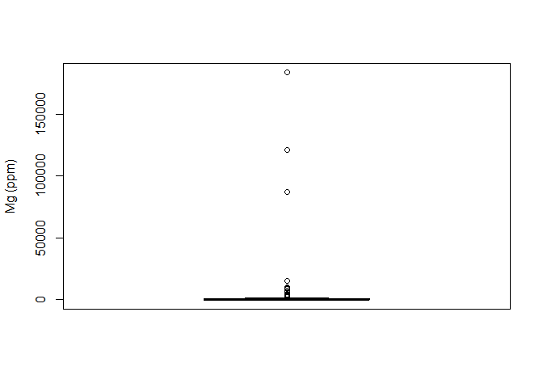<!-- -->

    ## [1] "Mg outliers:"

    ##  [1]  10210.59   2293.89   3249.27  15430.14   6117.28   2932.85   9673.03
    ##  [8] 121100.70   7601.19  87376.36  87130.60   8760.37   3895.30 183513.36
    ## [15]   2855.67

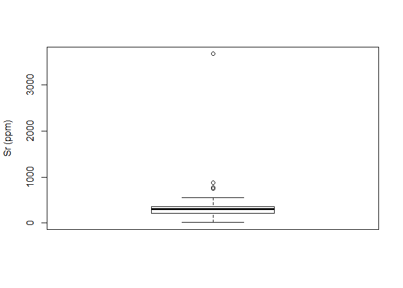<!-- -->

    ## [1] "Sr outliers:"

    ## [1] 3665.31  767.69  870.95  751.91

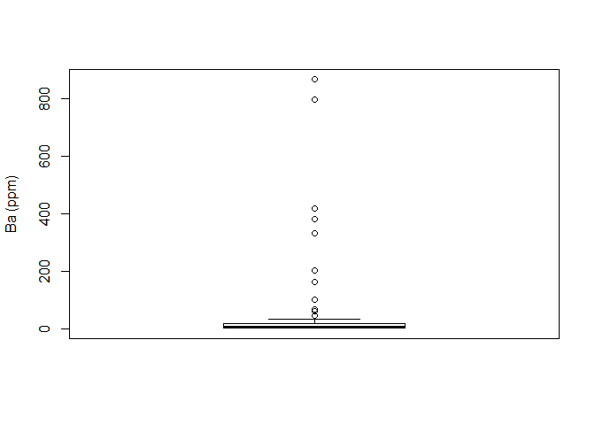<!-- -->

    ## [1] "Ba outliers:"

    ##  [1] 163.19  67.70 202.48 101.34  59.33 331.53 867.17 419.04 381.86 796.17
    ## [11]  44.95

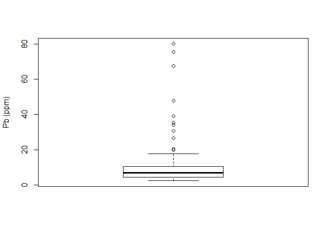<!-- -->

    ## [1] "Pb outliers:"

    ##  [1] 34.08 75.45 19.83 80.06 26.71 47.83 35.45 39.02 30.70 20.59 67.37

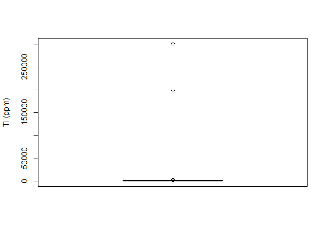<!-- -->

    ## [1] "Ti outliers:"

    ##  [1]   2210.80   1157.41 198589.36   1280.66   2950.83   1128.25   1299.73
    ##  [8]   1477.82   1831.62 300480.09

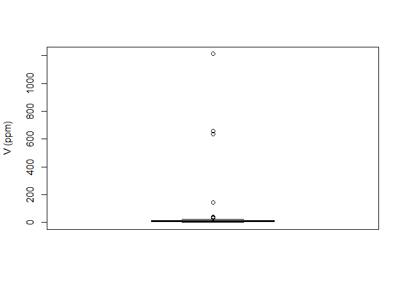<!-- -->

    ## [1] "V outliers:"

    ## [1]   40.42   30.65   36.12  658.19  635.43  142.85 1211.60

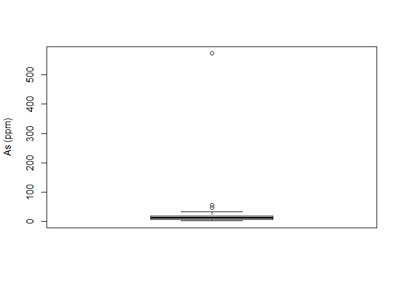<!-- -->

    ## [1] "As outliers:"

    ## [1]  55.19  46.09 573.08

Besides that, we would prefer to agglutinate Light Rare Earth Elements
(LREE) into a singular feature, since they display similar patterns and
might exhibit a better response if they are summed up together.

Once the corrections are made, we visualise the multielements boxplots
via:

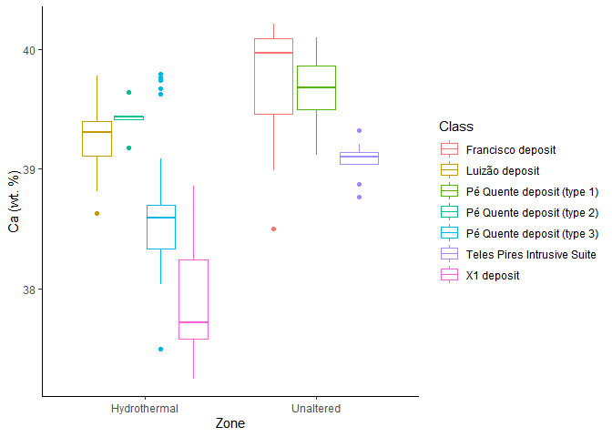<!-- -->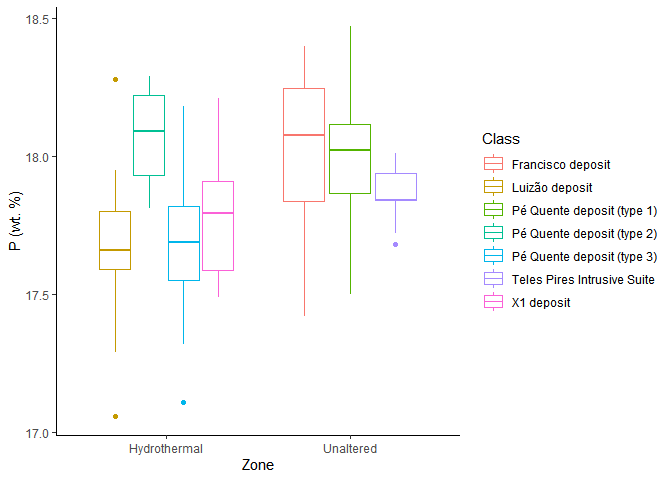<!-- -->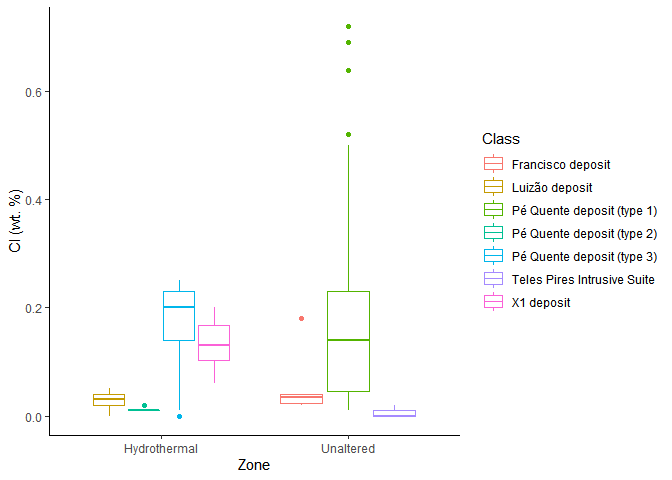<!-- -->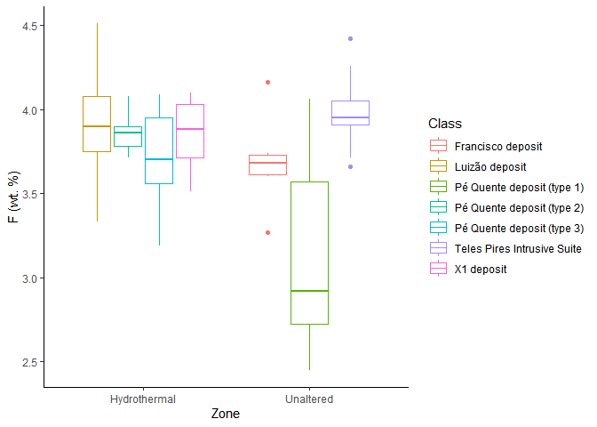<!-- -->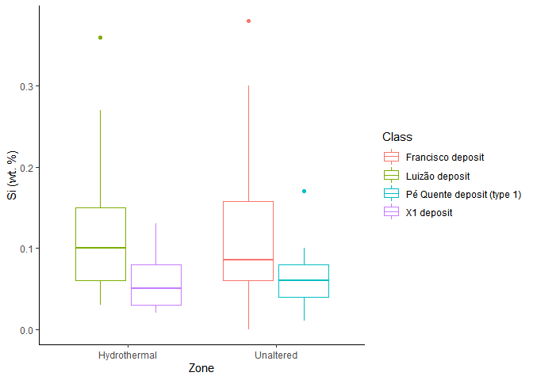<!-- -->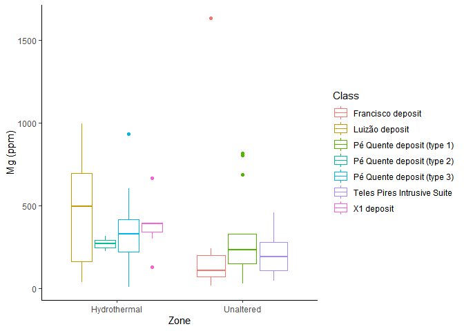<!-- -->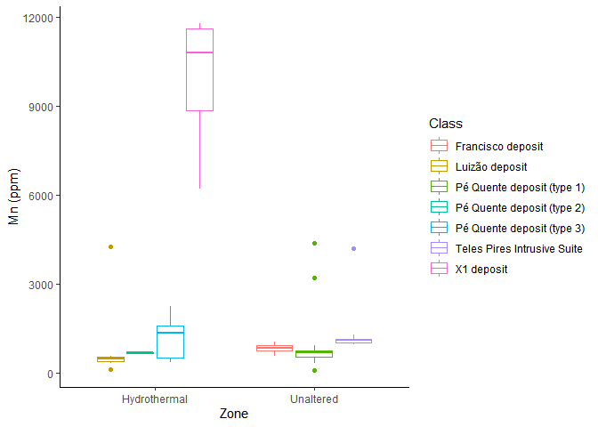<!-- -->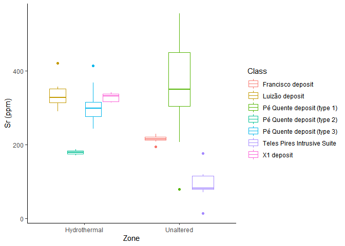<!-- -->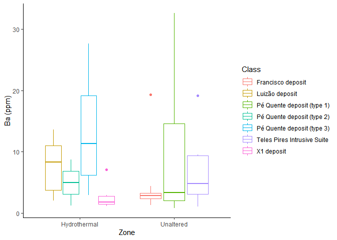<!-- -->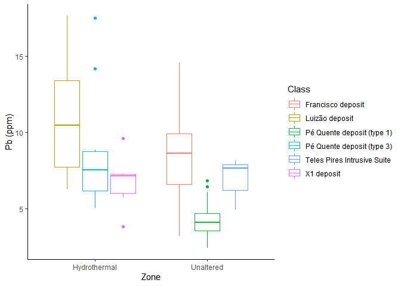<!-- --><!-- --><!-- -->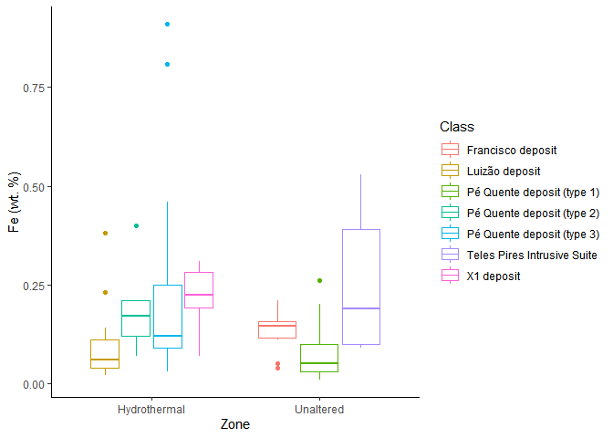<!-- --><!-- -->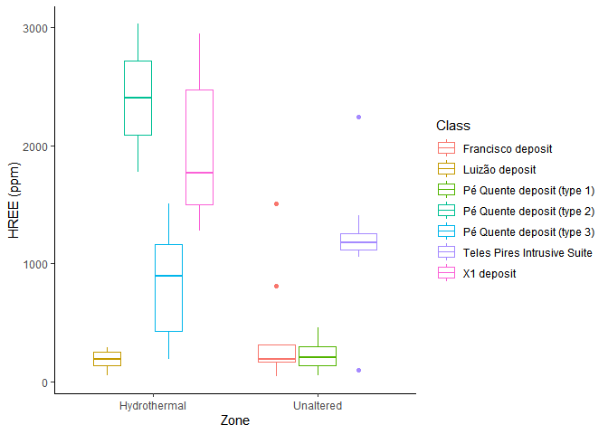<!-- -->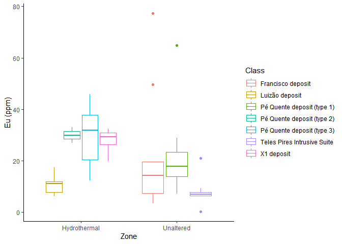<!-- -->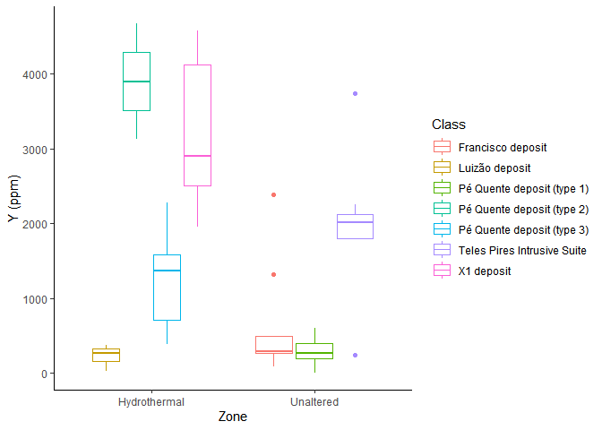<!-- -->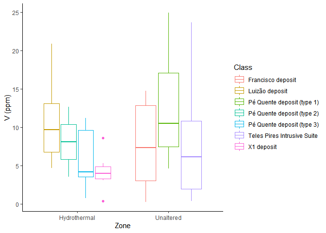<!-- -->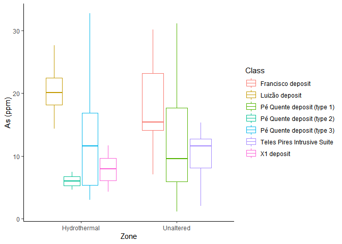<!-- -->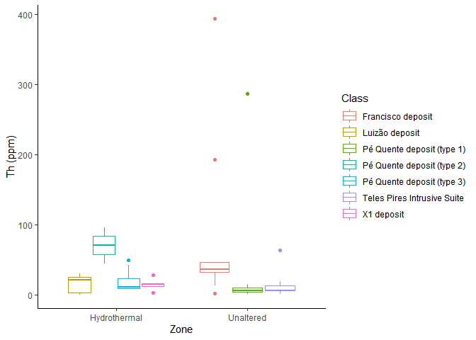<!-- -->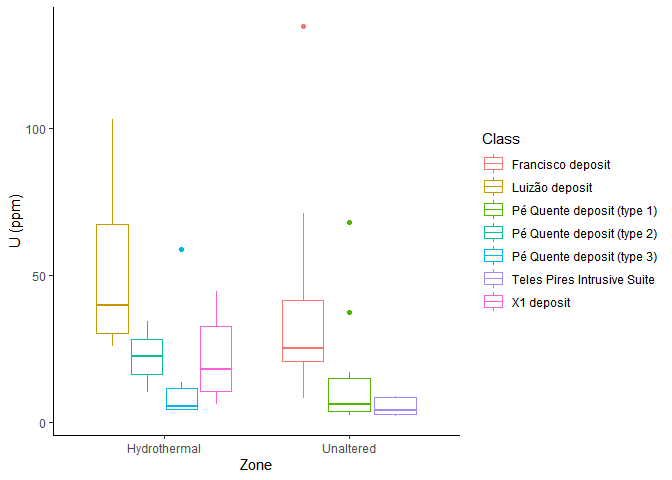<!-- -->
