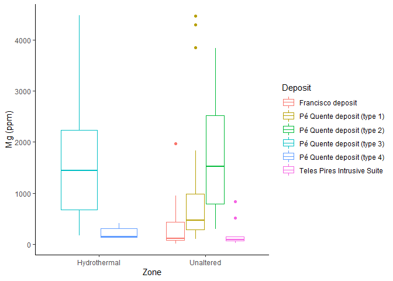

Part 1: Data Exploration of Trace Elements in Magnetite
================

**Summary**

[1. R markdown](#1-r-markdown)

[2. Trace elements in magnetite](#2-trace-elements-in-magnetite)

[3. Multielemental boxplots](3-multielemental-boxplots)

## 1\. R markdown

This R markdown is the spiritual companion to the same R markdown done
for apatite. It somewhat mirrors the code anmd logic available in that
previous code and show that the methods applied there could be
replicated not only for magnetite, but for other indicator minerals
(such as epidote, chlorite, plagioclase, garnet, and so on) that might
be used as proxies for finding mineral deposits.

Magnetite data analysis is also contained in my MSc dissertation called
[Trace elements geochemistry of apatite and magnetite in gold systems of
the Alta Floresta mineral province: Petrogenic and metallogenic
implications](http://hdl.handle.net/11449/193761).

We will start by importing the necessary libraries into R:

``` r
library(ggplot2) #for beautiful plots
  theme_set(theme_classic()) #to give plots a standard scientific flair
library(formattable) #for beautiful tables
library(knitr) #for rendering it on the web
  knitr::opts_knit$set(root.dir= normalizePath('..'))
  knitr::opts_chunk$set(error = FALSE)
```

## 2\. Trace elements in magnetite

Now, we will evaluate trace elements in magnetite. We start by loading
the data:

``` r
geochem_mag <- read.csv2('C:/Users/Pedro/Documents/Rconsole/Magnetite_git/geochem_mag.csv', 
                        header = TRUE, 
                        stringsAsFactors=TRUE, 
                        na = "NA",
                        dec = ".",
                        sep=";")
formattable(geochem_mag)
```

<table class="table table-condensed">

<thead>

<tr>

<th style="text-align:right;">

Sample\_ID

</th>

<th style="text-align:right;">

Sample

</th>

<th style="text-align:right;">

Deposit

</th>

<th style="text-align:right;">

Nature

</th>

<th style="text-align:right;">

Zone

</th>

<th style="text-align:right;">

Na\_pct

</th>

<th style="text-align:right;">

Al\_pct

</th>

<th style="text-align:right;">

Si\_pct

</th>

<th style="text-align:right;">

Mg\_pct

</th>

<th style="text-align:right;">

Ca\_pct

</th>

<th style="text-align:right;">

K\_pct

</th>

<th style="text-align:right;">

Ti\_pct

</th>

<th style="text-align:right;">

Fe\_pct

</th>

<th style="text-align:right;">

Mn\_pct

</th>

<th style="text-align:right;">

Ni\_pct

</th>

<th style="text-align:right;">

Cr\_pct

</th>

<th style="text-align:right;">

Li\_ppm

</th>

<th style="text-align:right;">

Na\_ppm

</th>

<th style="text-align:right;">

Mg\_ppm

</th>

<th style="text-align:right;">

Al\_ppm

</th>

<th style="text-align:right;">

Si\_ppm

</th>

<th style="text-align:right;">

Si\_ppm.1

</th>

<th style="text-align:right;">

P\_ppm

</th>

<th style="text-align:right;">

K\_ppm

</th>

<th style="text-align:right;">

Ca42\_ppm

</th>

<th style="text-align:right;">

Ca44\_ppm

</th>

<th style="text-align:right;">

Sc\_ppm

</th>

<th style="text-align:right;">

Ti\_ppm

</th>

<th style="text-align:right;">

V\_ppm

</th>

<th style="text-align:right;">

Cr\_ppm

</th>

<th style="text-align:right;">

Mn\_ppm

</th>

<th style="text-align:right;">

Fe\_ppm

</th>

<th style="text-align:right;">

Co\_ppm

</th>

<th style="text-align:right;">

Ni\_ppm

</th>

<th style="text-align:right;">

Cu\_ppm

</th>

<th style="text-align:right;">

Zn\_ppm

</th>

<th style="text-align:right;">

Ga\_ppm

</th>

<th style="text-align:right;">

As\_ppm

</th>

<th style="text-align:right;">

Se\_ppm

</th>

<th style="text-align:right;">

Rb\_ppm

</th>

<th style="text-align:right;">

Sr\_ppm

</th>

<th style="text-align:right;">

Y\_ppm

</th>

<th style="text-align:right;">

Zr\_ppm

</th>

<th style="text-align:right;">

Nb\_ppm

</th>

<th style="text-align:right;">

Mo\_ppm

</th>

<th style="text-align:right;">

Cd\_ppm

</th>

<th style="text-align:right;">

Sn\_ppm

</th>

<th style="text-align:right;">

Cs\_ppm

</th>

<th style="text-align:right;">

Ba\_ppm

</th>

<th style="text-align:right;">

La\_ppm

</th>

<th style="text-align:right;">

Ce\_ppm

</th>

<th style="text-align:right;">

Pr\_ppm

</th>

<th style="text-align:right;">

Nd\_ppm

</th>

<th style="text-align:right;">

Sm\_ppm

</th>

<th style="text-align:right;">

Eu\_ppm

</th>

<th style="text-align:right;">

Gd\_ppm

</th>

<th style="text-align:right;">

Tb\_ppm

</th>

<th style="text-align:right;">

Dy\_ppm

</th>

<th style="text-align:right;">

Ho\_ppm

</th>

<th style="text-align:right;">

Er\_ppm

</th>

<th style="text-align:right;">

Tm\_ppm

</th>

<th style="text-align:right;">

Yb\_ppm

</th>

<th style="text-align:right;">

Lu\_ppm

</th>

<th style="text-align:right;">

Hf\_ppm

</th>

<th style="text-align:right;">

Ta\_ppm

</th>

<th style="text-align:right;">

W\_ppm

</th>

<th style="text-align:right;">

Pb\_ppm

</th>

<th style="text-align:right;">

Th\_ppm

</th>

<th style="text-align:right;">

U\_ppm

</th>

</tr>

</thead>

<tbody>

<tr>

<td style="text-align:right;">

GT-2\_mag\_1\_1

</td>

<td style="text-align:right;">

GT-2

</td>

<td style="text-align:right;">

Pé Quente deposit (type 2)

</td>

<td style="text-align:right;">

Propylitic alteration

</td>

<td style="text-align:right;">

Unaltered

</td>

<td style="text-align:right;">

0.019139988

</td>

<td style="text-align:right;">

0.049802425

</td>

<td style="text-align:right;">

0.021922936

</td>

<td style="text-align:right;">

0.01682649

</td>

<td style="text-align:right;">

0.03609235

</td>

<td style="text-align:right;">

NA

</td>

<td style="text-align:right;">

0.369118307

</td>

<td style="text-align:right;">

71.24342

</td>

<td style="text-align:right;">

0.016341106

</td>

<td style="text-align:right;">

0.004322120

</td>

<td style="text-align:right;">

0.06992524

</td>

<td style="text-align:right;">

12.220

</td>

<td style="text-align:right;">

1230.87

</td>

<td style="text-align:right;">

3839.520

</td>

<td style="text-align:right;">

5936.720

</td>

<td style="text-align:right;">

2787.190

</td>

<td style="text-align:right;">

11300.360

</td>

<td style="text-align:right;">

563.390

</td>

<td style="text-align:right;">

243.920

</td>

<td style="text-align:right;">

7580.110

</td>

<td style="text-align:right;">

6608.700

</td>

<td style="text-align:right;">

3.040

</td>

<td style="text-align:right;">

5231.28

</td>

<td style="text-align:right;">

1399.19

</td>

<td style="text-align:right;">

735.11

</td>

<td style="text-align:right;">

703.24

</td>

<td style="text-align:right;">

712435.1

</td>

<td style="text-align:right;">

36.18

</td>

<td style="text-align:right;">

40.66

</td>

<td style="text-align:right;">

240.870

</td>

<td style="text-align:right;">

585.82

</td>

<td style="text-align:right;">

7.39

</td>

<td style="text-align:right;">

2.040

</td>

<td style="text-align:right;">

13.430

</td>

<td style="text-align:right;">

0.415

</td>

<td style="text-align:right;">

7.51

</td>

<td style="text-align:right;">

1.2300

</td>

<td style="text-align:right;">

3.480

</td>

<td style="text-align:right;">

0.3500

</td>

<td style="text-align:right;">

35.680

</td>

<td style="text-align:right;">

6.740

</td>

<td style="text-align:right;">

18.950

</td>

<td style="text-align:right;">

0.1700

</td>

<td style="text-align:right;">

8.400

</td>

<td style="text-align:right;">

7.420

</td>

<td style="text-align:right;">

9.000

</td>

<td style="text-align:right;">

0.9900

</td>

<td style="text-align:right;">

5.700

</td>

<td style="text-align:right;">

1.790

</td>

<td style="text-align:right;">

0.440

</td>

<td style="text-align:right;">

1.485

</td>

<td style="text-align:right;">

0.0925

</td>

<td style="text-align:right;">

1.180

</td>

<td style="text-align:right;">

0.2150

</td>

<td style="text-align:right;">

0.385

</td>

<td style="text-align:right;">

0.2700

</td>

<td style="text-align:right;">

1.145

</td>

<td style="text-align:right;">

0.2100

</td>

<td style="text-align:right;">

1.015

</td>

<td style="text-align:right;">

0.2650

</td>

<td style="text-align:right;">

1.575

</td>

<td style="text-align:right;">

1.350

</td>

<td style="text-align:right;">

0.6900

</td>

<td style="text-align:right;">

0.2500

</td>

</tr>

<tr>

<td style="text-align:right;">

GT-2\_mag\_1\_2

</td>

<td style="text-align:right;">

GT-2

</td>

<td style="text-align:right;">

Pé Quente deposit (type 2)

</td>

<td style="text-align:right;">

Propylitic alteration

</td>

<td style="text-align:right;">

Unaltered

</td>

<td style="text-align:right;">

0.006157438

</td>

<td style="text-align:right;">

0.219532900

</td>

<td style="text-align:right;">

0.011405536

</td>

<td style="text-align:right;">

NA

</td>

<td style="text-align:right;">

NA

</td>

<td style="text-align:right;">

NA

</td>

<td style="text-align:right;">

0.042325406

</td>

<td style="text-align:right;">

71.68959

</td>

<td style="text-align:right;">

0.011229670

</td>

<td style="text-align:right;">

NA

</td>

<td style="text-align:right;">

0.00362626

</td>

<td style="text-align:right;">

NA

</td>

<td style="text-align:right;">

NA

</td>

<td style="text-align:right;">

NA

</td>

<td style="text-align:right;">

NA

</td>

<td style="text-align:right;">

NA

</td>

<td style="text-align:right;">

NA

</td>

<td style="text-align:right;">

NA

</td>

<td style="text-align:right;">

NA

</td>

<td style="text-align:right;">

NA

</td>

<td style="text-align:right;">

NA

</td>

<td style="text-align:right;">

NA

</td>

<td style="text-align:right;">

NA

</td>

<td style="text-align:right;">

NA

</td>

<td style="text-align:right;">

NA

</td>

<td style="text-align:right;">

NA

</td>

<td style="text-align:right;">

NA

</td>

<td style="text-align:right;">

NA

</td>

<td style="text-align:right;">

NA

</td>

<td style="text-align:right;">

NA

</td>

<td style="text-align:right;">

NA

</td>

<td style="text-align:right;">

NA

</td>

<td style="text-align:right;">

NA

</td>

<td style="text-align:right;">

NA

</td>

<td style="text-align:right;">

NA

</td>

<td style="text-align:right;">

NA

</td>

<td style="text-align:right;">

NA

</td>

<td style="text-align:right;">

NA

</td>

<td style="text-align:right;">

NA

</td>

<td style="text-align:right;">

NA

</td>

<td style="text-align:right;">

NA

</td>

<td style="text-align:right;">

NA

</td>

<td style="text-align:right;">

NA

</td>

<td style="text-align:right;">

NA

</td>

<td style="text-align:right;">

NA

</td>

<td style="text-align:right;">

NA

</td>

<td style="text-align:right;">

NA

</td>

<td style="text-align:right;">

NA

</td>

<td style="text-align:right;">

NA

</td>

<td style="text-align:right;">

NA

</td>

<td style="text-align:right;">

NA

</td>

<td style="text-align:right;">

NA

</td>

<td style="text-align:right;">

NA

</td>

<td style="text-align:right;">

NA

</td>

<td style="text-align:right;">

NA

</td>

<td style="text-align:right;">

NA

</td>

<td style="text-align:right;">

NA

</td>

<td style="text-align:right;">

NA

</td>

<td style="text-align:right;">

NA

</td>

<td style="text-align:right;">

NA

</td>

<td style="text-align:right;">

NA

</td>

<td style="text-align:right;">

NA

</td>

<td style="text-align:right;">

NA

</td>

<td style="text-align:right;">

NA

</td>

</tr>

<tr>

<td style="text-align:right;">

GT-2\_mag\_2\_1

</td>

<td style="text-align:right;">

GT-2

</td>

<td style="text-align:right;">

Pé Quente deposit (type 2)

</td>

<td style="text-align:right;">

Propylitic alteration

</td>

<td style="text-align:right;">

Unaltered

</td>

<td style="text-align:right;">

0.002670696

</td>

<td style="text-align:right;">

0.575241825

</td>

<td style="text-align:right;">

0.006403928

</td>

<td style="text-align:right;">

0.00934805

</td>

<td style="text-align:right;">

0.01136373

</td>

<td style="text-align:right;">

NA

</td>

<td style="text-align:right;">

2.023646005

</td>

<td style="text-align:right;">

67.60366

</td>

<td style="text-align:right;">

0.015411754

</td>

<td style="text-align:right;">

0.019488832

</td>

<td style="text-align:right;">

0.18966024

</td>

<td style="text-align:right;">

3.580

</td>

<td style="text-align:right;">

913.25

</td>

<td style="text-align:right;">

957.480

</td>

<td style="text-align:right;">

3738.620

</td>

<td style="text-align:right;">

18326.950

</td>

<td style="text-align:right;">

4268.245

</td>

<td style="text-align:right;">

65.765

</td>

<td style="text-align:right;">

108.330

</td>

<td style="text-align:right;">

1464.990

</td>

<td style="text-align:right;">

1101.770

</td>

<td style="text-align:right;">

4.420

</td>

<td style="text-align:right;">

3081.01

</td>

<td style="text-align:right;">

2374.21

</td>

<td style="text-align:right;">

1762.89

</td>

<td style="text-align:right;">

278.71

</td>

<td style="text-align:right;">

676037.5

</td>

<td style="text-align:right;">

34.06

</td>

<td style="text-align:right;">

147.97

</td>

<td style="text-align:right;">

8.180

</td>

<td style="text-align:right;">

3232.01

</td>

<td style="text-align:right;">

4.73

</td>

<td style="text-align:right;">

1.620

</td>

<td style="text-align:right;">

9.640

</td>

<td style="text-align:right;">

0.320

</td>

<td style="text-align:right;">

3.97

</td>

<td style="text-align:right;">

0.1100

</td>

<td style="text-align:right;">

2.060

</td>

<td style="text-align:right;">

0.1020

</td>

<td style="text-align:right;">

0.960

</td>

<td style="text-align:right;">

3.055

</td>

<td style="text-align:right;">

9.430

</td>

<td style="text-align:right;">

0.0950

</td>

<td style="text-align:right;">

13.740

</td>

<td style="text-align:right;">

0.125

</td>

<td style="text-align:right;">

0.170

</td>

<td style="text-align:right;">

0.1550

</td>

<td style="text-align:right;">

0.805

</td>

<td style="text-align:right;">

0.920

</td>

<td style="text-align:right;">

0.205

</td>

<td style="text-align:right;">

1.035

</td>

<td style="text-align:right;">

0.1300

</td>

<td style="text-align:right;">

0.945

</td>

<td style="text-align:right;">

0.1350

</td>

<td style="text-align:right;">

0.495

</td>

<td style="text-align:right;">

0.1710

</td>

<td style="text-align:right;">

0.840

</td>

<td style="text-align:right;">

0.1450

</td>

<td style="text-align:right;">

0.705

</td>

<td style="text-align:right;">

0.3100

</td>

<td style="text-align:right;">

0.760

</td>

<td style="text-align:right;">

0.960

</td>

<td style="text-align:right;">

NA

</td>

<td style="text-align:right;">

NA

</td>

</tr>

<tr>

<td style="text-align:right;">

GT-2\_mag\_3\_1

</td>

<td style="text-align:right;">

GT-2

</td>

<td style="text-align:right;">

Pé Quente deposit (type 2)

</td>

<td style="text-align:right;">

Propylitic alteration

</td>

<td style="text-align:right;">

Unaltered

</td>

<td style="text-align:right;">

NA

</td>

<td style="text-align:right;">

0.083568575

</td>

<td style="text-align:right;">

0.010564144

</td>

<td style="text-align:right;">

NA

</td>

<td style="text-align:right;">

0.01508017

</td>

<td style="text-align:right;">

NA

</td>

<td style="text-align:right;">

0.052996684

</td>

<td style="text-align:right;">

71.80378

</td>

<td style="text-align:right;">

0.031985198

</td>

<td style="text-align:right;">

NA

</td>

<td style="text-align:right;">

0.00930512

</td>

<td style="text-align:right;">

NA

</td>

<td style="text-align:right;">

NA

</td>

<td style="text-align:right;">

NA

</td>

<td style="text-align:right;">

NA

</td>

<td style="text-align:right;">

NA

</td>

<td style="text-align:right;">

NA

</td>

<td style="text-align:right;">

NA

</td>

<td style="text-align:right;">

NA

</td>

<td style="text-align:right;">

NA

</td>

<td style="text-align:right;">

NA

</td>

<td style="text-align:right;">

NA

</td>

<td style="text-align:right;">

NA

</td>

<td style="text-align:right;">

NA

</td>

<td style="text-align:right;">

NA

</td>

<td style="text-align:right;">

NA

</td>

<td style="text-align:right;">

NA

</td>

<td style="text-align:right;">

NA

</td>

<td style="text-align:right;">

NA

</td>

<td style="text-align:right;">

NA

</td>

<td style="text-align:right;">

NA

</td>

<td style="text-align:right;">

NA

</td>

<td style="text-align:right;">

NA

</td>

<td style="text-align:right;">

NA

</td>

<td style="text-align:right;">

NA

</td>

<td style="text-align:right;">

NA

</td>

<td style="text-align:right;">

NA

</td>

<td style="text-align:right;">

NA

</td>

<td style="text-align:right;">

NA

</td>

<td style="text-align:right;">

NA

</td>

<td style="text-align:right;">

NA

</td>

<td style="text-align:right;">

NA

</td>

<td style="text-align:right;">

NA

</td>

<td style="text-align:right;">

NA

</td>

<td style="text-align:right;">

NA

</td>

<td style="text-align:right;">

NA

</td>

<td style="text-align:right;">

NA

</td>

<td style="text-align:right;">

NA

</td>

<td style="text-align:right;">

NA

</td>

<td style="text-align:right;">

NA

</td>

<td style="text-align:right;">

NA

</td>

<td style="text-align:right;">

NA

</td>

<td style="text-align:right;">

NA

</td>

<td style="text-align:right;">

NA

</td>

<td style="text-align:right;">

NA

</td>

<td style="text-align:right;">

NA

</td>

<td style="text-align:right;">

NA

</td>

<td style="text-align:right;">

NA

</td>

<td style="text-align:right;">

NA

</td>

<td style="text-align:right;">

NA

</td>

<td style="text-align:right;">

NA

</td>

<td style="text-align:right;">

NA

</td>

<td style="text-align:right;">

NA

</td>

<td style="text-align:right;">

NA

</td>

</tr>

<tr>

<td style="text-align:right;">

GT-2\_mag\_4\_1

</td>

<td style="text-align:right;">

GT-2

</td>

<td style="text-align:right;">

Pé Quente deposit (type 2)

</td>

<td style="text-align:right;">

Propylitic alteration

</td>

<td style="text-align:right;">

Unaltered

</td>

<td style="text-align:right;">

0.017136966

</td>

<td style="text-align:right;">

0.047262025

</td>

<td style="text-align:right;">

0.005796256

</td>

<td style="text-align:right;">

NA

</td>

<td style="text-align:right;">

0.00843346

</td>

<td style="text-align:right;">

NA

</td>

<td style="text-align:right;">

0.022002017

</td>

<td style="text-align:right;">

71.69900

</td>

<td style="text-align:right;">

0.030668616

</td>

<td style="text-align:right;">

NA

</td>

<td style="text-align:right;">

0.00923670

</td>

<td style="text-align:right;">

10.130

</td>

<td style="text-align:right;">

249.85

</td>

<td style="text-align:right;">

2082.590

</td>

<td style="text-align:right;">

3102.720

</td>

<td style="text-align:right;">

7675.630

</td>

<td style="text-align:right;">

8902.560

</td>

<td style="text-align:right;">

107.480

</td>

<td style="text-align:right;">

61.930

</td>

<td style="text-align:right;">

584.080

</td>

<td style="text-align:right;">

453.440

</td>

<td style="text-align:right;">

0.405

</td>

<td style="text-align:right;">

276.00

</td>

<td style="text-align:right;">

1339.12

</td>

<td style="text-align:right;">

114.96

</td>

<td style="text-align:right;">

295.42

</td>

<td style="text-align:right;">

716990.9

</td>

<td style="text-align:right;">

35.95

</td>

<td style="text-align:right;">

24.19

</td>

<td style="text-align:right;">

5.700

</td>

<td style="text-align:right;">

353.25

</td>

<td style="text-align:right;">

3.35

</td>

<td style="text-align:right;">

1.680

</td>

<td style="text-align:right;">

11.070

</td>

<td style="text-align:right;">

0.265

</td>

<td style="text-align:right;">

1.90

</td>

<td style="text-align:right;">

0.1110

</td>

<td style="text-align:right;">

0.480

</td>

<td style="text-align:right;">

0.1115

</td>

<td style="text-align:right;">

0.965

</td>

<td style="text-align:right;">

3.565

</td>

<td style="text-align:right;">

6.800

</td>

<td style="text-align:right;">

0.1000

</td>

<td style="text-align:right;">

4.670

</td>

<td style="text-align:right;">

0.150

</td>

<td style="text-align:right;">

0.380

</td>

<td style="text-align:right;">

0.1300

</td>

<td style="text-align:right;">

1.395

</td>

<td style="text-align:right;">

0.950

</td>

<td style="text-align:right;">

0.250

</td>

<td style="text-align:right;">

0.570

</td>

<td style="text-align:right;">

0.1300

</td>

<td style="text-align:right;">

0.790

</td>

<td style="text-align:right;">

0.1200

</td>

<td style="text-align:right;">

0.590

</td>

<td style="text-align:right;">

0.0985

</td>

<td style="text-align:right;">

0.655

</td>

<td style="text-align:right;">

0.1300

</td>

<td style="text-align:right;">

0.390

</td>

<td style="text-align:right;">

0.1850

</td>

<td style="text-align:right;">

0.725

</td>

<td style="text-align:right;">

1.300

</td>

<td style="text-align:right;">

0.0865

</td>

<td style="text-align:right;">

NA

</td>

</tr>

<tr>

<td style="text-align:right;">

GT-2\_mag\_5\_1

</td>

<td style="text-align:right;">

GT-2

</td>

<td style="text-align:right;">

Pé Quente deposit (type 2)

</td>

<td style="text-align:right;">

Propylitic alteration

</td>

<td style="text-align:right;">

Unaltered

</td>

<td style="text-align:right;">

NA

</td>

<td style="text-align:right;">

0.170577275

</td>

<td style="text-align:right;">

0.005609280

</td>

<td style="text-align:right;">

NA

</td>

<td style="text-align:right;">

NA

</td>

<td style="text-align:right;">

NA

</td>

<td style="text-align:right;">

1.194403773

</td>

<td style="text-align:right;">

70.19055

</td>

<td style="text-align:right;">

0.052818172

</td>

<td style="text-align:right;">

0.012573440

</td>

<td style="text-align:right;">

NA

</td>

<td style="text-align:right;">

0.650

</td>

<td style="text-align:right;">

376.32

</td>

<td style="text-align:right;">

295.750

</td>

<td style="text-align:right;">

1641.880

</td>

<td style="text-align:right;">

6719.310

</td>

<td style="text-align:right;">

8188.240

</td>

<td style="text-align:right;">

47.660

</td>

<td style="text-align:right;">

53.080

</td>

<td style="text-align:right;">

3913.150

</td>

<td style="text-align:right;">

2899.940

</td>

<td style="text-align:right;">

0.880

</td>

<td style="text-align:right;">

5687.29

</td>

<td style="text-align:right;">

1260.34

</td>

<td style="text-align:right;">

18.51

</td>

<td style="text-align:right;">

259.72

</td>

<td style="text-align:right;">

701906.4

</td>

<td style="text-align:right;">

31.31

</td>

<td style="text-align:right;">

27.95

</td>

<td style="text-align:right;">

2.560

</td>

<td style="text-align:right;">

727.39

</td>

<td style="text-align:right;">

2.73

</td>

<td style="text-align:right;">

1.230

</td>

<td style="text-align:right;">

10.295

</td>

<td style="text-align:right;">

0.250

</td>

<td style="text-align:right;">

2.50

</td>

<td style="text-align:right;">

1.0400

</td>

<td style="text-align:right;">

1.310

</td>

<td style="text-align:right;">

0.6300

</td>

<td style="text-align:right;">

0.680

</td>

<td style="text-align:right;">

4.130

</td>

<td style="text-align:right;">

9.370

</td>

<td style="text-align:right;">

0.1100

</td>

<td style="text-align:right;">

5.090

</td>

<td style="text-align:right;">

1.330

</td>

<td style="text-align:right;">

1.580

</td>

<td style="text-align:right;">

0.4800

</td>

<td style="text-align:right;">

1.085

</td>

<td style="text-align:right;">

1.125

</td>

<td style="text-align:right;">

0.245

</td>

<td style="text-align:right;">

0.730

</td>

<td style="text-align:right;">

0.0635

</td>

<td style="text-align:right;">

0.660

</td>

<td style="text-align:right;">

0.1800

</td>

<td style="text-align:right;">

0.545

</td>

<td style="text-align:right;">

0.1250

</td>

<td style="text-align:right;">

0.455

</td>

<td style="text-align:right;">

0.1450

</td>

<td style="text-align:right;">

0.435

</td>

<td style="text-align:right;">

0.1600

</td>

<td style="text-align:right;">

0.565

</td>

<td style="text-align:right;">

2.330

</td>

<td style="text-align:right;">

0.2000

</td>

<td style="text-align:right;">

0.7700

</td>

</tr>

<tr>

<td style="text-align:right;">

PGD-01\_mag\_1\_1

</td>

<td style="text-align:right;">

PGD-01

</td>

<td style="text-align:right;">

Francisco deposit

</td>

<td style="text-align:right;">

Propylitic alteration

</td>

<td style="text-align:right;">

Unaltered

</td>

<td style="text-align:right;">

NA

</td>

<td style="text-align:right;">

0.010955475

</td>

<td style="text-align:right;">

0.011452280

</td>

<td style="text-align:right;">

0.00621193

</td>

<td style="text-align:right;">

0.00171528

</td>

<td style="text-align:right;">

NA

</td>

<td style="text-align:right;">

0.005815247

</td>

<td style="text-align:right;">

71.69954

</td>

<td style="text-align:right;">

0.032604766

</td>

<td style="text-align:right;">

NA

</td>

<td style="text-align:right;">

0.02463120

</td>

<td style="text-align:right;">

NA

</td>

<td style="text-align:right;">

NA

</td>

<td style="text-align:right;">

NA

</td>

<td style="text-align:right;">

NA

</td>

<td style="text-align:right;">

NA

</td>

<td style="text-align:right;">

NA

</td>

<td style="text-align:right;">

NA

</td>

<td style="text-align:right;">

NA

</td>

<td style="text-align:right;">

NA

</td>

<td style="text-align:right;">

NA

</td>

<td style="text-align:right;">

NA

</td>

<td style="text-align:right;">

NA

</td>

<td style="text-align:right;">

NA

</td>

<td style="text-align:right;">

NA

</td>

<td style="text-align:right;">

NA

</td>

<td style="text-align:right;">

NA

</td>

<td style="text-align:right;">

NA

</td>

<td style="text-align:right;">

NA

</td>

<td style="text-align:right;">

NA

</td>

<td style="text-align:right;">

NA

</td>

<td style="text-align:right;">

NA

</td>

<td style="text-align:right;">

NA

</td>

<td style="text-align:right;">

NA

</td>

<td style="text-align:right;">

NA

</td>

<td style="text-align:right;">

NA

</td>

<td style="text-align:right;">

NA

</td>

<td style="text-align:right;">

NA

</td>

<td style="text-align:right;">

NA

</td>

<td style="text-align:right;">

NA

</td>

<td style="text-align:right;">

NA

</td>

<td style="text-align:right;">

NA

</td>

<td style="text-align:right;">

NA

</td>

<td style="text-align:right;">

NA

</td>

<td style="text-align:right;">

NA

</td>

<td style="text-align:right;">

NA

</td>

<td style="text-align:right;">

NA

</td>

<td style="text-align:right;">

NA

</td>

<td style="text-align:right;">

NA

</td>

<td style="text-align:right;">

NA

</td>

<td style="text-align:right;">

NA

</td>

<td style="text-align:right;">

NA

</td>

<td style="text-align:right;">

NA

</td>

<td style="text-align:right;">

NA

</td>

<td style="text-align:right;">

NA

</td>

<td style="text-align:right;">

NA

</td>

<td style="text-align:right;">

NA

</td>

<td style="text-align:right;">

NA

</td>

<td style="text-align:right;">

NA

</td>

<td style="text-align:right;">

NA

</td>

<td style="text-align:right;">

NA

</td>

<td style="text-align:right;">

NA

</td>

<td style="text-align:right;">

NA

</td>

<td style="text-align:right;">

NA

</td>

</tr>

<tr>

<td style="text-align:right;">

PGD-01\_mag\_2\_1

</td>

<td style="text-align:right;">

PGD-01

</td>

<td style="text-align:right;">

Francisco deposit

</td>

<td style="text-align:right;">

Propylitic alteration

</td>

<td style="text-align:right;">

Unaltered

</td>

<td style="text-align:right;">

NA

</td>

<td style="text-align:right;">

0.046256450

</td>

<td style="text-align:right;">

0.001729528

</td>

<td style="text-align:right;">

0.00826247

</td>

<td style="text-align:right;">

0.00886228

</td>

<td style="text-align:right;">

NA

</td>

<td style="text-align:right;">

0.302272942

</td>

<td style="text-align:right;">

70.52394

</td>

<td style="text-align:right;">

0.281051534

</td>

<td style="text-align:right;">

0.029390416

</td>

<td style="text-align:right;">

0.02853114

</td>

<td style="text-align:right;">

0.805

</td>

<td style="text-align:right;">

196.39

</td>

<td style="text-align:right;">

86.400

</td>

<td style="text-align:right;">

2276.680

</td>

<td style="text-align:right;">

2369.980

</td>

<td style="text-align:right;">

4195.540

</td>

<td style="text-align:right;">

41.375

</td>

<td style="text-align:right;">

55.480

</td>

<td style="text-align:right;">

583.785

</td>

<td style="text-align:right;">

149.865

</td>

<td style="text-align:right;">

2.320

</td>

<td style="text-align:right;">

1192.70

</td>

<td style="text-align:right;">

1682.93

</td>

<td style="text-align:right;">

287.09

</td>

<td style="text-align:right;">

1262.82

</td>

<td style="text-align:right;">

705240.1

</td>

<td style="text-align:right;">

20.08

</td>

<td style="text-align:right;">

21.33

</td>

<td style="text-align:right;">

1.040

</td>

<td style="text-align:right;">

973.76

</td>

<td style="text-align:right;">

9.42

</td>

<td style="text-align:right;">

1.630

</td>

<td style="text-align:right;">

8.285

</td>

<td style="text-align:right;">

0.300

</td>

<td style="text-align:right;">

0.37

</td>

<td style="text-align:right;">

0.1350

</td>

<td style="text-align:right;">

0.155

</td>

<td style="text-align:right;">

0.1025

</td>

<td style="text-align:right;">

0.740

</td>

<td style="text-align:right;">

5.570

</td>

<td style="text-align:right;">

1.540

</td>

<td style="text-align:right;">

0.1700

</td>

<td style="text-align:right;">

3.270

</td>

<td style="text-align:right;">

0.165

</td>

<td style="text-align:right;">

0.175

</td>

<td style="text-align:right;">

0.1100

</td>

<td style="text-align:right;">

1.960

</td>

<td style="text-align:right;">

1.130

</td>

<td style="text-align:right;">

0.350

</td>

<td style="text-align:right;">

1.470

</td>

<td style="text-align:right;">

0.1250

</td>

<td style="text-align:right;">

1.045

</td>

<td style="text-align:right;">

0.1550

</td>

<td style="text-align:right;">

0.435

</td>

<td style="text-align:right;">

0.1400

</td>

<td style="text-align:right;">

0.620

</td>

<td style="text-align:right;">

0.1750

</td>

<td style="text-align:right;">

0.685

</td>

<td style="text-align:right;">

0.0705

</td>

<td style="text-align:right;">

0.740

</td>

<td style="text-align:right;">

3.240

</td>

<td style="text-align:right;">

NA

</td>

<td style="text-align:right;">

NA

</td>

</tr>

<tr>

<td style="text-align:right;">

PGD-01\_mag\_2\_2

</td>

<td style="text-align:right;">

PGD-01

</td>

<td style="text-align:right;">

Francisco deposit

</td>

<td style="text-align:right;">

Propylitic alteration

</td>

<td style="text-align:right;">

Unaltered

</td>

<td style="text-align:right;">

NA

</td>

<td style="text-align:right;">

0.003916450

</td>

<td style="text-align:right;">

0.021268520

</td>

<td style="text-align:right;">

0.00385984

</td>

<td style="text-align:right;">

0.02122659

</td>

<td style="text-align:right;">

NA

</td>

<td style="text-align:right;">

0.010671278

</td>

<td style="text-align:right;">

71.72986

</td>

<td style="text-align:right;">

0.041898286

</td>

<td style="text-align:right;">

0.001650264

</td>

<td style="text-align:right;">

0.00779988

</td>

<td style="text-align:right;">

0.860

</td>

<td style="text-align:right;">

1846.49

</td>

<td style="text-align:right;">

448.950

</td>

<td style="text-align:right;">

592.420

</td>

<td style="text-align:right;">

13450.380

</td>

<td style="text-align:right;">

4641.540

</td>

<td style="text-align:right;">

43.440

</td>

<td style="text-align:right;">

468.800

</td>

<td style="text-align:right;">

659.555

</td>

<td style="text-align:right;">

1363.710

</td>

<td style="text-align:right;">

0.510

</td>

<td style="text-align:right;">

229.09

</td>

<td style="text-align:right;">

1392.94

</td>

<td style="text-align:right;">

236.09

</td>

<td style="text-align:right;">

428.25

</td>

<td style="text-align:right;">

717299.4

</td>

<td style="text-align:right;">

18.24

</td>

<td style="text-align:right;">

14.48

</td>

<td style="text-align:right;">

3.050

</td>

<td style="text-align:right;">

96.25

</td>

<td style="text-align:right;">

6.94

</td>

<td style="text-align:right;">

1.875

</td>

<td style="text-align:right;">

8.680

</td>

<td style="text-align:right;">

0.410

</td>

<td style="text-align:right;">

5.98

</td>

<td style="text-align:right;">

0.1650

</td>

<td style="text-align:right;">

2.350

</td>

<td style="text-align:right;">

0.1800

</td>

<td style="text-align:right;">

1.115

</td>

<td style="text-align:right;">

4.055

</td>

<td style="text-align:right;">

49.620

</td>

<td style="text-align:right;">

0.2100

</td>

<td style="text-align:right;">

16.740

</td>

<td style="text-align:right;">

0.190

</td>

<td style="text-align:right;">

0.600

</td>

<td style="text-align:right;">

0.1450

</td>

<td style="text-align:right;">

2.125

</td>

<td style="text-align:right;">

1.500

</td>

<td style="text-align:right;">

0.235

</td>

<td style="text-align:right;">

0.665

</td>

<td style="text-align:right;">

0.1700

</td>

<td style="text-align:right;">

0.910

</td>

<td style="text-align:right;">

0.2150

</td>

<td style="text-align:right;">

0.435

</td>

<td style="text-align:right;">

0.1600

</td>

<td style="text-align:right;">

0.825

</td>

<td style="text-align:right;">

0.2200

</td>

<td style="text-align:right;">

0.645

</td>

<td style="text-align:right;">

0.2300

</td>

<td style="text-align:right;">

0.740

</td>

<td style="text-align:right;">

1.285

</td>

<td style="text-align:right;">

0.1000

</td>

<td style="text-align:right;">

NA

</td>

</tr>

<tr>

<td style="text-align:right;">

PGD-01\_mag\_3\_1

</td>

<td style="text-align:right;">

PGD-01

</td>

<td style="text-align:right;">

Francisco deposit

</td>

<td style="text-align:right;">

Propylitic alteration

</td>

<td style="text-align:right;">

Unaltered

</td>

<td style="text-align:right;">

0.023962078

</td>

<td style="text-align:right;">

0.063510000

</td>

<td style="text-align:right;">

0.016407144

</td>

<td style="text-align:right;">

0.01797238

</td>

<td style="text-align:right;">

0.00643230

</td>

<td style="text-align:right;">

NA

</td>

<td style="text-align:right;">

0.009052601

</td>

<td style="text-align:right;">

71.67498

</td>

<td style="text-align:right;">

0.049797778

</td>

<td style="text-align:right;">

NA

</td>

<td style="text-align:right;">

0.01621554

</td>

<td style="text-align:right;">

0.745

</td>

<td style="text-align:right;">

553.95

</td>

<td style="text-align:right;">

345.800

</td>

<td style="text-align:right;">

956.990

</td>

<td style="text-align:right;">

11099.620

</td>

<td style="text-align:right;">

3733.930

</td>

<td style="text-align:right;">

39.540

</td>

<td style="text-align:right;">

318.250

</td>

<td style="text-align:right;">

1178.560

</td>

<td style="text-align:right;">

394.940

</td>

<td style="text-align:right;">

0.375

</td>

<td style="text-align:right;">

239.05

</td>

<td style="text-align:right;">

1241.90

</td>

<td style="text-align:right;">

125.58

</td>

<td style="text-align:right;">

661.21

</td>

<td style="text-align:right;">

716750.6

</td>

<td style="text-align:right;">

18.34

</td>

<td style="text-align:right;">

17.45

</td>

<td style="text-align:right;">

6.070

</td>

<td style="text-align:right;">

602.01

</td>

<td style="text-align:right;">

7.19

</td>

<td style="text-align:right;">

1.390

</td>

<td style="text-align:right;">

7.430

</td>

<td style="text-align:right;">

5.750

</td>

<td style="text-align:right;">

2.10

</td>

<td style="text-align:right;">

0.9800

</td>

<td style="text-align:right;">

0.330

</td>

<td style="text-align:right;">

0.0805

</td>

<td style="text-align:right;">

0.790

</td>

<td style="text-align:right;">

3.745

</td>

<td style="text-align:right;">

11.670

</td>

<td style="text-align:right;">

0.2800

</td>

<td style="text-align:right;">

11.270

</td>

<td style="text-align:right;">

0.200

</td>

<td style="text-align:right;">

0.140

</td>

<td style="text-align:right;">

0.1700

</td>

<td style="text-align:right;">

1.980

</td>

<td style="text-align:right;">

1.260

</td>

<td style="text-align:right;">

0.310

</td>

<td style="text-align:right;">

0.685

</td>

<td style="text-align:right;">

0.1200

</td>

<td style="text-align:right;">

0.855

</td>

<td style="text-align:right;">

0.1800

</td>

<td style="text-align:right;">

0.780

</td>

<td style="text-align:right;">

0.1700

</td>

<td style="text-align:right;">

0.695

</td>

<td style="text-align:right;">

0.1100

</td>

<td style="text-align:right;">

0.470

</td>

<td style="text-align:right;">

0.1200

</td>

<td style="text-align:right;">

0.620

</td>

<td style="text-align:right;">

4.910

</td>

<td style="text-align:right;">

0.0630

</td>

<td style="text-align:right;">

0.1190

</td>

</tr>

<tr>

<td style="text-align:right;">

PGD-01\_mag\_4\_1

</td>

<td style="text-align:right;">

PGD-01

</td>

<td style="text-align:right;">

Francisco deposit

</td>

<td style="text-align:right;">

Propylitic alteration

</td>

<td style="text-align:right;">

Unaltered

</td>

<td style="text-align:right;">

0.028784168

</td>

<td style="text-align:right;">

0.025933250

</td>

<td style="text-align:right;">

0.008881360

</td>

<td style="text-align:right;">

NA

</td>

<td style="text-align:right;">

0.03752175

</td>

<td style="text-align:right;">

0.003320640

</td>

<td style="text-align:right;">

NA

</td>

<td style="text-align:right;">

71.71812

</td>

<td style="text-align:right;">

0.042130624

</td>

<td style="text-align:right;">

NA

</td>

<td style="text-align:right;">

NA

</td>

<td style="text-align:right;">

0.810

</td>

<td style="text-align:right;">

197.13

</td>

<td style="text-align:right;">

73.360

</td>

<td style="text-align:right;">

478.550

</td>

<td style="text-align:right;">

2739.145

</td>

<td style="text-align:right;">

4941.310

</td>

<td style="text-align:right;">

1088.330

</td>

<td style="text-align:right;">

109.910

</td>

<td style="text-align:right;">

3450.400

</td>

<td style="text-align:right;">

3531.660

</td>

<td style="text-align:right;">

0.510

</td>

<td style="text-align:right;">

299.07

</td>

<td style="text-align:right;">

1244.75

</td>

<td style="text-align:right;">

81.02

</td>

<td style="text-align:right;">

404.09

</td>

<td style="text-align:right;">

717182.1

</td>

<td style="text-align:right;">

20.81

</td>

<td style="text-align:right;">

15.61

</td>

<td style="text-align:right;">

6.680

</td>

<td style="text-align:right;">

238.92

</td>

<td style="text-align:right;">

5.11

</td>

<td style="text-align:right;">

1.285

</td>

<td style="text-align:right;">

13.280

</td>

<td style="text-align:right;">

1.540

</td>

<td style="text-align:right;">

2.68

</td>

<td style="text-align:right;">

7.9700

</td>

<td style="text-align:right;">

5.180

</td>

<td style="text-align:right;">

2.4700

</td>

<td style="text-align:right;">

0.980

</td>

<td style="text-align:right;">

5.310

</td>

<td style="text-align:right;">

6.290

</td>

<td style="text-align:right;">

0.1800

</td>

<td style="text-align:right;">

1.685

</td>

<td style="text-align:right;">

14.260

</td>

<td style="text-align:right;">

37.330

</td>

<td style="text-align:right;">

4.0500

</td>

<td style="text-align:right;">

15.440

</td>

<td style="text-align:right;">

1.405

</td>

<td style="text-align:right;">

0.340

</td>

<td style="text-align:right;">

2.440

</td>

<td style="text-align:right;">

0.2450

</td>

<td style="text-align:right;">

1.330

</td>

<td style="text-align:right;">

0.2550

</td>

<td style="text-align:right;">

0.675

</td>

<td style="text-align:right;">

0.4600

</td>

<td style="text-align:right;">

1.295

</td>

<td style="text-align:right;">

0.1900

</td>

<td style="text-align:right;">

0.545

</td>

<td style="text-align:right;">

0.2200

</td>

<td style="text-align:right;">

0.870

</td>

<td style="text-align:right;">

4.770

</td>

<td style="text-align:right;">

4.8600

</td>

<td style="text-align:right;">

4.1300

</td>

</tr>

<tr>

<td style="text-align:right;">

PGD-01\_mag\_5\_1

</td>

<td style="text-align:right;">

PGD-01

</td>

<td style="text-align:right;">

Francisco deposit

</td>

<td style="text-align:right;">

Propylitic alteration

</td>

<td style="text-align:right;">

Unaltered

</td>

<td style="text-align:right;">

NA

</td>

<td style="text-align:right;">

0.022598975

</td>

<td style="text-align:right;">

0.017388768

</td>

<td style="text-align:right;">

NA

</td>

<td style="text-align:right;">

0.00071470

</td>

<td style="text-align:right;">

NA

</td>

<td style="text-align:right;">

NA

</td>

<td style="text-align:right;">

71.62399

</td>

<td style="text-align:right;">

0.039574906

</td>

<td style="text-align:right;">

NA

</td>

<td style="text-align:right;">

0.02531540

</td>

<td style="text-align:right;">

0.625

</td>

<td style="text-align:right;">

269.99

</td>

<td style="text-align:right;">

62.760

</td>

<td style="text-align:right;">

475.020

</td>

<td style="text-align:right;">

4294.610

</td>

<td style="text-align:right;">

3177.825

</td>

<td style="text-align:right;">

34.870

</td>

<td style="text-align:right;">

58.120

</td>

<td style="text-align:right;">

970.630

</td>

<td style="text-align:right;">

336.360

</td>

<td style="text-align:right;">

1.130

</td>

<td style="text-align:right;">

168.97

</td>

<td style="text-align:right;">

1039.22

</td>

<td style="text-align:right;">

142.57

</td>

<td style="text-align:right;">

431.33

</td>

<td style="text-align:right;">

716240.7

</td>

<td style="text-align:right;">

21.10

</td>

<td style="text-align:right;">

16.88

</td>

<td style="text-align:right;">

0.745

</td>

<td style="text-align:right;">

449.01

</td>

<td style="text-align:right;">

4.75

</td>

<td style="text-align:right;">

1.450

</td>

<td style="text-align:right;">

15.090

</td>

<td style="text-align:right;">

0.280

</td>

<td style="text-align:right;">

0.45

</td>

<td style="text-align:right;">

0.0875

</td>

<td style="text-align:right;">

0.230

</td>

<td style="text-align:right;">

0.0590

</td>

<td style="text-align:right;">

0.510

</td>

<td style="text-align:right;">

2.270

</td>

<td style="text-align:right;">

6.710

</td>

<td style="text-align:right;">

0.1400

</td>

<td style="text-align:right;">

0.960

</td>

<td style="text-align:right;">

0.145

</td>

<td style="text-align:right;">

0.160

</td>

<td style="text-align:right;">

0.1245

</td>

<td style="text-align:right;">

3.020

</td>

<td style="text-align:right;">

1.740

</td>

<td style="text-align:right;">

0.250

</td>

<td style="text-align:right;">

0.825

</td>

<td style="text-align:right;">

0.0735

</td>

<td style="text-align:right;">

0.755

</td>

<td style="text-align:right;">

0.0945

</td>

<td style="text-align:right;">

0.355

</td>

<td style="text-align:right;">

0.0885

</td>

<td style="text-align:right;">

0.360

</td>

<td style="text-align:right;">

0.1150

</td>

<td style="text-align:right;">

1.560

</td>

<td style="text-align:right;">

0.1450

</td>

<td style="text-align:right;">

0.585

</td>

<td style="text-align:right;">

0.990

</td>

<td style="text-align:right;">

0.0450

</td>

<td style="text-align:right;">

NA

</td>

</tr>

<tr>

<td style="text-align:right;">

PGD-01\_mag\_6\_1

</td>

<td style="text-align:right;">

PGD-01

</td>

<td style="text-align:right;">

Francisco deposit

</td>

<td style="text-align:right;">

Propylitic alteration

</td>

<td style="text-align:right;">

Unaltered

</td>

<td style="text-align:right;">

0.024629752

</td>

<td style="text-align:right;">

0.020958300

</td>

<td style="text-align:right;">

NA

</td>

<td style="text-align:right;">

0.00560883

</td>

<td style="text-align:right;">

0.00150087

</td>

<td style="text-align:right;">

0.002822544

</td>

<td style="text-align:right;">

NA

</td>

<td style="text-align:right;">

72.07840

</td>

<td style="text-align:right;">

0.031907752

</td>

<td style="text-align:right;">

NA

</td>

<td style="text-align:right;">

0.01861024

</td>

<td style="text-align:right;">

0.815

</td>

<td style="text-align:right;">

1662.79

</td>

<td style="text-align:right;">

432.520

</td>

<td style="text-align:right;">

831.590

</td>

<td style="text-align:right;">

9078.100

</td>

<td style="text-align:right;">

4238.500

</td>

<td style="text-align:right;">

41.585

</td>

<td style="text-align:right;">

106.530

</td>

<td style="text-align:right;">

607.615

</td>

<td style="text-align:right;">

1115.990

</td>

<td style="text-align:right;">

2.160

</td>

<td style="text-align:right;">

299.93

</td>

<td style="text-align:right;">

1120.42

</td>

<td style="text-align:right;">

166.65

</td>

<td style="text-align:right;">

640.76

</td>

<td style="text-align:right;">

720784.9

</td>

<td style="text-align:right;">

18.93

</td>

<td style="text-align:right;">

16.64

</td>

<td style="text-align:right;">

0.975

</td>

<td style="text-align:right;">

532.82

</td>

<td style="text-align:right;">

6.61

</td>

<td style="text-align:right;">

1.265

</td>

<td style="text-align:right;">

12.100

</td>

<td style="text-align:right;">

0.380

</td>

<td style="text-align:right;">

3.64

</td>

<td style="text-align:right;">

0.0810

</td>

<td style="text-align:right;">

1.910

</td>

<td style="text-align:right;">

0.1220

</td>

<td style="text-align:right;">

0.905

</td>

<td style="text-align:right;">

3.330

</td>

<td style="text-align:right;">

46.190

</td>

<td style="text-align:right;">

0.1550

</td>

<td style="text-align:right;">

11.390

</td>

<td style="text-align:right;">

0.250

</td>

<td style="text-align:right;">

0.165

</td>

<td style="text-align:right;">

0.1550

</td>

<td style="text-align:right;">

0.990

</td>

<td style="text-align:right;">

1.265

</td>

<td style="text-align:right;">

0.495

</td>

<td style="text-align:right;">

0.955

</td>

<td style="text-align:right;">

0.1700

</td>

<td style="text-align:right;">

1.105

</td>

<td style="text-align:right;">

0.1800

</td>

<td style="text-align:right;">

0.465

</td>

<td style="text-align:right;">

0.1700

</td>

<td style="text-align:right;">

0.985

</td>

<td style="text-align:right;">

0.1450

</td>

<td style="text-align:right;">

0.660

</td>

<td style="text-align:right;">

0.1560

</td>

<td style="text-align:right;">

0.660

</td>

<td style="text-align:right;">

1.380

</td>

<td style="text-align:right;">

0.1115

</td>

<td style="text-align:right;">

NA

</td>

</tr>

<tr>

<td style="text-align:right;">

PGD-01\_mag\_7\_1

</td>

<td style="text-align:right;">

PGD-01

</td>

<td style="text-align:right;">

Francisco deposit

</td>

<td style="text-align:right;">

Propylitic alteration

</td>

<td style="text-align:right;">

Unaltered

</td>

<td style="text-align:right;">

0.014317898

</td>

<td style="text-align:right;">

0.556241750

</td>

<td style="text-align:right;">

0.017435512

</td>

<td style="text-align:right;">

0.01145890

</td>

<td style="text-align:right;">

0.00300174

</td>

<td style="text-align:right;">

0.005313024

</td>

<td style="text-align:right;">

0.086149587

</td>

<td style="text-align:right;">

70.14966

</td>

<td style="text-align:right;">

0.121822558

</td>

<td style="text-align:right;">

NA

</td>

<td style="text-align:right;">

0.03537314

</td>

<td style="text-align:right;">

0.625

</td>

<td style="text-align:right;">

184.94

</td>

<td style="text-align:right;">

113.950

</td>

<td style="text-align:right;">

959.840

</td>

<td style="text-align:right;">

1781.010

</td>

<td style="text-align:right;">

3272.465

</td>

<td style="text-align:right;">

33.120

</td>

<td style="text-align:right;">

11.845

</td>

<td style="text-align:right;">

457.650

</td>

<td style="text-align:right;">

118.865

</td>

<td style="text-align:right;">

4.940

</td>

<td style="text-align:right;">

438.97

</td>

<td style="text-align:right;">

1328.40

</td>

<td style="text-align:right;">

293.52

</td>

<td style="text-align:right;">

598.65

</td>

<td style="text-align:right;">

701497.5

</td>

<td style="text-align:right;">

17.62

</td>

<td style="text-align:right;">

17.29

</td>

<td style="text-align:right;">

0.840

</td>

<td style="text-align:right;">

1443.71

</td>

<td style="text-align:right;">

6.65

</td>

<td style="text-align:right;">

1.640

</td>

<td style="text-align:right;">

10.085

</td>

<td style="text-align:right;">

0.275

</td>

<td style="text-align:right;">

0.99

</td>

<td style="text-align:right;">

0.0720

</td>

<td style="text-align:right;">

0.530

</td>

<td style="text-align:right;">

0.1080

</td>

<td style="text-align:right;">

0.530

</td>

<td style="text-align:right;">

2.705

</td>

<td style="text-align:right;">

10.660

</td>

<td style="text-align:right;">

0.0695

</td>

<td style="text-align:right;">

1.235

</td>

<td style="text-align:right;">

0.130

</td>

<td style="text-align:right;">

0.200

</td>

<td style="text-align:right;">

0.1300

</td>

<td style="text-align:right;">

0.820

</td>

<td style="text-align:right;">

0.690

</td>

<td style="text-align:right;">

0.285

</td>

<td style="text-align:right;">

1.000

</td>

<td style="text-align:right;">

0.1350

</td>

<td style="text-align:right;">

0.740

</td>

<td style="text-align:right;">

0.1650

</td>

<td style="text-align:right;">

0.485

</td>

<td style="text-align:right;">

0.1090

</td>

<td style="text-align:right;">

0.540

</td>

<td style="text-align:right;">

0.1700

</td>

<td style="text-align:right;">

0.645

</td>

<td style="text-align:right;">

0.1350

</td>

<td style="text-align:right;">

0.615

</td>

<td style="text-align:right;">

1.055

</td>

<td style="text-align:right;">

NA

</td>

<td style="text-align:right;">

NA

</td>

</tr>

<tr>

<td style="text-align:right;">

PGD-01\_mag\_7\_2

</td>

<td style="text-align:right;">

PGD-01

</td>

<td style="text-align:right;">

Francisco deposit

</td>

<td style="text-align:right;">

Propylitic alteration

</td>

<td style="text-align:right;">

Unaltered

</td>

<td style="text-align:right;">

0.016469292

</td>

<td style="text-align:right;">

0.012596150

</td>

<td style="text-align:right;">

NA

</td>

<td style="text-align:right;">

NA

</td>

<td style="text-align:right;">

0.00814758

</td>

<td style="text-align:right;">

NA

</td>

<td style="text-align:right;">

0.012949416

</td>

<td style="text-align:right;">

71.14431

</td>

<td style="text-align:right;">

0.053670078

</td>

<td style="text-align:right;">

NA

</td>

<td style="text-align:right;">

0.01518924

</td>

<td style="text-align:right;">

NA

</td>

<td style="text-align:right;">

NA

</td>

<td style="text-align:right;">

NA

</td>

<td style="text-align:right;">

NA

</td>

<td style="text-align:right;">

NA

</td>

<td style="text-align:right;">

NA

</td>

<td style="text-align:right;">

NA

</td>

<td style="text-align:right;">

NA

</td>

<td style="text-align:right;">

NA

</td>

<td style="text-align:right;">

NA

</td>

<td style="text-align:right;">

NA

</td>

<td style="text-align:right;">

NA

</td>

<td style="text-align:right;">

NA

</td>

<td style="text-align:right;">

NA

</td>

<td style="text-align:right;">

NA

</td>

<td style="text-align:right;">

NA

</td>

<td style="text-align:right;">

NA

</td>

<td style="text-align:right;">

NA

</td>

<td style="text-align:right;">

NA

</td>

<td style="text-align:right;">

NA

</td>

<td style="text-align:right;">

NA

</td>

<td style="text-align:right;">

NA

</td>

<td style="text-align:right;">

NA

</td>

<td style="text-align:right;">

NA

</td>

<td style="text-align:right;">

NA

</td>

<td style="text-align:right;">

NA

</td>

<td style="text-align:right;">

NA

</td>

<td style="text-align:right;">

NA

</td>

<td style="text-align:right;">

NA

</td>

<td style="text-align:right;">

NA

</td>

<td style="text-align:right;">

NA

</td>

<td style="text-align:right;">

NA

</td>

<td style="text-align:right;">

NA

</td>

<td style="text-align:right;">

NA

</td>

<td style="text-align:right;">

NA

</td>

<td style="text-align:right;">

NA

</td>

<td style="text-align:right;">

NA

</td>

<td style="text-align:right;">

NA

</td>

<td style="text-align:right;">

NA

</td>

<td style="text-align:right;">

NA

</td>

<td style="text-align:right;">

NA

</td>

<td style="text-align:right;">

NA

</td>

<td style="text-align:right;">

NA

</td>

<td style="text-align:right;">

NA

</td>

<td style="text-align:right;">

NA

</td>

<td style="text-align:right;">

NA

</td>

<td style="text-align:right;">

NA

</td>

<td style="text-align:right;">

NA

</td>

<td style="text-align:right;">

NA

</td>

<td style="text-align:right;">

NA

</td>

<td style="text-align:right;">

NA

</td>

<td style="text-align:right;">

NA

</td>

<td style="text-align:right;">

NA

</td>

</tr>

<tr>

<td style="text-align:right;">

PGD-01\_mag\_9\_1

</td>

<td style="text-align:right;">

PGD-01

</td>

<td style="text-align:right;">

Francisco deposit

</td>

<td style="text-align:right;">

Propylitic alteration

</td>

<td style="text-align:right;">

Unaltered

</td>

<td style="text-align:right;">

0.008902320

</td>

<td style="text-align:right;">

0.006827325

</td>

<td style="text-align:right;">

0.008741128

</td>

<td style="text-align:right;">

0.00735782

</td>

<td style="text-align:right;">

0.02022601

</td>

<td style="text-align:right;">

NA

</td>

<td style="text-align:right;">

NA

</td>

<td style="text-align:right;">

71.65842

</td>

<td style="text-align:right;">

0.044066774

</td>

<td style="text-align:right;">

0.011237512

</td>

<td style="text-align:right;">

0.03106268

</td>

<td style="text-align:right;">

0.510

</td>

<td style="text-align:right;">

107.90

</td>

<td style="text-align:right;">

14.955

</td>

<td style="text-align:right;">

259.470

</td>

<td style="text-align:right;">

5215.040

</td>

<td style="text-align:right;">

2844.000

</td>

<td style="text-align:right;">

27.670

</td>

<td style="text-align:right;">

10.640

</td>

<td style="text-align:right;">

409.215

</td>

<td style="text-align:right;">

102.905

</td>

<td style="text-align:right;">

0.310

</td>

<td style="text-align:right;">

106.75

</td>

<td style="text-align:right;">

886.89

</td>

<td style="text-align:right;">

181.71

</td>

<td style="text-align:right;">

318.87

</td>

<td style="text-align:right;">

716585.2

</td>

<td style="text-align:right;">

15.42

</td>

<td style="text-align:right;">

13.04

</td>

<td style="text-align:right;">

0.440

</td>

<td style="text-align:right;">

175.30

</td>

<td style="text-align:right;">

4.13

</td>

<td style="text-align:right;">

1.255

</td>

<td style="text-align:right;">

9.150

</td>

<td style="text-align:right;">

0.260

</td>

<td style="text-align:right;">

0.55

</td>

<td style="text-align:right;">

0.1830

</td>

<td style="text-align:right;">

0.160

</td>

<td style="text-align:right;">

0.1025

</td>

<td style="text-align:right;">

0.695

</td>

<td style="text-align:right;">

1.515

</td>

<td style="text-align:right;">

6.100

</td>

<td style="text-align:right;">

0.0960

</td>

<td style="text-align:right;">

0.720

</td>

<td style="text-align:right;">

0.115

</td>

<td style="text-align:right;">

0.170

</td>

<td style="text-align:right;">

0.1070

</td>

<td style="text-align:right;">

1.195

</td>

<td style="text-align:right;">

1.010

</td>

<td style="text-align:right;">

0.165

</td>

<td style="text-align:right;">

1.160

</td>

<td style="text-align:right;">

0.0950

</td>

<td style="text-align:right;">

0.710

</td>

<td style="text-align:right;">

0.1250

</td>

<td style="text-align:right;">

0.265

</td>

<td style="text-align:right;">

0.1450

</td>

<td style="text-align:right;">

0.530

</td>

<td style="text-align:right;">

0.1200

</td>

<td style="text-align:right;">

0.660

</td>

<td style="text-align:right;">

0.1100

</td>

<td style="text-align:right;">

0.840

</td>

<td style="text-align:right;">

0.625

</td>

<td style="text-align:right;">

0.0500

</td>

<td style="text-align:right;">

0.0480

</td>

</tr>

<tr>

<td style="text-align:right;">

PGD-01\_mag\_10\_1

</td>

<td style="text-align:right;">

PGD-01

</td>

<td style="text-align:right;">

Francisco deposit

</td>

<td style="text-align:right;">

Propylitic alteration

</td>

<td style="text-align:right;">

Unaltered

</td>

<td style="text-align:right;">

NA

</td>

<td style="text-align:right;">

0.076317850

</td>

<td style="text-align:right;">

0.006731136

</td>

<td style="text-align:right;">

0.00765937

</td>

<td style="text-align:right;">

0.03880821

</td>

<td style="text-align:right;">

0.004316832

</td>

<td style="text-align:right;">

NA

</td>

<td style="text-align:right;">

72.00782

</td>

<td style="text-align:right;">

0.032914550

</td>

<td style="text-align:right;">

0.019488832

</td>

<td style="text-align:right;">

0.02572592

</td>

<td style="text-align:right;">

1.730

</td>

<td style="text-align:right;">

5430.44

</td>

<td style="text-align:right;">

1973.860

</td>

<td style="text-align:right;">

2501.140

</td>

<td style="text-align:right;">

23671.430

</td>

<td style="text-align:right;">

30388.150

</td>

<td style="text-align:right;">

47.220

</td>

<td style="text-align:right;">

867.350

</td>

<td style="text-align:right;">

3792.210

</td>

<td style="text-align:right;">

4191.280

</td>

<td style="text-align:right;">

0.445

</td>

<td style="text-align:right;">

183.08

</td>

<td style="text-align:right;">

1199.09

</td>

<td style="text-align:right;">

156.85

</td>

<td style="text-align:right;">

327.47

</td>

<td style="text-align:right;">

720079.2

</td>

<td style="text-align:right;">

18.10

</td>

<td style="text-align:right;">

17.98

</td>

<td style="text-align:right;">

7.740

</td>

<td style="text-align:right;">

585.92

</td>

<td style="text-align:right;">

6.98

</td>

<td style="text-align:right;">

1.440

</td>

<td style="text-align:right;">

9.510

</td>

<td style="text-align:right;">

22.210

</td>

<td style="text-align:right;">

12.94

</td>

<td style="text-align:right;">

4.1800

</td>

<td style="text-align:right;">

11.090

</td>

<td style="text-align:right;">

0.6200

</td>

<td style="text-align:right;">

0.745

</td>

<td style="text-align:right;">

4.925

</td>

<td style="text-align:right;">

24.400

</td>

<td style="text-align:right;">

0.1550

</td>

<td style="text-align:right;">

38.520

</td>

<td style="text-align:right;">

2.640

</td>

<td style="text-align:right;">

2.500

</td>

<td style="text-align:right;">

0.3400

</td>

<td style="text-align:right;">

1.750

</td>

<td style="text-align:right;">

1.210

</td>

<td style="text-align:right;">

0.410

</td>

<td style="text-align:right;">

0.995

</td>

<td style="text-align:right;">

0.1105

</td>

<td style="text-align:right;">

1.235

</td>

<td style="text-align:right;">

0.1650

</td>

<td style="text-align:right;">

0.605

</td>

<td style="text-align:right;">

0.1950

</td>

<td style="text-align:right;">

0.770

</td>

<td style="text-align:right;">

0.3100

</td>

<td style="text-align:right;">

0.535

</td>

<td style="text-align:right;">

0.1800

</td>

<td style="text-align:right;">

0.785

</td>

<td style="text-align:right;">

16.370

</td>

<td style="text-align:right;">

1.4900

</td>

<td style="text-align:right;">

2.7700

</td>

</tr>

<tr>

<td style="text-align:right;">

PGD-01\_mag\_11\_1

</td>

<td style="text-align:right;">

PGD-01

</td>

<td style="text-align:right;">

Francisco deposit

</td>

<td style="text-align:right;">

Propylitic alteration

</td>

<td style="text-align:right;">

Unaltered

</td>

<td style="text-align:right;">

NA

</td>

<td style="text-align:right;">

0.017200625

</td>

<td style="text-align:right;">

0.009115080

</td>

<td style="text-align:right;">

NA

</td>

<td style="text-align:right;">

0.01136373

</td>

<td style="text-align:right;">

NA

</td>

<td style="text-align:right;">

NA

</td>

<td style="text-align:right;">

71.71058

</td>

<td style="text-align:right;">

0.027183546

</td>

<td style="text-align:right;">

0.016816976

</td>

<td style="text-align:right;">

0.02948902

</td>

<td style="text-align:right;">

0.730

</td>

<td style="text-align:right;">

220.52

</td>

<td style="text-align:right;">

117.640

</td>

<td style="text-align:right;">

583.590

</td>

<td style="text-align:right;">

2165.485

</td>

<td style="text-align:right;">

4052.650

</td>

<td style="text-align:right;">

42.295

</td>

<td style="text-align:right;">

125.090

</td>

<td style="text-align:right;">

567.780

</td>

<td style="text-align:right;">

313.100

</td>

<td style="text-align:right;">

0.440

</td>

<td style="text-align:right;">

246.74

</td>

<td style="text-align:right;">

1016.22

</td>

<td style="text-align:right;">

144.17

</td>

<td style="text-align:right;">

452.54

</td>

<td style="text-align:right;">

717106.8

</td>

<td style="text-align:right;">

16.00

</td>

<td style="text-align:right;">

19.61

</td>

<td style="text-align:right;">

0.795

</td>

<td style="text-align:right;">

441.99

</td>

<td style="text-align:right;">

5.43

</td>

<td style="text-align:right;">

1.130

</td>

<td style="text-align:right;">

14.675

</td>

<td style="text-align:right;">

0.910

</td>

<td style="text-align:right;">

0.30

</td>

<td style="text-align:right;">

0.0810

</td>

<td style="text-align:right;">

0.330

</td>

<td style="text-align:right;">

0.1050

</td>

<td style="text-align:right;">

0.620

</td>

<td style="text-align:right;">

2.375

</td>

<td style="text-align:right;">

1.185

</td>

<td style="text-align:right;">

0.0935

</td>

<td style="text-align:right;">

1.770

</td>

<td style="text-align:right;">

1.720

</td>

<td style="text-align:right;">

1.680

</td>

<td style="text-align:right;">

0.1400

</td>

<td style="text-align:right;">

1.120

</td>

<td style="text-align:right;">

1.345

</td>

<td style="text-align:right;">

0.395

</td>

<td style="text-align:right;">

0.860

</td>

<td style="text-align:right;">

0.1300

</td>

<td style="text-align:right;">

0.840

</td>

<td style="text-align:right;">

0.1100

</td>

<td style="text-align:right;">

0.480

</td>

<td style="text-align:right;">

0.1700

</td>

<td style="text-align:right;">

1.115

</td>

<td style="text-align:right;">

0.1850

</td>

<td style="text-align:right;">

0.595

</td>

<td style="text-align:right;">

0.1550

</td>

<td style="text-align:right;">

0.925

</td>

<td style="text-align:right;">

0.980

</td>

<td style="text-align:right;">

5.1400

</td>

<td style="text-align:right;">

0.0390

</td>

</tr>

<tr>

<td style="text-align:right;">

PGD-01\_mag\_13\_1

</td>

<td style="text-align:right;">

PGD-01

</td>

<td style="text-align:right;">

Francisco deposit

</td>

<td style="text-align:right;">

Propylitic alteration

</td>

<td style="text-align:right;">

Unaltered

</td>

<td style="text-align:right;">

0.009569994

</td>

<td style="text-align:right;">

0.009844050

</td>

<td style="text-align:right;">

0.006544160

</td>

<td style="text-align:right;">

NA

</td>

<td style="text-align:right;">

0.00564613

</td>

<td style="text-align:right;">

NA

</td>

<td style="text-align:right;">

NA

</td>

<td style="text-align:right;">

71.55084

</td>

<td style="text-align:right;">

0.023311246

</td>

<td style="text-align:right;">

0.000314336

</td>

<td style="text-align:right;">

0.02175756

</td>

<td style="text-align:right;">

1.810

</td>

<td style="text-align:right;">

924.53

</td>

<td style="text-align:right;">

944.580

</td>

<td style="text-align:right;">

1420.010

</td>

<td style="text-align:right;">

20783.190

</td>

<td style="text-align:right;">

4526.625

</td>

<td style="text-align:right;">

99.820

</td>

<td style="text-align:right;">

128.130

</td>

<td style="text-align:right;">

645.940

</td>

<td style="text-align:right;">

890.710

</td>

<td style="text-align:right;">

0.505

</td>

<td style="text-align:right;">

424.24

</td>

<td style="text-align:right;">

1024.31

</td>

<td style="text-align:right;">

217.29

</td>

<td style="text-align:right;">

464.11

</td>

<td style="text-align:right;">

715509.4

</td>

<td style="text-align:right;">

10.97

</td>

<td style="text-align:right;">

17.29

</td>

<td style="text-align:right;">

4.150

</td>

<td style="text-align:right;">

410.08

</td>

<td style="text-align:right;">

6.25

</td>

<td style="text-align:right;">

1.940

</td>

<td style="text-align:right;">

17.200

</td>

<td style="text-align:right;">

0.370

</td>

<td style="text-align:right;">

3.80

</td>

<td style="text-align:right;">

0.5300

</td>

<td style="text-align:right;">

0.710

</td>

<td style="text-align:right;">

0.1200

</td>

<td style="text-align:right;">

0.810

</td>

<td style="text-align:right;">

2.725

</td>

<td style="text-align:right;">

28.730

</td>

<td style="text-align:right;">

0.1850

</td>

<td style="text-align:right;">

10.000

</td>

<td style="text-align:right;">

0.230

</td>

<td style="text-align:right;">

0.920

</td>

<td style="text-align:right;">

0.1750

</td>

<td style="text-align:right;">

1.275

</td>

<td style="text-align:right;">

0.770

</td>

<td style="text-align:right;">

0.340

</td>

<td style="text-align:right;">

1.100

</td>

<td style="text-align:right;">

0.1900

</td>

<td style="text-align:right;">

0.835

</td>

<td style="text-align:right;">

0.2050

</td>

<td style="text-align:right;">

0.390

</td>

<td style="text-align:right;">

0.2450

</td>

<td style="text-align:right;">

0.950

</td>

<td style="text-align:right;">

0.2150

</td>

<td style="text-align:right;">

0.965

</td>

<td style="text-align:right;">

0.2350

</td>

<td style="text-align:right;">

0.965

</td>

<td style="text-align:right;">

1.375

</td>

<td style="text-align:right;">

NA

</td>

<td style="text-align:right;">

0.1170

</td>

</tr>

<tr>

<td style="text-align:right;">

PGD-01\_mag\_12\_1

</td>

<td style="text-align:right;">

PGD-01

</td>

<td style="text-align:right;">

Francisco deposit

</td>

<td style="text-align:right;">

Propylitic alteration

</td>

<td style="text-align:right;">

Unaltered

</td>

<td style="text-align:right;">

0.011647202

</td>

<td style="text-align:right;">

0.022228500

</td>

<td style="text-align:right;">

0.011405536

</td>

<td style="text-align:right;">

NA

</td>

<td style="text-align:right;">

NA

</td>

<td style="text-align:right;">

NA

</td>

<td style="text-align:right;">

0.012289955

</td>

<td style="text-align:right;">

71.35457

</td>

<td style="text-align:right;">

0.043756990

</td>

<td style="text-align:right;">

0.015795384

</td>

<td style="text-align:right;">

0.01053668

</td>

<td style="text-align:right;">

0.615

</td>

<td style="text-align:right;">

303.38

</td>

<td style="text-align:right;">

81.760

</td>

<td style="text-align:right;">

276.300

</td>

<td style="text-align:right;">

8463.270

</td>

<td style="text-align:right;">

3383.965

</td>

<td style="text-align:right;">

37.500

</td>

<td style="text-align:right;">

87.340

</td>

<td style="text-align:right;">

476.830

</td>

<td style="text-align:right;">

124.645

</td>

<td style="text-align:right;">

0.345

</td>

<td style="text-align:right;">

185.27

</td>

<td style="text-align:right;">

879.30

</td>

<td style="text-align:right;">

127.27

</td>

<td style="text-align:right;">

381.47

</td>

<td style="text-align:right;">

713546.8

</td>

<td style="text-align:right;">

13.98

</td>

<td style="text-align:right;">

22.04

</td>

<td style="text-align:right;">

1.710

</td>

<td style="text-align:right;">

70.28

</td>

<td style="text-align:right;">

9.25

</td>

<td style="text-align:right;">

1.315

</td>

<td style="text-align:right;">

10.215

</td>

<td style="text-align:right;">

0.280

</td>

<td style="text-align:right;">

0.78

</td>

<td style="text-align:right;">

0.1055

</td>

<td style="text-align:right;">

0.690

</td>

<td style="text-align:right;">

0.0860

</td>

<td style="text-align:right;">

0.510

</td>

<td style="text-align:right;">

2.765

</td>

<td style="text-align:right;">

2.390

</td>

<td style="text-align:right;">

0.1450

</td>

<td style="text-align:right;">

1.125

</td>

<td style="text-align:right;">

0.145

</td>

<td style="text-align:right;">

0.165

</td>

<td style="text-align:right;">

0.1350

</td>

<td style="text-align:right;">

0.920

</td>

<td style="text-align:right;">

0.780

</td>

<td style="text-align:right;">

0.175

</td>

<td style="text-align:right;">

0.865

</td>

<td style="text-align:right;">

0.1650

</td>

<td style="text-align:right;">

0.490

</td>

<td style="text-align:right;">

0.1450

</td>

<td style="text-align:right;">

0.655

</td>

<td style="text-align:right;">

0.1550

</td>

<td style="text-align:right;">

0.805

</td>

<td style="text-align:right;">

0.1700

</td>

<td style="text-align:right;">

0.490

</td>

<td style="text-align:right;">

0.1400

</td>

<td style="text-align:right;">

0.980

</td>

<td style="text-align:right;">

0.570

</td>

<td style="text-align:right;">

NA

</td>

<td style="text-align:right;">

NA

</td>

</tr>

<tr>

<td style="text-align:right;">

RA69\_mag\_2\_1

</td>

<td style="text-align:right;">

RA69

</td>

<td style="text-align:right;">

Pé Quente deposit (type 3)

</td>

<td style="text-align:right;">

Potassic alteration

</td>

<td style="text-align:right;">

Hydrothermal

</td>

<td style="text-align:right;">

0.055787872

</td>

<td style="text-align:right;">

0.443776125

</td>

<td style="text-align:right;">

0.043658896

</td>

<td style="text-align:right;">

0.00633255

</td>

<td style="text-align:right;">

0.06646710

</td>

<td style="text-align:right;">

NA

</td>

<td style="text-align:right;">

3.913601280

</td>

<td style="text-align:right;">

61.92860

</td>

<td style="text-align:right;">

0.062189138

</td>

<td style="text-align:right;">

NA

</td>

<td style="text-align:right;">

0.01128930

</td>

<td style="text-align:right;">

5.540

</td>

<td style="text-align:right;">

65663.61

</td>

<td style="text-align:right;">

4474.810

</td>

<td style="text-align:right;">

5977.710

</td>

<td style="text-align:right;">

199259.550

</td>

<td style="text-align:right;">

163569.050

</td>

<td style="text-align:right;">

99.500

</td>

<td style="text-align:right;">

1144.030

</td>

<td style="text-align:right;">

37607.720

</td>

<td style="text-align:right;">

42809.890

</td>

<td style="text-align:right;">

11.270

</td>

<td style="text-align:right;">

44315.83

</td>

<td style="text-align:right;">

382.04

</td>

<td style="text-align:right;">

17.44

</td>

<td style="text-align:right;">

632.32

</td>

<td style="text-align:right;">

619286.9

</td>

<td style="text-align:right;">

6.93

</td>

<td style="text-align:right;">

11.34

</td>

<td style="text-align:right;">

6.540

</td>

<td style="text-align:right;">

4496.33

</td>

<td style="text-align:right;">

22.32

</td>

<td style="text-align:right;">

1.895

</td>

<td style="text-align:right;">

12.245

</td>

<td style="text-align:right;">

4.860

</td>

<td style="text-align:right;">

45.45

</td>

<td style="text-align:right;">

3.0000

</td>

<td style="text-align:right;">

49.250

</td>

<td style="text-align:right;">

10.1000

</td>

<td style="text-align:right;">

7.070

</td>

<td style="text-align:right;">

2.675

</td>

<td style="text-align:right;">

33.830

</td>

<td style="text-align:right;">

0.2900

</td>

<td style="text-align:right;">

55.020

</td>

<td style="text-align:right;">

8.400

</td>

<td style="text-align:right;">

10.360

</td>

<td style="text-align:right;">

1.0900

</td>

<td style="text-align:right;">

2.150

</td>

<td style="text-align:right;">

1.455

</td>

<td style="text-align:right;">

0.350

</td>

<td style="text-align:right;">

1.445

</td>

<td style="text-align:right;">

0.2200

</td>

<td style="text-align:right;">

3.110

</td>

<td style="text-align:right;">

0.2850

</td>

<td style="text-align:right;">

0.620

</td>

<td style="text-align:right;">

0.2050

</td>

<td style="text-align:right;">

1.140

</td>

<td style="text-align:right;">

0.2100

</td>

<td style="text-align:right;">

1.900

</td>

<td style="text-align:right;">

0.5600

</td>

<td style="text-align:right;">

2.990

</td>

<td style="text-align:right;">

62.200

</td>

<td style="text-align:right;">

0.2700

</td>

<td style="text-align:right;">

1.1000

</td>

</tr>

<tr>

<td style="text-align:right;">

RA69\_mag\_3\_1

</td>

<td style="text-align:right;">

RA69

</td>

<td style="text-align:right;">

Pé Quente deposit (type 3)

</td>

<td style="text-align:right;">

Potassic alteration

</td>

<td style="text-align:right;">

Hydrothermal

</td>

<td style="text-align:right;">

0.144069212

</td>

<td style="text-align:right;">

0.497918400

</td>

<td style="text-align:right;">

0.078436432

</td>

<td style="text-align:right;">

NA

</td>

<td style="text-align:right;">

0.05617542

</td>

<td style="text-align:right;">

0.016354152

</td>

<td style="text-align:right;">

4.557415069

</td>

<td style="text-align:right;">

61.14188

</td>

<td style="text-align:right;">

0.106255912

</td>

<td style="text-align:right;">

0.003614864

</td>

<td style="text-align:right;">

0.00916828

</td>

<td style="text-align:right;">

1.940

</td>

<td style="text-align:right;">

22455.37

</td>

<td style="text-align:right;">

1664.530

</td>

<td style="text-align:right;">

5027.450

</td>

<td style="text-align:right;">

87576.550

</td>

<td style="text-align:right;">

79848.800

</td>

<td style="text-align:right;">

267.520

</td>

<td style="text-align:right;">

625.030

</td>

<td style="text-align:right;">

19470.660

</td>

<td style="text-align:right;">

20630.210

</td>

<td style="text-align:right;">

12.750

</td>

<td style="text-align:right;">

48305.28

</td>

<td style="text-align:right;">

852.33

</td>

<td style="text-align:right;">

98.76

</td>

<td style="text-align:right;">

1106.43

</td>

<td style="text-align:right;">

611419.8

</td>

<td style="text-align:right;">

7.98

</td>

<td style="text-align:right;">

27.50

</td>

<td style="text-align:right;">

7.390

</td>

<td style="text-align:right;">

5943.05

</td>

<td style="text-align:right;">

21.38

</td>

<td style="text-align:right;">

2.220

</td>

<td style="text-align:right;">

15.205

</td>

<td style="text-align:right;">

2.020

</td>

<td style="text-align:right;">

30.18

</td>

<td style="text-align:right;">

9.0800

</td>

<td style="text-align:right;">

35.490

</td>

<td style="text-align:right;">

24.2400

</td>

<td style="text-align:right;">

5.710

</td>

<td style="text-align:right;">

4.565

</td>

<td style="text-align:right;">

30.660

</td>

<td style="text-align:right;">

0.1800

</td>

<td style="text-align:right;">

46.900

</td>

<td style="text-align:right;">

64.620

</td>

<td style="text-align:right;">

90.980

</td>

<td style="text-align:right;">

10.5100

</td>

<td style="text-align:right;">

30.210

</td>

<td style="text-align:right;">

5.480

</td>

<td style="text-align:right;">

0.750

</td>

<td style="text-align:right;">

1.510

</td>

<td style="text-align:right;">

0.2750

</td>

<td style="text-align:right;">

3.110

</td>

<td style="text-align:right;">

0.5400

</td>

<td style="text-align:right;">

1.740

</td>

<td style="text-align:right;">

0.2200

</td>

<td style="text-align:right;">

1.710

</td>

<td style="text-align:right;">

0.2050

</td>

<td style="text-align:right;">

0.805

</td>

<td style="text-align:right;">

0.8200

</td>

<td style="text-align:right;">

1.105

</td>

<td style="text-align:right;">

756.760

</td>

<td style="text-align:right;">

1.1000

</td>

<td style="text-align:right;">

7.7100

</td>

</tr>

<tr>

<td style="text-align:right;">

RA69\_mag\_3\_2

</td>

<td style="text-align:right;">

RA69

</td>

<td style="text-align:right;">

Pé Quente deposit (type 3)

</td>

<td style="text-align:right;">

Potassic alteration

</td>

<td style="text-align:right;">

Hydrothermal

</td>

<td style="text-align:right;">

0.143846654

</td>

<td style="text-align:right;">

0.325277050

</td>

<td style="text-align:right;">

0.046276560

</td>

<td style="text-align:right;">

0.00084434

</td>

<td style="text-align:right;">

0.04273906

</td>

<td style="text-align:right;">

0.013033512

</td>

<td style="text-align:right;">

4.300525034

</td>

<td style="text-align:right;">

61.25218

</td>

<td style="text-align:right;">

0.089295238

</td>

<td style="text-align:right;">

0.014066536

</td>

<td style="text-align:right;">

NA

</td>

<td style="text-align:right;">

2.800

</td>

<td style="text-align:right;">

19110.13

</td>

<td style="text-align:right;">

2288.380

</td>

<td style="text-align:right;">

1943.560

</td>

<td style="text-align:right;">

74563.000

</td>

<td style="text-align:right;">

77895.750

</td>

<td style="text-align:right;">

87.830

</td>

<td style="text-align:right;">

476.020

</td>

<td style="text-align:right;">

16671.920

</td>

<td style="text-align:right;">

17057.250

</td>

<td style="text-align:right;">

5.430

</td>

<td style="text-align:right;">

13210.50

</td>

<td style="text-align:right;">

196.81

</td>

<td style="text-align:right;">

79.92

</td>

<td style="text-align:right;">

792.33

</td>

<td style="text-align:right;">

612522.8

</td>

<td style="text-align:right;">

7.69

</td>

<td style="text-align:right;">

13.09

</td>

<td style="text-align:right;">

0.900

</td>

<td style="text-align:right;">

1121.25

</td>

<td style="text-align:right;">

9.60

</td>

<td style="text-align:right;">

2.100

</td>

<td style="text-align:right;">

14.910

</td>

<td style="text-align:right;">

2.040

</td>

<td style="text-align:right;">

50.21

</td>

<td style="text-align:right;">

6.8000

</td>

<td style="text-align:right;">

41.250

</td>

<td style="text-align:right;">

8.8000

</td>

<td style="text-align:right;">

2.850

</td>

<td style="text-align:right;">

3.705

</td>

<td style="text-align:right;">

17.310

</td>

<td style="text-align:right;">

0.1250

</td>

<td style="text-align:right;">

64.110

</td>

<td style="text-align:right;">

10.730

</td>

<td style="text-align:right;">

14.970

</td>

<td style="text-align:right;">

2.1400

</td>

<td style="text-align:right;">

7.290

</td>

<td style="text-align:right;">

1.315

</td>

<td style="text-align:right;">

0.420

</td>

<td style="text-align:right;">

1.115

</td>

<td style="text-align:right;">

0.2100

</td>

<td style="text-align:right;">

1.220

</td>

<td style="text-align:right;">

0.5600

</td>

<td style="text-align:right;">

0.705

</td>

<td style="text-align:right;">

0.3000

</td>

<td style="text-align:right;">

0.900

</td>

<td style="text-align:right;">

0.1450

</td>

<td style="text-align:right;">

0.615

</td>

<td style="text-align:right;">

0.1300

</td>

<td style="text-align:right;">

1.900

</td>

<td style="text-align:right;">

139.090

</td>

<td style="text-align:right;">

1.8400

</td>

<td style="text-align:right;">

1.0600

</td>

</tr>

<tr>

<td style="text-align:right;">

RA69\_mag\_4\_1

</td>

<td style="text-align:right;">

RA69

</td>

<td style="text-align:right;">

Pé Quente deposit (type 3)

</td>

<td style="text-align:right;">

Potassic alteration

</td>

<td style="text-align:right;">

Hydrothermal

</td>

<td style="text-align:right;">

0.069512282

</td>

<td style="text-align:right;">

0.332951175

</td>

<td style="text-align:right;">

0.047865856

</td>

<td style="text-align:right;">

NA

</td>

<td style="text-align:right;">

0.03466295

</td>

<td style="text-align:right;">

0.009546840

</td>

<td style="text-align:right;">

4.641286518

</td>

<td style="text-align:right;">

61.82351

</td>

<td style="text-align:right;">

0.077523446

</td>

<td style="text-align:right;">

NA

</td>

<td style="text-align:right;">

0.00800514

</td>

<td style="text-align:right;">

1.580

</td>

<td style="text-align:right;">

2111.21

</td>

<td style="text-align:right;">

169.170

</td>

<td style="text-align:right;">

5419.100

</td>

<td style="text-align:right;">

12254.960

</td>

<td style="text-align:right;">

4723.910

</td>

<td style="text-align:right;">

83.910

</td>

<td style="text-align:right;">

131.930

</td>

<td style="text-align:right;">

2409.320

</td>

<td style="text-align:right;">

1728.980

</td>

<td style="text-align:right;">

11.290

</td>

<td style="text-align:right;">

50502.86

</td>

<td style="text-align:right;">

961.39

</td>

<td style="text-align:right;">

62.09

</td>

<td style="text-align:right;">

918.25

</td>

<td style="text-align:right;">

618236.0

</td>

<td style="text-align:right;">

8.67

</td>

<td style="text-align:right;">

32.80

</td>

<td style="text-align:right;">

3.900

</td>

<td style="text-align:right;">

6664.72

</td>

<td style="text-align:right;">

23.45

</td>

<td style="text-align:right;">

1.985

</td>

<td style="text-align:right;">

13.140

</td>

<td style="text-align:right;">

0.320

</td>

<td style="text-align:right;">

8.04

</td>

<td style="text-align:right;">

2.3900

</td>

<td style="text-align:right;">

14.950

</td>

<td style="text-align:right;">

24.0900

</td>

<td style="text-align:right;">

9.100

</td>

<td style="text-align:right;">

3.220

</td>

<td style="text-align:right;">

30.990

</td>

<td style="text-align:right;">

0.1800

</td>

<td style="text-align:right;">

16.060

</td>

<td style="text-align:right;">

17.840

</td>

<td style="text-align:right;">

28.590

</td>

<td style="text-align:right;">

3.0600

</td>

<td style="text-align:right;">

11.840

</td>

<td style="text-align:right;">

0.930

</td>

<td style="text-align:right;">

0.385

</td>

<td style="text-align:right;">

1.220

</td>

<td style="text-align:right;">

0.1750

</td>

<td style="text-align:right;">

2.110

</td>

<td style="text-align:right;">

0.2150

</td>

<td style="text-align:right;">

0.460

</td>

<td style="text-align:right;">

0.2350

</td>

<td style="text-align:right;">

0.775

</td>

<td style="text-align:right;">

0.2250

</td>

<td style="text-align:right;">

0.500

</td>

<td style="text-align:right;">

0.7000

</td>

<td style="text-align:right;">

1.280

</td>

<td style="text-align:right;">

264.700

</td>

<td style="text-align:right;">

NA

</td>

<td style="text-align:right;">

4.3700

</td>

</tr>

<tr>

<td style="text-align:right;">

RA69\_mag\_4\_2

</td>

<td style="text-align:right;">

RA69

</td>

<td style="text-align:right;">

Pé Quente deposit (type 3)

</td>

<td style="text-align:right;">

Potassic alteration

</td>

<td style="text-align:right;">

Hydrothermal

</td>

<td style="text-align:right;">

0.273227038

</td>

<td style="text-align:right;">

0.667331325

</td>

<td style="text-align:right;">

0.897858752

</td>

<td style="text-align:right;">

0.44098672

</td>

<td style="text-align:right;">

0.06282213

</td>

<td style="text-align:right;">

0.024572736

</td>

<td style="text-align:right;">

0.767372800

</td>

<td style="text-align:right;">

62.76063

</td>

<td style="text-align:right;">

0.242405980

</td>

<td style="text-align:right;">

NA

</td>

<td style="text-align:right;">

0.00834724

</td>

<td style="text-align:right;">

16.250

</td>

<td style="text-align:right;">

3466.13

</td>

<td style="text-align:right;">

2892.360

</td>

<td style="text-align:right;">

6374.850

</td>

<td style="text-align:right;">

15497.990

</td>

<td style="text-align:right;">

13658.860

</td>

<td style="text-align:right;">

65.905

</td>

<td style="text-align:right;">

193.290

</td>

<td style="text-align:right;">

3363.550

</td>

<td style="text-align:right;">

2587.000

</td>

<td style="text-align:right;">

7.360

</td>

<td style="text-align:right;">

33103.44

</td>

<td style="text-align:right;">

447.08

</td>

<td style="text-align:right;">

49.32

</td>

<td style="text-align:right;">

1423.60

</td>

<td style="text-align:right;">

627607.3

</td>

<td style="text-align:right;">

8.64

</td>

<td style="text-align:right;">

15.15

</td>

<td style="text-align:right;">

5.040

</td>

<td style="text-align:right;">

4100.25

</td>

<td style="text-align:right;">

20.39

</td>

<td style="text-align:right;">

1.390

</td>

<td style="text-align:right;">

15.015

</td>

<td style="text-align:right;">

0.255

</td>

<td style="text-align:right;">

22.22

</td>

<td style="text-align:right;">

3.4000

</td>

<td style="text-align:right;">

12.240

</td>

<td style="text-align:right;">

21.1200

</td>

<td style="text-align:right;">

6.280

</td>

<td style="text-align:right;">

3.290

</td>

<td style="text-align:right;">

21.140

</td>

<td style="text-align:right;">

0.1085

</td>

<td style="text-align:right;">

23.550

</td>

<td style="text-align:right;">

14.250

</td>

<td style="text-align:right;">

14.770

</td>

<td style="text-align:right;">

2.3900

</td>

<td style="text-align:right;">

8.350

</td>

<td style="text-align:right;">

0.805

</td>

<td style="text-align:right;">

0.305

</td>

<td style="text-align:right;">

1.870

</td>

<td style="text-align:right;">

0.5000

</td>

<td style="text-align:right;">

1.320

</td>

<td style="text-align:right;">

0.2700

</td>

<td style="text-align:right;">

0.395

</td>

<td style="text-align:right;">

0.1750

</td>

<td style="text-align:right;">

0.665

</td>

<td style="text-align:right;">

0.1900

</td>

<td style="text-align:right;">

0.470

</td>

<td style="text-align:right;">

0.5800

</td>

<td style="text-align:right;">

0.640

</td>

<td style="text-align:right;">

193.290

</td>

<td style="text-align:right;">

0.1900

</td>

<td style="text-align:right;">

1.5100

</td>

</tr>

<tr>

<td style="text-align:right;">

RA69\_mag\_5\_1

</td>

<td style="text-align:right;">

RA69

</td>

<td style="text-align:right;">

Pé Quente deposit (type 3)

</td>

<td style="text-align:right;">

Potassic alteration

</td>

<td style="text-align:right;">

Hydrothermal

</td>

<td style="text-align:right;">

0.093400174

</td>

<td style="text-align:right;">

0.358408100

</td>

<td style="text-align:right;">

0.045996096

</td>

<td style="text-align:right;">

0.00458356

</td>

<td style="text-align:right;">

0.04102378

</td>

<td style="text-align:right;">

NA

</td>

<td style="text-align:right;">

4.427381350

</td>

<td style="text-align:right;">

62.06984

</td>

<td style="text-align:right;">

0.103932532

</td>

<td style="text-align:right;">

0.001964600

</td>

<td style="text-align:right;">

0.00882618

</td>

<td style="text-align:right;">

NA

</td>

<td style="text-align:right;">

NA

</td>

<td style="text-align:right;">

NA

</td>

<td style="text-align:right;">

NA

</td>

<td style="text-align:right;">

NA

</td>

<td style="text-align:right;">

NA

</td>

<td style="text-align:right;">

NA

</td>

<td style="text-align:right;">

NA

</td>

<td style="text-align:right;">

NA

</td>

<td style="text-align:right;">

NA

</td>

<td style="text-align:right;">

NA

</td>

<td style="text-align:right;">

NA

</td>

<td style="text-align:right;">

NA

</td>

<td style="text-align:right;">

NA

</td>

<td style="text-align:right;">

NA

</td>

<td style="text-align:right;">

NA

</td>

<td style="text-align:right;">

NA

</td>

<td style="text-align:right;">

NA

</td>

<td style="text-align:right;">

NA

</td>

<td style="text-align:right;">

NA

</td>

<td style="text-align:right;">

NA

</td>

<td style="text-align:right;">

NA

</td>

<td style="text-align:right;">

NA

</td>

<td style="text-align:right;">

NA

</td>

<td style="text-align:right;">

NA

</td>

<td style="text-align:right;">

NA

</td>

<td style="text-align:right;">

NA

</td>

<td style="text-align:right;">

NA

</td>

<td style="text-align:right;">

NA

</td>

<td style="text-align:right;">

NA

</td>

<td style="text-align:right;">

NA

</td>

<td style="text-align:right;">

NA

</td>

<td style="text-align:right;">

NA

</td>

<td style="text-align:right;">

NA

</td>

<td style="text-align:right;">

NA

</td>

<td style="text-align:right;">

NA

</td>

<td style="text-align:right;">

NA

</td>

<td style="text-align:right;">

NA

</td>

<td style="text-align:right;">

NA

</td>

<td style="text-align:right;">

NA

</td>

<td style="text-align:right;">

NA

</td>

<td style="text-align:right;">

NA

</td>

<td style="text-align:right;">

NA

</td>

<td style="text-align:right;">

NA

</td>

<td style="text-align:right;">

NA

</td>

<td style="text-align:right;">

NA

</td>

<td style="text-align:right;">

NA

</td>

<td style="text-align:right;">

NA

</td>

<td style="text-align:right;">

NA

</td>

<td style="text-align:right;">

NA

</td>

<td style="text-align:right;">

NA

</td>

<td style="text-align:right;">

NA

</td>

<td style="text-align:right;">

NA

</td>

</tr>

<tr>

<td style="text-align:right;">

RA69\_mag\_5\_2

</td>

<td style="text-align:right;">

RA69

</td>

<td style="text-align:right;">

Pé Quente deposit (type 3)

</td>

<td style="text-align:right;">

Potassic alteration

</td>

<td style="text-align:right;">

Hydrothermal

</td>

<td style="text-align:right;">

0.102005750

</td>

<td style="text-align:right;">

0.335226950

</td>

<td style="text-align:right;">

0.052306536

</td>

<td style="text-align:right;">

0.00946867

</td>

<td style="text-align:right;">

0.07375704

</td>

<td style="text-align:right;">

0.007056360

</td>

<td style="text-align:right;">

4.432537136

</td>

<td style="text-align:right;">

61.30932

</td>

<td style="text-align:right;">

0.108501846

</td>

<td style="text-align:right;">

NA

</td>

<td style="text-align:right;">

0.01368400

</td>

<td style="text-align:right;">

NA

</td>

<td style="text-align:right;">

NA

</td>

<td style="text-align:right;">

NA

</td>

<td style="text-align:right;">

NA

</td>

<td style="text-align:right;">

NA

</td>

<td style="text-align:right;">

NA

</td>

<td style="text-align:right;">

NA

</td>

<td style="text-align:right;">

NA

</td>

<td style="text-align:right;">

NA

</td>

<td style="text-align:right;">

NA

</td>

<td style="text-align:right;">

NA

</td>

<td style="text-align:right;">

NA

</td>

<td style="text-align:right;">

NA

</td>

<td style="text-align:right;">

NA

</td>

<td style="text-align:right;">

NA

</td>

<td style="text-align:right;">

NA

</td>

<td style="text-align:right;">

NA

</td>

<td style="text-align:right;">

NA

</td>

<td style="text-align:right;">

NA

</td>

<td style="text-align:right;">

NA

</td>

<td style="text-align:right;">

NA

</td>

<td style="text-align:right;">

NA

</td>

<td style="text-align:right;">

NA

</td>

<td style="text-align:right;">

NA

</td>

<td style="text-align:right;">

NA

</td>

<td style="text-align:right;">

NA

</td>

<td style="text-align:right;">

NA

</td>

<td style="text-align:right;">

NA

</td>

<td style="text-align:right;">

NA

</td>

<td style="text-align:right;">

NA

</td>

<td style="text-align:right;">

NA

</td>

<td style="text-align:right;">

NA

</td>

<td style="text-align:right;">

NA

</td>

<td style="text-align:right;">

NA

</td>

<td style="text-align:right;">

NA

</td>

<td style="text-align:right;">

NA

</td>

<td style="text-align:right;">

NA

</td>

<td style="text-align:right;">

NA

</td>

<td style="text-align:right;">

NA

</td>

<td style="text-align:right;">

NA

</td>

<td style="text-align:right;">

NA

</td>

<td style="text-align:right;">

NA

</td>

<td style="text-align:right;">

NA

</td>

<td style="text-align:right;">

NA

</td>

<td style="text-align:right;">

NA

</td>

<td style="text-align:right;">

NA

</td>

<td style="text-align:right;">

NA

</td>

<td style="text-align:right;">

NA

</td>

<td style="text-align:right;">

NA

</td>

<td style="text-align:right;">

NA

</td>

<td style="text-align:right;">

NA

</td>

<td style="text-align:right;">

NA

</td>

<td style="text-align:right;">

NA

</td>

</tr>

<tr>

<td style="text-align:right;">

RA69\_mag\_6\_1

</td>

<td style="text-align:right;">

RA69

</td>

<td style="text-align:right;">

Pé Quente deposit (type 3)

</td>

<td style="text-align:right;">

Potassic alteration

</td>

<td style="text-align:right;">

Hydrothermal

</td>

<td style="text-align:right;">

0.087316922

</td>

<td style="text-align:right;">

0.494954600

</td>

<td style="text-align:right;">

0.122843232

</td>

<td style="text-align:right;">

0.01230324

</td>

<td style="text-align:right;">

0.05152987

</td>

<td style="text-align:right;">

NA

</td>

<td style="text-align:right;">

4.420786740

</td>

<td style="text-align:right;">

61.30924

</td>

<td style="text-align:right;">

0.143197654

</td>

<td style="text-align:right;">

NA

</td>

<td style="text-align:right;">

0.00745778

</td>

<td style="text-align:right;">

1.430

</td>

<td style="text-align:right;">

3297.35

</td>

<td style="text-align:right;">

395.400

</td>

<td style="text-align:right;">

5840.720

</td>

<td style="text-align:right;">

18185.660

</td>

<td style="text-align:right;">

18185.130

</td>

<td style="text-align:right;">

62.685

</td>

<td style="text-align:right;">

248.940

</td>

<td style="text-align:right;">

3877.420

</td>

<td style="text-align:right;">

3677.770

</td>

<td style="text-align:right;">

11.580

</td>

<td style="text-align:right;">

46593.29

</td>

<td style="text-align:right;">

887.90

</td>

<td style="text-align:right;">

55.69

</td>

<td style="text-align:right;">

797.40

</td>

<td style="text-align:right;">

613093.4

</td>

<td style="text-align:right;">

7.61

</td>

<td style="text-align:right;">

32.14

</td>

<td style="text-align:right;">

3.930

</td>

<td style="text-align:right;">

4438.54

</td>

<td style="text-align:right;">

18.20

</td>

<td style="text-align:right;">

1.530

</td>

<td style="text-align:right;">

15.305

</td>

<td style="text-align:right;">

0.940

</td>

<td style="text-align:right;">

20.35

</td>

<td style="text-align:right;">

1.2300

</td>

<td style="text-align:right;">

13.660

</td>

<td style="text-align:right;">

20.2900

</td>

<td style="text-align:right;">

6.310

</td>

<td style="text-align:right;">

3.645

</td>

<td style="text-align:right;">

26.720

</td>

<td style="text-align:right;">

0.1550

</td>

<td style="text-align:right;">

21.950

</td>

<td style="text-align:right;">

9.830

</td>

<td style="text-align:right;">

3.980

</td>

<td style="text-align:right;">

1.6100

</td>

<td style="text-align:right;">

5.210

</td>

<td style="text-align:right;">

2.170

</td>

<td style="text-align:right;">

0.650

</td>

<td style="text-align:right;">

0.795

</td>

<td style="text-align:right;">

0.1550

</td>

<td style="text-align:right;">

0.810

</td>

<td style="text-align:right;">

0.1600

</td>

<td style="text-align:right;">

0.415

</td>

<td style="text-align:right;">

0.1400

</td>

<td style="text-align:right;">

0.500

</td>

<td style="text-align:right;">

0.1400

</td>

<td style="text-align:right;">

0.485

</td>

<td style="text-align:right;">

0.8400

</td>

<td style="text-align:right;">

0.535

</td>

<td style="text-align:right;">

468.230

</td>

<td style="text-align:right;">

0.1900

</td>

<td style="text-align:right;">

0.4100

</td>

</tr>

<tr>

<td style="text-align:right;">

RA69\_mag\_6\_2

</td>

<td style="text-align:right;">

RA69

</td>

<td style="text-align:right;">

Pé Quente deposit (type 3)

</td>

<td style="text-align:right;">

Potassic alteration

</td>

<td style="text-align:right;">

Hydrothermal

</td>

<td style="text-align:right;">

0.068844608

</td>

<td style="text-align:right;">

0.500035400

</td>

<td style="text-align:right;">

0.057635352

</td>

<td style="text-align:right;">

0.00717689

</td>

<td style="text-align:right;">

0.05181575

</td>

<td style="text-align:right;">

0.005063976

</td>

<td style="text-align:right;">

4.472104796

</td>

<td style="text-align:right;">

61.96917

</td>

<td style="text-align:right;">

0.092238186

</td>

<td style="text-align:right;">

NA

</td>

<td style="text-align:right;">

0.02401542

</td>

<td style="text-align:right;">

1.940

</td>

<td style="text-align:right;">

13800.35

</td>

<td style="text-align:right;">

731.500

</td>

<td style="text-align:right;">

5608.730

</td>

<td style="text-align:right;">

36203.720

</td>

<td style="text-align:right;">

26504.170

</td>

<td style="text-align:right;">

614.830

</td>

<td style="text-align:right;">

195.850

</td>

<td style="text-align:right;">

6333.940

</td>

<td style="text-align:right;">

6636.990

</td>

<td style="text-align:right;">

13.060

</td>

<td style="text-align:right;">

47249.18

</td>

<td style="text-align:right;">

847.70

</td>

<td style="text-align:right;">

57.32

</td>

<td style="text-align:right;">

786.78

</td>

<td style="text-align:right;">

619692.7

</td>

<td style="text-align:right;">

8.50

</td>

<td style="text-align:right;">

23.91

</td>

<td style="text-align:right;">

3.990

</td>

<td style="text-align:right;">

4974.22

</td>

<td style="text-align:right;">

17.76

</td>

<td style="text-align:right;">

1.320

</td>

<td style="text-align:right;">

10.460

</td>

<td style="text-align:right;">

0.900

</td>

<td style="text-align:right;">

17.40

</td>

<td style="text-align:right;">

2.3100

</td>

<td style="text-align:right;">

18.400

</td>

<td style="text-align:right;">

20.3700

</td>

<td style="text-align:right;">

5.750

</td>

<td style="text-align:right;">

3.305

</td>

<td style="text-align:right;">

28.500

</td>

<td style="text-align:right;">

0.2500

</td>

<td style="text-align:right;">

17.800

</td>

<td style="text-align:right;">

8.800

</td>

<td style="text-align:right;">

10.280

</td>

<td style="text-align:right;">

1.6100

</td>

<td style="text-align:right;">

4.370

</td>

<td style="text-align:right;">

0.950

</td>

<td style="text-align:right;">

0.175

</td>

<td style="text-align:right;">

1.490

</td>

<td style="text-align:right;">

0.1050

</td>

<td style="text-align:right;">

2.100

</td>

<td style="text-align:right;">

0.1500

</td>

<td style="text-align:right;">

0.420

</td>

<td style="text-align:right;">

0.1100

</td>

<td style="text-align:right;">

0.900

</td>

<td style="text-align:right;">

0.1450

</td>

<td style="text-align:right;">

0.615

</td>

<td style="text-align:right;">

0.7700

</td>

<td style="text-align:right;">

0.680

</td>

<td style="text-align:right;">

116.100

</td>

<td style="text-align:right;">

0.6200

</td>

<td style="text-align:right;">

0.5900

</td>

</tr>

<tr>

<td style="text-align:right;">

RA69\_mag\_7\_1

</td>

<td style="text-align:right;">

RA69

</td>

<td style="text-align:right;">

Pé Quente deposit (type 3)

</td>

<td style="text-align:right;">

Potassic alteration

</td>

<td style="text-align:right;">

Hydrothermal

</td>

<td style="text-align:right;">

0.076856696

</td>

<td style="text-align:right;">

0.489344550

</td>

<td style="text-align:right;">

0.030056392

</td>

<td style="text-align:right;">

NA

</td>

<td style="text-align:right;">

0.01393665

</td>

<td style="text-align:right;">

NA

</td>

<td style="text-align:right;">

4.489130880

</td>

<td style="text-align:right;">

62.30248

</td>

<td style="text-align:right;">

0.062498922

</td>

<td style="text-align:right;">

NA

</td>

<td style="text-align:right;">

NA

</td>

<td style="text-align:right;">

0.750

</td>

<td style="text-align:right;">

6950.84

</td>

<td style="text-align:right;">

660.250

</td>

<td style="text-align:right;">

4663.290

</td>

<td style="text-align:right;">

2095.160

</td>

<td style="text-align:right;">

4310.000

</td>

<td style="text-align:right;">

76.045

</td>

<td style="text-align:right;">

425.000

</td>

<td style="text-align:right;">

5303.730

</td>

<td style="text-align:right;">

4640.740

</td>

<td style="text-align:right;">

13.640

</td>

<td style="text-align:right;">

52875.29

</td>

<td style="text-align:right;">

904.35

</td>

<td style="text-align:right;">

44.30

</td>

<td style="text-align:right;">

907.69

</td>

<td style="text-align:right;">

623025.8

</td>

<td style="text-align:right;">

7.99

</td>

<td style="text-align:right;">

32.43

</td>

<td style="text-align:right;">

8.950

</td>

<td style="text-align:right;">

4408.01

</td>

<td style="text-align:right;">

17.76

</td>

<td style="text-align:right;">

1.890

</td>

<td style="text-align:right;">

15.640

</td>

<td style="text-align:right;">

1.290

</td>

<td style="text-align:right;">

12.12

</td>

<td style="text-align:right;">

3.8200

</td>

<td style="text-align:right;">

43.650

</td>

<td style="text-align:right;">

25.0900

</td>

<td style="text-align:right;">

5.850

</td>

<td style="text-align:right;">

3.570

</td>

<td style="text-align:right;">

26.700

</td>

<td style="text-align:right;">

0.1950

</td>

<td style="text-align:right;">

45.610

</td>

<td style="text-align:right;">

33.530

</td>

<td style="text-align:right;">

52.570

</td>

<td style="text-align:right;">

5.5100

</td>

<td style="text-align:right;">

20.970

</td>

<td style="text-align:right;">

4.480

</td>

<td style="text-align:right;">

0.330

</td>

<td style="text-align:right;">

2.320

</td>

<td style="text-align:right;">

0.1800

</td>

<td style="text-align:right;">

0.935

</td>

<td style="text-align:right;">

0.1950

</td>

<td style="text-align:right;">

0.440

</td>

<td style="text-align:right;">

0.2100

</td>

<td style="text-align:right;">

0.745

</td>

<td style="text-align:right;">

0.1900

</td>

<td style="text-align:right;">

0.835

</td>

<td style="text-align:right;">

0.7300

</td>

<td style="text-align:right;">

3.020

</td>

<td style="text-align:right;">

418.060

</td>

<td style="text-align:right;">

0.7000

</td>

<td style="text-align:right;">

17.1200

</td>

</tr>

<tr>

<td style="text-align:right;">

RA69\_mag\_8\_1

</td>

<td style="text-align:right;">

RA69

</td>

<td style="text-align:right;">

Pé Quente deposit (type 3)

</td>

<td style="text-align:right;">

Potassic alteration

</td>

<td style="text-align:right;">

Hydrothermal

</td>

<td style="text-align:right;">

0.105937608

</td>

<td style="text-align:right;">

0.417684100

</td>

<td style="text-align:right;">

0.032814288

</td>

<td style="text-align:right;">

NA

</td>

<td style="text-align:right;">

0.02830212

</td>

<td style="text-align:right;">

0.005562072

</td>

<td style="text-align:right;">

4.501420835

</td>

<td style="text-align:right;">

61.66696

</td>

<td style="text-align:right;">

0.081937868

</td>

<td style="text-align:right;">

NA

</td>

<td style="text-align:right;">

NA

</td>

<td style="text-align:right;">

NA

</td>

<td style="text-align:right;">

NA

</td>

<td style="text-align:right;">

NA

</td>

<td style="text-align:right;">

NA

</td>

<td style="text-align:right;">

NA

</td>

<td style="text-align:right;">

NA

</td>

<td style="text-align:right;">

NA

</td>

<td style="text-align:right;">

NA

</td>

<td style="text-align:right;">

NA

</td>

<td style="text-align:right;">

NA

</td>

<td style="text-align:right;">

NA

</td>

<td style="text-align:right;">

NA

</td>

<td style="text-align:right;">

NA

</td>

<td style="text-align:right;">

NA

</td>

<td style="text-align:right;">

NA

</td>

<td style="text-align:right;">

NA

</td>

<td style="text-align:right;">

NA

</td>

<td style="text-align:right;">

NA

</td>

<td style="text-align:right;">

NA

</td>

<td style="text-align:right;">

NA

</td>

<td style="text-align:right;">

NA

</td>

<td style="text-align:right;">

NA

</td>

<td style="text-align:right;">

NA

</td>

<td style="text-align:right;">

NA

</td>

<td style="text-align:right;">

NA

</td>

<td style="text-align:right;">

NA

</td>

<td style="text-align:right;">

NA

</td>

<td style="text-align:right;">

NA

</td>

<td style="text-align:right;">

NA

</td>

<td style="text-align:right;">

NA

</td>

<td style="text-align:right;">

NA

</td>

<td style="text-align:right;">

NA

</td>

<td style="text-align:right;">

NA

</td>

<td style="text-align:right;">

NA

</td>

<td style="text-align:right;">

NA

</td>

<td style="text-align:right;">

NA

</td>

<td style="text-align:right;">

NA

</td>

<td style="text-align:right;">

NA

</td>

<td style="text-align:right;">

NA

</td>

<td style="text-align:right;">

NA

</td>

<td style="text-align:right;">

NA

</td>

<td style="text-align:right;">

NA

</td>

<td style="text-align:right;">

NA

</td>

<td style="text-align:right;">

NA

</td>

<td style="text-align:right;">

NA

</td>

<td style="text-align:right;">

NA

</td>

<td style="text-align:right;">

NA

</td>

<td style="text-align:right;">

NA

</td>

<td style="text-align:right;">

NA

</td>

<td style="text-align:right;">

NA

</td>

<td style="text-align:right;">

NA

</td>

<td style="text-align:right;">

NA

</td>

<td style="text-align:right;">

NA

</td>

</tr>

<tr>

<td style="text-align:right;">

RA69\_mag\_9\_1

</td>

<td style="text-align:right;">

RA69

</td>

<td style="text-align:right;">

Pé Quente deposit (type 3)

</td>

<td style="text-align:right;">

Potassic alteration

</td>

<td style="text-align:right;">

Hydrothermal

</td>

<td style="text-align:right;">

0.052968804

</td>

<td style="text-align:right;">

0.511361350

</td>

<td style="text-align:right;">

0.022717584

</td>

<td style="text-align:right;">

0.00084434

</td>

<td style="text-align:right;">

0.03516324

</td>

<td style="text-align:right;">

NA

</td>

<td style="text-align:right;">

4.541707907

</td>

<td style="text-align:right;">

61.73886

</td>

<td style="text-align:right;">

0.076594094

</td>

<td style="text-align:right;">

0.000628672

</td>

<td style="text-align:right;">

NA

</td>

<td style="text-align:right;">

3.200

</td>

<td style="text-align:right;">

13236.57

</td>

<td style="text-align:right;">

1217.280

</td>

<td style="text-align:right;">

5158.050

</td>

<td style="text-align:right;">

2296.490

</td>

<td style="text-align:right;">

51071.550

</td>

<td style="text-align:right;">

1128.570

</td>

<td style="text-align:right;">

310.250

</td>

<td style="text-align:right;">

11412.080

</td>

<td style="text-align:right;">

12116.330

</td>

<td style="text-align:right;">

10.630

</td>

<td style="text-align:right;">

45081.66

</td>

<td style="text-align:right;">

757.51

</td>

<td style="text-align:right;">

61.20

</td>

<td style="text-align:right;">

924.25

</td>

<td style="text-align:right;">

617389.5

</td>

<td style="text-align:right;">

9.57

</td>

<td style="text-align:right;">

31.72

</td>

<td style="text-align:right;">

2.430

</td>

<td style="text-align:right;">

5320.19

</td>

<td style="text-align:right;">

20.93

</td>

<td style="text-align:right;">

2.345

</td>

<td style="text-align:right;">

18.595

</td>

<td style="text-align:right;">

1.370

</td>

<td style="text-align:right;">

32.67

</td>

<td style="text-align:right;">

11.4900

</td>

<td style="text-align:right;">

33.580

</td>

<td style="text-align:right;">

24.2900

</td>

<td style="text-align:right;">

5.290

</td>

<td style="text-align:right;">

4.860

</td>

<td style="text-align:right;">

27.780

</td>

<td style="text-align:right;">

0.1600

</td>

<td style="text-align:right;">

25.130

</td>

<td style="text-align:right;">

14.650

</td>

<td style="text-align:right;">

34.030

</td>

<td style="text-align:right;">

4.8600

</td>

<td style="text-align:right;">

21.450

</td>

<td style="text-align:right;">

1.490

</td>

<td style="text-align:right;">

0.450

</td>

<td style="text-align:right;">

4.000

</td>

<td style="text-align:right;">

0.4200

</td>

<td style="text-align:right;">

1.930

</td>

<td style="text-align:right;">

0.7600

</td>

<td style="text-align:right;">

1.220

</td>

<td style="text-align:right;">

0.1700

</td>

<td style="text-align:right;">

0.855

</td>

<td style="text-align:right;">

0.4100

</td>

<td style="text-align:right;">

2.510

</td>

<td style="text-align:right;">

0.2800

</td>

<td style="text-align:right;">

1.115

</td>

<td style="text-align:right;">

119.920

</td>

<td style="text-align:right;">

1.3000

</td>

<td style="text-align:right;">

2.9800

</td>

</tr>

<tr>

<td style="text-align:right;">

RA69\_mag\_10\_1

</td>

<td style="text-align:right;">

RA69

</td>

<td style="text-align:right;">

Pé Quente deposit (type 3)

</td>

<td style="text-align:right;">

Potassic alteration

</td>

<td style="text-align:right;">

Hydrothermal

</td>

<td style="text-align:right;">

0.063058100

</td>

<td style="text-align:right;">

0.476536700

</td>

<td style="text-align:right;">

0.048473528

</td>

<td style="text-align:right;">

0.00687534

</td>

<td style="text-align:right;">

0.03537765

</td>

<td style="text-align:right;">

0.008301600

</td>

<td style="text-align:right;">

3.884884751

</td>

<td style="text-align:right;">

62.89176

</td>

<td style="text-align:right;">

0.077058770

</td>

<td style="text-align:right;">

0.005579464

</td>

<td style="text-align:right;">

0.01744710

</td>

<td style="text-align:right;">

NA

</td>

<td style="text-align:right;">

NA

</td>

<td style="text-align:right;">

NA

</td>

<td style="text-align:right;">

NA

</td>

<td style="text-align:right;">

NA

</td>

<td style="text-align:right;">

NA

</td>

<td style="text-align:right;">

NA

</td>

<td style="text-align:right;">

NA

</td>

<td style="text-align:right;">

NA

</td>

<td style="text-align:right;">

NA

</td>

<td style="text-align:right;">

NA

</td>

<td style="text-align:right;">

NA

</td>

<td style="text-align:right;">

NA

</td>

<td style="text-align:right;">

NA

</td>

<td style="text-align:right;">

NA

</td>

<td style="text-align:right;">

NA

</td>

<td style="text-align:right;">

NA

</td>

<td style="text-align:right;">

NA

</td>

<td style="text-align:right;">

NA

</td>

<td style="text-align:right;">

NA

</td>

<td style="text-align:right;">

NA

</td>

<td style="text-align:right;">

NA

</td>

<td style="text-align:right;">

NA

</td>

<td style="text-align:right;">

NA

</td>

<td style="text-align:right;">

NA

</td>

<td style="text-align:right;">

NA

</td>

<td style="text-align:right;">

NA

</td>

<td style="text-align:right;">

NA

</td>

<td style="text-align:right;">

NA

</td>

<td style="text-align:right;">

NA

</td>

<td style="text-align:right;">

NA

</td>

<td style="text-align:right;">

NA

</td>

<td style="text-align:right;">

NA

</td>

<td style="text-align:right;">

NA

</td>

<td style="text-align:right;">

NA

</td>

<td style="text-align:right;">

NA

</td>

<td style="text-align:right;">

NA

</td>

<td style="text-align:right;">

NA

</td>

<td style="text-align:right;">

NA

</td>

<td style="text-align:right;">

NA

</td>

<td style="text-align:right;">

NA

</td>

<td style="text-align:right;">

NA

</td>

<td style="text-align:right;">

NA

</td>

<td style="text-align:right;">

NA

</td>

<td style="text-align:right;">

NA

</td>

<td style="text-align:right;">

NA

</td>

<td style="text-align:right;">

NA

</td>

<td style="text-align:right;">

NA

</td>

<td style="text-align:right;">

NA

</td>

<td style="text-align:right;">

NA

</td>

<td style="text-align:right;">

NA

</td>

<td style="text-align:right;">

NA

</td>

<td style="text-align:right;">

NA

</td>

</tr>

<tr>

<td style="text-align:right;">

RA69\_mag\_12\_1

</td>

<td style="text-align:right;">

RA69

</td>

<td style="text-align:right;">

Pé Quente deposit (type 3)

</td>

<td style="text-align:right;">

Potassic alteration

</td>

<td style="text-align:right;">

Hydrothermal

</td>

<td style="text-align:right;">

0.046366250

</td>

<td style="text-align:right;">

0.526444975

</td>

<td style="text-align:right;">

0.032954520

</td>

<td style="text-align:right;">

0.00741813

</td>

<td style="text-align:right;">

0.01536605

</td>

<td style="text-align:right;">

NA

</td>

<td style="text-align:right;">

4.472284649

</td>

<td style="text-align:right;">

62.17710

</td>

<td style="text-align:right;">

0.080388948

</td>

<td style="text-align:right;">

NA

</td>

<td style="text-align:right;">

0.02285228

</td>

<td style="text-align:right;">

2.130

</td>

<td style="text-align:right;">

19566.20

</td>

<td style="text-align:right;">

2058.790

</td>

<td style="text-align:right;">

6477.870

</td>

<td style="text-align:right;">

55869.750

</td>

<td style="text-align:right;">

87138.890

</td>

<td style="text-align:right;">

129.340

</td>

<td style="text-align:right;">

524.440

</td>

<td style="text-align:right;">

15762.560

</td>

<td style="text-align:right;">

17330.630

</td>

<td style="text-align:right;">

12.040

</td>

<td style="text-align:right;">

45887.63

</td>

<td style="text-align:right;">

902.63

</td>

<td style="text-align:right;">

74.29

</td>

<td style="text-align:right;">

787.82

</td>

<td style="text-align:right;">

621772.0

</td>

<td style="text-align:right;">

9.55

</td>

<td style="text-align:right;">

25.02

</td>

<td style="text-align:right;">

3.480

</td>

<td style="text-align:right;">

4554.65

</td>

<td style="text-align:right;">

23.51

</td>

<td style="text-align:right;">

1.750

</td>

<td style="text-align:right;">

27.620

</td>

<td style="text-align:right;">

0.745

</td>

<td style="text-align:right;">

25.36

</td>

<td style="text-align:right;">

2.8900

</td>

<td style="text-align:right;">

26.260

</td>

<td style="text-align:right;">

21.1400

</td>

<td style="text-align:right;">

2.030

</td>

<td style="text-align:right;">

7.470

</td>

<td style="text-align:right;">

32.030

</td>

<td style="text-align:right;">

0.1450

</td>

<td style="text-align:right;">

23.850

</td>

<td style="text-align:right;">

2.920

</td>

<td style="text-align:right;">

6.190

</td>

<td style="text-align:right;">

1.2600

</td>

<td style="text-align:right;">

6.310

</td>

<td style="text-align:right;">

3.240

</td>

<td style="text-align:right;">

0.600

</td>

<td style="text-align:right;">

0.985

</td>

<td style="text-align:right;">

0.2950

</td>

<td style="text-align:right;">

0.880

</td>

<td style="text-align:right;">

0.3150

</td>

<td style="text-align:right;">

0.875

</td>

<td style="text-align:right;">

0.3400

</td>

<td style="text-align:right;">

1.220

</td>

<td style="text-align:right;">

0.3900

</td>

<td style="text-align:right;">

1.180

</td>

<td style="text-align:right;">

0.3550

</td>

<td style="text-align:right;">

2.050

</td>

<td style="text-align:right;">

55.330

</td>

<td style="text-align:right;">

0.4900

</td>

<td style="text-align:right;">

0.5300

</td>

</tr>

<tr>

<td style="text-align:right;">

RA69\_mag\_14\_1

</td>

<td style="text-align:right;">

RA69

</td>

<td style="text-align:right;">

Pé Quente deposit (type 3)

</td>

<td style="text-align:right;">

Potassic alteration

</td>

<td style="text-align:right;">

Hydrothermal

</td>

<td style="text-align:right;">

0.071515304

</td>

<td style="text-align:right;">

0.455313775

</td>

<td style="text-align:right;">

0.045575400

</td>

<td style="text-align:right;">

NA

</td>

<td style="text-align:right;">

0.03859380

</td>

<td style="text-align:right;">

0.003237624

</td>

<td style="text-align:right;">

4.504598238

</td>

<td style="text-align:right;">

61.27154

</td>

<td style="text-align:right;">

0.079459596

</td>

<td style="text-align:right;">

0.014695208

</td>

<td style="text-align:right;">

0.00649990

</td>

<td style="text-align:right;">

NA

</td>

<td style="text-align:right;">

NA

</td>

<td style="text-align:right;">

NA

</td>

<td style="text-align:right;">

NA

</td>

<td style="text-align:right;">

NA

</td>

<td style="text-align:right;">

NA

</td>

<td style="text-align:right;">

NA

</td>

<td style="text-align:right;">

NA

</td>

<td style="text-align:right;">

NA

</td>

<td style="text-align:right;">

NA

</td>

<td style="text-align:right;">

NA

</td>

<td style="text-align:right;">

NA

</td>

<td style="text-align:right;">

NA

</td>

<td style="text-align:right;">

NA

</td>

<td style="text-align:right;">

NA

</td>

<td style="text-align:right;">

NA

</td>

<td style="text-align:right;">

NA

</td>

<td style="text-align:right;">

NA

</td>

<td style="text-align:right;">

NA

</td>

<td style="text-align:right;">

NA

</td>

<td style="text-align:right;">

NA

</td>

<td style="text-align:right;">

NA

</td>

<td style="text-align:right;">

NA

</td>

<td style="text-align:right;">

NA

</td>

<td style="text-align:right;">

NA

</td>

<td style="text-align:right;">

NA

</td>

<td style="text-align:right;">

NA

</td>

<td style="text-align:right;">

NA

</td>

<td style="text-align:right;">

NA

</td>

<td style="text-align:right;">

NA

</td>

<td style="text-align:right;">

NA

</td>

<td style="text-align:right;">

NA

</td>

<td style="text-align:right;">

NA

</td>

<td style="text-align:right;">

NA

</td>

<td style="text-align:right;">

NA

</td>

<td style="text-align:right;">

NA

</td>

<td style="text-align:right;">

NA

</td>

<td style="text-align:right;">

NA

</td>

<td style="text-align:right;">

NA

</td>

<td style="text-align:right;">

NA

</td>

<td style="text-align:right;">

NA

</td>

<td style="text-align:right;">

NA

</td>

<td style="text-align:right;">

NA

</td>

<td style="text-align:right;">

NA

</td>

<td style="text-align:right;">

NA

</td>

<td style="text-align:right;">

NA

</td>

<td style="text-align:right;">

NA

</td>

<td style="text-align:right;">

NA

</td>

<td style="text-align:right;">

NA

</td>

<td style="text-align:right;">

NA

</td>

<td style="text-align:right;">

NA

</td>

<td style="text-align:right;">

NA

</td>

<td style="text-align:right;">

NA

</td>

</tr>

<tr>

<td style="text-align:right;">

RA69\_mag\_15\_1

</td>

<td style="text-align:right;">

RA69

</td>

<td style="text-align:right;">

Pé Quente deposit (type 3)

</td>

<td style="text-align:right;">

Potassic alteration

</td>

<td style="text-align:right;">

Hydrothermal

</td>

<td style="text-align:right;">

0.153565020

</td>

<td style="text-align:right;">

0.378625450

</td>

<td style="text-align:right;">

0.072873896

</td>

<td style="text-align:right;">

NA

</td>

<td style="text-align:right;">

0.08690752

</td>

<td style="text-align:right;">

0.004233816

</td>

<td style="text-align:right;">

4.254542617

</td>

<td style="text-align:right;">

60.73209

</td>

<td style="text-align:right;">

0.112529038

</td>

<td style="text-align:right;">

0.022553608

</td>

<td style="text-align:right;">

0.00656832

</td>

<td style="text-align:right;">

NA

</td>

<td style="text-align:right;">

NA

</td>

<td style="text-align:right;">

NA

</td>

<td style="text-align:right;">

NA

</td>

<td style="text-align:right;">

NA

</td>

<td style="text-align:right;">

NA

</td>

<td style="text-align:right;">

NA

</td>

<td style="text-align:right;">

NA

</td>

<td style="text-align:right;">

NA

</td>

<td style="text-align:right;">

NA

</td>

<td style="text-align:right;">

NA

</td>

<td style="text-align:right;">

NA

</td>

<td style="text-align:right;">

NA

</td>

<td style="text-align:right;">

NA

</td>

<td style="text-align:right;">

NA

</td>

<td style="text-align:right;">

NA

</td>

<td style="text-align:right;">

NA

</td>

<td style="text-align:right;">

NA

</td>

<td style="text-align:right;">

NA

</td>

<td style="text-align:right;">

NA

</td>

<td style="text-align:right;">

NA

</td>

<td style="text-align:right;">

NA

</td>

<td style="text-align:right;">

NA

</td>

<td style="text-align:right;">

NA

</td>

<td style="text-align:right;">

NA

</td>

<td style="text-align:right;">

NA

</td>

<td style="text-align:right;">

NA

</td>

<td style="text-align:right;">

NA

</td>

<td style="text-align:right;">

NA

</td>

<td style="text-align:right;">

NA

</td>

<td style="text-align:right;">

NA

</td>

<td style="text-align:right;">

NA

</td>

<td style="text-align:right;">

NA

</td>

<td style="text-align:right;">

NA

</td>

<td style="text-align:right;">

NA

</td>

<td style="text-align:right;">

NA

</td>

<td style="text-align:right;">

NA

</td>

<td style="text-align:right;">

NA

</td>

<td style="text-align:right;">

NA

</td>

<td style="text-align:right;">

NA

</td>

<td style="text-align:right;">

NA

</td>

<td style="text-align:right;">

NA

</td>

<td style="text-align:right;">

NA

</td>

<td style="text-align:right;">

NA

</td>

<td style="text-align:right;">

NA

</td>

<td style="text-align:right;">

NA

</td>

<td style="text-align:right;">

NA

</td>

<td style="text-align:right;">

NA

</td>

<td style="text-align:right;">

NA

</td>

<td style="text-align:right;">

NA

</td>

<td style="text-align:right;">

NA

</td>

<td style="text-align:right;">

NA

</td>

<td style="text-align:right;">

NA

</td>

</tr>

<tr>

<td style="text-align:right;">

RA24\_mag\_2\_1

</td>

<td style="text-align:right;">

RA24

</td>

<td style="text-align:right;">

Pé Quente deposit (type 4)

</td>

<td style="text-align:right;">

Phyllic alteration

</td>

<td style="text-align:right;">

Hydrothermal

</td>

<td style="text-align:right;">

0.034570676

</td>

<td style="text-align:right;">

0.076264925

</td>

<td style="text-align:right;">

0.012807856

</td>

<td style="text-align:right;">

0.00790061

</td>

<td style="text-align:right;">

0.06510917

</td>

<td style="text-align:right;">

0.028225440

</td>

<td style="text-align:right;">

0.183150305

</td>

<td style="text-align:right;">

70.18340

</td>

<td style="text-align:right;">

0.020910420

</td>

<td style="text-align:right;">

NA

</td>

<td style="text-align:right;">

0.00540518

</td>

<td style="text-align:right;">

NA

</td>

<td style="text-align:right;">

NA

</td>

<td style="text-align:right;">

NA

</td>

<td style="text-align:right;">

NA

</td>

<td style="text-align:right;">

NA

</td>

<td style="text-align:right;">

NA

</td>

<td style="text-align:right;">

NA

</td>

<td style="text-align:right;">

NA

</td>

<td style="text-align:right;">

NA

</td>

<td style="text-align:right;">

NA

</td>

<td style="text-align:right;">

NA

</td>

<td style="text-align:right;">

NA

</td>

<td style="text-align:right;">

NA

</td>

<td style="text-align:right;">

NA

</td>

<td style="text-align:right;">

NA

</td>

<td style="text-align:right;">

NA

</td>

<td style="text-align:right;">

NA

</td>

<td style="text-align:right;">

NA

</td>

<td style="text-align:right;">

NA

</td>

<td style="text-align:right;">

NA

</td>

<td style="text-align:right;">

NA

</td>

<td style="text-align:right;">

NA

</td>

<td style="text-align:right;">

NA

</td>

<td style="text-align:right;">

NA

</td>

<td style="text-align:right;">

NA

</td>

<td style="text-align:right;">

NA

</td>

<td style="text-align:right;">

NA

</td>

<td style="text-align:right;">

NA

</td>

<td style="text-align:right;">

NA

</td>

<td style="text-align:right;">

NA

</td>

<td style="text-align:right;">

NA

</td>

<td style="text-align:right;">

NA

</td>

<td style="text-align:right;">

NA

</td>

<td style="text-align:right;">

NA

</td>

<td style="text-align:right;">

NA

</td>

<td style="text-align:right;">

NA

</td>

<td style="text-align:right;">

NA

</td>

<td style="text-align:right;">

NA

</td>

<td style="text-align:right;">

NA

</td>

<td style="text-align:right;">

NA

</td>

<td style="text-align:right;">

NA

</td>

<td style="text-align:right;">

NA

</td>

<td style="text-align:right;">

NA

</td>

<td style="text-align:right;">

NA

</td>

<td style="text-align:right;">

NA

</td>

<td style="text-align:right;">

NA

</td>

<td style="text-align:right;">

NA

</td>

<td style="text-align:right;">

NA

</td>

<td style="text-align:right;">

NA

</td>

<td style="text-align:right;">

NA

</td>

<td style="text-align:right;">

NA

</td>

<td style="text-align:right;">

NA

</td>

<td style="text-align:right;">

NA

</td>

</tr>

<tr>

<td style="text-align:right;">

RA24\_mag\_2\_2

</td>

<td style="text-align:right;">

RA24

</td>

<td style="text-align:right;">

Pé Quente deposit (type 4)

</td>

<td style="text-align:right;">

Phyllic alteration

</td>

<td style="text-align:right;">

Hydrothermal

</td>

<td style="text-align:right;">

0.020326964

</td>

<td style="text-align:right;">

0.082457150

</td>

<td style="text-align:right;">

0.021548984

</td>

<td style="text-align:right;">

NA

</td>

<td style="text-align:right;">

NA

</td>

<td style="text-align:right;">

0.035779896

</td>

<td style="text-align:right;">

0.127455826

</td>

<td style="text-align:right;">

70.40128

</td>

<td style="text-align:right;">

0.013320712

</td>

<td style="text-align:right;">

0.014695208

</td>

<td style="text-align:right;">

NA

</td>

<td style="text-align:right;">

NA

</td>

<td style="text-align:right;">

NA

</td>

<td style="text-align:right;">

NA

</td>

<td style="text-align:right;">

NA

</td>

<td style="text-align:right;">

NA

</td>

<td style="text-align:right;">

NA

</td>

<td style="text-align:right;">

NA

</td>

<td style="text-align:right;">

NA

</td>

<td style="text-align:right;">

NA

</td>

<td style="text-align:right;">

NA

</td>

<td style="text-align:right;">

NA

</td>

<td style="text-align:right;">

NA

</td>

<td style="text-align:right;">

NA

</td>

<td style="text-align:right;">

NA

</td>

<td style="text-align:right;">

NA

</td>

<td style="text-align:right;">

NA

</td>

<td style="text-align:right;">

NA

</td>

<td style="text-align:right;">

NA

</td>

<td style="text-align:right;">

NA

</td>

<td style="text-align:right;">

NA

</td>

<td style="text-align:right;">

NA

</td>

<td style="text-align:right;">

NA

</td>

<td style="text-align:right;">

NA

</td>

<td style="text-align:right;">

NA

</td>

<td style="text-align:right;">

NA

</td>

<td style="text-align:right;">

NA

</td>

<td style="text-align:right;">

NA

</td>

<td style="text-align:right;">

NA

</td>

<td style="text-align:right;">

NA

</td>

<td style="text-align:right;">

NA

</td>

<td style="text-align:right;">

NA

</td>

<td style="text-align:right;">

NA

</td>

<td style="text-align:right;">

NA

</td>

<td style="text-align:right;">

NA

</td>

<td style="text-align:right;">

NA

</td>

<td style="text-align:right;">

NA

</td>

<td style="text-align:right;">

NA

</td>

<td style="text-align:right;">

NA

</td>

<td style="text-align:right;">

NA

</td>

<td style="text-align:right;">

NA

</td>

<td style="text-align:right;">

NA

</td>

<td style="text-align:right;">

NA

</td>

<td style="text-align:right;">

NA

</td>

<td style="text-align:right;">

NA

</td>

<td style="text-align:right;">

NA

</td>

<td style="text-align:right;">

NA

</td>

<td style="text-align:right;">

NA

</td>

<td style="text-align:right;">

NA

</td>

<td style="text-align:right;">

NA

</td>

<td style="text-align:right;">

NA

</td>

<td style="text-align:right;">

NA

</td>

<td style="text-align:right;">

NA

</td>

<td style="text-align:right;">

NA

</td>

</tr>

<tr>

<td style="text-align:right;">

RA24\_mag\_4\_1

</td>

<td style="text-align:right;">

RA24

</td>

<td style="text-align:right;">

Pé Quente deposit (type 4)

</td>

<td style="text-align:right;">

Phyllic alteration

</td>

<td style="text-align:right;">

Hydrothermal

</td>

<td style="text-align:right;">

0.007418600

</td>

<td style="text-align:right;">

0.123526950

</td>

<td style="text-align:right;">

0.012387160

</td>

<td style="text-align:right;">

0.00174899

</td>

<td style="text-align:right;">

0.02444274

</td>

<td style="text-align:right;">

NA

</td>

<td style="text-align:right;">

0.077276839

</td>

<td style="text-align:right;">

70.61527

</td>

<td style="text-align:right;">

0.015798984

</td>

<td style="text-align:right;">

NA

</td>

<td style="text-align:right;">

0.01888392

</td>

<td style="text-align:right;">

1.690

</td>

<td style="text-align:right;">

530.67

</td>

<td style="text-align:right;">

134.150

</td>

<td style="text-align:right;">

1034.100

</td>

<td style="text-align:right;">

1045.555

</td>

<td style="text-align:right;">

2700.190

</td>

<td style="text-align:right;">

155.800

</td>

<td style="text-align:right;">

55.410

</td>

<td style="text-align:right;">

2399.200

</td>

<td style="text-align:right;">

531.460

</td>

<td style="text-align:right;">

1.620

</td>

<td style="text-align:right;">

858.79

</td>

<td style="text-align:right;">

648.59

</td>

<td style="text-align:right;">

82.72

</td>

<td style="text-align:right;">

153.30

</td>

<td style="text-align:right;">

706153.7

</td>

<td style="text-align:right;">

11.72

</td>

<td style="text-align:right;">

15.05

</td>

<td style="text-align:right;">

0.785

</td>

<td style="text-align:right;">

480.71

</td>

<td style="text-align:right;">

18.20

</td>

<td style="text-align:right;">

0.895

</td>

<td style="text-align:right;">

9.315

</td>

<td style="text-align:right;">

0.250

</td>

<td style="text-align:right;">

0.58

</td>

<td style="text-align:right;">

3.0900

</td>

<td style="text-align:right;">

0.190

</td>

<td style="text-align:right;">

0.0755

</td>

<td style="text-align:right;">

0.760

</td>

<td style="text-align:right;">

2.990

</td>

<td style="text-align:right;">

1.980

</td>

<td style="text-align:right;">

0.2030

</td>

<td style="text-align:right;">

1.890

</td>

<td style="text-align:right;">

0.300

</td>

<td style="text-align:right;">

0.530

</td>

<td style="text-align:right;">

0.1760

</td>

<td style="text-align:right;">

2.300

</td>

<td style="text-align:right;">

0.665

</td>

<td style="text-align:right;">

0.460

</td>

<td style="text-align:right;">

0.650

</td>

<td style="text-align:right;">

0.0845

</td>

<td style="text-align:right;">

0.610

</td>

<td style="text-align:right;">

0.1155

</td>

<td style="text-align:right;">

0.960

</td>

<td style="text-align:right;">

0.1190

</td>

<td style="text-align:right;">

0.485

</td>

<td style="text-align:right;">

0.1350

</td>

<td style="text-align:right;">

0.440

</td>

<td style="text-align:right;">

0.1105

</td>

<td style="text-align:right;">

1.030

</td>

<td style="text-align:right;">

0.555

</td>

<td style="text-align:right;">

0.0790

</td>

<td style="text-align:right;">

0.0760

</td>

</tr>

<tr>

<td style="text-align:right;">

RA24\_mag\_4\_2

</td>

<td style="text-align:right;">

RA24

</td>

<td style="text-align:right;">

Pé Quente deposit (type 4)

</td>

<td style="text-align:right;">

Phyllic alteration

</td>

<td style="text-align:right;">

Hydrothermal

</td>

<td style="text-align:right;">

0.004080230

</td>

<td style="text-align:right;">

0.119504650

</td>

<td style="text-align:right;">

0.009068336

</td>

<td style="text-align:right;">

NA

</td>

<td style="text-align:right;">

0.00485996

</td>

<td style="text-align:right;">

0.011539224

</td>

<td style="text-align:right;">

0.074399191

</td>

<td style="text-align:right;">

71.11594

</td>

<td style="text-align:right;">

0.025015058

</td>

<td style="text-align:right;">

0.002278936

</td>

<td style="text-align:right;">

0.01142614

</td>

<td style="text-align:right;">

1.610

</td>

<td style="text-align:right;">

559.73

</td>

<td style="text-align:right;">

149.430

</td>

<td style="text-align:right;">

1339.460

</td>

<td style="text-align:right;">

1068.655

</td>

<td style="text-align:right;">

9761.160

</td>

<td style="text-align:right;">

273.800

</td>

<td style="text-align:right;">

88.430

</td>

<td style="text-align:right;">

2557.100

</td>

<td style="text-align:right;">

1049.280

</td>

<td style="text-align:right;">

2.790

</td>

<td style="text-align:right;">

948.55

</td>

<td style="text-align:right;">

885.26

</td>

<td style="text-align:right;">

117.59

</td>

<td style="text-align:right;">

277.10

</td>

<td style="text-align:right;">

711160.3

</td>

<td style="text-align:right;">

16.29

</td>

<td style="text-align:right;">

20.83

</td>

<td style="text-align:right;">

0.645

</td>

<td style="text-align:right;">

524.46

</td>

<td style="text-align:right;">

36.93

</td>

<td style="text-align:right;">

1.745

</td>

<td style="text-align:right;">

13.230

</td>

<td style="text-align:right;">

0.265

</td>

<td style="text-align:right;">

0.74

</td>

<td style="text-align:right;">

2.2600

</td>

<td style="text-align:right;">

0.310

</td>

<td style="text-align:right;">

0.0935

</td>

<td style="text-align:right;">

0.845

</td>

<td style="text-align:right;">

3.470

</td>

<td style="text-align:right;">

2.300

</td>

<td style="text-align:right;">

0.1080

</td>

<td style="text-align:right;">

1.960

</td>

<td style="text-align:right;">

0.310

</td>

<td style="text-align:right;">

0.420

</td>

<td style="text-align:right;">

0.1510

</td>

<td style="text-align:right;">

0.770

</td>

<td style="text-align:right;">

1.150

</td>

<td style="text-align:right;">

0.235

</td>

<td style="text-align:right;">

0.680

</td>

<td style="text-align:right;">

0.1300

</td>

<td style="text-align:right;">

0.580

</td>

<td style="text-align:right;">

0.2700

</td>

<td style="text-align:right;">

0.375

</td>

<td style="text-align:right;">

0.0940

</td>

<td style="text-align:right;">

0.405

</td>

<td style="text-align:right;">

0.1175

</td>

<td style="text-align:right;">

0.535

</td>

<td style="text-align:right;">

0.1060

</td>

<td style="text-align:right;">

1.130

</td>

<td style="text-align:right;">

0.690

</td>

<td style="text-align:right;">

0.0340

</td>

<td style="text-align:right;">

NA

</td>

</tr>

<tr>

<td style="text-align:right;">

RA24\_mag\_10\_1

</td>

<td style="text-align:right;">

RA24

</td>

<td style="text-align:right;">

Pé Quente deposit (type 4)

</td>

<td style="text-align:right;">

Phyllic alteration

</td>

<td style="text-align:right;">

Hydrothermal

</td>

<td style="text-align:right;">

NA

</td>

<td style="text-align:right;">

0.131412775

</td>

<td style="text-align:right;">

0.010891352

</td>

<td style="text-align:right;">

0.00265364

</td>

<td style="text-align:right;">

0.00879081

</td>

<td style="text-align:right;">

0.011871288

</td>

<td style="text-align:right;">

0.098139787

</td>

<td style="text-align:right;">

71.11796

</td>

<td style="text-align:right;">

0.071172874

</td>

<td style="text-align:right;">

NA

</td>

<td style="text-align:right;">

0.01601028

</td>

<td style="text-align:right;">

2.540

</td>

<td style="text-align:right;">

548.65

</td>

<td style="text-align:right;">

130.950

</td>

<td style="text-align:right;">

1444.870

</td>

<td style="text-align:right;">

1346.575

</td>

<td style="text-align:right;">

3813.675

</td>

<td style="text-align:right;">

934.820

</td>

<td style="text-align:right;">

17.550

</td>

<td style="text-align:right;">

712.945

</td>

<td style="text-align:right;">

1875.860

</td>

<td style="text-align:right;">

2.770

</td>

<td style="text-align:right;">

940.03

</td>

<td style="text-align:right;">

878.93

</td>

<td style="text-align:right;">

111.09

</td>

<td style="text-align:right;">

499.98

</td>

<td style="text-align:right;">

711180.6

</td>

<td style="text-align:right;">

21.74

</td>

<td style="text-align:right;">

24.76

</td>

<td style="text-align:right;">

0.785

</td>

<td style="text-align:right;">

538.47

</td>

<td style="text-align:right;">

56.22

</td>

<td style="text-align:right;">

1.670

</td>

<td style="text-align:right;">

14.705

</td>

<td style="text-align:right;">

0.275

</td>

<td style="text-align:right;">

1.38

</td>

<td style="text-align:right;">

6.3200

</td>

<td style="text-align:right;">

0.630

</td>

<td style="text-align:right;">

0.1450

</td>

<td style="text-align:right;">

0.755

</td>

<td style="text-align:right;">

3.790

</td>

<td style="text-align:right;">

3.790

</td>

<td style="text-align:right;">

0.1170

</td>

<td style="text-align:right;">

4.660

</td>

<td style="text-align:right;">

1.250

</td>

<td style="text-align:right;">

1.900

</td>

<td style="text-align:right;">

0.5100

</td>

<td style="text-align:right;">

3.190

</td>

<td style="text-align:right;">

0.845

</td>

<td style="text-align:right;">

0.365

</td>

<td style="text-align:right;">

0.740

</td>

<td style="text-align:right;">

0.3400

</td>

<td style="text-align:right;">

1.640

</td>

<td style="text-align:right;">

0.1350

</td>

<td style="text-align:right;">

1.040

</td>

<td style="text-align:right;">

0.1850

</td>

<td style="text-align:right;">

0.725

</td>

<td style="text-align:right;">

0.1150

</td>

<td style="text-align:right;">

0.840

</td>

<td style="text-align:right;">

0.1650

</td>

<td style="text-align:right;">

0.750

</td>

<td style="text-align:right;">

1.065

</td>

<td style="text-align:right;">

0.0350

</td>

<td style="text-align:right;">

0.0330

</td>

</tr>

<tr>

<td style="text-align:right;">

RA24\_mag\_11\_1

</td>

<td style="text-align:right;">

RA24

</td>

<td style="text-align:right;">

Pé Quente deposit (type 4)

</td>

<td style="text-align:right;">

Phyllic alteration

</td>

<td style="text-align:right;">

Hydrothermal

</td>

<td style="text-align:right;">

0.031825794

</td>

<td style="text-align:right;">

0.101721850

</td>

<td style="text-align:right;">

0.003412312

</td>

<td style="text-align:right;">

0.00904650

</td>

<td style="text-align:right;">

0.01886808

</td>

<td style="text-align:right;">

NA

</td>

<td style="text-align:right;">

0.092024785

</td>

<td style="text-align:right;">

70.93941

</td>

<td style="text-align:right;">

0.023388692

</td>

<td style="text-align:right;">

0.007858400

</td>

<td style="text-align:right;">

0.01217876

</td>

<td style="text-align:right;">

2.330

</td>

<td style="text-align:right;">

896.40

</td>

<td style="text-align:right;">

311.590

</td>

<td style="text-align:right;">

1368.550

</td>

<td style="text-align:right;">

1565.340

</td>

<td style="text-align:right;">

4170.625

</td>

<td style="text-align:right;">

77.650

</td>

<td style="text-align:right;">

53.700

</td>

<td style="text-align:right;">

770.885

</td>

<td style="text-align:right;">

625.260

</td>

<td style="text-align:right;">

4.880

</td>

<td style="text-align:right;">

1076.16

</td>

<td style="text-align:right;">

947.09

</td>

<td style="text-align:right;">

138.22

</td>

<td style="text-align:right;">

238.70

</td>

<td style="text-align:right;">

709395.1

</td>

<td style="text-align:right;">

14.77

</td>

<td style="text-align:right;">

20.53

</td>

<td style="text-align:right;">

1.045

</td>

<td style="text-align:right;">

712.40

</td>

<td style="text-align:right;">

29.34

</td>

<td style="text-align:right;">

1.925

</td>

<td style="text-align:right;">

17.915

</td>

<td style="text-align:right;">

0.310

</td>

<td style="text-align:right;">

0.37

</td>

<td style="text-align:right;">

0.1080

</td>

<td style="text-align:right;">

1.510

</td>

<td style="text-align:right;">

0.1700

</td>

<td style="text-align:right;">

0.910

</td>

<td style="text-align:right;">

4.905

</td>

<td style="text-align:right;">

3.060

</td>

<td style="text-align:right;">

0.1950

</td>

<td style="text-align:right;">

1.640

</td>

<td style="text-align:right;">

0.290

</td>

<td style="text-align:right;">

0.140

</td>

<td style="text-align:right;">

0.0970

</td>

<td style="text-align:right;">

2.015

</td>

<td style="text-align:right;">

1.050

</td>

<td style="text-align:right;">

0.430

</td>

<td style="text-align:right;">

1.130

</td>

<td style="text-align:right;">

0.2050

</td>

<td style="text-align:right;">

0.745

</td>

<td style="text-align:right;">

0.2050

</td>

<td style="text-align:right;">

0.710

</td>

<td style="text-align:right;">

0.1600

</td>

<td style="text-align:right;">

0.960

</td>

<td style="text-align:right;">

0.2000

</td>

<td style="text-align:right;">

0.315

</td>

<td style="text-align:right;">

0.1350

</td>

<td style="text-align:right;">

0.815

</td>

<td style="text-align:right;">

0.770

</td>

<td style="text-align:right;">

0.0360

</td>

<td style="text-align:right;">

NA

</td>

</tr>

<tr>

<td style="text-align:right;">

RA24\_mag\_12\_1

</td>

<td style="text-align:right;">

RA24

</td>

<td style="text-align:right;">

Pé Quente deposit (type 4)

</td>

<td style="text-align:right;">

Phyllic alteration

</td>

<td style="text-align:right;">

Hydrothermal

</td>

<td style="text-align:right;">

0.025074868

</td>

<td style="text-align:right;">

0.043451425

</td>

<td style="text-align:right;">

0.006684392

</td>

<td style="text-align:right;">

0.00060310

</td>

<td style="text-align:right;">

0.02008307

</td>

<td style="text-align:right;">

NA

</td>

<td style="text-align:right;">

0.020203487

</td>

<td style="text-align:right;">

71.00191

</td>

<td style="text-align:right;">

0.009448412

</td>

<td style="text-align:right;">

0.006522472

</td>

<td style="text-align:right;">

0.02141546

</td>

<td style="text-align:right;">

NA

</td>

<td style="text-align:right;">

NA

</td>

<td style="text-align:right;">

NA

</td>

<td style="text-align:right;">

NA

</td>

<td style="text-align:right;">

NA

</td>

<td style="text-align:right;">

NA

</td>

<td style="text-align:right;">

NA

</td>

<td style="text-align:right;">

NA

</td>

<td style="text-align:right;">

NA

</td>

<td style="text-align:right;">

NA

</td>

<td style="text-align:right;">

NA

</td>

<td style="text-align:right;">

NA

</td>

<td style="text-align:right;">

NA

</td>

<td style="text-align:right;">

NA

</td>

<td style="text-align:right;">

NA

</td>

<td style="text-align:right;">

NA

</td>

<td style="text-align:right;">

NA

</td>

<td style="text-align:right;">

NA

</td>

<td style="text-align:right;">

NA

</td>

<td style="text-align:right;">

NA

</td>

<td style="text-align:right;">

NA

</td>

<td style="text-align:right;">

NA

</td>

<td style="text-align:right;">

NA

</td>

<td style="text-align:right;">

NA

</td>

<td style="text-align:right;">

NA

</td>

<td style="text-align:right;">

NA

</td>

<td style="text-align:right;">

NA

</td>

<td style="text-align:right;">

NA

</td>

<td style="text-align:right;">

NA

</td>

<td style="text-align:right;">

NA

</td>

<td style="text-align:right;">

NA

</td>

<td style="text-align:right;">

NA

</td>

<td style="text-align:right;">

NA

</td>

<td style="text-align:right;">

NA

</td>

<td style="text-align:right;">

NA

</td>

<td style="text-align:right;">

NA

</td>

<td style="text-align:right;">

NA

</td>

<td style="text-align:right;">

NA

</td>

<td style="text-align:right;">

NA

</td>

<td style="text-align:right;">

NA

</td>

<td style="text-align:right;">

NA

</td>

<td style="text-align:right;">

NA

</td>

<td style="text-align:right;">

NA

</td>

<td style="text-align:right;">

NA

</td>

<td style="text-align:right;">

NA

</td>

<td style="text-align:right;">

NA

</td>

<td style="text-align:right;">

NA

</td>

<td style="text-align:right;">

NA

</td>

<td style="text-align:right;">

NA

</td>

<td style="text-align:right;">

NA

</td>

<td style="text-align:right;">

NA

</td>

<td style="text-align:right;">

NA

</td>

<td style="text-align:right;">

NA

</td>

</tr>

<tr>

<td style="text-align:right;">

RA24\_mag\_13\_1

</td>

<td style="text-align:right;">

RA24

</td>

<td style="text-align:right;">

Pé Quente deposit (type 4)

</td>

<td style="text-align:right;">

Phyllic alteration

</td>

<td style="text-align:right;">

Hydrothermal

</td>

<td style="text-align:right;">

0.045327646

</td>

<td style="text-align:right;">

0.106802650

</td>

<td style="text-align:right;">

0.016968072

</td>

<td style="text-align:right;">

0.01224293

</td>

<td style="text-align:right;">

0.00907669

</td>

<td style="text-align:right;">

0.004814928

</td>

<td style="text-align:right;">

0.129194405

</td>

<td style="text-align:right;">

71.00657

</td>

<td style="text-align:right;">

0.016418552

</td>

<td style="text-align:right;">

0.033633952

</td>

<td style="text-align:right;">

0.01915760

</td>

<td style="text-align:right;">

0.600

</td>

<td style="text-align:right;">

1438.99

</td>

<td style="text-align:right;">

413.530

</td>

<td style="text-align:right;">

1521.480

</td>

<td style="text-align:right;">

5059.410

</td>

<td style="text-align:right;">

2671.695

</td>

<td style="text-align:right;">

134.570

</td>

<td style="text-align:right;">

14.195

</td>

<td style="text-align:right;">

609.575

</td>

<td style="text-align:right;">

205.445

</td>

<td style="text-align:right;">

1.170

</td>

<td style="text-align:right;">

1337.84

</td>

<td style="text-align:right;">

883.57

</td>

<td style="text-align:right;">

158.40

</td>

<td style="text-align:right;">

232.36

</td>

<td style="text-align:right;">

710066.5

</td>

<td style="text-align:right;">

16.57

</td>

<td style="text-align:right;">

17.10

</td>

<td style="text-align:right;">

4.280

</td>

<td style="text-align:right;">

536.40

</td>

<td style="text-align:right;">

44.68

</td>

<td style="text-align:right;">

1.825

</td>

<td style="text-align:right;">

16.020

</td>

<td style="text-align:right;">

0.225

</td>

<td style="text-align:right;">

1.66

</td>

<td style="text-align:right;">

2.5900

</td>

<td style="text-align:right;">

0.980

</td>

<td style="text-align:right;">

0.0720

</td>

<td style="text-align:right;">

0.420

</td>

<td style="text-align:right;">

3.045

</td>

<td style="text-align:right;">

7.280

</td>

<td style="text-align:right;">

0.0995

</td>

<td style="text-align:right;">

3.910

</td>

<td style="text-align:right;">

0.370

</td>

<td style="text-align:right;">

0.520

</td>

<td style="text-align:right;">

0.0865

</td>

<td style="text-align:right;">

0.805

</td>

<td style="text-align:right;">

0.660

</td>

<td style="text-align:right;">

0.235

</td>

<td style="text-align:right;">

0.585

</td>

<td style="text-align:right;">

0.0690

</td>

<td style="text-align:right;">

0.660

</td>

<td style="text-align:right;">

0.1210

</td>

<td style="text-align:right;">

0.325

</td>

<td style="text-align:right;">

0.1005

</td>

<td style="text-align:right;">

0.350

</td>

<td style="text-align:right;">

0.1025

</td>

<td style="text-align:right;">

0.365

</td>

<td style="text-align:right;">

0.1000

</td>

<td style="text-align:right;">

0.470

</td>

<td style="text-align:right;">

3.790

</td>

<td style="text-align:right;">

0.0930

</td>

<td style="text-align:right;">

NA

</td>

</tr>

<tr>

<td style="text-align:right;">

TP01\_mag\_1\_1

</td>

<td style="text-align:right;">

TP01

</td>

<td style="text-align:right;">

Teles Pires Intrusive Suite

</td>

<td style="text-align:right;">

Magmatic

</td>

<td style="text-align:right;">

Unaltered

</td>

<td style="text-align:right;">

NA

</td>

<td style="text-align:right;">

0.001111425

</td>

<td style="text-align:right;">

0.047678880

</td>

<td style="text-align:right;">

NA

</td>

<td style="text-align:right;">

0.01836779

</td>

<td style="text-align:right;">

NA

</td>

<td style="text-align:right;">

0.305570247

</td>

<td style="text-align:right;">

70.13754

</td>

<td style="text-align:right;">

0.107572494

</td>

<td style="text-align:right;">

NA

</td>

<td style="text-align:right;">

NA

</td>

<td style="text-align:right;">

NA

</td>

<td style="text-align:right;">

NA

</td>

<td style="text-align:right;">

NA

</td>

<td style="text-align:right;">

NA

</td>

<td style="text-align:right;">

NA

</td>

<td style="text-align:right;">

NA

</td>

<td style="text-align:right;">

NA

</td>

<td style="text-align:right;">

NA

</td>

<td style="text-align:right;">

NA

</td>

<td style="text-align:right;">

NA

</td>

<td style="text-align:right;">

NA

</td>

<td style="text-align:right;">

NA

</td>

<td style="text-align:right;">

NA

</td>

<td style="text-align:right;">

NA

</td>

<td style="text-align:right;">

NA

</td>

<td style="text-align:right;">

NA

</td>

<td style="text-align:right;">

NA

</td>

<td style="text-align:right;">

NA

</td>

<td style="text-align:right;">

NA

</td>

<td style="text-align:right;">

NA

</td>

<td style="text-align:right;">

NA

</td>

<td style="text-align:right;">

NA

</td>

<td style="text-align:right;">

NA

</td>

<td style="text-align:right;">

NA

</td>

<td style="text-align:right;">

NA

</td>

<td style="text-align:right;">

NA

</td>

<td style="text-align:right;">

NA

</td>

<td style="text-align:right;">

NA

</td>

<td style="text-align:right;">

NA

</td>

<td style="text-align:right;">

NA

</td>

<td style="text-align:right;">

NA

</td>

<td style="text-align:right;">

NA

</td>

<td style="text-align:right;">

NA

</td>

<td style="text-align:right;">

NA

</td>

<td style="text-align:right;">

NA

</td>

<td style="text-align:right;">

NA

</td>

<td style="text-align:right;">

NA

</td>

<td style="text-align:right;">

NA

</td>

<td style="text-align:right;">

NA

</td>

<td style="text-align:right;">

NA

</td>

<td style="text-align:right;">

NA

</td>

<td style="text-align:right;">

NA

</td>

<td style="text-align:right;">

NA

</td>

<td style="text-align:right;">

NA

</td>

<td style="text-align:right;">

NA

</td>

<td style="text-align:right;">

NA

</td>

<td style="text-align:right;">

NA

</td>

<td style="text-align:right;">

NA

</td>

<td style="text-align:right;">

NA

</td>

<td style="text-align:right;">

NA

</td>

<td style="text-align:right;">

NA

</td>

<td style="text-align:right;">

NA

</td>

<td style="text-align:right;">

NA

</td>

</tr>

<tr>

<td style="text-align:right;">

TP01\_mag\_2\_1

</td>

<td style="text-align:right;">

TP01

</td>

<td style="text-align:right;">

Teles Pires Intrusive Suite

</td>

<td style="text-align:right;">

Magmatic

</td>

<td style="text-align:right;">

Unaltered

</td>

<td style="text-align:right;">

0.009495808

</td>

<td style="text-align:right;">

0.039905450

</td>

<td style="text-align:right;">

0.037535432

</td>

<td style="text-align:right;">

0.00114589

</td>

<td style="text-align:right;">

0.01272166

</td>

<td style="text-align:right;">

NA

</td>

<td style="text-align:right;">

0.548431748

</td>

<td style="text-align:right;">

70.55449

</td>

<td style="text-align:right;">

0.166508900

</td>

<td style="text-align:right;">

NA

</td>

<td style="text-align:right;">

NA

</td>

<td style="text-align:right;">

3.450

</td>

<td style="text-align:right;">

49.17

</td>

<td style="text-align:right;">

78.160

</td>

<td style="text-align:right;">

821.510

</td>

<td style="text-align:right;">

1684.095

</td>

<td style="text-align:right;">

3392.215

</td>

<td style="text-align:right;">

48.180

</td>

<td style="text-align:right;">

56.830

</td>

<td style="text-align:right;">

649.475

</td>

<td style="text-align:right;">

398.740

</td>

<td style="text-align:right;">

1.480

</td>

<td style="text-align:right;">

16790.05

</td>

<td style="text-align:right;">

403.43

</td>

<td style="text-align:right;">

13.54

</td>

<td style="text-align:right;">

4798.60

</td>

<td style="text-align:right;">

705546.1

</td>

<td style="text-align:right;">

12.29

</td>

<td style="text-align:right;">

7.17

</td>

<td style="text-align:right;">

1.960

</td>

<td style="text-align:right;">

1006.10

</td>

<td style="text-align:right;">

60.51

</td>

<td style="text-align:right;">

1.705

</td>

<td style="text-align:right;">

10.420

</td>

<td style="text-align:right;">

2.710

</td>

<td style="text-align:right;">

1.94

</td>

<td style="text-align:right;">

10.7000

</td>

<td style="text-align:right;">

5.400

</td>

<td style="text-align:right;">

1.6900

</td>

<td style="text-align:right;">

33.650

</td>

<td style="text-align:right;">

2.670

</td>

<td style="text-align:right;">

259.140

</td>

<td style="text-align:right;">

0.3000

</td>

<td style="text-align:right;">

17.920

</td>

<td style="text-align:right;">

4.590

</td>

<td style="text-align:right;">

4.870

</td>

<td style="text-align:right;">

1.1500

</td>

<td style="text-align:right;">

4.180

</td>

<td style="text-align:right;">

0.770

</td>

<td style="text-align:right;">

0.200

</td>

<td style="text-align:right;">

1.940

</td>

<td style="text-align:right;">

0.3500

</td>

<td style="text-align:right;">

2.440

</td>

<td style="text-align:right;">

0.1750

</td>

<td style="text-align:right;">

0.560

</td>

<td style="text-align:right;">

0.1450

</td>

<td style="text-align:right;">

1.450

</td>

<td style="text-align:right;">

0.1250

</td>

<td style="text-align:right;">

1.260

</td>

<td style="text-align:right;">

0.1500

</td>

<td style="text-align:right;">

0.620

</td>

<td style="text-align:right;">

127.210

</td>

<td style="text-align:right;">

0.5600

</td>

<td style="text-align:right;">

4.1900

</td>

</tr>

<tr>

<td style="text-align:right;">

TP01\_mag\_3\_1

</td>

<td style="text-align:right;">

TP01

</td>

<td style="text-align:right;">

Teles Pires Intrusive Suite

</td>

<td style="text-align:right;">

Magmatic

</td>

<td style="text-align:right;">

Unaltered

</td>

<td style="text-align:right;">

0.009495808

</td>

<td style="text-align:right;">

0.042181225

</td>

<td style="text-align:right;">

0.033936144

</td>

<td style="text-align:right;">

0.00144744

</td>

<td style="text-align:right;">

0.04524051

</td>

<td style="text-align:right;">

NA

</td>

<td style="text-align:right;">

0.119362441

</td>

<td style="text-align:right;">

69.19062

</td>

<td style="text-align:right;">

0.018974270

</td>

<td style="text-align:right;">

NA

</td>

<td style="text-align:right;">

0.00253154

</td>

<td style="text-align:right;">

1.640

</td>

<td style="text-align:right;">

74.90

</td>

<td style="text-align:right;">

152.480

</td>

<td style="text-align:right;">

1329.740

</td>

<td style="text-align:right;">

1816.270

</td>

<td style="text-align:right;">

3623.770

</td>

<td style="text-align:right;">

50.275

</td>

<td style="text-align:right;">

90.490

</td>

<td style="text-align:right;">

6183.120

</td>

<td style="text-align:right;">

5427.840

</td>

<td style="text-align:right;">

3.000

</td>

<td style="text-align:right;">

7772.69

</td>

<td style="text-align:right;">

361.29

</td>

<td style="text-align:right;">

7.21

</td>

<td style="text-align:right;">

499.27

</td>

<td style="text-align:right;">

691907.4

</td>

<td style="text-align:right;">

15.96

</td>

<td style="text-align:right;">

4.95

</td>

<td style="text-align:right;">

2.700

</td>

<td style="text-align:right;">

630.08

</td>

<td style="text-align:right;">

60.58

</td>

<td style="text-align:right;">

1.740

</td>

<td style="text-align:right;">

12.090

</td>

<td style="text-align:right;">

2.780

</td>

<td style="text-align:right;">

6.23

</td>

<td style="text-align:right;">

94.1200

</td>

<td style="text-align:right;">

20.840

</td>

<td style="text-align:right;">

17.8500

</td>

<td style="text-align:right;">

24.530

</td>

<td style="text-align:right;">

2.570

</td>

<td style="text-align:right;">

120.630

</td>

<td style="text-align:right;">

1.5600

</td>

<td style="text-align:right;">

19.400

</td>

<td style="text-align:right;">

46.250

</td>

<td style="text-align:right;">

79.770

</td>

<td style="text-align:right;">

9.3800

</td>

<td style="text-align:right;">

36.950

</td>

<td style="text-align:right;">

8.420

</td>

<td style="text-align:right;">

0.355

</td>

<td style="text-align:right;">

5.460

</td>

<td style="text-align:right;">

1.9100

</td>

<td style="text-align:right;">

10.000

</td>

<td style="text-align:right;">

3.4400

</td>

<td style="text-align:right;">

8.230

</td>

<td style="text-align:right;">

7.2300

</td>

<td style="text-align:right;">

8.390

</td>

<td style="text-align:right;">

1.5100

</td>

<td style="text-align:right;">

0.535

</td>

<td style="text-align:right;">

0.4300

</td>

<td style="text-align:right;">

1.760

</td>

<td style="text-align:right;">

223.540

</td>

<td style="text-align:right;">

12.5200

</td>

<td style="text-align:right;">

20.0200

</td>

</tr>

<tr>

<td style="text-align:right;">

TP01\_mag\_4\_1

</td>

<td style="text-align:right;">

TP01

</td>

<td style="text-align:right;">

Teles Pires Intrusive Suite

</td>

<td style="text-align:right;">

Magmatic

</td>

<td style="text-align:right;">

Unaltered

</td>

<td style="text-align:right;">

0.004080230

</td>

<td style="text-align:right;">

0.008626775

</td>

<td style="text-align:right;">

0.021175032

</td>

<td style="text-align:right;">

NA

</td>

<td style="text-align:right;">

0.06403712

</td>

<td style="text-align:right;">

0.001494288

</td>

<td style="text-align:right;">

0.241062971

</td>

<td style="text-align:right;">

71.53794

</td>

<td style="text-align:right;">

0.046467600

</td>

<td style="text-align:right;">

NA

</td>

<td style="text-align:right;">

0.00061578

</td>

<td style="text-align:right;">

8.130

</td>

<td style="text-align:right;">

138.78

</td>

<td style="text-align:right;">

26.265

</td>

<td style="text-align:right;">

208.690

</td>

<td style="text-align:right;">

2050.285

</td>

<td style="text-align:right;">

4087.940

</td>

<td style="text-align:right;">

58.810

</td>

<td style="text-align:right;">

40.140

</td>

<td style="text-align:right;">

785.435

</td>

<td style="text-align:right;">

772.570

</td>

<td style="text-align:right;">

2.120

</td>

<td style="text-align:right;">

71843.38

</td>

<td style="text-align:right;">

468.00

</td>

<td style="text-align:right;">

17.82

</td>

<td style="text-align:right;">

18427.42

</td>

<td style="text-align:right;">

715380.7

</td>

<td style="text-align:right;">

16.23

</td>

<td style="text-align:right;">

1.19

</td>

<td style="text-align:right;">

5.180

</td>

<td style="text-align:right;">

843.83

</td>

<td style="text-align:right;">

45.55

</td>

<td style="text-align:right;">

1.855

</td>

<td style="text-align:right;">

12.275

</td>

<td style="text-align:right;">

0.355

</td>

<td style="text-align:right;">

0.34

</td>

<td style="text-align:right;">

17.6600

</td>

<td style="text-align:right;">

4.380

</td>

<td style="text-align:right;">

52.9600

</td>

<td style="text-align:right;">

21.340

</td>

<td style="text-align:right;">

2.755

</td>

<td style="text-align:right;">

95.950

</td>

<td style="text-align:right;">

0.1500

</td>

<td style="text-align:right;">

1.230

</td>

<td style="text-align:right;">

7.280

</td>

<td style="text-align:right;">

16.650

</td>

<td style="text-align:right;">

2.5800

</td>

<td style="text-align:right;">

10.510

</td>

<td style="text-align:right;">

2.210

</td>

<td style="text-align:right;">

0.220

</td>

<td style="text-align:right;">

3.100

</td>

<td style="text-align:right;">

0.4500

</td>

<td style="text-align:right;">

2.320

</td>

<td style="text-align:right;">

0.4500

</td>

<td style="text-align:right;">

1.370

</td>

<td style="text-align:right;">

0.1550

</td>

<td style="text-align:right;">

0.740

</td>

<td style="text-align:right;">

0.5800

</td>

<td style="text-align:right;">

0.680

</td>

<td style="text-align:right;">

1.7100

</td>

<td style="text-align:right;">

1.045

</td>

<td style="text-align:right;">

0.905

</td>

<td style="text-align:right;">

1.3200

</td>

<td style="text-align:right;">

0.8300

</td>

</tr>

<tr>

<td style="text-align:right;">

TP01\_mag\_5\_1

</td>

<td style="text-align:right;">

TP01

</td>

<td style="text-align:right;">

Teles Pires Intrusive Suite

</td>

<td style="text-align:right;">

Magmatic

</td>

<td style="text-align:right;">

Unaltered

</td>

<td style="text-align:right;">

0.012759992

</td>

<td style="text-align:right;">

0.022387275

</td>

<td style="text-align:right;">

0.075491560

</td>

<td style="text-align:right;">

0.01043363

</td>

<td style="text-align:right;">

0.05353103

</td>

<td style="text-align:right;">

NA

</td>

<td style="text-align:right;">

2.656189006

</td>

<td style="text-align:right;">

64.40231

</td>

<td style="text-align:right;">

0.191678850

</td>

<td style="text-align:right;">

0.000314336

</td>

<td style="text-align:right;">

0.00492624

</td>

<td style="text-align:right;">

0.535

</td>

<td style="text-align:right;">

137.04

</td>

<td style="text-align:right;">

64.710

</td>

<td style="text-align:right;">

400.730

</td>

<td style="text-align:right;">

1473.915

</td>

<td style="text-align:right;">

5970.610

</td>

<td style="text-align:right;">

539.390

</td>

<td style="text-align:right;">

76.690

</td>

<td style="text-align:right;">

2570.900

</td>

<td style="text-align:right;">

1563.550

</td>

<td style="text-align:right;">

2.350

</td>

<td style="text-align:right;">

23379.96

</td>

<td style="text-align:right;">

500.87

</td>

<td style="text-align:right;">

21.28

</td>

<td style="text-align:right;">

1839.78

</td>

<td style="text-align:right;">

644024.2

</td>

<td style="text-align:right;">

9.29

</td>

<td style="text-align:right;">

4.06

</td>

<td style="text-align:right;">

0.670

</td>

<td style="text-align:right;">

144.98

</td>

<td style="text-align:right;">

21.29

</td>

<td style="text-align:right;">

1.390

</td>

<td style="text-align:right;">

7.530

</td>

<td style="text-align:right;">

0.250

</td>

<td style="text-align:right;">

3.77

</td>

<td style="text-align:right;">

28.0600

</td>

<td style="text-align:right;">

22.950

</td>

<td style="text-align:right;">

5.5100

</td>

<td style="text-align:right;">

13.770

</td>

<td style="text-align:right;">

1.785

</td>

<td style="text-align:right;">

109.610

</td>

<td style="text-align:right;">

0.1005

</td>

<td style="text-align:right;">

11.770

</td>

<td style="text-align:right;">

45.250

</td>

<td style="text-align:right;">

62.080

</td>

<td style="text-align:right;">

9.2100

</td>

<td style="text-align:right;">

37.040

</td>

<td style="text-align:right;">

8.540

</td>

<td style="text-align:right;">

0.560

</td>

<td style="text-align:right;">

8.120

</td>

<td style="text-align:right;">

1.0600

</td>

<td style="text-align:right;">

4.230

</td>

<td style="text-align:right;">

1.2600

</td>

<td style="text-align:right;">

3.450

</td>

<td style="text-align:right;">

0.3500

</td>

<td style="text-align:right;">

4.080

</td>

<td style="text-align:right;">

0.8500

</td>

<td style="text-align:right;">

0.610

</td>

<td style="text-align:right;">

0.3000

</td>

<td style="text-align:right;">

0.520

</td>

<td style="text-align:right;">

278.640

</td>

<td style="text-align:right;">

11.0400

</td>

<td style="text-align:right;">

9.4500

</td>

</tr>

<tr>

<td style="text-align:right;">

TP01\_mag\_7\_1

</td>

<td style="text-align:right;">

TP01

</td>

<td style="text-align:right;">

Teles Pires Intrusive Suite

</td>

<td style="text-align:right;">

Magmatic

</td>

<td style="text-align:right;">

Unaltered

</td>

<td style="text-align:right;">

0.025000682

</td>

<td style="text-align:right;">

0.100451650

</td>

<td style="text-align:right;">

0.026410360

</td>

<td style="text-align:right;">

0.00609131

</td>

<td style="text-align:right;">

0.01079197

</td>

<td style="text-align:right;">

NA

</td>

<td style="text-align:right;">

0.670731788

</td>

<td style="text-align:right;">

70.43773

</td>

<td style="text-align:right;">

0.297315194

</td>

<td style="text-align:right;">

NA

</td>

<td style="text-align:right;">

0.00348942

</td>

<td style="text-align:right;">

2.400

</td>

<td style="text-align:right;">

81.38

</td>

<td style="text-align:right;">

65.630

</td>

<td style="text-align:right;">

1956.220

</td>

<td style="text-align:right;">

1526.645

</td>

<td style="text-align:right;">

3034.835

</td>

<td style="text-align:right;">

139.430

</td>

<td style="text-align:right;">

140.460

</td>

<td style="text-align:right;">

1186.900

</td>

<td style="text-align:right;">

378.660

</td>

<td style="text-align:right;">

0.990

</td>

<td style="text-align:right;">

58602.35

</td>

<td style="text-align:right;">

451.58

</td>

<td style="text-align:right;">

11.95

</td>

<td style="text-align:right;">

6776.74

</td>

<td style="text-align:right;">

704378.5

</td>

<td style="text-align:right;">

15.87

</td>

<td style="text-align:right;">

6.71

</td>

<td style="text-align:right;">

6.080

</td>

<td style="text-align:right;">

2210.89

</td>

<td style="text-align:right;">

44.30

</td>

<td style="text-align:right;">

1.555

</td>

<td style="text-align:right;">

7.750

</td>

<td style="text-align:right;">

1.290

</td>

<td style="text-align:right;">

2.42

</td>

<td style="text-align:right;">

21.1200

</td>

<td style="text-align:right;">

7.920

</td>

<td style="text-align:right;">

69.7900

</td>

<td style="text-align:right;">

26.970

</td>

<td style="text-align:right;">

2.800

</td>

<td style="text-align:right;">

244.470

</td>

<td style="text-align:right;">

0.3100

</td>

<td style="text-align:right;">

4.780

</td>

<td style="text-align:right;">

22.310

</td>

<td style="text-align:right;">

22.450

</td>

<td style="text-align:right;">

4.2200

</td>

<td style="text-align:right;">

14.940

</td>

<td style="text-align:right;">

2.920

</td>

<td style="text-align:right;">

0.430

</td>

<td style="text-align:right;">

4.010

</td>

<td style="text-align:right;">

0.6100

</td>

<td style="text-align:right;">

4.700

</td>

<td style="text-align:right;">

1.2200

</td>

<td style="text-align:right;">

3.740

</td>

<td style="text-align:right;">

0.3500

</td>

<td style="text-align:right;">

0.780

</td>

<td style="text-align:right;">

0.5500

</td>

<td style="text-align:right;">

1.150

</td>

<td style="text-align:right;">

2.0300

</td>

<td style="text-align:right;">

0.810

</td>

<td style="text-align:right;">

169.220

</td>

<td style="text-align:right;">

3.9900

</td>

<td style="text-align:right;">

5.0200

</td>

</tr>

<tr>

<td style="text-align:right;">

TP01\_mag\_8\_1

</td>

<td style="text-align:right;">

TP01

</td>

<td style="text-align:right;">

Teles Pires Intrusive Suite

</td>

<td style="text-align:right;">

Magmatic

</td>

<td style="text-align:right;">

Unaltered

</td>

<td style="text-align:right;">

0.008086274

</td>

<td style="text-align:right;">

0.016830150

</td>

<td style="text-align:right;">

0.073154360

</td>

<td style="text-align:right;">

0.00265364

</td>

<td style="text-align:right;">

0.03916556

</td>

<td style="text-align:right;">

0.001743336

</td>

<td style="text-align:right;">

0.565997391

</td>

<td style="text-align:right;">

68.75711

</td>

<td style="text-align:right;">

0.161552356

</td>

<td style="text-align:right;">

0.001650264

</td>

<td style="text-align:right;">

0.00123156

</td>

<td style="text-align:right;">

1.680

</td>

<td style="text-align:right;">

147.73

</td>

<td style="text-align:right;">

90.260

</td>

<td style="text-align:right;">

397.440

</td>

<td style="text-align:right;">

4870.100

</td>

<td style="text-align:right;">

3746.895

</td>

<td style="text-align:right;">

54.545

</td>

<td style="text-align:right;">

47.920

</td>

<td style="text-align:right;">

715.410

</td>

<td style="text-align:right;">

1828.630

</td>

<td style="text-align:right;">

0.455

</td>

<td style="text-align:right;">

5632.13

</td>

<td style="text-align:right;">

586.91

</td>

<td style="text-align:right;">

26.98

</td>

<td style="text-align:right;">

1064.04

</td>

<td style="text-align:right;">

687572.2

</td>

<td style="text-align:right;">

8.82

</td>

<td style="text-align:right;">

2.77

</td>

<td style="text-align:right;">

0.810

</td>

<td style="text-align:right;">

131.45

</td>

<td style="text-align:right;">

15.76

</td>

<td style="text-align:right;">

1.620

</td>

<td style="text-align:right;">

10.530

</td>

<td style="text-align:right;">

1.650

</td>

<td style="text-align:right;">

4.94

</td>

<td style="text-align:right;">

6.4500

</td>

<td style="text-align:right;">

5.120

</td>

<td style="text-align:right;">

3.8500

</td>

<td style="text-align:right;">

43.820

</td>

<td style="text-align:right;">

2.820

</td>

<td style="text-align:right;">

72.040

</td>

<td style="text-align:right;">

0.1350

</td>

<td style="text-align:right;">

8.030

</td>

<td style="text-align:right;">

16.340

</td>

<td style="text-align:right;">

27.000

</td>

<td style="text-align:right;">

3.6500

</td>

<td style="text-align:right;">

13.010

</td>

<td style="text-align:right;">

1.155

</td>

<td style="text-align:right;">

0.320

</td>

<td style="text-align:right;">

1.790

</td>

<td style="text-align:right;">

0.5500

</td>

<td style="text-align:right;">

0.935

</td>

<td style="text-align:right;">

0.3900

</td>

<td style="text-align:right;">

0.475

</td>

<td style="text-align:right;">

0.2150

</td>

<td style="text-align:right;">

2.040

</td>

<td style="text-align:right;">

0.1750

</td>

<td style="text-align:right;">

0.595

</td>

<td style="text-align:right;">

0.2260

</td>

<td style="text-align:right;">

0.860

</td>

<td style="text-align:right;">

146.020

</td>

<td style="text-align:right;">

0.0600

</td>

<td style="text-align:right;">

7.1300

</td>

</tr>

<tr>

<td style="text-align:right;">

TP01\_mag\_10\_1

</td>

<td style="text-align:right;">

TP01

</td>

<td style="text-align:right;">

Teles Pires Intrusive Suite

</td>

<td style="text-align:right;">

Magmatic

</td>

<td style="text-align:right;">

Unaltered

</td>

<td style="text-align:right;">

0.008753948

</td>

<td style="text-align:right;">

0.034718800

</td>

<td style="text-align:right;">

0.026737568

</td>

<td style="text-align:right;">

0.00084434

</td>

<td style="text-align:right;">

NA

</td>

<td style="text-align:right;">

NA

</td>

<td style="text-align:right;">

1.176838130

</td>

<td style="text-align:right;">

69.26050

</td>

<td style="text-align:right;">

0.432923140

</td>

<td style="text-align:right;">

0.002907608

</td>

<td style="text-align:right;">

0.00485782

</td>

<td style="text-align:right;">

0.605

</td>

<td style="text-align:right;">

275.37

</td>

<td style="text-align:right;">

143.080

</td>

<td style="text-align:right;">

823.660

</td>

<td style="text-align:right;">

1618.210

</td>

<td style="text-align:right;">

7971.980

</td>

<td style="text-align:right;">

43.745

</td>

<td style="text-align:right;">

110.390

</td>

<td style="text-align:right;">

587.425

</td>

<td style="text-align:right;">

495.140

</td>

<td style="text-align:right;">

7.020

</td>

<td style="text-align:right;">

18061.72

</td>

<td style="text-align:right;">

488.90

</td>

<td style="text-align:right;">

16.45

</td>

<td style="text-align:right;">

4794.94

</td>

<td style="text-align:right;">

692606.1

</td>

<td style="text-align:right;">

9.57

</td>

<td style="text-align:right;">

2.93

</td>

<td style="text-align:right;">

2.480

</td>

<td style="text-align:right;">

1249.24

</td>

<td style="text-align:right;">

36.77

</td>

<td style="text-align:right;">

1.690

</td>

<td style="text-align:right;">

8.245

</td>

<td style="text-align:right;">

1.560

</td>

<td style="text-align:right;">

6.84

</td>

<td style="text-align:right;">

46.7000

</td>

<td style="text-align:right;">

16.820

</td>

<td style="text-align:right;">

1.5200

</td>

<td style="text-align:right;">

8.070

</td>

<td style="text-align:right;">

3.375

</td>

<td style="text-align:right;">

92.890

</td>

<td style="text-align:right;">

0.1200

</td>

<td style="text-align:right;">

18.050

</td>

<td style="text-align:right;">

42.400

</td>

<td style="text-align:right;">

63.760

</td>

<td style="text-align:right;">

7.7000

</td>

<td style="text-align:right;">

25.880

</td>

<td style="text-align:right;">

5.910

</td>

<td style="text-align:right;">

0.260

</td>

<td style="text-align:right;">

5.330

</td>

<td style="text-align:right;">

1.0500

</td>

<td style="text-align:right;">

7.690

</td>

<td style="text-align:right;">

1.1700

</td>

<td style="text-align:right;">

6.270

</td>

<td style="text-align:right;">

0.8800

</td>

<td style="text-align:right;">

4.060

</td>

<td style="text-align:right;">

0.6300

</td>

<td style="text-align:right;">

1.010

</td>

<td style="text-align:right;">

0.1100

</td>

<td style="text-align:right;">

0.650

</td>

<td style="text-align:right;">

742.540

</td>

<td style="text-align:right;">

3.9500

</td>

<td style="text-align:right;">

17.3300

</td>

</tr>

<tr>

<td style="text-align:right;">

TP01\_mag\_11\_1

</td>

<td style="text-align:right;">

TP01

</td>

<td style="text-align:right;">

Teles Pires Intrusive Suite

</td>

<td style="text-align:right;">

Magmatic

</td>

<td style="text-align:right;">

Unaltered

</td>

<td style="text-align:right;">

0.025074868

</td>

<td style="text-align:right;">

0.044139450

</td>

<td style="text-align:right;">

0.084980592

</td>

<td style="text-align:right;">

NA

</td>

<td style="text-align:right;">

0.07904582

</td>

<td style="text-align:right;">

NA

</td>

<td style="text-align:right;">

0.175896234

</td>

<td style="text-align:right;">

68.97709

</td>

<td style="text-align:right;">

0.025634626

</td>

<td style="text-align:right;">

0.003300528

</td>

<td style="text-align:right;">

0.00424204

</td>

<td style="text-align:right;">

4.560

</td>

<td style="text-align:right;">

490.36

</td>

<td style="text-align:right;">

835.500

</td>

<td style="text-align:right;">

2690.330

</td>

<td style="text-align:right;">

33522.160

</td>

<td style="text-align:right;">

22372.090

</td>

<td style="text-align:right;">

48.700

</td>

<td style="text-align:right;">

292.560

</td>

<td style="text-align:right;">

15632.490

</td>

<td style="text-align:right;">

16506.300

</td>

<td style="text-align:right;">

11.030

</td>

<td style="text-align:right;">

17492.65

</td>

<td style="text-align:right;">

618.34

</td>

<td style="text-align:right;">

40.98

</td>

<td style="text-align:right;">

702.96

</td>

<td style="text-align:right;">

689771.9

</td>

<td style="text-align:right;">

10.78

</td>

<td style="text-align:right;">

8.04

</td>

<td style="text-align:right;">

2.330

</td>

<td style="text-align:right;">

571.52

</td>

<td style="text-align:right;">

19.85

</td>

<td style="text-align:right;">

1.795

</td>

<td style="text-align:right;">

8.725

</td>

<td style="text-align:right;">

7.460

</td>

<td style="text-align:right;">

11.35

</td>

<td style="text-align:right;">

274.9500

</td>

<td style="text-align:right;">

31.330

</td>

<td style="text-align:right;">

156.0000

</td>

<td style="text-align:right;">

28.270

</td>

<td style="text-align:right;">

3.800

</td>

<td style="text-align:right;">

108.620

</td>

<td style="text-align:right;">

2.8500

</td>

<td style="text-align:right;">

23.260

</td>

<td style="text-align:right;">

56.730

</td>

<td style="text-align:right;">

158.920

</td>

<td style="text-align:right;">

29.0300

</td>

<td style="text-align:right;">

138.130

</td>

<td style="text-align:right;">

36.870

</td>

<td style="text-align:right;">

2.290

</td>

<td style="text-align:right;">

39.610

</td>

<td style="text-align:right;">

6.9400

</td>

<td style="text-align:right;">

47.370

</td>

<td style="text-align:right;">

8.3700

</td>

<td style="text-align:right;">

23.430

</td>

<td style="text-align:right;">

3.3000

</td>

<td style="text-align:right;">

26.810

</td>

<td style="text-align:right;">

3.7500

</td>

<td style="text-align:right;">

2.710

</td>

<td style="text-align:right;">

4.5200

</td>

<td style="text-align:right;">

3.300

</td>

<td style="text-align:right;">

246.960

</td>

<td style="text-align:right;">

7.0900

</td>

<td style="text-align:right;">

18.7500

</td>

</tr>

<tr>

<td style="text-align:right;">

TP01\_mag\_12\_1

</td>

<td style="text-align:right;">

TP01

</td>

<td style="text-align:right;">

Teles Pires Intrusive Suite

</td>

<td style="text-align:right;">

Magmatic

</td>

<td style="text-align:right;">

Unaltered

</td>

<td style="text-align:right;">

0.019585104

</td>

<td style="text-align:right;">

0.035089275

</td>

<td style="text-align:right;">

0.078576664

</td>

<td style="text-align:right;">

0.00958929

</td>

<td style="text-align:right;">

0.00564613

</td>

<td style="text-align:right;">

NA

</td>

<td style="text-align:right;">

0.147239656

</td>

<td style="text-align:right;">

67.80048

</td>

<td style="text-align:right;">

0.037251526

</td>

<td style="text-align:right;">

NA

</td>

<td style="text-align:right;">

0.00006842

</td>

<td style="text-align:right;">

1.720

</td>

<td style="text-align:right;">

253.01

</td>

<td style="text-align:right;">

95.730

</td>

<td style="text-align:right;">

1316.220

</td>

<td style="text-align:right;">

1534.160

</td>

<td style="text-align:right;">

2988.965

</td>

<td style="text-align:right;">

42.610

</td>

<td style="text-align:right;">

100.620

</td>

<td style="text-align:right;">

569.545

</td>

<td style="text-align:right;">

439.010

</td>

<td style="text-align:right;">

3.160

</td>

<td style="text-align:right;">

17840.04

</td>

<td style="text-align:right;">

497.83

</td>

<td style="text-align:right;">

20.76

</td>

<td style="text-align:right;">

3018.66

</td>

<td style="text-align:right;">

678005.8

</td>

<td style="text-align:right;">

7.14

</td>

<td style="text-align:right;">

3.29

</td>

<td style="text-align:right;">

1.690

</td>

<td style="text-align:right;">

2044.28

</td>

<td style="text-align:right;">

22.87

</td>

<td style="text-align:right;">

1.750

</td>

<td style="text-align:right;">

8.440

</td>

<td style="text-align:right;">

0.270

</td>

<td style="text-align:right;">

4.83

</td>

<td style="text-align:right;">

9.9200

</td>

<td style="text-align:right;">

0.140

</td>

<td style="text-align:right;">

0.0780

</td>

<td style="text-align:right;">

14.600

</td>

<td style="text-align:right;">

2.635

</td>

<td style="text-align:right;">

120.160

</td>

<td style="text-align:right;">

0.1200

</td>

<td style="text-align:right;">

9.280

</td>

<td style="text-align:right;">

10.990

</td>

<td style="text-align:right;">

26.570

</td>

<td style="text-align:right;">

3.0700

</td>

<td style="text-align:right;">

13.510

</td>

<td style="text-align:right;">

2.800

</td>

<td style="text-align:right;">

0.330

</td>

<td style="text-align:right;">

1.320

</td>

<td style="text-align:right;">

0.5100

</td>

<td style="text-align:right;">

3.830

</td>

<td style="text-align:right;">

0.5900

</td>

<td style="text-align:right;">

0.970

</td>

<td style="text-align:right;">

0.1200

</td>

<td style="text-align:right;">

2.100

</td>

<td style="text-align:right;">

0.1025

</td>

<td style="text-align:right;">

0.425

</td>

<td style="text-align:right;">

0.0795

</td>

<td style="text-align:right;">

0.600

</td>

<td style="text-align:right;">

395.480

</td>

<td style="text-align:right;">

0.0310

</td>

<td style="text-align:right;">

12.6700

</td>

</tr>

<tr>

<td style="text-align:right;">

TP01\_mag\_13\_1

</td>

<td style="text-align:right;">

TP01

</td>

<td style="text-align:right;">

Teles Pires Intrusive Suite

</td>

<td style="text-align:right;">

Magmatic

</td>

<td style="text-align:right;">

Unaltered

</td>

<td style="text-align:right;">

0.013576038

</td>

<td style="text-align:right;">

0.011008400

</td>

<td style="text-align:right;">

0.030757552

</td>

<td style="text-align:right;">

0.00030155

</td>

<td style="text-align:right;">

0.03859380

</td>

<td style="text-align:right;">

NA

</td>

<td style="text-align:right;">

0.134290240

</td>

<td style="text-align:right;">

70.67948

</td>

<td style="text-align:right;">

0.029119696

</td>

<td style="text-align:right;">

0.005579464

</td>

<td style="text-align:right;">

NA

</td>

<td style="text-align:right;">

4.110

</td>

<td style="text-align:right;">

1150.33

</td>

<td style="text-align:right;">

511.260

</td>

<td style="text-align:right;">

531.410

</td>

<td style="text-align:right;">

14510.140

</td>

<td style="text-align:right;">

11252.030

</td>

<td style="text-align:right;">

1998.330

</td>

<td style="text-align:right;">

194.900

</td>

<td style="text-align:right;">

6434.590

</td>

<td style="text-align:right;">

6593.690

</td>

<td style="text-align:right;">

1.190

</td>

<td style="text-align:right;">

20353.84

</td>

<td style="text-align:right;">

450.63

</td>

<td style="text-align:right;">

36.63

</td>

<td style="text-align:right;">

4996.27

</td>

<td style="text-align:right;">

706795.9

</td>

<td style="text-align:right;">

9.45

</td>

<td style="text-align:right;">

3.69

</td>

<td style="text-align:right;">

0.865

</td>

<td style="text-align:right;">

1172.97

</td>

<td style="text-align:right;">

15.45

</td>

<td style="text-align:right;">

1.325

</td>

<td style="text-align:right;">

9.410

</td>

<td style="text-align:right;">

2.090

</td>

<td style="text-align:right;">

10.22

</td>

<td style="text-align:right;">

97.2600

</td>

<td style="text-align:right;">

1.350

</td>

<td style="text-align:right;">

1.0400

</td>

<td style="text-align:right;">

5.270

</td>

<td style="text-align:right;">

3.440

</td>

<td style="text-align:right;">

75.470

</td>

<td style="text-align:right;">

0.1250

</td>

<td style="text-align:right;">

11.930

</td>

<td style="text-align:right;">

83.610

</td>

<td style="text-align:right;">

157.560

</td>

<td style="text-align:right;">

21.0700

</td>

<td style="text-align:right;">

92.720

</td>

<td style="text-align:right;">

21.840

</td>

<td style="text-align:right;">

0.740

</td>

<td style="text-align:right;">

19.140

</td>

<td style="text-align:right;">

2.2800

</td>

<td style="text-align:right;">

17.310

</td>

<td style="text-align:right;">

3.3700

</td>

<td style="text-align:right;">

8.750

</td>

<td style="text-align:right;">

1.1900

</td>

<td style="text-align:right;">

10.110

</td>

<td style="text-align:right;">

1.7500

</td>

<td style="text-align:right;">

0.810

</td>

<td style="text-align:right;">

0.1125

</td>

<td style="text-align:right;">

0.515

</td>

<td style="text-align:right;">

189.200

</td>

<td style="text-align:right;">

3.9100

</td>

<td style="text-align:right;">

5.3300

</td>

</tr>

<tr>

<td style="text-align:right;">

RA73\_mag\_1\_1

</td>

<td style="text-align:right;">

RA73

</td>

<td style="text-align:right;">

Pé Quente deposit (type 1)

</td>

<td style="text-align:right;">

Propylitic alteration

</td>

<td style="text-align:right;">

Unaltered

</td>

<td style="text-align:right;">

NA

</td>

<td style="text-align:right;">

NA

</td>

<td style="text-align:right;">

NA

</td>

<td style="text-align:right;">

NA

</td>

<td style="text-align:right;">

NA

</td>

<td style="text-align:right;">

NA

</td>

<td style="text-align:right;">

NA

</td>

<td style="text-align:right;">

71.06581

</td>

<td style="text-align:right;">

NA

</td>

<td style="text-align:right;">

NA

</td>

<td style="text-align:right;">

NA

</td>

<td style="text-align:right;">

1.700

</td>

<td style="text-align:right;">

22083.89

</td>

<td style="text-align:right;">

4292.240

</td>

<td style="text-align:right;">

2252.140

</td>

<td style="text-align:right;">

64490.570

</td>

<td style="text-align:right;">

87315.360

</td>

<td style="text-align:right;">

109.330

</td>

<td style="text-align:right;">

912.870

</td>

<td style="text-align:right;">

22676.480

</td>

<td style="text-align:right;">

15454.470

</td>

<td style="text-align:right;">

1.220

</td>

<td style="text-align:right;">

1085.36

</td>

<td style="text-align:right;">

1180.15

</td>

<td style="text-align:right;">

96.51

</td>

<td style="text-align:right;">

1111.11

</td>

<td style="text-align:right;">

710659.1

</td>

<td style="text-align:right;">

38.69

</td>

<td style="text-align:right;">

15.30

</td>

<td style="text-align:right;">

2.450

</td>

<td style="text-align:right;">

1191.98

</td>

<td style="text-align:right;">

56.05

</td>

<td style="text-align:right;">

1.685

</td>

<td style="text-align:right;">

12.795

</td>

<td style="text-align:right;">

2.020

</td>

<td style="text-align:right;">

10.93

</td>

<td style="text-align:right;">

0.1400

</td>

<td style="text-align:right;">

11.590

</td>

<td style="text-align:right;">

0.1300

</td>

<td style="text-align:right;">

0.935

</td>

<td style="text-align:right;">

4.725

</td>

<td style="text-align:right;">

7.130

</td>

<td style="text-align:right;">

0.1450

</td>

<td style="text-align:right;">

26.100

</td>

<td style="text-align:right;">

1.530

</td>

<td style="text-align:right;">

1.480

</td>

<td style="text-align:right;">

0.4200

</td>

<td style="text-align:right;">

1.190

</td>

<td style="text-align:right;">

1.585

</td>

<td style="text-align:right;">

0.310

</td>

<td style="text-align:right;">

1.575

</td>

<td style="text-align:right;">

0.1950

</td>

<td style="text-align:right;">

0.930

</td>

<td style="text-align:right;">

0.2600

</td>

<td style="text-align:right;">

0.700

</td>

<td style="text-align:right;">

0.1950

</td>

<td style="text-align:right;">

0.980

</td>

<td style="text-align:right;">

0.1950

</td>

<td style="text-align:right;">

1.970

</td>

<td style="text-align:right;">

0.2300

</td>

<td style="text-align:right;">

1.285

</td>

<td style="text-align:right;">

1.125

</td>

<td style="text-align:right;">

0.1170

</td>

<td style="text-align:right;">

NA

</td>

</tr>

<tr>

<td style="text-align:right;">

RA73\_mag\_2\_1

</td>

<td style="text-align:right;">

RA73

</td>

<td style="text-align:right;">

Pé Quente deposit (type 1)

</td>

<td style="text-align:right;">

Propylitic alteration

</td>

<td style="text-align:right;">

Unaltered

</td>

<td style="text-align:right;">

NA

</td>

<td style="text-align:right;">

0.162479750

</td>

<td style="text-align:right;">

0.013509016

</td>

<td style="text-align:right;">

0.00030155

</td>

<td style="text-align:right;">

0.02229864

</td>

<td style="text-align:right;">

NA

</td>

<td style="text-align:right;">

0.110609595

</td>

<td style="text-align:right;">

70.81255

</td>

<td style="text-align:right;">

0.123836154

</td>

<td style="text-align:right;">

NA

</td>

<td style="text-align:right;">

0.00944196

</td>

<td style="text-align:right;">

NA

</td>

<td style="text-align:right;">

NA

</td>

<td style="text-align:right;">

NA

</td>

<td style="text-align:right;">

NA

</td>

<td style="text-align:right;">

NA

</td>

<td style="text-align:right;">

NA

</td>

<td style="text-align:right;">

NA

</td>

<td style="text-align:right;">

NA

</td>

<td style="text-align:right;">

NA

</td>

<td style="text-align:right;">

NA

</td>

<td style="text-align:right;">

NA

</td>

<td style="text-align:right;">

NA

</td>

<td style="text-align:right;">

NA

</td>

<td style="text-align:right;">

NA

</td>

<td style="text-align:right;">

NA

</td>

<td style="text-align:right;">

NA

</td>

<td style="text-align:right;">

NA

</td>

<td style="text-align:right;">

NA

</td>

<td style="text-align:right;">

NA

</td>

<td style="text-align:right;">

NA

</td>

<td style="text-align:right;">

NA

</td>

<td style="text-align:right;">

NA

</td>

<td style="text-align:right;">

NA

</td>

<td style="text-align:right;">

NA

</td>

<td style="text-align:right;">

NA

</td>

<td style="text-align:right;">

NA

</td>

<td style="text-align:right;">

NA

</td>

<td style="text-align:right;">

NA

</td>

<td style="text-align:right;">

NA

</td>

<td style="text-align:right;">

NA

</td>

<td style="text-align:right;">

NA

</td>

<td style="text-align:right;">

NA

</td>

<td style="text-align:right;">

NA

</td>

<td style="text-align:right;">

NA

</td>

<td style="text-align:right;">

NA

</td>

<td style="text-align:right;">

NA

</td>

<td style="text-align:right;">

NA

</td>

<td style="text-align:right;">

NA

</td>

<td style="text-align:right;">

NA

</td>

<td style="text-align:right;">

NA

</td>

<td style="text-align:right;">

NA

</td>

<td style="text-align:right;">

NA

</td>

<td style="text-align:right;">

NA

</td>

<td style="text-align:right;">

NA

</td>

<td style="text-align:right;">

NA

</td>

<td style="text-align:right;">

NA

</td>

<td style="text-align:right;">

NA

</td>

<td style="text-align:right;">

NA

</td>

<td style="text-align:right;">

NA

</td>

<td style="text-align:right;">

NA

</td>

<td style="text-align:right;">

NA

</td>

<td style="text-align:right;">

NA

</td>

<td style="text-align:right;">

NA

</td>

</tr>

<tr>

<td style="text-align:right;">

RA73\_mag\_3\_1

</td>

<td style="text-align:right;">

RA73

</td>

<td style="text-align:right;">

Pé Quente deposit (type 1)

</td>

<td style="text-align:right;">

Propylitic alteration

</td>

<td style="text-align:right;">

Unaltered

</td>

<td style="text-align:right;">

0.012834178

</td>

<td style="text-align:right;">

0.078752400

</td>

<td style="text-align:right;">

0.011919720

</td>

<td style="text-align:right;">

NA

</td>

<td style="text-align:right;">

0.00242998

</td>

<td style="text-align:right;">

NA

</td>

<td style="text-align:right;">

0.089326990

</td>

<td style="text-align:right;">

71.06976

</td>

<td style="text-align:right;">

0.079614488

</td>

<td style="text-align:right;">

NA

</td>

<td style="text-align:right;">

0.00608938

</td>

<td style="text-align:right;">

1.150

</td>

<td style="text-align:right;">

2563.67

</td>

<td style="text-align:right;">

475.110

</td>

<td style="text-align:right;">

1219.400

</td>

<td style="text-align:right;">

1418.220

</td>

<td style="text-align:right;">

12656.860

</td>

<td style="text-align:right;">

60.880

</td>

<td style="text-align:right;">

172.890

</td>

<td style="text-align:right;">

1594.880

</td>

<td style="text-align:right;">

2050.910

</td>

<td style="text-align:right;">

0.335

</td>

<td style="text-align:right;">

1417.51

</td>

<td style="text-align:right;">

1002.48

</td>

<td style="text-align:right;">

46.29

</td>

<td style="text-align:right;">

948.45

</td>

<td style="text-align:right;">

710698.7

</td>

<td style="text-align:right;">

22.66

</td>

<td style="text-align:right;">

16.23

</td>

<td style="text-align:right;">

0.685

</td>

<td style="text-align:right;">

724.04

</td>

<td style="text-align:right;">

18.36

</td>

<td style="text-align:right;">

0.910

</td>

<td style="text-align:right;">

6.910

</td>

<td style="text-align:right;">

0.550

</td>

<td style="text-align:right;">

1.30

</td>

<td style="text-align:right;">

0.0700

</td>

<td style="text-align:right;">

1.360

</td>

<td style="text-align:right;">

0.0750

</td>

<td style="text-align:right;">

0.665

</td>

<td style="text-align:right;">

3.250

</td>

<td style="text-align:right;">

6.190

</td>

<td style="text-align:right;">

0.1200

</td>

<td style="text-align:right;">

3.860

</td>

<td style="text-align:right;">

0.340

</td>

<td style="text-align:right;">

0.210

</td>

<td style="text-align:right;">

0.0875

</td>

<td style="text-align:right;">

1.060

</td>

<td style="text-align:right;">

0.760

</td>

<td style="text-align:right;">

0.295

</td>

<td style="text-align:right;">

0.435

</td>

<td style="text-align:right;">

0.1245

</td>

<td style="text-align:right;">

0.610

</td>

<td style="text-align:right;">

0.1300

</td>

<td style="text-align:right;">

0.410

</td>

<td style="text-align:right;">

0.1680

</td>

<td style="text-align:right;">

0.575

</td>

<td style="text-align:right;">

0.1400

</td>

<td style="text-align:right;">

0.695

</td>

<td style="text-align:right;">

0.1150

</td>

<td style="text-align:right;">

2.400

</td>

<td style="text-align:right;">

1.380

</td>

<td style="text-align:right;">

NA

</td>

<td style="text-align:right;">

NA

</td>

</tr>

<tr>

<td style="text-align:right;">

RA73\_mag\_4\_1

</td>

<td style="text-align:right;">

RA73

</td>

<td style="text-align:right;">

Pé Quente deposit (type 1)

</td>

<td style="text-align:right;">

Propylitic alteration

</td>

<td style="text-align:right;">

Unaltered

</td>

<td style="text-align:right;">

0.015579060

</td>

<td style="text-align:right;">

0.173594000

</td>

<td style="text-align:right;">

0.005422304

</td>

<td style="text-align:right;">

0.00379953

</td>

<td style="text-align:right;">

0.00686112

</td>

<td style="text-align:right;">

NA

</td>

<td style="text-align:right;">

0.149517794

</td>

<td style="text-align:right;">

70.85087

</td>

<td style="text-align:right;">

0.152103944

</td>

<td style="text-align:right;">

0.037877488

</td>

<td style="text-align:right;">

0.00246312

</td>

<td style="text-align:right;">

1.250

</td>

<td style="text-align:right;">

1872.42

</td>

<td style="text-align:right;">

440.600

</td>

<td style="text-align:right;">

1833.060

</td>

<td style="text-align:right;">

9545.200

</td>

<td style="text-align:right;">

6594.760

</td>

<td style="text-align:right;">

58.165

</td>

<td style="text-align:right;">

136.300

</td>

<td style="text-align:right;">

1831.390

</td>

<td style="text-align:right;">

1536.010

</td>

<td style="text-align:right;">

0.740

</td>

<td style="text-align:right;">

1104.18

</td>

<td style="text-align:right;">

1528.87

</td>

<td style="text-align:right;">

109.60

</td>

<td style="text-align:right;">

889.27

</td>

<td style="text-align:right;">

708509.9

</td>

<td style="text-align:right;">

20.55

</td>

<td style="text-align:right;">

13.19

</td>

<td style="text-align:right;">

0.620

</td>

<td style="text-align:right;">

905.27

</td>

<td style="text-align:right;">

14.42

</td>

<td style="text-align:right;">

1.045

</td>

<td style="text-align:right;">

5.835

</td>

<td style="text-align:right;">

0.225

</td>

<td style="text-align:right;">

1.86

</td>

<td style="text-align:right;">

0.0565

</td>

<td style="text-align:right;">

1.040

</td>

<td style="text-align:right;">

0.0960

</td>

<td style="text-align:right;">

0.465

</td>

<td style="text-align:right;">

2.100

</td>

<td style="text-align:right;">

5.210

</td>

<td style="text-align:right;">

0.1085

</td>

<td style="text-align:right;">

5.170

</td>

<td style="text-align:right;">

0.115

</td>

<td style="text-align:right;">

0.370

</td>

<td style="text-align:right;">

0.1070

</td>

<td style="text-align:right;">

1.120

</td>

<td style="text-align:right;">

0.620

</td>

<td style="text-align:right;">

0.150

</td>

<td style="text-align:right;">

0.745

</td>

<td style="text-align:right;">

0.0715

</td>

<td style="text-align:right;">

0.385

</td>

<td style="text-align:right;">

0.1300

</td>

<td style="text-align:right;">

0.405

</td>

<td style="text-align:right;">

0.1250

</td>

<td style="text-align:right;">

0.440

</td>

<td style="text-align:right;">

0.1150

</td>

<td style="text-align:right;">

0.530

</td>

<td style="text-align:right;">

0.1350

</td>

<td style="text-align:right;">

1.650

</td>

<td style="text-align:right;">

0.570

</td>

<td style="text-align:right;">

NA

</td>

<td style="text-align:right;">

0.0410

</td>

</tr>

<tr>

<td style="text-align:right;">

RA73\_mag\_5\_1

</td>

<td style="text-align:right;">

RA73

</td>

<td style="text-align:right;">

Pé Quente deposit (type 1)

</td>

<td style="text-align:right;">

Propylitic alteration

</td>

<td style="text-align:right;">

Unaltered

</td>

<td style="text-align:right;">

NA

</td>

<td style="text-align:right;">

0.167878100

</td>

<td style="text-align:right;">

0.008039968

</td>

<td style="text-align:right;">

0.00814185

</td>

<td style="text-align:right;">

0.01029168

</td>

<td style="text-align:right;">

NA

</td>

<td style="text-align:right;">

0.175476577

</td>

<td style="text-align:right;">

70.89666

</td>

<td style="text-align:right;">

0.164882534

</td>

<td style="text-align:right;">

NA

</td>

<td style="text-align:right;">

0.00095788

</td>

<td style="text-align:right;">

NA

</td>

<td style="text-align:right;">

NA

</td>

<td style="text-align:right;">

NA

</td>

<td style="text-align:right;">

NA

</td>

<td style="text-align:right;">

NA

</td>

<td style="text-align:right;">

NA

</td>

<td style="text-align:right;">

NA

</td>

<td style="text-align:right;">

NA

</td>

<td style="text-align:right;">

NA

</td>

<td style="text-align:right;">

NA

</td>

<td style="text-align:right;">

NA

</td>

<td style="text-align:right;">

NA

</td>

<td style="text-align:right;">

NA

</td>

<td style="text-align:right;">

NA

</td>

<td style="text-align:right;">

NA

</td>

<td style="text-align:right;">

NA

</td>

<td style="text-align:right;">

NA

</td>

<td style="text-align:right;">

NA

</td>

<td style="text-align:right;">

NA

</td>

<td style="text-align:right;">

NA

</td>

<td style="text-align:right;">

NA

</td>

<td style="text-align:right;">

NA

</td>

<td style="text-align:right;">

NA

</td>

<td style="text-align:right;">

NA

</td>

<td style="text-align:right;">

NA

</td>

<td style="text-align:right;">

NA

</td>

<td style="text-align:right;">

NA

</td>

<td style="text-align:right;">

NA

</td>

<td style="text-align:right;">

NA

</td>

<td style="text-align:right;">

NA

</td>

<td style="text-align:right;">

NA

</td>

<td style="text-align:right;">

NA

</td>

<td style="text-align:right;">

NA

</td>

<td style="text-align:right;">

NA

</td>

<td style="text-align:right;">

NA

</td>

<td style="text-align:right;">

NA

</td>

<td style="text-align:right;">

NA

</td>

<td style="text-align:right;">

NA

</td>

<td style="text-align:right;">

NA

</td>

<td style="text-align:right;">

NA

</td>

<td style="text-align:right;">

NA

</td>

<td style="text-align:right;">

NA

</td>

<td style="text-align:right;">

NA

</td>

<td style="text-align:right;">

NA

</td>

<td style="text-align:right;">

NA

</td>

<td style="text-align:right;">

NA

</td>

<td style="text-align:right;">

NA

</td>

<td style="text-align:right;">

NA

</td>

<td style="text-align:right;">

NA

</td>

<td style="text-align:right;">

NA

</td>

<td style="text-align:right;">

NA

</td>

<td style="text-align:right;">

NA

</td>

<td style="text-align:right;">

NA

</td>

</tr>

<tr>

<td style="text-align:right;">

RA73\_mag\_6\_1

</td>

<td style="text-align:right;">

RA73

</td>

<td style="text-align:right;">

Pé Quente deposit (type 1)

</td>

<td style="text-align:right;">

Propylitic alteration

</td>

<td style="text-align:right;">

Unaltered

</td>

<td style="text-align:right;">

NA

</td>

<td style="text-align:right;">

0.192964550

</td>

<td style="text-align:right;">

0.015238544

</td>

<td style="text-align:right;">

NA

</td>

<td style="text-align:right;">

NA

</td>

<td style="text-align:right;">

NA

</td>

<td style="text-align:right;">

0.264024204

</td>

<td style="text-align:right;">

70.68826

</td>

<td style="text-align:right;">

0.196790286

</td>

<td style="text-align:right;">

NA

</td>

<td style="text-align:right;">

0.00506308

</td>

<td style="text-align:right;">

0.595

</td>

<td style="text-align:right;">

2678.63

</td>

<td style="text-align:right;">

610.000

</td>

<td style="text-align:right;">

2052.600

</td>

<td style="text-align:right;">

2029.080

</td>

<td style="text-align:right;">

9926.490

</td>

<td style="text-align:right;">

87.040

</td>

<td style="text-align:right;">

200.140

</td>

<td style="text-align:right;">

3650.950

</td>

<td style="text-align:right;">

2594.900

</td>

<td style="text-align:right;">

1.960

</td>

<td style="text-align:right;">

3520.20

</td>

<td style="text-align:right;">

1076.44

</td>

<td style="text-align:right;">

209.24

</td>

<td style="text-align:right;">

1880.06

</td>

<td style="text-align:right;">

706883.7

</td>

<td style="text-align:right;">

36.15

</td>

<td style="text-align:right;">

18.22

</td>

<td style="text-align:right;">

2.090

</td>

<td style="text-align:right;">

1609.60

</td>

<td style="text-align:right;">

46.21

</td>

<td style="text-align:right;">

2.175

</td>

<td style="text-align:right;">

11.515

</td>

<td style="text-align:right;">

0.860

</td>

<td style="text-align:right;">

2.25

</td>

<td style="text-align:right;">

0.1500

</td>

<td style="text-align:right;">

1.880

</td>

<td style="text-align:right;">

0.1600

</td>

<td style="text-align:right;">

0.995

</td>

<td style="text-align:right;">

7.410

</td>

<td style="text-align:right;">

4.340

</td>

<td style="text-align:right;">

0.1490

</td>

<td style="text-align:right;">

4.340

</td>

<td style="text-align:right;">

0.290

</td>

<td style="text-align:right;">

0.310

</td>

<td style="text-align:right;">

0.1150

</td>

<td style="text-align:right;">

0.735

</td>

<td style="text-align:right;">

1.160

</td>

<td style="text-align:right;">

0.275

</td>

<td style="text-align:right;">

0.805

</td>

<td style="text-align:right;">

0.1350

</td>

<td style="text-align:right;">

0.510

</td>

<td style="text-align:right;">

0.1400

</td>

<td style="text-align:right;">

0.700

</td>

<td style="text-align:right;">

0.2500

</td>

<td style="text-align:right;">

0.955

</td>

<td style="text-align:right;">

0.1850

</td>

<td style="text-align:right;">

0.530

</td>

<td style="text-align:right;">

0.1900

</td>

<td style="text-align:right;">

6.790

</td>

<td style="text-align:right;">

1.065

</td>

<td style="text-align:right;">

0.2300

</td>

<td style="text-align:right;">

NA

</td>

</tr>

<tr>

<td style="text-align:right;">

RA73\_mag\_6\_2

</td>

<td style="text-align:right;">

RA73

</td>

<td style="text-align:right;">

Pé Quente deposit (type 1)

</td>

<td style="text-align:right;">

Propylitic alteration

</td>

<td style="text-align:right;">

Unaltered

</td>

<td style="text-align:right;">

0.010831156

</td>

<td style="text-align:right;">

0.124320825

</td>

<td style="text-align:right;">

0.006076720

</td>

<td style="text-align:right;">

NA

</td>

<td style="text-align:right;">

0.01315048

</td>

<td style="text-align:right;">

NA

</td>

<td style="text-align:right;">

0.182910501

</td>

<td style="text-align:right;">

71.20774

</td>

<td style="text-align:right;">

0.182772560

</td>

<td style="text-align:right;">

0.007151144

</td>

<td style="text-align:right;">

0.01559976

</td>

<td style="text-align:right;">

1.850

</td>

<td style="text-align:right;">

17694.85

</td>

<td style="text-align:right;">

4469.000

</td>

<td style="text-align:right;">

2551.460

</td>

<td style="text-align:right;">

59846.540

</td>

<td style="text-align:right;">

70202.230

</td>

<td style="text-align:right;">

106.515

</td>

<td style="text-align:right;">

837.400

</td>

<td style="text-align:right;">

13500.590

</td>

<td style="text-align:right;">

13345.580

</td>

<td style="text-align:right;">

2.180

</td>

<td style="text-align:right;">

1037.48

</td>

<td style="text-align:right;">

1156.73

</td>

<td style="text-align:right;">

294.05

</td>

<td style="text-align:right;">

696.77

</td>

<td style="text-align:right;">

712078.4

</td>

<td style="text-align:right;">

31.05

</td>

<td style="text-align:right;">

20.15

</td>

<td style="text-align:right;">

2.860

</td>

<td style="text-align:right;">

1114.62

</td>

<td style="text-align:right;">

31.72

</td>

<td style="text-align:right;">

2.030

</td>

<td style="text-align:right;">

11.680

</td>

<td style="text-align:right;">

2.270

</td>

<td style="text-align:right;">

9.65

</td>

<td style="text-align:right;">

1.0000

</td>

<td style="text-align:right;">

15.160

</td>

<td style="text-align:right;">

0.1550

</td>

<td style="text-align:right;">

1.235

</td>

<td style="text-align:right;">

4.325

</td>

<td style="text-align:right;">

16.120

</td>

<td style="text-align:right;">

0.2000

</td>

<td style="text-align:right;">

33.140

</td>

<td style="text-align:right;">

6.790

</td>

<td style="text-align:right;">

2.740

</td>

<td style="text-align:right;">

1.0700

</td>

<td style="text-align:right;">

2.720

</td>

<td style="text-align:right;">

1.725

</td>

<td style="text-align:right;">

0.215

</td>

<td style="text-align:right;">

1.270

</td>

<td style="text-align:right;">

0.2400

</td>

<td style="text-align:right;">

1.280

</td>

<td style="text-align:right;">

0.2250

</td>

<td style="text-align:right;">

0.905

</td>

<td style="text-align:right;">

0.1500

</td>

<td style="text-align:right;">

0.925

</td>

<td style="text-align:right;">

0.2700

</td>

<td style="text-align:right;">

0.725

</td>

<td style="text-align:right;">

0.1500

</td>

<td style="text-align:right;">

12.160

</td>

<td style="text-align:right;">

10.300

</td>

<td style="text-align:right;">

0.1040

</td>

<td style="text-align:right;">

0.3000

</td>

</tr>

<tr>

<td style="text-align:right;">

RA73\_mag\_6\_3

</td>

<td style="text-align:right;">

RA73

</td>

<td style="text-align:right;">

Pé Quente deposit (type 1)

</td>

<td style="text-align:right;">

Propylitic alteration

</td>

<td style="text-align:right;">

Unaltered

</td>

<td style="text-align:right;">

NA

</td>

<td style="text-align:right;">

0.134799975

</td>

<td style="text-align:right;">

0.013462272

</td>

<td style="text-align:right;">

0.00114589

</td>

<td style="text-align:right;">

0.01193549

</td>

<td style="text-align:right;">

NA

</td>

<td style="text-align:right;">

0.120981118

</td>

<td style="text-align:right;">

71.04186

</td>

<td style="text-align:right;">

0.134059026

</td>

<td style="text-align:right;">

NA

</td>

<td style="text-align:right;">

NA

</td>

<td style="text-align:right;">

1.150

</td>

<td style="text-align:right;">

2011.12

</td>

<td style="text-align:right;">

398.500

</td>

<td style="text-align:right;">

1408.560

</td>

<td style="text-align:right;">

4927.890

</td>

<td style="text-align:right;">

7833.990

</td>

<td style="text-align:right;">

62.220

</td>

<td style="text-align:right;">

107.470

</td>

<td style="text-align:right;">

2313.340

</td>

<td style="text-align:right;">

1437.550

</td>

<td style="text-align:right;">

1.070

</td>

<td style="text-align:right;">

1020.56

</td>

<td style="text-align:right;">

1091.08

</td>

<td style="text-align:right;">

135.83

</td>

<td style="text-align:right;">

987.67

</td>

<td style="text-align:right;">

710419.6

</td>

<td style="text-align:right;">

29.84

</td>

<td style="text-align:right;">

16.90

</td>

<td style="text-align:right;">

0.675

</td>

<td style="text-align:right;">

1307.09

</td>

<td style="text-align:right;">

39.58

</td>

<td style="text-align:right;">

1.575

</td>

<td style="text-align:right;">

6.560

</td>

<td style="text-align:right;">

0.220

</td>

<td style="text-align:right;">

2.29

</td>

<td style="text-align:right;">

0.0755

</td>

<td style="text-align:right;">

1.300

</td>

<td style="text-align:right;">

0.1060

</td>

<td style="text-align:right;">

0.585

</td>

<td style="text-align:right;">

2.945

</td>

<td style="text-align:right;">

2.770

</td>

<td style="text-align:right;">

0.1400

</td>

<td style="text-align:right;">

4.230

</td>

<td style="text-align:right;">

0.130

</td>

<td style="text-align:right;">

0.240

</td>

<td style="text-align:right;">

0.1300

</td>

<td style="text-align:right;">

0.615

</td>

<td style="text-align:right;">

1.500

</td>

<td style="text-align:right;">

0.260

</td>

<td style="text-align:right;">

1.010

</td>

<td style="text-align:right;">

0.1400

</td>

<td style="text-align:right;">

0.610

</td>

<td style="text-align:right;">

0.1200

</td>

<td style="text-align:right;">

0.295

</td>

<td style="text-align:right;">

0.1250

</td>

<td style="text-align:right;">

1.050

</td>

<td style="text-align:right;">

0.1100

</td>

<td style="text-align:right;">

0.385

</td>

<td style="text-align:right;">

0.1800

</td>

<td style="text-align:right;">

12.130

</td>

<td style="text-align:right;">

0.730

</td>

<td style="text-align:right;">

NA

</td>

<td style="text-align:right;">

0.0510

</td>

</tr>

<tr>

<td style="text-align:right;">

RA73\_mag\_6\_4

</td>

<td style="text-align:right;">

RA73

</td>

<td style="text-align:right;">

Pé Quente deposit (type 1)

</td>

<td style="text-align:right;">

Propylitic alteration

</td>

<td style="text-align:right;">

Unaltered

</td>

<td style="text-align:right;">

0.008753948

</td>

<td style="text-align:right;">

0.076106150

</td>

<td style="text-align:right;">

0.007525784

</td>

<td style="text-align:right;">

NA

</td>

<td style="text-align:right;">

0.01972572

</td>

<td style="text-align:right;">

NA

</td>

<td style="text-align:right;">

0.153894217

</td>

<td style="text-align:right;">

71.10039

</td>

<td style="text-align:right;">

0.177041556

</td>

<td style="text-align:right;">

NA

</td>

<td style="text-align:right;">

0.01491556

</td>

<td style="text-align:right;">

NA

</td>

<td style="text-align:right;">

NA

</td>

<td style="text-align:right;">

NA

</td>

<td style="text-align:right;">

NA

</td>

<td style="text-align:right;">

NA

</td>

<td style="text-align:right;">

NA

</td>

<td style="text-align:right;">

NA

</td>

<td style="text-align:right;">

NA

</td>

<td style="text-align:right;">

NA

</td>

<td style="text-align:right;">

NA

</td>

<td style="text-align:right;">

NA

</td>

<td style="text-align:right;">

NA

</td>

<td style="text-align:right;">

NA

</td>

<td style="text-align:right;">

NA

</td>

<td style="text-align:right;">

NA

</td>

<td style="text-align:right;">

NA

</td>

<td style="text-align:right;">

NA

</td>

<td style="text-align:right;">

NA

</td>

<td style="text-align:right;">

NA

</td>

<td style="text-align:right;">

NA

</td>

<td style="text-align:right;">

NA

</td>

<td style="text-align:right;">

NA

</td>

<td style="text-align:right;">

NA

</td>

<td style="text-align:right;">

NA

</td>

<td style="text-align:right;">

NA

</td>

<td style="text-align:right;">

NA

</td>

<td style="text-align:right;">

NA

</td>

<td style="text-align:right;">

NA

</td>

<td style="text-align:right;">

NA

</td>

<td style="text-align:right;">

NA

</td>

<td style="text-align:right;">

NA

</td>

<td style="text-align:right;">

NA

</td>

<td style="text-align:right;">

NA

</td>

<td style="text-align:right;">

NA

</td>

<td style="text-align:right;">

NA

</td>

<td style="text-align:right;">

NA

</td>

<td style="text-align:right;">

NA

</td>

<td style="text-align:right;">

NA

</td>

<td style="text-align:right;">

NA

</td>

<td style="text-align:right;">

NA

</td>

<td style="text-align:right;">

NA

</td>

<td style="text-align:right;">

NA

</td>

<td style="text-align:right;">

NA

</td>

<td style="text-align:right;">

NA

</td>

<td style="text-align:right;">

NA

</td>

<td style="text-align:right;">

NA

</td>

<td style="text-align:right;">

NA

</td>

<td style="text-align:right;">

NA

</td>

<td style="text-align:right;">

NA

</td>

<td style="text-align:right;">

NA

</td>

<td style="text-align:right;">

NA

</td>

<td style="text-align:right;">

NA

</td>

<td style="text-align:right;">

NA

</td>

</tr>

<tr>

<td style="text-align:right;">

RA73\_mag\_8\_1

</td>

<td style="text-align:right;">

RA73

</td>

<td style="text-align:right;">

Pé Quente deposit (type 1)

</td>

<td style="text-align:right;">

Propylitic alteration

</td>

<td style="text-align:right;">

Unaltered

</td>

<td style="text-align:right;">

0.016840222

</td>

<td style="text-align:right;">

0.114582625

</td>

<td style="text-align:right;">

0.015238544

</td>

<td style="text-align:right;">

NA

</td>

<td style="text-align:right;">

0.01265019

</td>

<td style="text-align:right;">

0.004233816

</td>

<td style="text-align:right;">

0.092564344

</td>

<td style="text-align:right;">

71.48710

</td>

<td style="text-align:right;">

0.100137678

</td>

<td style="text-align:right;">

NA

</td>

<td style="text-align:right;">

0.00944196

</td>

<td style="text-align:right;">

1.520

</td>

<td style="text-align:right;">

3015.47

</td>

<td style="text-align:right;">

565.510

</td>

<td style="text-align:right;">

1682.490

</td>

<td style="text-align:right;">

5855.310

</td>

<td style="text-align:right;">

13146.880

</td>

<td style="text-align:right;">

740.550

</td>

<td style="text-align:right;">

140.210

</td>

<td style="text-align:right;">

3895.670

</td>

<td style="text-align:right;">

3734.830

</td>

<td style="text-align:right;">

0.970

</td>

<td style="text-align:right;">

930.74

</td>

<td style="text-align:right;">

1194.21

</td>

<td style="text-align:right;">

131.03

</td>

<td style="text-align:right;">

717.52

</td>

<td style="text-align:right;">

714872.1

</td>

<td style="text-align:right;">

36.05

</td>

<td style="text-align:right;">

17.65

</td>

<td style="text-align:right;">

0.710

</td>

<td style="text-align:right;">

1521.55

</td>

<td style="text-align:right;">

40.49

</td>

<td style="text-align:right;">

1.145

</td>

<td style="text-align:right;">

7.495

</td>

<td style="text-align:right;">

0.300

</td>

<td style="text-align:right;">

8.83

</td>

<td style="text-align:right;">

0.9300

</td>

<td style="text-align:right;">

1.120

</td>

<td style="text-align:right;">

0.0840

</td>

<td style="text-align:right;">

0.635

</td>

<td style="text-align:right;">

2.330

</td>

<td style="text-align:right;">

3.290

</td>

<td style="text-align:right;">

0.1150

</td>

<td style="text-align:right;">

9.430

</td>

<td style="text-align:right;">

2.240

</td>

<td style="text-align:right;">

1.410

</td>

<td style="text-align:right;">

0.1750

</td>

<td style="text-align:right;">

0.940

</td>

<td style="text-align:right;">

0.625

</td>

<td style="text-align:right;">

0.250

</td>

<td style="text-align:right;">

0.850

</td>

<td style="text-align:right;">

0.1900

</td>

<td style="text-align:right;">

0.865

</td>

<td style="text-align:right;">

0.1500

</td>

<td style="text-align:right;">

0.605

</td>

<td style="text-align:right;">

0.1400

</td>

<td style="text-align:right;">

1.015

</td>

<td style="text-align:right;">

0.1150

</td>

<td style="text-align:right;">

0.400

</td>

<td style="text-align:right;">

0.1600

</td>

<td style="text-align:right;">

5.380

</td>

<td style="text-align:right;">

1.135

</td>

<td style="text-align:right;">

0.0510

</td>

<td style="text-align:right;">

0.3000

</td>

</tr>

<tr>

<td style="text-align:right;">

RA73\_mag\_9\_1

</td>

<td style="text-align:right;">

RA73

</td>

<td style="text-align:right;">

Pé Quente deposit (type 1)

</td>

<td style="text-align:right;">

Propylitic alteration

</td>

<td style="text-align:right;">

Unaltered

</td>

<td style="text-align:right;">

0.013501852

</td>

<td style="text-align:right;">

0.136705275

</td>

<td style="text-align:right;">

0.005328816

</td>

<td style="text-align:right;">

NA

</td>

<td style="text-align:right;">

NA

</td>

<td style="text-align:right;">

0.006226200

</td>

<td style="text-align:right;">

0.094842482

</td>

<td style="text-align:right;">

70.92433

</td>

<td style="text-align:right;">

0.113458390

</td>

<td style="text-align:right;">

0.001335928

</td>

<td style="text-align:right;">

0.01833656

</td>

<td style="text-align:right;">

NA

</td>

<td style="text-align:right;">

NA

</td>

<td style="text-align:right;">

NA

</td>

<td style="text-align:right;">

NA

</td>

<td style="text-align:right;">

NA

</td>

<td style="text-align:right;">

NA

</td>

<td style="text-align:right;">

NA

</td>

<td style="text-align:right;">

NA

</td>

<td style="text-align:right;">

NA

</td>

<td style="text-align:right;">

NA

</td>

<td style="text-align:right;">

NA

</td>

<td style="text-align:right;">

NA

</td>

<td style="text-align:right;">

NA

</td>

<td style="text-align:right;">

NA

</td>

<td style="text-align:right;">

NA

</td>

<td style="text-align:right;">

NA

</td>

<td style="text-align:right;">

NA

</td>

<td style="text-align:right;">

NA

</td>

<td style="text-align:right;">

NA

</td>

<td style="text-align:right;">

NA

</td>

<td style="text-align:right;">

NA

</td>

<td style="text-align:right;">

NA

</td>

<td style="text-align:right;">

NA

</td>

<td style="text-align:right;">

NA

</td>

<td style="text-align:right;">

NA

</td>

<td style="text-align:right;">

NA

</td>

<td style="text-align:right;">

NA

</td>

<td style="text-align:right;">

NA

</td>

<td style="text-align:right;">

NA

</td>

<td style="text-align:right;">

NA

</td>

<td style="text-align:right;">

NA

</td>

<td style="text-align:right;">

NA

</td>

<td style="text-align:right;">

NA

</td>

<td style="text-align:right;">

NA

</td>

<td style="text-align:right;">

NA

</td>

<td style="text-align:right;">

NA

</td>

<td style="text-align:right;">

NA

</td>

<td style="text-align:right;">

NA

</td>

<td style="text-align:right;">

NA

</td>

<td style="text-align:right;">

NA

</td>

<td style="text-align:right;">

NA

</td>

<td style="text-align:right;">

NA

</td>

<td style="text-align:right;">

NA

</td>

<td style="text-align:right;">

NA

</td>

<td style="text-align:right;">

NA

</td>

<td style="text-align:right;">

NA

</td>

<td style="text-align:right;">

NA

</td>

<td style="text-align:right;">

NA

</td>

<td style="text-align:right;">

NA

</td>

<td style="text-align:right;">

NA

</td>

<td style="text-align:right;">

NA

</td>

<td style="text-align:right;">

NA

</td>

<td style="text-align:right;">

NA

</td>

</tr>

<tr>

<td style="text-align:right;">

RA73\_mag\_10\_1

</td>

<td style="text-align:right;">

RA73

</td>

<td style="text-align:right;">

Pé Quente deposit (type 1)

</td>

<td style="text-align:right;">

Propylitic alteration

</td>

<td style="text-align:right;">

Unaltered

</td>

<td style="text-align:right;">

0.012166504

</td>

<td style="text-align:right;">

0.067161825

</td>

<td style="text-align:right;">

0.011592512

</td>

<td style="text-align:right;">

NA

</td>

<td style="text-align:right;">

0.01143520

</td>

<td style="text-align:right;">

NA

</td>

<td style="text-align:right;">

0.153774315

</td>

<td style="text-align:right;">

71.21450

</td>

<td style="text-align:right;">

0.122519572

</td>

<td style="text-align:right;">

0.011080344

</td>

<td style="text-align:right;">

0.00677358

</td>

<td style="text-align:right;">

0.665

</td>

<td style="text-align:right;">

3107.63

</td>

<td style="text-align:right;">

694.110

</td>

<td style="text-align:right;">

1362.040

</td>

<td style="text-align:right;">

8807.810

</td>

<td style="text-align:right;">

4604.070

</td>

<td style="text-align:right;">

4666.870

</td>

<td style="text-align:right;">

141.540

</td>

<td style="text-align:right;">

10326.260

</td>

<td style="text-align:right;">

10497.890

</td>

<td style="text-align:right;">

0.470

</td>

<td style="text-align:right;">

799.61

</td>

<td style="text-align:right;">

1328.19

</td>

<td style="text-align:right;">

117.20

</td>

<td style="text-align:right;">

813.07

</td>

<td style="text-align:right;">

712146.1

</td>

<td style="text-align:right;">

37.27

</td>

<td style="text-align:right;">

15.35

</td>

<td style="text-align:right;">

1.810

</td>

<td style="text-align:right;">

453.91

</td>

<td style="text-align:right;">

45.16

</td>

<td style="text-align:right;">

1.795

</td>

<td style="text-align:right;">

7.935

</td>

<td style="text-align:right;">

0.325

</td>

<td style="text-align:right;">

32.91

</td>

<td style="text-align:right;">

0.9700

</td>

<td style="text-align:right;">

2.100

</td>

<td style="text-align:right;">

0.1350

</td>

<td style="text-align:right;">

0.480

</td>

<td style="text-align:right;">

3.755

</td>

<td style="text-align:right;">

1.585

</td>

<td style="text-align:right;">

0.1950

</td>

<td style="text-align:right;">

7.430

</td>

<td style="text-align:right;">

23.270

</td>

<td style="text-align:right;">

23.320

</td>

<td style="text-align:right;">

5.1300

</td>

<td style="text-align:right;">

17.120

</td>

<td style="text-align:right;">

1.315

</td>

<td style="text-align:right;">

0.430

</td>

<td style="text-align:right;">

1.740

</td>

<td style="text-align:right;">

0.1650

</td>

<td style="text-align:right;">

1.025

</td>

<td style="text-align:right;">

0.2100

</td>

<td style="text-align:right;">

0.635

</td>

<td style="text-align:right;">

0.1900

</td>

<td style="text-align:right;">

1.060

</td>

<td style="text-align:right;">

0.2600

</td>

<td style="text-align:right;">

0.745

</td>

<td style="text-align:right;">

0.1650

</td>

<td style="text-align:right;">

1.205

</td>

<td style="text-align:right;">

7.600

</td>

<td style="text-align:right;">

0.3600

</td>

<td style="text-align:right;">

0.7100

</td>

</tr>

<tr>

<td style="text-align:right;">

RA73\_mag\_11

</td>

<td style="text-align:right;">

RA73

</td>

<td style="text-align:right;">

Pé Quente deposit (type 1)

</td>

<td style="text-align:right;">

Propylitic alteration

</td>

<td style="text-align:right;">

Unaltered

</td>

<td style="text-align:right;">

NA

</td>

<td style="text-align:right;">

0.117863975

</td>

<td style="text-align:right;">

0.003833008

</td>

<td style="text-align:right;">

0.00379953

</td>

<td style="text-align:right;">

0.08018934

</td>

<td style="text-align:right;">

NA

</td>

<td style="text-align:right;">

0.112647929

</td>

<td style="text-align:right;">

71.12814

</td>

<td style="text-align:right;">

0.108424400

</td>

<td style="text-align:right;">

NA

</td>

<td style="text-align:right;">

0.01799446

</td>

<td style="text-align:right;">

1.420

</td>

<td style="text-align:right;">

1120.73

</td>

<td style="text-align:right;">

305.230

</td>

<td style="text-align:right;">

2170.130

</td>

<td style="text-align:right;">

1795.655

</td>

<td style="text-align:right;">

12958.140

</td>

<td style="text-align:right;">

384.600

</td>

<td style="text-align:right;">

95.000

</td>

<td style="text-align:right;">

3164.810

</td>

<td style="text-align:right;">

2664.110

</td>

<td style="text-align:right;">

3.650

</td>

<td style="text-align:right;">

3381.85

</td>

<td style="text-align:right;">

1080.01

</td>

<td style="text-align:right;">

166.46

</td>

<td style="text-align:right;">

2271.19

</td>

<td style="text-align:right;">

711282.4

</td>

<td style="text-align:right;">

41.06

</td>

<td style="text-align:right;">

18.99

</td>

<td style="text-align:right;">

1.700

</td>

<td style="text-align:right;">

1724.44

</td>

<td style="text-align:right;">

60.80

</td>

<td style="text-align:right;">

1.635

</td>

<td style="text-align:right;">

6.495

</td>

<td style="text-align:right;">

0.270

</td>

<td style="text-align:right;">

4.25

</td>

<td style="text-align:right;">

0.1450

</td>

<td style="text-align:right;">

0.810

</td>

<td style="text-align:right;">

0.1540

</td>

<td style="text-align:right;">

1.590

</td>

<td style="text-align:right;">

1.630

</td>

<td style="text-align:right;">

4.500

</td>

<td style="text-align:right;">

0.1350

</td>

<td style="text-align:right;">

1.355

</td>

<td style="text-align:right;">

1.590

</td>

<td style="text-align:right;">

2.090

</td>

<td style="text-align:right;">

0.2300

</td>

<td style="text-align:right;">

1.330

</td>

<td style="text-align:right;">

1.930

</td>

<td style="text-align:right;">

0.330

</td>

<td style="text-align:right;">

0.860

</td>

<td style="text-align:right;">

0.1450

</td>

<td style="text-align:right;">

0.395

</td>

<td style="text-align:right;">

0.1900

</td>

<td style="text-align:right;">

0.755

</td>

<td style="text-align:right;">

0.1750

</td>

<td style="text-align:right;">

0.515

</td>

<td style="text-align:right;">

0.2000

</td>

<td style="text-align:right;">

0.405

</td>

<td style="text-align:right;">

0.1450

</td>

<td style="text-align:right;">

11.400

</td>

<td style="text-align:right;">

1.860

</td>

<td style="text-align:right;">

NA

</td>

<td style="text-align:right;">

0.1470

</td>

</tr>

<tr>

<td style="text-align:right;">

RA73\_mag\_13\_1

</td>

<td style="text-align:right;">

RA73

</td>

<td style="text-align:right;">

Pé Quente deposit (type 1)

</td>

<td style="text-align:right;">

Propylitic alteration

</td>

<td style="text-align:right;">

Unaltered

</td>

<td style="text-align:right;">

0.002003022

</td>

<td style="text-align:right;">

0.245836625

</td>

<td style="text-align:right;">

0.013602504

</td>

<td style="text-align:right;">

0.00524697

</td>

<td style="text-align:right;">

0.00757582

</td>

<td style="text-align:right;">

NA

</td>

<td style="text-align:right;">

0.195020603

</td>

<td style="text-align:right;">

70.94990

</td>

<td style="text-align:right;">

0.229704836

</td>

<td style="text-align:right;">

0.013673616

</td>

<td style="text-align:right;">

0.00738936

</td>

<td style="text-align:right;">

1.580

</td>

<td style="text-align:right;">

9494.93

</td>

<td style="text-align:right;">

1830.990

</td>

<td style="text-align:right;">

2541.960

</td>

<td style="text-align:right;">

44296.620

</td>

<td style="text-align:right;">

34067.500

</td>

<td style="text-align:right;">

139.810

</td>

<td style="text-align:right;">

879.240

</td>

<td style="text-align:right;">

8551.770

</td>

<td style="text-align:right;">

7773.760

</td>

<td style="text-align:right;">

0.405

</td>

<td style="text-align:right;">

1362.47

</td>

<td style="text-align:right;">

1377.30

</td>

<td style="text-align:right;">

993.01

</td>

<td style="text-align:right;">

1607.82

</td>

<td style="text-align:right;">

709500.1

</td>

<td style="text-align:right;">

53.11

</td>

<td style="text-align:right;">

53.71

</td>

<td style="text-align:right;">

8.300

</td>

<td style="text-align:right;">

959.68

</td>

<td style="text-align:right;">

73.36

</td>

<td style="text-align:right;">

1.115

</td>

<td style="text-align:right;">

6.135

</td>

<td style="text-align:right;">

0.850

</td>

<td style="text-align:right;">

8.84

</td>

<td style="text-align:right;">

0.1250

</td>

<td style="text-align:right;">

5.250

</td>

<td style="text-align:right;">

0.1300

</td>

<td style="text-align:right;">

1.570

</td>

<td style="text-align:right;">

2.020

</td>

<td style="text-align:right;">

1.070

</td>

<td style="text-align:right;">

0.1000

</td>

<td style="text-align:right;">

19.970

</td>

<td style="text-align:right;">

0.750

</td>

<td style="text-align:right;">

1.050

</td>

<td style="text-align:right;">

0.1450

</td>

<td style="text-align:right;">

1.760

</td>

<td style="text-align:right;">

0.700

</td>

<td style="text-align:right;">

0.345

</td>

<td style="text-align:right;">

0.655

</td>

<td style="text-align:right;">

0.0635

</td>

<td style="text-align:right;">

1.370

</td>

<td style="text-align:right;">

0.1500

</td>

<td style="text-align:right;">

0.470

</td>

<td style="text-align:right;">

0.1550

</td>

<td style="text-align:right;">

0.965

</td>

<td style="text-align:right;">

0.1250

</td>

<td style="text-align:right;">

0.360

</td>

<td style="text-align:right;">

0.1450

</td>

<td style="text-align:right;">

105.190

</td>

<td style="text-align:right;">

0.725

</td>

<td style="text-align:right;">

NA

</td>

<td style="text-align:right;">

0.2300

</td>

</tr>

<tr>

<td style="text-align:right;">

RA73\_mag\_13\_2

</td>

<td style="text-align:right;">

RA73

</td>

<td style="text-align:right;">

Pé Quente deposit (type 1)

</td>

<td style="text-align:right;">

Propylitic alteration

</td>

<td style="text-align:right;">

Unaltered

</td>

<td style="text-align:right;">

0.002003022

</td>

<td style="text-align:right;">

0.079122875

</td>

<td style="text-align:right;">

0.003926496

</td>

<td style="text-align:right;">

0.00434232

</td>

<td style="text-align:right;">

NA

</td>

<td style="text-align:right;">

NA

</td>

<td style="text-align:right;">

0.103835132

</td>

<td style="text-align:right;">

71.47521

</td>

<td style="text-align:right;">

0.119886408

</td>

<td style="text-align:right;">

NA

</td>

<td style="text-align:right;">

0.00909986

</td>

<td style="text-align:right;">

NA

</td>

<td style="text-align:right;">

NA

</td>

<td style="text-align:right;">

NA

</td>

<td style="text-align:right;">

NA

</td>

<td style="text-align:right;">

NA

</td>

<td style="text-align:right;">

NA

</td>

<td style="text-align:right;">

NA

</td>

<td style="text-align:right;">

NA

</td>

<td style="text-align:right;">

NA

</td>

<td style="text-align:right;">

NA

</td>

<td style="text-align:right;">

NA

</td>

<td style="text-align:right;">

NA

</td>

<td style="text-align:right;">

NA

</td>

<td style="text-align:right;">

NA

</td>

<td style="text-align:right;">

NA

</td>

<td style="text-align:right;">

NA

</td>

<td style="text-align:right;">

NA

</td>

<td style="text-align:right;">

NA

</td>

<td style="text-align:right;">

NA

</td>

<td style="text-align:right;">

NA

</td>

<td style="text-align:right;">

NA

</td>

<td style="text-align:right;">

NA

</td>

<td style="text-align:right;">

NA

</td>

<td style="text-align:right;">

NA

</td>

<td style="text-align:right;">

NA

</td>

<td style="text-align:right;">

NA

</td>

<td style="text-align:right;">

NA

</td>

<td style="text-align:right;">

NA

</td>

<td style="text-align:right;">

NA

</td>

<td style="text-align:right;">

NA

</td>

<td style="text-align:right;">

NA

</td>

<td style="text-align:right;">

NA

</td>

<td style="text-align:right;">

NA

</td>

<td style="text-align:right;">

NA

</td>

<td style="text-align:right;">

NA

</td>

<td style="text-align:right;">

NA

</td>

<td style="text-align:right;">

NA

</td>

<td style="text-align:right;">

NA

</td>

<td style="text-align:right;">

NA

</td>

<td style="text-align:right;">

NA

</td>

<td style="text-align:right;">

NA

</td>

<td style="text-align:right;">

NA

</td>

<td style="text-align:right;">

NA

</td>

<td style="text-align:right;">

NA

</td>

<td style="text-align:right;">

NA

</td>

<td style="text-align:right;">

NA

</td>

<td style="text-align:right;">

NA

</td>

<td style="text-align:right;">

NA

</td>

<td style="text-align:right;">

NA

</td>

<td style="text-align:right;">

NA

</td>

<td style="text-align:right;">

NA

</td>

<td style="text-align:right;">

NA

</td>

<td style="text-align:right;">

NA

</td>

</tr>

<tr>

<td style="text-align:right;">

RA73\_mag\_13\_3

</td>

<td style="text-align:right;">

RA73

</td>

<td style="text-align:right;">

Pé Quente deposit (type 1)

</td>

<td style="text-align:right;">

Propylitic alteration

</td>

<td style="text-align:right;">

Unaltered

</td>

<td style="text-align:right;">

0.005415578

</td>

<td style="text-align:right;">

0.121886275

</td>

<td style="text-align:right;">

0.015004824

</td>

<td style="text-align:right;">

NA

</td>

<td style="text-align:right;">

0.02044042

</td>

<td style="text-align:right;">

0.002988576

</td>

<td style="text-align:right;">

0.054075802

</td>

<td style="text-align:right;">

71.88586

</td>

<td style="text-align:right;">

0.074348160

</td>

<td style="text-align:right;">

0.027661568

</td>

<td style="text-align:right;">

NA

</td>

<td style="text-align:right;">

1.450

</td>

<td style="text-align:right;">

2326.43

</td>

<td style="text-align:right;">

458.020

</td>

<td style="text-align:right;">

1526.200

</td>

<td style="text-align:right;">

16810.160

</td>

<td style="text-align:right;">

10549.770

</td>

<td style="text-align:right;">

14998.000

</td>

<td style="text-align:right;">

99.440

</td>

<td style="text-align:right;">

41191.170

</td>

<td style="text-align:right;">

39077.840

</td>

<td style="text-align:right;">

0.820

</td>

<td style="text-align:right;">

1608.67

</td>

<td style="text-align:right;">

1262.44

</td>

<td style="text-align:right;">

369.95

</td>

<td style="text-align:right;">

1272.54

</td>

<td style="text-align:right;">

711086.6

</td>

<td style="text-align:right;">

40.66

</td>

<td style="text-align:right;">

26.92

</td>

<td style="text-align:right;">

2.200

</td>

<td style="text-align:right;">

1113.42

</td>

<td style="text-align:right;">

56.06

</td>

<td style="text-align:right;">

1.410

</td>

<td style="text-align:right;">

6.790

</td>

<td style="text-align:right;">

0.290

</td>

<td style="text-align:right;">

45.77

</td>

<td style="text-align:right;">

7.6300

</td>

<td style="text-align:right;">

1.340

</td>

<td style="text-align:right;">

0.0900

</td>

<td style="text-align:right;">

0.620

</td>

<td style="text-align:right;">

3.675

</td>

<td style="text-align:right;">

3.170

</td>

<td style="text-align:right;">

0.1000

</td>

<td style="text-align:right;">

6.170

</td>

<td style="text-align:right;">

6.440

</td>

<td style="text-align:right;">

16.290

</td>

<td style="text-align:right;">

2.0600

</td>

<td style="text-align:right;">

14.660

</td>

<td style="text-align:right;">

3.210

</td>

<td style="text-align:right;">

0.310

</td>

<td style="text-align:right;">

4.000

</td>

<td style="text-align:right;">

0.1550

</td>

<td style="text-align:right;">

0.845

</td>

<td style="text-align:right;">

0.1450

</td>

<td style="text-align:right;">

1.990

</td>

<td style="text-align:right;">

0.1400

</td>

<td style="text-align:right;">

2.080

</td>

<td style="text-align:right;">

0.1750

</td>

<td style="text-align:right;">

0.660

</td>

<td style="text-align:right;">

0.1550

</td>

<td style="text-align:right;">

27.030

</td>

<td style="text-align:right;">

3.020

</td>

<td style="text-align:right;">

1.4800

</td>

<td style="text-align:right;">

1.5700

</td>

</tr>

<tr>

<td style="text-align:right;">

RA73\_mag\_13\_4

</td>

<td style="text-align:right;">

RA73

</td>

<td style="text-align:right;">

Pé Quente deposit (type 1)

</td>

<td style="text-align:right;">

Propylitic alteration

</td>

<td style="text-align:right;">

Unaltered

</td>

<td style="text-align:right;">

0.011424644

</td>

<td style="text-align:right;">

0.122838925

</td>

<td style="text-align:right;">

0.008226944

</td>

<td style="text-align:right;">

0.01188107

</td>

<td style="text-align:right;">

0.03673558

</td>

<td style="text-align:right;">

NA

</td>

<td style="text-align:right;">

0.321157507

</td>

<td style="text-align:right;">

70.52005

</td>

<td style="text-align:right;">

0.228388254

</td>

<td style="text-align:right;">

0.006522472

</td>

<td style="text-align:right;">

0.01505240

</td>

<td style="text-align:right;">

NA

</td>

<td style="text-align:right;">

NA

</td>

<td style="text-align:right;">

NA

</td>

<td style="text-align:right;">

NA

</td>

<td style="text-align:right;">

NA

</td>

<td style="text-align:right;">

NA

</td>

<td style="text-align:right;">

NA

</td>

<td style="text-align:right;">

NA

</td>

<td style="text-align:right;">

NA

</td>

<td style="text-align:right;">

NA

</td>

<td style="text-align:right;">

NA

</td>

<td style="text-align:right;">

NA

</td>

<td style="text-align:right;">

NA

</td>

<td style="text-align:right;">

NA

</td>

<td style="text-align:right;">

NA

</td>

<td style="text-align:right;">

NA

</td>

<td style="text-align:right;">

NA

</td>

<td style="text-align:right;">

NA

</td>

<td style="text-align:right;">

NA

</td>

<td style="text-align:right;">

NA

</td>

<td style="text-align:right;">

NA

</td>

<td style="text-align:right;">

NA

</td>

<td style="text-align:right;">

NA

</td>

<td style="text-align:right;">

NA

</td>

<td style="text-align:right;">

NA

</td>

<td style="text-align:right;">

NA

</td>

<td style="text-align:right;">

NA

</td>

<td style="text-align:right;">

NA

</td>

<td style="text-align:right;">

NA

</td>

<td style="text-align:right;">

NA

</td>

<td style="text-align:right;">

NA

</td>

<td style="text-align:right;">

NA

</td>

<td style="text-align:right;">

NA

</td>

<td style="text-align:right;">

NA

</td>

<td style="text-align:right;">

NA

</td>

<td style="text-align:right;">

NA

</td>

<td style="text-align:right;">

NA

</td>

<td style="text-align:right;">

NA

</td>

<td style="text-align:right;">

NA

</td>

<td style="text-align:right;">

NA

</td>

<td style="text-align:right;">

NA

</td>

<td style="text-align:right;">

NA

</td>

<td style="text-align:right;">

NA

</td>

<td style="text-align:right;">

NA

</td>

<td style="text-align:right;">

NA

</td>

<td style="text-align:right;">

NA

</td>

<td style="text-align:right;">

NA

</td>

<td style="text-align:right;">

NA

</td>

<td style="text-align:right;">

NA

</td>

<td style="text-align:right;">

NA

</td>

<td style="text-align:right;">

NA

</td>

<td style="text-align:right;">

NA

</td>

<td style="text-align:right;">

NA

</td>

</tr>

<tr>

<td style="text-align:right;">

RA73\_mag\_14\_1

</td>

<td style="text-align:right;">

RA73

</td>

<td style="text-align:right;">

Pé Quente deposit (type 1)

</td>

<td style="text-align:right;">

Propylitic alteration

</td>

<td style="text-align:right;">

Unaltered

</td>

<td style="text-align:right;">

NA

</td>

<td style="text-align:right;">

0.210906125

</td>

<td style="text-align:right;">

0.004861376

</td>

<td style="text-align:right;">

NA

</td>

<td style="text-align:right;">

0.01586634

</td>

<td style="text-align:right;">

NA

</td>

<td style="text-align:right;">

0.129254356

</td>

<td style="text-align:right;">

71.04932

</td>

<td style="text-align:right;">

0.152878404

</td>

<td style="text-align:right;">

0.029233248

</td>

<td style="text-align:right;">

0.01026300

</td>

<td style="text-align:right;">

2.420

</td>

<td style="text-align:right;">

17384.20

</td>

<td style="text-align:right;">

3851.650

</td>

<td style="text-align:right;">

2733.700

</td>

<td style="text-align:right;">

45004.710

</td>

<td style="text-align:right;">

77422.130

</td>

<td style="text-align:right;">

78.255

</td>

<td style="text-align:right;">

806.160

</td>

<td style="text-align:right;">

13991.470

</td>

<td style="text-align:right;">

13919.160

</td>

<td style="text-align:right;">

2.300

</td>

<td style="text-align:right;">

1394.13

</td>

<td style="text-align:right;">

1553.94

</td>

<td style="text-align:right;">

215.05

</td>

<td style="text-align:right;">

1463.06

</td>

<td style="text-align:right;">

710494.3

</td>

<td style="text-align:right;">

37.72

</td>

<td style="text-align:right;">

19.86

</td>

<td style="text-align:right;">

1.250

</td>

<td style="text-align:right;">

1367.81

</td>

<td style="text-align:right;">

43.72

</td>

<td style="text-align:right;">

1.905

</td>

<td style="text-align:right;">

7.120

</td>

<td style="text-align:right;">

2.300

</td>

<td style="text-align:right;">

8.33

</td>

<td style="text-align:right;">

0.9000

</td>

<td style="text-align:right;">

13.220

</td>

<td style="text-align:right;">

1.3400

</td>

<td style="text-align:right;">

1.320

</td>

<td style="text-align:right;">

2.955

</td>

<td style="text-align:right;">

5.670

</td>

<td style="text-align:right;">

0.1950

</td>

<td style="text-align:right;">

27.130

</td>

<td style="text-align:right;">

2.720

</td>

<td style="text-align:right;">

3.280

</td>

<td style="text-align:right;">

0.2450

</td>

<td style="text-align:right;">

1.855

</td>

<td style="text-align:right;">

1.215

</td>

<td style="text-align:right;">

0.430

</td>

<td style="text-align:right;">

1.260

</td>

<td style="text-align:right;">

0.2350

</td>

<td style="text-align:right;">

1.175

</td>

<td style="text-align:right;">

0.2400

</td>

<td style="text-align:right;">

0.755

</td>

<td style="text-align:right;">

0.1350

</td>

<td style="text-align:right;">

0.480

</td>

<td style="text-align:right;">

0.2850

</td>

<td style="text-align:right;">

1.005

</td>

<td style="text-align:right;">

0.1700

</td>

<td style="text-align:right;">

18.520

</td>

<td style="text-align:right;">

55.610

</td>

<td style="text-align:right;">

7.0400

</td>

<td style="text-align:right;">

1.7600

</td>

</tr>

<tr>

<td style="text-align:right;">

RA73\_mag\_14\_2

</td>

<td style="text-align:right;">

RA73

</td>

<td style="text-align:right;">

Pé Quente deposit (type 1)

</td>

<td style="text-align:right;">

Propylitic alteration

</td>

<td style="text-align:right;">

Unaltered

</td>

<td style="text-align:right;">

0.022923474

</td>

<td style="text-align:right;">

0.060810825

</td>

<td style="text-align:right;">

0.009255312

</td>

<td style="text-align:right;">

0.00205054

</td>

<td style="text-align:right;">

0.06067803

</td>

<td style="text-align:right;">

0.004980960

</td>

<td style="text-align:right;">

0.095801698

</td>

<td style="text-align:right;">

70.88204

</td>

<td style="text-align:right;">

0.076206864

</td>

<td style="text-align:right;">

NA

</td>

<td style="text-align:right;">

0.02996796

</td>

<td style="text-align:right;">

NA

</td>

<td style="text-align:right;">

NA

</td>

<td style="text-align:right;">

NA

</td>

<td style="text-align:right;">

NA

</td>

<td style="text-align:right;">

NA

</td>

<td style="text-align:right;">

NA

</td>

<td style="text-align:right;">

NA

</td>

<td style="text-align:right;">

NA

</td>

<td style="text-align:right;">

NA

</td>

<td style="text-align:right;">

NA

</td>

<td style="text-align:right;">

NA

</td>

<td style="text-align:right;">

NA

</td>

<td style="text-align:right;">

NA

</td>

<td style="text-align:right;">

NA

</td>

<td style="text-align:right;">

NA

</td>

<td style="text-align:right;">

NA

</td>

<td style="text-align:right;">

NA

</td>

<td style="text-align:right;">

NA

</td>

<td style="text-align:right;">

NA

</td>

<td style="text-align:right;">

NA

</td>

<td style="text-align:right;">

NA

</td>

<td style="text-align:right;">

NA

</td>

<td style="text-align:right;">

NA

</td>

<td style="text-align:right;">

NA

</td>

<td style="text-align:right;">

NA

</td>

<td style="text-align:right;">

NA

</td>

<td style="text-align:right;">

NA

</td>

<td style="text-align:right;">

NA

</td>

<td style="text-align:right;">

NA

</td>

<td style="text-align:right;">

NA

</td>

<td style="text-align:right;">

NA

</td>

<td style="text-align:right;">

NA

</td>

<td style="text-align:right;">

NA

</td>

<td style="text-align:right;">

NA

</td>

<td style="text-align:right;">

NA

</td>

<td style="text-align:right;">

NA

</td>

<td style="text-align:right;">

NA

</td>

<td style="text-align:right;">

NA

</td>

<td style="text-align:right;">

NA

</td>

<td style="text-align:right;">

NA

</td>

<td style="text-align:right;">

NA

</td>

<td style="text-align:right;">

NA

</td>

<td style="text-align:right;">

NA

</td>

<td style="text-align:right;">

NA

</td>

<td style="text-align:right;">

NA

</td>

<td style="text-align:right;">

NA

</td>

<td style="text-align:right;">

NA

</td>

<td style="text-align:right;">

NA

</td>

<td style="text-align:right;">

NA

</td>

<td style="text-align:right;">

NA

</td>

<td style="text-align:right;">

NA

</td>

<td style="text-align:right;">

NA

</td>

<td style="text-align:right;">

NA

</td>

</tr>

<tr>

<td style="text-align:right;">

FD20-7\_mag\_1\_1

</td>

<td style="text-align:right;">

FD20-7

</td>

<td style="text-align:right;">

Pé Quente deposit (type 1)

</td>

<td style="text-align:right;">

Propylitic alteration

</td>

<td style="text-align:right;">

Unaltered

</td>

<td style="text-align:right;">

0.013501852

</td>

<td style="text-align:right;">

NA

</td>

<td style="text-align:right;">

0.009068336

</td>

<td style="text-align:right;">

0.00235209

</td>

<td style="text-align:right;">

0.01093491

</td>

<td style="text-align:right;">

0.000498096

</td>

<td style="text-align:right;">

NA

</td>

<td style="text-align:right;">

71.65057

</td>

<td style="text-align:right;">

0.038025986

</td>

<td style="text-align:right;">

0.012652024

</td>

<td style="text-align:right;">

0.01505240

</td>

<td style="text-align:right;">

NA

</td>

<td style="text-align:right;">

NA

</td>

<td style="text-align:right;">

NA

</td>

<td style="text-align:right;">

NA

</td>

<td style="text-align:right;">

NA

</td>

<td style="text-align:right;">

NA

</td>

<td style="text-align:right;">

NA

</td>

<td style="text-align:right;">

NA

</td>

<td style="text-align:right;">

NA

</td>

<td style="text-align:right;">

NA

</td>

<td style="text-align:right;">

NA

</td>

<td style="text-align:right;">

NA

</td>

<td style="text-align:right;">

NA

</td>

<td style="text-align:right;">

NA

</td>

<td style="text-align:right;">

NA

</td>

<td style="text-align:right;">

NA

</td>

<td style="text-align:right;">

NA

</td>

<td style="text-align:right;">

NA

</td>

<td style="text-align:right;">

NA

</td>

<td style="text-align:right;">

NA

</td>

<td style="text-align:right;">

NA

</td>

<td style="text-align:right;">

NA

</td>

<td style="text-align:right;">

NA

</td>

<td style="text-align:right;">

NA

</td>

<td style="text-align:right;">

NA

</td>

<td style="text-align:right;">

NA

</td>

<td style="text-align:right;">

NA

</td>

<td style="text-align:right;">

NA

</td>

<td style="text-align:right;">

NA

</td>

<td style="text-align:right;">

NA

</td>

<td style="text-align:right;">

NA

</td>

<td style="text-align:right;">

NA

</td>

<td style="text-align:right;">

NA

</td>

<td style="text-align:right;">

NA

</td>

<td style="text-align:right;">

NA

</td>

<td style="text-align:right;">

NA

</td>

<td style="text-align:right;">

NA

</td>

<td style="text-align:right;">

NA

</td>

<td style="text-align:right;">

NA

</td>

<td style="text-align:right;">

NA

</td>

<td style="text-align:right;">

NA

</td>

<td style="text-align:right;">

NA

</td>

<td style="text-align:right;">

NA

</td>

<td style="text-align:right;">

NA

</td>

<td style="text-align:right;">

NA

</td>

<td style="text-align:right;">

NA

</td>

<td style="text-align:right;">

NA

</td>

<td style="text-align:right;">

NA

</td>

<td style="text-align:right;">

NA

</td>

<td style="text-align:right;">

NA

</td>

<td style="text-align:right;">

NA

</td>

<td style="text-align:right;">

NA

</td>

<td style="text-align:right;">

NA

</td>

</tr>

<tr>

<td style="text-align:right;">

FD20-7\_mag\_2\_1

</td>

<td style="text-align:right;">

FD20-7

</td>

<td style="text-align:right;">

Pé Quente deposit (type 1)

</td>

<td style="text-align:right;">

Propylitic alteration

</td>

<td style="text-align:right;">

Unaltered

</td>

<td style="text-align:right;">

0.016172548

</td>

<td style="text-align:right;">

0.017306475

</td>

<td style="text-align:right;">

NA

</td>

<td style="text-align:right;">

NA

</td>

<td style="text-align:right;">

0.00586054

</td>

<td style="text-align:right;">

NA

</td>

<td style="text-align:right;">

NA

</td>

<td style="text-align:right;">

71.28935

</td>

<td style="text-align:right;">

0.059091298

</td>

<td style="text-align:right;">

NA

</td>

<td style="text-align:right;">

0.01525766

</td>

<td style="text-align:right;">

NA

</td>

<td style="text-align:right;">

NA

</td>

<td style="text-align:right;">

NA

</td>

<td style="text-align:right;">

NA

</td>

<td style="text-align:right;">

NA

</td>

<td style="text-align:right;">

NA

</td>

<td style="text-align:right;">

NA

</td>

<td style="text-align:right;">

NA

</td>

<td style="text-align:right;">

NA

</td>

<td style="text-align:right;">

NA

</td>

<td style="text-align:right;">

NA

</td>

<td style="text-align:right;">

NA

</td>

<td style="text-align:right;">

NA

</td>

<td style="text-align:right;">

NA

</td>

<td style="text-align:right;">

NA

</td>

<td style="text-align:right;">

NA

</td>

<td style="text-align:right;">

NA

</td>

<td style="text-align:right;">

NA

</td>

<td style="text-align:right;">

NA

</td>

<td style="text-align:right;">

NA

</td>

<td style="text-align:right;">

NA

</td>

<td style="text-align:right;">

NA

</td>

<td style="text-align:right;">

NA

</td>

<td style="text-align:right;">

NA

</td>

<td style="text-align:right;">

NA

</td>

<td style="text-align:right;">

NA

</td>

<td style="text-align:right;">

NA

</td>

<td style="text-align:right;">

NA

</td>

<td style="text-align:right;">

NA

</td>

<td style="text-align:right;">

NA

</td>

<td style="text-align:right;">

NA

</td>

<td style="text-align:right;">

NA

</td>

<td style="text-align:right;">

NA

</td>

<td style="text-align:right;">

NA

</td>

<td style="text-align:right;">

NA

</td>

<td style="text-align:right;">

NA

</td>

<td style="text-align:right;">

NA

</td>

<td style="text-align:right;">

NA

</td>

<td style="text-align:right;">

NA

</td>

<td style="text-align:right;">

NA

</td>

<td style="text-align:right;">

NA

</td>

<td style="text-align:right;">

NA

</td>

<td style="text-align:right;">

NA

</td>

<td style="text-align:right;">

NA

</td>

<td style="text-align:right;">

NA

</td>

<td style="text-align:right;">

NA

</td>

<td style="text-align:right;">

NA

</td>

<td style="text-align:right;">

NA

</td>

<td style="text-align:right;">

NA

</td>

<td style="text-align:right;">

NA

</td>

<td style="text-align:right;">

NA

</td>

<td style="text-align:right;">

NA

</td>

<td style="text-align:right;">

NA

</td>

</tr>

<tr>

<td style="text-align:right;">

FD20-7\_mag\_2\_2

</td>

<td style="text-align:right;">

FD20-7

</td>

<td style="text-align:right;">

Pé Quente deposit (type 1)

</td>

<td style="text-align:right;">

Propylitic alteration

</td>

<td style="text-align:right;">

Unaltered

</td>

<td style="text-align:right;">

0.002670696

</td>

<td style="text-align:right;">

0.006033450

</td>

<td style="text-align:right;">

0.004019984

</td>

<td style="text-align:right;">

NA

</td>

<td style="text-align:right;">

0.00293027

</td>

<td style="text-align:right;">

0.000747144

</td>

<td style="text-align:right;">

0.017325839

</td>

<td style="text-align:right;">

71.52985

</td>

<td style="text-align:right;">

0.066603560

</td>

<td style="text-align:right;">

NA

</td>

<td style="text-align:right;">

0.00403678

</td>

<td style="text-align:right;">

NA

</td>

<td style="text-align:right;">

NA

</td>

<td style="text-align:right;">

NA

</td>

<td style="text-align:right;">

NA

</td>

<td style="text-align:right;">

NA

</td>

<td style="text-align:right;">

NA

</td>

<td style="text-align:right;">

NA

</td>

<td style="text-align:right;">

NA

</td>

<td style="text-align:right;">

NA

</td>

<td style="text-align:right;">

NA

</td>

<td style="text-align:right;">

NA

</td>

<td style="text-align:right;">

NA

</td>

<td style="text-align:right;">

NA

</td>

<td style="text-align:right;">

NA

</td>

<td style="text-align:right;">

NA

</td>

<td style="text-align:right;">

NA

</td>

<td style="text-align:right;">

NA

</td>

<td style="text-align:right;">

NA

</td>

<td style="text-align:right;">

NA

</td>

<td style="text-align:right;">

NA

</td>

<td style="text-align:right;">

NA

</td>

<td style="text-align:right;">

NA

</td>

<td style="text-align:right;">

NA

</td>

<td style="text-align:right;">

NA

</td>

<td style="text-align:right;">

NA

</td>

<td style="text-align:right;">

NA

</td>

<td style="text-align:right;">

NA

</td>

<td style="text-align:right;">

NA

</td>

<td style="text-align:right;">

NA

</td>

<td style="text-align:right;">

NA

</td>

<td style="text-align:right;">

NA

</td>

<td style="text-align:right;">

NA

</td>

<td style="text-align:right;">

NA

</td>

<td style="text-align:right;">

NA

</td>

<td style="text-align:right;">

NA

</td>

<td style="text-align:right;">

NA

</td>

<td style="text-align:right;">

NA

</td>

<td style="text-align:right;">

NA

</td>

<td style="text-align:right;">

NA

</td>

<td style="text-align:right;">

NA

</td>

<td style="text-align:right;">

NA

</td>

<td style="text-align:right;">

NA

</td>

<td style="text-align:right;">

NA

</td>

<td style="text-align:right;">

NA

</td>

<td style="text-align:right;">

NA

</td>

<td style="text-align:right;">

NA

</td>

<td style="text-align:right;">

NA

</td>

<td style="text-align:right;">

NA

</td>

<td style="text-align:right;">

NA

</td>

<td style="text-align:right;">

NA

</td>

<td style="text-align:right;">

NA

</td>

<td style="text-align:right;">

NA

</td>

<td style="text-align:right;">

NA

</td>

</tr>

<tr>

<td style="text-align:right;">

FD20-7\_mag\_3\_1

</td>

<td style="text-align:right;">

FD20-7

</td>

<td style="text-align:right;">

Pé Quente deposit (type 1)

</td>

<td style="text-align:right;">

Propylitic alteration

</td>

<td style="text-align:right;">

Unaltered

</td>

<td style="text-align:right;">

NA

</td>

<td style="text-align:right;">

NA

</td>

<td style="text-align:right;">

0.007899736

</td>

<td style="text-align:right;">

NA

</td>

<td style="text-align:right;">

0.02329922

</td>

<td style="text-align:right;">

0.008716680

</td>

<td style="text-align:right;">

NA

</td>

<td style="text-align:right;">

71.75069

</td>

<td style="text-align:right;">

0.070940536

</td>

<td style="text-align:right;">

0.005815216

</td>

<td style="text-align:right;">

0.00779988

</td>

<td style="text-align:right;">

NA

</td>

<td style="text-align:right;">

NA

</td>

<td style="text-align:right;">

NA

</td>

<td style="text-align:right;">

NA

</td>

<td style="text-align:right;">

NA

</td>

<td style="text-align:right;">

NA

</td>

<td style="text-align:right;">

NA

</td>

<td style="text-align:right;">

NA

</td>

<td style="text-align:right;">

NA

</td>

<td style="text-align:right;">

NA

</td>

<td style="text-align:right;">

NA

</td>

<td style="text-align:right;">

NA

</td>

<td style="text-align:right;">

NA

</td>

<td style="text-align:right;">

NA

</td>

<td style="text-align:right;">

NA

</td>

<td style="text-align:right;">

NA

</td>

<td style="text-align:right;">

NA

</td>

<td style="text-align:right;">

NA

</td>

<td style="text-align:right;">

NA

</td>

<td style="text-align:right;">

NA

</td>

<td style="text-align:right;">

NA

</td>

<td style="text-align:right;">

NA

</td>

<td style="text-align:right;">

NA

</td>

<td style="text-align:right;">

NA

</td>

<td style="text-align:right;">

NA

</td>

<td style="text-align:right;">

NA

</td>

<td style="text-align:right;">

NA

</td>

<td style="text-align:right;">

NA

</td>

<td style="text-align:right;">

NA

</td>

<td style="text-align:right;">

NA

</td>

<td style="text-align:right;">

NA

</td>

<td style="text-align:right;">

NA

</td>

<td style="text-align:right;">

NA

</td>

<td style="text-align:right;">

NA

</td>

<td style="text-align:right;">

NA

</td>

<td style="text-align:right;">

NA

</td>

<td style="text-align:right;">

NA

</td>

<td style="text-align:right;">

NA

</td>

<td style="text-align:right;">

NA

</td>

<td style="text-align:right;">

NA

</td>

<td style="text-align:right;">

NA

</td>

<td style="text-align:right;">

NA

</td>

<td style="text-align:right;">

NA

</td>

<td style="text-align:right;">

NA

</td>

<td style="text-align:right;">

NA

</td>

<td style="text-align:right;">

NA

</td>

<td style="text-align:right;">

NA

</td>

<td style="text-align:right;">

NA

</td>

<td style="text-align:right;">

NA

</td>

<td style="text-align:right;">

NA

</td>

<td style="text-align:right;">

NA

</td>

<td style="text-align:right;">

NA

</td>

<td style="text-align:right;">

NA

</td>

</tr>

<tr>

<td style="text-align:right;">

FD20-7\_mag\_3\_2

</td>

<td style="text-align:right;">

FD20-7

</td>

<td style="text-align:right;">

Pé Quente deposit (type 1)

</td>

<td style="text-align:right;">

Propylitic alteration

</td>

<td style="text-align:right;">

Unaltered

</td>

<td style="text-align:right;">

NA

</td>

<td style="text-align:right;">

0.002169925

</td>

<td style="text-align:right;">

0.000467440

</td>

<td style="text-align:right;">

0.00753875

</td>

<td style="text-align:right;">

0.01307901

</td>

<td style="text-align:right;">

NA

</td>

<td style="text-align:right;">

NA

</td>

<td style="text-align:right;">

71.31330

</td>

<td style="text-align:right;">

0.055916012

</td>

<td style="text-align:right;">

NA

</td>

<td style="text-align:right;">

0.00827882

</td>

<td style="text-align:right;">

NA

</td>

<td style="text-align:right;">

NA

</td>

<td style="text-align:right;">

NA

</td>

<td style="text-align:right;">

NA

</td>

<td style="text-align:right;">

NA

</td>

<td style="text-align:right;">

NA

</td>

<td style="text-align:right;">

NA

</td>

<td style="text-align:right;">

NA

</td>

<td style="text-align:right;">

NA

</td>

<td style="text-align:right;">

NA

</td>

<td style="text-align:right;">

NA

</td>

<td style="text-align:right;">

NA

</td>

<td style="text-align:right;">

NA

</td>

<td style="text-align:right;">

NA

</td>

<td style="text-align:right;">

NA

</td>

<td style="text-align:right;">

NA

</td>

<td style="text-align:right;">

NA

</td>

<td style="text-align:right;">

NA

</td>

<td style="text-align:right;">

NA

</td>

<td style="text-align:right;">

NA

</td>

<td style="text-align:right;">

NA

</td>

<td style="text-align:right;">

NA

</td>

<td style="text-align:right;">

NA

</td>

<td style="text-align:right;">

NA

</td>

<td style="text-align:right;">

NA

</td>

<td style="text-align:right;">

NA

</td>

<td style="text-align:right;">

NA

</td>

<td style="text-align:right;">

NA

</td>

<td style="text-align:right;">

NA

</td>

<td style="text-align:right;">

NA

</td>

<td style="text-align:right;">

NA

</td>

<td style="text-align:right;">

NA

</td>

<td style="text-align:right;">

NA

</td>

<td style="text-align:right;">

NA

</td>

<td style="text-align:right;">

NA

</td>

<td style="text-align:right;">

NA

</td>

<td style="text-align:right;">

NA

</td>

<td style="text-align:right;">

NA

</td>

<td style="text-align:right;">

NA

</td>

<td style="text-align:right;">

NA

</td>

<td style="text-align:right;">

NA

</td>

<td style="text-align:right;">

NA

</td>

<td style="text-align:right;">

NA

</td>

<td style="text-align:right;">

NA

</td>

<td style="text-align:right;">

NA

</td>

<td style="text-align:right;">

NA

</td>

<td style="text-align:right;">

NA

</td>

<td style="text-align:right;">

NA

</td>

<td style="text-align:right;">

NA

</td>

<td style="text-align:right;">

NA

</td>

<td style="text-align:right;">

NA

</td>

<td style="text-align:right;">

NA

</td>

<td style="text-align:right;">

NA

</td>

</tr>

<tr>

<td style="text-align:right;">

FD20-7\_mag\_3\_3

</td>

<td style="text-align:right;">

FD20-7

</td>

<td style="text-align:right;">

Pé Quente deposit (type 1)

</td>

<td style="text-align:right;">

Propylitic alteration

</td>

<td style="text-align:right;">

Unaltered

</td>

<td style="text-align:right;">

0.014837200

</td>

<td style="text-align:right;">

0.028791200

</td>

<td style="text-align:right;">

0.008554152

</td>

<td style="text-align:right;">

NA

</td>

<td style="text-align:right;">

NA

</td>

<td style="text-align:right;">

0.006226200

</td>

<td style="text-align:right;">

0.015767113

</td>

<td style="text-align:right;">

71.33592

</td>

<td style="text-align:right;">

0.062189138

</td>

<td style="text-align:right;">

NA

</td>

<td style="text-align:right;">

0.00909986

</td>

<td style="text-align:right;">

NA

</td>

<td style="text-align:right;">

NA

</td>

<td style="text-align:right;">

NA

</td>

<td style="text-align:right;">

NA

</td>

<td style="text-align:right;">

NA

</td>

<td style="text-align:right;">

NA

</td>

<td style="text-align:right;">

NA

</td>

<td style="text-align:right;">

NA

</td>

<td style="text-align:right;">

NA

</td>

<td style="text-align:right;">

NA

</td>

<td style="text-align:right;">

NA

</td>

<td style="text-align:right;">

NA

</td>

<td style="text-align:right;">

NA

</td>

<td style="text-align:right;">

NA

</td>

<td style="text-align:right;">

NA

</td>

<td style="text-align:right;">

NA

</td>

<td style="text-align:right;">

NA

</td>

<td style="text-align:right;">

NA

</td>

<td style="text-align:right;">

NA

</td>

<td style="text-align:right;">

NA

</td>

<td style="text-align:right;">

NA

</td>

<td style="text-align:right;">

NA

</td>

<td style="text-align:right;">

NA

</td>

<td style="text-align:right;">

NA

</td>

<td style="text-align:right;">

NA

</td>

<td style="text-align:right;">

NA

</td>

<td style="text-align:right;">

NA

</td>

<td style="text-align:right;">

NA

</td>

<td style="text-align:right;">

NA

</td>

<td style="text-align:right;">

NA

</td>

<td style="text-align:right;">

NA

</td>

<td style="text-align:right;">

NA

</td>

<td style="text-align:right;">

NA

</td>

<td style="text-align:right;">

NA

</td>

<td style="text-align:right;">

NA

</td>

<td style="text-align:right;">

NA

</td>

<td style="text-align:right;">

NA

</td>

<td style="text-align:right;">

NA

</td>

<td style="text-align:right;">

NA

</td>

<td style="text-align:right;">

NA

</td>

<td style="text-align:right;">

NA

</td>

<td style="text-align:right;">

NA

</td>

<td style="text-align:right;">

NA

</td>

<td style="text-align:right;">

NA

</td>

<td style="text-align:right;">

NA

</td>

<td style="text-align:right;">

NA

</td>

<td style="text-align:right;">

NA

</td>

<td style="text-align:right;">

NA

</td>

<td style="text-align:right;">

NA

</td>

<td style="text-align:right;">

NA

</td>

<td style="text-align:right;">

NA

</td>

<td style="text-align:right;">

NA

</td>

<td style="text-align:right;">

NA

</td>

</tr>

<tr>

<td style="text-align:right;">

FD20-7\_mag\_5\_1

</td>

<td style="text-align:right;">

FD20-7

</td>

<td style="text-align:right;">

Pé Quente deposit (type 1)

</td>

<td style="text-align:right;">

Propylitic alteration

</td>

<td style="text-align:right;">

Unaltered

</td>

<td style="text-align:right;">

0.018843244

</td>

<td style="text-align:right;">

0.015824575

</td>

<td style="text-align:right;">

0.000093488

</td>

<td style="text-align:right;">

0.00114589

</td>

<td style="text-align:right;">

0.01143520

</td>

<td style="text-align:right;">

NA

</td>

<td style="text-align:right;">

0.104854299

</td>

<td style="text-align:right;">

71.15006

</td>

<td style="text-align:right;">

0.089837360

</td>

<td style="text-align:right;">

0.017524232

</td>

<td style="text-align:right;">

0.00848408

</td>

<td style="text-align:right;">

NA

</td>

<td style="text-align:right;">

NA

</td>

<td style="text-align:right;">

NA

</td>

<td style="text-align:right;">

NA

</td>

<td style="text-align:right;">

NA

</td>

<td style="text-align:right;">

NA

</td>

<td style="text-align:right;">

NA

</td>

<td style="text-align:right;">

NA

</td>

<td style="text-align:right;">

NA

</td>

<td style="text-align:right;">

NA

</td>

<td style="text-align:right;">

NA

</td>

<td style="text-align:right;">

NA

</td>

<td style="text-align:right;">

NA

</td>

<td style="text-align:right;">

NA

</td>

<td style="text-align:right;">

NA

</td>

<td style="text-align:right;">

NA

</td>

<td style="text-align:right;">

NA

</td>

<td style="text-align:right;">

NA

</td>

<td style="text-align:right;">

NA

</td>

<td style="text-align:right;">

NA

</td>

<td style="text-align:right;">

NA

</td>

<td style="text-align:right;">

NA

</td>

<td style="text-align:right;">

NA

</td>

<td style="text-align:right;">

NA

</td>

<td style="text-align:right;">

NA

</td>

<td style="text-align:right;">

NA

</td>

<td style="text-align:right;">

NA

</td>

<td style="text-align:right;">

NA

</td>

<td style="text-align:right;">

NA

</td>

<td style="text-align:right;">

NA

</td>

<td style="text-align:right;">

NA

</td>

<td style="text-align:right;">

NA

</td>

<td style="text-align:right;">

NA

</td>

<td style="text-align:right;">

NA

</td>

<td style="text-align:right;">

NA

</td>

<td style="text-align:right;">

NA

</td>

<td style="text-align:right;">

NA

</td>

<td style="text-align:right;">

NA

</td>

<td style="text-align:right;">

NA

</td>

<td style="text-align:right;">

NA

</td>

<td style="text-align:right;">

NA

</td>

<td style="text-align:right;">

NA

</td>

<td style="text-align:right;">

NA

</td>

<td style="text-align:right;">

NA

</td>

<td style="text-align:right;">

NA

</td>

<td style="text-align:right;">

NA

</td>

<td style="text-align:right;">

NA

</td>

<td style="text-align:right;">

NA

</td>

<td style="text-align:right;">

NA

</td>

<td style="text-align:right;">

NA

</td>

<td style="text-align:right;">

NA

</td>

<td style="text-align:right;">

NA

</td>

<td style="text-align:right;">

NA

</td>

</tr>

<tr>

<td style="text-align:right;">

FD20-7\_mag\_5\_2

</td>

<td style="text-align:right;">

FD20-7

</td>

<td style="text-align:right;">

Pé Quente deposit (type 1)

</td>

<td style="text-align:right;">

Propylitic alteration

</td>

<td style="text-align:right;">

Unaltered

</td>

<td style="text-align:right;">

NA

</td>

<td style="text-align:right;">

NA

</td>

<td style="text-align:right;">

0.008180200

</td>

<td style="text-align:right;">

0.00289488

</td>

<td style="text-align:right;">

0.02208423

</td>

<td style="text-align:right;">

NA

</td>

<td style="text-align:right;">

NA

</td>

<td style="text-align:right;">

71.45803

</td>

<td style="text-align:right;">

0.065906546

</td>

<td style="text-align:right;">

0.001964600

</td>

<td style="text-align:right;">

0.01341032

</td>

<td style="text-align:right;">

NA

</td>

<td style="text-align:right;">

NA

</td>

<td style="text-align:right;">

NA

</td>

<td style="text-align:right;">

NA

</td>

<td style="text-align:right;">

NA

</td>

<td style="text-align:right;">

NA

</td>

<td style="text-align:right;">

NA

</td>

<td style="text-align:right;">

NA

</td>

<td style="text-align:right;">

NA

</td>

<td style="text-align:right;">

NA

</td>

<td style="text-align:right;">

NA

</td>

<td style="text-align:right;">

NA

</td>

<td style="text-align:right;">

NA

</td>

<td style="text-align:right;">

NA

</td>

<td style="text-align:right;">

NA

</td>

<td style="text-align:right;">

NA

</td>

<td style="text-align:right;">

NA

</td>

<td style="text-align:right;">

NA

</td>

<td style="text-align:right;">

NA

</td>

<td style="text-align:right;">

NA

</td>

<td style="text-align:right;">

NA

</td>

<td style="text-align:right;">

NA

</td>

<td style="text-align:right;">

NA

</td>

<td style="text-align:right;">

NA

</td>

<td style="text-align:right;">

NA

</td>

<td style="text-align:right;">

NA

</td>

<td style="text-align:right;">

NA

</td>

<td style="text-align:right;">

NA

</td>

<td style="text-align:right;">

NA

</td>

<td style="text-align:right;">

NA

</td>

<td style="text-align:right;">

NA

</td>

<td style="text-align:right;">

NA

</td>

<td style="text-align:right;">

NA

</td>

<td style="text-align:right;">

NA

</td>

<td style="text-align:right;">

NA

</td>

<td style="text-align:right;">

NA

</td>

<td style="text-align:right;">

NA

</td>

<td style="text-align:right;">

NA

</td>

<td style="text-align:right;">

NA

</td>

<td style="text-align:right;">

NA

</td>

<td style="text-align:right;">

NA

</td>

<td style="text-align:right;">

NA

</td>

<td style="text-align:right;">

NA

</td>

<td style="text-align:right;">

NA

</td>

<td style="text-align:right;">

NA

</td>

<td style="text-align:right;">

NA

</td>

<td style="text-align:right;">

NA

</td>

<td style="text-align:right;">

NA

</td>

<td style="text-align:right;">

NA

</td>

<td style="text-align:right;">

NA

</td>

<td style="text-align:right;">

NA

</td>

<td style="text-align:right;">

NA

</td>

<td style="text-align:right;">

NA

</td>

</tr>

<tr>

<td style="text-align:right;">

FD20-7\_mag\_6\_1

</td>

<td style="text-align:right;">

FD20-7

</td>

<td style="text-align:right;">

Pé Quente deposit (type 1)

</td>

<td style="text-align:right;">

Propylitic alteration

</td>

<td style="text-align:right;">

Unaltered

</td>

<td style="text-align:right;">

0.007418600

</td>

<td style="text-align:right;">

0.003651825

</td>

<td style="text-align:right;">

NA

</td>

<td style="text-align:right;">

0.00289488

</td>

<td style="text-align:right;">

0.00414526

</td>

<td style="text-align:right;">

NA

</td>

<td style="text-align:right;">

0.001438824

</td>

<td style="text-align:right;">

71.19864

</td>

<td style="text-align:right;">

0.086352290

</td>

<td style="text-align:right;">

NA

</td>

<td style="text-align:right;">

0.00403678

</td>

<td style="text-align:right;">

0.695

</td>

<td style="text-align:right;">

899.21

</td>

<td style="text-align:right;">

246.740

</td>

<td style="text-align:right;">

275.160

</td>

<td style="text-align:right;">

79190.180

</td>

<td style="text-align:right;">

4051.940

</td>

<td style="text-align:right;">

53.180

</td>

<td style="text-align:right;">

130.390

</td>

<td style="text-align:right;">

539.765

</td>

<td style="text-align:right;">

753.200

</td>

<td style="text-align:right;">

0.420

</td>

<td style="text-align:right;">

25.73

</td>

<td style="text-align:right;">

678.48

</td>

<td style="text-align:right;">

58.73

</td>

<td style="text-align:right;">

685.61

</td>

<td style="text-align:right;">

711987.4

</td>

<td style="text-align:right;">

26.63

</td>

<td style="text-align:right;">

12.06

</td>

<td style="text-align:right;">

1.045

</td>

<td style="text-align:right;">

81.56

</td>

<td style="text-align:right;">

11.82

</td>

<td style="text-align:right;">

1.910

</td>

<td style="text-align:right;">

11.390

</td>

<td style="text-align:right;">

0.240

</td>

<td style="text-align:right;">

3.16

</td>

<td style="text-align:right;">

0.1210

</td>

<td style="text-align:right;">

1.610

</td>

<td style="text-align:right;">

0.1430

</td>

<td style="text-align:right;">

0.955

</td>

<td style="text-align:right;">

4.055

</td>

<td style="text-align:right;">

13.110

</td>

<td style="text-align:right;">

0.1950

</td>

<td style="text-align:right;">

10.050

</td>

<td style="text-align:right;">

0.220

</td>

<td style="text-align:right;">

0.370

</td>

<td style="text-align:right;">

0.3100

</td>

<td style="text-align:right;">

1.360

</td>

<td style="text-align:right;">

1.305

</td>

<td style="text-align:right;">

0.420

</td>

<td style="text-align:right;">

0.945

</td>

<td style="text-align:right;">

0.1300

</td>

<td style="text-align:right;">

0.975

</td>

<td style="text-align:right;">

0.3500

</td>

<td style="text-align:right;">

0.280

</td>

<td style="text-align:right;">

0.0915

</td>

<td style="text-align:right;">

0.790

</td>

<td style="text-align:right;">

0.2500

</td>

<td style="text-align:right;">

0.715

</td>

<td style="text-align:right;">

0.1600

</td>

<td style="text-align:right;">

1.160

</td>

<td style="text-align:right;">

1.465

</td>

<td style="text-align:right;">

NA

</td>

<td style="text-align:right;">

NA

</td>

</tr>

<tr>

<td style="text-align:right;">

FD20-7\_mag\_7\_1

</td>

<td style="text-align:right;">

FD20-7

</td>

<td style="text-align:right;">

Pé Quente deposit (type 1)

</td>

<td style="text-align:right;">

Propylitic alteration

</td>

<td style="text-align:right;">

Unaltered

</td>

<td style="text-align:right;">

NA

</td>

<td style="text-align:right;">

0.020958300

</td>

<td style="text-align:right;">

0.013882968

</td>

<td style="text-align:right;">

NA

</td>

<td style="text-align:right;">

0.00850493

</td>

<td style="text-align:right;">

NA

</td>

<td style="text-align:right;">

0.001139069

</td>

<td style="text-align:right;">

71.45966

</td>

<td style="text-align:right;">

0.126856548

</td>

<td style="text-align:right;">

NA

</td>

<td style="text-align:right;">

0.00581570

</td>

<td style="text-align:right;">

0.540

</td>

<td style="text-align:right;">

672.84

</td>

<td style="text-align:right;">

257.640

</td>

<td style="text-align:right;">

347.600

</td>

<td style="text-align:right;">

216406.160

</td>

<td style="text-align:right;">

3030.585

</td>

<td style="text-align:right;">

45.720

</td>

<td style="text-align:right;">

94.860

</td>

<td style="text-align:right;">

988.360

</td>

<td style="text-align:right;">

578.310

</td>

<td style="text-align:right;">

0.330

</td>

<td style="text-align:right;">

433.52

</td>

<td style="text-align:right;">

693.50

</td>

<td style="text-align:right;">

57.16

</td>

<td style="text-align:right;">

1969.50

</td>

<td style="text-align:right;">

714597.6

</td>

<td style="text-align:right;">

30.29

</td>

<td style="text-align:right;">

10.77

</td>

<td style="text-align:right;">

0.665

</td>

<td style="text-align:right;">

439.31

</td>

<td style="text-align:right;">

31.16

</td>

<td style="text-align:right;">

1.075

</td>

<td style="text-align:right;">

12.830

</td>

<td style="text-align:right;">

0.255

</td>

<td style="text-align:right;">

2.10

</td>

<td style="text-align:right;">

0.0595

</td>

<td style="text-align:right;">

0.710

</td>

<td style="text-align:right;">

0.1400

</td>

<td style="text-align:right;">

0.640

</td>

<td style="text-align:right;">

2.120

</td>

<td style="text-align:right;">

13.290

</td>

<td style="text-align:right;">

0.1150

</td>

<td style="text-align:right;">

9.000

</td>

<td style="text-align:right;">

0.125

</td>

<td style="text-align:right;">

0.130

</td>

<td style="text-align:right;">

0.1510

</td>

<td style="text-align:right;">

0.915

</td>

<td style="text-align:right;">

0.785

</td>

<td style="text-align:right;">

0.250

</td>

<td style="text-align:right;">

0.730

</td>

<td style="text-align:right;">

0.1450

</td>

<td style="text-align:right;">

0.415

</td>

<td style="text-align:right;">

0.1150

</td>

<td style="text-align:right;">

0.475

</td>

<td style="text-align:right;">

0.1250

</td>

<td style="text-align:right;">

0.545

</td>

<td style="text-align:right;">

0.1700

</td>

<td style="text-align:right;">

0.430

</td>

<td style="text-align:right;">

0.0555

</td>

<td style="text-align:right;">

0.490

</td>

<td style="text-align:right;">

0.400

</td>

<td style="text-align:right;">

0.0460

</td>

<td style="text-align:right;">

NA

</td>

</tr>

<tr>

<td style="text-align:right;">

FD20-7\_mag\_7\_2

</td>

<td style="text-align:right;">

FD20-7

</td>

<td style="text-align:right;">

Pé Quente deposit (type 1)

</td>

<td style="text-align:right;">

Propylitic alteration

</td>

<td style="text-align:right;">

Unaltered

</td>

<td style="text-align:right;">

NA

</td>

<td style="text-align:right;">

0.010532075

</td>

<td style="text-align:right;">

0.006263696

</td>

<td style="text-align:right;">

0.00723720

</td>

<td style="text-align:right;">

0.01164961

</td>

<td style="text-align:right;">

NA

</td>

<td style="text-align:right;">

0.027037901

</td>

<td style="text-align:right;">

71.30195

</td>

<td style="text-align:right;">

0.203063412

</td>

<td style="text-align:right;">

NA

</td>

<td style="text-align:right;">

0.00978406

</td>

<td style="text-align:right;">

0.545

</td>

<td style="text-align:right;">

241.99

</td>

<td style="text-align:right;">

95.620

</td>

<td style="text-align:right;">

212.690

</td>

<td style="text-align:right;">

64665.610

</td>

<td style="text-align:right;">

3533.980

</td>

<td style="text-align:right;">

47.900

</td>

<td style="text-align:right;">

35.620

</td>

<td style="text-align:right;">

493.065

</td>

<td style="text-align:right;">

134.925

</td>

<td style="text-align:right;">

0.410

</td>

<td style="text-align:right;">

105.52

</td>

<td style="text-align:right;">

696.25

</td>

<td style="text-align:right;">

61.39

</td>

<td style="text-align:right;">

1657.92

</td>

<td style="text-align:right;">

713020.4

</td>

<td style="text-align:right;">

33.64

</td>

<td style="text-align:right;">

12.22

</td>

<td style="text-align:right;">

0.790

</td>

<td style="text-align:right;">

248.43

</td>

<td style="text-align:right;">

25.91

</td>

<td style="text-align:right;">

1.280

</td>

<td style="text-align:right;">

6.460

</td>

<td style="text-align:right;">

0.305

</td>

<td style="text-align:right;">

0.52

</td>

<td style="text-align:right;">

0.0705

</td>

<td style="text-align:right;">

0.200

</td>

<td style="text-align:right;">

0.0945

</td>

<td style="text-align:right;">

0.830

</td>

<td style="text-align:right;">

3.870

</td>

<td style="text-align:right;">

8.010

</td>

<td style="text-align:right;">

0.1060

</td>

<td style="text-align:right;">

1.255

</td>

<td style="text-align:right;">

0.230

</td>

<td style="text-align:right;">

0.140

</td>

<td style="text-align:right;">

0.1250

</td>

<td style="text-align:right;">

1.085

</td>

<td style="text-align:right;">

1.020

</td>

<td style="text-align:right;">

0.295

</td>

<td style="text-align:right;">

0.950

</td>

<td style="text-align:right;">

0.2700

</td>

<td style="text-align:right;">

0.775

</td>

<td style="text-align:right;">

0.1180

</td>

<td style="text-align:right;">

0.445

</td>

<td style="text-align:right;">

0.1850

</td>

<td style="text-align:right;">

0.650

</td>

<td style="text-align:right;">

0.1450

</td>

<td style="text-align:right;">

0.710

</td>

<td style="text-align:right;">

0.1450

</td>

<td style="text-align:right;">

0.955

</td>

<td style="text-align:right;">

0.605

</td>

<td style="text-align:right;">

NA

</td>

<td style="text-align:right;">

NA

</td>

</tr>

<tr>

<td style="text-align:right;">

FD20-7\_mag\_7\_3

</td>

<td style="text-align:right;">

FD20-7

</td>

<td style="text-align:right;">

Pé Quente deposit (type 1)

</td>

<td style="text-align:right;">

Propylitic alteration

</td>

<td style="text-align:right;">

Unaltered

</td>

<td style="text-align:right;">

0.010756970

</td>

<td style="text-align:right;">

0.011484725

</td>

<td style="text-align:right;">

NA

</td>

<td style="text-align:right;">

0.00753875

</td>

<td style="text-align:right;">

0.00414526

</td>

<td style="text-align:right;">

NA

</td>

<td style="text-align:right;">

NA

</td>

<td style="text-align:right;">

71.20704

</td>

<td style="text-align:right;">

0.126469318

</td>

<td style="text-align:right;">

0.014223704

</td>

<td style="text-align:right;">

0.02107336

</td>

<td style="text-align:right;">

0.510

</td>

<td style="text-align:right;">

446.73

</td>

<td style="text-align:right;">

238.350

</td>

<td style="text-align:right;">

385.100

</td>

<td style="text-align:right;">

111985.730

</td>

<td style="text-align:right;">

3351.225

</td>

<td style="text-align:right;">

44.165

</td>

<td style="text-align:right;">

74.710

</td>

<td style="text-align:right;">

1199.430

</td>

<td style="text-align:right;">

388.800

</td>

<td style="text-align:right;">

0.340

</td>

<td style="text-align:right;">

64.01

</td>

<td style="text-align:right;">

636.12

</td>

<td style="text-align:right;">

52.34

</td>

<td style="text-align:right;">

1314.33

</td>

<td style="text-align:right;">

712071.2

</td>

<td style="text-align:right;">

32.90

</td>

<td style="text-align:right;">

12.83

</td>

<td style="text-align:right;">

0.825

</td>

<td style="text-align:right;">

380.97

</td>

<td style="text-align:right;">

30.55

</td>

<td style="text-align:right;">

0.925

</td>

<td style="text-align:right;">

8.715

</td>

<td style="text-align:right;">

0.260

</td>

<td style="text-align:right;">

2.04

</td>

<td style="text-align:right;">

0.1155

</td>

<td style="text-align:right;">

0.620

</td>

<td style="text-align:right;">

0.0735

</td>

<td style="text-align:right;">

1.220

</td>

<td style="text-align:right;">

3.700

</td>

<td style="text-align:right;">

8.670

</td>

<td style="text-align:right;">

0.1550

</td>

<td style="text-align:right;">

7.960

</td>

<td style="text-align:right;">

0.140

</td>

<td style="text-align:right;">

0.120

</td>

<td style="text-align:right;">

0.1300

</td>

<td style="text-align:right;">

1.035

</td>

<td style="text-align:right;">

1.120

</td>

<td style="text-align:right;">

0.180

</td>

<td style="text-align:right;">

1.040

</td>

<td style="text-align:right;">

0.1650

</td>

<td style="text-align:right;">

0.655

</td>

<td style="text-align:right;">

0.1600

</td>

<td style="text-align:right;">

0.460

</td>

<td style="text-align:right;">

0.1250

</td>

<td style="text-align:right;">

0.620

</td>

<td style="text-align:right;">

0.1550

</td>

<td style="text-align:right;">

0.490

</td>

<td style="text-align:right;">

0.1650

</td>

<td style="text-align:right;">

0.640

</td>

<td style="text-align:right;">

0.815

</td>

<td style="text-align:right;">

0.0520

</td>

<td style="text-align:right;">

0.0500

</td>

</tr>

<tr>

<td style="text-align:right;">

FD20-7\_mag\_9\_1

</td>

<td style="text-align:right;">

FD20-7

</td>

<td style="text-align:right;">

Pé Quente deposit (type 1)

</td>

<td style="text-align:right;">

Propylitic alteration

</td>

<td style="text-align:right;">

Unaltered

</td>

<td style="text-align:right;">

0.012092318

</td>

<td style="text-align:right;">

0.025298150

</td>

<td style="text-align:right;">

0.000327208

</td>

<td style="text-align:right;">

NA

</td>

<td style="text-align:right;">

0.00414526

</td>

<td style="text-align:right;">

NA

</td>

<td style="text-align:right;">

0.028776480

</td>

<td style="text-align:right;">

71.15682

</td>

<td style="text-align:right;">

0.102615950

</td>

<td style="text-align:right;">

NA

</td>

<td style="text-align:right;">

0.00691042

</td>

<td style="text-align:right;">

2.970

</td>

<td style="text-align:right;">

2703.31

</td>

<td style="text-align:right;">

1043.950

</td>

<td style="text-align:right;">

1059.330

</td>

<td style="text-align:right;">

16503.770

</td>

<td style="text-align:right;">

15302.030

</td>

<td style="text-align:right;">

46.435

</td>

<td style="text-align:right;">

275.960

</td>

<td style="text-align:right;">

2464.090

</td>

<td style="text-align:right;">

1906.630

</td>

<td style="text-align:right;">

0.460

</td>

<td style="text-align:right;">

127.16

</td>

<td style="text-align:right;">

680.30

</td>

<td style="text-align:right;">

71.70

</td>

<td style="text-align:right;">

828.04

</td>

<td style="text-align:right;">

711569.0

</td>

<td style="text-align:right;">

25.94

</td>

<td style="text-align:right;">

12.37

</td>

<td style="text-align:right;">

0.810

</td>

<td style="text-align:right;">

106.00

</td>

<td style="text-align:right;">

14.55

</td>

<td style="text-align:right;">

1.680

</td>

<td style="text-align:right;">

9.395

</td>

<td style="text-align:right;">

1.110

</td>

<td style="text-align:right;">

10.16

</td>

<td style="text-align:right;">

0.1350

</td>

<td style="text-align:right;">

3.700

</td>

<td style="text-align:right;">

0.1140

</td>

<td style="text-align:right;">

0.905

</td>

<td style="text-align:right;">

4.065

</td>

<td style="text-align:right;">

27.680

</td>

<td style="text-align:right;">

0.1450

</td>

<td style="text-align:right;">

19.820

</td>

<td style="text-align:right;">

0.210

</td>

<td style="text-align:right;">

0.460

</td>

<td style="text-align:right;">

0.1900

</td>

<td style="text-align:right;">

0.835

</td>

<td style="text-align:right;">

0.505

</td>

<td style="text-align:right;">

0.320

</td>

<td style="text-align:right;">

1.045

</td>

<td style="text-align:right;">

0.1350

</td>

<td style="text-align:right;">

0.835

</td>

<td style="text-align:right;">

0.1850

</td>

<td style="text-align:right;">

0.585

</td>

<td style="text-align:right;">

0.2550

</td>

<td style="text-align:right;">

0.560

</td>

<td style="text-align:right;">

0.2300

</td>

<td style="text-align:right;">

0.950

</td>

<td style="text-align:right;">

0.1600

</td>

<td style="text-align:right;">

0.820

</td>

<td style="text-align:right;">

0.745

</td>

<td style="text-align:right;">

NA

</td>

<td style="text-align:right;">

0.0390

</td>

</tr>

<tr>

<td style="text-align:right;">

FD20-7\_mag\_9\_2

</td>

<td style="text-align:right;">

FD20-7

</td>

<td style="text-align:right;">

Pé Quente deposit (type 1)

</td>

<td style="text-align:right;">

Propylitic alteration

</td>

<td style="text-align:right;">

Unaltered

</td>

<td style="text-align:right;">

NA

</td>

<td style="text-align:right;">

0.010902550

</td>

<td style="text-align:right;">

0.006824624

</td>

<td style="text-align:right;">

NA

</td>

<td style="text-align:right;">

0.00293027

</td>

<td style="text-align:right;">

NA

</td>

<td style="text-align:right;">

NA

</td>

<td style="text-align:right;">

71.64466

</td>

<td style="text-align:right;">

0.057464932

</td>

<td style="text-align:right;">

NA

</td>

<td style="text-align:right;">

0.00862092

</td>

<td style="text-align:right;">

0.670

</td>

<td style="text-align:right;">

2523.81

</td>

<td style="text-align:right;">

786.370

</td>

<td style="text-align:right;">

744.260

</td>

<td style="text-align:right;">

210529.550

</td>

<td style="text-align:right;">

11282.310

</td>

<td style="text-align:right;">

264.860

</td>

<td style="text-align:right;">

223.000

</td>

<td style="text-align:right;">

3319.710

</td>

<td style="text-align:right;">

2494.840

</td>

<td style="text-align:right;">

0.430

</td>

<td style="text-align:right;">

167.12

</td>

<td style="text-align:right;">

657.74

</td>

<td style="text-align:right;">

47.42

</td>

<td style="text-align:right;">

657.40

</td>

<td style="text-align:right;">

716447.6

</td>

<td style="text-align:right;">

23.60

</td>

<td style="text-align:right;">

11.36

</td>

<td style="text-align:right;">

0.715

</td>

<td style="text-align:right;">

94.81

</td>

<td style="text-align:right;">

12.05

</td>

<td style="text-align:right;">

1.380

</td>

<td style="text-align:right;">

9.040

</td>

<td style="text-align:right;">

0.400

</td>

<td style="text-align:right;">

9.64

</td>

<td style="text-align:right;">

0.1330

</td>

<td style="text-align:right;">

3.570

</td>

<td style="text-align:right;">

0.0965

</td>

<td style="text-align:right;">

0.590

</td>

<td style="text-align:right;">

4.640

</td>

<td style="text-align:right;">

22.300

</td>

<td style="text-align:right;">

0.1050

</td>

<td style="text-align:right;">

20.210

</td>

<td style="text-align:right;">

0.720

</td>

<td style="text-align:right;">

1.320

</td>

<td style="text-align:right;">

0.1700

</td>

<td style="text-align:right;">

2.830

</td>

<td style="text-align:right;">

1.050

</td>

<td style="text-align:right;">

0.520

</td>

<td style="text-align:right;">

1.080

</td>

<td style="text-align:right;">

0.1650

</td>

<td style="text-align:right;">

0.960

</td>

<td style="text-align:right;">

0.2250

</td>

<td style="text-align:right;">

0.425

</td>

<td style="text-align:right;">

0.1150

</td>

<td style="text-align:right;">

0.880

</td>

<td style="text-align:right;">

0.1800

</td>

<td style="text-align:right;">

0.570

</td>

<td style="text-align:right;">

0.1650

</td>

<td style="text-align:right;">

0.600

</td>

<td style="text-align:right;">

0.945

</td>

<td style="text-align:right;">

0.0380

</td>

<td style="text-align:right;">

NA

</td>

</tr>

<tr>

<td style="text-align:right;">

FD20-7\_mag\_8\_1

</td>

<td style="text-align:right;">

FD20-7

</td>

<td style="text-align:right;">

Pé Quente deposit (type 1)

</td>

<td style="text-align:right;">

Propylitic alteration

</td>

<td style="text-align:right;">

Unaltered

</td>

<td style="text-align:right;">

0.014095340

</td>

<td style="text-align:right;">

0.010002825

</td>

<td style="text-align:right;">

NA

</td>

<td style="text-align:right;">

NA

</td>

<td style="text-align:right;">

0.00993433

</td>

<td style="text-align:right;">

0.002739528

</td>

<td style="text-align:right;">

0.009532209

</td>

<td style="text-align:right;">

71.27132

</td>

<td style="text-align:right;">

0.218784950

</td>

<td style="text-align:right;">

NA

</td>

<td style="text-align:right;">

0.01395768

</td>

<td style="text-align:right;">

0.475

</td>

<td style="text-align:right;">

377.65

</td>

<td style="text-align:right;">

107.210

</td>

<td style="text-align:right;">

386.670

</td>

<td style="text-align:right;">

128384.410

</td>

<td style="text-align:right;">

2613.330

</td>

<td style="text-align:right;">

32.625

</td>

<td style="text-align:right;">

87.560

</td>

<td style="text-align:right;">

374.135

</td>

<td style="text-align:right;">

310.660

</td>

<td style="text-align:right;">

0.295

</td>

<td style="text-align:right;">

127.34

</td>

<td style="text-align:right;">

709.01

</td>

<td style="text-align:right;">

41.18

</td>

<td style="text-align:right;">

2047.83

</td>

<td style="text-align:right;">

712714.1

</td>

<td style="text-align:right;">

37.39

</td>

<td style="text-align:right;">

11.26

</td>

<td style="text-align:right;">

1.010

</td>

<td style="text-align:right;">

401.91

</td>

<td style="text-align:right;">

30.32

</td>

<td style="text-align:right;">

1.295

</td>

<td style="text-align:right;">

5.305

</td>

<td style="text-align:right;">

0.740

</td>

<td style="text-align:right;">

1.06

</td>

<td style="text-align:right;">

0.0845

</td>

<td style="text-align:right;">

0.200

</td>

<td style="text-align:right;">

0.0785

</td>

<td style="text-align:right;">

0.575

</td>

<td style="text-align:right;">

2.525

</td>

<td style="text-align:right;">

9.290

</td>

<td style="text-align:right;">

0.1200

</td>

<td style="text-align:right;">

5.150

</td>

<td style="text-align:right;">

0.125

</td>

<td style="text-align:right;">

0.360

</td>

<td style="text-align:right;">

0.1150

</td>

<td style="text-align:right;">

0.545

</td>

<td style="text-align:right;">

0.710

</td>

<td style="text-align:right;">

0.210

</td>

<td style="text-align:right;">

0.610

</td>

<td style="text-align:right;">

0.1300

</td>

<td style="text-align:right;">

0.665

</td>

<td style="text-align:right;">

0.1300

</td>

<td style="text-align:right;">

0.285

</td>

<td style="text-align:right;">

0.1050

</td>

<td style="text-align:right;">

0.665

</td>

<td style="text-align:right;">

0.1400

</td>

<td style="text-align:right;">

0.440

</td>

<td style="text-align:right;">

0.0750

</td>

<td style="text-align:right;">

0.655

</td>

<td style="text-align:right;">

0.835

</td>

<td style="text-align:right;">

0.0610

</td>

<td style="text-align:right;">

NA

</td>

</tr>

<tr>

<td style="text-align:right;">

FD20-7\_mag\_15\_1

</td>

<td style="text-align:right;">

FD20-7

</td>

<td style="text-align:right;">

Pé Quente deposit (type 1)

</td>

<td style="text-align:right;">

Propylitic alteration

</td>

<td style="text-align:right;">

Unaltered

</td>

<td style="text-align:right;">

NA

</td>

<td style="text-align:right;">

0.014554375

</td>

<td style="text-align:right;">

0.011358792

</td>

<td style="text-align:right;">

0.00379953

</td>

<td style="text-align:right;">

0.00921963

</td>

<td style="text-align:right;">

NA

</td>

<td style="text-align:right;">

NA

</td>

<td style="text-align:right;">

71.09713

</td>

<td style="text-align:right;">

0.134291364

</td>

<td style="text-align:right;">

NA

</td>

<td style="text-align:right;">

0.00376310

</td>

<td style="text-align:right;">

1.050

</td>

<td style="text-align:right;">

1162.14

</td>

<td style="text-align:right;">

280.540

</td>

<td style="text-align:right;">

13.025

</td>

<td style="text-align:right;">

155595.280

</td>

<td style="text-align:right;">

2066.830

</td>

<td style="text-align:right;">

23.385

</td>

<td style="text-align:right;">

131.990

</td>

<td style="text-align:right;">

1315.620

</td>

<td style="text-align:right;">

906.460

</td>

<td style="text-align:right;">

0.245

</td>

<td style="text-align:right;">

105.30

</td>

<td style="text-align:right;">

714.65

</td>

<td style="text-align:right;">

59.45

</td>

<td style="text-align:right;">

1254.49

</td>

<td style="text-align:right;">

710972.2

</td>

<td style="text-align:right;">

26.13

</td>

<td style="text-align:right;">

10.51

</td>

<td style="text-align:right;">

12.850

</td>

<td style="text-align:right;">

313.99

</td>

<td style="text-align:right;">

28.96

</td>

<td style="text-align:right;">

0.945

</td>

<td style="text-align:right;">

5.150

</td>

<td style="text-align:right;">

0.190

</td>

<td style="text-align:right;">

4.64

</td>

<td style="text-align:right;">

0.0720

</td>

<td style="text-align:right;">

1.620

</td>

<td style="text-align:right;">

0.0670

</td>

<td style="text-align:right;">

0.550

</td>

<td style="text-align:right;">

1.675

</td>

<td style="text-align:right;">

23.650

</td>

<td style="text-align:right;">

0.1000

</td>

<td style="text-align:right;">

9.040

</td>

<td style="text-align:right;">

0.100

</td>

<td style="text-align:right;">

0.380

</td>

<td style="text-align:right;">

0.0850

</td>

<td style="text-align:right;">

0.935

</td>

<td style="text-align:right;">

0.515

</td>

<td style="text-align:right;">

0.215

</td>

<td style="text-align:right;">

0.425

</td>

<td style="text-align:right;">

0.0950

</td>

<td style="text-align:right;">

0.500

</td>

<td style="text-align:right;">

0.1600

</td>

<td style="text-align:right;">

0.285

</td>

<td style="text-align:right;">

0.1100

</td>

<td style="text-align:right;">

0.360

</td>

<td style="text-align:right;">

0.0980

</td>

<td style="text-align:right;">

0.355

</td>

<td style="text-align:right;">

0.0630

</td>

<td style="text-align:right;">

0.620

</td>

<td style="text-align:right;">

1.330

</td>

<td style="text-align:right;">

NA

</td>

<td style="text-align:right;">

0.0500

</td>

</tr>

<tr>

<td style="text-align:right;">

FD20-7\_mag\_16\_1

</td>

<td style="text-align:right;">

FD20-7

</td>

<td style="text-align:right;">

Pé Quente deposit (type 1)

</td>

<td style="text-align:right;">

Propylitic alteration

</td>

<td style="text-align:right;">

Unaltered

</td>

<td style="text-align:right;">

NA

</td>

<td style="text-align:right;">

0.010002825

</td>

<td style="text-align:right;">

NA

</td>

<td style="text-align:right;">

NA

</td>

<td style="text-align:right;">

0.03058916

</td>

<td style="text-align:right;">

NA

</td>

<td style="text-align:right;">

NA

</td>

<td style="text-align:right;">

71.69923

</td>

<td style="text-align:right;">

0.088210994

</td>

<td style="text-align:right;">

0.032376608

</td>

<td style="text-align:right;">

0.00697884

</td>

<td style="text-align:right;">

1.565

</td>

<td style="text-align:right;">

1554.76

</td>

<td style="text-align:right;">

338.850

</td>

<td style="text-align:right;">

455.970

</td>

<td style="text-align:right;">

277802.030

</td>

<td style="text-align:right;">

7161.200

</td>

<td style="text-align:right;">

88.130

</td>

<td style="text-align:right;">

196.900

</td>

<td style="text-align:right;">

1107.285

</td>

<td style="text-align:right;">

1040.390

</td>

<td style="text-align:right;">

0.835

</td>

<td style="text-align:right;">

107.24

</td>

<td style="text-align:right;">

836.98

</td>

<td style="text-align:right;">

52.58

</td>

<td style="text-align:right;">

1032.65

</td>

<td style="text-align:right;">

716993.1

</td>

<td style="text-align:right;">

34.91

</td>

<td style="text-align:right;">

15.05

</td>

<td style="text-align:right;">

2.150

</td>

<td style="text-align:right;">

208.04

</td>

<td style="text-align:right;">

35.64

</td>

<td style="text-align:right;">

2.945

</td>

<td style="text-align:right;">

12.455

</td>

<td style="text-align:right;">

0.425

</td>

<td style="text-align:right;">

4.74

</td>

<td style="text-align:right;">

0.0920

</td>

<td style="text-align:right;">

1.740

</td>

<td style="text-align:right;">

0.2300

</td>

<td style="text-align:right;">

1.970

</td>

<td style="text-align:right;">

6.435

</td>

<td style="text-align:right;">

38.600

</td>

<td style="text-align:right;">

0.3550

</td>

<td style="text-align:right;">

8.800

</td>

<td style="text-align:right;">

0.385

</td>

<td style="text-align:right;">

0.460

</td>

<td style="text-align:right;">

0.2350

</td>

<td style="text-align:right;">

2.055

</td>

<td style="text-align:right;">

1.755

</td>

<td style="text-align:right;">

0.550

</td>

<td style="text-align:right;">

1.615

</td>

<td style="text-align:right;">

0.2750

</td>

<td style="text-align:right;">

0.640

</td>

<td style="text-align:right;">

0.2800

</td>

<td style="text-align:right;">

0.820

</td>

<td style="text-align:right;">

0.2800

</td>

<td style="text-align:right;">

1.220

</td>

<td style="text-align:right;">

0.5300

</td>

<td style="text-align:right;">

0.820

</td>

<td style="text-align:right;">

0.3900

</td>

<td style="text-align:right;">

1.420

</td>

<td style="text-align:right;">

3.280

</td>

<td style="text-align:right;">

0.1200

</td>

<td style="text-align:right;">

NA

</td>

</tr>

<tr>

<td style="text-align:right;">

FD20-7\_mag\_16\_2

</td>

<td style="text-align:right;">

FD20-7

</td>

<td style="text-align:right;">

Pé Quente deposit (type 1)

</td>

<td style="text-align:right;">

Propylitic alteration

</td>

<td style="text-align:right;">

Unaltered

</td>

<td style="text-align:right;">

0.012759992

</td>

<td style="text-align:right;">

0.006351000

</td>

<td style="text-align:right;">

0.013322040

</td>

<td style="text-align:right;">

NA

</td>

<td style="text-align:right;">

0.01650957

</td>

<td style="text-align:right;">

0.006973344

</td>

<td style="text-align:right;">

0.009532209

</td>

<td style="text-align:right;">

71.46269

</td>

<td style="text-align:right;">

0.064047842

</td>

<td style="text-align:right;">

0.020117504

</td>

<td style="text-align:right;">

0.00814198

</td>

<td style="text-align:right;">

0.705

</td>

<td style="text-align:right;">

4364.51

</td>

<td style="text-align:right;">

1120.070

</td>

<td style="text-align:right;">

872.210

</td>

<td style="text-align:right;">

109582.620

</td>

<td style="text-align:right;">

15899.230

</td>

<td style="text-align:right;">

175.320

</td>

<td style="text-align:right;">

355.420

</td>

<td style="text-align:right;">

3584.610

</td>

<td style="text-align:right;">

3940.390

</td>

<td style="text-align:right;">

0.450

</td>

<td style="text-align:right;">

129.02

</td>

<td style="text-align:right;">

785.57

</td>

<td style="text-align:right;">

47.85

</td>

<td style="text-align:right;">

787.08

</td>

<td style="text-align:right;">

714627.8

</td>

<td style="text-align:right;">

31.08

</td>

<td style="text-align:right;">

11.38

</td>

<td style="text-align:right;">

0.885

</td>

<td style="text-align:right;">

104.47

</td>

<td style="text-align:right;">

28.32

</td>

<td style="text-align:right;">

1.605

</td>

<td style="text-align:right;">

11.495

</td>

<td style="text-align:right;">

1.340

</td>

<td style="text-align:right;">

14.00

</td>

<td style="text-align:right;">

0.3400

</td>

<td style="text-align:right;">

5.770

</td>

<td style="text-align:right;">

0.0950

</td>

<td style="text-align:right;">

0.985

</td>

<td style="text-align:right;">

4.985

</td>

<td style="text-align:right;">

80.770

</td>

<td style="text-align:right;">

0.1650

</td>

<td style="text-align:right;">

30.350

</td>

<td style="text-align:right;">

0.910

</td>

<td style="text-align:right;">

1.030

</td>

<td style="text-align:right;">

0.2800

</td>

<td style="text-align:right;">

2.240

</td>

<td style="text-align:right;">

1.020

</td>

<td style="text-align:right;">

0.225

</td>

<td style="text-align:right;">

0.935

</td>

<td style="text-align:right;">

0.2400

</td>

<td style="text-align:right;">

1.310

</td>

<td style="text-align:right;">

0.2000

</td>

<td style="text-align:right;">

0.410

</td>

<td style="text-align:right;">

0.2000

</td>

<td style="text-align:right;">

0.980

</td>

<td style="text-align:right;">

0.2150

</td>

<td style="text-align:right;">

0.970

</td>

<td style="text-align:right;">

0.1400

</td>

<td style="text-align:right;">

0.825

</td>

<td style="text-align:right;">

2.350

</td>

<td style="text-align:right;">

0.1280

</td>

<td style="text-align:right;">

0.1205

</td>

</tr>

<tr>

<td style="text-align:right;">

VU20-4\_mag\_1\_1

</td>

<td style="text-align:right;">

VU20-4

</td>

<td style="text-align:right;">

Francisco deposit

</td>

<td style="text-align:right;">

Magmatic

</td>

<td style="text-align:right;">

Unaltered

</td>

<td style="text-align:right;">

0.009273250

</td>

<td style="text-align:right;">

0.082933475

</td>

<td style="text-align:right;">

0.149534056

</td>

<td style="text-align:right;">

0.02629516

</td>

<td style="text-align:right;">

0.02065483

</td>

<td style="text-align:right;">

0.019010664

</td>

<td style="text-align:right;">

4.700038498

</td>

<td style="text-align:right;">

62.76895

</td>

<td style="text-align:right;">

0.036244728

</td>

<td style="text-align:right;">

0.030647760

</td>

<td style="text-align:right;">

0.01224718

</td>

<td style="text-align:right;">

NA

</td>

<td style="text-align:right;">

NA

</td>

<td style="text-align:right;">

NA

</td>

<td style="text-align:right;">

NA

</td>

<td style="text-align:right;">

NA

</td>

<td style="text-align:right;">

NA

</td>

<td style="text-align:right;">

NA

</td>

<td style="text-align:right;">

NA

</td>

<td style="text-align:right;">

NA

</td>

<td style="text-align:right;">

NA

</td>

<td style="text-align:right;">

NA

</td>

<td style="text-align:right;">

NA

</td>

<td style="text-align:right;">

NA

</td>

<td style="text-align:right;">

NA

</td>

<td style="text-align:right;">

NA

</td>

<td style="text-align:right;">

NA

</td>

<td style="text-align:right;">

NA

</td>

<td style="text-align:right;">

NA

</td>

<td style="text-align:right;">

NA

</td>

<td style="text-align:right;">

NA

</td>

<td style="text-align:right;">

NA

</td>

<td style="text-align:right;">

NA

</td>

<td style="text-align:right;">

NA

</td>

<td style="text-align:right;">

NA

</td>

<td style="text-align:right;">

NA

</td>

<td style="text-align:right;">

NA

</td>

<td style="text-align:right;">

NA

</td>

<td style="text-align:right;">

NA

</td>

<td style="text-align:right;">

NA

</td>

<td style="text-align:right;">

NA

</td>

<td style="text-align:right;">

NA

</td>

<td style="text-align:right;">

NA

</td>

<td style="text-align:right;">

NA

</td>

<td style="text-align:right;">

NA

</td>

<td style="text-align:right;">

NA

</td>

<td style="text-align:right;">

NA

</td>

<td style="text-align:right;">

NA

</td>

<td style="text-align:right;">

NA

</td>

<td style="text-align:right;">

NA

</td>

<td style="text-align:right;">

NA

</td>

<td style="text-align:right;">

NA

</td>

<td style="text-align:right;">

NA

</td>

<td style="text-align:right;">

NA

</td>

<td style="text-align:right;">

NA

</td>

<td style="text-align:right;">

NA

</td>

<td style="text-align:right;">

NA

</td>

<td style="text-align:right;">

NA

</td>

<td style="text-align:right;">

NA

</td>

<td style="text-align:right;">

NA

</td>

<td style="text-align:right;">

NA

</td>

<td style="text-align:right;">

NA

</td>

<td style="text-align:right;">

NA

</td>

<td style="text-align:right;">

NA

</td>

</tr>

<tr>

<td style="text-align:right;">

VU20-4\_mag\_2\_1

</td>

<td style="text-align:right;">

VU20-4

</td>

<td style="text-align:right;">

Francisco deposit

</td>

<td style="text-align:right;">

Magmatic

</td>

<td style="text-align:right;">

Unaltered

</td>

<td style="text-align:right;">

NA

</td>

<td style="text-align:right;">

0.155652425

</td>

<td style="text-align:right;">

0.056560240

</td>

<td style="text-align:right;">

0.00693565

</td>

<td style="text-align:right;">

0.02801624

</td>

<td style="text-align:right;">

NA

</td>

<td style="text-align:right;">

2.492342923

</td>

<td style="text-align:right;">

65.43201

</td>

<td style="text-align:right;">

0.031675414

</td>

<td style="text-align:right;">

0.010451672

</td>

<td style="text-align:right;">

0.00205260

</td>

<td style="text-align:right;">

NA

</td>

<td style="text-align:right;">

NA

</td>

<td style="text-align:right;">

NA

</td>

<td style="text-align:right;">

NA

</td>

<td style="text-align:right;">

NA

</td>

<td style="text-align:right;">

NA

</td>

<td style="text-align:right;">

NA

</td>

<td style="text-align:right;">

NA

</td>

<td style="text-align:right;">

NA

</td>

<td style="text-align:right;">

NA

</td>

<td style="text-align:right;">

NA

</td>

<td style="text-align:right;">

NA

</td>

<td style="text-align:right;">

NA

</td>

<td style="text-align:right;">

NA

</td>

<td style="text-align:right;">

NA

</td>

<td style="text-align:right;">

NA

</td>

<td style="text-align:right;">

NA

</td>

<td style="text-align:right;">

NA

</td>

<td style="text-align:right;">

NA

</td>

<td style="text-align:right;">

NA

</td>

<td style="text-align:right;">

NA

</td>

<td style="text-align:right;">

NA

</td>

<td style="text-align:right;">

NA

</td>

<td style="text-align:right;">

NA

</td>

<td style="text-align:right;">

NA

</td>

<td style="text-align:right;">

NA

</td>

<td style="text-align:right;">

NA

</td>

<td style="text-align:right;">

NA

</td>

<td style="text-align:right;">

NA

</td>

<td style="text-align:right;">

NA

</td>

<td style="text-align:right;">

NA

</td>

<td style="text-align:right;">

NA

</td>

<td style="text-align:right;">

NA

</td>

<td style="text-align:right;">

NA

</td>

<td style="text-align:right;">

NA

</td>

<td style="text-align:right;">

NA

</td>

<td style="text-align:right;">

NA

</td>

<td style="text-align:right;">

NA

</td>

<td style="text-align:right;">

NA

</td>

<td style="text-align:right;">

NA

</td>

<td style="text-align:right;">

NA

</td>

<td style="text-align:right;">

NA

</td>

<td style="text-align:right;">

NA

</td>

<td style="text-align:right;">

NA

</td>

<td style="text-align:right;">

NA

</td>

<td style="text-align:right;">

NA

</td>

<td style="text-align:right;">

NA

</td>

<td style="text-align:right;">

NA

</td>

<td style="text-align:right;">

NA

</td>

<td style="text-align:right;">

NA

</td>

<td style="text-align:right;">

NA

</td>

<td style="text-align:right;">

NA

</td>

<td style="text-align:right;">

NA

</td>

</tr>

<tr>

<td style="text-align:right;">

VU20-4\_mag\_3\_1

</td>

<td style="text-align:right;">

VU20-4

</td>

<td style="text-align:right;">

Francisco deposit

</td>

<td style="text-align:right;">

Magmatic

</td>

<td style="text-align:right;">

Unaltered

</td>

<td style="text-align:right;">

0.000667674

</td>

<td style="text-align:right;">

0.315909325

</td>

<td style="text-align:right;">

0.038610544

</td>

<td style="text-align:right;">

0.02014354

</td>

<td style="text-align:right;">

0.02165541

</td>

<td style="text-align:right;">

0.000747144

</td>

<td style="text-align:right;">

2.569739664

</td>

<td style="text-align:right;">

64.98094

</td>

<td style="text-align:right;">

0.065286978

</td>

<td style="text-align:right;">

0.002907608

</td>

<td style="text-align:right;">

0.00670516

</td>

<td style="text-align:right;">

NA

</td>

<td style="text-align:right;">

NA

</td>

<td style="text-align:right;">

NA

</td>

<td style="text-align:right;">

NA

</td>

<td style="text-align:right;">

NA

</td>

<td style="text-align:right;">

NA

</td>

<td style="text-align:right;">

NA

</td>

<td style="text-align:right;">

NA

</td>

<td style="text-align:right;">

NA

</td>

<td style="text-align:right;">

NA

</td>

<td style="text-align:right;">

NA

</td>

<td style="text-align:right;">

NA

</td>

<td style="text-align:right;">

NA

</td>

<td style="text-align:right;">

NA

</td>

<td style="text-align:right;">

NA

</td>

<td style="text-align:right;">

NA

</td>

<td style="text-align:right;">

NA

</td>

<td style="text-align:right;">

NA

</td>

<td style="text-align:right;">

NA

</td>

<td style="text-align:right;">

NA

</td>

<td style="text-align:right;">

NA

</td>

<td style="text-align:right;">

NA

</td>

<td style="text-align:right;">

NA

</td>

<td style="text-align:right;">

NA

</td>

<td style="text-align:right;">

NA

</td>

<td style="text-align:right;">

NA

</td>

<td style="text-align:right;">

NA

</td>

<td style="text-align:right;">

NA

</td>

<td style="text-align:right;">

NA

</td>

<td style="text-align:right;">

NA

</td>

<td style="text-align:right;">

NA

</td>

<td style="text-align:right;">

NA

</td>

<td style="text-align:right;">

NA

</td>

<td style="text-align:right;">

NA

</td>

<td style="text-align:right;">

NA

</td>

<td style="text-align:right;">

NA

</td>

<td style="text-align:right;">

NA

</td>

<td style="text-align:right;">

NA

</td>

<td style="text-align:right;">

NA

</td>

<td style="text-align:right;">

NA

</td>

<td style="text-align:right;">

NA

</td>

<td style="text-align:right;">

NA

</td>

<td style="text-align:right;">

NA

</td>

<td style="text-align:right;">

NA

</td>

<td style="text-align:right;">

NA

</td>

<td style="text-align:right;">

NA

</td>

<td style="text-align:right;">

NA

</td>

<td style="text-align:right;">

NA

</td>

<td style="text-align:right;">

NA

</td>

<td style="text-align:right;">

NA

</td>

<td style="text-align:right;">

NA

</td>

<td style="text-align:right;">

NA

</td>

<td style="text-align:right;">

NA

</td>

</tr>

<tr>

<td style="text-align:right;">

VU20-4\_mag\_4\_1

</td>

<td style="text-align:right;">

VU20-4

</td>

<td style="text-align:right;">

Francisco deposit

</td>

<td style="text-align:right;">

Magmatic

</td>

<td style="text-align:right;">

Unaltered

</td>

<td style="text-align:right;">

0.025965100

</td>

<td style="text-align:right;">

0.375926275

</td>

<td style="text-align:right;">

0.246855064

</td>

<td style="text-align:right;">

0.00687534

</td>

<td style="text-align:right;">

0.03173268

</td>

<td style="text-align:right;">

0.039681648

</td>

<td style="text-align:right;">

2.874170842

</td>

<td style="text-align:right;">

64.66318

</td>

<td style="text-align:right;">

0.057774716

</td>

<td style="text-align:right;">

0.017288480

</td>

<td style="text-align:right;">

0.00998932

</td>

<td style="text-align:right;">

NA

</td>

<td style="text-align:right;">

NA

</td>

<td style="text-align:right;">

NA

</td>

<td style="text-align:right;">

NA

</td>

<td style="text-align:right;">

NA

</td>

<td style="text-align:right;">

NA

</td>

<td style="text-align:right;">

NA

</td>

<td style="text-align:right;">

NA

</td>

<td style="text-align:right;">

NA

</td>

<td style="text-align:right;">

NA

</td>

<td style="text-align:right;">

NA

</td>

<td style="text-align:right;">

NA

</td>

<td style="text-align:right;">

NA

</td>

<td style="text-align:right;">

NA

</td>

<td style="text-align:right;">

NA

</td>

<td style="text-align:right;">

NA

</td>

<td style="text-align:right;">

NA

</td>

<td style="text-align:right;">

NA

</td>

<td style="text-align:right;">

NA

</td>

<td style="text-align:right;">

NA

</td>

<td style="text-align:right;">

NA

</td>

<td style="text-align:right;">

NA

</td>

<td style="text-align:right;">

NA

</td>

<td style="text-align:right;">

NA

</td>

<td style="text-align:right;">

NA

</td>

<td style="text-align:right;">

NA

</td>

<td style="text-align:right;">

NA

</td>

<td style="text-align:right;">

NA

</td>

<td style="text-align:right;">

NA

</td>

<td style="text-align:right;">

NA

</td>

<td style="text-align:right;">

NA

</td>

<td style="text-align:right;">

NA

</td>

<td style="text-align:right;">

NA

</td>

<td style="text-align:right;">

NA

</td>

<td style="text-align:right;">

NA

</td>

<td style="text-align:right;">

NA

</td>

<td style="text-align:right;">

NA

</td>

<td style="text-align:right;">

NA

</td>

<td style="text-align:right;">

NA

</td>

<td style="text-align:right;">

NA

</td>

<td style="text-align:right;">

NA

</td>

<td style="text-align:right;">

NA

</td>

<td style="text-align:right;">

NA

</td>

<td style="text-align:right;">

NA

</td>

<td style="text-align:right;">

NA

</td>

<td style="text-align:right;">

NA

</td>

<td style="text-align:right;">

NA

</td>

<td style="text-align:right;">

NA

</td>

<td style="text-align:right;">

NA

</td>

<td style="text-align:right;">

NA

</td>

<td style="text-align:right;">

NA

</td>

<td style="text-align:right;">

NA

</td>

<td style="text-align:right;">

NA

</td>

</tr>

<tr>

<td style="text-align:right;">

VU20-4\_mag\_4\_2

</td>

<td style="text-align:right;">

VU20-4

</td>

<td style="text-align:right;">

Francisco deposit

</td>

<td style="text-align:right;">

Magmatic

</td>

<td style="text-align:right;">

Unaltered

</td>

<td style="text-align:right;">

NA

</td>

<td style="text-align:right;">

0.119081250

</td>

<td style="text-align:right;">

0.047678880

</td>

<td style="text-align:right;">

0.00687534

</td>

<td style="text-align:right;">

0.03723587

</td>

<td style="text-align:right;">

NA

</td>

<td style="text-align:right;">

3.101265230

</td>

<td style="text-align:right;">

64.69823

</td>

<td style="text-align:right;">

0.044066774

</td>

<td style="text-align:right;">

NA

</td>

<td style="text-align:right;">

0.03742574

</td>

<td style="text-align:right;">

NA

</td>

<td style="text-align:right;">

NA

</td>

<td style="text-align:right;">

NA

</td>

<td style="text-align:right;">

NA

</td>

<td style="text-align:right;">

NA

</td>

<td style="text-align:right;">

NA

</td>

<td style="text-align:right;">

NA

</td>

<td style="text-align:right;">

NA

</td>

<td style="text-align:right;">

NA

</td>

<td style="text-align:right;">

NA

</td>

<td style="text-align:right;">

NA

</td>

<td style="text-align:right;">

NA

</td>

<td style="text-align:right;">

NA

</td>

<td style="text-align:right;">

NA

</td>

<td style="text-align:right;">

NA

</td>

<td style="text-align:right;">

NA

</td>

<td style="text-align:right;">

NA

</td>

<td style="text-align:right;">

NA

</td>

<td style="text-align:right;">

NA

</td>

<td style="text-align:right;">

NA

</td>

<td style="text-align:right;">

NA

</td>

<td style="text-align:right;">

NA

</td>

<td style="text-align:right;">

NA

</td>

<td style="text-align:right;">

NA

</td>

<td style="text-align:right;">

NA

</td>

<td style="text-align:right;">

NA

</td>

<td style="text-align:right;">

NA

</td>

<td style="text-align:right;">

NA

</td>

<td style="text-align:right;">

NA

</td>

<td style="text-align:right;">

NA

</td>

<td style="text-align:right;">

NA

</td>

<td style="text-align:right;">

NA

</td>

<td style="text-align:right;">

NA

</td>

<td style="text-align:right;">

NA

</td>

<td style="text-align:right;">

NA

</td>

<td style="text-align:right;">

NA

</td>

<td style="text-align:right;">

NA

</td>

<td style="text-align:right;">

NA

</td>

<td style="text-align:right;">

NA

</td>

<td style="text-align:right;">

NA

</td>

<td style="text-align:right;">

NA

</td>

<td style="text-align:right;">

NA

</td>

<td style="text-align:right;">

NA

</td>

<td style="text-align:right;">

NA

</td>

<td style="text-align:right;">

NA

</td>

<td style="text-align:right;">

NA

</td>

<td style="text-align:right;">

NA

</td>

<td style="text-align:right;">

NA

</td>

<td style="text-align:right;">

NA

</td>

<td style="text-align:right;">

NA

</td>

<td style="text-align:right;">

NA

</td>

<td style="text-align:right;">

NA

</td>

<td style="text-align:right;">

NA

</td>

</tr>

<tr>

<td style="text-align:right;">

VU20-4\_mag\_5\_1

</td>

<td style="text-align:right;">

VU20-4

</td>

<td style="text-align:right;">

Francisco deposit

</td>

<td style="text-align:right;">

Magmatic

</td>

<td style="text-align:right;">

Unaltered

</td>

<td style="text-align:right;">

NA

</td>

<td style="text-align:right;">

0.120880700

</td>

<td style="text-align:right;">

0.138689448

</td>

<td style="text-align:right;">

NA

</td>

<td style="text-align:right;">

0.02873094

</td>

<td style="text-align:right;">

0.023576544

</td>

<td style="text-align:right;">

2.489045618

</td>

<td style="text-align:right;">

66.12351

</td>

<td style="text-align:right;">

0.040814042

</td>

<td style="text-align:right;">

0.020824760

</td>

<td style="text-align:right;">

NA

</td>

<td style="text-align:right;">

NA

</td>

<td style="text-align:right;">

NA

</td>

<td style="text-align:right;">

NA

</td>

<td style="text-align:right;">

NA

</td>

<td style="text-align:right;">

NA

</td>

<td style="text-align:right;">

NA

</td>

<td style="text-align:right;">

NA

</td>

<td style="text-align:right;">

NA

</td>

<td style="text-align:right;">

NA

</td>

<td style="text-align:right;">

NA

</td>

<td style="text-align:right;">

NA

</td>

<td style="text-align:right;">

NA

</td>

<td style="text-align:right;">

NA

</td>

<td style="text-align:right;">

NA

</td>

<td style="text-align:right;">

NA

</td>

<td style="text-align:right;">

NA

</td>

<td style="text-align:right;">

NA

</td>

<td style="text-align:right;">

NA

</td>

<td style="text-align:right;">

NA

</td>

<td style="text-align:right;">

NA

</td>

<td style="text-align:right;">

NA

</td>

<td style="text-align:right;">

NA

</td>

<td style="text-align:right;">

NA

</td>

<td style="text-align:right;">

NA

</td>

<td style="text-align:right;">

NA

</td>

<td style="text-align:right;">

NA

</td>

<td style="text-align:right;">

NA

</td>

<td style="text-align:right;">

NA

</td>

<td style="text-align:right;">

NA

</td>

<td style="text-align:right;">

NA

</td>

<td style="text-align:right;">

NA

</td>

<td style="text-align:right;">

NA

</td>

<td style="text-align:right;">

NA

</td>

<td style="text-align:right;">

NA

</td>

<td style="text-align:right;">

NA

</td>

<td style="text-align:right;">

NA

</td>

<td style="text-align:right;">

NA

</td>

<td style="text-align:right;">

NA

</td>

<td style="text-align:right;">

NA

</td>

<td style="text-align:right;">

NA

</td>

<td style="text-align:right;">

NA

</td>

<td style="text-align:right;">

NA

</td>

<td style="text-align:right;">

NA

</td>

<td style="text-align:right;">

NA

</td>

<td style="text-align:right;">

NA

</td>

<td style="text-align:right;">

NA

</td>

<td style="text-align:right;">

NA

</td>

<td style="text-align:right;">

NA

</td>

<td style="text-align:right;">

NA

</td>

<td style="text-align:right;">

NA

</td>

<td style="text-align:right;">

NA

</td>

<td style="text-align:right;">

NA

</td>

<td style="text-align:right;">

NA

</td>

</tr>

<tr>

<td style="text-align:right;">

VU20-4\_mag\_11\_1

</td>

<td style="text-align:right;">

VU20-4

</td>

<td style="text-align:right;">

Francisco deposit

</td>

<td style="text-align:right;">

Magmatic

</td>

<td style="text-align:right;">

Unaltered

</td>

<td style="text-align:right;">

0.019288360

</td>

<td style="text-align:right;">

0.341842575

</td>

<td style="text-align:right;">

0.077174344

</td>

<td style="text-align:right;">

0.01923889

</td>

<td style="text-align:right;">

0.02580067

</td>

<td style="text-align:right;">

NA

</td>

<td style="text-align:right;">

3.212114629

</td>

<td style="text-align:right;">

64.08377

</td>

<td style="text-align:right;">

0.067532912

</td>

<td style="text-align:right;">

0.015009544

</td>

<td style="text-align:right;">

0.01731026

</td>

<td style="text-align:right;">

NA

</td>

<td style="text-align:right;">

NA

</td>

<td style="text-align:right;">

NA

</td>

<td style="text-align:right;">

NA

</td>

<td style="text-align:right;">

NA

</td>

<td style="text-align:right;">

NA

</td>

<td style="text-align:right;">

NA

</td>

<td style="text-align:right;">

NA

</td>

<td style="text-align:right;">

NA

</td>

<td style="text-align:right;">

NA

</td>

<td style="text-align:right;">

NA

</td>

<td style="text-align:right;">

NA

</td>

<td style="text-align:right;">

NA

</td>

<td style="text-align:right;">

NA

</td>

<td style="text-align:right;">

NA

</td>

<td style="text-align:right;">

NA

</td>

<td style="text-align:right;">

NA

</td>

<td style="text-align:right;">

NA

</td>

<td style="text-align:right;">

NA

</td>

<td style="text-align:right;">

NA

</td>

<td style="text-align:right;">

NA

</td>

<td style="text-align:right;">

NA

</td>

<td style="text-align:right;">

NA

</td>

<td style="text-align:right;">

NA

</td>

<td style="text-align:right;">

NA

</td>

<td style="text-align:right;">

NA

</td>

<td style="text-align:right;">

NA

</td>

<td style="text-align:right;">

NA

</td>

<td style="text-align:right;">

NA

</td>

<td style="text-align:right;">

NA

</td>

<td style="text-align:right;">

NA

</td>

<td style="text-align:right;">

NA

</td>

<td style="text-align:right;">

NA

</td>

<td style="text-align:right;">

NA

</td>

<td style="text-align:right;">

NA

</td>

<td style="text-align:right;">

NA

</td>

<td style="text-align:right;">

NA

</td>

<td style="text-align:right;">

NA

</td>

<td style="text-align:right;">

NA

</td>

<td style="text-align:right;">

NA

</td>

<td style="text-align:right;">

NA

</td>

<td style="text-align:right;">

NA

</td>

<td style="text-align:right;">

NA

</td>

<td style="text-align:right;">

NA

</td>

<td style="text-align:right;">

NA

</td>

<td style="text-align:right;">

NA

</td>

<td style="text-align:right;">

NA

</td>

<td style="text-align:right;">

NA

</td>

<td style="text-align:right;">

NA

</td>

<td style="text-align:right;">

NA

</td>

<td style="text-align:right;">

NA

</td>

<td style="text-align:right;">

NA

</td>

<td style="text-align:right;">

NA

</td>

</tr>

<tr>

<td style="text-align:right;">

VU20-4\_mag\_11\_2

</td>

<td style="text-align:right;">

VU20-4

</td>

<td style="text-align:right;">

Francisco deposit

</td>

<td style="text-align:right;">

Magmatic

</td>

<td style="text-align:right;">

Unaltered

</td>

<td style="text-align:right;">

NA

</td>

<td style="text-align:right;">

0.073459900

</td>

<td style="text-align:right;">

0.295141616

</td>

<td style="text-align:right;">

0.01176045

</td>

<td style="text-align:right;">

0.04481169

</td>

<td style="text-align:right;">

0.019010664

</td>

<td style="text-align:right;">

2.480772380

</td>

<td style="text-align:right;">

65.71192

</td>

<td style="text-align:right;">

0.057619824

</td>

<td style="text-align:right;">

NA

</td>

<td style="text-align:right;">

0.05897804

</td>

<td style="text-align:right;">

NA

</td>

<td style="text-align:right;">

NA

</td>

<td style="text-align:right;">

NA

</td>

<td style="text-align:right;">

NA

</td>

<td style="text-align:right;">

NA

</td>

<td style="text-align:right;">

NA

</td>

<td style="text-align:right;">

NA

</td>

<td style="text-align:right;">

NA

</td>

<td style="text-align:right;">

NA

</td>

<td style="text-align:right;">

NA

</td>

<td style="text-align:right;">

NA

</td>

<td style="text-align:right;">

NA

</td>

<td style="text-align:right;">

NA

</td>

<td style="text-align:right;">

NA

</td>

<td style="text-align:right;">

NA

</td>

<td style="text-align:right;">

NA

</td>

<td style="text-align:right;">

NA

</td>

<td style="text-align:right;">

NA

</td>

<td style="text-align:right;">

NA

</td>

<td style="text-align:right;">

NA

</td>

<td style="text-align:right;">

NA

</td>

<td style="text-align:right;">

NA

</td>

<td style="text-align:right;">

NA

</td>

<td style="text-align:right;">

NA

</td>

<td style="text-align:right;">

NA

</td>

<td style="text-align:right;">

NA

</td>

<td style="text-align:right;">

NA

</td>

<td style="text-align:right;">

NA

</td>

<td style="text-align:right;">

NA

</td>

<td style="text-align:right;">

NA

</td>

<td style="text-align:right;">

NA

</td>

<td style="text-align:right;">

NA

</td>

<td style="text-align:right;">

NA

</td>

<td style="text-align:right;">

NA

</td>

<td style="text-align:right;">

NA

</td>

<td style="text-align:right;">

NA

</td>

<td style="text-align:right;">

NA

</td>

<td style="text-align:right;">

NA

</td>

<td style="text-align:right;">

NA

</td>

<td style="text-align:right;">

NA

</td>

<td style="text-align:right;">

NA

</td>

<td style="text-align:right;">

NA

</td>

<td style="text-align:right;">

NA

</td>

<td style="text-align:right;">

NA

</td>

<td style="text-align:right;">

NA

</td>

<td style="text-align:right;">

NA

</td>

<td style="text-align:right;">

NA

</td>

<td style="text-align:right;">

NA

</td>

<td style="text-align:right;">

NA

</td>

<td style="text-align:right;">

NA

</td>

<td style="text-align:right;">

NA

</td>

<td style="text-align:right;">

NA

</td>

<td style="text-align:right;">

NA

</td>

</tr>

<tr>

<td style="text-align:right;">

VU20-4\_mag\_11\_3

</td>

<td style="text-align:right;">

VU20-4

</td>

<td style="text-align:right;">

Francisco deposit

</td>

<td style="text-align:right;">

Magmatic

</td>

<td style="text-align:right;">

Unaltered

</td>

<td style="text-align:right;">

0.011350458

</td>

<td style="text-align:right;">

0.084680000

</td>

<td style="text-align:right;">

0.109100496

</td>

<td style="text-align:right;">

0.01700742

</td>

<td style="text-align:right;">

0.02923123

</td>

<td style="text-align:right;">

0.004482864

</td>

<td style="text-align:right;">

2.190489638

</td>

<td style="text-align:right;">

65.80885

</td>

<td style="text-align:right;">

0.066990790

</td>

<td style="text-align:right;">

NA

</td>

<td style="text-align:right;">

0.02955744

</td>

<td style="text-align:right;">

NA

</td>

<td style="text-align:right;">

NA

</td>

<td style="text-align:right;">

NA

</td>

<td style="text-align:right;">

NA

</td>

<td style="text-align:right;">

NA

</td>

<td style="text-align:right;">

NA

</td>

<td style="text-align:right;">

NA

</td>

<td style="text-align:right;">

NA

</td>

<td style="text-align:right;">

NA

</td>

<td style="text-align:right;">

NA

</td>

<td style="text-align:right;">

NA

</td>

<td style="text-align:right;">

NA

</td>

<td style="text-align:right;">

NA

</td>

<td style="text-align:right;">

NA

</td>

<td style="text-align:right;">

NA

</td>

<td style="text-align:right;">

NA

</td>

<td style="text-align:right;">

NA

</td>

<td style="text-align:right;">

NA

</td>

<td style="text-align:right;">

NA

</td>

<td style="text-align:right;">

NA

</td>

<td style="text-align:right;">

NA

</td>

<td style="text-align:right;">

NA

</td>

<td style="text-align:right;">

NA

</td>

<td style="text-align:right;">

NA

</td>

<td style="text-align:right;">

NA

</td>

<td style="text-align:right;">

NA

</td>

<td style="text-align:right;">

NA

</td>

<td style="text-align:right;">

NA

</td>

<td style="text-align:right;">

NA

</td>

<td style="text-align:right;">

NA

</td>

<td style="text-align:right;">

NA

</td>

<td style="text-align:right;">

NA

</td>

<td style="text-align:right;">

NA

</td>

<td style="text-align:right;">

NA

</td>

<td style="text-align:right;">

NA

</td>

<td style="text-align:right;">

NA

</td>

<td style="text-align:right;">

NA

</td>

<td style="text-align:right;">

NA

</td>

<td style="text-align:right;">

NA

</td>

<td style="text-align:right;">

NA

</td>

<td style="text-align:right;">

NA

</td>

<td style="text-align:right;">

NA

</td>

<td style="text-align:right;">

NA

</td>

<td style="text-align:right;">

NA

</td>

<td style="text-align:right;">

NA

</td>

<td style="text-align:right;">

NA

</td>

<td style="text-align:right;">

NA

</td>

<td style="text-align:right;">

NA

</td>

<td style="text-align:right;">

NA

</td>

<td style="text-align:right;">

NA

</td>

<td style="text-align:right;">

NA

</td>

<td style="text-align:right;">

NA

</td>

<td style="text-align:right;">

NA

</td>

</tr>

<tr>

<td style="text-align:right;">

VU20-4\_mag\_13\_1

</td>

<td style="text-align:right;">

VU20-4

</td>

<td style="text-align:right;">

Francisco deposit

</td>

<td style="text-align:right;">

Magmatic

</td>

<td style="text-align:right;">

Unaltered

</td>

<td style="text-align:right;">

NA

</td>

<td style="text-align:right;">

0.107173125

</td>

<td style="text-align:right;">

0.064600208

</td>

<td style="text-align:right;">

0.00404077

</td>

<td style="text-align:right;">

0.02987446

</td>

<td style="text-align:right;">

NA

</td>

<td style="text-align:right;">

2.473518309

</td>

<td style="text-align:right;">

65.33026

</td>

<td style="text-align:right;">

0.045538248

</td>

<td style="text-align:right;">

NA

</td>

<td style="text-align:right;">

0.00417362

</td>

<td style="text-align:right;">

NA

</td>

<td style="text-align:right;">

NA

</td>

<td style="text-align:right;">

NA

</td>

<td style="text-align:right;">

NA

</td>

<td style="text-align:right;">

NA

</td>

<td style="text-align:right;">

NA

</td>

<td style="text-align:right;">

NA

</td>

<td style="text-align:right;">

NA

</td>

<td style="text-align:right;">

NA

</td>

<td style="text-align:right;">

NA

</td>

<td style="text-align:right;">

NA

</td>

<td style="text-align:right;">

NA

</td>

<td style="text-align:right;">

NA

</td>

<td style="text-align:right;">

NA

</td>

<td style="text-align:right;">

NA

</td>

<td style="text-align:right;">

NA

</td>

<td style="text-align:right;">

NA

</td>

<td style="text-align:right;">

NA

</td>

<td style="text-align:right;">

NA

</td>

<td style="text-align:right;">

NA

</td>

<td style="text-align:right;">

NA

</td>

<td style="text-align:right;">

NA

</td>

<td style="text-align:right;">

NA

</td>

<td style="text-align:right;">

NA

</td>

<td style="text-align:right;">

NA

</td>

<td style="text-align:right;">

NA

</td>

<td style="text-align:right;">

NA

</td>

<td style="text-align:right;">

NA

</td>

<td style="text-align:right;">

NA

</td>

<td style="text-align:right;">

NA

</td>

<td style="text-align:right;">

NA

</td>

<td style="text-align:right;">

NA

</td>

<td style="text-align:right;">

NA

</td>

<td style="text-align:right;">

NA

</td>

<td style="text-align:right;">

NA

</td>

<td style="text-align:right;">

NA

</td>

<td style="text-align:right;">

NA

</td>

<td style="text-align:right;">

NA

</td>

<td style="text-align:right;">

NA

</td>

<td style="text-align:right;">

NA

</td>

<td style="text-align:right;">

NA

</td>

<td style="text-align:right;">

NA

</td>

<td style="text-align:right;">

NA

</td>

<td style="text-align:right;">

NA

</td>

<td style="text-align:right;">

NA

</td>

<td style="text-align:right;">

NA

</td>

<td style="text-align:right;">

NA

</td>

<td style="text-align:right;">

NA

</td>

<td style="text-align:right;">

NA

</td>

<td style="text-align:right;">

NA

</td>

<td style="text-align:right;">

NA

</td>

<td style="text-align:right;">

NA

</td>

<td style="text-align:right;">

NA

</td>

</tr>

<tr>

<td style="text-align:right;">

VU20-4\_mag\_13\_2

</td>

<td style="text-align:right;">

VU20-4

</td>

<td style="text-align:right;">

Francisco deposit

</td>

<td style="text-align:right;">

Magmatic

</td>

<td style="text-align:right;">

Unaltered

</td>

<td style="text-align:right;">

0.018620686

</td>

<td style="text-align:right;">

0.266794925

</td>

<td style="text-align:right;">

0.048940968

</td>

<td style="text-align:right;">

0.02122912

</td>

<td style="text-align:right;">

0.03230444

</td>

<td style="text-align:right;">

NA

</td>

<td style="text-align:right;">

2.644918218

</td>

<td style="text-align:right;">

64.26410

</td>

<td style="text-align:right;">

0.043292314

</td>

<td style="text-align:right;">

0.005815216

</td>

<td style="text-align:right;">

0.03256792

</td>

<td style="text-align:right;">

NA

</td>

<td style="text-align:right;">

NA

</td>

<td style="text-align:right;">

NA

</td>

<td style="text-align:right;">

NA

</td>

<td style="text-align:right;">

NA

</td>

<td style="text-align:right;">

NA

</td>

<td style="text-align:right;">

NA

</td>

<td style="text-align:right;">

NA

</td>

<td style="text-align:right;">

NA

</td>

<td style="text-align:right;">

NA

</td>

<td style="text-align:right;">

NA

</td>

<td style="text-align:right;">

NA

</td>

<td style="text-align:right;">

NA

</td>

<td style="text-align:right;">

NA

</td>

<td style="text-align:right;">

NA

</td>

<td style="text-align:right;">

NA

</td>

<td style="text-align:right;">

NA

</td>

<td style="text-align:right;">

NA

</td>

<td style="text-align:right;">

NA

</td>

<td style="text-align:right;">

NA

</td>

<td style="text-align:right;">

NA

</td>

<td style="text-align:right;">

NA

</td>

<td style="text-align:right;">

NA

</td>

<td style="text-align:right;">

NA

</td>

<td style="text-align:right;">

NA

</td>

<td style="text-align:right;">

NA

</td>

<td style="text-align:right;">

NA

</td>

<td style="text-align:right;">

NA

</td>

<td style="text-align:right;">

NA

</td>

<td style="text-align:right;">

NA

</td>

<td style="text-align:right;">

NA

</td>

<td style="text-align:right;">

NA

</td>

<td style="text-align:right;">

NA

</td>

<td style="text-align:right;">

NA

</td>

<td style="text-align:right;">

NA

</td>

<td style="text-align:right;">

NA

</td>

<td style="text-align:right;">

NA

</td>

<td style="text-align:right;">

NA

</td>

<td style="text-align:right;">

NA

</td>

<td style="text-align:right;">

NA

</td>

<td style="text-align:right;">

NA

</td>

<td style="text-align:right;">

NA

</td>

<td style="text-align:right;">

NA

</td>

<td style="text-align:right;">

NA

</td>

<td style="text-align:right;">

NA

</td>

<td style="text-align:right;">

NA

</td>

<td style="text-align:right;">

NA

</td>

<td style="text-align:right;">

NA

</td>

<td style="text-align:right;">

NA

</td>

<td style="text-align:right;">

NA

</td>

<td style="text-align:right;">

NA

</td>

<td style="text-align:right;">

NA

</td>

<td style="text-align:right;">

NA

</td>

</tr>

<tr>

<td style="text-align:right;">

VU20-4\_mag\_15\_1

</td>

<td style="text-align:right;">

VU20-4

</td>

<td style="text-align:right;">

Francisco deposit

</td>

<td style="text-align:right;">

Magmatic

</td>

<td style="text-align:right;">

Unaltered

</td>

<td style="text-align:right;">

NA

</td>

<td style="text-align:right;">

0.286747650

</td>

<td style="text-align:right;">

0.061281384

</td>

<td style="text-align:right;">

0.01779145

</td>

<td style="text-align:right;">

0.01558046

</td>

<td style="text-align:right;">

0.012784464

</td>

<td style="text-align:right;">

2.744077172

</td>

<td style="text-align:right;">

64.79446

</td>

<td style="text-align:right;">

0.055683674

</td>

<td style="text-align:right;">

NA

</td>

<td style="text-align:right;">

0.00396836

</td>

<td style="text-align:right;">

NA

</td>

<td style="text-align:right;">

NA

</td>

<td style="text-align:right;">

NA

</td>

<td style="text-align:right;">

NA

</td>

<td style="text-align:right;">

NA

</td>

<td style="text-align:right;">

NA

</td>

<td style="text-align:right;">

NA

</td>

<td style="text-align:right;">

NA

</td>

<td style="text-align:right;">

NA

</td>

<td style="text-align:right;">

NA

</td>

<td style="text-align:right;">

NA

</td>

<td style="text-align:right;">

NA

</td>

<td style="text-align:right;">

NA

</td>

<td style="text-align:right;">

NA

</td>

<td style="text-align:right;">

NA

</td>

<td style="text-align:right;">

NA

</td>

<td style="text-align:right;">

NA

</td>

<td style="text-align:right;">

NA

</td>

<td style="text-align:right;">

NA

</td>

<td style="text-align:right;">

NA

</td>

<td style="text-align:right;">

NA

</td>

<td style="text-align:right;">

NA

</td>

<td style="text-align:right;">

NA

</td>

<td style="text-align:right;">

NA

</td>

<td style="text-align:right;">

NA

</td>

<td style="text-align:right;">

NA

</td>

<td style="text-align:right;">

NA

</td>

<td style="text-align:right;">

NA

</td>

<td style="text-align:right;">

NA

</td>

<td style="text-align:right;">

NA

</td>

<td style="text-align:right;">

NA

</td>

<td style="text-align:right;">

NA

</td>

<td style="text-align:right;">

NA

</td>

<td style="text-align:right;">

NA

</td>

<td style="text-align:right;">

NA

</td>

<td style="text-align:right;">

NA

</td>

<td style="text-align:right;">

NA

</td>

<td style="text-align:right;">

NA

</td>

<td style="text-align:right;">

NA

</td>

<td style="text-align:right;">

NA

</td>

<td style="text-align:right;">

NA

</td>

<td style="text-align:right;">

NA

</td>

<td style="text-align:right;">

NA

</td>

<td style="text-align:right;">

NA

</td>

<td style="text-align:right;">

NA

</td>

<td style="text-align:right;">

NA

</td>

<td style="text-align:right;">

NA

</td>

<td style="text-align:right;">

NA

</td>

<td style="text-align:right;">

NA

</td>

<td style="text-align:right;">

NA

</td>

<td style="text-align:right;">

NA

</td>

<td style="text-align:right;">

NA

</td>

<td style="text-align:right;">

NA

</td>

</tr>

<tr>

<td style="text-align:right;">

VU20-4\_mag\_15\_2

</td>

<td style="text-align:right;">

VU20-4

</td>

<td style="text-align:right;">

Francisco deposit

</td>

<td style="text-align:right;">

Magmatic

</td>

<td style="text-align:right;">

Unaltered

</td>

<td style="text-align:right;">

0.004599532

</td>

<td style="text-align:right;">

0.076635400

</td>

<td style="text-align:right;">

0.110736536

</td>

<td style="text-align:right;">

0.01773114

</td>

<td style="text-align:right;">

0.04731314

</td>

<td style="text-align:right;">

NA

</td>

<td style="text-align:right;">

4.259698403

</td>

<td style="text-align:right;">

63.00883

</td>

<td style="text-align:right;">

0.066216330

</td>

<td style="text-align:right;">

NA

</td>

<td style="text-align:right;">

0.00082104

</td>

<td style="text-align:right;">

NA

</td>

<td style="text-align:right;">

NA

</td>

<td style="text-align:right;">

NA

</td>

<td style="text-align:right;">

NA

</td>

<td style="text-align:right;">

NA

</td>

<td style="text-align:right;">

NA

</td>

<td style="text-align:right;">

NA

</td>

<td style="text-align:right;">

NA

</td>

<td style="text-align:right;">

NA

</td>

<td style="text-align:right;">

NA

</td>

<td style="text-align:right;">

NA

</td>

<td style="text-align:right;">

NA

</td>

<td style="text-align:right;">

NA

</td>

<td style="text-align:right;">

NA

</td>

<td style="text-align:right;">

NA

</td>

<td style="text-align:right;">

NA

</td>

<td style="text-align:right;">

NA

</td>

<td style="text-align:right;">

NA

</td>

<td style="text-align:right;">

NA

</td>

<td style="text-align:right;">

NA

</td>

<td style="text-align:right;">

NA

</td>

<td style="text-align:right;">

NA

</td>

<td style="text-align:right;">

NA

</td>

<td style="text-align:right;">

NA

</td>

<td style="text-align:right;">

NA

</td>

<td style="text-align:right;">

NA

</td>

<td style="text-align:right;">

NA

</td>

<td style="text-align:right;">

NA

</td>

<td style="text-align:right;">

NA

</td>

<td style="text-align:right;">

NA

</td>

<td style="text-align:right;">

NA

</td>

<td style="text-align:right;">

NA

</td>

<td style="text-align:right;">

NA

</td>

<td style="text-align:right;">

NA

</td>

<td style="text-align:right;">

NA

</td>

<td style="text-align:right;">

NA

</td>

<td style="text-align:right;">

NA

</td>

<td style="text-align:right;">

NA

</td>

<td style="text-align:right;">

NA

</td>

<td style="text-align:right;">

NA

</td>

<td style="text-align:right;">

NA

</td>

<td style="text-align:right;">

NA

</td>

<td style="text-align:right;">

NA

</td>

<td style="text-align:right;">

NA

</td>

<td style="text-align:right;">

NA

</td>

<td style="text-align:right;">

NA

</td>

<td style="text-align:right;">

NA

</td>

<td style="text-align:right;">

NA

</td>

<td style="text-align:right;">

NA

</td>

<td style="text-align:right;">

NA

</td>

<td style="text-align:right;">

NA

</td>

<td style="text-align:right;">

NA

</td>

<td style="text-align:right;">

NA

</td>

</tr>

<tr>

<td style="text-align:right;">

VU20-4\_mag\_15\_3

</td>

<td style="text-align:right;">

VU20-4

</td>

<td style="text-align:right;">

Francisco deposit

</td>

<td style="text-align:right;">

Magmatic

</td>

<td style="text-align:right;">

Unaltered

</td>

<td style="text-align:right;">

0.003338370

</td>

<td style="text-align:right;">

0.390956975

</td>

<td style="text-align:right;">

0.054830712

</td>

<td style="text-align:right;">

0.01200169

</td>

<td style="text-align:right;">

0.02958858

</td>

<td style="text-align:right;">

0.004233816

</td>

<td style="text-align:right;">

3.436331369

</td>

<td style="text-align:right;">

63.96974

</td>

<td style="text-align:right;">

0.047784182

</td>

<td style="text-align:right;">

NA

</td>

<td style="text-align:right;">

0.01648922

</td>

<td style="text-align:right;">

NA

</td>

<td style="text-align:right;">

NA

</td>

<td style="text-align:right;">

NA

</td>

<td style="text-align:right;">

NA

</td>

<td style="text-align:right;">

NA

</td>

<td style="text-align:right;">

NA

</td>

<td style="text-align:right;">

NA

</td>

<td style="text-align:right;">

NA

</td>

<td style="text-align:right;">

NA

</td>

<td style="text-align:right;">

NA

</td>

<td style="text-align:right;">

NA

</td>

<td style="text-align:right;">

NA

</td>

<td style="text-align:right;">

NA

</td>

<td style="text-align:right;">

NA

</td>

<td style="text-align:right;">

NA

</td>

<td style="text-align:right;">

NA

</td>

<td style="text-align:right;">

NA

</td>

<td style="text-align:right;">

NA

</td>

<td style="text-align:right;">

NA

</td>

<td style="text-align:right;">

NA

</td>

<td style="text-align:right;">

NA

</td>

<td style="text-align:right;">

NA

</td>

<td style="text-align:right;">

NA

</td>

<td style="text-align:right;">

NA

</td>

<td style="text-align:right;">

NA

</td>

<td style="text-align:right;">

NA

</td>

<td style="text-align:right;">

NA

</td>

<td style="text-align:right;">

NA

</td>

<td style="text-align:right;">

NA

</td>

<td style="text-align:right;">

NA

</td>

<td style="text-align:right;">

NA

</td>

<td style="text-align:right;">

NA

</td>

<td style="text-align:right;">

NA

</td>

<td style="text-align:right;">

NA

</td>

<td style="text-align:right;">

NA

</td>

<td style="text-align:right;">

NA

</td>

<td style="text-align:right;">

NA

</td>

<td style="text-align:right;">

NA

</td>

<td style="text-align:right;">

NA

</td>

<td style="text-align:right;">

NA

</td>

<td style="text-align:right;">

NA

</td>

<td style="text-align:right;">

NA

</td>

<td style="text-align:right;">

NA

</td>

<td style="text-align:right;">

NA

</td>

<td style="text-align:right;">

NA

</td>

<td style="text-align:right;">

NA

</td>

<td style="text-align:right;">

NA

</td>

<td style="text-align:right;">

NA

</td>

<td style="text-align:right;">

NA

</td>

<td style="text-align:right;">

NA

</td>

<td style="text-align:right;">

NA

</td>

<td style="text-align:right;">

NA

</td>

<td style="text-align:right;">

NA

</td>

</tr>

<tr>

<td style="text-align:right;">

PTO19\_mag\_4\_1

</td>

<td style="text-align:right;">

PTO19

</td>

<td style="text-align:right;">

Francisco deposit

</td>

<td style="text-align:right;">

Hydrothermal

</td>

<td style="text-align:right;">

Hydrothermal

</td>

<td style="text-align:right;">

0.070402514

</td>

<td style="text-align:right;">

0.045833050

</td>

<td style="text-align:right;">

0.013228552

</td>

<td style="text-align:right;">

0.01966106

</td>

<td style="text-align:right;">

0.01486576

</td>

<td style="text-align:right;">

0.017516376

</td>

<td style="text-align:right;">

0.964851394

</td>

<td style="text-align:right;">

67.05200

</td>

<td style="text-align:right;">

0.050727130

</td>

<td style="text-align:right;">

0.007465480

</td>

<td style="text-align:right;">

0.33443696

</td>

<td style="text-align:right;">

NA

</td>

<td style="text-align:right;">

NA

</td>

<td style="text-align:right;">

NA

</td>

<td style="text-align:right;">

NA

</td>

<td style="text-align:right;">

NA

</td>

<td style="text-align:right;">

NA

</td>

<td style="text-align:right;">

NA

</td>

<td style="text-align:right;">

NA

</td>

<td style="text-align:right;">

NA

</td>

<td style="text-align:right;">

NA

</td>

<td style="text-align:right;">

NA

</td>

<td style="text-align:right;">

NA

</td>

<td style="text-align:right;">

NA

</td>

<td style="text-align:right;">

NA

</td>

<td style="text-align:right;">

NA

</td>

<td style="text-align:right;">

NA

</td>

<td style="text-align:right;">

NA

</td>

<td style="text-align:right;">

NA

</td>

<td style="text-align:right;">

NA

</td>

<td style="text-align:right;">

NA

</td>

<td style="text-align:right;">

NA

</td>

<td style="text-align:right;">

NA

</td>

<td style="text-align:right;">

NA

</td>

<td style="text-align:right;">

NA

</td>

<td style="text-align:right;">

NA

</td>

<td style="text-align:right;">

NA

</td>

<td style="text-align:right;">

NA

</td>

<td style="text-align:right;">

NA

</td>

<td style="text-align:right;">

NA

</td>

<td style="text-align:right;">

NA

</td>

<td style="text-align:right;">

NA

</td>

<td style="text-align:right;">

NA

</td>

<td style="text-align:right;">

NA

</td>

<td style="text-align:right;">

NA

</td>

<td style="text-align:right;">

NA

</td>

<td style="text-align:right;">

NA

</td>

<td style="text-align:right;">

NA

</td>

<td style="text-align:right;">

NA

</td>

<td style="text-align:right;">

NA

</td>

<td style="text-align:right;">

NA

</td>

<td style="text-align:right;">

NA

</td>

<td style="text-align:right;">

NA

</td>

<td style="text-align:right;">

NA

</td>

<td style="text-align:right;">

NA

</td>

<td style="text-align:right;">

NA

</td>

<td style="text-align:right;">

NA

</td>

<td style="text-align:right;">

NA

</td>

<td style="text-align:right;">

NA

</td>

<td style="text-align:right;">

NA

</td>

<td style="text-align:right;">

NA

</td>

<td style="text-align:right;">

NA

</td>

<td style="text-align:right;">

NA

</td>

<td style="text-align:right;">

NA

</td>

</tr>

<tr>

<td style="text-align:right;">

PTO19\_mag\_5\_1

</td>

<td style="text-align:right;">

PTO19

</td>

<td style="text-align:right;">

Francisco deposit

</td>

<td style="text-align:right;">

Hydrothermal

</td>

<td style="text-align:right;">

Hydrothermal

</td>

<td style="text-align:right;">

0.022849288

</td>

<td style="text-align:right;">

0.022175575

</td>

<td style="text-align:right;">

0.028560584

</td>

<td style="text-align:right;">

0.00174899

</td>

<td style="text-align:right;">

0.02115512

</td>

<td style="text-align:right;">

0.001743336

</td>

<td style="text-align:right;">

0.654005459

</td>

<td style="text-align:right;">

67.73122

</td>

<td style="text-align:right;">

0.073031578

</td>

<td style="text-align:right;">

NA

</td>

<td style="text-align:right;">

0.42399874

</td>

<td style="text-align:right;">

NA

</td>

<td style="text-align:right;">

NA

</td>

<td style="text-align:right;">

NA

</td>

<td style="text-align:right;">

NA

</td>

<td style="text-align:right;">

NA

</td>

<td style="text-align:right;">

NA

</td>

<td style="text-align:right;">

NA

</td>

<td style="text-align:right;">

NA

</td>

<td style="text-align:right;">

NA

</td>

<td style="text-align:right;">

NA

</td>

<td style="text-align:right;">

NA

</td>

<td style="text-align:right;">

NA

</td>

<td style="text-align:right;">

NA

</td>

<td style="text-align:right;">

NA

</td>

<td style="text-align:right;">

NA

</td>

<td style="text-align:right;">

NA

</td>

<td style="text-align:right;">

NA

</td>

<td style="text-align:right;">

NA

</td>

<td style="text-align:right;">

NA

</td>

<td style="text-align:right;">

NA

</td>

<td style="text-align:right;">

NA

</td>

<td style="text-align:right;">

NA

</td>

<td style="text-align:right;">

NA

</td>

<td style="text-align:right;">

NA

</td>

<td style="text-align:right;">

NA

</td>

<td style="text-align:right;">

NA

</td>

<td style="text-align:right;">

NA

</td>

<td style="text-align:right;">

NA

</td>

<td style="text-align:right;">

NA

</td>

<td style="text-align:right;">

NA

</td>

<td style="text-align:right;">

NA

</td>

<td style="text-align:right;">

NA

</td>

<td style="text-align:right;">

NA

</td>

<td style="text-align:right;">

NA

</td>

<td style="text-align:right;">

NA

</td>

<td style="text-align:right;">

NA

</td>

<td style="text-align:right;">

NA

</td>

<td style="text-align:right;">

NA

</td>

<td style="text-align:right;">

NA

</td>

<td style="text-align:right;">

NA

</td>

<td style="text-align:right;">

NA

</td>

<td style="text-align:right;">

NA

</td>

<td style="text-align:right;">

NA

</td>

<td style="text-align:right;">

NA

</td>

<td style="text-align:right;">

NA

</td>

<td style="text-align:right;">

NA

</td>

<td style="text-align:right;">

NA

</td>

<td style="text-align:right;">

NA

</td>

<td style="text-align:right;">

NA

</td>

<td style="text-align:right;">

NA

</td>

<td style="text-align:right;">

NA

</td>

<td style="text-align:right;">

NA

</td>

<td style="text-align:right;">

NA

</td>

</tr>

<tr>

<td style="text-align:right;">

PTO19\_mag\_7\_1

</td>

<td style="text-align:right;">

PTO19

</td>

<td style="text-align:right;">

Francisco deposit

</td>

<td style="text-align:right;">

Hydrothermal

</td>

<td style="text-align:right;">

Hydrothermal

</td>

<td style="text-align:right;">

0.061871124

</td>

<td style="text-align:right;">

0.269282400

</td>

<td style="text-align:right;">

0.329358224

</td>

<td style="text-align:right;">

0.03099934

</td>

<td style="text-align:right;">

0.04509757

</td>

<td style="text-align:right;">

0.023825592

</td>

<td style="text-align:right;">

0.027877215

</td>

<td style="text-align:right;">

64.94145

</td>

<td style="text-align:right;">

0.271835460

</td>

<td style="text-align:right;">

0.006522472

</td>

<td style="text-align:right;">

3.37721120

</td>

<td style="text-align:right;">

NA

</td>

<td style="text-align:right;">

NA

</td>

<td style="text-align:right;">

NA

</td>

<td style="text-align:right;">

NA

</td>

<td style="text-align:right;">

NA

</td>

<td style="text-align:right;">

NA

</td>

<td style="text-align:right;">

NA

</td>

<td style="text-align:right;">

NA

</td>

<td style="text-align:right;">

NA

</td>

<td style="text-align:right;">

NA

</td>

<td style="text-align:right;">

NA

</td>

<td style="text-align:right;">

NA

</td>

<td style="text-align:right;">

NA

</td>

<td style="text-align:right;">

NA

</td>

<td style="text-align:right;">

NA

</td>

<td style="text-align:right;">

NA

</td>

<td style="text-align:right;">

NA

</td>

<td style="text-align:right;">

NA

</td>

<td style="text-align:right;">

NA

</td>

<td style="text-align:right;">

NA

</td>

<td style="text-align:right;">

NA

</td>

<td style="text-align:right;">

NA

</td>

<td style="text-align:right;">

NA

</td>

<td style="text-align:right;">

NA

</td>

<td style="text-align:right;">

NA

</td>

<td style="text-align:right;">

NA

</td>

<td style="text-align:right;">

NA

</td>

<td style="text-align:right;">

NA

</td>

<td style="text-align:right;">

NA

</td>

<td style="text-align:right;">

NA

</td>

<td style="text-align:right;">

NA

</td>

<td style="text-align:right;">

NA

</td>

<td style="text-align:right;">

NA

</td>

<td style="text-align:right;">

NA

</td>

<td style="text-align:right;">

NA

</td>

<td style="text-align:right;">

NA

</td>

<td style="text-align:right;">

NA

</td>

<td style="text-align:right;">

NA

</td>

<td style="text-align:right;">

NA

</td>

<td style="text-align:right;">

NA

</td>

<td style="text-align:right;">

NA

</td>

<td style="text-align:right;">

NA

</td>

<td style="text-align:right;">

NA

</td>

<td style="text-align:right;">

NA

</td>

<td style="text-align:right;">

NA

</td>

<td style="text-align:right;">

NA

</td>

<td style="text-align:right;">

NA

</td>

<td style="text-align:right;">

NA

</td>

<td style="text-align:right;">

NA

</td>

<td style="text-align:right;">

NA

</td>

<td style="text-align:right;">

NA

</td>

<td style="text-align:right;">

NA

</td>

<td style="text-align:right;">

NA

</td>

</tr>

<tr>

<td style="text-align:right;">

PTO19\_mag\_9\_1

</td>

<td style="text-align:right;">

PTO19

</td>

<td style="text-align:right;">

Francisco deposit

</td>

<td style="text-align:right;">

Hydrothermal

</td>

<td style="text-align:right;">

Hydrothermal

</td>

<td style="text-align:right;">

0.020846266

</td>

<td style="text-align:right;">

0.012384450

</td>

<td style="text-align:right;">

0.158602392

</td>

<td style="text-align:right;">

0.00349798

</td>

<td style="text-align:right;">

0.02723007

</td>

<td style="text-align:right;">

0.018263520

</td>

<td style="text-align:right;">

NA

</td>

<td style="text-align:right;">

70.85282

</td>

<td style="text-align:right;">

0.028887358

</td>

<td style="text-align:right;">

0.023653784

</td>

<td style="text-align:right;">

0.03728890

</td>

<td style="text-align:right;">

NA

</td>

<td style="text-align:right;">

NA

</td>

<td style="text-align:right;">

NA

</td>

<td style="text-align:right;">

NA

</td>

<td style="text-align:right;">

NA

</td>

<td style="text-align:right;">

NA

</td>

<td style="text-align:right;">

NA

</td>

<td style="text-align:right;">

NA

</td>

<td style="text-align:right;">

NA

</td>

<td style="text-align:right;">

NA

</td>

<td style="text-align:right;">

NA

</td>

<td style="text-align:right;">

NA

</td>

<td style="text-align:right;">

NA

</td>

<td style="text-align:right;">

NA

</td>

<td style="text-align:right;">

NA

</td>

<td style="text-align:right;">

NA

</td>

<td style="text-align:right;">

NA

</td>

<td style="text-align:right;">

NA

</td>

<td style="text-align:right;">

NA

</td>

<td style="text-align:right;">

NA

</td>

<td style="text-align:right;">

NA

</td>

<td style="text-align:right;">

NA

</td>

<td style="text-align:right;">

NA

</td>

<td style="text-align:right;">

NA

</td>

<td style="text-align:right;">

NA

</td>

<td style="text-align:right;">

NA

</td>

<td style="text-align:right;">

NA

</td>

<td style="text-align:right;">

NA

</td>

<td style="text-align:right;">

NA

</td>

<td style="text-align:right;">

NA

</td>

<td style="text-align:right;">

NA

</td>

<td style="text-align:right;">

NA

</td>

<td style="text-align:right;">

NA

</td>

<td style="text-align:right;">

NA

</td>

<td style="text-align:right;">

NA

</td>

<td style="text-align:right;">

NA

</td>

<td style="text-align:right;">

NA

</td>

<td style="text-align:right;">

NA

</td>

<td style="text-align:right;">

NA

</td>

<td style="text-align:right;">

NA

</td>

<td style="text-align:right;">

NA

</td>

<td style="text-align:right;">

NA

</td>

<td style="text-align:right;">

NA

</td>

<td style="text-align:right;">

NA

</td>

<td style="text-align:right;">

NA

</td>

<td style="text-align:right;">

NA

</td>

<td style="text-align:right;">

NA

</td>

<td style="text-align:right;">

NA

</td>

<td style="text-align:right;">

NA

</td>

<td style="text-align:right;">

NA

</td>

<td style="text-align:right;">

NA

</td>

<td style="text-align:right;">

NA

</td>

<td style="text-align:right;">

NA

</td>

</tr>

<tr>

<td style="text-align:right;">

PTO19\_mag\_10\_1

</td>

<td style="text-align:right;">

PTO19

</td>

<td style="text-align:right;">

Francisco deposit

</td>

<td style="text-align:right;">

Hydrothermal

</td>

<td style="text-align:right;">

Hydrothermal

</td>

<td style="text-align:right;">

0.010089296

</td>

<td style="text-align:right;">

0.005292500

</td>

<td style="text-align:right;">

0.018043184

</td>

<td style="text-align:right;">

0.00229178

</td>

<td style="text-align:right;">

NA

</td>

<td style="text-align:right;">

NA

</td>

<td style="text-align:right;">

0.235187773

</td>

<td style="text-align:right;">

67.70906

</td>

<td style="text-align:right;">

0.126546764

</td>

<td style="text-align:right;">

NA

</td>

<td style="text-align:right;">

0.37904680

</td>

<td style="text-align:right;">

NA

</td>

<td style="text-align:right;">

NA

</td>

<td style="text-align:right;">

NA

</td>

<td style="text-align:right;">

NA

</td>

<td style="text-align:right;">

NA

</td>

<td style="text-align:right;">

NA

</td>

<td style="text-align:right;">

NA

</td>

<td style="text-align:right;">

NA

</td>

<td style="text-align:right;">

NA

</td>

<td style="text-align:right;">

NA

</td>

<td style="text-align:right;">

NA

</td>

<td style="text-align:right;">

NA

</td>

<td style="text-align:right;">

NA

</td>

<td style="text-align:right;">

NA

</td>

<td style="text-align:right;">

NA

</td>

<td style="text-align:right;">

NA

</td>

<td style="text-align:right;">

NA

</td>

<td style="text-align:right;">

NA

</td>

<td style="text-align:right;">

NA

</td>

<td style="text-align:right;">

NA

</td>

<td style="text-align:right;">

NA

</td>

<td style="text-align:right;">

NA

</td>

<td style="text-align:right;">

NA

</td>

<td style="text-align:right;">

NA

</td>

<td style="text-align:right;">

NA

</td>

<td style="text-align:right;">

NA

</td>

<td style="text-align:right;">

NA

</td>

<td style="text-align:right;">

NA

</td>

<td style="text-align:right;">

NA

</td>

<td style="text-align:right;">

NA

</td>

<td style="text-align:right;">

NA

</td>

<td style="text-align:right;">

NA

</td>

<td style="text-align:right;">

NA

</td>

<td style="text-align:right;">

NA

</td>

<td style="text-align:right;">

NA

</td>

<td style="text-align:right;">

NA

</td>

<td style="text-align:right;">

NA

</td>

<td style="text-align:right;">

NA

</td>

<td style="text-align:right;">

NA

</td>

<td style="text-align:right;">

NA

</td>

<td style="text-align:right;">

NA

</td>

<td style="text-align:right;">

NA

</td>

<td style="text-align:right;">

NA

</td>

<td style="text-align:right;">

NA

</td>

<td style="text-align:right;">

NA

</td>

<td style="text-align:right;">

NA

</td>

<td style="text-align:right;">

NA

</td>

<td style="text-align:right;">

NA

</td>

<td style="text-align:right;">

NA

</td>

<td style="text-align:right;">

NA

</td>

<td style="text-align:right;">

NA

</td>

<td style="text-align:right;">

NA

</td>

<td style="text-align:right;">

NA

</td>

</tr>

<tr>

<td style="text-align:right;">

PTO19\_mag\_13\_1

</td>

<td style="text-align:right;">

PTO19

</td>

<td style="text-align:right;">

Francisco deposit

</td>

<td style="text-align:right;">

Hydrothermal

</td>

<td style="text-align:right;">

Hydrothermal

</td>

<td style="text-align:right;">

0.034867420

</td>

<td style="text-align:right;">

0.029796775

</td>

<td style="text-align:right;">

0.036039624

</td>

<td style="text-align:right;">

0.01043363

</td>

<td style="text-align:right;">

0.00943404

</td>

<td style="text-align:right;">

0.075876624

</td>

<td style="text-align:right;">

0.569354647

</td>

<td style="text-align:right;">

67.04890

</td>

<td style="text-align:right;">

0.319000074

</td>

<td style="text-align:right;">

0.020117504

</td>

<td style="text-align:right;">

0.17330786

</td>

<td style="text-align:right;">

NA

</td>

<td style="text-align:right;">

NA

</td>

<td style="text-align:right;">

NA

</td>

<td style="text-align:right;">

NA

</td>

<td style="text-align:right;">

NA

</td>

<td style="text-align:right;">

NA

</td>

<td style="text-align:right;">

NA

</td>

<td style="text-align:right;">

NA

</td>

<td style="text-align:right;">

NA

</td>

<td style="text-align:right;">

NA

</td>

<td style="text-align:right;">

NA

</td>

<td style="text-align:right;">

NA

</td>

<td style="text-align:right;">

NA

</td>

<td style="text-align:right;">

NA

</td>

<td style="text-align:right;">

NA

</td>

<td style="text-align:right;">

NA

</td>

<td style="text-align:right;">

NA

</td>

<td style="text-align:right;">

NA

</td>

<td style="text-align:right;">

NA

</td>

<td style="text-align:right;">

NA

</td>

<td style="text-align:right;">

NA

</td>

<td style="text-align:right;">

NA

</td>

<td style="text-align:right;">

NA

</td>

<td style="text-align:right;">

NA

</td>

<td style="text-align:right;">

NA

</td>

<td style="text-align:right;">

NA

</td>

<td style="text-align:right;">

NA

</td>

<td style="text-align:right;">

NA

</td>

<td style="text-align:right;">

NA

</td>

<td style="text-align:right;">

NA

</td>

<td style="text-align:right;">

NA

</td>

<td style="text-align:right;">

NA

</td>

<td style="text-align:right;">

NA

</td>

<td style="text-align:right;">

NA

</td>

<td style="text-align:right;">

NA

</td>

<td style="text-align:right;">

NA

</td>

<td style="text-align:right;">

NA

</td>

<td style="text-align:right;">

NA

</td>

<td style="text-align:right;">

NA

</td>

<td style="text-align:right;">

NA

</td>

<td style="text-align:right;">

NA

</td>

<td style="text-align:right;">

NA

</td>

<td style="text-align:right;">

NA

</td>

<td style="text-align:right;">

NA

</td>

<td style="text-align:right;">

NA

</td>

<td style="text-align:right;">

NA

</td>

<td style="text-align:right;">

NA

</td>

<td style="text-align:right;">

NA

</td>

<td style="text-align:right;">

NA

</td>

<td style="text-align:right;">

NA

</td>

<td style="text-align:right;">

NA

</td>

<td style="text-align:right;">

NA

</td>

<td style="text-align:right;">

NA

</td>

</tr>

<tr>

<td style="text-align:right;">

PTO19\_mag\_15\_1

</td>

<td style="text-align:right;">

PTO19

</td>

<td style="text-align:right;">

Francisco deposit

</td>

<td style="text-align:right;">

Hydrothermal

</td>

<td style="text-align:right;">

Hydrothermal

</td>

<td style="text-align:right;">

0.028116494

</td>

<td style="text-align:right;">

0.083092250

</td>

<td style="text-align:right;">

0.341698640

</td>

<td style="text-align:right;">

0.00229178

</td>

<td style="text-align:right;">

0.00142940

</td>

<td style="text-align:right;">

0.104932224

</td>

<td style="text-align:right;">

0.052696929

</td>

<td style="text-align:right;">

70.06890

</td>

<td style="text-align:right;">

0.055296444

</td>

<td style="text-align:right;">

0.015245296

</td>

<td style="text-align:right;">

0.01799446

</td>

<td style="text-align:right;">

NA

</td>

<td style="text-align:right;">

NA

</td>

<td style="text-align:right;">

NA

</td>

<td style="text-align:right;">

NA

</td>

<td style="text-align:right;">

NA

</td>

<td style="text-align:right;">

NA

</td>

<td style="text-align:right;">

NA

</td>

<td style="text-align:right;">

NA

</td>

<td style="text-align:right;">

NA

</td>

<td style="text-align:right;">

NA

</td>

<td style="text-align:right;">

NA

</td>

<td style="text-align:right;">

NA

</td>

<td style="text-align:right;">

NA

</td>

<td style="text-align:right;">

NA

</td>

<td style="text-align:right;">

NA

</td>

<td style="text-align:right;">

NA

</td>

<td style="text-align:right;">

NA

</td>

<td style="text-align:right;">

NA

</td>

<td style="text-align:right;">

NA

</td>

<td style="text-align:right;">

NA

</td>

<td style="text-align:right;">

NA

</td>

<td style="text-align:right;">

NA

</td>

<td style="text-align:right;">

NA

</td>

<td style="text-align:right;">

NA

</td>

<td style="text-align:right;">

NA

</td>

<td style="text-align:right;">

NA

</td>

<td style="text-align:right;">

NA

</td>

<td style="text-align:right;">

NA

</td>

<td style="text-align:right;">

NA

</td>

<td style="text-align:right;">

NA

</td>

<td style="text-align:right;">

NA

</td>

<td style="text-align:right;">

NA

</td>

<td style="text-align:right;">

NA

</td>

<td style="text-align:right;">

NA

</td>

<td style="text-align:right;">

NA

</td>

<td style="text-align:right;">

NA

</td>

<td style="text-align:right;">

NA

</td>

<td style="text-align:right;">

NA

</td>

<td style="text-align:right;">

NA

</td>

<td style="text-align:right;">

NA

</td>

<td style="text-align:right;">

NA

</td>

<td style="text-align:right;">

NA

</td>

<td style="text-align:right;">

NA

</td>

<td style="text-align:right;">

NA

</td>

<td style="text-align:right;">

NA

</td>

<td style="text-align:right;">

NA

</td>

<td style="text-align:right;">

NA

</td>

<td style="text-align:right;">

NA

</td>

<td style="text-align:right;">

NA

</td>

<td style="text-align:right;">

NA

</td>

<td style="text-align:right;">

NA

</td>

<td style="text-align:right;">

NA

</td>

<td style="text-align:right;">

NA

</td>

</tr>

<tr>

<td style="text-align:right;">

PTO19\_mag\_17\_1

</td>

<td style="text-align:right;">

PTO19

</td>

<td style="text-align:right;">

Francisco deposit

</td>

<td style="text-align:right;">

Hydrothermal

</td>

<td style="text-align:right;">

Hydrothermal

</td>

<td style="text-align:right;">

0.043027880

</td>

<td style="text-align:right;">

NA

</td>

<td style="text-align:right;">

0.171456992

</td>

<td style="text-align:right;">

NA

</td>

<td style="text-align:right;">

NA

</td>

<td style="text-align:right;">

0.073967256

</td>

<td style="text-align:right;">

0.034232021

</td>

<td style="text-align:right;">

70.04263

</td>

<td style="text-align:right;">

0.032062644

</td>

<td style="text-align:right;">

NA

</td>

<td style="text-align:right;">

0.01498398

</td>

<td style="text-align:right;">

NA

</td>

<td style="text-align:right;">

NA

</td>

<td style="text-align:right;">

NA

</td>

<td style="text-align:right;">

NA

</td>

<td style="text-align:right;">

NA

</td>

<td style="text-align:right;">

NA

</td>

<td style="text-align:right;">

NA

</td>

<td style="text-align:right;">

NA

</td>

<td style="text-align:right;">

NA

</td>

<td style="text-align:right;">

NA

</td>

<td style="text-align:right;">

NA

</td>

<td style="text-align:right;">

NA

</td>

<td style="text-align:right;">

NA

</td>

<td style="text-align:right;">

NA

</td>

<td style="text-align:right;">

NA

</td>

<td style="text-align:right;">

NA

</td>

<td style="text-align:right;">

NA

</td>

<td style="text-align:right;">

NA

</td>

<td style="text-align:right;">

NA

</td>

<td style="text-align:right;">

NA

</td>

<td style="text-align:right;">

NA

</td>

<td style="text-align:right;">

NA

</td>

<td style="text-align:right;">

NA

</td>

<td style="text-align:right;">

NA

</td>

<td style="text-align:right;">

NA

</td>

<td style="text-align:right;">

NA

</td>

<td style="text-align:right;">

NA

</td>

<td style="text-align:right;">

NA

</td>

<td style="text-align:right;">

NA

</td>

<td style="text-align:right;">

NA

</td>

<td style="text-align:right;">

NA

</td>

<td style="text-align:right;">

NA

</td>

<td style="text-align:right;">

NA

</td>

<td style="text-align:right;">

NA

</td>

<td style="text-align:right;">

NA

</td>

<td style="text-align:right;">

NA

</td>

<td style="text-align:right;">

NA

</td>

<td style="text-align:right;">

NA

</td>

<td style="text-align:right;">

NA

</td>

<td style="text-align:right;">

NA

</td>

<td style="text-align:right;">

NA

</td>

<td style="text-align:right;">

NA

</td>

<td style="text-align:right;">

NA

</td>

<td style="text-align:right;">

NA

</td>

<td style="text-align:right;">

NA

</td>

<td style="text-align:right;">

NA

</td>

<td style="text-align:right;">

NA

</td>

<td style="text-align:right;">

NA

</td>

<td style="text-align:right;">

NA

</td>

<td style="text-align:right;">

NA

</td>

<td style="text-align:right;">

NA

</td>

<td style="text-align:right;">

NA

</td>

<td style="text-align:right;">

NA

</td>

</tr>

<tr>

<td style="text-align:right;">

PTO19\_mag\_19\_1

</td>

<td style="text-align:right;">

PTO19

</td>

<td style="text-align:right;">

Francisco deposit

</td>

<td style="text-align:right;">

Hydrothermal

</td>

<td style="text-align:right;">

Hydrothermal

</td>

<td style="text-align:right;">

0.033606258

</td>

<td style="text-align:right;">

0.021805100

</td>

<td style="text-align:right;">

0.185012752

</td>

<td style="text-align:right;">

0.00084434

</td>

<td style="text-align:right;">

0.02530038

</td>

<td style="text-align:right;">

0.023991624

</td>

<td style="text-align:right;">

0.009052601

</td>

<td style="text-align:right;">

70.13124

</td>

<td style="text-align:right;">

0.035470268

</td>

<td style="text-align:right;">

0.019803168

</td>

<td style="text-align:right;">

0.03044690

</td>

<td style="text-align:right;">

NA

</td>

<td style="text-align:right;">

NA

</td>

<td style="text-align:right;">

NA

</td>

<td style="text-align:right;">

NA

</td>

<td style="text-align:right;">

NA

</td>

<td style="text-align:right;">

NA

</td>

<td style="text-align:right;">

NA

</td>

<td style="text-align:right;">

NA

</td>

<td style="text-align:right;">

NA

</td>

<td style="text-align:right;">

NA

</td>

<td style="text-align:right;">

NA

</td>

<td style="text-align:right;">

NA

</td>

<td style="text-align:right;">

NA

</td>

<td style="text-align:right;">

NA

</td>

<td style="text-align:right;">

NA

</td>

<td style="text-align:right;">

NA

</td>

<td style="text-align:right;">

NA

</td>

<td style="text-align:right;">

NA

</td>

<td style="text-align:right;">

NA

</td>

<td style="text-align:right;">

NA

</td>

<td style="text-align:right;">

NA

</td>

<td style="text-align:right;">

NA

</td>

<td style="text-align:right;">

NA

</td>

<td style="text-align:right;">

NA

</td>

<td style="text-align:right;">

NA

</td>

<td style="text-align:right;">

NA

</td>

<td style="text-align:right;">

NA

</td>

<td style="text-align:right;">

NA

</td>

<td style="text-align:right;">

NA

</td>

<td style="text-align:right;">

NA

</td>

<td style="text-align:right;">

NA

</td>

<td style="text-align:right;">

NA

</td>

<td style="text-align:right;">

NA

</td>

<td style="text-align:right;">

NA

</td>

<td style="text-align:right;">

NA

</td>

<td style="text-align:right;">

NA

</td>

<td style="text-align:right;">

NA

</td>

<td style="text-align:right;">

NA

</td>

<td style="text-align:right;">

NA

</td>

<td style="text-align:right;">

NA

</td>

<td style="text-align:right;">

NA

</td>

<td style="text-align:right;">

NA

</td>

<td style="text-align:right;">

NA

</td>

<td style="text-align:right;">

NA

</td>

<td style="text-align:right;">

NA

</td>

<td style="text-align:right;">

NA

</td>

<td style="text-align:right;">

NA

</td>

<td style="text-align:right;">

NA

</td>

<td style="text-align:right;">

NA

</td>

<td style="text-align:right;">

NA

</td>

<td style="text-align:right;">

NA

</td>

<td style="text-align:right;">

NA

</td>

<td style="text-align:right;">

NA

</td>

</tr>

</tbody>

</table>

## 3\. Multielemental boxplots

``` r
#Separating Plutonic
plu <-geochem_mag[-c(93:115),]
#Separating Francisco volcaniclastic
fr <- geochem_mag[-c(1:92),]
```

Once the corrections are made, we visualise the multielements boxplots.

### 3.1 Magnetite in granites

``` r
qplot(Zone, Fe_pct, data=plu, geom="boxplot", colour=Deposit, ylab="Fe (wt. %)")
```

<!-- -->

``` r
qplot(Zone, Ti_pct, data=plu, geom="boxplot", colour=Deposit, ylab="Ti (wt. %)")
```

<!-- -->

``` r
qplot(Zone, Al_pct, data=plu, geom="boxplot", colour=Deposit, ylab="Al (wt. %)")
```

<!-- -->

``` r
qplot(Zone, Na_pct, data=plu, geom="boxplot", colour=Deposit, ylab="Na (wt. %)")
```

<!-- -->

``` r
qplot(Zone, Si_pct, data=plu, geom="boxplot", colour=Deposit, ylab="Si (wt. %)")
```

<!-- -->

``` r
qplot(Zone, Ca_pct, data=plu, geom="boxplot", colour=Deposit, ylab="Ca (wt. %)")
```

<!-- -->

``` r
qplot(Zone, K_pct, data=plu, geom="boxplot", colour=Deposit, ylab="K (wt. %)")
```

<!-- -->

``` r
qplot(Zone, Mn_pct, data=plu, geom="boxplot", colour=Deposit, ylab="Mn (wt. %)")
```

<!-- -->

``` r
qplot(Zone, Mg_ppm, data=plu, geom="boxplot", colour=Deposit, ylab="Mg (ppm)")
```

<!-- -->

``` r
qplot(Zone, Co_ppm, data=plu, geom="boxplot", colour=Deposit, ylab="Co (ppm)")
```

<!-- -->

``` r
qplot(Zone, Ni_ppm, data=plu, geom="boxplot", colour=Deposit, ylab="Ni (ppm)")
```

<!-- -->

``` r
qplot(Zone, Ni_ppm, data=plu, geom="boxplot", colour=Deposit, ylab="Ni (ppm)") 
```

<!-- -->

``` r
qplot(Zone, Ga_ppm, data=plu, geom="boxplot", colour=Deposit, ylab="Ga (ppm)")
```

<!-- -->

``` r
qplot(Zone, Cr_ppm, data=plu, geom="boxplot", colour=Deposit, ylab="Cr (ppm)")
```

<!-- -->

``` r
qplot(Zone, Zn_ppm, data=plu, geom="boxplot", colour=Deposit, ylab="Zn (ppm)")
```

<!-- -->

``` r
qplot(Zone, Pb_ppm, data=plu, geom="boxplot", colour=Deposit, ylab="Pb (ppm)")
```

<!-- -->

``` r
qplot(Zone, Sn_ppm, data=plu, geom="boxplot", colour=Deposit, ylab="Sn (ppm)")
```

<!-- -->

``` r
qplot(Zone, Ba_ppm, data=plu, geom="boxplot", colour=Deposit, ylab="Ba (ppm)")
```

<!-- -->

``` r
qplot(Zone, Se_ppm, data=plu, geom="boxplot", colour=Deposit, ylab="Se (ppm)")
```

<!-- -->

``` r
qplot(Zone, Zr_ppm, data=plu, geom="boxplot", colour=Deposit, ylab="Zr (ppm)")
```

<!-- -->

### 3.1 Magnetite in volcaniclastic rocks

``` r
qplot(Zone, Fe_pct, data=fr, geom="boxplot", colour=Deposit, ylab="Fe (wt. %)")
```

<!-- -->

``` r
qplot(Zone, Ti_pct, data=fr, geom="boxplot", colour=Deposit, ylab="Ti (wt. %)")
```

<!-- -->

``` r
qplot(Zone, Al_pct, data=fr, geom="boxplot", colour=Deposit, ylab="Al (wt. %)")
```

<!-- -->

``` r
qplot(Zone, Na_pct, data=fr, geom="boxplot", colour=Deposit, ylab="Na (wt. %)")
```

<!-- -->

``` r
qplot(Zone, Si_pct, data=fr, geom="boxplot", colour=Deposit, ylab="Si (wt. %)")
```

<!-- -->

``` r
qplot(Zone, Ca_pct, data=fr, geom="boxplot", colour=Deposit, ylab="Ca (wt. %)")
```

<!-- -->

``` r
qplot(Zone, K_pct, data=fr, geom="boxplot", colour=Deposit, ylab="K (wt. %)")
```

<!-- -->

``` r
qplot(Zone, Mg_pct, data=fr, geom="boxplot", colour=Deposit, ylab="Mg (wt. %)")
```

<!-- -->

``` r
qplot(Zone, Ni_pct, data=fr, geom="boxplot", colour=Deposit, ylab="Ni (wt. %)")
```

<!-- -->

``` r
qplot(Zone, Cr_pct, data=fr, geom="boxplot", colour=Deposit, ylab="Cr (wt. %)")
```

<!-- -->

The meaning of the subtitles is discussed in *Chapter 5* of the complete
dissertation, about Petrography. The thoroughly description of the
boxplots and their relationships is described in *Chapter 6*, about
Geochemistry.

For PCA and other multivariate discriminant analysis, see
[Part 2](https://github.com/pedroafleite/trace-elements-apatite-magnetite/blob/main/part2_magnetite_discriminant.md).
