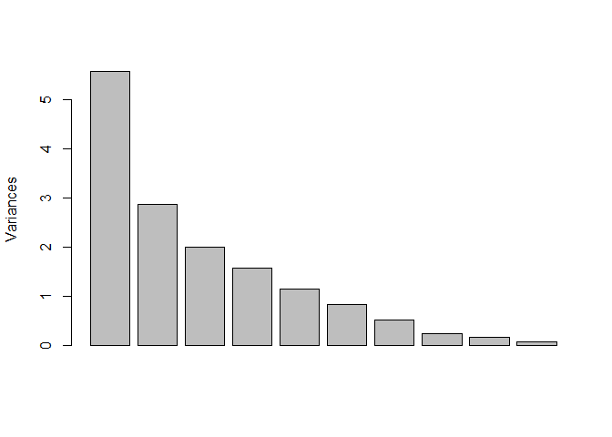
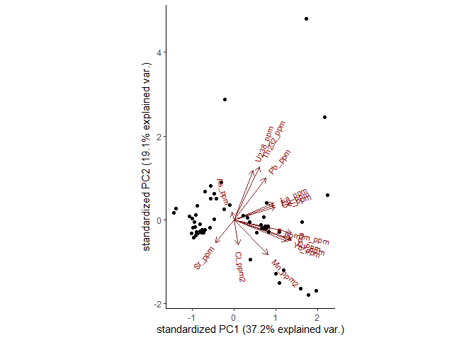
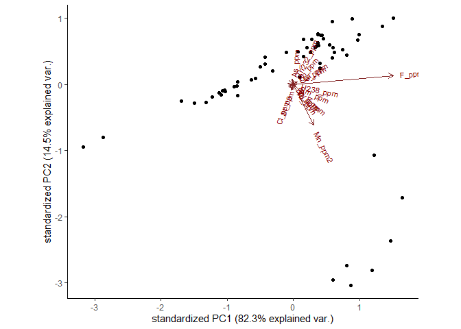
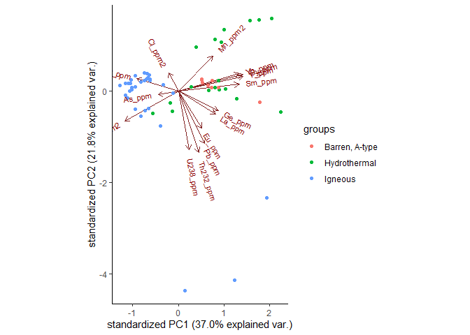
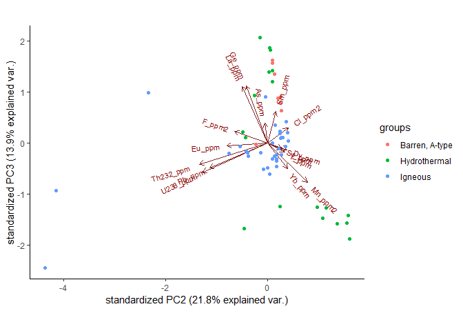
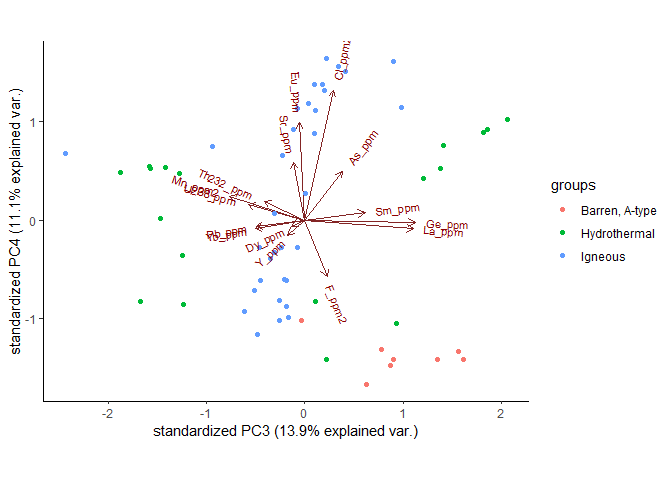
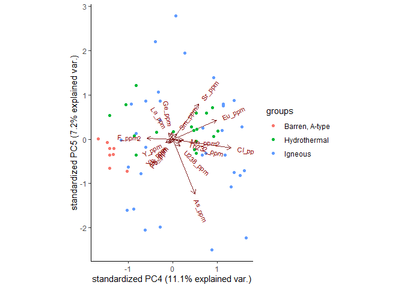

Part 2: Multivariate Discriminat Analysis in Apatite
================

**Summary**

[1. Introducing the Data and the
Methods](#1-introducing-the-data-and-the-methods)

[2. Compositional Data Analysis](#2-compositional-data-analysis)

[3. Principal Component Analysis](#3-principal-component-analysis)

## 1\. Introducing the Data and the Methods

As you probably have sensed after Part 1, examining all those boxplots
can be exaustive and somewhat inconclusive if you do not know what you
are looking for. A better way of evaluating geochemical data would be to
apply more advanced statistical techniques, generally referred to as
**multivariate discriminant analyses**, in which we reduce the
dimensionallity of the data. Each trace element, e.g. variable, opens up
a new mathematical dimension onto which the data may pivot itself.
Understanding the real geometrical dimension of this data may require
twell-known techniques in the machine learning toolbox, such as
Principal Component Analysis (PCA) and Linear Discriminant Analysis
(LDA), among others.

We start by importing the necessary libraries:

Then by reloading the
data:

``` r
geochem_ap <- read.csv2('C:/Users/Pedro/Documents/Rconsole/Apatite_git/geochem_ap.csv', 
                        header = TRUE, 
                        stringsAsFactors=TRUE, 
                        na = "NA",
                        dec = ".",
                        sep=";")
```

First, a short data cleaning. We need to transform some of the data that
we will use later into ppm:

``` r
#Fixing pct to ppm
F_ppm2 <- (geochem_ap[,"F_pct"]*10000)
Mn_ppm2 <- (geochem_ap[,"Mn_pct"]*10000)
Cl_ppm2 <- (geochem_ap[,"Cl_pct"]*10000)

geochem_ap$F_ppm2=F_ppm2
geochem_ap$Mn_ppm2=Mn_ppm2
geochem_ap$Cl_ppm2=Cl_ppm2
```

## 2\. Compositional Data Analysis

The `compositions` package is a straightforward method to log transform
the data. Next, we will perform a Principal Component Analysis. Before
that, transforming the data into real compositions is advisable through
`rcomp`:

``` r
clo_ap <- rcomp(geochem_ap)
```

## Principal Component Analysis

We will firstly analyse which elements we have obtained in our
experiments:

``` r
names(clo_ap)
```

    ##  [1] "Sample_ID"  "Sample"     "Deposit"    "Nature"     "Zone"      
    ##  [6] "Class"      "CL"         "F_pct"      "Si_pct"     "Mg_pct"    
    ## [11] "Na_pct"     "Ca_pct"     "P_pct"      "Cl_pct"     "Fe_pct"    
    ## [16] "Mn_pct"     "Ce_pct"     "La_pct"     "Nd_pct"     "B_ppm"     
    ## [21] "Mg_ppm"     "Si_ppm"     "P_ppm"      "Ca_ppm"     "Sc_ppm"    
    ## [26] "Ti_ppm"     "V_ppm"      "Mn_ppm"     "Fe_ppm"     "Ga_ppm"    
    ## [31] "Ge_ppm"     "As_ppm"     "Rb_ppm"     "Sr_ppm"     "Y_ppm"     
    ## [36] "Zr_ppm"     "Nb_ppm"     "Ba_ppm"     "La_ppm"     "Ce_ppm"    
    ## [41] "Pr_ppm"     "Nd_ppm"     "Sm_ppm"     "Eu_ppm"     "Gd_ppm"    
    ## [46] "Tb_ppm"     "Dy_ppm"     "Ho_ppm"     "Er_ppm"     "Tm_ppm"    
    ## [51] "Yb_ppm"     "Lu_ppm"     "Hf_ppm"     "Ta_ppm"     "Pb_ppm"    
    ## [56] "Th232_ppm"  "U238_ppm"   "X"          "U238_ppm.1" "F_ppm2"    
    ## [61] "Mn_ppm2"    "Cl_ppm2"

There are a total of 51 elements. From understanding the distribution of
these elements in apatite, I have already highlighted those that will
probably offer an interesting response, since I have already from
researched the literature. The selected elements were Mn, Sm, Eu, Dy,
Yb, Y, F, La, Pb, Th, U, Ge, Cl, Sr and As. Of course, I am only able to
confidently select those elements because I am a geologist by trade.
However, PCA is an unsupervised method. This means that PCA may be used
even if we do not know anything about the data. PCA would still
delineate the most important discriminants even if all of the data was
plotted. However, even though these unsupervised methods are flexible,
they are just harder to interpret if we cannot recognise the nature of
the patterns that have just emerged. Therefore, they are best to be used
if you have a good understanding of the nature of the data – which is my
case with geochemical data, at least.

To execute the PCA, we cannot have NA values. So, we define how many
there are by:

``` r
sum(is.na(clo_ap[,c(31,32,34,35,39,43,44,47,51,55,56,57,60,61,62)]))
```

    ## [1] 771

And we delete the rows that contain these
values:

``` r
pca <- clo_ap[,c(31,32,34,35,39,43,44,47,51,55,56,57,60,61,62)] #Take columns in: Apatite
pca = na.omit(pca)
dim(pca)
```

    ## [1] 59 15

It is important to know that these rows do not contain elements that
were below the detection limits in the geochemical analyses. We followed
the convention in which element concentrations below the detection
limits were considered to have half the value of the detection limits to
enhance data availability for the discriminant analysis. Therefore, the
elements deleted in the prior stage were primarily related to
incongruencies in the table format because of the integration of
multiple geochemical sources of data in the dataset.

Even then, are 59 samples sufficient for a reliable principal component
analysis? That’s arguable, for certain. In what regard unsupervised
methods, the greater the sample size the better. We certainly shall
interpret this data with a grain of salt, but we may also later observe
bigger datasets from other studies to compare the reliability of the
performance in our dataset.

So, we perform the principal component
analysis:

``` r
pr.out = prcomp(pca, center=TRUE, scale=TRUE) #find the principal components
summary(pr.out) #expose the values for each individual principal component
```

    ## Importance of components:
    ##                           PC1    PC2    PC3    PC4     PC5    PC6     PC7
    ## Standard deviation     2.3613 1.6914 1.4111 1.2507 1.06537 0.9058 0.71852
    ## Proportion of Variance 0.3717 0.1907 0.1328 0.1043 0.07567 0.0547 0.03442
    ## Cumulative Proportion  0.3717 0.5624 0.6952 0.7995 0.87512 0.9298 0.96424
    ##                            PC8     PC9    PC10    PC11    PC12    PC13
    ## Standard deviation     0.48204 0.39147 0.26533 0.19854 0.14956 0.09671
    ## Proportion of Variance 0.01549 0.01022 0.00469 0.00263 0.00149 0.00062
    ## Cumulative Proportion  0.97974 0.98995 0.99465 0.99727 0.99876 0.99939
    ##                           PC14    PC15
    ## Standard deviation     0.08295 0.04787
    ## Proportion of Variance 0.00046 0.00015
    ## Cumulative Proportion  0.99985 1.00000

``` r
plot(pr.out,main="") #scree plot
```

<!-- -->

``` r
# plot it in a biplot
ggbiplot(pr.out, data=pca)# reducing it to the first and second principal components
```

<!-- -->

PCA is a multivariate statistical method that identifies the best
discriminant elements in apatite and which of these elements cluster
together towards specific geological processes.

Above, the principal component biplot is fixed to scale. That way,
problems regarding compositional data do not emerge. However, if we
change `scale=FALSE`, we find that:

``` r
pr.out_s = prcomp(pca, center=TRUE, scale=FALSE)
summary(pr.out_s)
```

    ## Importance of components:
    ##                            PC1      PC2      PC3      PC4     PC5
    ## Standard deviation     0.01164 0.004891 0.001539 0.001433 0.00082
    ## Proportion of Variance 0.82344 0.145250 0.014390 0.012470 0.00408
    ## Cumulative Proportion  0.82344 0.968690 0.983080 0.995540 0.99963
    ##                              PC6       PC7       PC8       PC9      PC10
    ## Standard deviation     0.0002093 0.0001083 5.854e-05 3.478e-05 2.738e-05
    ## Proportion of Variance 0.0002700 0.0000700 2.000e-05 1.000e-05 0.000e+00
    ## Cumulative Proportion  0.9998900 0.9999600 1.000e+00 1.000e+00 1.000e+00
    ##                             PC11      PC12      PC13      PC14      PC15
    ## Standard deviation     1.557e-05 1.231e-05 1.057e-05 7.969e-06 7.457e-06
    ## Proportion of Variance 0.000e+00 0.000e+00 0.000e+00 0.000e+00 0.000e+00
    ## Cumulative Proportion  1.000e+00 1.000e+00 1.000e+00 1.000e+00 1.000e+00

``` r
ggbiplot(pr.out_s, data=pca)# reducing it to the first and second principal components
```

<!-- -->

In this case, principal component arrow lengths are dependent on whether
the variables are near-constant (short arrows) or highly variable (long
arrows). In the covariance biplot, the longest arrows are F and Mn,
which coordinate most of the Principal Components 1 and 2, respectively.
They are the most abundant elements in apatite.

Since arrow lengths correspond to the sheer amount of element variation
in apatite, the most useful information out of the covariate biplot is
the angular difference (rotation) between the elemental variables.

Therefore, principal components are roughly merged in three separate
clusters: 1. Mn, Sm, Eu, Dy, Yb and Y. 2. F, La, Pb, Th, U and Ge. 3.
Cl, Sr and As.

To understand how these elements correspond to different geological
processes, we might include the inferred classes on the biplot:

``` r
#Merge numerical data with classes
geochem_ap2 <- geochem_ap[,c(1,2,3,4,5,6,31,32,34,35,39,43,44,47,51,55,56,57,60,61,62)]
geochem_ap2 = na.omit(geochem_ap2)
clo_ap1 <- rcomp(geochem_ap2)
clo_ap2 <- geochem_ap2[,c(1:6)]
clo_ap3 <- clo_ap1[,c(7:21)]

#A column for each category
geochem_ap_sample <- as.factor(clo_ap2$Sample)
geochem_ap_deposit <- as.factor(clo_ap2$Deposit)
geochem_ap_nature <- as.factor(clo_ap2$Nature)
geochem_ap_zone <- as.factor(clo_ap2$Zone)
geochem_ap_CL <- as.factor(clo_ap2$CL)

#Convert to PCA
pr.out2 = prcomp(center=TRUE, scale =TRUE, clo_ap3)

# plot it in biplots
ggbiplot(pr.out2, choices=1:2, data=pca, groups=geochem_ap_nature)# reducing it to the first and second principal components
```

<!-- -->

``` r
ggbiplot(pr.out2, choices=2:3, data=pca, groups=geochem_ap_nature)# reducing it to the second and third principal components
```

<!-- -->

``` r
ggbiplot(pr.out2, choices=3:4, data=pca, groups=geochem_ap_nature)# reducing it to the third and fourth principal components
```

<!-- -->

``` r
ggbiplot(pr.out2, choices=4:5, data=pca, groups=geochem_ap_nature)# reducing it to the fourth and fifth principal components
```

<!-- -->

Thus, we have a sense of how certain processes affect the distribution
of these trace elements. For a thoroughly discussion on the implications
of these patterns, see the complete dissertation
[here](http://hdl.handle.net/11449/193761).
