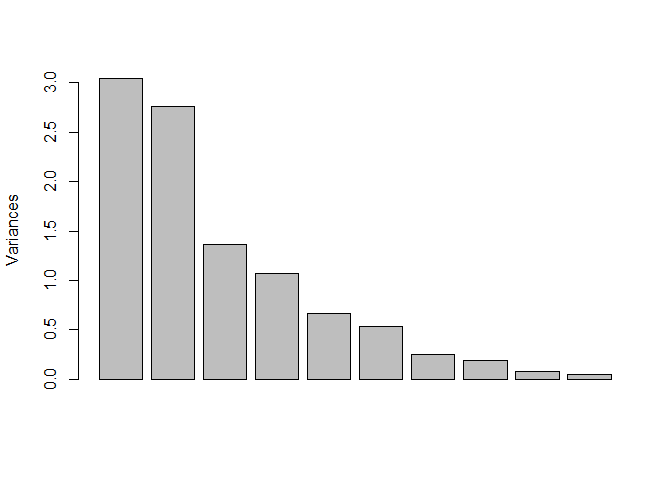
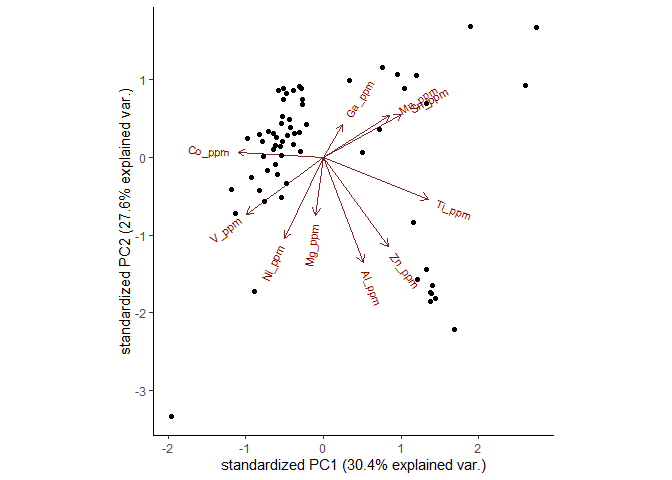
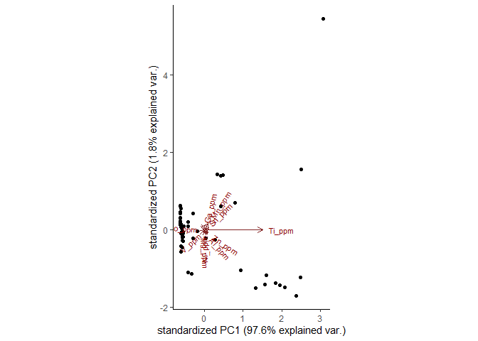
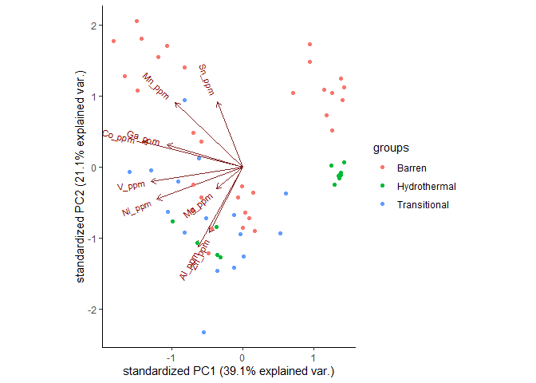
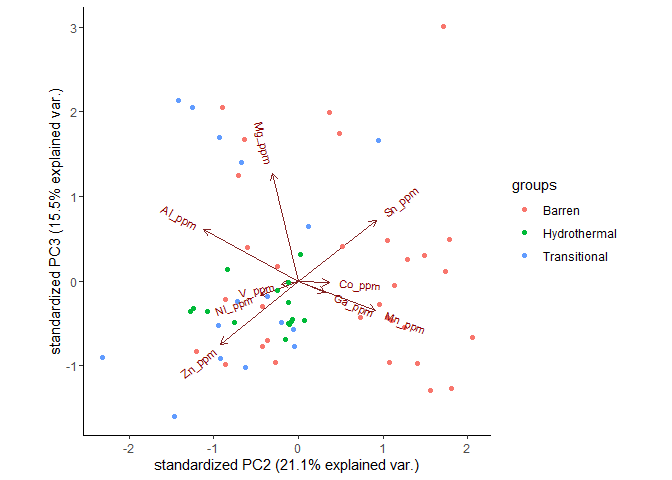
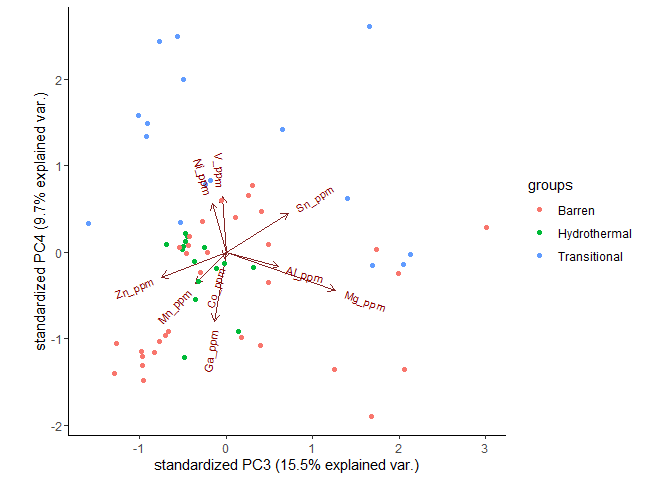
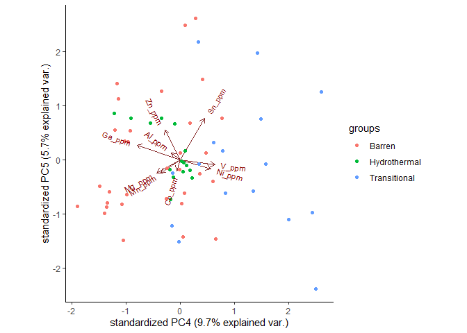

Part 2: Multivariate Discriminat Analysis in Apatite
================

## Table of contents

[1. Introducing the Data and the
Methods](#1-introducing-the-data-and-the-methods)

[2. Compositional Data Analysis](#2-compositional-data-analysis)

[3. Principal Component Analysis](#3-principal-component-analysis)

## 1\. Introduction

Mirroring the process in apatite, we import the libraries:

``` r
library(ggplot2) #for beautiful plots
  theme_set(theme_classic()) #to give plots a standard scientific flair
library(formattable) #for (somewhat) beautiful tables
                     #I was having trouble with 'gt' package)
library(compositions)#For Compositional Data Analysis (CoDA)
library (pls) #for PCA
library(ggbiplot) #sophisticated biplot for PCA
library(knitr) #for rendering it in the web
  knitr::opts_knit$set(root.dir= normalizePath('..'))
  knitr::opts_chunk$set(error = FALSE)
  knitr::opts_chunk$set(echo = TRUE)
```

Then by reloading the data:

``` r
geochem_mag <- read.csv2('C:/Users/Pedro/Documents/Rconsole/Magnetite_git/geochem_mag.csv', 
                        header = TRUE, 
                        stringsAsFactors=TRUE, 
                        na = "NA",
                        dec = ".",
                        sep=";")
```

There is no need to separate the data into granite-related and
volcaniclastic-related as we did in Part 1, since volcaniclastic-related
magnetite will not be shown since, for technical reasons, it was not
analysed via LA-ICP-MS, which would constitute the main method of
detection of trace elements.

## Principal Component Analysis

We will firstly analyse which elements we have obtained in our
experiments:

``` r
names(geochem_mag)
```

    ##  [1] "Sample_ID"  "Sample"     "Deposit"    "Zone"       "Alteration"
    ##  [6] "Na_pct"     "Al_pct"     "Si_pct"     "Mg_pct"     "Ca_pct"    
    ## [11] "K_pct"      "Ti_pct"     "Fe_pct"     "Mn_pct"     "Ni_pct"    
    ## [16] "Cr_pct"     "Li_ppm"     "Na_ppm"     "Mg_ppm"     "Al_ppm"    
    ## [21] "Si_ppm"     "Si_ppm.1"   "P_ppm"      "K_ppm"      "Ca42_ppm"  
    ## [26] "Ca44_ppm"   "Sc_ppm"     "Ti_ppm"     "V_ppm"      "Cr_ppm"    
    ## [31] "Mn_ppm"     "Fe_ppm"     "Co_ppm"     "Ni_ppm"     "Cu_ppm"    
    ## [36] "Zn_ppm"     "Ga_ppm"     "As_ppm"     "Se_ppm"     "Rb_ppm"    
    ## [41] "Sr_ppm"     "Y_ppm"      "Zr_ppm"     "Nb_ppm"     "Mo_ppm"    
    ## [46] "Cd_ppm"     "Sn_ppm"     "Cs_ppm"     "Ba_ppm"     "La_ppm"    
    ## [51] "Ce_ppm"     "Pr_ppm"     "Nd_ppm"     "Sm_ppm"     "Eu_ppm"    
    ## [56] "Gd_ppm"     "Tb_ppm"     "Dy_ppm"     "Ho_ppm"     "Er_ppm"    
    ## [61] "Tm_ppm"     "Yb_ppm"     "Lu_ppm"     "Hf_ppm"     "Ta_ppm"    
    ## [66] "W_ppm"      "Pb_ppm"     "Th_ppm"     "U_ppm"

There are a total of 69 elements. The selected elements were \[Mn, Sm,
Eu, Dy, Yb, Y, F, La, Pb, Th, U, Ge, Cl, Sr and As\]. To execute the
PCA, we cannot have NA values. So, we define how many there are by:

## 2\. Compositional Data Analysis

``` r
clo_mag <- acomp(geochem_mag)
```

``` r
sum(is.na(clo_mag))
```

    ## [1] 3105

And we delete the rows that contain these values:

Ti, Al, Zn, Mg, Mn, Sn, Ga, Co, V, and Ni.

The values were chosen part based on the multielemental boxplots made on
Part 1, and part based on the literature, such as Pisiak et al. (2017).

``` r
pca <- clo_mag[,c("Ti_ppm", "Al_ppm", "Zn_ppm", "Mg_ppm", "Mn_ppm", "Sn_ppm", 
              "Ga_ppm", "Co_ppm", "V_ppm", "Ni_ppm")]
pca = na.omit(pca)
dim(pca)
```

    ## [1] 63 10

We have 63 samples for the PCA:

``` r
pr.out = prcomp(pca, center=TRUE, scale=TRUE) #find the principal components
summary(pr.out) #expose the values for each individual principal component
```

    ## Importance of components:
    ##                           PC1    PC2    PC3    PC4     PC5     PC6     PC7
    ## Standard deviation     1.7444 1.6623 1.1685 1.0353 0.81603 0.72983 0.49914
    ## Proportion of Variance 0.3043 0.2763 0.1366 0.1072 0.06659 0.05327 0.02491
    ## Cumulative Proportion  0.3043 0.5806 0.7172 0.8244 0.89097 0.94424 0.96915
    ##                            PC8    PC9    PC10
    ## Standard deviation     0.42879 0.2829 0.21112
    ## Proportion of Variance 0.01839 0.0080 0.00446
    ## Cumulative Proportion  0.98754 0.9955 1.00000

``` r
plot(pr.out,main="") #scree plot
```

<!-- -->

``` r
# plot it in a biplot
ggbiplot(pr.out, data=pca)# reducing it to the first and second principal components
```

<!-- -->

If we change `scale=FALSE`, we find that:

``` r
pr.out_s = prcomp(pca, center=TRUE, scale=FALSE)
summary(pr.out_s)
```

    ## Importance of components:
    ##                            PC1      PC2      PC3      PC4       PC5
    ## Standard deviation     0.02407 0.003251 0.001551 0.001012 0.0006173
    ## Proportion of Variance 0.97556 0.017790 0.004050 0.001720 0.0006400
    ## Cumulative Proportion  0.97556 0.993350 0.997400 0.999130 0.9997700
    ##                              PC6       PC7       PC8       PC9      PC10
    ## Standard deviation     0.0003672 5.308e-05 2.026e-05 1.703e-05 7.432e-06
    ## Proportion of Variance 0.0002300 0.000e+00 0.000e+00 0.000e+00 0.000e+00
    ## Cumulative Proportion  0.9999900 1.000e+00 1.000e+00 1.000e+00 1.000e+00

``` r
ggbiplot(pr.out_s, data=pca)# reducing it to the first and second principal components
```

<!-- -->

We might include the inferred classes on the biplot:

``` r
#Merge numerical data with classes
geochem_mag2 <- geochem_mag[,c("Sample", "Deposit", "Zone", "Alteration",
                               "Ti_ppm", "Al_ppm", "Zn_ppm", "Mg_ppm", "Mn_ppm",
                               "Sn_ppm", "Ga_ppm", "Co_ppm", "V_ppm", "Ni_ppm")]
geochem_mag2 = na.omit(geochem_mag2)
clo_mag1 <- rcomp(geochem_mag2)
clo_mag2 <- geochem_mag2[,c(1:5)]
clo_mag3 <- clo_mag1[,c(6:14)]

#A column for each category
geochem_mag_sample <- as.factor(clo_mag2$Sample)
geochem_mag_deposit <- as.factor(clo_mag2$Deposit)
geochem_mag_zone <- as.factor(clo_mag2$Zone)

#Convert to PCA
pr.out2 = prcomp(center=TRUE, scale =TRUE, clo_mag3)

# plot it in biplots
ggbiplot(pr.out2, choices=1:2, data=pca, groups=geochem_mag_zone)# reducing it to the first and second principal components
```

<!-- -->

``` r
ggbiplot(pr.out2, choices=2:3, data=pca, groups=geochem_mag_zone)# reducing it to the second and third principal components
```

<!-- -->

``` r
ggbiplot(pr.out2, choices=3:4, data=pca, groups=geochem_mag_zone)# reducing it to the third and fourth principal components
```

<!-- -->

``` r
ggbiplot(pr.out2, choices=4:5, data=pca, groups=geochem_mag_zone)# reducing it to the fourth and fifth principal components
```

<!-- -->

For a thoroughly discussion on the implications of these patterns, see
the complete dissertation [here](http://hdl.handle.net/11449/193761).
